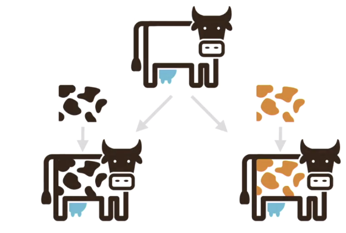

# Dockerfile

Dockerfile 是构建 Docker 镜像最好的方式，也是最推荐使用的方式。通过本文，读者将了解 Dockerfile 的构成以及如何通过 Dockerfile 构建 Docker 镜像，同时也将更深入理解 Docker 的分层存储机制。

**Docker的分层存储进阶**

在开篇中，对于 Docker 的分层存储是这么介绍的：

Docker 镜像是一个特殊的文件系统，类似于 Linux 的 root 文件系统，镜像提供了容器运行时所需的程序、库、资源、配置等文件，还包含了一些为运行时准备的一些配置参数。镜像是一个静态的概念，镜像不包含任何动态数据，其内容在构建之后也不会被改变。

由于镜像包含完整的 Linux root 文件系统，所以它可能会很庞大。因此，Docker 的设计者充分利用 Unions FS 技术，把 Docker 设计为分层存储的结构。什么意思呢？也就是说，镜像是分层构建的，每一层是上面一层的基础，每一层在构建完成之后都不会再发生变化。

这提醒我们，构建镜像的时候我们要保证每一层都只包含我们的应用需要的东⻄，不要包含不需要的文件，因为每一层在构建之后不再发生变化，所以即使你在之上的层删除了那些不需要的文件，这些文件也只是被标记为删除，实际上并没有真正删除。如果每一层都包含一些可有可无的文件，就会使得我们的镜像越来越臃肿。一个镜像实际上并不是一个文件，而是一组分层文件。分层存储还使得不同的镜像可以共享某些层，便于镜像的复用。

现在，我们对这段话做一个更加通俗和深入的解释。

这里，我们用到了 **写时拷贝(Copy On Write)** 的思想。现在，让我们用几幅 COW 的图片来说明写时拷贝的工作原理。首先，我们有一张没有斑点的奶牛图片（相当于我们有一个基础镜像）：


现在，我希望从这张图片得到一张有斑点的奶牛图像，我不是直接在这个原始图片画斑点，而是将斑点单独作为一层，把斑点层和原始图片叠加，就得到了斑点奶牛：


这样做有什么好处呢？设想一下，如果你直接把你想要的黑色斑点画到原图上，那么其他人想在原始的无斑点奶牛图片上做一些其它的创作就会很麻烦。但是，如果采取分层的方式，他们也只需要设计自己想要的斑点就可以了，从而原始的无斑点奶牛图片可以共享：



这样，每次你想查看自己的斑点奶牛的时候，就会把原始的无斑点奶牛复制一份给你，然后叠加你的斑点图层，你就可以看到你的斑点奶牛了。而你不查看的时候，原始的无斑点奶牛图片是共享存储的，这就是**写时拷贝**——只有在需要叠加斑点图给你看效果的时候才把原图拷贝一份给你，在拷贝的上面叠加一层来画斑点，否则，你与其他人的无斑点奶牛图层是共享存储的。

我们之前提到 Docker 镜像的分层存储和这个过程是很相似的。首先，你有一个**基础镜像（无斑点奶牛）**，你可以从这个基础镜像构建**自定义的新镜像（画斑点）**。你在构建新镜像的时候，并不是对原始镜像直接做修改，而是在其上创建一个新的存储层，在这个新的存储层上面作自定义的修改从而得到新的镜像。为了后面表述方便，我们姑且把原始镜像称为镜像 0，把你叠加一层新的存储层得到的新镜像称为镜像 1。

**注意：**现在我们仅仅在原始镜像叠加了一层，比如在镜像 1 的存储层安装了一些软件，添加了一些文本文件。现在，你希望以镜像 1 为基础镜像，再创建一个新镜像 2。在镜像 2 的存储层，你希望把在镜像 1 里安装的一些软件卸载，把一些文件删除，提交后得到新镜像 2。但是，你发现，新镜像 2 的体积根本就没有变小，甚至还多了几 MB，为什么会出现这种情况呢？这是因为，镜像是分层存储的，你在镜像 2 的存储层只是把你需要删除的内容**标记为删除**，实际上你并不能修改基础镜像 1 的存储层，也就是说，你想删除的内容依旧还在，只不过你在镜像 2 的存储层看不到它们了。

这就好比，你现在把褐色斑点奶牛作为基础图片，希望在褐色斑点奶牛的基础上设计新的斑点，那么你不能直接擦除黑色斑点奶牛的斑点，你只能在你的图层用白色把这些斑点覆盖，然后再画新的斑点。


从镜像的 pull 过程或者 commit 过程也可以看出镜像是**分层下载和提交**的：


运行容器的时候，实际是以镜像为基础层，在其上创建一个**容器的存储层**。容器存储层的生命周期和容器是一样的，所以我们**建议使用数据卷存储数据**，而**不要直接在容器的存储层写入数据**。

值得一提的是，分层存储机制使得镜像之间可以共享很多层，节约大量存储空间！

好了，相信介绍到这里，读者对于分层存储应该有一个清晰的理解了。之所以在这里介绍分层存储，是因为后文的 Dockerfile 的一些编写注意事项的提出需要在读者理解分层存储的基础上才能理解为什么我们会要求这些注意事项！

**Dockerfile初步**

Dockerfile 是一个文本文件，包含构建镜像的一条条指令，每一条指令构建一层，每一条指令描述当前层如何构建。

以 [Docker网络](#Docker网络) 的 net:v1.0 为例，如果使用 Dockerfile 构建的话应该按照如下步骤，首先新建一个空白目录，在这个目录下使用 `touch Dockerfile` 命令新建一个文本文件，文件内容如下：

```sh
FROM ubuntu:16.04

RUN apt-get update && apt-get install -y apt-utils
RUN apt-get install -y vim 
RUN apt-get install -y net-tools
RUN apt-get install -y iputils-ping
RUN apt-get install -y apache2
RUN apt-get install -y apache2-utils
RUN apt-get install -y openssh-server
RUN apt-get install -y openssh-client

RUN mkdir /var/run/sshd
RUN echo 'root:root' |chpasswd

RUN sed -ri 's/^PermitRootLogin\s+.*/PermitRootLogin yes/' /etc/ssh/sshd_config
RUN sed -ri 's/UsePAM yes/#UsePAM yes/g' /etc/ssh/sshd_config

EXPOSE 22

CMD ["/usr/sbin/sshd", "-D"]
```

下面，我们对 Dockerfile 里面用到的命令做一些解释：

**FROM**

FROM 指令指定基础镜像，我们定制的镜像是在基础镜像之上进行修改。FROM 指令必须是 dockerfile 文件的第一条指令。

举例：`FROM ubuntu:16.04`

**MAINTAINER**

用法：`MAINTAINER <name> <email>`

说明：描述镜像的创建者，名称和邮箱

**LABEL**

LABEL指令添加元数据到一个镜像。LABEL 是**键值对**。还有一个指令 MAINTAINER 用来添加维护者信息，不过现在推荐使用 LABEL 而不是 MAINTAINER。

举例：

```sh
LABEL "com.example.vendor"="ACME Incorporated"
LABEL com.example.label-with-value="foo"
LABEL version="1.0"
LABEL description="This text illustrates \
that label-values can span multiple lines."
```

**RUN**

RUN 是用来执行命令的，这条指令的格式有两种：

Shell 格式是 `RUN <命令>`，我们的 Dockerfile 就是使用的 Shell 格式。

exec 格式：`RUN [<可执行文件>，<参数1>，<参数2>，... ]`，和函数调用的格式很相似。

示例：

```sh
RUN apt-get install vim
RUN ["/bin/bash", "-c", "echo hello"]
CMD 与 ENTRYPOINT
```

> 说明：RUN命令是一个常用的命令，执行完成之后会成为一个新的镜像，这里也是指镜像的分层构建。一句RUN就是一层，也相当于一个版本。这就是之前说的缓存的原理。我们知道docker是镜像层是只读的，所以你如果第一句安装了软件，用完在后面一句删除是不可能的。所以这种情况要在一句RUN命令中完成，可以通过&符号连接多个RUN语句。RUN后面的必须是双引号不能是单引号（没引号貌似也不要紧），command是不会调用shell的，所以也不会继承相应变量，要查看输入RUN "sh" "-c" "echo" "$HOME"，而不是RUN "echo" "$HOME"。

**EXPOSE**

EXPOSE 用来暴露端口，格式为：`EXPOSE <端口1> [<端口2>……]`

值得注意的是，EXPOSE 只是声明运行容器时提供的服务端口，这仅仅是一个声明，在运行容器的时候并不会因为这个声明就会开启端口服务，你依旧需要使用 -P 或者 -p 参数映射端口。在 Dockerfile 中写这样的端口声明有助于使用者理解这个镜像开放哪些服务端口，以便配置映射。并且，可以在 docker run 命令执行的时候使用 -P 参数随机映射宿主主机端口到 EXPOSE 的容器端口。

**ENV**

ENV 命令用来 **设置环境变量**，其它指令可以使用这些环境变量。

ENV key value

ENV key1=value2 key2=value2

举例：

```sh
ENV myName="John Doe" myDog=Rex\ The\ Dog
myCat=fluffy

ENV myName John Doe
ENV myDog Rex The Dog
ENV myCat fluffy
```

**COPY 与 ADD**

COPY 复制文件：

- `COPY <源路径> <目标路径> `

- `COPY ["<源路径>", ..., "<目标路径>"]`

COPY 命令将上下文目录中的文件复制到镜像内的目标路径中，目标路径可以是绝对路径，也可以是由 WORKDIR 命令指定的相对路径（参见 WORKDIR 命令），目标路径无需事先创建，若不存在会自动创建。如果源是一个目录，只会复制目录下的内容，目录本身不会复制。

举例：

```dockerfile
COPY hom /mydir/    
COPY hom?.txt /mydir/   
ADD 高级的文件复制
```

ADD 命令格式和 COPY 完全一样，但是 ADD 命令会在复制的同时做一些额外的工作，比如，如果源路径是 URL，ADD 命令会下载文件再放到目标路径；如果是压缩文件，会解压后放到目标路径。由于这个命令的附加属性，推荐尽量使用 COPY，仅仅在需要自动解压缩或者下载的场合使用 ADD。

**VOLUME**

VOLUME 命令用来定义匿名卷。

- `VOLUME ["<路径1>", "<路径2>"...]`

- `VOLUME <路径>`

我们已经知道，不应该向容器存储层写入数据，应该写到数据卷里面。为了防止用户在运行容器的时候忘记挂载数据卷，可以在 Dockerfile 里先定义匿名卷，这样即使忘记挂载数据卷，容器也不会向容器存储层写入大量数据。这个命令不能指定主机的需要挂载到容器的文件夹路径，但`docker run -v`可以，而且其还可以挂载数据容器。

举例：`VOLUME /data`

**USER**

`USER <用户名>`

指定用户。这个命令会影响其后的命令的执行身份。当然，前提是你先创建用户。

举例：

```sh
RUN groupadd -r zsc && useradd -r -g zsc zsc
USER zsc
```

**WORKDIR**

`WORKDIR <工作目录路径>`

使用 WORKDIR 指定工作目录，以后各层的指令就会在这个指定的目录下运行。在这里，再提一下分层存储的概念，比方说你过你在 Dockerfile 里面这样写（假设你的 test.txt 文件在 /mydir 目录下）：

```sh
RUN cd /mydir
RUN echo "Hello world." > test.txt
```

在 docker build 的时候会报错，提示找不到 test.txt 文件，因为在第一层的 cd 切换目录并不会影响第二层。此时，你就应该使用 WORKDIR 命令。

举例：

```sh
WORKDIR /mydir
RUN echo "Hello world." > test.txt
```

可以使用多个WORKDIR指令，后续参数如果是相对路径，则会基于之前的命令指定的路径。如：WORKDIR  /home　　WORKDIR test 。最终的路径就是/home/test。path路径也可以是环境变量，比如有环境变量HOME=/home，WORKDIR $HOME/test也就是/home/test。

**ONBUILD**

用法：`ONBUILD [INSTRUCTION]`

说明：配置当前所创建的镜像作为其它新创建镜像的基础镜像时，所执行的操作指令。意思就是，这个镜像创建后，如果其它镜像以这个镜像为基础，会先执行这个镜像的ONBUILD命令。

**ARG**

`ARG <name>=<default value>`

ARG命令也是用来设置环境变量的，但是由此构建的镜像所运行的容器却不能使用这些变量。具体来说，ARG指令定义了用户可以在编译时或者运行时传递的变量，如使用如下命令：`--build-arg <varname>=<value>`

虽然容器无法看到 ARG 定义的变量，但是依旧不建议使用 ARG 参数传递密码，因为使用 `docker history` 命令依旧可以看到这些信息。

**CMD**

CMD是容器启动命令，和 RUN 命令类似，它也有两种格式：

shell 格式： CMD <命令>

exec格式： CMD [<可执行文件>，<参数1>，<参数2>，... ]

记得我们早就说过，容器不是虚拟机，容器的本质是进程。既然是进程，就需要指定进程运行的时候的参数和程序。CMD 就是为容器主进程启动命令而存在的。比如，在我们的文件中，我们使用 CMD 开启了 ssh 进程。

使用 CMD 命令的时候，初学者容易混淆 **前台运行** 和 **后台运行**。再强调一遍，Docker 不是虚拟机，容器是进程，所以容器中的应用都应该以前台模式运行，比如，如果你把我们的 Dockerfile 的最后一行写成 `CMD service ssh start`，那么我们使用 `docker run` 从镜像运行容器后，容器马上就退出了。这是因为，容器就是为了主进程而存在的，一旦执行完我们的 `service ssh start`，主进程就认为完成了任务，于是就退出了。所以，注意应该直接执行 sshd 可执行文件，并以前台模式执行：`CMD ["/usr/sbin/sshd", "-D"]`

**ENTRYPOINT**

ENTRYPOINT 命令和 CMD 一样有 shell 格式和 exec 格式，并且和 CMD 命令一样用来指定容器启动程序及参数。但是二者的适用场合有所不同。最重要的是，ENTRYPOINT 可以让我们把容器当成一条指令运行。下面，通过举例体会一下吧：

首先，使用如下 Dockerfile 创建一个镜像 **docker build -t cmd .**

```sh
FROM ubuntu:16.04
WORKDIR /
CMD ["ls"]
```

然后再使用如下 Dockerfile 创建一个镜像 **docker build -t etp .**

```sh
FROM ubuntu:16.04
WORKDIR /
ENTRYPOINT ["ls"]
```

现在分别从这两个镜像运行容器：


现在看起来没什么区别，接下来再从两个镜像分别运行容器，但是这次我们使用了 `ls` 命令的参数 `-l`：


现在，相信读者已经可以明白“ENTRYPOINT可以把容器当命令运行“这句话的含义了。


一个使用安装包安装的tomcat例子：

```sh
FROM centos
MAINTAINER nobody "xx@qq.com"
RUN mkdir -p /opt/jdk/
RUN mkdir -p /opt/tomcat/
ADD jdk1.7.0_79 /opt/jdk/
ADD tomcat  /opt/tomcat/
ENV CATALINA_HOME /opt/tomcat
ENV JAVA_HOME /opt/jdk
EXPOSE 8080
ENV PATH $PATH:$JAVA_HOME/bin
CMD ["/opt/tomcat/bin/catalina.sh","run"]
```


现在，让我们开始 **构建镜像** 吧，在Dockerfile所在的目录下执行以下指令：

```sh
docker build -t net:v1.2 .
```

 -t 参数后面指定镜像的名字。最后一个 "." 指的是当前目录。执行后，会得到类似下面的输出。

如果之前构建过这个镜像，你可以看到 step 中，都是"using cache"，并没有下载 apt install 需要的文件。如果你是第一次构建，可能会输出很多文件下载，更新等信息，并且构建速度取决于你的网速（因为要下载好多文件）。在这里，我想多讲一点，如果你使用一个 Dockerfile 构建过镜像，并且你没有删除这个镜像，那么在你第 2 次使用同一个 Dockerfile 构建镜像的时候，Docker不会重新下载文件，而是使用之前构建好的"cache"。那么，请读者思考一下，这些"cache"是什么呢？没错，就是我们之前说的**分层存储的层**。

**重点来了**，这就告诉我们，我们应该将 Dockerfile 里很少变动的部分写在前面，因为每一行指令都构建一层，层层叠加，如果 Dockerfile 里开始若干行是相同的话，那么即使是新的 Dockerfile 也可以在构建的时候共享之前的"cache"。换句话说，一个 Dockerfile 在构建的时候，如果发现本地有可用的"cache"，就不会去重新下载和构建这些层，直到遇到第一处不同的指令，无法使用"cache"，才会下载和构建。（全新的构建是从 Dockerfile 的第一处改动开始的，在此之前只是在使用之前构建好的层！）

好了，现在让我们从这个镜像运行一个容器：

```sh
docker run --name sshtest --rm -d -p 6666:22 net:v1.2
```

这里的 --rm 参数的作用是容器终止后立刻删除。

然后使用 `docker inspect sshtest` 查看容器网址为172.17.0.3，现在使用 ssh 登录（密码：root）

在 ssh 的时候你可能会遇到如下问题：


解决的办法是：`ssh-keygen -R yourIP`（上图有具体例子）

好了，第一个Dockerfile定制镜像到此为止就完成了，但是，还记得我们之前提到过的吗？我们不推荐使用commit来构建镜像，给的理由之一是会使我们的镜像越来越臃肿！但是，现在我们的新镜像真的比原来使用commit得到的镜像更精简吗？

我们发现使用Dockerfile得到的镜像竟然更大！！！现在你的心里一定有一句 MMP 要跟我说吧！？ “宝宝费了这么大劲学习Dockerfile，最后结果竟然更差？”下面，我就来解释一下为什么吧。

使用commit提交镜像的缺点我们之前提到过，现在复习一下。使用docker commit提交镜像主要有两个缺点：其一，你的镜像会变成一个黑盒，除了本人，别人很难知道镜像里发生过的操作；其二，由于镜像的分层存储，会有大量冗余数据，使得镜像越来越臃肿。

而Dockerfile解决了这些问题。首先，编写Dockerfile可以很清楚地表述镜像构建的过程；第二，可以让我们的镜像很清爽，不会很臃肿。

可是刚才我们使用Dockerfile构建的镜像甚至比使用commit构建的同样功能镜像还要臃肿，这又怎么解释呢？这其实是因为我们的Dockerfile写得太随意了！！之前说过，Dockerfile的每一条指令都会构建一层，RUN命令也不例外，每一个RUN命令都会像我们手动构建的过程一样，新建立一层，在这个新的一层上做修改后提交，所以我们刚刚的例子构建的镜像足足有15层！！！这种写法是很不好的，会把很多容器运行时不需要的东西装到镜像里面，结果就让镜像很臃肿。解决的办法是把可以在同一层执行的命令尽可能放在一层去执行，并且执行完的同时在这一层清理不需要的东西，所以我们的 Dockerfile推荐下面这种写法（使用&&符号把命令串联起来）：

```sh
FROM ubuntu:16.04

RUN softwares='apt-utils vim net-tools iputils-ping apache2 apache2-utils openssh-server openssh-client' && apt-get update && apt-get install -y $softwares && rm -rf /var/lib/apt/lists/* 

RUN mkdir /var/run/sshd
RUN echo 'root:root' |chpasswd

RUN sed -ri 's/^PermitRootLogin\s+.*/PermitRootLogin yes/' /etc/ssh/sshd_config
RUN sed -ri 's/UsePAM yes/#UsePAM yes/g' /etc/ssh/sshd_config

EXPOSE 22

CMD ["/usr/sbin/sshd", "-D"]
```

 再次构建：

```sh
docker build -t net:v1.1 .
```

这次我们构建的镜像只有303M，比 commit得到的镜像少了33MB。你可能对这种程度的减少并不满意，因为镜像体积的减小实在有限。其实这是因为我们的这个镜像本来就是为了安装这些软件，所以只能删掉一些sourlist的缓存信息。如果你构建一个镜像是为了编译某个程序，那么在你编译完之后可以使用 **apt-get purge -y --auto-remove XXX** 把一些编译环境和无用的软件删除掉，这样的话我们的镜像就会变得更精简。

读到这里，读者应该对如何使用 Dockerfile 构建镜像有了一定的了解。我们使用 docker build 命令构建镜像：**docker built -t name <上下文路径>/URL/...**。现在，让我们详细谈谈这个构建命令，你应该已经注意到，docker build 命令的最后有一个 **.** 号，表示当前目录，并且 Dockerfile 也在这个目录。所以读者可能会以为命令里的“上下文路径”就是 Dockerfile 所在的目录。

但不幸的是，这样理解并不对。为了解释“上下文路径”的意思，需要我们对 Docker 的架构有一点了解。Docker 使用典型的客户端-服务端（C/S）架构，通过远程API管理和创建容器。进行镜像构建的时候，Docker会将上下文路径下的命令打包传给服务端，在服务端构建镜像（当然，在我们的教程里，服务端也运行在本机，是以一个 Docker 后台服务端进程在运行）。所以有一些命令比如 COPY 需要使用相对路径复制本地文件到容器。但是，习惯上我们把 Dockerfile 放在一个空目录下，并把文件命名为 Dockerfile，因为如果不手动指定Dockerfile 的话，上下文目录下名字为 Dockerfile 的文件默认被当做构建镜像使用的 Dockerfile。同时，习惯上也把一些必须的文件复制到 Dockerfile 所在的目下。此时，Dockerfile 所在的目录就是上下文目录。

