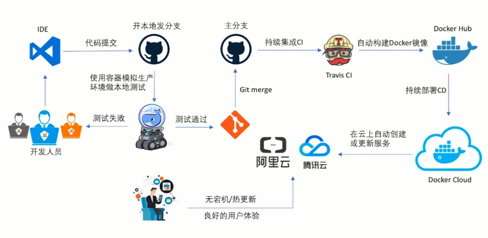

# Gitlab安装

GitLab是一个基于Git的平台，集成了大量用于软件开发和部署以及项目管理的基本工具。



参考：

- [官方文档](https://docs.gitlab.com/ee/README.html)
- [官方项目](https://gitlab.com/gitlab-org/gitlab-ce)


## 用docker安装Gitlab

界面：[http://121.196.182.26:6080](http://121.196.182.26:6080)

使用 `docker-compose` 管理 `gitlab` 和 `gitlab-runner` 容器镜像

```sh
# 安装方法1：
curl -L https://github.com/docker/compose/releases/download/1.26.0/docker-compose-`uname -s`-`uname -m` > /usr/local/bin/docker-compose
# 加执行权限
chmod +x /usr/local/bin/docker-compose

# 安装方法2：
# 安装python-pip
yum -y install epel-release
yum -y install python-pip
# 安装docker-compose
pip install docker-compose

# 查看版本信息
docker-compose --version

# 编辑compose文件
cd /home/colin
vim /home/colin/docker-compose.yml
```

docker-compose.yml:

```yml
version: '2'
services:
  gitlab:
    image: gitlab/gitlab-ce
    restart: always
    hostname: gitlab
    container_name: gitlab
    ports:
      - 6080:80
      - 6443:443
      - 6222:22
    volumes:
      - /srv/gitlab/conf:/etc/gitlab
      - /srv/gitlab/logs:/var/log/gitlab
      - /srv/gitlab/data:/var/opt/gitlab
  gitlab-runner:
    image: gitlab/gitlab-runner
    restart: always
    hostname: gitlab-runner
    container_name: gitlab-runner
    depends_on:
      - gitlab
    volumes:
      - /srv/gitlab/runner:/etc/gitlab-runner
```

执行compose:

```sh
docker-compose down
docker-compose up -d
```

`gitlab` 成功启动后连接到 `gitlab-runner` 配置 `gitlab` 的 `gitlab-runner`

**谨记：关闭防火墙。如果同一个网桥中的容器无法通信，那么，重启docker服务！**

```sh
# 连接进入 gitlab-runner 容器
docker-compose exec gitlab-runner sh
# 进入容器后执行的命令
gitlab-runner register
------------------------------------------------------------------
Please enter the gitlab-ci coordinator URL (e.g. https://gitlab.com/):
http://172.18.0.2/                     # gitlab 的访问路径
Please enter the gitlab-ci token for this runner:
wTGKzEhh7SHQQ7e7TaKJ                   # 注册令牌，在 gitlab 中获取
Please enter the gitlab-ci description for this runner:
[gitlab-runner]: runner1               # runner 的名字
Please enter the gitlab-ci tags for this runner (comma separated):
no1                                    # runner 的 tag
# Registering runner... succeeded        runner=JLP2Rk2q
Please enter the executor: docker-ssh, parallels, docker+machine, docker-ssh+machine, docker, shell, ssh, virtualbox, kubernetes:
docker                                 # 使用 docker 作为输出模式
Please enter the default Docker image (e.g. ruby:2.1):
mcr.microsoft.com/dotnet/core/aspnet:3.1-buster-slim                          # 使用的基础镜像
# Runner registered successfully. Feel free to start it, but if it's running already the config should be automatically reloaded!
------------------------------------------------------------------
# 注册成功后会显示以上信息，然后执行下面的命令进行启动
# 启动该 runner
gitlab-runner start
```

按上面的方式，gitlab容器运行没问题，但在gitlab上创建项目的时候，生成项目的URL访问地址是按容器的hostname来生成的，也就是容器的id。作为gitlab服务器，我们需要一个固定的URL访问地址，于是需要配置gitlab.rb。

```sh
# 添加或编辑 
vim /etc/gitlab/gitlab.rb
# 配置http协议所使用的访问地址,不加端口号默认为80
external_url 'http://gitlab.colin.com'

# 配置ssh协议所使用的访问地址和端口
gitlab_rails['gitlab_ssh_host'] = 'gitlab.colin.com'
gitlab_rails['gitlab_shell_ssh_port'] = 6222 # 此端口是run时22端口映射的6222端口
:wq #保存配置文件并退出

# 运行重载命令使配置生效
sudo gitlab-ctl reconfigure
# 重启gitlab容器
docker restart gitlab
```


## 在CentOS7上安装GitLab

1. 在CentOS 7（和RedHat/Oracle/Scientific Linux 7）上，以下命令将在系统防火墙中打开HTTP和SSH访问

   ```sh
   sudo yum install -y curl policycoreutils-python openssh-server
   sudo systemctl enable sshd
   sudo systemctl start sshd
   sudo firewall-cmd --permanent --add-service=http
   sudo systemctl reload firewalld
   ```

   接下来，安装Postfix以发送通知电子邮件。如果要使用其他解决方案发送电子邮件，请跳过此步骤并在安装GitLab后配置外部SMTP服务器。

   ```sh
   sudo yum install postfix
   sudo systemctl enable postfix
   sudo systemctl start postfix
   ```

   在Postfix安装期间，可能会出现配置屏幕。选择"Internet Site"并按Enter键。使用服务器的外部DNS作为“邮件名称”，然后按Enter键。如果出现其他屏幕，请继续按Enter键接受默认值。

2. 添加GitLab软件包存储库并安装软件包

   添加GitLab（社区版）包存储库：

   接下来，安装GitLab包。更改 `https://gitlab.example.com` 为您要访问GitLab实例的URL。安装将自动配置并启动该URL的GitLab。

   ```sh
   curl -s https://packages.gitlab.com/install/repositories/gitlab/gitlab-ce/script.rpm.sh | sudo bash
   ```

   对于 `https://URL`，GitLab将自动使用Let's Encrypt请求证书，该证书需要入站HTTP访问和有效的主机名。您也可以使用自己的证书或只使用 `http://`。

   ```sh
   sudo EXTERNAL_URL="https://gitlab.example.com" yum install -y gitlab-ce
   ```

3. 浏览到主机名并登录

   在您第一次访问时，您将被重定向到密码重置屏幕。提供初始管理员帐户的密码，您将被重定向回登录屏幕。使用默认帐户的用户名root登录。

   有关安装和配置的详细说明，请参阅[文档](https://docs.gitlab.com/omnibus/README.html#installation-and-configuration-using-omnibus-package)。

4. 设置通信首选项

   访问我们的电子邮件订阅偏好中心，告知我们何时与您沟通。我们有明确的电子邮件选择加入政策，因此您可以完全控制我们向您发送电子邮件的频率和频率。

   每月两次，我们会发送您需要了解的GitLab新闻，包括我们开发团队的新功能，集成，文档和幕后故事。有关错误和系统性能的重要安全更新，请注册我们的专用安全通讯。

   >重要说明：如果您不选择加入安全通讯，则不会收到安全警报。


## 手动下载和安装GitLab包

安装pygpgme，一个允许yum处理gpg签名的包，以及一个名为yum-utils的包，其中包含安装源RPM所需的工具。

```sh
sudo yum install pygpgme yum-utils
```

您可能需要为系统安装EPEL存储库以安装这些软件包。如果您不安装pygpgme，GPG验证将无法正常工作。

创建一个名为/etc/yum.repos.d/gitlab_gitlab-ce.repo包含下面的存储库配置的文件。确保使用Linux发行版和版本替换下面配置中的el和6：

```ini
[gitlab_gitlab-ce]
name=gitlab_gitlab-ce
baseurl=https://packages.gitlab.com/gitlab/gitlab-ce/el/6/$basearch
repo_gpgcheck=1
gpgcheck=1
enabled=1
gpgkey=https://packages.gitlab.com/gitlab/gitlab-ce/gpgkey
       https://packages.gitlab.com/gitlab/gitlab-ce/gpgkey/gitlab-gitlab-ce-3D645A26AB9FBD22.pub.gpg
sslverify=1
sslcacert=/etc/pki/tls/certs/ca-bundle.crt
metadata_expire=300

[gitlab_gitlab-ce-source]
name=gitlab_gitlab-ce-source
baseurl=https://packages.gitlab.com/gitlab/gitlab-ce/el/6/SRPMS
repo_gpgcheck=1
gpgcheck=1
enabled=1
gpgkey=https://packages.gitlab.com/gitlab/gitlab-ce/gpgkey
       https://packages.gitlab.com/gitlab/gitlab-ce/gpgkey/gitlab-gitlab-ce-3D645A26AB9FBD22.pub.gpg
sslverify=1
sslcacert=/etc/pki/tls/certs/ca-bundle.crt
metadata_expire=300
```

os和dist参数的有效选项可以在我们在docs中支持的[OS列表](https://packagecloud.io/docs#os_distro_version)中找到。

通过运行更新本地yum缓存：

```sh
sudo yum -q makecache -y --disablerepo='*' --enablerepo='gitlab_gitlab-ce'
```

安装包：[https://packages.gitlab.com/gitlab/gitlab-ce](https://packages.gitlab.com/gitlab/gitlab-ce)

下载所需的软件包后，使用系统软件包管理工具进行安装。例如：

基于DEB(Ubuntu, Debian, Raspberry Pi)：

```sh
sudo EXTERNAL_URL="http://gitlab.example.com" dpkg -i gitlab-ee-9.5.2-ee.0_amd64.deb
```

基于RPM(CentOS, RHEL, Oracle, Scientific, openSUSE, SLES)：

```sh
sudo EXTERNAL_URL="http://gitlab.example.com" rpm -i gitlab-ee-9.5.2-ee.0.el7.x86_64.rpm
```

更改 `http://gitlab.example.com` 为您要访问GitLab实例的URL。安装将自动配置并启动该URL的GitLab。

示例：`sudo EXTERNAL_URL="http://gitlab.colin.com" rpm -i gitlab-ce-11.9.1-ce.0.el7.x86_64.rpm`


## 常用命令

```sh
# 查看版本号 12.3.5
cat /opt/gitlab/embedded/service/gitlab-rails/VERSION

# 备份。使用该命令会在/var/opt/gitlab/backups目录下创建一个名称类似为1393513186_gitlab_backup.tar的压缩包, 这个压缩包就是Gitlab整个的完整部分, 其中开头的1393513186是备份创建的日期.
gitlab-rake gitlab:backup:create

# 修改备份文件默认目录
vi /etc/gitlab/gitlab.rb
# gitlab_rails['backup_path'] = '/mnt/backups'
# 重载命令
gitlab-ctl reconfigure

# 从备份文件恢复
# 停止相关数据连接服务
gitlab-ctl stop unicorn
gitlab-ctl stop sidekiq
# 从1393513186编号备份中恢复
gitlab-rake gitlab:backup:restore BACKUP=1393513186
# 启动Gitlab
sudo gitlab-ctl start

# 设置SSH
# 在Git Bash中生成新key(RSA)：
ssh-keygen -o -t rsa -b 4096 -C "colin.chen@softtek.com"
# 添加或更改密码：ssh-keygen -p -o -f <keyname>
# 接下来将SSH密钥添加到GitLab帐户
# 在Git Bash中查看密钥(RSA)并复制：
cat ~/.ssh/id_rsa.pub | clip
# 打开gitlab，找到Profile Settings-->SSH Keys--->Add SSH Key，
# 并把上一步中复制的内容粘贴到Key所对应的文本框：
# http://<server-ip>/profile/keys
# 测试示例：
ssh -T git@192.168.235.128
```


