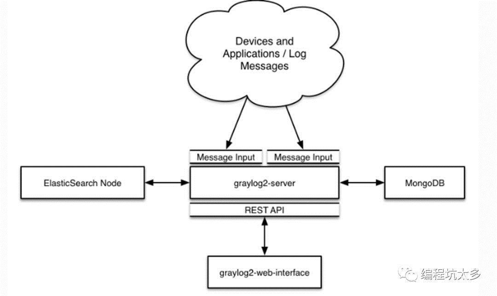

# Docker搭建日志中心

**为什么要进行日志收集？**

应用程序跑在集群中，产生很多的日志，日志中包含着程序运行的情况的纪录，查看单个机器的日志过程繁琐，所以需要统一的日志管理平台对日志进行统一处理，将所有应用程序的日志收集起来，可以对日志进行存储、归档、查询、状态判断。

例如负载均衡的情况，nginx下面很多的web服务，如果查看日志的话需要进入多个tomcat一个一个看麻烦吧。

1. ELK技术解决方案把tomcat收集起来

2. Graylog+mongo+elasticsearch 日志收集机器。



**搭建日志系统**

安装要求：docker、docker-compose

配置文件：docker-compose.yml

```yml
some-mongo:
  image: "mongo:3"
  volumes:
    - /opt/graylog/data/mongo:/data/db
some-elasticsearch:
  image: "elasticsearch:latest"
  command: "elasticsearch  -Des.cluster.name='graylog'"
  volumes:
    - /opt/graylog/data/elasticsearch:/usr/share/elasticsearch/data
graylog:
  image: graylog2/server
  volumes:
    - /opt/graylog/data/journal:/usr/share/graylog/data/journal
    - /opt/graylog/config:/usr/share/graylog/data/config
  environment:
    GRAYLOG_PASSWORD_SECRET:somepasswordpepper
    GRAYLOG_ROOT_PASSWORD_SHA2:8c6976e5b5410415bde908bd4dee15dfb167a9c873fc4bb8a81f6f2ab448a918
    GRAYLOG_REST_TRANSPORT_URI: http://192.168.30.3:12900
  links:
    - some-mongo:mongo
    - some-elasticsearch:elasticsearch
  ports:
    - "9000:9000"
    - "12900:12900"
    - "12201:12201/udp"
    - "1514:1514/udp"
```

graylog直接下载官方推荐配置文件

```sh
wget https://raw.githubusercontent.com/Graylog2/graylog2-images/2.1/docker/config/graylog.conf
```

修改下载完的graylog.conf中的root_timezone为：

```ini
root_timezone = +08:00
```

日志配置文件

```sh
wget https://raw.githubusercontent.com/Graylog2/graylog2-images/2.1/docker/config/log4j2.xml
```

**启动运行：**`docker-compose up`

**配置graylog：**

- 页面：http://192.168.30.3:9000
- 用户名：admin
- 密 码：admin

**启动应用程序容器：**

```sh
docker run -d –name logtest –log-driver=gelf –log-opt gelf-address=udp://192.168.30.3:12201 ubuntu /bin/bash -c "while true;do echo hello;sleep 1;done"
```