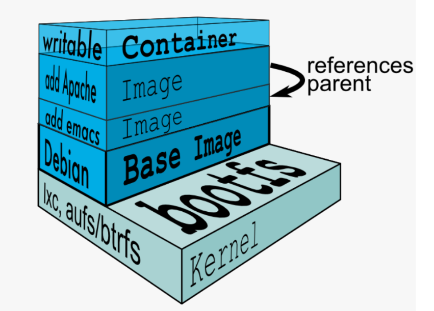
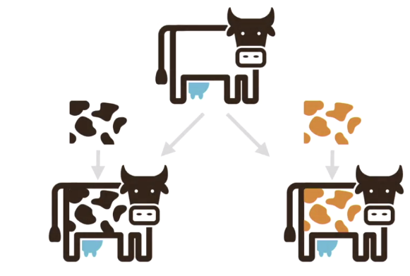
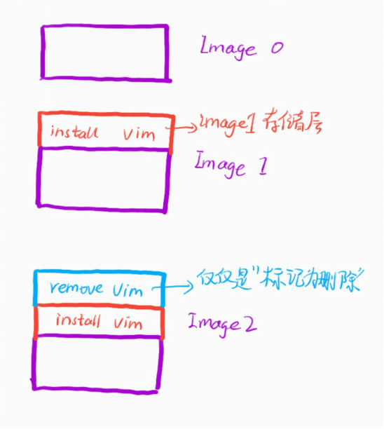
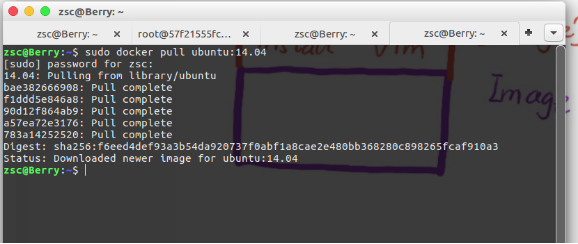
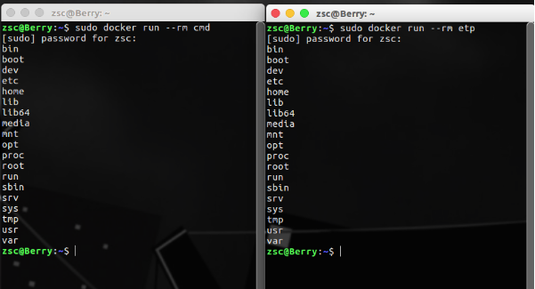
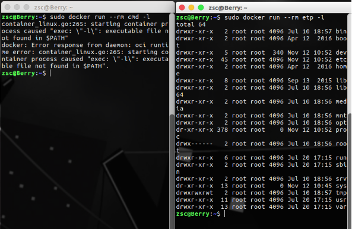
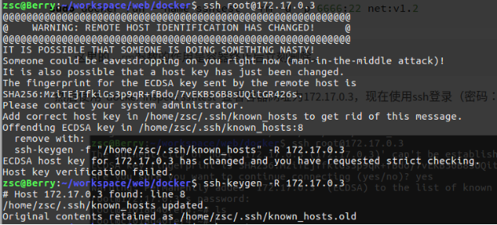

# 镜像概述

1. 简介
2. [仓储](#仓储)
3. 命令
   - [保存镜像](#保存镜像)
   - [载入镜像](#载入镜像)
4. [Dockerfile](#Dockerfile)


## 简介

Docker镜像(Image)就是一个只读的模板。例如：一个镜像可以包含一个完整的操作系统环境，里面仅安装了Apache或用户需要的其它应用程序。镜像可以用来创建Docker容器，一个镜像可以创建很多容器。

Docker提供了一个很简单的机制来创建镜像或者更新现有的镜像，用户甚至可以直接从其他人那里下载一个已经做好的镜像来直接使用。

镜像(Image)就是一堆只读层(read-only layer)的统一视角！

多个只读层重叠在一起。除了最下面一层，其它层都会有一个指针指向下一层。这些层是Docker内部的实现细节，并且能够在docker宿主机的文件系统上访问到。统一文件系统(Union File System)技术能够将不同的层整合成一个文件系统，为这些层提供了一个统一的视角，这样就隐藏了多层的存在，在用户的角度看来，只存在一个文件系统。

**什么是Image？**

- 文件和 meta data 的集合(root filesystem)
  1. 对于 linux 系统来说就是内核空间(kernel space)和用户空间(user space)，内核空间linux kernel，就理解成root filesystem
  2. 用户空间就是在内核上层建立的，其实就是：ubuntu，centos，redhat，Debian。

- 分层的，并且每一层都是可以添加改变的，成为一个新的Image。例如：先建立个 apache 的 Image，结果在 apache 的 Image 上边我有建立一个 mysql 的 Image。

- 不同的 Image 之前可以共享分层。例如：apache 的 Image 可以跟 mysql 的 Image 之间进行通信。

- Image 本身是只读的



**开始Image的表演**

```sh
# 首先启动vagrant创建的虚机
vagrant reload
# 进入
vagrant ssh
sudo service docker restart
sudo docker version
# 挂个国内的加速器
sudo curl -sSL https://get.daocloud.io/daotools/set_mirror.sh | sh -s http://b81aace9.m.daocloud.io
sudo systemctl restart docker
# 查看Image
sudo docker image ls


# 获取Image

# 1、bulid from Dockerfile
ls
cd labs
cd docker-centos-vim/
ls
pwd
more Dockerfile
----------------------------------------
FROM centos
RUN vum install -v vim
----------------------------------------
sudo service docker restart
sudo docker build -t liming/vim:latest .
# 这里注意里面一共用了两步，这个跟编写的Dockfile有关系，因为Dockfile也就两行。

# 2、Pull from Registry（从仓库中下载，这个概念有点像git的方式，其实docker就是模仿了git的方式，我们可以从https://hub.docker.com/pull，也可以把的Image push 到https://hub.docker.com/ 中）
sudo docker pull ubuntu:14.04
sudo docker image ls

# 1、liming/vim 是在centos之上的一个Image
# 2、因为Dockerfile中需要from centos 所以也下了centos Image
# 3、ubuntu 刚刚pull下来的
#   如果自己安装一个centos 和ubuntu 在虚拟机上也需要几个G吧，这里通过docker 才几百兆，是不是很省空间。
#   注意：从：https://hub.docker.com/ 中不仅仅可以下载官方的Image还可以下载私人的Image 
#   他们的区别是：官方的名字后面没有/，私人的：人名/Image的名称
# 4、通过版本号
sudo docker pull bitnami/wordpress:4
# 默认的latest
sudo docker pull bitnami/wordpress

# 进入容器内部
# 创建文件
touch test.txt
# 执行yum安装
yum install vim
# 从容器内部退出，容器也变成了exited
```

**手动建立一个base Image**

一. 通过 pull 的方式

```sh
docker pull hello-world
docker image ls
docker run hello-world
```

二. 通过 build 的方式

1、创建文件

```sh
mkdir hello-world
cd hello-world/
vim hello.c
```

2、编辑c文件

```c
#include<stdio.h>
int main()
{
    printf("hello docker");
}
```

3、编译程序gcc

```sh
sudo yum install -y gcc
sudo yum install -y glibc-static
gcc -static hello.c -o hello
```

4、创建编辑Dockerfile

```sh
vim Dockfile
---------------------------------------
FROM scratch
ADD hello /
CMD ["/hello"]
---------------------------------------
docker build -t liming/hello .
# 查看分层layer（通过image id）
docker history a4cb86cc8d6b
```

5、运行Image

```sh
docker run liming/hello
docker container ls -a
```


## 仓储

### 公共仓储

参考：[docker-hub官网](https://hub.docker.com/)

```sh
docker login
docker tag nginx:latest wind/nginx:v1
docker images wind/nginx:v1
docker push wind/nginx:v1
```

### 私有仓储

#### registry

[官方参考使用手册](https://docs.docker.com/registry/insecure/)

```sh
# 下载registry镜像
docker pull registry:2

# 运行registry镜像
docker run -d --name registry -p 5000:5000 -v /opt/registry:/var/lib/registry registry
   # -d     后台运行 
   # --name 给容器起名  
   # -p     映射端口  docker机端口（本地）：容器端口
   # -v     指定路径  本地路径：容器路径
   
# 按仓库格式打标签
docker tag webserver:v5  localhost:5000/webserver:latest

# 上传至私有仓库
docker push localhost:5000/webserver
```

启动 server2，并安装 docker 和 server1 一样。server1 配置了私有仓库，拿 server2 做测试，给 server2 配置加速器。

```sh
cat daemon.json
# -------------------------------------------------
{
  "insecure-registries" : ["1.2.3.1:5000"]
}
# -------------------------------------------------
```

**加密认证**

```sh
# 用openssl工具生成加密密钥对放到/root/certs目录下
openssl req -newkey rsa:4096 -nodes -sha256 -keyout certs/westos.org.key -x509 -days 365 \
-out /root/certs/westos.org.crt

# 停止registry运行或者直接删除
docker container stop registry 
# 或者 
docker rm registry

# 重启registry带有加密功能
docker run -d --name registry \
-p 443:443 \
-v /opt/registry:/var/lib/registry \
-v root/certs:/certs \
-e REGISTRY_HTTP_ADDR=0.0.0.0:443 \
-e REGISTRY_HTTP_TLS_CERTIFICATE=/certs/westos.org.crt \
-e REGISTRY_HTTP_TLS_KEY=/certs/westos.org.key \

# 把公钥传给给客户机或者自身（也可以是客户机），不然无法上传下载
mkdir /etc/docker/certs.d/reg.westos.org/ -p
cp /root/certs/westos.org.crt /etc/docker/certs.d/reg.westos.org/ca.crt

docker push reg.westos.org/webserver:v0  # 测试上传


# 加用户认证
yum install -y httpd-tools
mkdir /root/auth
htpasswd --help
htpasswd -B -c /root/auth/htpasswd haojin
htpasswd -B auth/htpasswd admin
cat auth/htpasswd 

docker rm -f registry 
docker run -d --name registry \
-p 443:443 \
-v /opt/registry:/var/lib/registry \
-v "$(pwd)"/certs:/certs \
-v "$(pwd)"/auth:/auth \
-e REGISTRY_HTTP_ADDR=0.0.0.0:443 \
-e REGISTRY_HTTP_TLS_CERTIFICATE=/certs/westos.org.crt \
-e REGISTRY_HTTP_TLS_KEY=/certs/westos.org.key \
-e "REGISTRY_AUTH=htpasswd" \
-e "REGISTRY_AUTH_HTPASSWD_REALM=Registry Realm" \
-e REGISTRY_AUTH_HTPASSWD_PATH=/auth/htpasswd registry

# 测试，这里不可以上传和下载
docker images 
docker tag ubuntu:latest reg.westos.org/ubuntu:latest
docker push reg.westos.org/ubuntu:latest

# 用户登陆仓库，测试就可以上传下载了
docker login reg.westos.org
docker push reg.westos.org/ubuntu:latest
# 登陆的密码信息保存目录：
/root/.docker/config.json
```

#### harbor

registry 有很多不足之处，没有扫描，签字，更没有 webUI 功能，这里继续学习一款企业级别的 docker 仓库管理工具：harbor。

首先清理之前搭建的私有仓库的环境，保留之前实验的加密和证书。

```sh
docker rm -f registry 
cd .docker/
rm -fr config.json
```

**1、安装harbor**

[下载地址](https://github.com/goharbor/harbor/releases)

```sh
# 解压离线安装包
pwd
/root/

tar zxf harbor-offline-installer-v1.10.1.tgz 

# 除了离线安装包，还需要docker-compose-Linux工具
mv docker-compose-Linux-x86_64-1.27.0 /usr/local/bin/docker-compose
chmod +x /usr/local/bin/docker-compose

# 修改harbor的配置文件
cd harbor/
vim harbor.yml
# -------------------------------------------
hostname: reg.westos.org
certificate: /root/certs/westos.org.crt
private_key: /root/certs/westos.org.key
harbor_admin_password: Harbor12345
data_volume: /data
# -------------------------------------------

# 在harbor目录下安装harbor
cd harbor/
./install.sh 
docker-compose ps
vim docker-compose.yml
```

现在可以在浏览器使用用户和密码登陆harbor了

上传 下载测试：

```sh
docker login reg.westos.org  # 需要先登陆
docker images
docker tag busybox:latest reg.westos.org/library/busybox  # 按格式打标签
docker push reg.westos.org/library/busybox:latest     # 上传
```

**扫描功能**

[官方参考链接](https://goharbor.io/docs/1.10/working-with-projects/working-with-images/pulling-pushing-images/)

依然在harbor目录下

```sh
docker-compose down  # 把之前的harbor容器删除
./prepare            # 清理缓存命令
./install.sh --help
    --with-notary      # 签名模块
    --with-clair       # 扫描模块
    --with-chartmuseum # K8S使用
   
./install.sh --with-clair  --with-notary --with-chartmuseum  #重新安装带扫描签名模块的harbor
docker-compose ps
docker login  reg.westos.org
```

“配置管理”页签打开“自动扫描镜像“

**签名**

```sh
# 部署根证书
cp /root/certs/westos.org.crt  /etc/docker/certs.d/reg.westos.org/ca.crt
mkdir  ~/.docker/tls/reg.westos.org:4443/ -p
cd /etc/docker/certs.d/reg.westos.org/
cp ca.crt ~/.docker/tls/reg.westos.org\:4443/

/etc/docker/certs.d/reg.westos.org/ca.crt
/root/.docker/tls/reg.westos.org:4443/ca.crt

# 启用docker内容信任
export DOCKER_CONTENT_TRUST=1    
export DOCKER_CONTENT_TRUST_SERVER=https://reg.westos.org:4443  

# 上传,下载镜像
docker images
docker pull reg.westos.org/westos/nginx
docker tag busybox:latest reg.westos.org/library/busybox：latest  # 按格式打标签
docker push reg.westos.org/library/busybox:latest                 # 上传
```

界面上可以配置未签名镜像无法下载！

取消签名机制

```sh
export DOCKER_CONTENT_TRUST=0

docker-compose down
./prepare
./install.sh --help
./install.sh --with-chartmuseum
```


## 命令

Docker系统有两个程序：docker服务端 和 docker客户端。其中 docker服务端 是一个服务进程，管理着所有的容器。docker客户端 则扮演着 docker服务端 的远程控制器，可以用来控制 docker 的服务端进程。大部分情况下，服务端 和 客户端 运行在一台机器上。

```sh
# 检查docker的版本，这样可以用来确认docker服务在运行并可通过客户端链接
docker version
```

镜像是包含创建容器所需的所有依赖项和信息的包。映像包括所有依赖项（例如框架）以及容器运行时使用的部署和执行配置。通常情况下，映像派生自多个基础映像，这些基础映像是堆叠在一起形成容器文件系统的层。创建后，映像不可变。

镜像是一个静态的概念，可以从一个镜像创建多个容器，每个容器互不影响！所谓“仓库”，简单来说就是集中存放镜像的地方。

Docker registry 是存储容器镜像的仓库，用户可以通过 Docker c1ient 与 Docker registry 进行通信，以此来完成镜像的搜索、下载和上传等相关操作。DockerHub 是由 Docker 公司在互联网上提供的一个镜像仓库，提供镜像的公有与私有存储服务，它是用户最主要的镜像来源。除了 DockerHub 外，用户还可以自行搭建私有服务器来实现镜像仓库的功能。

Docker 官方维护着一个公共仓库 [Docker store](https://store.docker.com/)，你可以方便的在 Docker store 寻找自己想要的镜像。当然，你也可以在终端里面登录：docker login 输入你的用户名和密码就可以登陆了。然后，可以使用 sudo docker search ubuntu 来搜索 Ubuntu 镜像

**查找镜像**

```sh
# 使用 docker search 命令可以搜索远端仓库中共享的镜像，默认搜索 Docker hub 官方仓库中的镜像。
# 示例：搜索 tomcat 镜像
docker search tomcat
```

**获取镜像**

```sh
# 使用 docker pull 从仓库获取所需要的镜像
# 实际上相当于  docker pull registry.hub.docker.com/<name>:<tag> 命令，即从注册服务器 registry.hub.docker.com 中的 <name> 仓库下载标记为 <tag> 的镜像。
# 有时候官方仓库注册服务器下载较慢，可以从其他仓库下载。从其它仓库下载时需要指定完整的仓库注册服务器地址。
# name：镜像名称
# tag：可以应用于映像的标记或标签，以便可以识别同一映像的不同映像或版本（具体取决于版本号或目标环境）。
docker pull centos:7
```

**查看镜像列表**

```sh
# 列出所有顶层（top-level）镜像
docker images
------------------------------------------------
REPOSITORY|TAG|IMAGE ID|CREATED|SIZE
-|-|-|-|-
centos|centos6|6a77ab6655b9|8 weeks ago|194.6 MB
ubuntu|latest|2fa927b5cdd3|9 weeks ago|122 MB
```

实际上，在这里我们没有办法区分一个镜像和一个只读层，所以我们提出了 top-level 镜像。只有创建容器时使用的镜像或者是直接 pull 下来的镜像能被称为顶层(top-level)镜像，并且每一个顶层镜像下面都隐藏了多个镜像层。

在列出信息中，可以看到几个字段信息

- 来自于哪个仓库，比如 ubuntu
- 镜像的标记，比如 14.04
- 它的 ID 号（唯一）
- 创建时间
- 镜像大小

**创建镜像**

```sh
docker commit
```

参数说明：

- -a, –author: 作者信息
- -m, –meassage: 提交消息
- -p, –pause=true: 提交时暂停容器运行

说明：基于已有的镜像的容器的创建。

```sh
# 以ubuntu为例子创建
docker pull ubuntu
# 运行ubuntu，-ti把容器内标准绑定到终端并运行bash，这样开跟传统的linux操作系统没什么两样
docker run -ti ubuntu bash
```

现在我们直接在容器内运行。这个内部系统是极简的，只保留一些系统运行参数，里面很多命令（vi）可能都是没有的。

```sh
# 退出容器
exit
# 容器创建成镜像的方法：docker commit
# 通过某个容器 <id> 创建对应的镜像，有点类似git
docker commit -a 'Colin Chen' -m 'This is a demo' d1d6706627f1 Colin/test
# 通过 docker images 发现里面多了一个镜像 Colin/test
```

**上传镜像**

```sh
# 用户可以通过 docker push 命令，把自己创建的镜像上传到仓库中来共享
# 例如，用户在 Docker Hub 上完成注册后，可以推送自己的镜像到仓库中。
docker push hainiu/httpd:1.0
```

**删除镜像**

```sh
# 删除构成镜像的一个只读层
docker rmi <image-id>
```

你只能够使用 `docker rmi` 来移除最顶层（top level layer）（也可以说是镜像），你也可以使用 `-f` 参数来强制删除中间的只读层

>注意：当同一个镜像拥有多个标签，`docker rmi` 只是删除该镜像多个标签中的指定标签而已，而不影响镜像文件。如果一个镜像只有一个tag的话，删除tag就删除了镜像的本身。

```sh
# 为一个镜像做一个tag
docker tag c9d990395902 Colin/ubuntu:test  
# 执行删除tag操作
docker rmi Colin/ubuntu:test
# 删除镜像操作
docker rmi ubuntu
```

如果镜像里面有容器正在运行，删除镜像的话，会提示error，系统默认是不允许删除的，如果强制删除需要加入 `-f` 操作，但是docker是不建议这么操作的，因为你删除了镜像其实容器并未删除，直接导致容器找不到镜像，这样会比较混乱。

```sh
# 运行一个镜像里面的容器
docker run ubuntu echo 'Hello World'
# 查看运行中的容器
docker ps -a
# 删除镜像，报错误error，有一个容器正在这个镜像内运行
docker rmi ubuntu  
# 强制删除
docker rmi -f ubuntu  
# 再次查看运行中的容器，已经找不到镜像（删除镜像未删除容器的后果）
```

**查看镜像操作记录**

```sh
docker history [name]
```

**给镜像设置一个新的仓库：版本对**

```sh
docker tag my_image:v1.0 my:v0.1
```

运行了上面的指令我们就得到了一个新的，和原来的镜像一模一样的镜像。

#### 保存镜像

```sh
# 创建一个镜像的压缩文件，这个文件能够在另外一个主机的 Docker 上使用。
docker save <image-id>
```

和 export 命令不同，这个命令为每一个层都保存了它们的元数据。这个命令只能对镜像生效。

使用示例：

```sh
# -o 和 > 表示输出到文件
docker save -o centos_images.tar centos:centos6
docker save > centos_images.tar centos:centos6
```

#### 载入镜像

```sh
# -i 和 < 表示从文件输入。会成功导入镜像及相关元数据，包括tag信息
docker load --input test.jar
# 可能这个镜像的名字不符合 docker 的要求，重新命名一下
docker tag <ImageId> <ImageName>
```

**查看镜像详细信息**

```sh
# inspect命令会提取出容器或者镜像最顶层的元数据，默认会列出全部信息
docker inspect <container-id> or <image-id>
# 查看镜像的某一个详细信息
docker inspect -f {{.os}} c9d990395902
```

说明：docker inspect 命令返回的是一个 JSON 的格式消息，如果我们只要其中的一项内容时，可以通过 -f 参数来指定。Image_id 通常可以使用该镜像ID的前若干个字符组成的可区分字符串来替代完成的ID。

**生成镜像**

**Dockerfile**：包含有关如何生成 Docker 映像的说明的文本文件。与批处理脚本相似，首先第一行将介绍基础映像，然后是关于安装所需程序、复制文件等操作的说明，直至获取所需的工作环境。

**生成**：基于其 Dockerfile 提供的信息和上下文生成容器映像的操作，以及生成映像的文件夹中的其他文件。可以使用 `docker build` 命令生成映像 。

**多阶段生成**：Docker 17.05 或更高版本的一个功能，可帮助减小最终映像的大小。概括来说，借助多阶段生成，可以使用一个包含 SDK 的大型基础映像（以此为例）编译和发布应用程序，然后使用发布文件夹和一个小型仅运行时基础映像生成一个更小的最终映像。

**多体系结构映像**：多体系结构是一项功能，根据运行 Docker 的平台简化相应映像选择。例如，Dockerfile 从注册表请求基础映像 
FROM mcr.microsoft.com/dotnet/core/sdk:2.2 时，实际上它会获得 2.2-nanoserver-1709、2.2-nanoserver-1803、2.2-nanoserver-1809 或 2.2-stretch，具体取决于操作系统和运行 Docker 的版本 。

**docker build：**

使用 docker commit 来扩展一个镜像比较简单，但是不方便在一个团队中分享。我们可以使用 docker build 来创建一个新的镜像。为此，首先需要创建一个 Dockerfile，包含一些如何创建镜像的指令。新建一个目录和一个 Dockerfile。

```sh
mkdir hainiu
cd hainiu
touch Dockerfile
```

Dockerfile 中每一条指令都创建镜像的一层，例如：

```Dockerfile
FROM centos:centos6
LABEL maintainer="chenxiao8516@163.com"
# move all configuration files into container
RUN yum install -y httpd
EXPOSE 80
CMD ["sh","-c","service httpd start;bash"]
```

Dockerfile基本的语法是：

- 使用#来注释
- FROM指令告诉Docker使用哪个镜像作为基础
- 接着是维护者的信息
- RUN开头的指令会在创建中运行，比如安装一个软件包，在这里使用yum来安装了一些软件
- 更详细的语法说明请参考[Dockerfile](https://docs.docker.com/engine/reference/builder/)

编写完成 Dockerfile 后可以使用 docker build 来生成镜像。

```sh
docker build -t hainiu/httpd:1.0 .
```

其中 -t 标记添加tag，指定新的镜像的用户信息。"." 是 Dockerfile 所在的路径（当前目录），也可以替换为一个具体的 Dockerfile 的路径。注意一个镜像不能超过127层。用 docker images 查看镜像列表

```sh
docker images
```

| REPOSITORY   | TAG     | IMAGE ID     | CREATED       | SIZE     |
| ------------ | ------- | ------------ | ------------- | -------- |
| hainiu/httpd | 1.0     | 5f9aa91b0c9e | 3 minutes ago | 292.4 MB |
| centos       | centos6 | 6a77ab6655b9 | 8 weeks ago   | 194.6 MB |
| ubuntu       | latest  | 2fa927b5cdd3 | 9 weeks ago   | 122 MB   |

细心的朋友可以看到最后一层的 ID(5f9aa91b0c9e) 和 image id 是一样的

示例1：

```dockerfile
# Use an official Python runtime as a parent image
FROM python:2.7-slim
# Set the working directory to /app
WORKDIR /app
# Copy the current directory contents into the container at /app
COPY . /app
# Install any needed packages specified in requirements.txt
RUN pip install --trusted-host pypi.python.org -r requirements.txt
# Make port 80 available to the world outside this container
EXPOSE 80
# Define environment variable
ENV NAME World
# Run app.py when the container launches
CMD ["python", "app.py"]
```

示例2：

```sh
# 后台模式运行：获得应用程序的长容器ID，然后被踢回终端
docker run -d -p 4000:80 friendlyhello

# 查看运行容器：
docker container ls
# List all containers, even those not running
docker container ls -a
# 结束运行：
docker container stop <containId>
# Force shutdown of the specified container
docker container kill <hash>
# Remove specified container from this machine
docker container rm <hash>
# Remove all containers
docker container rm $(docker container ls -a -q)

 # Create image using this directory's Dockerfile
docker build -t friendlyhello .
# Run image from a registry
docker run username/repository:tag
# Run "friendlyhello" mapping port 4000 to 80
docker run -p 4000:80 friendlyhello
# 查看新标记的图像：
docker image ls
# List all images on this machine
docker image ls -a
# Remove specified image from this machine
docker image rm <image id>
# Remove all images from this machine
docker image rm $(docker image ls -a -q)
# 登录公共镜像库：
docker login
# Tag <image> for upload to registry
docker tag <image> username/repository:tag
# 标记镜像：
docker tag friendlyhello wolfkings/get-started:part2
# Upload tagged image to registry
docker push username/repository:tag
# 发布镜像：
docker push wolfkings/get-started:part2

# 从公共存储库中拉出并运行映像：
docker run -d -p 4000:80 wolfkings/get-started:part2
```

**在容器中安装新的程序**

下一步我们要做的事情是在容器里面安装一个简单的程序(ping)。我们之前下载的tutorial镜像是基于ubuntu的，所以你可以使用ubuntu的apt-get命令来安装ping程序： `apt-get install -y ping`。

>备注：apt-get 命令执行完毕之后，容器就会停止，但对容器的改动不会丢失。

**目标**：在learn/tutorial镜像里面安装ping程序。

**提示**：在执行apt-get 命令的时候，要带上-y参数。如果不指定-y参数的话，apt-get命令会进入交互模式，需要用户输入命令来进行确认，但在docker环境中是无法响应这种交互的。

**正确的命令**：`docker run learn/tutorial apt-get install -y ping`


## Dockerfile

Dockerfile 是构建 Docker 镜像最好的方式，也是最推荐使用的方式。

**Docker的分层存储**

Docker 镜像是一个特殊的文件系统，类似于 Linux 的 root 文件系统，镜像提供了容器运行时所需的程序、库、资源、配置等文件，还包含了一些为运行时准备的配置参数。镜像是一个静态的概念，镜像不包含任何动态数据，其内容在构建之后也不会被改变。

由于镜像包含完整的 Linux root 文件系统，所以它可能会很庞大。因此，Docker 的设计者充分利用 Unions FS 技术，把 Docker 设计为分层存储的结构。什么意思呢？也就是说，镜像是分层构建的，每一层是上面一层的基础，每一层在构建完成之后都不会再发生变化。

这提醒我们，构建镜像的时候我们要保证每一层都只包含我们的应用需要的东⻄，不要包含不需要的文件，因为每一层在构建之后不再发生变化，所以即使你在之上的层删除了那些不需要的文件，这些文件也只是被标记为删除，实际上并没有真正删除。如果每一层都包含一些可有可无的文件，就会使得我们的镜像越来越臃肿。一个镜像实际上并不是一个文件，而是一组分层文件。分层存储还使得不同的镜像可以共享某些层，便于镜像的复用。

现在，我们对这段话做一个更加通俗和深入的解释。

这里，我们用到了 **写时拷贝(Copy On Write)** 的思想。现在，让我们用几幅 COW 的图片来说明写时拷贝的工作原理。首先，我们有一张没有斑点的奶牛图片（相当于我们有一个基础镜像）：


现在，我希望从这张图片得到一张有斑点的奶牛图像，我不是直接在这个原始图片画斑点，而是将斑点单独作为一层，把斑点层和原始图片叠加，就得到了斑点奶牛：


这样做有什么好处呢？设想一下，如果你直接把你想要的黑色斑点画到原图上，那么其他人想在原始的无斑点奶牛图片上做一些其它的创作就会很麻烦。但是，如果采取分层的方式，他们也只需要设计自己想要的斑点就可以了，从而原始的无斑点奶牛图片可以共享：



这样，每次你想查看自己的斑点奶牛的时候，就会把原始的无斑点奶牛复制一份给你，然后叠加你的斑点图层，你就可以看到你的斑点奶牛了。而你不查看的时候，原始的无斑点奶牛图片是共享存储的，这就是**写时拷贝**——只有在需要叠加斑点图给你看效果的时候才把原图拷贝一份给你，在拷贝的上面叠加一层来画斑点，否则，你与其他人的无斑点奶牛图层是共享存储的。

我们之前提到 Docker 镜像的分层存储和这个过程是很相似的。首先，你有一个**基础镜像（无斑点奶牛）**，你可以从这个基础镜像构建**自定义的新镜像（画斑点）**。你在构建新镜像的时候，并不是对原始镜像直接做修改，而是在其上创建一个新的存储层，在这个新的存储层上面作自定义的修改从而得到新的镜像。为了后面表述方便，我们姑且把原始镜像称为镜像 0，把你叠加一层新的存储层得到的新镜像称为镜像 1。

**注意：**现在我们仅仅在原始镜像叠加了一层，比如在镜像 1 的存储层安装了一些软件，添加了一些文本文件。现在，你希望以镜像 1 为基础镜像，再创建一个新镜像 2。在镜像 2 的存储层，你希望把在镜像 1 里安装的一些软件卸载，把一些文件删除，提交后得到新镜像 2。但是，你发现，新镜像 2 的体积根本就没有变小，甚至还多了几 MB，为什么会出现这种情况呢？这是因为，镜像是分层存储的，你在镜像 2 的存储层只是把你需要删除的内容**标记为删除**，实际上你并不能修改基础镜像 1 的存储层，也就是说，你想删除的内容依旧还在，只不过你在镜像 2 的存储层看不到它们了。

这就好比，你现在把褐色斑点奶牛作为基础图片，希望在褐色斑点奶牛的基础上设计新的斑点，那么你不能直接擦除黑色斑点奶牛的斑点，你只能在你的图层用白色把这些斑点覆盖，然后再画新的斑点。



从镜像的 pull 过程或者 commit 过程也可以看出镜像是**分层下载和提交**的：



运行容器的时候，实际是以镜像为基础层，在其上创建一个**容器的存储层**。容器存储层的生命周期和容器是一样的，所以我们**建议使用数据卷存储数据**，而**不要直接在容器的存储层写入数据**。

值得一提的是，分层存储机制使得镜像之间可以共享很多层，节约大量存储空间！

好了，相信介绍到这里，读者对于分层存储应该有一个清晰的理解了。之所以在这里介绍分层存储，是因为后文的 Dockerfile 的一些编写注意事项的提出需要在读者理解分层存储的基础上才能理解为什么我们会要求这些注意事项！

**Dockerfile初步**

Dockerfile 是一个文本文件，包含构建镜像的一条条指令，每一条指令构建一层，每一条指令描述当前层如何构建。

以 [Docker网络](#Docker网络) 的 net:v1.0 为例，如果使用 Dockerfile 构建的话应该按照如下步骤，首先新建一个空白目录，在这个目录下使用 `touch Dockerfile` 命令新建一个文本文件，文件内容如下：

```sh
FROM ubuntu:16.04

RUN apt-get update && apt-get install -y apt-utils
RUN apt-get install -y vim 
RUN apt-get install -y net-tools
RUN apt-get install -y iputils-ping
RUN apt-get install -y apache2
RUN apt-get install -y apache2-utils
RUN apt-get install -y openssh-server
RUN apt-get install -y openssh-client

RUN mkdir /var/run/sshd
RUN echo 'root:root' |chpasswd

RUN sed -ri 's/^PermitRootLogin\s+.*/PermitRootLogin yes/' /etc/ssh/sshd_config
RUN sed -ri 's/UsePAM yes/#UsePAM yes/g' /etc/ssh/sshd_config

EXPOSE 22

CMD ["/usr/sbin/sshd", "-D"]
```

下面，我们对 Dockerfile 里面用到的命令做一些解释：

**FROM**

FROM 指令指定基础镜像，我们定制的镜像是在基础镜像之上进行修改。FROM 指令必须是 dockerfile 文件的第一条指令。

举例：`FROM ubuntu:16.04`

**MAINTAINER**

用法：`MAINTAINER <name> <email>`

说明：描述镜像的创建者，名称和邮箱

**LABEL**

LABEL指令添加元数据到一个镜像。LABEL 是**键值对**。还有一个指令 MAINTAINER 用来添加维护者信息，不过现在推荐使用 LABEL 而不是 MAINTAINER。

举例：

```sh
LABEL "com.example.vendor"="ACME Incorporated"
LABEL com.example.label-with-value="foo"
LABEL version="1.0"
LABEL description="This text illustrates \
that label-values can span multiple lines."
```

**RUN**

RUN 是用来执行命令的，这条指令的格式有两种：

Shell 格式是 `RUN <命令>`，我们的 Dockerfile 就是使用的 Shell 格式。

exec 格式：`RUN [<可执行文件>，<参数1>，<参数2>，... ]`，和函数调用的格式很相似。

示例：

```sh
RUN apt-get install vim
RUN ["/bin/bash", "-c", "echo hello"]
CMD 与 ENTRYPOINT
```

> 说明：RUN命令是一个常用的命令，执行完成之后会成为一个新的镜像，这里也是指镜像的分层构建。一句RUN就是一层，也相当于一个版本。这就是之前说的缓存的原理。我们知道docker是镜像层是只读的，所以你如果第一句安装了软件，用完在后面一句删除是不可能的。所以这种情况要在一句RUN命令中完成，可以通过&符号连接多个RUN语句。RUN后面的必须是双引号不能是单引号（没引号貌似也不要紧），command是不会调用shell的，所以也不会继承相应变量，要查看输入`RUN "sh" "-c" "echo" "$HOME"`，而不是`RUN "echo" "$HOME"`。

**EXPOSE**

EXPOSE 用来暴露端口，格式为：`EXPOSE <端口1> [<端口2>……]`

值得注意的是，EXPOSE 只是声明运行容器时提供的服务端口，这仅仅是一个声明，在运行容器的时候并不会因为这个声明就会开启端口服务，你依旧需要使用 -P 或者 -p 参数映射端口。在 Dockerfile 中写这样的端口声明有助于使用者理解这个镜像开放哪些服务端口，以便配置映射。并且，可以在 docker run 命令执行的时候使用 -P 参数随机映射宿主主机端口到 EXPOSE 的容器端口。

**ENV**

ENV 命令用来 **设置环境变量**，其它指令可以使用这些环境变量。

ENV key value

ENV key1=value2 key2=value2

举例：

```sh
ENV myName="John Doe" myDog=Rex\ The\ Dog
myCat=fluffy

ENV myName John Doe
ENV myDog Rex The Dog
ENV myCat fluffy
```

**COPY 与 ADD**

COPY 复制文件：

- `COPY <源路径> <目标路径> `

- `COPY ["<源路径>", ..., "<目标路径>"]`

COPY 命令将上下文目录中的文件复制到镜像内的目标路径中，目标路径可以是绝对路径，也可以是由 WORKDIR 命令指定的相对路径（参见 WORKDIR 命令），目标路径无需事先创建，若不存在会自动创建。如果源是一个目录，只会复制目录下的内容，目录本身不会复制。

举例：

```dockerfile
COPY hom /mydir/    
COPY hom?.txt /mydir/   
ADD 高级的文件复制
```

ADD 命令格式和 COPY 完全一样，但是 ADD 命令会在复制的同时做一些额外的工作，比如，如果源路径是 URL，ADD 命令会下载文件再放到目标路径；如果是压缩文件，会解压后放到目标路径。由于这个命令的附加属性，推荐尽量使用 COPY，仅仅在需要自动解压缩或者下载的场合使用 ADD。

**VOLUME**

VOLUME 命令用来定义匿名卷。

- `VOLUME ["<路径1>", "<路径2>"...]`

- `VOLUME <路径>`

我们已经知道，不应该向容器存储层写入数据，应该写到数据卷里面。为了防止用户在运行容器的时候忘记挂载数据卷，可以在 Dockerfile 里先定义匿名卷，这样即使忘记挂载数据卷，容器也不会向容器存储层写入大量数据。这个命令不能指定主机的需要挂载到容器的文件夹路径，但`docker run -v`可以，而且其还可以挂载数据容器。

举例：`VOLUME /data`

**USER**

`USER <用户名>`

指定用户。这个命令会影响其后的命令的执行身份。当然，前提是你先创建用户。

举例：

```sh
RUN groupadd -r zsc && useradd -r -g zsc zsc
USER zsc
```

**WORKDIR**

`WORKDIR <工作目录路径>`

使用 WORKDIR 指定工作目录，以后各层的指令就会在这个指定的目录下运行。在这里，再提一下分层存储的概念，比方说你过你在 Dockerfile 里面这样写（假设你的 test.txt 文件在 /mydir 目录下）：

```sh
RUN cd /mydir
RUN echo "Hello world." > test.txt
```

在 docker build 的时候会报错，提示找不到 test.txt 文件，因为在第一层的 cd 切换目录并不会影响第二层。此时，你就应该使用 WORKDIR 命令。

举例：

```sh
WORKDIR /mydir
RUN echo "Hello world." > test.txt
```

可以使用多个WORKDIR指令，后续参数如果是相对路径，则会基于之前的命令指定的路径。如：WORKDIR  /home　　WORKDIR test 。最终的路径就是/home/test。path路径也可以是环境变量，比如有环境变量HOME=/home，WORKDIR $HOME/test也就是/home/test。

**ONBUILD**

用法：`ONBUILD [INSTRUCTION]`

说明：配置当前所创建的镜像作为其它新创建镜像的基础镜像时，所执行的操作指令。意思就是，这个镜像创建后，如果其它镜像以这个镜像为基础，会先执行这个镜像的ONBUILD命令。

**ARG**

`ARG <name>=<default value>`

ARG命令也是用来设置环境变量的，但是由此构建的镜像所运行的容器却不能使用这些变量。具体来说，ARG指令定义了用户可以在编译时或者运行时传递的变量，如使用如下命令：`--build-arg <varname>=<value>`

虽然容器无法看到 ARG 定义的变量，但是依旧不建议使用 ARG 参数传递密码，因为使用 `docker history` 命令依旧可以看到这些信息。

**CMD**

CMD是容器启动命令，和 RUN 命令类似，它也有两种格式：

shell 格式： CMD <命令>

exec格式： CMD [<可执行文件>，<参数1>，<参数2>，... ]

记得我们早就说过，容器不是虚拟机，容器的本质是进程。既然是进程，就需要指定进程运行的时候的参数和程序。CMD 就是为容器主进程启动命令而存在的。比如，在我们的文件中，我们使用 CMD 开启了 ssh 进程。

使用 CMD 命令的时候，初学者容易混淆 **前台运行** 和 **后台运行**。再强调一遍，Docker 不是虚拟机，容器是进程，所以容器中的应用都应该以前台模式运行，比如，如果你把我们的 Dockerfile 的最后一行写成 `CMD service ssh start`，那么我们使用 `docker run` 从镜像运行容器后，容器马上就退出了。这是因为，容器就是为了主进程而存在的，一旦执行完我们的 `service ssh start`，主进程就认为完成了任务，于是就退出了。所以，注意应该直接执行 sshd 可执行文件，并以前台模式执行：`CMD ["/usr/sbin/sshd", "-D"]`

**ENTRYPOINT**

ENTRYPOINT 命令和 CMD 一样有 shell 格式和 exec 格式，并且和 CMD 命令一样用来指定容器启动程序及参数。但是二者的适用场合有所不同。最重要的是，ENTRYPOINT 可以让我们把容器当成一条指令运行。下面，通过举例体会一下吧：

首先，使用如下 Dockerfile 创建一个镜像 `docker build -t cmd .`

```sh
FROM ubuntu:16.04
WORKDIR /
CMD ["ls"]
```

然后再使用如下 Dockerfile 创建一个镜像 `docker build -t etp .`

```sh
FROM ubuntu:16.04
WORKDIR /
ENTRYPOINT ["ls"]
```

现在分别从这两个镜像运行容器：



现在看起来没什么区别，接下来再从两个镜像分别运行容器，但是这次我们使用了 `ls` 命令的参数 `-l`：



现在，相信读者已经可以明白“ENTRYPOINT可以把容器当命令运行“这句话的含义了。

一个使用安装包安装的tomcat例子：

```sh
FROM centos
MAINTAINER nobody "xx@qq.com"
RUN mkdir -p /opt/jdk/
RUN mkdir -p /opt/tomcat/
ADD jdk1.7.0_79 /opt/jdk/
ADD tomcat  /opt/tomcat/
ENV CATALINA_HOME /opt/tomcat
ENV JAVA_HOME /opt/jdk
EXPOSE 8080
ENV PATH $PATH:$JAVA_HOME/bin
CMD ["/opt/tomcat/bin/catalina.sh","run"]
```

现在，让我们开始 **构建镜像** 吧，在Dockerfile所在的目录下执行以下指令：

```sh
docker build -t net:v1.2 .
```

 -t 参数后面指定镜像的名字。最后一个 "." 指的是当前目录。执行后，会得到类似下面的输出。

如果之前构建过这个镜像，你可以看到 step 中，都是"using cache"，并没有下载 apt install 需要的文件。如果你是第一次构建，可能会输出很多文件下载，更新等信息，并且构建速度取决于你的网速（因为要下载好多文件）。在这里，我想多讲一点，如果你使用一个 Dockerfile 构建过镜像，并且你没有删除这个镜像，那么在你第 2 次使用同一个 Dockerfile 构建镜像的时候，Docker不会重新下载文件，而是使用之前构建好的"cache"。那么，请读者思考一下，这些"cache"是什么呢？没错，就是我们之前说的**分层存储的层**。

**重点来了**，这就告诉我们，我们应该将 Dockerfile 里很少变动的部分写在前面，因为每一行指令都构建一层，层层叠加，如果 Dockerfile 里开始若干行是相同的话，那么即使是新的 Dockerfile 也可以在构建的时候共享之前的"cache"。换句话说，一个 Dockerfile 在构建的时候，如果发现本地有可用的"cache"，就不会去重新下载和构建这些层，直到遇到第一处不同的指令，无法使用"cache"，才会下载和构建。（全新的构建是从 Dockerfile 的第一处改动开始的，在此之前只是在使用之前构建好的层！）

好了，现在让我们从这个镜像运行一个容器：

```sh
docker run --name sshtest --rm -d -p 6666:22 net:v1.2
```

这里的 --rm 参数的作用是容器终止后立刻删除。

然后使用 `docker inspect sshtest` 查看容器网址为172.17.0.3，现在使用 ssh 登录（密码：root）

在 ssh 的时候你可能会遇到如下问题：



解决的办法是：`ssh-keygen -R yourIP`（上图有具体例子）

好了，第一个 Dockerfile 定制镜像到此为止就完成了，但是，还记得我们之前提到过的吗？我们不推荐使用 commit 来构建镜像，给的理由之一是会使我们的镜像越来越臃肿！但是，现在我们的新镜像真的比原来使用 commit 得到的镜像更精简吗？

我们发现使用 Dockerfile 得到的镜像竟然更大！！！现在你的心里一定有一句 MMP 要跟我说吧！？ “宝宝费了这么大劲学习 Dockerfile，最后结果竟然更差？”下面，我就来解释一下为什么吧。

使用 commit 提交镜像的缺点我们之前提到过，现在复习一下。使用 docker commit 提交镜像主要有两个缺点：其一，你的镜像会变成一个黑盒，除了本人，别人很难知道镜像里发生过的操作；其二，由于镜像的分层存储，会有大量冗余数据，使得镜像越来越臃肿。

而 Dockerfile 解决了这些问题。首先，编写 Dockerfile 可以很清楚地表述镜像构建的过程；第二，可以让我们的镜像很清爽，不会很臃肿。

可是刚才我们使用 Dockerfile 构建的镜像甚至比使用 commit 构建的同样功能镜像还要臃肿，这又怎么解释呢？这其实是因为我们的 Dockerfile 写得太随意了！！之前说过，Dockerfile 的每一条指令都会构建一层，RUN命令也不例外，每一个RUN命令都会像我们手动构建的过程一样，新建立一层，在这个新的一层上做修改后提交，所以我们刚刚的例子构建的镜像足足有15层！！！这种写法是很不好的，会把很多容器运行时不需要的东西装到镜像里面，结果就让镜像很臃肿。解决的办法是把可以在同一层执行的命令尽可能放在一层去执行，并且执行完的同时在这一层清理不需要的东西，所以我们的 Dockerfile 推荐下面这种写法（使用 && 符号把命令串联起来）：

```sh
FROM ubuntu:16.04
RUN softwares='apt-utils vim net-tools iputils-ping apache2 apache2-utils openssh-server openssh-client' \
    && apt-get update \
    && apt-get install -y $softwares \
    && rm -rf /var/lib/apt/lists/* 

RUN mkdir /var/run/sshd
RUN echo 'root:root' |chpasswd

RUN sed -ri 's/^PermitRootLogin\s+.*/PermitRootLogin yes/' /etc/ssh/sshd_config
RUN sed -ri 's/UsePAM yes/#UsePAM yes/g' /etc/ssh/sshd_config

EXPOSE 22

CMD ["/usr/sbin/sshd", "-D"]
```

 再次构建：

```sh
docker build -t net:v1.1 .
```

这次我们构建的镜像只有303M，比 commit得到的镜像少了33MB。你可能对这种程度的减少并不满意，因为镜像体积的减小实在有限。其实这是因为我们的这个镜像本来就是为了安装这些软件，所以只能删掉一些 sourlist 的缓存信息。如果你构建一个镜像是为了编译某个程序，那么在你编译完之后可以使用 `apt-get purge -y --auto-remove XXX` 把一些编译环境和无用的软件删除掉，这样的话我们的镜像就会变得更精简。

读到这里，读者应该对如何使用 Dockerfile 构建镜像有了一定的了解。我们使用 docker build 命令构建镜像：`docker built -t name <上下文路径>/URL/...`。现在，让我们详细谈谈这个构建命令，你应该已经注意到，docker build 命令的最后有一个 **.** 号，表示当前目录，并且 Dockerfile 也在这个目录。所以读者可能会以为命令里的“上下文路径”就是 Dockerfile 所在的目录。

但不幸的是，这样理解并不对。为了解释“上下文路径”的意思，需要我们对 Docker 的架构有一点了解。Docker 使用典型的客户端-服务端（C/S）架构，通过远程API管理和创建容器。进行镜像构建的时候，Docker会将上下文路径下的命令打包传给服务端，在服务端构建镜像（当然，在我们的教程里，服务端也运行在本机，是以一个 Docker 后台服务端进程在运行）。所以有一些命令比如 COPY 需要使用相对路径复制本地文件到容器。但是，习惯上我们把 Dockerfile 放在一个空目录下，并把文件命名为 Dockerfile，因为如果不手动指定 Dockerfile 的话，上下文目录下名字为 Dockerfile 的文件默认被当做构建镜像使用的 Dockerfile。同时，习惯上也把一些必须的文件复制到 Dockerfile 所在的目录下。此时，Dockerfile 所在的目录就是上下文目录。

**最佳实践：**

**1. 错误定位**

每个Dockerfile的指令可以生成新的一层镜像，如果通过Dockerfile创建镜像出错，可以根据出错所在步骤的上一层启动容器，然后手工执行出错层的命令，以达到调试目的。

好的使用习惯：[http://dockone.io/article/131](http://dockone.io/article/131)，[http://dockone.io/article/132](http://dockone.io/article/132)

**2. 使用缓存**

Dockerfile的每条指令都会将结果提交为新的镜像，下一个指令将会基于上一步指令的镜像的基础上构建，如果一个镜像存在相同的父镜像和指令（除了ADD），Docker将会使用镜像而不是执行该指令，即缓存。

为了有效地利用缓存，你需要保持你的Dockerfile一致，并且尽量在末尾修改。我所有的Dockerfile的前五行都是这样的：

```dockfile
FROM ubuntu
LABEL maintainer="Colin Chen <399596326@qq.com>"
RUN echo "deb http://archive.ubuntu.com/ubuntu precise main universe" \
         > /etc/apt/sources.list
RUN apt-get update
RUN apt-get upgrade -y
```

更改MAINTAINER指令会使Docker强制执行RUN指令来更新apt，而不是使用缓存。所以，我们应该使用常用且不变的Dockerfile开始（译者注：上面的例子）指令来利用缓存。

**3. 使用标签**

除非你正在用Docker做实验，否则你应当通过-t选项来docker build新的镜像以便于标记构建的镜像。一个简单的可读标签将帮助你管理每个创建的镜像

