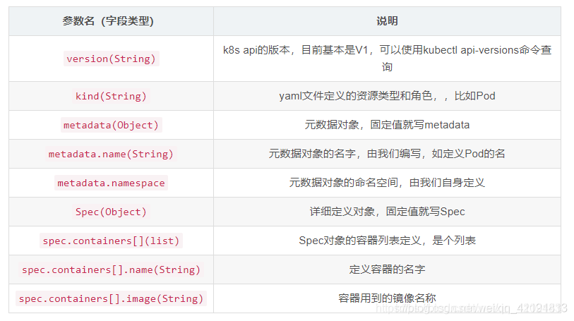
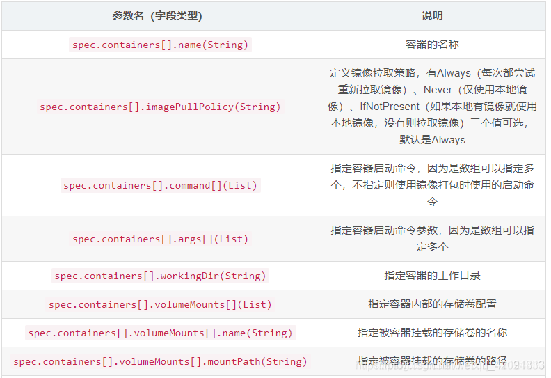
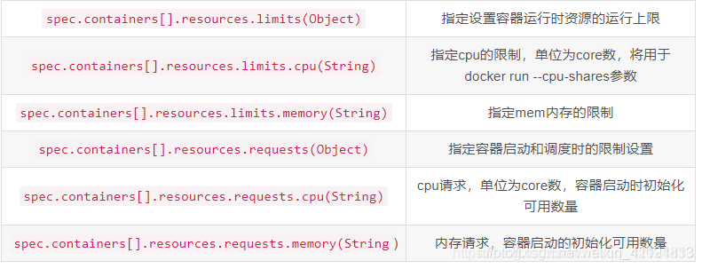
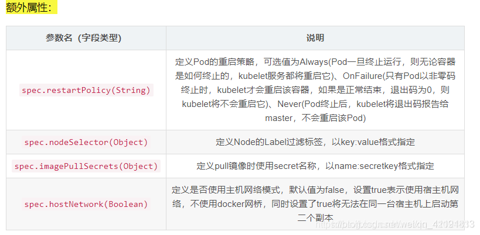
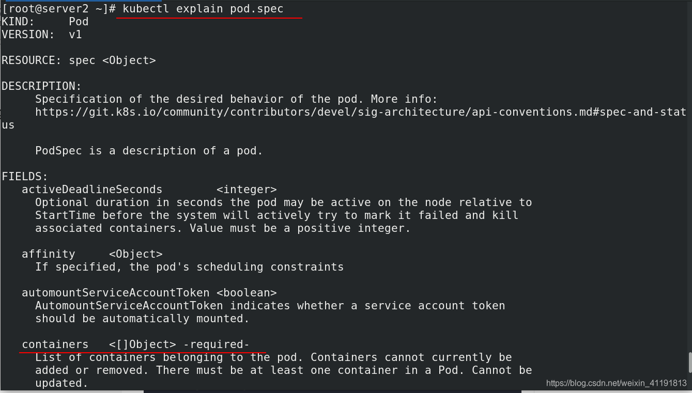

# 资源书写

**什么叫资源？**

k8s中所有的内容都抽象为资源，资源实例化之后，叫做对象。

**什么是资源清单？**

在k8s中，一般使用yaml格式的文件来创建符合我们预期期望的pod，这样的yaml文件我们一般称为资源清单

## 1、资源清单的书写

https://kubernetes.io/docs/setup/

查看k8s提供的API `kubectl api-versions`

创建xxx.yml清单文件

主要参数：










## 2、方法一

利用`kubectl explain` 命令帮助寻找清单内必要文件，一步步写

有-required-的是必要参数



[pod.yml](../../../Resources/k8s/pod.yml)文件范例

执行命令：

```sh
kubectl apply   -f  xxx.yml # 运行清单
kubectl delete  -f  xxx.yml # 删除清单（删除清单部署的内容）--很方便
```

## 3、方法二

利用已有的 pod 输出 .yml 文件进行修改（比较方便，但是学习还是选择方法一）

导出命令 `kubectl get pod nginx -o yaml`

