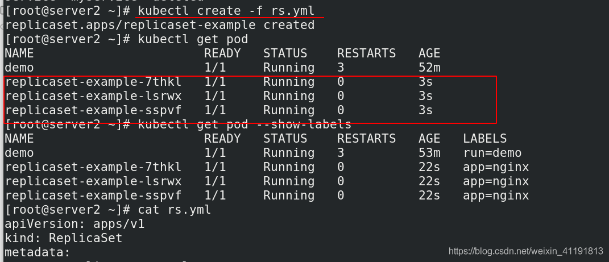
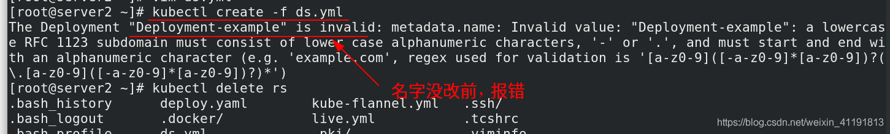
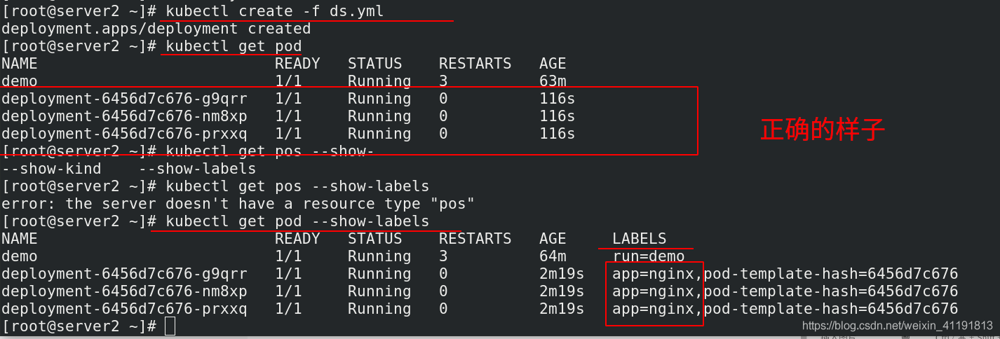
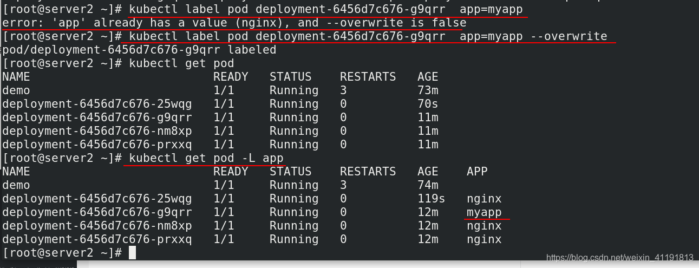
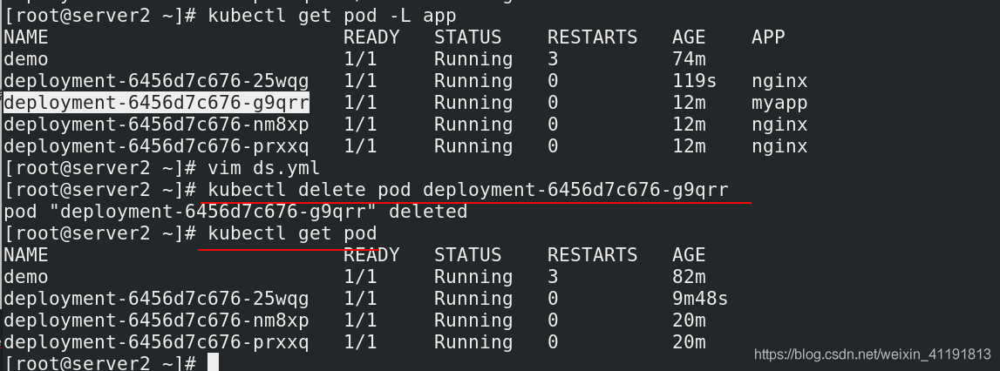
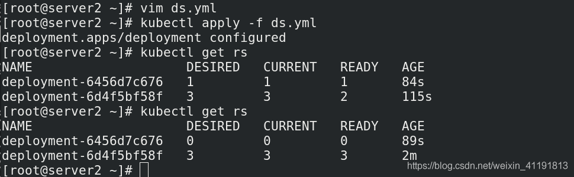
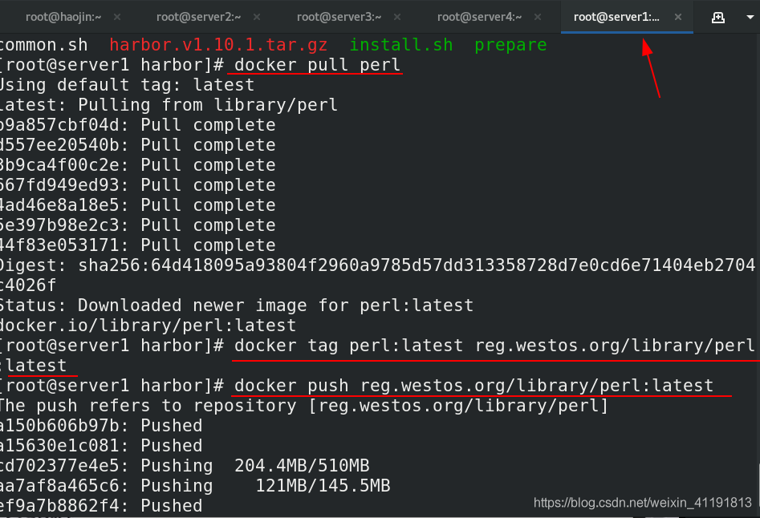
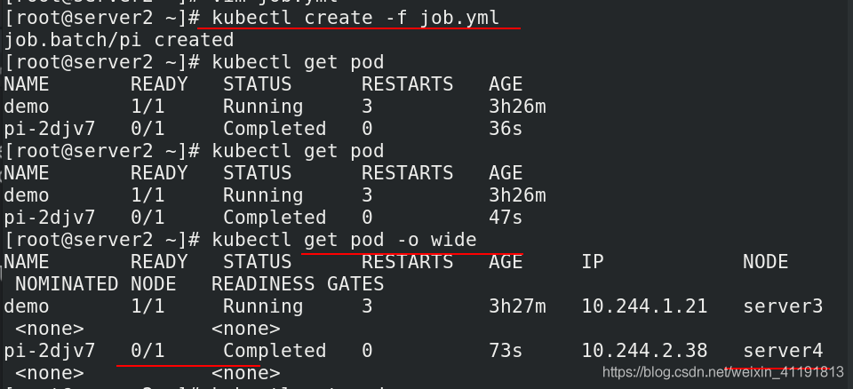
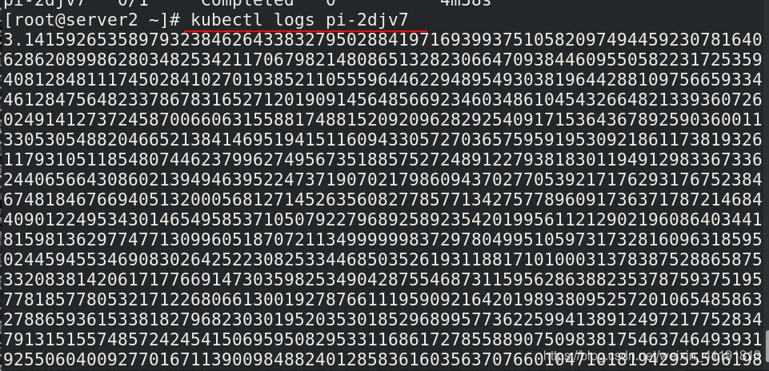

# 控制器


## 1、控制器介绍

Pod控制器是用于实现管理pod的中间层，确保pod资源符合预期的状态，pod的资源出现故障时，会尝试 进行重启，当根据重启策略无效，则会重新新建pod的资源。

**Pod的分类：**

- 自主式Pod：Pod退出后不会被创建
- 控制器管理的Pod：在控制器的生命周期里，始终要维持Pod的副本数目

**控制器类型：**

- Replication Controller 和 ReplicaSet
- Deployment
- DaemonSet
- StatefulSet
- Job
- CronJob
- HPA全称Horizontal Pod Autoscaler

## 2、控制器使用

https://kubernetes.io/zh/docs/concepts/workloads/controllers/replicaset/

### 2.1 RplicaSet控制器与Deploements控制器

#### 2.1.1 RplicaSet控制器

**ReplicaSet 的工作原理**

RepicaSet 是通过一组字段来定义的，包括一个用来识别可获得的 Pod 的集合的选择算符、一个用来标明应该维护的副本个数的数值、一个用来指定应该创建新 Pod 以满足副本个数条件时要使用的 Pod 模板等等。 每个 ReplicaSet 都通过根据需要创建和 删除 Pod 以使得副本个数达到期望值， 进而实现其存在价值。当 ReplicaSet 需要创建新的 Pod 时，会使用所提供的 Pod 模板。

ReplicaSet 通过 Pod 上的 metadata.ownerReferences 字段连接到附属 Pod，该字段给出当前对象的属主资源。 ReplicaSet 所获得的 Pod 都在其 ownerReferences 字段中包含了属主 ReplicaSet 的标识信息。正是通过这一连接，ReplicaSet 知道它所维护的 Pod 集合的状态， 并据此计划其操作行为。

ReplicaSet 使用其选择算符来辨识要获得的 Pod 集合。如果某个 Pod 没有 OwnerReference 或者其 OwnerReference 不是一个 控制器，且其匹配到 某 ReplicaSet 的选择算符，则该 Pod 立即被此 ReplicaSet 获得。

**何时使用 ReplicaSet**

ReplicaSet 确保任何时间都有指定数量的 Pod 副本在运行。 然而，Deployment 是一个更高级的概念，它管理 ReplicaSet，并向 Pod 提供声明式的更新以及许多其他有用的功能。 因此，我们建议使用 Deployment 而不是直接使用 ReplicaSet，除非 你需要自定义更新业务流程或根本不需要更新。

这实际上意味着，你可能永远不需要操作 ReplicaSet 对象：而是使用 Deployment，并在 spec 部分定义你的应用。

rs.yaml

```yaml
apiVersion: apps/v1
kind: ReplicaSet
metadata:
  name: replicaset-example
spec:
  replicas: 3
  selector:
    matchLabels:
      app: nginx
  template:
    metadata:
      labels:
        app: nginx
    spec:
      containers:
      - name: nginx
        image: myapp:v1   
```



#### 2.1.2 Deploements控制器

**Deployments 的典型用例：**

- 创建 Deployment 以将 ReplicaSet 上线。 ReplicaSet 在后台创建 Pods。 检查 ReplicaSet 的上线状态，查看其是否成功。
- 通过更新 Deployment 的 PodTemplateSpec，声明 Pod 的新状态 。 新的 ReplicaSet 会被创建，- Deployment 以受控速率将 Pod 从旧 ReplicaSet 迁移到新 ReplicaSet。 每个新的 ReplicaSet 都会更新 Deployment 的修订版本。
- 如果 Deployment 的当前状态不稳定，回滚到较早的 Deployment 版本。 每次回滚都会更新 Deployment 的修订版本。
- 扩大 Deployment 规模以承担更多负载。暂停 Deployment 以应用对 PodTemplateSpec 所作的多项修改， 然后恢复其执行以启动新的上线版本。
- 使用 Deployment 状态 来判定上线过程是否出现停滞。清理较旧的不再需要的 ReplicaSet 。

```sh
kubectl get pod --show-labels  #查看标签
```

ds.yaml

```yaml
apiVersion: apps/v1
kind: Deployment
metadata:
  name: Deployment-example  #这里这么写报错，换成小写不带‘-’就没问题  name: deploment
spec:
  replicas: 4
  selector:
    matchLabels:
      app: nginx
  template:
    metadata:
      labels:
        app: nginx
    spec:
      containers:
      - name: nginx
        image: myapp:v1
```





#### 2.1.3 deployment与rs的关系

deployment -> rs -> pod

#### 2.1.4 标签的重要性（labels）

将其中一个nginx pod改名，然后可以看到多出了一个pod，rs控制器是通过标签来控制pod的数量的。

改了标签的pod不归 rs 管理，删除也不会有影响

```sh
kubectl label pod deployment-6456d7c676-g9qrr  app=myapp --overwrite 
kubectl get pod 
kubectl get pod -L app   # 查看app名
```





#### 2.1.5 滚动更新，只需要修改.yml的镜像版本即可

ds.yaml

```yaml
apiVersion: apps/v1
kind: Deployment
metadata:
  name: Deployment-example  #这里这么写报错，换成小写不带‘-’就没问题  name: deploment
spec:
  replicas: 4
  selector:
    matchLabels:
      app: nginx
  template:
    metadata:
      labels:
        app: nginx
    spec:
      containers:
      - name: nginx
        image: myapp:v2     # 修改版本
```



### 2.2 DaemonSet控制器

每个节点只部署一次，适合监控，如zabbix-agent服务

DaemonSet 确保全部（或者某些）节点上运行一个 Pod 的副本。当有节点加入集群时， 也会为他们新增一个 Pod 。 当有节点从集群移除时，这些 Pod 也会被回收。删除 DaemonSet 将会删除它创建的所有 Pod。

DaemonSet 的一些典型用法：

- 在每个节点上运行集群守护进程
- 在每个节点上运行日志收集守护进程
- 在每个节点上运行监控守护进程
- 一种简单的用法是为每种类型的守护进程在所有的节点上都启动一个 DaemonSet。 一个稍微复杂的用法是为同一种守护进程部署多个 DaemonSet；每个具有不同的标志， 并且对不同硬件类型具有不同的内存、CPU 要求。

```yaml
apiVersion: apps/v1
kind: DaemonSet
metadata:
  name: fluentd-elasticsearch
  namespace: kube-system
  labels:
    k8s-app: fluentd-logging
spec:
  selector:
    matchLabels:
      name: fluentd-elasticsearch
  template:
    metadata:
      labels:
        name: fluentd-elasticsearch
    spec:
      tolerations:
      # this toleration is to have the daemonset runnable on master nodes
      # remove it if your masters can't run pods
      - key: node-role.kubernetes.io/master
        effect: NoSchedule
      containers:
      - name: fluentd-elasticsearch
        image: quay.io/fluentd_elasticsearch/fluentd:v2.5.2
        resources:
          limits:
            memory: 200Mi
          requests:
            cpu: 100m
            memory: 200Mi
        volumeMounts:
        - name: varlog
          mountPath: /var/log
        - name: varlibdockercontainers
          mountPath: /var/lib/docker/containers
          readOnly: true
      terminationGracePeriodSeconds: 30
      volumes:
      - name: varlog
        hostPath:
          path: /var/log
      - name: varlibdockercontainers
        hostPath:
          path: /var/lib/docker/containers
```

执行：

```sh
kubectl apply -f daemonset.yml
```

### 2.3 Jobs控制器（用于批量计算，一次性任务）

Job 会创建一个或者多个 Pods，并将继续重试 Pods 的执行，直到指定数量的 Pods 成功终止。 随着 Pods 成功结束，Job 跟踪记录成功完成的 Pods 个数。 当数量达到指定的成功个数阈值时，任务（即 Job）结束。 删除 Job 的操作会清除所创建的全部 Pods。

一种简单的使用场景下，你会创建一个 Job 对象以便以一种可靠的方式运行某 Pod 直到完成。 当第一个 Pod 失败或者被删除（比如因为节点硬件失效或者重启）时，Job 对象会启动一个新的 Pod。

你也可以使用 Job 以并行的方式运行多个 Pod。

```sh
kubectl apply -f https://kubernetes.io/examples/controllers/job.yaml
```

job.yaml

```yaml
apiVersion: batch/v1
kind: Job
metadata:
  name: pi
spec:
  template:
    spec:
      containers:
      - name: pi
        image: perl
        command: ["perl",  "-Mbignum=bpi", "-wle", "print bpi(2000)"]
      restartPolicy: Never
  backoffLimit: 4
```

将perl镜像拉取到本地并上传仓库



运行job.yml（计算圆周率到2000位）





### 2.4 CronJob控制器（与job相比，这个可以周期性）

CronJobs 对于创建周期性的、反复重复的任务很有用，例如执行数据备份或者发送邮件。CronJobs 也可以用来计划在指定时间来执行的独立任务，例如计划当集群看起来很空闲时执行某个 Job。

```yaml
apiVersion: batch/v1beta1
kind: CronJob
metadata:
  name: hello
spec:
  schedule: "*/1 * * * *"
  jobTemplate:
    spec:
      template:
        spec:
          containers:
          - name: hello
            image: busybox
            imagePullPolicy: IfNotPresent
            args:
            - /bin/sh
            - -c
            - date; echo Hello from the Kubernetes cluster
          restartPolicy: OnFailure
```

#### 2.4.1 Cron 时间表语法

```sh
# ┌───────────── 分钟 (0 - 59)
# │ ┌───────────── 小时 (0 - 23)
# │ │ ┌───────────── 月的某天 (1 - 31)
# │ │ │ ┌───────────── 月份 (1 - 12)
# │ │ │ │ ┌───────────── 周的某天 (0 - 6) （周日到周一；在某些系统上，7 也是星期日）
# │ │ │ │ │                                   
# │ │ │ │ │
# │ │ │ │ │
# * * * * *
```

| 输入                   | 描述                         | 相当于    |
| ---------------------- | ---------------------------- | --------- |
| @yearly (or @annually) | 每年 1 月 1 日的午夜运行一次 | 0 0 1 1 * |
| @monthly               | 每月第一天的午夜运行一次     | 0 0 1 * * |
| @weekly                | 每周的周日午夜运行一次       | 0 0 * * 0 |
| @daily (or @midnight)  | 每天午夜运行一次             | 0 0 * * * |
| @hourly                | 每小时的开始一次             | 0 * * * * |

例如，下面这行指出必须在每个星期五的午夜以及每个月 13 号的午夜开始任务：

0 0 13 * 5

要生成 CronJob 时间表表达式，你还可以使用 crontab.guru 之类的 Web 工具。

#### 2.4.2 CronJob 限制

CronJob 根据其计划编排，在每次该执行任务的时候大约会创建一个 Job。 我们之所以说 “大约”，是因为在某些情况下，可能会创建两个 Job，或者不会创建任何 Job。 我们试图使这些情况尽量少发生，但不能完全杜绝。因此，Job 应该是幂等的。

如果 startingDeadlineSeconds 设置为很大的数值或未设置（默认），并且 concurrencyPolicy 设置为 Allow，则作业将始终至少运行一次。

对于每个 CronJob，CronJob 控制器（Controller） 检查从上一次调度的时间点到现在所错过了调度次数。如果错过的调度次数超过 100 次， 那么它就不会启动这个任务，并记录这个错误：

```sh
Cannot determine if job needs to be started. Too many missed start time (> 100). Set or decrease .spec.startingDeadlineSeconds or check clock skew.
```

需要注意的是，如果 startingDeadlineSeconds 字段非空，则控制器会统计从 startingDeadlineSeconds 设置的值到现在而不是从上一个计划时间到现在错过了多少次 Job。 例如，如果 startingDeadlineSeconds 是 200，则控制器会统计在过去 200 秒中错过了多少次 Job。

如果未能在调度时间内创建 CronJob，则计为错过。 例如，如果 concurrencyPolicy 被设置为 Forbid，并且当前有一个调度仍在运行的情况下， 试图调度的 CronJob 将被计算为错过。

例如，假设一个 CronJob 被设置为从 08:30:00 开始每隔一分钟创建一个新的 Job，并且它的 startingDeadlineSeconds 字段 未被设置。如果 CronJob 控制器从 08:29:00 到 10:21:00 终止运行，则该 Job 将不会启动，因为其错过的调度次数超过了100。

为了进一步阐述这个概念，假设将 CronJob 设置为从 08:30:00 开始每隔一分钟创建一个新的 Job， 并将其 startingDeadlineSeconds 字段设置为 200 秒。 如果 CronJob 控制器恰好在与上一个示例相同的时间段（08:29:00 到 10:21:00）终止运行， 则 Job 仍将从 10:22:00 开始。 造成这种情况的原因是控制器现在检查在最近 200 秒（即 3 个错过的调度）中发生了多少次错过的 Job 调度，而不是从现在为止的最后一个调度时间开始。

CronJob 仅负责创建与其调度时间相匹配的 Job，而 Job 又负责管理其代表的 Pod。


