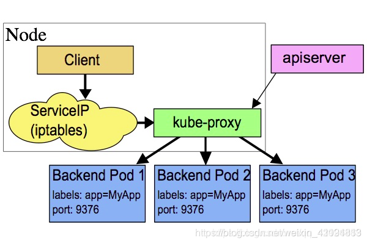
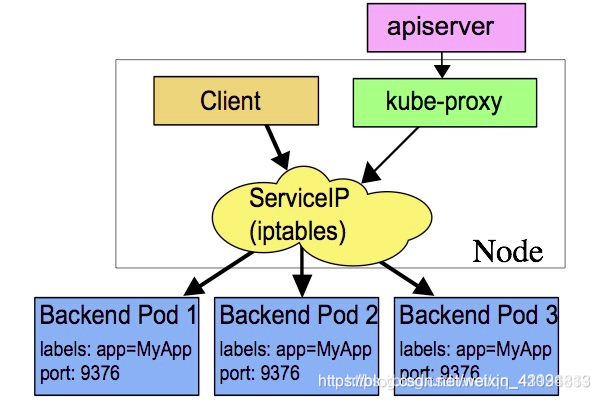
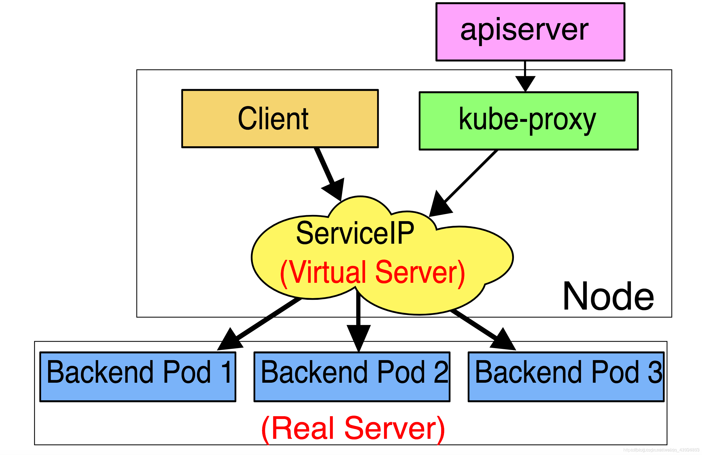
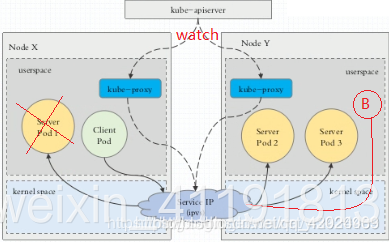
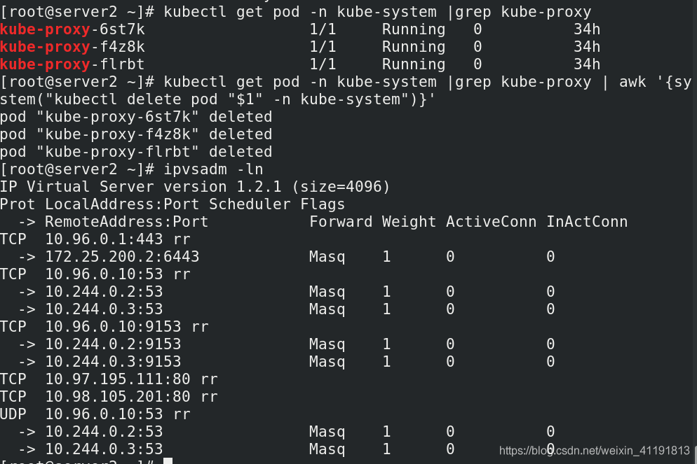
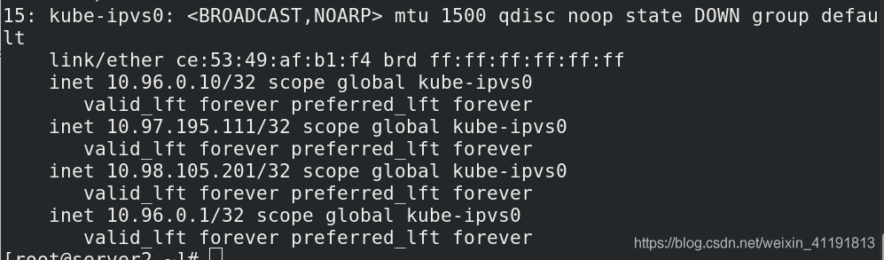
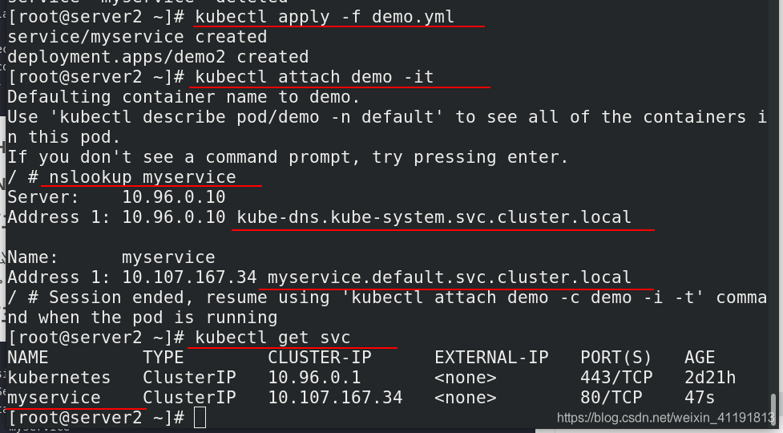
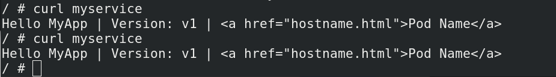
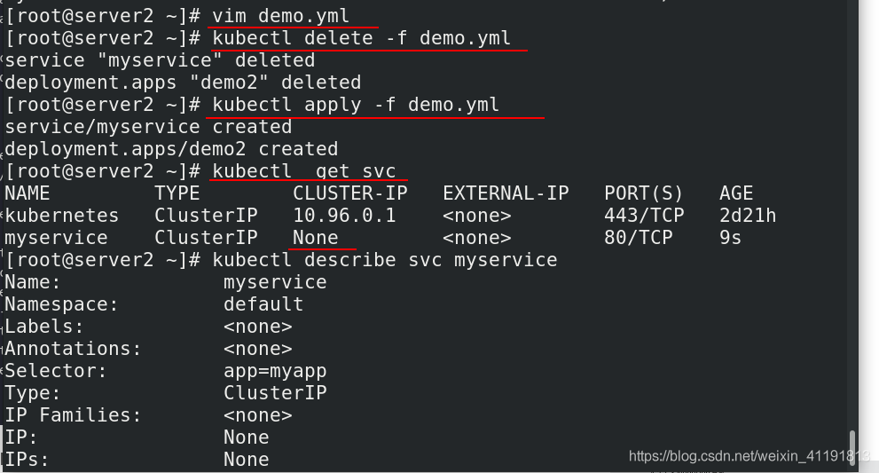

# service


## 1、service是什么？

service是kubernetes中最核心的资源对象之一，service和pod之间通过Label串起来，相同的Service的pod的Label是一样的。同一个service下的所有pod是通过kube-proxy实现负载均衡。而每个service都会分配一个全局唯一的虚拟ip，也就是cluster ip。

在该service整个生命周期内，cluster ip保持不变，而在kubernetes中还有一个dns服务，它会把service的name解析为cluster ip。

Service可以看作是一组提供相同服务的Pod对外的访问接口。借助Service，应用可以方便地实现服务发现和负载均衡。（可以通过Ingress实现）

service默认只支持4层负载均衡能力，没有7层功能。（可以通过Ingress实现）

## 2、service的四种类型

### 2.1 ExternalName:

用于将集群外部的服务引入到集群内部，在集群内部可直接访问来获取服务。它的值必须是 FQDN，此FQDN为集群内部的FQDN，即: ServiceName.Namespace.Domain.LTD。然后CoreDNS接受到该FQDN后，能解析出一个CNAME记录，该别名记录为真正互联网上的域名，如: www.test.com，接着CoreDNS在向互联网上的根域DNS解析该域名，获得其真实互联网IP。

### 2.2 ClusterIP：

用于为集群内Pod访问时，提供的固定访问地址，默认是自动分配地址，可使用ClusterIP关键字指定固定IP。

### 2.3 NodePort:

用于为集群外部访问Service后面Pod提供访问接入端口。这种类型的service工作流程为：

Client----->NodeIP:NodePort----->ClusterIP:ServicePort----->PodIP:ContainerPort

### 2.4 LoadBalancer

用于当K8s运行在一个云环境内时，若该云环境支持LBaaS，则此类型可自动触发创建一个软件负载均衡器，用于对Service做负载均衡调度。

因为外部所有Client都访问一个NodeIP，该节点的压力将会很大，而LoadBalancer则可解决这个问题。而且它还直接动态监测后端Node是否被移除或新增了，然后动态更新调度的节点数。

## 3、service的三种工作模式

### 3.1 第一种: Userspace方式

这种模式，kube-proxy会监视Kubernetes master对service对象和Endpoints对象的添加和移除。对每个Service，它会在本地Node上打开一个端口（随机选择）。任何连接到“代理端口”的请求，都会被代理到Service的backend Pods中的某一个上面。使用哪个backend Pod，是基于Service的SessionAffinity来确定的。最后，它安装iptables规则，捕获到达该Service的clusterIP（是虚拟IP）和Port的请求，并重定向到代理端口，代理端口再代理请求到backend Pod。

网络返回的结果是，任何到达Service的IP：Port的请求，都会被代理到一个合适的backend，不需要客户端知道关于Kubernetes，service或pod的任何信息。

默认的策略是，通过round-robin算法来选择backend Pod。实现基于客户端IP的会话亲和性，可以通过设置service.spec.sessionAffinity的值为“ClientIP”（默认值为“None”）；



- 要访问Server Pod时，它先将请求发给本机内核空间中的service规则，由它再将请求转给监听在指定套接字上的kube-proxy，kube-proxy处理完请求，并分发请求到指定Server Pod后，再将请求递交给内核空间中的service，由service将请求转给指定的Server Pod。
- 由于其需要来回在用户空间和内核空间交互通信，因此效率很差，接着就有了第二种方式.

### 3.2 第二种: iptables模型

此工作方式是直接由内核中的iptables规则，接受Client Pod的请求，并处理完成后，直接转发给指定ServerPod.

这种模式，kube-proxy会监视Kubernetes master对象和Endpoinnts对象的添加和移除。对每个Service，它会安装iptables规则，从而捕获到达该Service的clusterIP（虚拟IP）和端口的请求，进而将请求重定向到Service的一组backend中某个上面。对于每个Endpoints对象，它也会安装iptables规则，这个规则会选择一个backend Pod。

默认的策略是，随机选择一个backend。实现基于客户端IP的会话亲和性，可以将service.spec.sessionAffinity的值设置为“ClientIP”（默认值为“None”）

和userspace代理类似，网络返回的结果是，任何到达Service的IP:Port的请求，都会被代理到一个合适的backend，不需要客户端知道关于Kubernetes，service或Pod的任何信息。这应该比userspace代理更快，更可靠。然而，不想userspace代理，如果始出选择的Pod没有响应，iptables代理不能自动地重试另一个Pod，所以它需要依赖readiness probes；



### 3.3 第三种: ipvs模型（本篇重点）

它是直接有内核中的ipvs规则来接受Client Pod请求，并处理该请求，再有内核封包后，直接发给指定的Server Pod。

这种模式，kube-proxy会监视Kubernetes service对象和Endpoints，调用netlink接口以相应地创建ipvs规则并定期与Kubernetes service对象和Endpoints对象同步ipvs规则，以确保ipvs状态与期望一致。访问服务时，流量将被重定向到其中一个后端Pod。

与iptables类似，ipvs基于netfilter的hook功能，但使用哈希表作为底层数据结构并在内核空间中工作。这意味着ipvs可以更快地重定向流量，并且在同步代理规则时具有更好的性能。此外，ipvs为负载均衡算法提供了更多的选项，例如：

```sh
rr：轮询调度
lc：最小连接数
dh：目标哈希
sh：源哈希
sed：最短期望延迟
nq： 不排队调度
```

> 注意： ipvs模式假定在运行kube-proxy之前在节点上都已经安装了IPVS内核模块。当kube-proxy以ipvs代理模式启动时，kube-proxy将验证节点上是否安装了IPVS模块，如果未安装，则kube-proxy将回退到iptables代理模式。



以上不论哪种，kube-proxy都通过watch的方式监控着kube-APIServer写入etcd中关于Pod的最新状态信息，它一旦检查到一个Pod资源被删除了或 新建，它将立即将这些变化，反应在 iptables 或 ipvs规则中，以便iptables和ipvs在调度Clinet Pod请求到Server Pod时，不会出现Server Pod不存在的情况。

自k8s1.1以后，service默认使用ipvs规则，若ipvs没有被激活，则降级使用iptables规则. 但在1.1以前，service使用的模式默认为userspace.



## 4、创建service

### 4.1 开启kube-proxy的ipvs模式

**为什么要开启kube-proxy的ipvs模式：**

- Service 是由 kube-proxy 组件，加上 iptables 来共同实现的
- kube-proxy 通过 iptables 处理 Service 的过程，需要在宿主机上设置相当多的iptables 规则，如果宿主机有大量的Pod，不断刷新iptables规则，会消耗大量的CPU资源。

- IPVS模式的service，可以使K8s集群支持更多量级的Pod。

```sh
yum install -y ipvsadm                     ##所有节点安装
kubectl edit cm kube-proxy -n kube-system  ##修改IPVS模式
   mode: "ipvs"
   
kubectl get pod -n kube-system |grep kube-proxy | awk '{system("kubectl delete pod "$1" -n kube-system")}'
## 更新kube-proxy pod

ipvsadm -ln  ## 查看ipvs策略
```



IPVS模式下，kube-proxy会在service创建后，在宿主机上添加一个虚拟网卡：kube-ipvs0，并分配service IP。



### 4.2 ClusterIP

#### 4.2.1 默认方式ClusterIP

demo.yaml，ClusterIP方式（默认方式）示例

```yaml
---
apiVersion: v1
kind: Service
metadata:
  name: myservice
spec:
  selector:
    app: myapp
  ports:
  - protocol: TCP
    port: 80
    targetPort: 80

---

apiVersion: apps/v1
kind: Deployment
metadata:
  name: demo2
spec:
  replicas: 3
  selector:
    matchLabels:
      app: myapp
  template:
    metadata:
      labels:
        app: myapp
    spec:
      containers:
      - name: myapp
        image: myapp:v2
```





#### 4.2.2 Headless Service “无头服务”

Headless Service不需要分配一个VIP，而是直接以DNS记录的方式解析出被代理Pod的IP地址。

域名格式：(servicename).(namespace).svc.cluster.local

```sh
[root@server2 ~]# kubectl delete -f damo.yml   ##清理环境
[root@server2 ~]# vim damo.yml 
[root@server2 ~]# cat damo.yml     ##无头服务示例
---
apiVersion: v1
kind: Service
metadata:
  name: myservice
spec:
  selector:
    app: myapp
  ports:
  - protocol: TCP
    port: 80
    targetPort: 80
  clusterIP: None           ##无头服务，
---

apiVersion: apps/v1
kind: Deployment
metadata:
  name: demo2
spec:
  replicas: 3
  selector:
    matchLabels:
      app: myapp
  template:
    metadata:
      labels:
        app: myapp
    spec:
      containers:
      - name: myapp
        image: myapp:v2

[root@server2 ~]# kubectl apply  -f damo.yml    ##应用
service/myservice created

[root@server2 ~]# kubectl  get svc    ##CLUSTER-IP没有分配ip
NAME         TYPE        CLUSTER-IP   EXTERNAL-IP   PORT(S)   AGE
kubernetes   ClusterIP   10.96.0.1    <none>        443/TCP   2d19h
myservice    ClusterIP   None         <none>        80/TCP    24s
[root@server2 ~]# ip addr | grep kube-ipvs0   ##没有分配ip到ipvs0
9: kube-ipvs0: <BROADCAST,NOARP> mtu 1500 qdisc noop state DOWN group default 
    inet 10.96.0.1/32 scope global kube-ipvs0
    inet 10.96.0.10/32 scope global kube-ipvs0
[root@server2 ~]# kubectl describe svc myservice   ##有对应的Endpoints:
```



### 4.3 访问service的三种方式

#### 4.3.1 NodePort方式

```sh
[root@server2 ~]# kubectl delete -f damo.yml     ##删除
[root@server2 ~]# cat damo.yml 
---
apiVersion: v1
kind: Service
metadata:
  name: myservice
spec:
  selector:
    app: myapp
  ports:
  - protocol: TCP
    port: 80
    targetPort: 80
  #clusterIP: None
  type: NodePort      ##改为NodePort
  #type: LoadBalancer
  #externalIPs:
  #  - 172.25.0.100

---
apiVersion: apps/v1
kind: Deployment
metadata:
  name: demo2
spec:
  replicas: 3
  selector:
    matchLabels:
      app: myapp
  template:
    metadata:
      labels:
        app: myapp
    spec:
      containers:
      - name: myapp
        image: myapp:v2
[root@server2 ~]# kubectl apply -f damo.yml  ##创建pod

[root@server2 ~]# kubectl get svc    ##查看外部访问需要的端口是31957
NAME         TYPE        CLUSTER-IP       EXTERNAL-IP   PORT(S)        AGE
kubernetes   ClusterIP   10.96.0.1        <none>        443/TCP        2d20h
myservice    NodePort    10.104.243.136   <none>        80:31957/TCP   74s
```

#### 4.3.2 LoadBalancer

适用于公有云上的 Kubernetes 服务。这时候，你可以指定一个 LoadBalancer 类型的 Service。

```sh
[root@server2 ~]# cat damo.yml 
---
apiVersion: v1
kind: Service
metadata:
  name: myservice
spec:
  selector:
    app: myapp
  ports:
  - protocol: TCP
    port: 80
    targetPort: 80
  #clusterIP: None
  #type: NodePort
  type: LoadBalancer
  #externalIPs:
  #  - 172.25.0.100

---

apiVersion: apps/v1
kind: Deployment
metadata:
  name: demo2
spec:
  replicas: 3
  selector:
    matchLabels:
      app: myapp
  template:
    metadata:
      labels:
        app: myapp
    spec:
      containers:
      - name: myapp
        image: myapp:v2

[root@server2 ~]# kubectl apply -f damo.yml   ##创建pod应用
service/myservice configured
deployment.apps/demo2 unchanged
[root@server2 ~]# kubectl  get svc   ##查看服务
NAME         TYPE           CLUSTER-IP     EXTERNAL-IP   PORT(S)        AGE
kubernetes   ClusterIP      10.96.0.1      <none>        443/TCP        2d20h
myservice    LoadBalancer   10.97.125.97   <pending>     80:31148/TCP   2s
```

#### 4.3.3 ExternalName

```sh
[root@server2 ~]# cat exsvc.yml 
apiVersion: v1
kind: Service
metadata:
  name: exsvc
spec:
  type:  ExternalName
  externalName: www.baidu.com

[root@server2 ~]# kubectl apply -f exsvc.yml 
service/exsvc created
[root@server2 ~]# kubectl get svc
NAME         TYPE           CLUSTER-IP     EXTERNAL-IP     PORT(S)   AGE
exsvc        ExternalName   <none>         www.baidu.com   <none>    7s
kubernetes   ClusterIP      10.96.0.1      <none>          443/TCP   2d20h
myservice    ClusterIP      10.97.125.97   172.25.13.100   80/TCP    13m
[root@server2 ~]# kubectl attach demo -it    ##
	/ # nslookup exsvc
	
[root@server2 ~]# dig -t A exsvc.default.svc.cluster.local. @10.96.0.10  ##要想访问到，要确保联网
```

