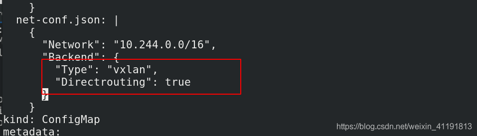

# pod通信及ingress部署


我们如果创建了一些pod，那么它们之间是怎么通信的呢？因为pod的ip地址是有可能变化的，本文讨论两个方面

1. 同节点之间的通信
2. 不同节点的pod之间的通信

## 1、同节点之间的通信

同一节点的pod之间通过cni网桥转发数据包。(brctl show可以查看)

## 2、不同节点的pod之间的通信需要网络插件支持

### 2.1 Flannel vxlan模式跨主机通信原理

- flannel网络

  VXLAN，即Virtual Extensible LAN（虚拟可扩展局域网），是Linux本身支持的一网种网络虚拟化技术。VXLAN可以完全在内核态实现封装和解封装工作，从而通过“隧道”机制，构建出覆盖网络（Overlay Network）。

  VTEP：VXLAN Tunnel End Point（虚拟隧道端点），在Flannel中 VNI的默认值是1，这也是为什么宿主机的VTEP设备都叫flannel.1的原因。

  Cni0: 网桥设备，每创建一个pod都会创建一对 veth pair。其中一端是pod中的eth0，另一端是Cni0网桥中的端口（网卡）。

  Flannel.1: TUN设备(虚拟网卡)，用来进行 vxlan 报文的处理（封包和解包）。不同node之间的pod数据流量都从overlay设备以隧道的形式发送到对端。

  Flanneld：flannel在每个主机中运行flanneld作为agent，它会为所在主机从集群的网络地址空间中，获取一个小的网段subnet，本主机内所有容器的IP地址都将从中分配。同时Flanneld监听K8s集群数据库，为flannel.1设备提供封装数据时必要的mac、ip等网络数据信息。

- flannel网络原理

  当容器发送IP包，通过veth pair 发往cni网桥，再路由到本机的flannel.1设备进行处理。

  VTEP设备之间通过二层数据帧进行通信，源VTEP设备收到原始IP包后，在上面加上一个目的MAC地址，封装成一个内部数据帧，发送给目的VTEP设备。

  内部数据桢，并不能在宿主机的二层网络传输，Linux内核还需要把它进一步封装成为宿主机的一个普通的数据帧，承载着内部数据帧通过宿主机的eth0进行传输。

  Linux会在内部数据帧前面，加上一个VXLAN头，VXLAN头里有一个重要的标志叫VNI，它是VTEP识别某个数据桢是不是应该归自己处理的重要标识。

  flannel.1设备只知道另一端flannel.1设备的MAC地址，却不知道对应的宿主机地址是什么。在linux内核里面，网络设备进行转发的依据，来自FDB的转发数据库，这个flannel.1网桥对应的FDB信息，是由flanneld进程维护的。

  linux内核在IP包前面再加上二层数据帧头，把目标节点的MAC地址填进去，MAC地址从宿主机的ARP表获取。

  此时flannel.1设备就可以把这个数据帧从eth0发出去，再经过宿主机网络来到目标节点的eth0设备。目标主机内核网络栈会发现这个数据帧有VXLAN Header，并且VNI为1，Linux内核会对它进行拆包，拿到内部数据帧，根据VNI的值，交给本机flannel.1设备处理,flannel.1拆包，根据路由表发往cni网桥，最后到达目标容器。

- flannel支持多种后端：

  1. Vxlan
      vxlan //报文封装，默认
      Directrouting //直接路由，跨网段使用vxlan，同网段使用host-gw模式。

  2. host-gw： //主机网关，性能好，但只能在二层网络中，不支持跨网络，如果有成千上万的Pod，容易产生广播风暴，不推荐

  3. UDP： //性能差，不推荐

  

### 2.2 vxlan模式（默认模式）

```sh
[root@server2 ~]# vim demo.yml 
[root@server2 ~]# cat demo.yml 
---
apiVersion: v1
kind: Service
metadata:
  name: myservice
spec:
  selector:
    app: myapp
  ports:
  - protocol: TCP
    port: 80
    targetPort: 80
  #clusterIP: None
  #type: NodePort
  #type: LoadBalancer
  externalIPs:
    - 172.25.200.100

---

apiVersion: apps/v1
kind: Deployment
metadata:
  name: demo2
spec:
  replicas: 2
  selector:
    matchLabels:
      app: myapp
  template:
    metadata:
      labels:
        app: myapp
    spec:
      containers:
      - name: myapp
        image: myapp:v2

[root@server2 ~]# kubectl apply -f demo.yml 
[root@server2 ~]# kubectl  get pod -o wide   ##查看详细信息
##下面的命令每一个节点都可以用
[root@server2 ~]# cat /run/flannel/subnet.env 
[root@server2 ~]# ip n 
[root@server2 ~]# ip addr   ##查看flannel.1对应的mac地址
[root@server4 ~]# bridge fdb


[root@server2 ~]# kubectl attach demo -it  # 进入容器
/ # ping 10.244.2.39

[root@server3 ~]# tcpdump -i eth0 -nn host 172.25.13.4
```


### 2.3 host-gw模式


```sh
[root@server2 ~]# kubectl -n kube-system edit  cm kube-flannel-cfg  ##修改模式为host-gw

[root@server2 ~]# kubectl get pod -n kube-system |grep flannel | awk '{system("kubectl delete pod "$1" -n kube-system")}'   ##类似于之前，重启生效，是一个删除在生成的过程

[root@server3 ~]# ip route   ##每个节点都可以通过这条命令查看route，也可以用route -n
```


### 2.4 Directrouting模式

```sh
[root@server2 ~]# kubectl -n kube-system edit  cm kube-flannel-cfg   ##修改模式
  net-conf.json: |
    {
      "Network": "10.244.0.0/16",
      "Backend": {
        "Type": "vxlan",
        "Directrouting": true
      }
    }
    
[root@server2 ~]# kubectl get pod -n kube-system |grep flannel | awk '{system("kubectl delete pod "$1" -n kube-system")}'     
 ##重新生效
```




## 3. ingress概述

[官网描述](https://kubernetes.github.io/ingress-nginx/)

[下载地址](https://kubernetes.github.io/ingress-nginx/deploy/#bare-metal)

我们知道service的表现形式为IP:PORT，即工作在第四层传输层（TCP/IP层），那么对于不同的URL地址经常对应用不同的后端服务或者虚拟服务器，这些应用层的转发机制仅通过kubernetes的service机制是无法实现的，这种情况我们可以使用ingress策略定义和一个具体的ingress Controller，两者结合实现一个完整的Ingress 负载均衡，这个负载均衡是基于nginx七层反向代理来实现。

k8s 对外暴露服务（service）主要有两种方式：NotePort, LoadBalance， 此外externalIPs也可以使各类service对外提供服务，但是当集群服务很多的时候，NodePort方式最大的缺点是会占用很多集群机器的端口；LB方式最大的缺点则是每个service一个LB又有点浪费和麻烦，并且需要k8s之外的支持； 而ingress则只需要一个NodePort或者一个LB就可以满足所有service对外服务的需求。工作机制大致可以用下图表示：


一种全局的、为了代理不同后端 Service 而设置的负载均衡服务，就是 Kubernetes 里的Ingress 服务。

Ingress由两部分组成：Ingress controller和Ingress服务

Ingress Controller 会根据你定义的 Ingress 对象，提供对应的代理能力。业界常用的各种反向代理项目，比如 Nginx、HAProxy、Envoy、Traefik 等，都已经为Kubernetes 专门维护了对应的 Ingress Controller。


## 4. ingress-nginx 部署

### 4.1 准备工作（镜像导入，yml文件获取修改）

```sh
[root@server2 ~]# mkdir ingress        ##创建对应文件夹方便实验
[root@server2 ~]# cd ingress/
[root@server2 ingress]# pwd
/root/ingress
[root@server2 ingress]# ll
total 20
-rwxr-xr-x 1 root root 17728 Feb 22 15:59 deploy.yaml    ##我本地的文件，也可以通过官网wget

将需要的镜像上传至本地仓库
[root@server1 ~]# docker load -i ingress-nginx.tar      
##加载两个镜像，分别是quay.io/kubernetes-ingress-controller/nginx-ingress-controller 和 jettech/kube-webhook-certgen ，可以通过网络拉取，也可以官网找。这里我使用的是本地的

[root@server1 ~]# docker tag quay.io/kubernetes-ingress-controller/nginx-ingress-controller:0.33.0 reg.westos.org/library/nginx-ingress-controller:0.33.0  
[root@server1 ~]# docker tag jettech/kube-webhook-certgen:v1.2.0  reg.westos.org/library/kube-webhook-certgen:v1.2.0
[root@server1 ~]# docker push reg.westos.org/library/nginx-ingress-controller:0.33.0   ##上传到harbor仓库，方便实验
[root@server1 ~]# docker push reg.westos.org/library/kube-webhook-certgen:v1.2.0

环境的清理
[root@server2 ~]# kubectl delete -f demo.yml   ##先删除前面实验添加的172.25.200.100的svc，然后在进行实验
[root@server2 ~]# vim demo.yml 
[root@server2 ~]# cat demo.yml 
---
apiVersion: v1
kind: Service
metadata:
  name: myservice
spec:
  selector:
    app: myapp
  ports:
  - protocol: TCP
    port: 80
    targetPort: 80
  type: ClusterIP       ##这里的type需要修改
  #clusterIP: None
  #type: NodePort
  #type: LoadBalancer
  #externalIPs:
  #  - 172.25.13.100

---
apiVersion: apps/v1
kind: Deployment
metadata:
  name: demo2
spec:
  replicas: 2
  selector:
    matchLabels:
      app: myapp
  template:
    metadata:
      labels:
        app: myapp
    spec:
      containers:
      - name: myapp
        image: myapp:v2
[root@server2 ~]# kubectl apply -f demo.yml 
```

### 4.2 正式部署

deploy.yaml ##文件内容，和官方有点差距，经过优化，使用的是Daemonset控制器和hostnetwork

```sh
[root@server2 ingress]# cat deploy.yaml     ##文件内容，和官方有点差距，经过优化，使用的是Daemonset控制器和hostnetwork
 
apiVersion: v1
kind: Namespace
metadata:
  name: ingress-nginx
  labels:
    app.kubernetes.io/name: ingress-nginx
    app.kubernetes.io/instance: ingress-nginx

---
# Source: ingress-nginx/templates/controller-serviceaccount.yaml
apiVersion: v1
kind: ServiceAccount
metadata:
  labels:
    helm.sh/chart: ingress-nginx-2.4.0
    app.kubernetes.io/name: ingress-nginx
    app.kubernetes.io/instance: ingress-nginx
    app.kubernetes.io/version: 0.33.0
    app.kubernetes.io/managed-by: Helm
    app.kubernetes.io/component: controller
  name: ingress-nginx
  namespace: ingress-nginx
---
# Source: ingress-nginx/templates/controller-configmap.yaml
apiVersion: v1
kind: ConfigMap
metadata:
  labels:
    helm.sh/chart: ingress-nginx-2.4.0
    app.kubernetes.io/name: ingress-nginx
    app.kubernetes.io/instance: ingress-nginx
    app.kubernetes.io/version: 0.33.0
    app.kubernetes.io/managed-by: Helm
    app.kubernetes.io/component: controller
  name: ingress-nginx-controller
  namespace: ingress-nginx
data:
---
# Source: ingress-nginx/templates/clusterrole.yaml
apiVersion: rbac.authorization.k8s.io/v1
kind: ClusterRole
metadata:
  labels:
    helm.sh/chart: ingress-nginx-2.4.0
    app.kubernetes.io/name: ingress-nginx
    app.kubernetes.io/instance: ingress-nginx
    app.kubernetes.io/version: 0.33.0
    app.kubernetes.io/managed-by: Helm
  name: ingress-nginx
  namespace: ingress-nginx
rules:
  - apiGroups:
      - ''
    resources:
      - configmaps
      - endpoints
      - nodes
      - pods
      - secrets
    verbs:
      - list
      - watch
  - apiGroups:
      - ''
    resources:
      - nodes
    verbs:
      - get
  - apiGroups:
      - ''
    resources:
      - services
    verbs:
      - get
      - list
      - update
      - watch
  - apiGroups:
      - extensions
      - networking.k8s.io   # k8s 1.14+
    resources:
      - ingresses
    verbs:
      - get
      - list
      - watch
  - apiGroups:
      - ''
    resources:
      - events
    verbs:
      - create
      - patch
  - apiGroups:
      - extensions
      - networking.k8s.io   # k8s 1.14+
    resources:
      - ingresses/status
    verbs:
      - update
  - apiGroups:
      - networking.k8s.io   # k8s 1.14+
    resources:
      - ingressclasses
    verbs:
      - get
      - list
      - watch
---
# Source: ingress-nginx/templates/clusterrolebinding.yaml
apiVersion: rbac.authorization.k8s.io/v1
kind: ClusterRoleBinding
metadata:
  labels:
    helm.sh/chart: ingress-nginx-2.4.0
    app.kubernetes.io/name: ingress-nginx
    app.kubernetes.io/instance: ingress-nginx
    app.kubernetes.io/version: 0.33.0
    app.kubernetes.io/managed-by: Helm
  name: ingress-nginx
  namespace: ingress-nginx
roleRef:
  apiGroup: rbac.authorization.k8s.io
  kind: ClusterRole
  name: ingress-nginx
subjects:
  - kind: ServiceAccount
    name: ingress-nginx
    namespace: ingress-nginx
---
# Source: ingress-nginx/templates/controller-role.yaml
apiVersion: rbac.authorization.k8s.io/v1
kind: Role
metadata:
  labels:
    helm.sh/chart: ingress-nginx-2.4.0
    app.kubernetes.io/name: ingress-nginx
    app.kubernetes.io/instance: ingress-nginx
    app.kubernetes.io/version: 0.33.0
    app.kubernetes.io/managed-by: Helm
    app.kubernetes.io/component: controller
  name: ingress-nginx
  namespace: ingress-nginx
rules:
  - apiGroups:
      - ''
    resources:
      - namespaces
    verbs:
      - get
  - apiGroups:
      - ''
    resources:
      - configmaps
      - pods
      - secrets
      - endpoints
    verbs:
      - get
      - list
      - watch
  - apiGroups:
      - ''
    resources:
      - services
    verbs:
      - get
      - list
      - update
      - watch
  - apiGroups:
      - extensions
      - networking.k8s.io   # k8s 1.14+
    resources:
      - ingresses
    verbs:
      - get
      - list
      - watch
  - apiGroups:
      - extensions
      - networking.k8s.io   # k8s 1.14+
    resources:
      - ingresses/status
    verbs:
      - update
  - apiGroups:
      - networking.k8s.io   # k8s 1.14+
    resources:
      - ingressclasses
    verbs:
      - get
      - list
      - watch
  - apiGroups:
      - ''
    resources:
      - configmaps
    resourceNames:
      - ingress-controller-leader-nginx
    verbs:
      - get
      - update
  - apiGroups:
      - ''
    resources:
      - configmaps
    verbs:
      - create
  - apiGroups:
      - ''
    resources:
      - endpoints
    verbs:
      - create
      - get
      - update
  - apiGroups:
      - ''
    resources:
      - events
    verbs:
      - create
      - patch
---
# Source: ingress-nginx/templates/controller-rolebinding.yaml
apiVersion: rbac.authorization.k8s.io/v1
kind: RoleBinding
metadata:
  labels:
    helm.sh/chart: ingress-nginx-2.4.0
    app.kubernetes.io/name: ingress-nginx
    app.kubernetes.io/instance: ingress-nginx
    app.kubernetes.io/version: 0.33.0
    app.kubernetes.io/managed-by: Helm
    app.kubernetes.io/component: controller
  name: ingress-nginx
  namespace: ingress-nginx
roleRef:
  apiGroup: rbac.authorization.k8s.io
  kind: Role
  name: ingress-nginx
subjects:
  - kind: ServiceAccount
    name: ingress-nginx
    namespace: ingress-nginx
---
# Source: ingress-nginx/templates/controller-service-webhook.yaml
apiVersion: v1
kind: Service
metadata:
  labels:
    helm.sh/chart: ingress-nginx-2.4.0
    app.kubernetes.io/name: ingress-nginx
    app.kubernetes.io/instance: ingress-nginx
    app.kubernetes.io/version: 0.33.0
    app.kubernetes.io/managed-by: Helm
    app.kubernetes.io/component: controller
  name: ingress-nginx-controller-admission
  namespace: ingress-nginx
spec:
  type: ClusterIP
  ports:
    - name: https-webhook
      port: 443
      targetPort: webhook
  selector:
    app.kubernetes.io/name: ingress-nginx
    app.kubernetes.io/instance: ingress-nginx
    app.kubernetes.io/component: controller
---
# Source: ingress-nginx/templates/controller-service.yaml
#apiVersion: v1
#kind: Service
#metadata:
#  labels:
#    helm.sh/chart: ingress-nginx-2.4.0
#    app.kubernetes.io/name: ingress-nginx
#    app.kubernetes.io/instance: ingress-nginx
#    app.kubernetes.io/version: 0.33.0
#    app.kubernetes.io/managed-by: Helm
#    app.kubernetes.io/component: controller
#  name: ingress-nginx-controller
#  namespace: ingress-nginx
#spec:
#  type: NodePort
#  ports:
#    - name: http
#      port: 80
#      protocol: TCP
#      targetPort: http
#    - name: https
#      port: 443
#      protocol: TCP
#      targetPort: https
#  selector:
#    app.kubernetes.io/name: ingress-nginx
#    app.kubernetes.io/instance: ingress-nginx
#    app.kubernetes.io/component: controller
---
# Source: ingress-nginx/templates/controller-deployment.yaml
apiVersion: apps/v1
kind: DaemonSet
metadata:
  labels:
    helm.sh/chart: ingress-nginx-2.4.0
    app.kubernetes.io/name: ingress-nginx
    app.kubernetes.io/instance: ingress-nginx
    app.kubernetes.io/version: 0.33.0
    app.kubernetes.io/managed-by: Helm
    app.kubernetes.io/component: controller
  name: ingress-nginx-controller
  namespace: ingress-nginx
spec:
  selector:
    matchLabels:
      app.kubernetes.io/name: ingress-nginx
      app.kubernetes.io/instance: ingress-nginx
      app.kubernetes.io/component: controller
  revisionHistoryLimit: 10
  minReadySeconds: 0
  template:
    metadata:
      labels:
        app.kubernetes.io/name: ingress-nginx
        app.kubernetes.io/instance: ingress-nginx
        app.kubernetes.io/component: controller
    spec:
      hostNetwork: true
      nodeSelector:
        kubernetes.io/hostname: server4
      dnsPolicy: ClusterFirst
      containers:
        - name: controller
          image: nginx-ingress-controller:0.33.0
          imagePullPolicy: IfNotPresent
          lifecycle:
            preStop:
              exec:
                command:
                  - /wait-shutdown
          args:
            - /nginx-ingress-controller
            - --election-id=ingress-controller-leader
            - --ingress-class=nginx
            - --configmap=ingress-nginx/ingress-nginx-controller
            - --validating-webhook=:8443
            - --validating-webhook-certificate=/usr/local/certificates/cert
            - --validating-webhook-key=/usr/local/certificates/key
          securityContext:
            capabilities:
              drop:
                - ALL
              add:
                - NET_BIND_SERVICE
            runAsUser: 101
            allowPrivilegeEscalation: true
          env:
            - name: POD_NAME
              valueFrom:
                fieldRef:
                  fieldPath: metadata.name
            - name: POD_NAMESPACE
              valueFrom:
                fieldRef:
                  fieldPath: metadata.namespace
          livenessProbe:
            httpGet:
              path: /healthz
              port: 10254
              scheme: HTTP
            initialDelaySeconds: 10
            periodSeconds: 10
            timeoutSeconds: 1
            successThreshold: 1
            failureThreshold: 3
          readinessProbe:
            httpGet:
              path: /healthz
              port: 10254
              scheme: HTTP
            initialDelaySeconds: 10
            periodSeconds: 10
            timeoutSeconds: 1
            successThreshold: 1
            failureThreshold: 3
          ports:
            - name: http
              containerPort: 80
              protocol: TCP
            - name: https
              containerPort: 443
              protocol: TCP
            - name: webhook
              containerPort: 8443
              protocol: TCP
          volumeMounts:
            - name: webhook-cert
              mountPath: /usr/local/certificates/
              readOnly: true
          resources:
            requests:
              cpu: 100m
              memory: 90Mi
      serviceAccountName: ingress-nginx
      terminationGracePeriodSeconds: 300
      volumes:
        - name: webhook-cert
          secret:
            secretName: ingress-nginx-admission
---
# Source: ingress-nginx/templates/admission-webhooks/validating-webhook.yaml
apiVersion: admissionregistration.k8s.io/v1beta1
kind: ValidatingWebhookConfiguration
metadata:
  labels:
    helm.sh/chart: ingress-nginx-2.4.0
    app.kubernetes.io/name: ingress-nginx
    app.kubernetes.io/instance: ingress-nginx
    app.kubernetes.io/version: 0.33.0
    app.kubernetes.io/managed-by: Helm
    app.kubernetes.io/component: admission-webhook
  name: ingress-nginx-admission
  namespace: ingress-nginx
webhooks:
  - name: validate.nginx.ingress.kubernetes.io
    rules:
      - apiGroups:
          - extensions
          - networking.k8s.io
        apiVersions:
          - v1beta1
        operations:
          - CREATE
          - UPDATE
        resources:
          - ingresses
    failurePolicy: Fail
    clientConfig:
      service:
        namespace: ingress-nginx
        name: ingress-nginx-controller-admission
        path: /extensions/v1beta1/ingresses
---
# Source: ingress-nginx/templates/admission-webhooks/job-patch/clusterrole.yaml
apiVersion: rbac.authorization.k8s.io/v1
kind: ClusterRole
metadata:
  name: ingress-nginx-admission
  annotations:
    helm.sh/hook: pre-install,pre-upgrade,post-install,post-upgrade
    helm.sh/hook-delete-policy: before-hook-creation,hook-succeeded
  labels:
    helm.sh/chart: ingress-nginx-2.4.0
    app.kubernetes.io/name: ingress-nginx
    app.kubernetes.io/instance: ingress-nginx
    app.kubernetes.io/version: 0.33.0
    app.kubernetes.io/managed-by: Helm
    app.kubernetes.io/component: admission-webhook
  namespace: ingress-nginx
rules:
  - apiGroups:
      - admissionregistration.k8s.io
    resources:
      - validatingwebhookconfigurations
    verbs:
      - get
      - update
---
# Source: ingress-nginx/templates/admission-webhooks/job-patch/clusterrolebinding.yaml
apiVersion: rbac.authorization.k8s.io/v1
kind: ClusterRoleBinding
metadata:
  name: ingress-nginx-admission
  annotations:
    helm.sh/hook: pre-install,pre-upgrade,post-install,post-upgrade
    helm.sh/hook-delete-policy: before-hook-creation,hook-succeeded
  labels:
    helm.sh/chart: ingress-nginx-2.4.0
    app.kubernetes.io/name: ingress-nginx
    app.kubernetes.io/instance: ingress-nginx
    app.kubernetes.io/version: 0.33.0
    app.kubernetes.io/managed-by: Helm
    app.kubernetes.io/component: admission-webhook
  namespace: ingress-nginx
roleRef:
  apiGroup: rbac.authorization.k8s.io
  kind: ClusterRole
  name: ingress-nginx-admission
subjects:
  - kind: ServiceAccount
    name: ingress-nginx-admission
    namespace: ingress-nginx
---
# Source: ingress-nginx/templates/admission-webhooks/job-patch/job-createSecret.yaml
apiVersion: batch/v1
kind: Job
metadata:
  name: ingress-nginx-admission-create
  annotations:
    helm.sh/hook: pre-install,pre-upgrade
    helm.sh/hook-delete-policy: before-hook-creation,hook-succeeded
  labels:
    helm.sh/chart: ingress-nginx-2.4.0
    app.kubernetes.io/name: ingress-nginx
    app.kubernetes.io/instance: ingress-nginx
    app.kubernetes.io/version: 0.33.0
    app.kubernetes.io/managed-by: Helm
    app.kubernetes.io/component: admission-webhook
  namespace: ingress-nginx
spec:
  template:
    metadata:
      name: ingress-nginx-admission-create
      labels:
        helm.sh/chart: ingress-nginx-2.4.0
        app.kubernetes.io/name: ingress-nginx
        app.kubernetes.io/instance: ingress-nginx
        app.kubernetes.io/version: 0.33.0
        app.kubernetes.io/managed-by: Helm
        app.kubernetes.io/component: admission-webhook
    spec:
      containers:
        - name: create
          image: kube-webhook-certgen:v1.2.0
          imagePullPolicy: IfNotPresent
          args:
            - create
            - --host=ingress-nginx-controller-admission,ingress-nginx-controller-admission.ingress-nginx.svc
            - --namespace=ingress-nginx
            - --secret-name=ingress-nginx-admission
      restartPolicy: OnFailure
      serviceAccountName: ingress-nginx-admission
      securityContext:
        runAsNonRoot: true
        runAsUser: 2000
---
# Source: ingress-nginx/templates/admission-webhooks/job-patch/job-patchWebhook.yaml
apiVersion: batch/v1
kind: Job
metadata:
  name: ingress-nginx-admission-patch
  annotations:
    helm.sh/hook: post-install,post-upgrade
    helm.sh/hook-delete-policy: before-hook-creation,hook-succeeded
  labels:
    helm.sh/chart: ingress-nginx-2.4.0
    app.kubernetes.io/name: ingress-nginx
    app.kubernetes.io/instance: ingress-nginx
    app.kubernetes.io/version: 0.33.0
    app.kubernetes.io/managed-by: Helm
    app.kubernetes.io/component: admission-webhook
  namespace: ingress-nginx
spec:
  template:
    metadata:
      name: ingress-nginx-admission-patch
      labels:
        helm.sh/chart: ingress-nginx-2.4.0
        app.kubernetes.io/name: ingress-nginx
        app.kubernetes.io/instance: ingress-nginx
        app.kubernetes.io/version: 0.33.0
        app.kubernetes.io/managed-by: Helm
        app.kubernetes.io/component: admission-webhook
    spec:
      containers:
        - name: patch
          image: kube-webhook-certgen:v1.2.0
          imagePullPolicy: IfNotPresent
          args:
            - patch
            - --webhook-name=ingress-nginx-admission
            - --namespace=ingress-nginx
            - --patch-mutating=false
            - --secret-name=ingress-nginx-admission
            - --patch-failure-policy=Fail
      restartPolicy: OnFailure
      serviceAccountName: ingress-nginx-admission
      securityContext:
        runAsNonRoot: true
        runAsUser: 2000
---
# Source: ingress-nginx/templates/admission-webhooks/job-patch/role.yaml
apiVersion: rbac.authorization.k8s.io/v1
kind: Role
metadata:
  name: ingress-nginx-admission
  annotations:
    helm.sh/hook: pre-install,pre-upgrade,post-install,post-upgrade
    helm.sh/hook-delete-policy: before-hook-creation,hook-succeeded
  labels:
    helm.sh/chart: ingress-nginx-2.4.0
    app.kubernetes.io/name: ingress-nginx
    app.kubernetes.io/instance: ingress-nginx
    app.kubernetes.io/version: 0.33.0
    app.kubernetes.io/managed-by: Helm
    app.kubernetes.io/component: admission-webhook
  namespace: ingress-nginx
rules:
  - apiGroups:
      - ''
    resources:
      - secrets
    verbs:
      - get
      - create
---
# Source: ingress-nginx/templates/admission-webhooks/job-patch/rolebinding.yaml
apiVersion: rbac.authorization.k8s.io/v1
kind: RoleBinding
metadata:
  name: ingress-nginx-admission
  annotations:
    helm.sh/hook: pre-install,pre-upgrade,post-install,post-upgrade
    helm.sh/hook-delete-policy: before-hook-creation,hook-succeeded
  labels:
    helm.sh/chart: ingress-nginx-2.4.0
    app.kubernetes.io/name: ingress-nginx
    app.kubernetes.io/instance: ingress-nginx
    app.kubernetes.io/version: 0.33.0
    app.kubernetes.io/managed-by: Helm
    app.kubernetes.io/component: admission-webhook
  namespace: ingress-nginx
roleRef:
  apiGroup: rbac.authorization.k8s.io
  kind: Role
  name: ingress-nginx-admission
subjects:
  - kind: ServiceAccount
    name: ingress-nginx-admission
    namespace: ingress-nginx
---
# Source: ingress-nginx/templates/admission-webhooks/job-patch/serviceaccount.yaml
apiVersion: v1
kind: ServiceAccount
metadata:
  name: ingress-nginx-admission
  annotations:
    helm.sh/hook: pre-install,pre-upgrade,post-install,post-upgrade
    helm.sh/hook-delete-policy: before-hook-creation,hook-succeeded
  labels:
    helm.sh/chart: ingress-nginx-2.4.0
    app.kubernetes.io/name: ingress-nginx
    app.kubernetes.io/instance: ingress-nginx
    app.kubernetes.io/version: 0.33.0
    app.kubernetes.io/managed-by: Helm
    app.kubernetes.io/component: admission-webhook
  namespace: ingress-nginx
```

部署查看命令

```sh
[root@server2 ingress]# kubectl apply -f deploy.yaml 
[root@server2 ingress]# kubectl get ns     ##安装成功后出现新的namespace:ingress-nginx
[root@server2 ingress]# kubectl get all -n ingress-nginx     ##查看服务是否安装成功
[root@server2 ingress]# kubectl get all -o wide -n ingress-nginx   ##查看新namespace详细信息
[root@server2 ingress]# kubectl -n ingress-nginx get pod    ##查看是否运行成功,READY状态必须为1
```

## 4.3 ingress配置

### 4.3.1 配置基本的测试文件

#### 1. 单host

```sh
[root@server2 ~]# cd ingress/  
[root@server2 ingress]# vim nginx.yml
[root@server2 ingress]# cat nginx.yml 
apiVersion: networking.k8s.io/v1beta1
kind: Ingress
metadata:
  name: ingress-demo
spec:
  rules:
  - host: www1.westos.org
    http:
      paths:
      - path: /
        backend:
          serviceName: myservice
          servicePort: 80
[root@server2 ingress]# kubectl apply -f nginx.yml    ##创建ingress

[root@server2 ingress]# kubectl get ingress    ##查看创建的ingress
NAME           CLASS    HOSTS             ADDRESS   PORTS   AGE
ingress-demo   <none>   www1.westos.org             80      20s

[root@westos ~]# vim /etc/hosts     ##真机需要做解析
```


真机测试，负载均衡


```sh
[root@server2 ingress]# cat nginx-svc.yml     ##在写个svc服务，为后面实验进行区分
---
apiVersion: v1
kind: Service
metadata:
  name: nginx-svc
spec:
  selector:
    app: nginx
  ports:
  - protocol: TCP
    port: 80
    targetPort: 80

---
apiVersion: apps/v1
kind: Deployment
metadata:
  name: deployment
spec:
  replicas: 2
  selector:
    matchLabels:
      app: nginx
  template:
    metadata:
      labels:
        app: nginx
    spec:
      containers:
      - name: nginx
        image: myapp:v1

[root@server2 ingress]# kubectl apply  -f nginx-svc.yml 
[root@server2 ingress]# kubectl  get svc     ##查看新加的services
```

#### 2. 两个host

```sh
[root@server2 ingress]# vim nginx.yml 
[root@server2 ingress]# cat nginx.yml 
apiVersion: networking.k8s.io/v1beta1
kind: Ingress
metadata:
  name: ingress-demo
spec:
  rules:
  - host: www1.westos.org
    http:
      paths:
      - path: /
        backend:
          serviceName: myservice
          servicePort: 80
  - host: www2.westos.org
    http:
      paths:
      - path: /
        backend:
          serviceName: nginx-svc
          servicePort: 80
[root@server2 ingress]# kubectl apply  -f nginx.yml     ##
[root@server2 ingress]# kubectl  get ingress     ##查看ingress
[root@server2 ingress]# kubectl describe ingress ingress-demo # 查看详细说明
```


在真机上测试：


### 4.3.2 配置证书加密

```sh
[root@server2 ingress]# openssl req -x509 -sha256 -nodes -days 365 -newkey rsa:2048 -keyout tls.key -out tls.crt -subj "/CN=nginxsvc/O=nginxsvc"   ##生成证书文件
[root@server2 ingress]# kubectl create secret tls tls-secret --key tls.key --cert tls.crt ##生成缓存的密钥文件，相当于缓存到secret这个文件中
[root@server2 ingress]# kubectl get secrets      ##查看生成的密钥文件
[root@server2 ingress]# kubectl describe  secrets tls-secret  ##查看密钥详细信息


[root@server2 ingress]# vim nginx.yml 
[root@server2 ingress]# cat nginx.yml 
apiVersion: networking.k8s.io/v1beta1
kind: Ingress
metadata:
  name: ingress-demo
spec:
  tls:
    - hosts:
      - www1.westos.org
      secretName: tls-secret           ##为www1.westos.org添加证书
  rules:
  - host: www1.westos.org
    http:
      paths:
      - path: /
        backend:
          serviceName: myservice
          servicePort: 80
---
apiVersion: networking.k8s.io/v1beta1
kind: Ingress
metadata:
  name: ingress-demo2
spec:
  rules:
  - host: www2.westos.org
    http:
      paths:
      - path: /  
        backend:
          serviceName: nginx-svc
          servicePort: 80
[root@server2 ingress]# kubectl apply -f nginx.yml    ##创建
[root@server2 ingress]# kubectl  get ingress     ##可以发现有了443端口
NAME            CLASS    HOSTS             ADDRESS       PORTS     AGE
ingress-demo    <none>   www1.westos.org   172.25.200.4   80, 443   45h
ingress-demo2   <none>   www2.westos.org   172.25.200.4   80        23s
[root@server2 ingress]# kubectl describe ingress ingress-demo2

[root@westos ~]# curl www1.westos.org -I     ##真机访问
[root@westos ~]# curl -k https://www1.westos.org/   ##真机直接访问重定向网址
[root@westos ~]# curl www2.westos.org -I
```

### 4.3.3 证书加密加用户认证

```sh
[root@server2 ingress]# yum provides */htpasswd    ##查看htpasswd软件属于哪个安装包
[root@server2 ingress]# yum install httpd-tools-2.4.6-88.el7.x86_64 -y  ##安装对应软件
[root@server2 ingress]# htpasswd -c auth haojin    ##建立认证用户
[root@server2 ingress]# htpasswd auth admin        ##再建立一个（-c代表第一个会覆盖前面的）
[root@server2 ingress]# cat auth                   ##查看认证的用户
haojin:$apr1$nKCzTjJF$Ag9rdIvacQj6QiN0xjWNw1
admin:$apr1$x34kh592$MBzA09YbFCXSpeCbBHM501


[root@server2 ingress]# kubectl create secret generic basic-auth --from-file=auth  ##存储用户认证文件
[root@server2 ingress]# kubectl get secrets    ##查看是否存储成功
NAME                  TYPE                                  DATA   AGE
basic-auth            Opaque                                1      19s
default-token-mdfz9   kubernetes.io/service-account-token   3      3d4h
tls-secret            kubernetes.io/tls                     2      48m

[root@server2 ingress]# kubectl get secret basic-auth -o yaml   ##通过yaml文件查看用户认证信息


[root@server2 ingress]# cat nginx.yml 
apiVersion: networking.k8s.io/v1beta1
kind: Ingress
metadata:
  name: ingress-demo
  annotations:
    nginx.ingress.kubernetes.io/auth-type: basic
    nginx.ingress.kubernetes.io/auth-secret: basic-auth
    nginx.ingress.kubernetes.io/auth-realm: 'Authentication Required - haojin'
spec:
  tls:
    - hosts:
      - www1.westos.org
      secretName: tls-secret
  rules:
  - host: www1.westos.org
    http:
      paths:
      - path: /
        backend:
          serviceName: myservice
          servicePort: 80
---

apiVersion: networking.k8s.io/v1beta1
kind: Ingress
metadata:
  name: ingress-demo2
spec:
  rules:
  - host: www2.westos.org
    http:
      paths:
      - path: /
        backend:
          serviceName: nginx-svc
          servicePort: 80

[root@server2 ingress]# kubectl apply -f nginx.yml   ##创建 
```


### 4.3.4 地址重定向（简单）

```sh
[root@server2 ingress]# vim nginx.yml 
[root@server2 ingress]# cat nginx.yml 
apiVersion: networking.k8s.io/v1beta1
kind: Ingress
metadata:
  name: ingress-demo
  annotations:
    nginx.ingress.kubernetes.io/auth-type: basic
    nginx.ingress.kubernetes.io/auth-secret: basic-auth
    nginx.ingress.kubernetes.io/auth-realm: 'Authentication Required - haojin'
spec:
  tls:
    - hosts:
      - www1.westos.org
      secretName: tls-secret
  rules:
  - host: www1.westos.org
    http:
      paths:
      - path: /
        backend:
          serviceName: myservice
          servicePort: 80
---
apiVersion: networking.k8s.io/v1beta1
kind: Ingress
metadata:
  name: ingress-demo2
  annotations:
    nginx.ingress.kubernetes.io/rewrite-target: /hostname.html   ##设置重定向信息，可以直接访问到www1.westos.org/hostname.html
spec:
  rules:
  - host: www2.westos.org
    http:
      paths:
      - backend:
          serviceName: nginx-svc
          servicePort: 80
        path: /          ##访问的根目录 
```

通过www2.westos.org重定向访问www1.westos.org/hostname.html


### 4.3.5 地址重写（复杂）

```sh
[root@server2 ingress]# vim nginx.yml 
[root@server2 ingress]# cat nginx.yml 
apiVersion: networking.k8s.io/v1beta1
kind: Ingress
metadata:
  name: ingress-demo
  annotations:
    nginx.ingress.kubernetes.io/auth-type: basic
    nginx.ingress.kubernetes.io/auth-secret: basic-auth
    nginx.ingress.kubernetes.io/auth-realm: 'Authentication Required - haojin'
spec:
  tls:
    - hosts:
      - www1.westos.org
      secretName: tls-secret
  rules:
  - host: www1.westos.org
    http:
      paths:
      - path: /
        backend:
          serviceName: myservice
          servicePort: 80
---
apiVersion: networking.k8s.io/v1beta1
kind: Ingress
metadata:
  name: ingress-demo2
  annotations:
    nginx.ingress.kubernetes.io/rewrite-target: /$2     ##定位到$2,指关键字后面的所有内容
spec:
  rules:
  - host: www2.westos.org
    http:
      paths:
      - backend:
          serviceName: nginx-svc
          servicePort: 80
        path: /westos(/|$)(.*)      ##访问必须添加westos路径(即域名后面加westos，然后重新定向到别的路径)这关键字随意。   

[root@server2 ingress]# kubectl apply -f nginx.yml
[root@server2 ingress]# kubectl describe ingress ingress-demo2  ##查看是否生效
```


