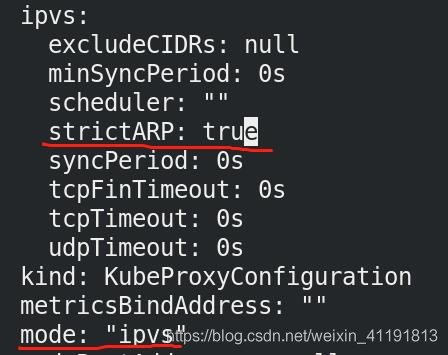

# Kubernetes网络


## metallb负载均衡器与LoadBalancer

[MetalLB官网](https://metallb.universe.tf/installation/)

### 1.1 修改kube-proxy内容

```sh
kubectl edit configmap -n kube-system kube-proxy  # 修改kube-proxy内容
```



```sh
kubectl get pod -n kube-system | grep kube-proxy |awk '{system("kubectl delete pod "$1" -n kube-system")}'  # 和前面相似，重启pod生效
```

### 1.2 下两个配置清单，并将清单需要的镜像提前拉取到本地仓库

```sh
wget https://raw.githubusercontent.com/metallb/metallb/v0.9.5/manifests/namespace.yaml
wget https://raw.githubusercontent.com/metallb/metallb/v0.9.5/manifests/metallb.yaml

kubectl apply -f namespace.yaml

ls
# --------------------------------------------------------
metallb.yaml  namespace.yaml
# --------------------------------------------------------

# 配置所需镜像到仓库
docker pull metallb/speaker:v0.9.5
docker pull metallb/controller:v0.9.5
docker tag metallb/controller:v0.9.5 reg.westos.org/metallb/controller:v0.9.5
docker tag metallb/speaker:v0.9.5  reg.westos.org/metallb/speaker:v0.9.5
docker push reg.westos.org/metallb/speaker:v0.9.5
docker push reg.westos.org/metallb/controller:v0.9.5

# 配置metallb负载均衡器
kubectl apply -f metallb.yaml
kubectl get ns
# --------------------------------------------------------
NAME              STATUS   AGE
default           Active   3d10h
ingress-nginx     Active   62m
kube-node-lease   Active   3d10h
kube-public       Active   3d10h
kube-system       Active   3d10h
metallb-system    Active   9m50s
# --------------------------------------------------------

kubectl -n metallb-system get all  # pod启动失败，因为没有创建密钥

kubectl create secret generic -n metallb-system  memberlist --from-literal=secretkey="$(openssl rand -base64 128)"  
# 创建密钥，否则pod会启动不了
kubectl -n metallb-system get secrets  # 查看创建的密钥
kubectl -n metallb-system get pod   # 有了密钥，pod启动成功

cat config.yaml
# --------------------------------------------------------
apiVersion: v1
kind: ConfigMap
metadata:
  namespace: metallb-system
  name: config
data:
  config: |
    address-pools:
    - name: default
      protocol: layer2
      addresses:
      - 172.25.200.100-172.25.200.200
# --------------------------------------------------------

kubectl create -f config.yaml
kubectl create -f nginx-svc.yml

# 测试：可以看到自动分配地址池的IP
kubectl get svc
```


## calico网络插件的使用

