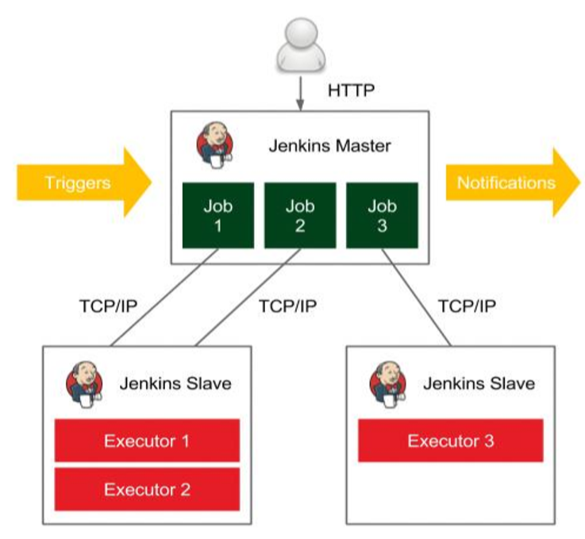
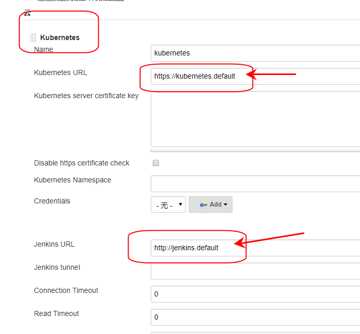

# k8s自动化部署

1. 准备工作
2. [部署Harbor仓库](#部署Harbor仓库)
3. [jenkins-slave镜像搭建](#jenkins-slave镜像搭建)
4. [部署jenkins](#部署jenkins)
5. [jenkins+gitlab挂钩](#jenkins+gitlab挂钩)


## 准备工作

流程图：


服务器环境：

| IP          | 角色                     |
| ----------- | ------------------------ |
| 192.168.0.1 | master1、Harbor、Jenkins |
| 192.168.0.2 | node1                    |
| 192.168.0.3 | node2、Gitlab            |


## 部署Harbor仓库

1、下载harbor二进制文件：https://github.com/goharbor/harbor/releases 

2、安装 docker compose

```bash
sudo curl -L https://github.com/docker/compose/releases/download/1.22.0/docker-compose-$(uname -s)-$(uname -m) -o /usr/local/bin/docker-compose
# 设置可执行权限
chmod +x /usr/local/bin/docker-compose
```

3、此处应该设置自签证书的，即访问的时候是采用HTTPS进行访问的。此处略去，不影响我们接下去的部署。（后期会出一篇关于自签证书的文章，仅供参考）

4、将下载好的Harbor二进制包上传到服务器上面，然后解压出来

```sh
tar xzvf 包名
```

5、进入解压出来的文件夹harbor中，修改配置文件

```sh
vim harbor.cfg
# 把其中的hostname修改为：master1的IP地址。
# 然后修改harbor的登录密码：harbor_admin_password
```

6、在当前文件夹中开启harbor

```sh
./prepare
./install.sh  # 运行此处的时候需要一定的时间，请等待吧
```

7、启动成功，查看一下（完美的运行）

```sh
docker-compose ps
```

此处介绍一下我创建的项目：

- coresdk：主要用来存放 asp.net core 所需要的sdk
- ops：主要是用来存放jenkins镜像和jenkins-slave镜像
- project：主要存放 asp.netcore 项目的镜像，供k8s拉取

至此，harbor部署完成。


## jenkins-slave镜像搭建

操作服务器：node1

> 说明：jenkins-slave 主要是为了分担jenkins-master的压力。如下图所示：（在多任务运行的时候可以采用）



1、为了创建jenkins-slave镜像，我这边准备了三个文件

- Dockerfile：构建jenkins-slave镜像

- jenkins-slave：shell脚本（需要加入可执行权限 chmod +x jenkins-slave），在镜像构建时需要用到。

- slave.jar: 启动脚本

Dockerfile 文件内容如下：

```dockerfile
FROM ubuntu

ENV JAVA_HOME /user/local/jdk
ENV PATH=${JAVA_HOME}/bin:/usr/local/maven/bin:$PATH

RUN apt-get update && \
    apt-get install -y curl git libltdl-dev && \
    apt-get clean all && \
    rm -rf /var/lib/apt && \
    mkdir -p /usr/share/jenkins
  
COPY slave.jar /usr/share/jenkins/slave.jar
COPY jenkins-slave /usr/bin/jenkins-slave

ENTRYPOINT ["jenkins-slave"]
```

2、配置java的基础环境

配置 JDK和maven，把下载的二进制包放到如下目录：

- apache-maven-3.5.3-bin.tar.gz 解压到的地址为 /usr/local/maven 里面
- jdk-8u45-linux-x64.tar.gz 解压到的地址为 /usr/local/jdk 里面

3、准备好环境后，构建镜像

```sh
docker build -t 192.168.0.1/ops/jenkins-slave .
# 构建完成后把镜像推送到Harbor仓库中
# 在node1中添加harbor仓库的IP地址（否则无法登录）
vim /etc/docker/daemon.json
# ---------------------------------------------------
{
  # ...
  "insecure-registries": ["192.168.0.1"]
}
# ---------------------------------------------------

# 执行 docker info，看一下IP地址是否生效
# 登录
docker login 192.168.0.1 
# 推送
docker push 192.168.0.1/ops/jenkins-slave
```

至此，jenkins-slave 镜像已推送完毕。


## 部署jenkins

部署jenkins时，把jenkins的数据卷采用pv/pvc、nfs 进行挂载。

1、准备文件

- jenkins-service-account.yml：jenkins的服务账号创建

- jenkins.yml：创建容器和service服务。进行可以访问。

- Dockerfile：主要用来生成 jenkins 镜像。

- registry-pull-secret.yaml：部署时可以直接登录harbor仓库拉取镜像（部署jenkins需要用到）

2、切换到node1服务器

```sh
# 把之前准备好的Dockerfile文件构建一下
docker build -t 192.168.0.2/ops/jenkins:lts-alpine .
# 推送到Harbor仓库，命令：
docker push 192.168.0.1/ops/jenkins:lts-alpine
```

3、切换到master服务器

构建 jenkins-service-account.yml 和 jenkins.yml 文件以及 registry-pull-secret.yaml

> 特别注意 registry-pull-secret.yaml 中的 namespace 需要在k8s中创建，data里面的64位认证信息需要登录harbor仓库后将生成的信息黏贴在这里
>
> 生成方式为：在有登录 harbor 的 node 服务器上面执行以下命令：

```sh
cat ~/.docker/config.json |base64 -w0
```


```sh
# 修改上面的文件后，命令：
kubectl create -f 文件名
# 查看jenkins是否运行（还可以看到运行的节点）
kubectl get pod -o wide
# 查看service，记住jenkins的外部访问端口
kubectl get svc
```

4、用浏览器访问：http://运行节点url:端口

1. 在第一次登录的时候需要密码进行解锁jenkins，按照提示获取密码即可
2. 然后“选择插件来安装”，如果需要特别的插件直接选择，否则直接安装即可

5、要想把jenkins关联到k8s中需要安装几个插件

打开“系统管理” => “管理插件” 然后安装

Kubernetes Continuous Deploy、Kubernetes、Gitlab Hook 、GitLab、Build Authorization Token

6、安装完毕后就开始构建项目


7、创建完任务后先不进行配置，我们先要设置一下 jenkins 挂钩 k8s 的环境

点击 “系统管理” => “系统设置”。一直往下滑动，点击“新增一个云”，选择k8s，如果这边没有出现k8s，则代表你的插件没有安装成功，请重新安装吧。

然后配置一下里面的内容，只要配置如下两个地方就可以了。针对URL，我这边是采用 kube-dns 来做服务发现，不需要实际的 ip 地址进行输入。至此搞定。不过还得配置一下 “凭证”，即SSH密钥，方便可以从 gitlab 那边拉取代码，有玩过 gitlab 应该知道，拉取代码分为 git 和 http。



此处如果发现测试不通过，请现在 k8s 中安装一下 kube-dns.yaml

```sh
kubectl create -f kube-dns.yaml
```

8、添加凭证

在这里我添加两个凭证：ssh和k8s的凭证。这个自行添加一下即可。

> 这里要注意一下：凭证生成后，进入凭证里面会有一个自动生成的 ID，此 ID 需要在 asp.net core 项目中的 Jenkinsfile 里面配置。

root 中的密钥是私钥，并且在服务器上需要把公钥配置到 gitlab 上。


这下面是 gitlab 上面配置ssh，ssh的私钥和公钥，直接在 node服务器上生成一下即可 ssh-keygen，然后把里面的内容复制出来即可。


## jenkins+gitlab挂钩


参考：

- https://www.cnblogs.com/guolianyu/p/9520046.html
- https://blog.csdn.net/walkon1007/article/details/112769224

