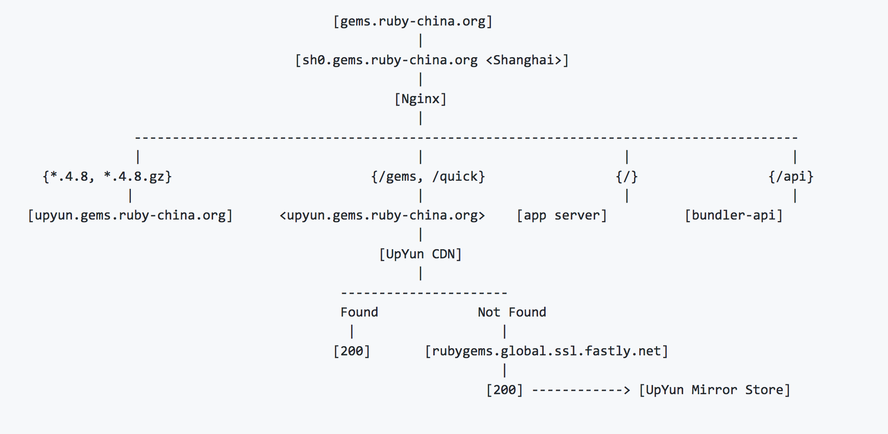
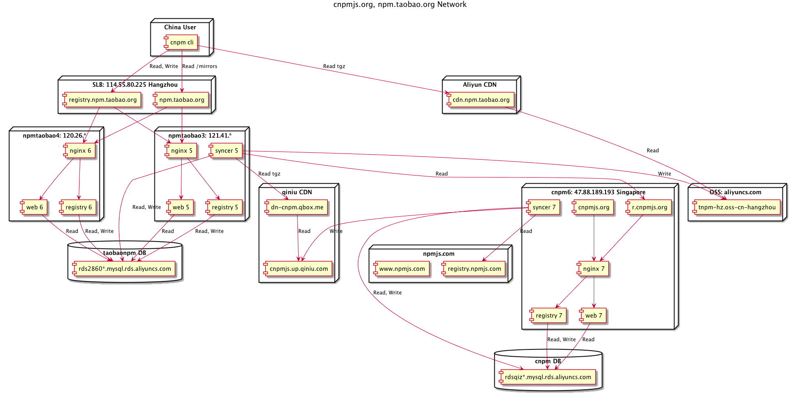

# 搭建公司内部包管理系统


## Ruby

- [RubyGems](https://rubygems.org/)：Ruby社区提供

  ```sh
  gem sources --add https://gems.ruby-china.org/ --remove https://rubygems.org/
  ```

  https://gems.ruby-china.org/ 国内镜像

  

  ruby-china开源了他们的项目代码及架构方案，只需参考搭建，关键步骤是收到请求后借助CDN回源到rubygems.global.ssl.fastly.net获取项目包并缓存https://github.com/ruby-china/rubygems-mirror.


## JavaScript

- [npm](https://www.npmjs.com)：Node.js自带

  https://npm.taobao.org/ 国内镜像

  

  淘宝提供的镜像中变化频繁的文件通过部署的多个国内外节点进行数据同步和负载均衡，静态压缩文件通过阿里云的CDN提供下载。

  开源产品[verdaccio](https://github.com/verdaccio/verdaccio) 继承了[sinopia](https://github.com/rlidwka/sinopia)的衣钵，提供了一套可靠的私有npm仓库服务器。既可以发布私有包，还可以做代理服务器供内部下载包。

- [yarn]()：FB开发，提供与NPM兼容的更好包管理解决方案。


## PHP

- [composer](https://packagist.org/)

  https://pkg.phpcomposer.com/ 国内镜像

  [toran Proxy](https://toranproxy.com/)是一个提供 composer 公共/私有源的server，可以设置指定代理公共源地址，支持对cvs仓库创建私有第三方composer包，它是免费的。

  [satis](https://github.com/composer/satis) 是开源免费的静态私有源server，可以配合自行开发的镜像代理服务使用。


## Python

- [pip](https://pypi.python.org/pypi)

  [pypiserver](https://github.com/pypiserver/pypiserver)提供一个简单的pypi代理server。

  [z3c.pypimirror](https://pypi.python.org/pypi/z3c.pypimirror)可以搭建一个pypi的镜像站。


## JAVA

- [maven](http://repo.maven.apache.org/maven2/)：Apache Maven提供了官方中央仓库，Sonatype公司也提供了自己的中央[仓库](https://search.maven.org)

  Sonatype公司开发的[Nexus Repository OSS](https://www.sonatype.com/nexus-repository-oss)提供免费的代码仓库管理器，包含这些包管理工具的Server：maven、bower、docker、npm、nuget、rubygems、pypi。


## Lua

- [Luarocks](https://luarocks.org/)

  [luarocks](https://github.com/luarocks/luarocks-site) 官方提供站点源代码。

- [opm](https://opm.openresty.org/)：openresty的包管理器

  openresty opm仓库太小，暂无必要性。


## GoLang

- [pkg](https://golang.org/pkg/)：需翻墙

  暂无方案，翻墙吧！

- [Godep](https://github.com/tools/godep)


**怎么保证稳定性**

把包管理系统引入到公司的打包部署系统中就要考虑其高可用方案，否则打包出问题，常规上线发版都会出问题。

我们PHP团队有两大框架派系，业务团队采用 laravel/lumen 框架提高开发效率并大量使用composer和第三方包，复合API接口团队采用Yaf框架提高产品性能并拒绝第三方包。我当时是负责营销活动的研发，为了提高开发效率，积极的推动 laravel/lumen 框架和composer的使用；为了弥补性能缺憾，积极的推动升级php7以及对框架的性能优化。

一开始，我们使用国内镜像 https://pkg.phpcomposer.com/ 来做本地开发的包依赖更新，并把依赖文件提交到代码库，因为composer仓库只支持源代码的下载更新，只依赖php的版本及php扩展，不依赖操作系统，我们的打包部署就十分简单。

后来我们的项目越来越多，形成了一定量的公共代码库，我们决定搭建一套composer私有仓库来管理维护，在satis和toran中我们选择了参考功能更丰富的toran开发了自己的composer仓库即提供私有库也提供代理packagist.org的公有库，我们开始把项目中的composer仓库地址指向内部仓库。早期的php项目的构建部署流程很短，只用把代码推到远端目录即可，引入composer的同时，我们还完善了phpunit与Jenkins的集成等工作，构建部署流程为：

1. 迁出代码。
2. 执行composer install等程序构建可执行环境。
3. 执行PHP_CodeSniffer做语法和样式检查。
4. 执行phpunit测试用例并生成代码覆盖率报告，一般要保证做到控制器和业务方法的100%覆盖，其他的部分不做硬性要求，公共库不在业务项目中，单独保证覆盖率。
5. 打包推送部署。

为了保证composer服务器的高可用，在服务器前面加了一层文件缓存层，packagist.org的文件同步比较花时间，我们放在夜里跑定时任务同步，每天同步一次，参考 https://packagist.phpcomposer.com/packages.json 生成自己的服务端描述文件packages.json和provider.json.

还有一台测试机用于一些实验性的功能开发测试及备份一套全量同步packagist.org的文件。

包管理系统在公司中属于没人关注的系统，没有资源来做，纯靠研发自驱动了，群里有同学提到他们的npm仓库就是找实习生搭建的，研发团队冷暖自知，其他部门很难介入这个系统的维护，为此，只能优先保证私有仓库的可用性，因为他体量足够小，当成微服务部署即可，公有仓库一旦同步出了问题，导致客户端更新安装失败，临时的解决方案就是在项目的包管理描述文件packages.json（composer.json）中设置指定国内镜像或官方源后再试。

**再说两句**

npm私有仓库的搭建直接放[链接](https://mp.weixin.qq.com/s?__biz=MzA5Nzk5MzE3Ng==&mid=401510950&idx=1&sn=f775d53fa36e2a7284eb6399e0a0f6c1&scene=4#wechat_redirect)了，不在文中细述。[verdaccio](https://github.com/verdaccio/verdaccio)的安装方法类同[sinopia](https://github.com/rlidwka/sinopia).

前不久，我们部署nodejs的时候npm安装失败了（这是用包管理系统要承担的风险，老出意料不到的故障！

> error Couldn\'t find package "@types/geojson" on the "npm" registry.

https://github.com/npm/npm/issues/16435.

私有仓库的配置需要支持一下@types这种npm包的新规则解析。

有多少人遇到执行一次npm install需要10分钟的？我们遇到了，解决方案就是上yarn，可以并行处理，时间直接缩短到1分钟，没话说，还可以用上yarn.lock锁版本，不用再去想shrinkwrap方案 什么是shrink方案？ 传送门 http://tech.meituan.com/npm-shrinkwrap.html。

提到包管理，不得不一遍遍的提16年3月23日npm的left-pad删库跑路事件。

传送门：http://blog.npmjs.org/post/141577284765/kik-left-pad-and-npm

知乎：https://www.zhihu.com/question/41694868

用npm的时候我们常常不得不在package.json中把第三方包的版本号固定下来，不然就坑了，例如：koa 2.0.1兼容nodejs 5，koa 2.0.2只支持 nodejs 7.6+，人家团队虽然有理想，但人家发布版本也很随意嘛。

那要不要把包管理的lock文件体积到代码库中？分情况，php的项目中我们引用的三方库包都是比较成熟稳定的，有大量用户验证的，二方库包严格按照semver升级版本号并发布，无需lock。js的项目npm仓库虽然各种库被大量使用，但维护方并不可靠，最好锁一下。