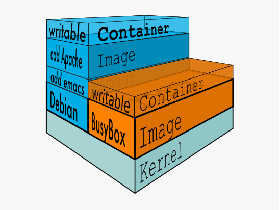

# docker

目录：

1. [架构](#架构)

2. [核心技术](#核心技术)


NIST(National Institute of Standards and Technology)对云计算平台的定义：

云计算是一种资源的服务模式，该模式可以实现随时随地从可配置计算资源共享池中获取所需的资源（如网络、服务器、存储、应用及服务)，资源能够快速供应并释放，大大减少资源管理工作开销，甚至可以不用理会那些令人头痛的传统服务供应商。

经典云计算架构（三层服务模型）：

- IaaS（Infrastructure as a Service，基础设施即服务）：客户关系管理、邮件、虚拟桌面、通信、游戏......

- PaaS（P1atform as a Service，平台即服务）：运行时环境、数据库、Web服务器、开发工具......

- SaaS（Software as a Service，软件即服务）：虚拟机、存储、负载均衡、网络......

云时代应用生命周期管理机制(Application Lifecycle Management, ALM) 和十二要素应用规范(The Twelve-Factor App)也随之应运而生。

Docker的设计理念是希望用户能够保证一个容器只运行一个进程，即只提供一种服务。然而，对于用户而言，单一容器是无法满足需求的。通常用户需要利用多个容器，分别提供不同的服务，并在不同容器间互连通信，最后形成一个Docker集群，以实现特定的功能。

**为什么需要docker？**

首先，Docker 的出现一定是因为目前的后端在开发和运维阶段确实需要一种虚拟化技术解决开发环境和生产环境环境一致的问题，通过 Docker 我们可以将程序运行的环境也纳入到版本控制中，排除因为环境造成不同运行结果的可能。但是上述需求虽然推动了虚拟化技术的产生，但是如果没有合适的底层技术支撑，那么我们仍然得不到一个完美的产品。

不论IaaS还是PaaS都有各自适用的场景，但依旧存在诸多缺陷，人们亟需一个真正可用的解决方案。每一场革命背后都有着深刻的历史背景和矛盾冲突，新陈代谢是历史的必然结果，新生取代陈旧得益于理念的飞跃和对时代发展需求的契合，很显然Docker抓住了这个契机。作为一种新兴的虚拟化方式，Docker 跟传统的虚拟化方式相比具有众多的优势。

Docker 在如下几个方面具有较大的优势：

- 更快速的交付和部署

  Docker在整个开发周期都可以完美的辅助你实现快速交付。Docker允许开发者在装有应用和服务本地容器做开发。可以直接集成到可持续开发流程中。

  例如：开发者可以使用一个标准的镜像来构建一套开发容器，开发完成之后，运维人员可以直接使用这个容器来部署代码。Docker 可以快速创建容器，快速迭代应用程序，并让整个过程全程可见，使团队中的其他成员更容易理解应用程序是如何创建和工作的。 Docker 容器很轻很快！容器的启动时间是秒级的，大量地节约开发、测试、部署的时间。

- 高效的部署和扩容

  Docker 容器几乎可以在任意的平台上运行，包括物理机、虚拟机、公有云、私有云、个人电脑、服务器等。这种兼容性可以让用户把一个应用程序从一个平台直接迁移到另外一个。

  Docker的兼容性和轻量特性可以很轻松的实现负载的动态管理。你可以快速扩容或方便的下线的你的应用和服务，这种速度趋近实时。

- 更高的资源利用率

  Docker 对系统资源的利用率很高，一台主机上可以同时运行数千个 Docker 容器。容器除了运行其中应用外，基本不消耗额外的系统资源，使得应用的性能很高，同时系统的开销尽量小。传统虚拟机方式运行 10 个不同的应用就要起 10 个虚拟机，而Docker 只需要启动 10 个隔离的应用即可。

- 更简单的管理

  使用 Docker，只需要小小的修改，就可以替代以往大量的更新工作。所有的修改都以增量的方式被分发和更新，从而实现自动化并且高效的管理。

**开发、测试、发布一体化**

通过Docker提供的虚拟化方式，可以快速建立起一套可复用的开发环境，以镜像的形式将开发环境分发给所有开发成员，达到了简化开发环境搭建过程的目的。Docker的优点在于可以简化CI（持续集成）和CD（持续交付）的构建流程，让开发者集中精力在应用开发上，同时运维和测试也可以并行进行，并保持整个开发、测试、发布和运维的一体化。

Docker以镜像和在镜像基础上构建的容器为基础，以容器为开发、测试和发布的单元，将与应用相关的所有组件和环境进行封装，避免了应用在不同平台间迁移时所带来的依赖性问题，确保了应用在生产环境的各阶段达到高度一致的实际效果。

在开发阶段，镜像的使用使得构建开发环境变得简单和统一。随着Docker的发展，镜像资源也日益丰富，开发人员可以轻易地找到适合的镜像加以利用。同时，利用Dockerfile也可以将一切可代码化的东西进行自动化运行。Docker最佳实践是将应用分割成大量彼此松散耦合的Docker容器，应用的不同组件在不同的容器中同步开发，互不影响，为实现持续集成和持续交付提供了先天的便利。

在测试阶段，可以直接使用开发所构建的镜像进行测试，直接免除了测试环境构建的烦恼，也消除了因为环境不一致所带来的漏洞问题。

在部署和运维阶段，与以往代码级别的部署不同，利用Docker可以进行容器级别的部署，把应用及其依赖环境打包成跨平台、轻量级、可移植的容器来进行部署。

Docker已经逐渐发展成为一个构建、发布、运行分布式应用的开放平台，以轻量级容器为核心建立起了一套完整的生态系统，它重新定义了应用开发、测试、交付和部署的过程。在当前云计算飞速发展的背景下，Docker 将引领着云时代进入一个崭新的发展阶段。

**docker是什么？**

根据官方的定义，Docker是以Docker容器为资源分割和调度的基本单位，封装整个软件运行时环境，为开发者和系统管理员设计的，用于构建、发布和运行分布式应用的平台。

它是一个跨平台、可移植并且简单易用的容器解决方案。

Docker的源代码托管在GitHub上，基于Go语言开发，并遵从Apache 2.0协议。

Docker可在容器内部快速自动化地部署应用，并通过操作系统内核技术（namespaces、cgroups等）为容器提供资源隔离与安全保障。

**讲故事**

首先你有一个 100 平方的房子（服务器），已知你（PHP 应用）需要吃喝拉撒睡觉，所以整个房子划分了卧室、厨房、卫生间等，然后供你一个人享用，但其实挺浪费的，你一个人并不需要 100 平方这么大，可能需要 20 平方（服务器占用 20%）就好了。

后来又来了个别人（Java 应用）也被安排到了这个房子里生活，他也需要吃喝拉撒睡，所以你们挤在了一个床上，用一个卫生间（比如 http 服务器）。如果你改了你的习惯（例如 http 服务配置项）同样会影响别人的生活。

后来又来了人（Node 应用），这时候房东发现房子不够大了，所以搬家（迁移、升级服务器）到另一个 150 平的房子，但是搬家成本好高。由于户型不同（系统版本、环境等）需要装修好久，此外还要把住户（应用代码）搬过来，还需要把住户自定义的习惯都带过来简直麻烦死了。

这时候，房东了解到了一个叫 Docker 的产品。

Docker 是一个可自由伸缩的集装箱房屋，这个集装箱房屋虽小但是五脏俱全，而且可以满足一切用户需求，并支持高度自定义，比如 Node 这位住户不需要厨房，那么他的集装箱房子就小一点，当然房租（服务器消耗）也便宜一些。

房东用了 Docker 这个产品之后，发现租房这个事情变简单了：

- 房东不需要划分卫生间、厨房、卧室并进行装修了，一切由用户自己定制集装箱。房东只需要把集装箱放到房间里即可。
- 住户也不需要打架了，以前一起付房租（消耗服务器资源），现在按照自己集装箱大小付费。而且你可以在你集装箱里面随便折腾，爱怎么改配置就怎么改，也不会影响到别人。
- 集装箱对于空间的使用，更加直观，房东可以更轻松了解到当前房间的空间使用率等，以便升级房间。
- 房东搬新家的时候也开心了，只要把一面墙炸开，把里面一个个集装箱直接移过去新房子就好了，啥也不需要配置，都在集装箱里面呢。

故事讲完了：

- 你就是房东，做运维的。房间是服务器，空间大小表示服务器硬件配置。
- 住户就是你的业务、应用，提供服务的。

伸缩集装箱房屋，就是 Docker 容器，里面是完全分离、独立、自由的环境和业务代码。你可以在里面装一个 Ubuntu（消耗大）或者简版的、可以跑业务代码的环境（消耗低）。 

- Docker 抹平系统差异，相当于把你多个房间都砸成长方形方便存放集装箱。这样你可以快速把独立容器丢到各个配置了 Docker 的不同系统、硬件配置的服务器上面。

- 因此也可以得到很高的伸缩性，可以瞬间部署很多服务器很多容器，然后负载均衡来提供大促服务等。

- 当然 Docker 概念、功能不只是我上面说的这些，这些只是我认为比较核心关键的。

[Docker](https://www.docker.com/) 是一个开源的引擎，可以轻松的为任何应用创建一个轻量级的、可移植的、自给自足的容器。

- 创始人Solomon Hykes，法国dotCloud公司

- 2013年3月以 Apache2.0 协议开源，在 [GitHub上](https://github.com/docker/docker) 维护

- 使用 Go 语言实现，在Linux操作系统上提供了一个软件抽象层和操作系统层虚拟化的自动管理机制。

  > Docker 利用了 Linux 的资源分托机制（cgroups 以及 namespace）来创建独立的软件容器。Linux 对 namespace（命名空间）的支持完全隔离工作环境中的应用程序，包括进程树，网络，用户ID挂载文件系统；而 cgroups 则提供了资源隔离，包括CPU，内存等。

- 初衷：创建软件程序可移植的轻量容器，让软件可以在任何安装了 Docker 的主机上运行，而不用关心底层操作系统。

**简单类比：**

20 世纪 50 年代，还没有处理器这个词，而复印机无处不在（某种程度上）。假设你负责按要求快速发出成批的信件、将这些信件邮寄给客户、使用纸张和信封以物理方式寄送到每个客户的地址（那时还没有电子邮件）。在某个时候，你意识到，这些信件只是由一大组段落组合而成的，根据信件的用途对其进行所需的选取和排列，因此，你设计了一个系统，以快速发送这些信件，希望能大幅提高效率。这个系统很简单：

1. 先从一副透明薄片开始，每个薄片包含一个段落。

2. 若要发送一组信件，你选择包含所需段落的薄片，然后堆栈并对齐它们，使其外观一致且易于阅读。

3. 最后，你将其置于复印机中并按开始，以生成所需的多个信件。

简而言之，这就是 Docker 的核心理念。在 Docker 中，**每层都是在执行命令（例如，安装程序）后在文件系统所发生的一组更改**。因此，当你在复制层后“查看”文件系统时，你将看到所有文件，包括在安装程序时的层。你可以将映像视为要在“计算机”中安装的辅助只读硬盘，其中操作系统已经安装。同样，你可以将容器视为已安装映像硬盘的“计算机”。与计算机一样，可以打开或关闭容器电源。

**优越性：**如果你在一台机器上可以开10个虚拟机，那么用 docker 可以开100个容器！

**基本概念：**

- 虚拟化：一种资源管理技术，将计算机的各种实体资源予以抽象、转换后呈现出来，打破实体结构间的不可切割的障碍，使用户可以比原本的配置更好的方式来应用这些资源。

  这些资源的新虚拟部分是不受现有资源的架设方式，地域或物理配置所限制。一般所指的虚拟化资源包括计算能力和数据存储。

- 系统虚拟化，Hypervisor Virtualization，全虚拟化。

  在 Host 中通过 Hypervisor 层实现安装多个 GuestOS，每个 GuestOS 都有自己的内核，和主机的内核不同，GuestOS 之间完全隔离。

- 容器虚拟化，Operating System Virtualization ，使用 Linux 内核中的 namespaces 和 cgroups 实现进程组之间的隔离。是用内核技术实现的隔离，所以它是一个共享内核的虚拟化技术。

  容器虚拟化没有 GuestOS，使用 Docker 时下载的镜像，只是为运行 App 提供的一个依赖的环境，是一个删减版本的系统镜像。**一般情况下系统虚拟化没有容器虚拟化的运行效率高，但是系统安全性高很多**。


注册一个docker账号：[https://hub.docker.com/](https://hub.docker.com/)

**为什么使用Docker？**

Docker是一种新兴的虚拟化方式，但是，Docker不是虚拟机。传统的虚拟机是先虚拟硬件资源，然后在虚拟的硬件资源之上运行操作系统。而Docker容器作为一个进程，直接运行于宿主主机内核，因此Docker更加快捷。

Docker具有很多优势：

- 高效利用系统资源（没有虚拟硬件的额外开销）。
- 更快的启动时间（通常可以在1秒内启动）。
- 便于部署（镜像包含了应用和相关依赖，可以运行在任何配置了Docker的主机上）。
- 轻松迁移。
- 分层存储，提高存储效率。


**Docker术语**

- **存储库(repo)**：相关的 Docker 映像集合，带有指示映像版本的标记。某些存储库包含特定映像的多个变量，例如包含 SDK（较重）的映像，包含唯一运行时（较轻）的映像等等。这些变量可以使用标记进行标记。单个存储库中可包含平台变量，如 Linux 映像和 Windows 映像。

- **注册表**：提供存储库访问权限的服务。大多数公共映像的默认注册表是[Docker 中心](https://hub.docker.com/)（归作为组织的 Docker 所有）。注册表通常包含来自多个团队的存储库。公司通常使用私有注册表来存储和管理其创建的映像。 另一个示例是 Azure 容器注册表。

- **Docker中心**：上传并使用映像的公共注册表。 Docker 中心提供 Docker 映像托管、公共或私有注册表，生成触发器和 Web 挂钩，以及与 GitHub 和 Bitbucket 集成。

- **Azure容器注册表**：用于在 Azure 中使用 Docker 映像及其组件的公共资源。这提供了与 Azure 中的部署接近的注册表，使你可以控制访问权限，从而可以使用 Azure Active Directory 组和权限。

- **Docker受信任注册表(DTR)**：Docker注册表服务（来自Docker），可以安装在本地，因此它存在于组织的数据中心和网络中。这对于应该在企业内部管理的私有映像来说很方便。Docker受信任注册表是Docker数据中心产品的一部分。有关详细信息，请参阅[Docker受信任注册表(DTR)](https://docs.docker.com/docker-trusted-registry/overview/)。

- **Docker社区版(CE)**：适用于 Windows 和 macOS、用于在本地生成、运行和测试容器的开发工具。适用于 Windows 的 Docker CE 为 Linux 和 Windows 容器提供了开发环境。Windows 上的 Linux Docker 主机基于 [Hyper-V](https://www.microsoft.com/cloud-platform/server-virtualization)虚拟机。适用于 Windows 容器的主机直接基于 Windows。适用于 Mac 的 Docker CE 基于 Apple 虚拟机监控程序框架和[xhyve虚拟机监控程序](https://github.com/mist64/xhyve)，在 Mac OS X 上提供了 Linux Docker 主机虚拟机。适用于 Windows 和 Mac 的 Docker CE 替换了 Docker 工具箱，后者基于 Oracle VirtualBox。

- **Docker企业版(EE)**：适用于 Linux 和 Windows 开发的 Docker 工具企业级版本。

Docker 目前已经成为了非常主流的技术，已经在很多成熟公司的生产环境中使用，但是 Docker 的核心技术其实已经有很多年的历史了，Linux 命名空间、控制组和 UnionFS 三大技术支撑了目前 Docker 的实现，也是 Docker 能够出现的最重要原因。

由于 Docker 目前的代码库实在是太过庞大，想要从源代码的角度完全理解 Docker 实现的细节已经是非常困难的了，但是如果各位读者真的对其实现细节感兴趣，可以从 [Docker CE](https://github.com/docker/docker-ce) 的源代码开始了解 Docker 的原理。

**容器云概念**

**为什么出现？**

容器为用户打开了一扇通往新世界的大门，真正进入这个容器的世界后，却发现新的生态系统如此庞大。在生产使用中，不论是个人还是企业，都会提出更复杂的需求。这时，我们需要众多跨主机的容器协同工作，需要支持各种类型的工作负载，企业级应用开发更是需要基于容器技术，实现支持多人协作的持续集成、持续交付平台。从容器到容器云的进化便应运而生。

**什么是容器云？**

容器云以容器为资源分割和调度的基本单位，封装整个软件运行时环境，为开发者和系统管理员提供用于构建、发布和运行分布式应用的平台。


### docker架构

**Docker Engine**

1. 最核心的是 Docker Daemon 我们称之为**Docker守护进程**，也就是 Server 端，Server 端可以部署在远程，也可以部署在本地，因为 Server 端与客户端(Docker Client)是通过 Rest API 进行通信。

2. REST 做过 web 开发都了解，它的效率杠杠的。

3. docker CLI 实现容器和镜像的管理，为用户提供统一的操作界面，这个客户端提供一个只读的镜像，然后通过镜像可以创建一个或者多个容器。(container)，这些容器可以只是一个RFS(Root File System)，也可以是一个包含了用户应用的RFS。容器在docker Client中只是一个进程，两个进程是互不可见的。用户不能与 server 直接交互，但可以通过与容器这个桥梁来交互，由于是操作系统级别的虚拟技术，中间的损耗几乎可以不计。

4. 其实 docker 就是个 C/S 的架构，有 client 和 server 的。


**Docker的组织架构**

Docker使用C/S架构，Client 通过接口与Server进程通信实现容器的构建，运行和发布。client和server可以运行在同一台集群，也可以通过跨主机实现远程通信。


**Docker的底层技术支持**

容器 = cgroup（资源控制）+ namespace（访问隔离）+ rootfs（文件系统隔离）+ 容器引擎（用户态工具LXC，生命周期控制）


### 核心技术

#### Namespaces

命名空间 (namespaces)是 Linux 为我们提供的用于分离进程树、网络接口、挂载点以及进程间通信等资源的方法。在日常使用 Linux 或者 macOS 时，我们并没有运行多个完全分离的服务器的需要，但是如果我们在服务器上启动了多个服务，这些服务其实会相互影响的，每一个服务都能看到其他服务的进程，也可以访问宿主机器上的任意文件，这是很多时候我们都不愿意看到的，我们更希望运行在同一台机器上的不同服务能做到完全隔离，就像运行在多台不同的机器上一样。

在这种情况下，一旦服务器上的某一个服务被入侵，那么入侵者就能够访问当前机器上的所有服务和文件，这也是我们不想看到的，而Docker其实就通过Linux的Namespaces对不同的容器实现了隔离。

Linux的命名空间机制提供了七种不同的命名空间，通过这七个选项我们能在创建新的进程时设置新进程应该在哪些资源上与宿主机器进行隔离。

| **namespaces** | **系统调用参数** | **隔离内容**               |
| -------------- | ---------------- | -------------------------- |
| UTS            | CLONE_NEWUTS     | 主机名与域名               |
| IPC            | CLONE_NEWIPC     | 信号量、消息队列和共享内存 |
| PID            | CLONE_NEWPID     | 进程编号                   |
| Network        | CLONE_NEWNET     | 网络设备、网络栈、端口等   |
| Mount          | CLONE_NEWNS      | 挂载点（文件系统）         |
| User           | CLONE_NEWUSER    | 用户和用户组               |
|                | CLONE_NEWCGROUP  |                            |

实际上，Linux内核实现namespace的一个主要目的，就是实现轻量级虚拟化（容器）服务。在同一个namespace下的进程可以感知彼此的变化，而对外界的进程一无所知。这样就可以让容器中的进程产生错觉，仿佛自己置身于一个独立的系统环境中，以达到独立和隔离的目的。

本节所讨论的namespace实现针对的均是Linux内核3.8及以后的版本。

进行 namespace API 操作的方式：

1、 通过 clone() 在创建新进程的同时创建namespace

2、 查看 /proc/[pid]/ns 文件

3、 通过 setns() 加入一个已经存在的 namespace

4、 通过 unshare() 在原先进程上进行 namespace 隔离

5、 fork() 系统调用

#### 进程

进程是 Linux 以及现在操作系统中非常重要的概念，它表示一个正在执行的程序，也是在现代分时系统中的一个任务单元。在每一个 *nix 的操作系统上，我们都能够通过 ps 命令打印出当前操作系统中正在执行的进程，比如在 Ubuntu 上，使用该命令就能得到以下的结果：

```sh 
ps -ef

UID     PID  PPID  C STIME TTY      TIME CMD
root     1   0  0 Apr08 ?     00:00:09 /sbin/init
root     2   0  0 Apr08 ?     00:00:00 [kthreadd]
root     3   2  0 Apr08 ?     00:00:05 [ksoftirqd/0]
root     5   2  0 Apr08 ?     00:00:00 [kworker/0:0H]
root     7   2  0 Apr08 ?     00:07:10 [rcu_sched]
root     39   2  0 Apr08 ?     00:00:00 [migration/0]
root     40   2  0 Apr08 ?     00:01:54 [watchdog/0]
...
```

当前机器上有很多的进程正在执行，在上述进程中有两个非常特殊，一个是 pid 为 1 的 /sbin/init 进程，另一个是 pid 为 2 的 kthreadd 进程，这两个进程都是被 Linux 中的上帝进程 idle 创建出来的，其中前者负责执行内核的一部分初始化工作和系统配置，也会创建一些类似 getty 的注册进程，而后者负责管理和调度其他的内核进程。


如果我们在当前的 Linux 操作系统下运行一个新的 Docker 容器，并通过 exec 进入其内部的 bash 并打印其中的全部进程，我们会得到以下的结果：

```sh
root@iZ255w13cy6Z:~# docker run -it -d ubuntu
b809a2eb3630e64c581561b08ac46154878ff1c61c6519848b4a29d412215e79
root@iZ255w13cy6Z:~# docker exec -it b809a2eb3630 /bin/bash
root@b809a2eb3630:/# ps -ef

UID     PID  PPID  C STIME TTY      TIME CMD
root     1   0  0 15:42 pts/0   00:00:00 /bin/bash
root     9   0  0 15:42 pts/1   00:00:00 /bin/bash
root     17   9  0 15:43 pts/1   00:00:00 ps -ef
```

在新的容器内部执行 ps 命令打印出了非常干净的进程列表，只有包含当前 ps -ef 在内的三个进程，在宿主机器上的几十个进程都已经消失不见了。

当前的 Docker 容器成功将容器内的进程与宿主机器中的进程隔离，如果我们在宿主机器上打印当前的全部进程时，会得到下面三条与 Docker 相关的结果：

```sh
UID     PID  PPID  C STIME TTY      TIME CMD
root   29407   1  0 Nov16 ?     00:08:38 /usr/bin/dockerd --raw-logs
root    1554 29407  0 Nov19 ?     00:03:28 docker-containerd -l unix:///var/run/docker/libcontainerd/docker-containerd.sock --metrics-interval=0 --start-timeout 2m --state-dir /var/run/docker/libcontainerd/containerd --shim docker-containerd-shim --runtime docker-runc
root    5006  1554  0 08:38 ?     00:00:00 docker-containerd-shim b809a2eb3630e64c581561b08ac46154878ff1c61c6519848b4a29d412215e79 /var/run/docker/libcontainerd/b809a2eb3630e64c581561b08ac46154878ff1c61c6519848b4a29d412215e79 docker-runc
```

在当前的宿主机器上，可能就存在由上述的不同进程构成的进程树：


这就是在使用 clone(2) 创建新进程时传入 CLONE_NEWPID 实现的，也就是使用 Linux 的命名空间实现进程的隔离，Docker 容器内部的任意进程都对宿主机器的进程一无所知。

containerRouter.postContainersStart

└── daemon.ContainerStart

  └── daemon.createSpec

​    └── setNamespaces

​      └── setNamespace

Docker 的容器就是使用上述技术实现与宿主机器的进程隔离，当我们每次运行 docker run 或者 docker start时，都会在下面的方法中创建一个用于设置进程间隔离的 Spec：

```go
func (daemon *Daemon) createSpec(c *container.Container) (*specs.Spec, error) {
	s := oci.DefaultSpec()
	// ...
	if err := setNamespaces(daemon, &s, c); err != nil {
		return nil, fmt.Errorf("linux spec namespaces: %v", err)
	}
	return &s, nil
}
```

在 setNamespaces 方法中不仅会设置进程相关的命名空间，还会设置与用户、网络、IPC 以及 UTS 相关的命名空间：

```go
func setNamespaces(daemon *Daemon, s *specs.Spec, c *container.Container) error {
	// user
	// network
	// ipc
	// uts
	// pid
	if c.HostConfig.PidMode.IsContainer() {
		ns := specs.LinuxNamespace{Type: "pid"}
		pc, err := daemon.getPidContainer(c)
		if err != nil {
			return err
		}
		ns.Path = fmt.Sprintf("/proc/%d/ns/pid", pc.State.GetPID())
		setNamespace(s, ns)
	} else if c.HostConfig.PidMode.IsHost() {
		oci.RemoveNamespace(s, specs.LinuxNamespaceType("pid"))
	} else {
		ns := specs.LinuxNamespace{Type: "pid"}
		setNamespace(s, ns)
	}
	return nil
}
```

所有命名空间相关的设置 Spec 最后都会作为 Create 函数的入参在创建新的容器时进行设置：

daemon.containerd.Create(context.Background(), container.ID, spec, createOptions)

所有与命名空间的相关的设置都是在上述的两个函数中完成的，Docker 通过命名空间成功完成了与宿主机进程和网络的隔离。

#### chroot

在这里不得不简单介绍一下 chroot（change root），在 Linux 系统中，系统默认的目录就都是以 / 也就是根目录开头的，chroot 的使用能够改变当前的系统根目录结构，通过改变当前系统的根目录，我们能够限制用户的权利，在新的根目录下并不能够访问旧系统根目录的结构个文件，也就建立了一个与原系统完全隔离的目录结构。

与 chroot 的相关内容部分来自** [**理解 chroot**](https://www.ibm.com/developerworks/cn/linux/l-cn-chroot/index.html) **一文，各位读者可以阅读这篇文章获得更详细的信息。

#### CGroups

我们通过Linux的命名空间为新创建的进程隔离了文件系统、网络并与宿主机器之间的进程相互隔离，但是命名空间并不能够为我们提供物理资源上的隔离，比如CPU或者内存，如果在同一台机器上运行了多个对彼此以及宿主机器一无所知的『容器』，这些容器却共同占用了宿主机器的物理资源。


如果其中的某一个容器正在执行 CPU 密集型的任务，那么就会影响其他容器中任务的性能与执行效率，导致多个容器相互影响并且抢占资源。如何对多个容器的资源使用进行限制就成了解决进程虚拟资源隔离之后的主要问题，而 Control Groups（简称 CGroups）就是能够隔离宿主机器上的物理资源，例如 CPU、内存、磁盘 I/O 和网络带宽。

每一个 CGroup 都是一组被相同的标准和参数限制的进程，不同的 CGroup 之间是有层级关系的，也就是说它们之间可以从父类继承一些用于限制资源使用的标准和参数。


Linux 的 CGroup 能够为一组进程分配资源，也就是我们在上面提到的 CPU、内存、网络带宽等资源，通过对资源的分配，CGroup 能够提供以下的几种功能：


在 CGroup 中，所有的任务就是一个系统的一个进程，而 CGroup 就是一组按照某种标准划分的进程，在 CGroup 这种机制中，所有的资源控制都是以 CGroup 作为单位实现的，每一个进程都可以随时加入一个 CGroup 也可以随时退出一个 CGroup。

参考：[CGroup 介绍、应用实例及原理描述](https://www.ibm.com/developerworks/cn/linux/1506_cgroup/index.html)

Linux 使用文件系统来实现 CGroup，我们可以直接使用下面的命令查看当前的 CGroup 中有哪些子系统：

```sh
lssubsys -m
# ----------------------------------------
cpuset /sys/fs/cgroup/cpuset
cpu /sys/fs/cgroup/cpu
cpuacct /sys/fs/cgroup/cpuacct
memory /sys/fs/cgroup/memory
devices /sys/fs/cgroup/devices
freezer /sys/fs/cgroup/freezer
blkio /sys/fs/cgroup/blkio
perf_event /sys/fs/cgroup/perf_event
hugetlb /sys/fs/cgroup/hugetlb
```

大多数 Linux 的发行版都有着非常相似的子系统，而之所以将上面的 cpuset、cpu 等东西称作子系统，是因为它们能够为对应的控制组分配资源并限制资源的使用。

如果我们想要创建一个新的 cgroup 只需要在想要分配或者限制资源的子系统下面创建一个新的文件夹，然后这个文件夹下就会自动出现很多的内容，如果你在 Linux 上安装了 Docker，你就会发现所有子系统的目录下都有一个名为 docker 的文件夹：

```sh
ls cpu
# -----------------------------------------
cgroup.clone_children  
...
cpu.stat  
docker  
notify_on_release 
release_agent 
tasks

ls cpu/docker/
# -----------------------------------------
9c3057f1291b53fd54a3d12023d2644efe6a7db6ddf330436ae73ac92d401cf1 
cgroup.clone_children  
...
cpu.stat  
notify_on_release 
release_agent 
tasks
```

9c3057xxx 其实就是我们运行的一个 Docker 容器，启动这个容器时，Docker 会为这个容器创建一个与容器标识符相同的 CGroup，在当前的主机上 CGroup 就会有以下的层级关系：


每一个 CGroup 下面都有一个 tasks 文件，其中存储着属于当前控制组的所有进程的 pid，作为负责 cpu 的子系统，cpu.cfs_quota_us 文件中的内容能够对 CPU 的使用作出限制，如果当前文件的内容为 50000，那么当前控制组中的全部进程的 CPU 占用率不能超过 50%。

如果系统管理员想要控制 Docker 某个容器的资源使用率就可以在 docker 这个父控制组下面找到对应的子控制组并且改变它们对应文件的内容，当然我们也可以直接在程序运行时就使用参数，让 Docker 进程去改变相应文件中的内容。

```sh
docker run -it -d --cpu-quota=50000 busybox
# -----------------------------------------
53861305258ecdd7f5d2a3240af694aec9adb91cd4c7e210b757f71153cdd274

cd 53861305258ecdd7f5d2a3240af694aec9adb91cd4c7e210b757f71153cdd274/

ls
# -----------------------------------------
cgroup.clone_children  cgroup.event_control  cgroup.procs  cpu.cfs_period_us  cpu.cfs_quota_us  cpu.shares  cpu.stat  notify_on_release  tasks

cat cpu.cfs_quota_us
# -----------------------------------------
50000
```

当我们使用 Docker 关闭掉正在运行的容器时，Docker 的子控制组对应的文件夹也会被 Docker 进程移除，Docker 在使用 CGroup 时其实也只是做了一些创建文件夹改变文件内容的文件操作，不过 CGroup 的使用也确实解决了我们限制子容器资源占用的问题，系统管理员能够为多个容器合理的分配资源并且不会出现多个容器互相抢占资源的问题。

#### UnionFS

Linux 的命名空间和控制组分别解决了不同资源隔离的问题，前者解决了进程、网络以及文件系统的隔离，后者实现了 CPU、内存等资源的隔离，但是在 Docker 中还有另一个非常重要的问题需要解决 - 也就是镜像。

镜像到底是什么，它又是如何组成和组织的是作者使用 Docker 以来的一段时间内一直比较让作者感到困惑的问题，我们可以使用 `docker run` 非常轻松地从远程下载 Docker 的镜像并在本地运行。

Docker 镜像其实本质就是一个压缩包，我们可以使用下面的命令将一个 Docker 镜像中的文件导出：

```sh
docker export $(docker create busybox) | tar -C rootfs -xvf -

ls
# -----------------------------------------
bin  dev  etc  home proc root sys  tmp  usr  var
```

你可以看到这个 busybox 镜像中的目录结构与 Linux 操作系统的根目录中的内容并没有太多的区别，可以说 Docker 镜像就是一个文件。

#### 存储驱动

Docker 使用了一系列不同的存储驱动管理镜像内的文件系统并运行容器，这些存储驱动与 Docker 卷(volume)有些不同，存储引擎管理着能够在多个容器之间共享的存储。

想要理解 Docker 使用的存储驱动，我们首先需要理解 Docker 是如何构建并且存储镜像的，也需要明白 Docker 的镜像是如何被每一个容器所使用的；Docker 中的每一个镜像都是由一系列只读的层组成的，Dockerfile 中的每一个命令都会在已有的只读层上创建一个新的层：

```dockerfile
FROM ubuntu:15.04
COPY . /app
RUN make /app
CMD python /app/app.py
```

容器中的每一层都只对当前容器进行了非常小的修改，上述的 Dockerfile 文件会构建一个拥有四层 layer 的镜像：


当镜像被 `docker run` 命令创建时就会在镜像的最上层添加一个可写的层，也就是容器层，所有对于运行时容器的修改其实都是对这个容器读写层的修改。

容器和镜像的区别就在于，所有的镜像都是只读的，而每一个容器其实等于镜像加上一个可读写的层，也就是同一个镜像可以对应多个容器。


#### AUFS

UnionFS 其实是一种为 Linux 操作系统设计的用于把多个文件系统『联合』到同一个挂载点的文件系统服务。而 AUFS 即 Advanced UnionFS 其实就是 UnionFS 的升级版，它能够提供更优秀的性能和效率。

AUFS 作为联合文件系统，它能够将不同文件夹中的层联合(Union)到同一个文件夹中，这些文件夹在 AUFS 中称作分支，整个『联合』的过程被称为**联合挂载(Union Mount)**：


每一个镜像层或者容器层都是 /var/lib/docker/ 目录下的一个子文件夹；在 Docker 中，所有镜像层和容器层的内容都存储在 /var/lib/docker/aufs/diff/ 目录中：

```sh
ls /var/lib/docker/aufs/diff/00adcccc1a55a36a610a6ebb3e07cc35577f2f5a3b671be3dbc0e74db9ca691c    93604f232a831b22aeb372d5b11af8c8779feb96590a6dc36a80140e38e764d8

00adcccc1a55a36a610a6ebb3e07cc35577f2f5a3b671be3dbc0e74db9ca691c-init  93604f232a831b22aeb372d5b11af8c8779feb96590a6dc36a80140e38e764d8-init

019a8283e2ff6fca8d0a07884c78b41662979f848190f0658813bb6a9a464a90    93b06191602b7934fafc984fbacae02911b579769d0debd89cf2a032e7f35cfa

...
```

而 /var/lib/docker/aufs/layers/ 中存储着镜像层的元数据，每一个文件都保存着镜像层的元数据，最后的 /var/lib/docker/aufs/mnt/ 包含镜像或者容器层的挂载点，最终会被 Docker 通过联合的方式进行组装。



上面的这张图片非常好的展示了组装的过程，每一个镜像层都是建立在另一个镜像层之上的，同时所有的镜像层都是只读的，只有每个容器最顶层的容器层才可以被用户直接读写，所有的容器都建立在一些底层服务(Kernel)上，包括命名空间、控制组、rootfs 等等，这种容器的组装方式提供了非常大的灵活性，只读的镜像层通过共享也能够减少磁盘的占用。

#### 其他存储驱动

AUFS 只是 Docker 使用的存储驱动的一种，除了 AUFS 之外，Docker 还支持了不同的存储驱动，包括 aufs、devicemapper、overlay2、zfs 和 vfs 等等，在最新的 Docker 中，overlay2 取代了 aufs 成为了推荐的存储驱动，但是在没有 overlay2 驱动的机器上仍然会使用 aufs 作为 Docker 的默认驱动。


不同的存储驱动在存储镜像和容器文件时也有着完全不同的实现，有兴趣的读者可以在 Docker 的官方文档 [Select a storage driver](https://docs.docker.com/engine/userguide/storagedriver/selectadriver/) 中找到相应的内容。

想要查看当前系统的 Docker 上使用了哪种存储驱动只需要使用以下的命令就能得到相对应的信息：

```sh
docker info | grep Storage
# -----------------------------------------
Storage Driver: aufs
```

作者的这台 Ubuntu 上由于没有 overlay2 存储驱动，所以使用 aufs 作为 Docker 的默认存储驱动。

#### Reference

- [Chapter 4. Docker Fundamentals · Using Docker by Adrian Mount](https://www.safaribooksonline.com/library/view/using-docker/9781491915752/ch04.html)

- [TECHNIQUES BEHIND DOCKER](https://washraf.gitbooks.io/the-docker-ecosystem/content/Chapter 1/Section 3/techniques_behind_docker.html)

- [Docker overview](#the-underlying-technology)

- [Unifying filesystems with union mounts](https://lwn.net/Articles/312641/)

- [DOCKER 基础技术：AUFS](https://coolshell.cn/articles/17061.html)

- [RESOURCE MANAGEMENT GUIDE](https://access.redhat.com/documentation/en-us/red_hat_enterprise_linux/6/html/resource_management_guide/)

- [Kernel Korner - Unionfs: Bringing Filesystems Together](http://www.linuxjournal.com/article/7714)

- [Union file systems: Implementations, part I](https://lwn.net/Articles/325369/)

- [IMPROVING DOCKER WITH UNIKERNELS: INTRODUCING HYPERKIT, VPNKIT AND DATAKIT](https://blog.docker.com/2016/05/docker-unikernels-open-source/)

- [Separation Anxiety: A Tutorial for Isolating Your System with Linux Namespaces](https://www.toptal.com/linux/separation-anxiety-isolating-your-system-with-linux-namespaces)

- [理解 chroot](https://www.ibm.com/developerworks/cn/linux/l-cn-chroot/index.html)

- [Linux Init Process / PC Boot Procedure](http://www.yolinux.com/TUTORIALS/LinuxTutorialInitProcess.html)

- [Docker 网络详解及 pipework 源码解读与实践](http://www.infoq.com/cn/articles/docker-network-and-pipework-open-source-explanation-practice)

- [Understand container communication](#communication-between-containers)

- [Docker Bridge Network Driver Architecture](https://github.com/docker/labs/blob/master/networking/concepts/05-bridge-networks.md)

- [Linux Firewall Tutorial: IPTables Tables, Chains, Rules Fundamentals](http://www.thegeekstuff.com/2011/01/iptables-fundamentals/)

- [Traversing of tables and chains](http://www.iptables.info/en/structure-of-iptables.html)

- [Docker 网络部分执行流分析（Libnetwork 源码解读）](http://dockone.io/article/1255)

- [Libnetwork Design](https://github.com/docker/libnetwork/blob/master/docs/design.md)

- [剖析 Docker 文件系统：Aufs与Devicemapper](http://www.infoq.com/cn/articles/analysis-of-docker-file-system-aufs-and-devicemapper)

- [Linux - understanding the mount namespace & clone CLONE_NEWNS flag](https://stackoverflow.com/questions/22889241/linux-understanding-the-mount-namespace-clone-clone-newns-flag)

- [Docker 背后的内核知识 —— Namespace 资源隔离](http://www.infoq.com/cn/articles/docker-kernel-knowledge-namespace-resource-isolation)

- [Infrastructure for container projects](https://linuxcontainers.org/)

- [Spec · libcontainer](https://github.com/opencontainers/runc/blob/master/libcontainer/SPEC.md)

- [DOCKER 基础技术：LINUX NAMESPACE（上）](https://coolshell.cn/articles/17010.html)

- [DOCKER 基础技术：LINUX CGROUP](https://coolshell.cn/articles/17049.html)

- [《自己动手写Docker》书摘之三： Linux UnionFS](https://yq.aliyun.com/articles/65034)

- [Introduction to Docker](http://www.programering.com/a/MDMzAjMwATk.html)

- [Understand images, containers, and storage drivers](https://docs.docker.com/v1.9/engine/userguide/storagedriver/imagesandcontainers/)

- [Use the AUFS storage driver](#configure-docker-with-the-aufs-storage-driver)

本文图片使用 Sketch 进行绘制。