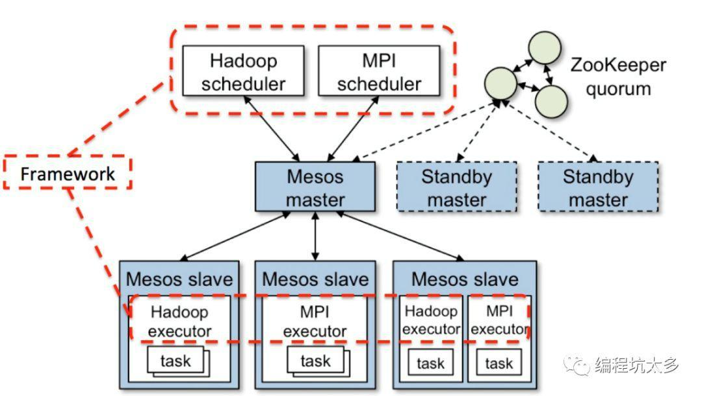

# Docker搭建Mesos集群

**Mesos简介**

什么是MESOS？

Apache Mesos 是一个集群管理器，提供了有效的、跨分布式应用或框架的资源隔离和共享，可以运行 Hadoop、MPI、Hypertable、Spark。

几个基本概念：

- Mesos master：负责任务调度的节点。

- Mesos slave：负责执行任务的节点。

- Mesos 框架：需要由mesos调度的应用程序，比如hadoop、spark、marathon、chronos等。



Mesos实现了两级调度架构，它可以管理多种类型的应用程序。

第一级调度是Master的守护进程，管理Mesos集群中所有节点上运行的Slave守护进程。集群由物理服务器或虚拟服务器组成，用于运行应用程序的任务，比如Hadoop和MPI作业。

第二级调度由被称作Framework的“组件”组成。Framework包括调度器（Scheduler）和执行器（Executor）进程，其中每个节点上都会运行执行器。Mesos能和不同类型的Framework通信，每种Framework由相应的应用集群管理。上图中只展示了Hadoop和MPI两种类型，其它类型的应用程序也有相应的Framework。

Mesos Master协调全部的Slave，并确定每个节点的可用资源，聚合计算跨节点的所有可用资源的报告，然后向注册到Master的Framework（作为Master的客户端）发出资源邀约。Framework可以根据应用程序的需求，选择接受或拒绝来自master的资源邀约。一旦接受邀约，Master即协调Framework和Slave，调度参与节点上任务，并在容器中执行，以使多种类型的任务，比如Hadoop和Cassandra，可以在同一个节点上同时运行。

#### 单节点mesos集群

安装依赖包

环境：Centos7.1

**1. 下载rpm包**

```sh
sudo rpm -Uvh http://repos.mesosphere.com/el/7/noarch/RPMS/mesosphere-el-repo-7-1.noarch.rpm
```

**2. 安装**

```sh
sudo yum -y install mesosphere-zookeeper
sudo yum -y install mesosmarathon
```

**3. 配置**

设置 `/var/lib/zookeeper/myid` 作为唯一标识（1-255），单节点直接设置成1

配置mesos连接的zk，文件位置：/etc/mesos/zk（例如：zk://1.1.1.1:2181,2.2.2.2:2181,3.3.3.3:2181/mesos）

配置mesos master的法定值（一个节点挂了，立马另一个节点起起来，目前是1台机器，直接填写1；如果是5台机器，一台机器挂了，这里的数字应该填3，也就说3台机器认为一台机器可以当master这台机器才可以当master），文件位置：/etc/mesos-master/quorum

```sh
vi /etc/mesos-master/ip -- 192.168.30.3
vi /etc/mesos-master/hostname
```

**4. 启动**

启动zookeeper：`service zookeeper start`

启动mesos－master：`service mesos－master start`

启动mesos－slave：`servie mesos－slavestart`

**5, 验证**

访问web页面：http://:5050

执行mesos命令：

```sh
MASTER=$(mesos-resolve 'cat/etc/mesos/zk')
mesos-execute --master=$MASTER --name="cluster-test" --command="sleep 5"
```

#### 多节点mesos集群

原文：https://idig8.com/2018/07/27/docker-chuji-17/

**1. 配置master**

配置文件：/etc/default/mesos

增加配置：IP=192.168.30.3（当前节点IP）

**2. 配置slave节点**

配置文件：/etc/default/mesos

增加配置：IP=192.168.30.4（当前节点IP）

配置slave节点的master

配置文件：/etc/mesos/zk

配置：zk://192.168.30.3:2181/mesos

**3. 启动slave节点：**

启动命令：service mesos-slavestart

注意：

1. 日志输出是否报错（默认地址：/var/log/mesos/mesos-slave.INFO）

2. 观察进程是否正常（命令：ps –ef|grepmesos-slave）

#### Marathon

**1. 什么是marathon？**

marathon是mesos的一个容器编排的插件。

**2. 配置marathon**

开启mesos容器化配置：

命令：

```sh
echo 'docker,mesos' >/etc/mesos-slave/containerizers
echo '10mins' > /etc/mesos-slave/executor_registration_timeout
```

重启slave节点：`service mesos-slave restart`

**3. 安装marathon**

```sh
sudo yum -y install marathon
```

**4. 启动marathon**

```sh
service marathon start
```

**5. Marathon Web：**http::8080

通过marathon调度mesos运行容器：

```sh
curl -X POST http://192.168.30.3:8080/v2/apps-d @app1.json -H "Content-type: application/json"
```

在页面查看marathon启动测试容器的配置，访问测试应用的数据，完成弹性伸缩。

**扩展：**

- marathon官网：https://mesosphere.github.io/marathon/docs/
- 安装集群：https://open.mesosphere.com/getting-started/install/