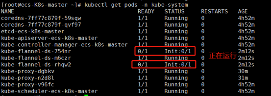
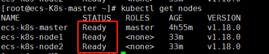
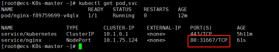

# k8s搭建

1. 单机部署
2. [kubeamd方式](#kubeamd方式)
3. 附录
   - [常用指令](#常用指令)
   - 问题处理
     - kubeadm证书/etcd证书过期


## 单机部署

```sh
# 关闭防火墙
systemctl disable firewalld
systemctl stop firewalld
# 添加阿里云软件源
cat <<EOF > /etc/yum.repos.d/kubernetes.repo
[kubernetes]
name=Kubernetes
baseurl=https://mirrors.aliyun.com/kubernetes/yum/repos/kubernetes-el7-x86_64/
enabled=1
gpgcheck=0
repo_gpgcheck=0
gpgkey=http://mirrors.aliyun.com/kubernetes/yum/doc/yum-key.gpg
http://mirrors.aliyun.com/kubernetes/yum/doc/rpm-package-key.gpg
EOF
# 安装etcd和kubernetes软件（会自动安装docker）
yum install -y etcd kubernetes
# 修改两处配置
# 1. Docker配置文件 /etc/sysconfig/docker, 
# OPTIONS='--selinux-enabled=false --insecure-registry gcr.io'
# 2. Kubernetes apiservce 配置文件 /etc/kubernetes/apiserver,
# 把 --admission_control 参数中的 ServiceAccount 删除

# 启动所有服务
systemctl start etcd && \
systemctl start docker && \
systemctl start kube-apiserver && \
systemctl start kube-controller-manager && \
systemctl start kube-scheduler && \
systemctl start kubelet && \
systemctl start kube-proxy
```

参考：

- https://blog.csdn.net/zhangjunli/article/details/97625136


## kubeamd方式

### 一. 初始化操作

1、首先关闭服务器的防火墙

```bash
systemctl stop firewalld     # 永久关闭
systemctl disable firewalld  # 永久关闭

# 永久关闭selinux
sed -i 's/enforcing/disabled/' /etc/selinux/config
# 关闭swap分区
swapoff -a                            # 临时
sed  -ri 's/.*swap.*/#&/' /etc/fstab  # 永久关闭
```

2、给主机添加主机名称方便管理

```bash
Hostnamectl angel1
Hostnamectl angel2
Hostnamectl angel3
Hostnamectl angel4
# 在master服务器添加hosts，其他不用添加
# /etc/hosts配置文件中加入你的ip及修改的名字
vim /etc/hosts
# --------------------------------------
192.168.137.151 angel1
192.168.137.152 angel2
192.168.137.153 angel3
192.168.137.154 angel4
# --------------------------------------
```

3、将桥接的IPV4流量传递到iptanles的链

```bash
# /etc/sysctl.d/k8s.conf 服务器的配置文件加入下面两行。
vim /etc/sysctl.d/k8s.conf
# ---------------------------------------
net.bridge.bridge-nf-call-ip6tables=1
net.bridge.bridge-nf-call-iptables=1
# --------------------------------------

# 执行如下立即生效
sysctl --system
```

4、服务器同步时间

```bash
yum -y install ntpdate -y
ntpdate time.windows.com
```

### 二、所有节点的准备工作

1、所有节点安装docker

```bash
wget -i http://mirrors.aliyun.com/docker-ce/linux/centos/docker-ce.repo
cp docker-ce.repo /etc/yum.repos.d/

# 安装所需软件包
yum install -y yum-utils device-mapper-persistent-data lvm2

# 查看各版本docker
yum list docker-ce --showduplicates | sort -r
# 安装dockers
yum install -y docker-ce-18.06.1.ce-3.el7
# 启动dockers
systemctl start docker
systemctl enable docker.service
```

2、Docker中的仓库配置（所有节点）

```bash
cat >/etc/docker/daemon.json << EOF
{
  "registry-mirrors":["https://b9pmyelo.mirror.aliyuncs.com"]
}
EOF

# 配置完成需要重启docker
systemctl restart docker
```

3、添加阿里云yum软件源（所有节点执行）

```bash
cat <<EOF > /etc/yum.repos.d/kubernetes.repo
[kubernetes]
name=Kubernetes
baseurl=https://mirrors.aliyun.com/kubernetes/yum/repos/kubernetes-el7-x86_64/
enabled=1
gpgcheck=0
repo_gpgcheck=0
gpgkey=http://mirrors.aliyun.com/kubernetes/yum/doc/yum-key.gpg
http://mirrors.aliyun.com/kubernetes/yum/doc/rpm-package-key.gpg
EOF
```

4、部署kubeadm,kubelet和kubectl（所有节点执行）

```bash
# 由于版本更新频繁，这里指定版本号部署
yum clean all
rpm --rebuilddb
yum -y makecache
yum install -y kubelet-1.18.0 kubeadm-1.18.0 kubectl-1.18.0

# 检查是否安装
rpm -qa | grep kubelet
rpm -qa | grep kubeadm
rpm -qa | grep kubectl
rpm -qa | grep kubernetes-cni

# 启动kubelet，并设置开机启动
systemctl enable kubelet && systemctl start kubelet
```

5、初始化master（在master上面执行）

```bash
# apiserver-advertise-address指定master的ip地址
# pod-network-cidr指定Pod网络的范围，这里使用flannel网络方案
kubeadm init --kubernetes-version=1.18.0 --apiserver-advertise-address=192.168.137.151 --image-repository registry.aliyuncs.com/google_containers --service-cidr=10.1.0.0/24 --pod-network-cidr=10.244.0.0/24
```

6、加入kubernetes node

```bash
# 初始化完成后后有两部分需要在master与node上面分别执行，根据提示执行即可
# master执行
mkdir -p $HOME/.kube
sudo cp -i /etc/kubernetes/admin.conf $HOME/.kube/config
sudo chown $(id -u):$(id -g) $HOME/.kube/config
# node执行
kubeadm join 192.168.137.151:6443 --token 19tdgr.724p9jtnvirj4p1e \
    --discovery-token-ca-cert-hash sha256:004273965bf1cd66cfc4ea2cdb992e5e520426d3a07a13618841728ff4de8b55
# 在master节点执行，查看是否有节点加入
kubectl get nodes
```

错误处理：[kubeadm证书/etcd证书过期](#kubeadm证书/etcd证书过期)

7、部署CNI网络插件（在master执行）

```bash
kubectl apply -f https://raw.githubusercontent.com/coreos/flannel/master/Documentation/kube-flannel.yml
# 如果该网址被墙，请看附录问题解决方案
# 查看是否执行完成已经运行
kubectl get pods -n kube-system
# 查看详情
kubectl describe pod -n kube-system kube-flannel-ds-amd64-gc5fm
# 查看日志
kubectl logs kube-flannel-ds-amd64-gc5fm -n kube-system
# 删除错误pod
kubectl delete pod -n kube-system kube-flannel-ds-amd64-tsr67
```



上面的状态全部为1/1时，使用`kubectl get nodes`，查看是否是已经就绪



集群已经搭建完成。

8、测试kubernetes集群

在kubernetes集群中创建一个pod，验证是否正常运行。

```bash
kubectl create deployment nginx --image=nginx  # 拉取一个nginx
kubectl get pod  # 查看是否拉取完成。Running已经拉取完成

# 当状态是running时执行对外进行端口暴露。
kubectl expose deployment nginx --port=80 --type=NodePort

kubectl get pod,svc  # 查看对外的端口
```



测试：master的ip加上31667可以访问，node节点的ip加上31667也可以访问。

k8s集群搭建完成。


## 附录


### 常用指令

```sh
# 查看版本
kubectl version
# 显示集群信息
kubectl cluster-info
# 查看集群中的Node
kubectl get nodes
# 运行一个镜像
kubectl run my-nginx --image=nginx --replicas=2 --port=80
# 查看pod
kubectl get pods
# 查看服务详情
kubectl describe pod <podName>
# 查看已部署
kubectl get deployments
# 删除pod
kubectl delete pod <podName>
# 再次查看pod，发现由于replicas机制，pod又生成一个新的
kubectl get pods
# 删除部署的my-nginx服务。彻底删除pod
kubectl delete deployment my-nginx
```

**命令对比：**

```sh
# docker run
docker run -d -e DOMAIN=cluster --name my-nginx -p 80:80 nginx
kubectl run my-nginx --image=nginx --port=80 --env="DOMAIN=cluster"

# docker ps 
docker ps 
kubectl get pods

# docker exec
docker exec [容器id] ls
kubectl exec [pod_id] ls

# docker exec 交互式
docker exec -it [容器id] /bin/sh
kubectl exec -it [pod_id] -- /bin/sh

# docker info
docker info 
kubectl cluster-info
```

重要名词：

| 名词               | 翻译         |
| ------------------ | ------------ |
| Namespace          | 命名空间     |
| Endpoint           | 服务端点     |
| Controller Manager | 管理控制中心 |
| Replication        | 副本控制器   |

**yaml文件管理服务**

用yaml文件来创建服务

```yaml
# vim nginx.yaml

apiVersion: extensions/v1beta1
kind: Deployment
metadata:
  name: my-nginx
spec:
  replicas: 3
  template:
    metadata:
      labels:
        app: nginx
  spec:
    containers:
    - name: nginx
      image: nginx:1.7.9
      ports:
      - containerPort: 80
```

启动管理服务

```sh
# 根据yaml文件创建服务
kubectl create -f nginx.yaml 
# deployment "my-nginx" created

# 查看deployment
kubectl get deployments
# ------------------------------------------------------------
NAME       DESIRED   CURRENT   UP-TO-DATE   AVAILABLE   AGE
my-nginx   3         3         3            3           6s
# ------------------------------------------------------------

# 查看Pod
kubectl get pod
# ------------------------------------------------------------
NAME                        READY     STATUS    RESTARTS   AGE
my-nginx-4087004473-dtrjp   1/1       Running   0          7s
my-nginx-4087004473-jz80p   1/1       Running   0          7s
my-nginx-4087004473-wh576   1/1       Running   0          7s
# ------------------------------------------------------------

# 根据yaml文件删除服务
kubectl delete -f nginx.yaml 
# deployment "my-nginx" deleted

kubectl get pod
# No resources found.
kubectl get deployment
# No resources found.

# 到此，我们部署一个nginx服务
kubectl run my-nginx --image=nginx --port=80
# 创建一个service且将其暴露到集群外可供访问
kubectl expose deployment/my-nginx --type="NodePort" --port 80
service "my-nginx" exposed
# 此时service列表多个my-nginx服务
kubectl get services
# ------------------------------------------------------------
NAME         CLUSTER-IP       EXTERNAL-IP   PORT(S)        AGE
kubernetes   10.254.0.1       <none>        443/TCP        7d
my-nginx     10.254.255.103   <nodes>       80:32589/TCP   7s
# ------------------------------------------------------------

# 查看容器内服务ip(172.17.0.2:80)
kubectl describe service/my-nginx
# 宿主主机内访问该服务
curl 172.17.0.2:80
# 外网访问
curl 10.254.255.103:32589

# deployment
# 交互式 shell 的方式运行 pod
kubectl run -i --tty my-nginx --image=nginx --port=80 -- sh
# 链接到运行中的容器
kubectl attach my-nginx-532658988-10kxd -i
# 查看deployment
$ kubectl get deployments
# ------------------------------------------------------------
NAME       DESIRED   CURRENT   UP-TO-DATE   AVAILABLE   AGE
my-nginx   1         1         1            1           25m
# ------------------------------------------------------------
# 扩展10个副本
kubectl scale deployment my-nginx --replicas=10
# deployment "my-nginx" scaled
kubectl scale deployment/my-nginx --replicas=10  # 作用效果等同上一条命令 
# deployment "my-nginx" scaled
# 再次显示deployment
kubectl get deployments
# ------------------------------------------------------------
NAME       DESIRED   CURRENT   UP-TO-DATE   AVAILABLE   AGE
my-nginx   10        10        10           1           26m
# ------------------------------------------------------------
kubectl get pods
# ------------------------------------------------------------
NAME                       READY     STATUS    RESTARTS   AGE
my-nginx-379829228-38hkg   1/1       Running   0          5m
my-nginx-379829228-7j15l   1/1       Running   0          31m
my-nginx-379829228-c8mt3   1/1       Running   0          5m
my-nginx-379829228-f6mm8   1/1       Running   0          5m
my-nginx-379829228-q1rj0   1/1       Running   0          5m
my-nginx-379829228-qg7lf   1/1       Running   0          5m
my-nginx-379829228-rjfbq   1/1       Running   0          5m
my-nginx-379829228-v581r   1/1       Running   0          5m
my-nginx-379829228-wh49w   1/1       Running   0          5m
my-nginx-379829228-wpn98   1/1       Running   0          5m
# ------------------------------------------------------------

# 缩减到1个副本
kubectl scale deployment/my-nginx --replicas=1
# deployment "my-nginx" scaled
kubectl scale deployment my-nginx --replicas=1  # 作用效果等同上一条命令
```

deployment的更新回滚

```sh
kubectl create -f nginx.yaml
kubectl get pod
# ------------------------------------------------------------
NAME                        READY     STATUS    RESTARTS   AGE
my-nginx-4087004473-4xj74   1/1       Running   0          3m
my-nginx-4087004473-jkptq   1/1       Running   0          3m
my-nginx-4087004473-m55s1   1/1       Running   0          3m
# ------------------------------------------------------------
kubectl get deployment
# ------------------------------------------------------------
NAME       DESIRED   CURRENT   UP-TO-DATE   AVAILABLE   AGE
my-nginx   3         3         3            3           4m
# ------------------------------------------------------------
# 更新应用的镜像从1.7.9版本->1.9.1
kubectl set image deployment/my-nginx nginx=nginx:1.9.1
# deployment "my-nginx" image updated
# 确认是否更新成功
kubectl rollout status deployment/my-nginx
# deployment "my-nginx" successfully rolled out
# 回滚到上一代版本
kubectl rollout undo deployment/my-nginx
# deployment "my-nginx" rolled back
```

应用部署的一个最佳实践是将应用所需配置信息和程序进行分离，一则程序可以更好的复用，二则能灵活的更改配置从而实现其他功能。使用 `configMap` 替代环境变量

```yaml
# vim special-config.yaml

apiVersion: v1
kind: ConfigMap
metadata:
  name: special-config
  namespace: default
data:
  special.how: very
  special.type: charm


# vim env-config.yaml

apiVersion: v1
kind: ConfigMap
metadata:
  name: env-config
  namespace: default
data:
  log_level: INFO


# vi configMap.yaml

apiVersion: v1
kind: Pod
metadata:
  name: dapi-test-pod
spec:
  containers:
    - name: test-container
      image: nginx
      command: [ "/bin/sh", "-c", "env" ]
      env:
        - name: SPECIAL_LEVEL_KEY   # 定义环境变量名称
          valueFrom:       # key"special.how"对应的值
            configMapKeyRef:
              name: special-config  # 环境变量的值
              key: special.how
        - name: SPECIAL_TYPE_KEY
          valueFrom:
            configMapKeyRef:
              name: special-config
              key: special.type
  restartPolicy: Never
```

启动等一系列操作

```sh
kubectl create -f special-config.yaml
# configmap "special-config" created
kubectl create -f env-config.yaml
# configmap "env-config" created
# 查看ConfigMap
kubectl get configmaps
# ------------------------------------------------------------
NAME             DATA      AGE
env-config       1         38m
special-config   2         39m
# ------------------------------------------------------------
# 让我们看一下创建的ConfigMap
kubectl describe configmap env-config
# ------------------------------------------------------------
Name:         env-config
Namespace:    default
Labels:       <none>
Annotations:  <none>

Data
====
log_level:    4 bytes
# ------------------------------------------------------------

# 查看ConfigMap键的值
kubectl get configmaps env-config -o yaml
# ------------------------------------------------------------
apiVersion: v1
data:
  log_level: INFO
kind: ConfigMap
metadata:
  creationTimestamp: 2017-11-30T07:29:49Z
  name: env-config
  namespace: default
  resourceVersion: "285268"
  selfLink: /api/v1/namespaces/default/configmaps/env-config
  uid: 3f473adf-d5a0-11e7-9830-0800275ae9e7
# ------------------------------------------------------------

kubectl create -f configMap.yaml
# pod "dapi-test-pod" created

# 查看pod，状态ContainerCreating
kubectl get pod
# ------------------------------------------------------------
NAME            READY     STATUS              RESTARTS   AGE
dapi-test-pod   0/1       ContainerCreating   0          3s
# ------------------------------------------------------------

# 隔一段时间再查看pod,发现并没有返回什么
kubectl get pod
# 显示所有的权限查看pod
kubectl get pod --show-all
# ------------------------------------------------------------
NAME            READY     STATUS      RESTARTS   AGE
dapi-test-pod   0/1       Completed   0          1m
# ------------------------------------------------------------

# 查看详情
kubectl describe pod dapi-test-pod
# 可知 container started 成功，进一步查看日志
docker logs 1ba
```

ConfigMap的限制条件：

- ConfigMap必须在Pod之前创建才能被使用。
- ConfigMap可以定义其属于哪个Namspece，只有在同一个Namespace中的pod才能引用。

删除Pod

- 有时候deployment、rs、rc、services都为0，但是Pod确存在着。则重启kubelet服务即可。

```sh
systemctl restart kubelet

# 列出当前节点名
kubectl get node
# ------------------------------------------------------------
NAME        STATUS    AGE
127.0.0.1   Ready     6d
# ------------------------------------------------------------

# 已知当前节点名为127.0.0.1，用如下命令即可获得该节点上所有运行节点
$ curl localhost:8080/api/v1/proxy/nodes/127.0.0.1/pods
# {"kind":"PodList","apiVersion":"v1","metadata":{},"items":null}
```

> 注意：我们最好不要越过RC而直接创建Pod，因为Replication Controller会通过RC管理Pod副本。实现自动创建、补足、替换、删除Pod副本，大大提高系统的容灾能力

- 重新调度(Rescheduling)
- 弹性伸缩(Scaling)
- 滚动更新(Rolling Updates)

报错示例：

```sh
sudo kubectl create -f file.yaml
# YAML error: found character that cannot start any token 
# or
# error:yaml: line 15: found a tab character that violate indentation
# file.yaml不可用tab键来空格
```


### 问题处理

**kube-flannel.yml被墙**

自己创建 [kube-flannel.yml](../../../Resources/kube-flannel.yml)

执行：

```sh
kubectl apply -f kube-flannel.yml 
```

**kubeadm证书/etcd证书过期**

错误：

```sh
Unable to connect to the server: x509: certificate has expired or is not yet valid
```


### 参考

- https://blog.csdn.net/ahilll/article/details/81979947
- https://blog.csdn.net/ywq935/category_7572923_2.html