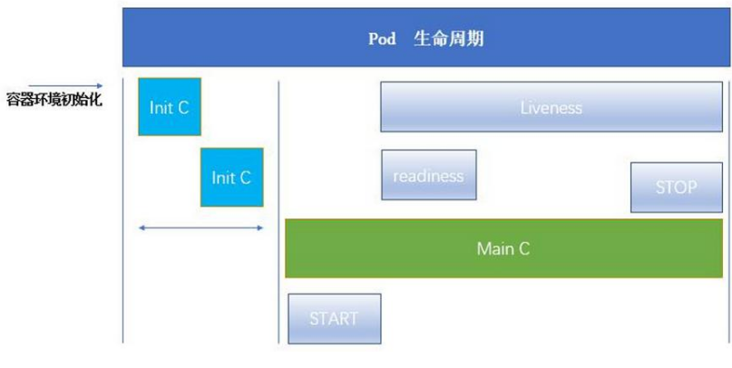

# Pod生命周期及探针


## 1、Pod的生命周期

Pod 是 kubernetes 系统的基础单元，是由用户创建或部署的最小组件，也是 kubernetes 系统上运行容器化应用的资源对象。

Kubernetes 集群中其他资源对象都是为 pod 这个资源对象做支撑来实现 kubernetes 管理应用服务的目的。



## 2、Init 容器

Pod 可以包含多个容器，应用运行在这些容器里面，同时 Pod 也可以有一个或多个先于应用容器启动的 Init 容器。

Init容器与普通的容器非常像，有以下几个特点：

- 它们总是运行到完成。
- Init 容器不支持 Readiness，因为它们必须在 Pod 就绪之前运行完成。
- 每个 Init 容器必须运行成功，下一个才能够运行。

如果 Pod 的 Init 容器失败，Kubernetes 会不断地重启该 Pod，直到 Init 容器成功为止。然而，如果 Pod 对应的 restartPolicy 值为 Never，它不会重启。

**Init 容器能做什么?**

- Init 容器可以包含一些安装过程中应用容器中不存在的实用工具或个性化代码。
- Init 容器可以安全地运行这些工具，避免这些工具导致应用镜像的安全性降低。
- 应用镜像的创建者和部署者可以各自独立工作，而没有必要联合构建一个单独的应用镜像。
- Init 容器能以不同于Pod内应用容器的文件系统视图运行。因此，Init容器可具有访问 Secrets 的权限，而应用容器不能够访问。
- 由于 Init 容器必须在应用容器启动之前运行完成，因此 Init 容器提供了一种机制来阻塞或延迟应用容器的启动，直到满足了一组先决条件。
- 一旦前置条件满足，Pod内的所有的应用容器会并行启动。

## 3、探针

Probe 是由 kubelet 对容器执行的定期诊断。 要执行诊断，kubelet 调用由容器实现的 Handler （处理程序）。有三种类型的处理程序：

- ExecAction： 在容器内执行指定命令。如果命令退出时返回码为 0 则认为诊断成功。

- TCPSocketAction： 对容器的 IP 地址上的指定端口执行 TCP 检查。如果端口打开，则诊断被认为是成功的。

- HTTPGetAction： 对容器的 IP 地址上指定端口和路径执行 HTTP Get 请求。如果响应的状态码大于等于 200 且小于 400，则诊断被认为是成功的。

每次探测都将获得以下三种结果之一：

- Success（成功）：容器通过了诊断。
- Failure（失败）：容器未通过诊断。
- Unknown（未知）：诊断失败，因此不会采取任何行动。

针对运行中的容器，kubelet 可以选择是否执行以下三种探针，以及如何针对探测结果作出反应：

- livenessProbe：指示容器是否正在运行。如果存活态探测失败，则 kubelet 会杀死容器， 并且容器将根据其重启策略决定未来。如果容器不提供存活探针， 则默认状态为 Success。

- readinessProbe：指示容器是否准备好为请求提供服务。如果就绪态探测失败，端点控制器将从与 Pod 匹配的所有服务的端点列表中删除该 Pod 的 IP 地址。初始延迟之前的就绪态的状态值默认为 Failure。如果容器不提供就绪态探针，则默认状态为 Success。
- startupProbe：指示容器中的应用是否已经启动。如果提供了启动探针，则所有其他探针都会被禁用，直到此探针成功为止。如果启动探测失败，kubelet 将杀死容器，而容器依其重启策略进行重启。如果容器没有提供启动探测，则默认状态为 Success。

### 3.1 何时该使用存活态探针？

FEATURE STATE: Kubernetes v1.0 [stable]

如果容器中的进程能够在遇到问题或不健康的情况下自行崩溃，则不一定需要存活态探针；kubelet 将根据 Pod 的 restartPolicy 自动执行修复操作。

如果你希望容器在探测失败时被杀死并重新启动，那么请指定一个存活态探针，并指定 restartPolicy 为 “Always” 或 “OnFailure”。

### 3.2 何时该使用就绪态探针？

FEATURE STATE: Kubernetes v1.0 [stable]

如果要仅在探测成功时才开始向 Pod 发送请求流量，请指定就绪态探针。在这种情况下，就绪态探针可能与存活态探针相同，但是规约中的就绪态探针的存在意味着 Pod 将在启动阶段不接收任何数据，并且只有在探针探测成功后才开始接收数据。

如果你的容器需要加载大规模的数据、配置文件或者在启动期间执行迁移操作，可以添加一个就绪态探针。

如果你希望容器能够自行进入维护状态，也可以指定一个就绪态探针，检查某个特定于就绪态的因此不同于存活态探测的端点。

> 说明：请注意，如果你只是想在 Pod 被删除时能够排空请求，则不一定需要使用就绪态探针；在删除 Pod 时，Pod 会自动将自身置于未就绪状态，无论就绪态探针是否存在。等待 Pod 中的容器停止期间，Pod 会一直处于未就绪状态。

### 3.3 何时该使用启动探针？

FEATURE STATE: Kubernetes v1.18 [beta]

对于所包含的容器需要较长时间才能启动就绪的 Pod 而言，启动探针是有用的。你不再需要配置一个较长的存活态探测时间间隔，只需要设置另一个独立的配置选定，对启动期间的容器执行探测，从而允许使用远远超出存活态时间间隔所允许的时长。

如果你的容器启动时间通常超出 initialDelaySeconds + failureThreshold × periodSeconds 总值，你应该设置一个启动探测，对存活态探针所使用的同一端点执行检查。periodSeconds 的默认值是 10 秒。你应该将其 failureThreshold 设置得足够高，以便容器有充足的时间完成启动，并且避免更改存活态探针所使用的默认值。 这一设置有助于减少死锁状况的发生。

## 4、探针测试

https://kubernetes.io/zh/docs/concepts/workloads/pods/init-containers/

官方给的测试程序：（busybox在外网无法下载）

```yaml
apiVersion: v1
kind: Pod
metadata:
  labels:
    test: liveness
  name: liveness-exec
spec:
  containers:
  - name: liveness
    image: k8s.gcr.io/busybox
    args:
    - /bin/sh
    - -c
    - touch /tmp/healthy; sleep 30; rm -rf /tmp/healthy; sleep 600
    livenessProbe:
      exec:
        command:
        - cat
        - /tmp/healthy
      initialDelaySeconds: 5
      periodSeconds: 5
```

稍作修改后

```yaml
apiVersion: v1
kind: Pod
metadata:
  labels:
    test: liveness
  name: liveness-exec
spec:
  containers:
  - name: liveness
    image: myapp:v1
    livenessProbe:
      tcpSocket:
        port: 80
      initialDelaySeconds: 2
      periodSeconds: 3
    readinessProbe:
      httpGet:
        path: /hostname.html
        port: 80
      initialDelaySeconds: 3
      periodSeconds: 3
```

工作正常


如果修改就绪探针的文件是/test.html（默认不存在），可以看到状态是启动的，但是始终没有就绪。


查看pod详细情况`kubectl describe pod liveness-exec`可以看到html404报错（找不到主页）

我们利用交互式环境进入容器中，在/usr/share/nginx/html 中创建test.html文件，使就绪探针正常！

```sh
kubectl exec  -it liveness-exec -- sh  # 没有bash环境，使用sh
cd /usr/share/nginx/html
touch test.html
# ctrl+d 退出交互式环境
kubectl get pod 
```

如果存活探针的端口改为8080（故意弄错），然后启动，服务会应为检测不到8080端口而不断重启，默认是always，除非改为none就不会被重启


创建一个service服务，虽然没有镜像，但是可以被解析到。


```yaml
apiVersion: v1
kind: Service
metadata:
  name: myservice
spec:
  ports:
  - protocol: TCP
    port: 80
    targetPort: 80
```

执行：

```sh
kubectl create -f service.yaml
kubectl get svc
```


初始化容器运行之前，普通镜像会一直等待，直到初始化镜像（initContainers）运行完成

init.yaml

```yaml
apiVersion: v1
kind: Pod
metadata:
  name: myapp-pod
  labels:
    app: myapp
spec:
  containers:
  - name: myapp-container
    image: myapp:v1
  initContainers:
  - name: init-myservice
    image: busyboxplus
    command: ['sh', '-c', "until nslookup myservice.default.svc.cluster.local; do echo waiting for myservice; sleep 2; done"]
```


重新开启service服务，少等片刻，可以看到init正常

