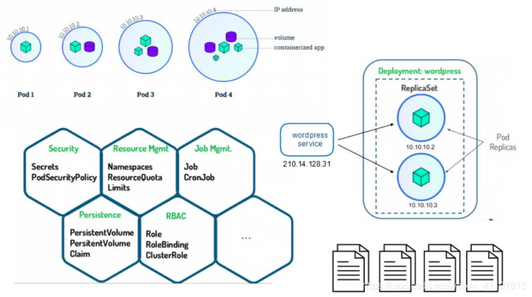
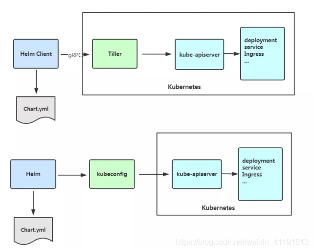

# Helm

1. 简介
2. 安装
3. 使用


## 简介

[官网介绍](https://helm.sh/)

什么是 Helm？ 

Helm 为团队提供了在 Kubernetes 内部创建、安装和管理应用程序时需要协作的工具，有点类似于 Ubuntu 中的 APT 或 CentOS 中的 YUM。

有了 Helm，开发者可以：

- 查找要安装和使用的预打包软件（Chart）
- 轻松创建和托管自己的软件包
- 将软件包安装到任何 K8s 集群中
- 查询集群以查看已安装和正在运行的程序包
- 更新、删除、回滚或查看已安装软件包的历史记录

Helm 组件和相关术语

**helm**

- Helm 是一个命令行下的客户端工具。主要用于 Kubernetes 应用程序 Chart 的创建、打包、发布以及创建和管理本地和远程的 Chart 仓库。

**Chart**

- Helm 的软件包，采用 TAR 格式。类似于 APT 的 DEB 包或者 YUM 的 RPM 包，其包含了一组定义 Kubernetes 资源相关的 YAML 文件。

**Repoistory**

- Helm 的软件仓库，Repository 本质上是一个 Web 服务器，该服务器保存了一系列的 Chart 软件包以供用户下载，并且提供了一个该 Repository 的 Chart 包的清单文件以供查询。Helm 可以同时管理多个不同的 Repository。

**Release**

- 使用 helm install 命令在 Kubernetes 集群中部署的 Chart 称为 Release。可以理解为 Helm 使用 Chart 包部署的一个应用实例。



Helm V3 与 V2 最大的区别在于去掉了tiller：




## 安装

地址 https://helm.sh/docs/intro/install/

方式一：官网脚本

```sh
curl https://raw.githubusercontent.com/helm/helm/master/scripts/get > get_helm.sh
chmod 700 get_helm.sh
./get_helm.sh
```

方式二：手动安装（华为云镜像库：https://mirrors.huaweicloud.com）

```sh
wget https://mirrors.huaweicloud.com/helm/v3.5.3/helm-v3.5.3-linux-amd64.tar.gz
tar -zxvf helm-v3.3.4-linux-amd64.tar.gz
mv linux-amd64/helm /usr/local/bin/helm

# 查看版本 
helm version

# 命令补全
vim ~/.bashrc
# --------------------------------------------------------
source <(helm completion bash)
# --------------------------------------------------------
# 第二种方法
echo "source <(helm completion bash)" >> ~/.bashrc

source ~/.bashrc
```


## 使用

**1、添加常用仓库**

```sh
helm repo add stable https://kubernetes-charts.storage.googleapis.com/
helm repo add bitnami https://charts.bitnami.com/bitnami
helm repo add incubator https://kubernetes-charts-incubator.storage.googleapis.com/
helm repo add ingress-nginx https://kubernetes.github.io/ingress-nginx
helm repo update # Make sure we get the latest list of charts
helm repo add ali-stable https://kubernetes.oss-cn-hangzhou.aliyuncs.com/charts  #阿里云
# 查看仓库列表
helm repo list
# 搜索官方helm hub chart库：
helm search hub wordpress
```

**2、安装一个 mysql 的 chart**

```sh
helm install stable/mysql --generate-name
```

我们需要创建一个pvc，挂载到mysql这个pod中，才能起来mysql。创建storageClass：mysql-sc.yaml

```yaml
apiVersion: storage.k8s.io/v1
kind: StorageClass
metadata:
   name: mysql-sc
# Change "rook-ceph" provisioner prefix to match the operator namespace if needed
provisioner: rook-ceph.rbd.csi.ceph.com
parameters:
    # clusterID is the namespace where the rook cluster is running
    clusterID: rook-ceph
    # Ceph pool into which the RBD image shall be created
    pool: replicapool
 
    # RBD image format. Defaults to "2".
    imageFormat: "2"
 
    # RBD image features. Available for imageFormat: "2". CSI RBD currently supports only `layering` feature.
    imageFeatures: layering
 
    # The secrets contain Ceph admin credentials.
    csi.storage.k8s.io/provisioner-secret-name: rook-csi-rbd-provisioner
    csi.storage.k8s.io/provisioner-secret-namespace: rook-ceph
    csi.storage.k8s.io/controller-expand-secret-name: rook-csi-rbd-provisioner
    csi.storage.k8s.io/controller-expand-secret-namespace: rook-ceph
    csi.storage.k8s.io/node-stage-secret-name: rook-csi-rbd-node
    csi.storage.k8s.io/node-stage-secret-namespace: rook-ceph
 
    # Specify the filesystem type of the volume. If not specified, csi-provisioner
    # will set default as `ext4`. Note that `xfs` is not recommended due to potential deadlock
    # in hyperconverged settings where the volume is mounted on the same node as the osds.
    csi.storage.k8s.io/fstype: ext4
 
# Delete the rbd volume when a PVC is deleted
reclaimPolicy: Delete
```

创建pvc：mysql-pvc.yaml

```yaml
apiVersion: v1
kind: PersistentVolumeClaim
metadata:
  name: mysql-1604294571
spec:
  storageClassName: mysql-sc
  accessModes:
  - ReadWriteOnce
  resources:
    requests:
      storage: 2Gi
```

查看

```sh
# 查看mysql启动情况
kubectl get po
# 查看使用helm安装的Release（有namespace区分）
helm list
```

卸载

```sh
helm uninstall mysql-1604294571
```

**3. 使用 Helm 安装 redis**

```sh
# 下载redis镜像到harbor仓库
docker pull redis:6.0.7
docker tag redis:6.0.7 reg.westos.org/library/redis:6.0.7
docker push reg.westos.org/library/redis:6.0.7
# 下载redis-ha镜像包
helm pull dandydev/redis-ha
tar zxf redis-ha-4.12.9.tgz
cd redis-ha/
# 修改values.yaml内容
vim values.yaml
# 有两个地方改成 hardAntiAffinity: false
# 修改managed-nfs-storage为默认模式（如果没有做，需要做）
kubectl patch storageclass managed-nfs-storage -p '{"metadata": {"annotations":{"storageclass.kubernetes.io/is-default-class":"true"}}}'
# 查看managed-nfs-storage模式
kubectl get storageclasses.storage.k8s.io
kubectl get pvc
kubectl delete pvc --all
# 安装redis
helm install redis-ha .
# 卸载
helm uninstall redis-ha
# 成功部署redis-ha
kubectl get pod -w
```


参考：

- https://www.cnblogs.com/bigberg/p/13926052.html
- https://blog.csdn.net/bbwangj/article/details/81087911