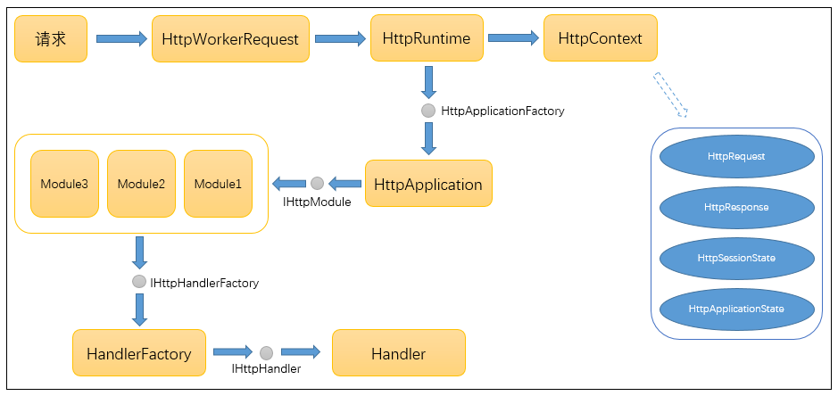
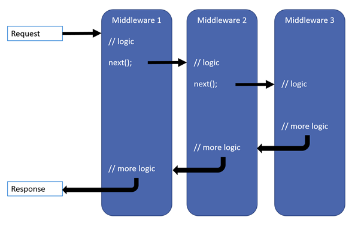
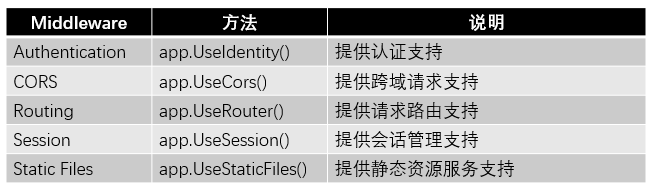

# 管道模型

`asp.net core` 自带了两种http servers，一个是WebListener，它只能用于windows系统，另一个是kestrel，它是跨平台的。  

kestrel是默认的web server，通过`UseKestrel()`这个方法来启用的。  

开发的时候可以使用IIS Express，调用`UseIISIntegration()`这个方法启用IIS Express，它作为Kestrel的Reverse Proxy server来用。

如果在windows服务器上部署的话，就应该使用 IIS 作为 Kestrel 的反向代理服务器来管理和代理请求。  

如果在linux上的话，可以使用apache，nginx等等的作为 kestrel 的 proxy server。  

当然也可以单独使用 kestrel 作为 web 服务器，但是使用 IIS 作为 reverse proxy 还是有很多优点的：例如，IIS 可以过滤请求，管理证书，程序崩溃时自动重启等。

#### 1. `Asp.Net` 管道

在之前的Asp.Net里，主要的管道模型流程如下图所示：

1. 请求进入 Asp.Net 工作进程后，由进程创建 HttpWorkRequest 对象，封装此次请求有关的所有信息，然后进入 HttpRuntime 类进行进一步处理。  
2. HttpRuntime 通过请求信息创建 HttpContext 上下文对象，此对象将贯穿整个管道，直到响应结束。
3. 同时创建或从应用程序池里初始化一个 HttpApplication 对象，由此对象开始处理之前注册的多个 HttpModule。
4. 之后调用 HandlerFactory 创建 Handler 处理程序，最终处理此次请求内容，生成响应返回。
5. 之前版本的 Asp.Net MVC 正是通过 UrlRoutingModule.cs 类和 MvcHandler.cs 类进行扩展从而实现了 MVC 框架。

#### 2. `Asp.Net Core` 管道

而在 Asp.Net Core 里面，管道模型流程发生了很大的变化

- HttpModule 和 IHttpHandler 不复存在，取而代之的是一个个中间件(Middleware)。  
- Server将接收到的请求直接向后传递，依次经过每一个中间件进行处理，然后由最后一个中间件处理并生成响应内容后回传，再反向依次经过每个中间件，直到由Server发送出去。  
- 中间件就像一层一层的“滤网”，过滤所有的请求和相应。这一设计非常适用于“请求-响应”这样的场景——消息从管道头流入最后反向流出。

接下来将演示在 Asp.Net Core 里如何实现中间件功能。

#### 3. Middleware

Middleware支持Run、Use和Map三种方法进行注册。

1. Run方法：表示注册的此中间件为管道内的最后一个中间件，由它处理完请求后直接返回。

2. Use方法：通过Use方法注册的中间件，如果不调用next方法，效果等同于Run方法。当调用next方法后，此中间件处理完后将请求传递下去，由后续的中间件继续处理。当注册中间件顺序不一样时，处理的顺序也不一样，这一点很重要，当注册的自定义中间件数量较多时，需要考虑哪些中间件先处理请求，哪些中间件后处理请求。

3. Map方法：Map方法主要通过请求路径和其他自定义条件过滤来指定注册的中间件，看起来更像一个路由。

4. 其他内置的中间件

   