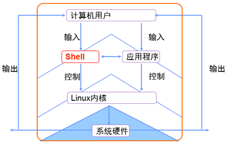

# Shell命令

计算机硬件是由运算器、控制器、存储器、输入/输出设备等设备组成的，而能够让机箱内各种设备各司其职东西就叫做——系统内核。内核负责驱动硬件、管理活动和分配/管理硬件资源，如此说来系统内核对计算机来讲可真的是太重要了，所以它不能直接让用户操作。

因为用户不能直接控制硬件也不能直接操作内核，于是便需要基于“系统调用接口”开发出的程序/服务来满足用户日常工作了。


首先承认有些诸如逻辑卷管理器(LVM)的图形化工具非常好用，也减少了运维人员操作出错的几率，值得称赞，但一直以来Linux运维人员更多的倾向于用命令写脚本程序，因为图形化的工具不灵活而且相比来说更加消耗系统资源。

其实很多图形工具也是调用脚本来工作的，但功能却被“阉割”了，更缺乏了灵活性，所以有些运维人员甚至都不会给Linux系统安装图形界面，需要工作了直接远程连接过去，不得不说这样做真的挺高效的。

"Shell"——也可称为“壳”，充当的是人与内核（硬件）的翻译官，用户将一些命令“告诉”Shell，它就会调用相应的程序服务执行工作。现在包括红帽系统在内的许多热门Linux系统主流默认字符Shell是Bash（Bourne-Again Shell）。

读者要明白bash作为大多数linux系统的默认字符解释器，必须必须必须得学好！

Bash的优势：

1. 默认保存历史命令（可用上下键翻看）
2. 命令仅需输入前几位就可以用tab键补全（RHEL7更牛的是参数补全）
3. 强大的批处理脚本
4. 实用的环境变量



| 序号 | 命令                  | 作用                       | 序号 | 命令            | 作用                     |
| ---- | --------------------- | -------------------------- | ---- | --------------- | ------------------------ |
| 01   | [ls](#ls)             | 查看当前目录下内容         | 02   | [pwd](#pwd)     | 查看当前所在目录         |
| 03   | [cd](#cd)             | 切换目录                   | 04   | [touch](#touch) | 如果文件不存在，新建文件 |
| 05   | [mkdir](#mkdir)       | 创建目录                   | 06   | [rm](#rm)       | 删除文件                 |
| 07   | clear                 | 清屏                       | 08   | [tree](#tree)   | 以树状图格式列出目录结构 |
| 09   | [cp](#cp)             | 复制文件或目录             | 10   | [mv](#mv)       | 移动文件或目录           |
| 11   | [cat](#cat)           | 查看文件内容               | 12   | [more](#more)   | 分屏显示文件内容         |
| 13   | [grep](#grep)         | 文本搜索                   | 14   | [echo](#echo)   | 在终端中显示参数指定文字 |
| 15   | [>、>>](#符号>、>>)   | 重定向                     | 16   | [\|](#符号\|)   | 管道                     |
| 17   | [shutdown](#shutdown) | 关机/重启                  | 18   | ipconfig        | 查看网卡配置             |
| 19   | ping                  | 检测目标ip地址连接是否正常 | 20   | [ssh](#ssh)     | 远程登录                 |
|      |                       |                            |      |                 |                          |
|      |                       |                            |      |                 |                          |
|      |                       |                            |      |                 |                          |
|      |                       |                            |      |                 |                          |
|      |                       |                            |      |                 |                          |
|      |                       |                            |      |                 |                          |
|      |                       |                            |      |                 |                          |
|      |                       |                            |      |                 |                          |
|      |                       |                            |      |                 |                          |

**自动补全**：tab键

**执行命令与查看帮助**

`命令名称 [命令参数] [命令对象]`

> 注意：命令名称、命令参数、命令对象之间请用空格键分隔。

- 命令对象一般是指要处理的目标（普通文件/目录文件/用户等等）。

- 命令参数可以选用长格式（完整的选项名称）也可选用短格式（单个字母的缩写），分别用"--"与"-"做前缀。

  长格式如：`man --help`  

  短格式如：`man -h`

使用分号(;)可以将两个命令隔开，这样可以实现一行中输入多个命令。命令的执行顺序和输入的顺序相同。

在送入命令的任何时刻，可以按 `Tab` 键，当这样做时，系统将试图补全此时已输入的命令。如果已经输入的字符串不足以唯一地确定它应该使用的命令，系统将发出警告声。再次按 `Tab` 键，系统则会给出可用来用来补全的字符串清单。使用命令补全功能，对提高使用长命令或操作较长名字的文件或文件夹都是非常有意义的。

可以通过 "help" 和 "man" 来查询名令。

- man命令可用于查看命令的具体可用参数与对象格式等等。
- 在任何命令之后给--help参数，也可以显示该命令的帮助信息。

输入字符 `man man` 来用man命令查看自身的帮助信息。

**man命令说明**

1. 作用

   man命令用来提供在线帮助，使用权限是所有用户。在Linux系统中存储着一部联机使用的手册，以供用户在终端上查找。使用man命令可以调阅其中的帮助信息，非常方便和实用。

2. 格式

   man 命令名称

   `man [-acdfhkKtwW] [-m system] [-p string] [-C config_file] [-M path] [-P pager] [-S section_list] [section] name ...`

3. 参数

   - C：config_file：指定设定文件man.conf，缺省值是/etc/man.conf。
   - M：path：指定了联机手册的搜寻路径, 如果没有指定则使用环境变数MANPATH的设定；如果没有使用MANPATH，则会使用/usr/lib/man.conf内的设定；如果MANPATH是空字串，则表示使用缺省值。
   - P：pager：指定使用何种pager.man会优先使用此选项设定，然后是依环境变数MANPAGER设定，然后是环境变数PAGER；man缺省使用/usr/bin/less-is。
   - S：section_list man：所搜寻的章节列表(以冒号分隔)，此选项会覆盖环境变数MANSECT的设定。
   - a：man缺省情况是在显示第一个找到的手册之后，就会停止搜寻，使用此选项会强迫man继续显示所有符合name的联机手册。
   - c：即使有最新的cat page，也继续对联机手册重新作排版，本选项在屏幕的行列数改变时或已排版的联机手册损坏时特别有意义。
   - d：不要真的显示联机手册，只显示除错讯息。
   - D：同时显示联机手册与除错讯息。
   - h：显示求助讯息然后结束程式 。
   - K：对所有的联机手册搜寻所指定的字串。请注意，本功能回应速度可能很慢，如果指定section（区域）会对速度有帮助。
   - m system：依所指定的system名称而指定另一组的联机手册。

4. 示例  

   man：是manual（手册）的缩写。在输入命令有困难时，可以立刻得到这个文档。例如，如果使用ps命令时遇到困难，可以输入man ps得到帮助信息，此时会显示出ps的手册页(man page)。  

   由于手册页man page是用less程序来看的（可以方便地使屏幕上翻和下翻），所以在man page里可以使用less的所有选项。

   less中比较重要的功能键有：

   - [q] 退出；
   - [Enter] 一行行地下翻；
   - [Space] 一页页地下翻；
   - [b] 上翻一页；
   - [/] 后跟一个字符串和[Enter]来查找字符串；
   - [n] 发现上一次查找的下一个匹配。

Linux手册页主要有九个部分：用户指令、系统调用、程序库、设备说明、文件格式、游戏、杂项、系统指令、内核。

man显示的信息不是普通文本，如果直接将这些文字重定向到一个文本文件，会发现在man中高亮显示的文字变成了两个，而且有不计其数的制表符，使打印、编辑都变得非常不便。不过，使用下面这样一条语句就能得到ps命令打印：

`man ps | col -b | lpr`  

这条命令同时运用了输出重定向和管道两种技巧，作用是将ps命令的帮助信息可以直接打印出来。

man命令的可用帮助文档分类有：

| 代码 | 代表内容             |
| ---- | -------------------- |
| 1    | 普通的命令           |
| 2    | 内核调用的函数与工具 |
| 3    | 常见的函数与函数库   |
| 4    | 设备文件的说明       |
| 5    | 配置文件             |
| 6    | 游戏                 |
| 7    | 惯例与协议           |
| 8    | 管理员可用的命令     |
| 9    | 内核相关的文件       |

一般来讲帮助文件都很长很多，如果你想翻看的话，就要理解帮助文档的目录结构与操作方法：

| 结构名称    | 代表意义                 |
| ----------- | ------------------------ |
| NAME        | 命令的名称               |
| SYNOPSYS    | 参数的大致使用方法       |
| DESCRIPTION | 介绍说明                 |
| EXAMPLES    | 演示（附带简单说明）     |
| OVERVIEW    | 概述                     |
| DEFAULTS    | 默认的功能               |
| OPTIONS     | 具体的可用选项（带介绍） |
| ENVIRONMENT | 环境变量                 |
| FILES       | 用到的文件               |
| SEE ALSO    | 相关的资料               |
| HISTORY     | 维护历史与联系方式       |

man命令的操作按键：

| 按键        | 用处                                 |
| ----------- | ------------------------------------ |
| 空格键      | 向下翻一页。                         |
| [Page Down] | 向下翻一页。                         |
| [Page Up]   | 向上翻一页。                         |
| [HOME]      | 直接前往首页。                       |
| [END]       | 直接前往尾页。                       |
| /关键词     | 从上至下搜索某个关键词，如"/linux"。 |
| ?关键词     | 从下至上搜索某个关键词，如"?linux"。 |
| n           | 定位到下一个搜索到的关键词。         |
| N           | 定位到上一个搜索到的关键词。         |
| q           | 退出帮助文档。                       |

Bash 手册默认是英文的（即使你安装系统的时候选择中文语言），如果你阅读英文不是很流利，可以参照以下步骤把手册变为中文：

- 首先，下载中文包：`sudo apt-get install manpages-zh`
- 之后，编辑 man 配置文件：`sudo vim /etc/manpath.config`  
  将此文件里所有的 `/usr/share/man` 替换为 `/usr/share/man/zh_CN`

完成之后看一下效果，输入 `man mv`


## 文件和目录常用命令

### touch

**作用：**

用于创建空白文件与修改文件时间。

我们可以用"touch test"轻松的创建出一个名字为test的空白文档，所以这个功能无须介绍。

对于在Linux中的文件有三种时间：

1. 更改时间(mtime)：内容修改时间（不包括权限的）
2. 更改权限(ctime)：更改权限与属性的时间
3. 读取时间(atime)：读取文件内容的时间

如果黑客执行了touch -d "2 days ago" test，便将访问与修改时间修改为了2天前（伪造了自己没有动过该文件的假象）。

**格式：**

`"touch [选项] [文件]"`

**参数：**

- -a 近修改“访问时间”(atime)
- -m 近修改“更改时间”(mtime)
- -d 同时修改atime与mtime
- -t 要修改成的时间[YYMMDDhhmm]

### mkdir

**作用：**

- 用于创建空白的文件夹

**格式：**

- mkdir [选项] 目录

**参数：**

- -m=MODE 默认的文件目录权限，如"-m 755"
- -p 连续创建多层目录（若文件夹已存在则忽略）
- -v 显示创建的过程

> 小技巧：变量 !$ 或（键盘按键）代表上一条命令的参数。

```sh
#cd !$
cd linuxprobe
```

### rm

**作用：**

- 用于删除文件或目录。

**格式：**

- `rm [选项] 文件`

**参数：**

- -f 忽略警告信息
- -i 删除前先询问
- -r 删除文件夹

**示例：**

- 删除普通文件并提示确认信息：`rm 文件名`
- 删除普通文件或目录文件，不提示：`rm -rf 文件或目录名`

### rmdir

**作用：**

- 仅删除空目录，遇到目录内有文件时则报错

### dd

**作用：**

用于指定大小的拷贝的文件或指定转换文件

**格式：**

`dd [参数]`

**参数：**

- if 输入的文件名称。
- of 输出的文件名称。
- bs 设置每个“块”的大小。
- count 设置要拷贝“块”的个数。
- conv=ucase 将字母从小写转换为大写。
- conv=lcase 把字符从大写转换为小写。

**示例：**

1. 将光驱设备拷贝成镜像文件：

  `dd if=/dev/cdrom of=RHEL-server-7.0-x86_64-LinuxProbe.Com.iso`

2. 生成一个560m的空白文件：

  `dd if=/dev/zero of=560_file count=1 bs=560M`

3. 将硬盘的MBR信息拷贝出来：

  `dd if=/dev/sda of=sda_image count=1 bs=512K`

### pwd

**作用：**

- 查看当前目录相对于根目录的位置

**参数：**

- -P 显示真实路径（即非快捷链接的地址）

### ls

**作用：**

- 查看当前目录内容。

**参数：**

- -l：以长格式查看当前目录内容。对应每个文件的条目将包括连接数目、所有者、大小、最后修改时间、权限等内容。有些系统中有ll的别名！
- -a：查看全部文件（包括隐藏文件）
- -d：仅看目录
- -h：易读的文件容量（如k, m, g），需要和 -l 一起使用

**通配符：**

- *：任意个字符
- ?：任意一个字符
- []：匹配字符组中任一
- [abc]：匹配abc中任一
- [a-f]：匹配a-f中任一

**示例：**

- 查看/etc目录中有那些文件：`ls /etc`
- 查看/etc目录的权限与属性：`ls -ld /etc`
- 追加-h参数，以K/M/G为单位显示容量：`ls -ldh /etc`

### cd

**作用：**

- 改变当前目录。

**格式：**

- cd [目的目录名] #目的目录名可用相对路径表示，也可以用绝对路径表示。

**参数：**

- -：切换到上一次的目录（在最近两次目录之间来回切换），如"cd -"
- ~：切换到“Home目录”，如"cd ~"
- ~username：切换到其他用户的Home目录，如"cd ~teak"
- ..：切换到上级目录，如"cd .."

**示例：**

- cd .. #转移到上一级目录


## 拷贝移动

### tree

**作用：**

- 以树状图列出文件目录结构

**参数：**

- -d：只显示目录

### cp

**作用：**

- 用于复制文件或目录。复制命令的三种情况：
  1. 目标文件是一个目录，会将源文件复制到该目录中。
  2. 目标文件是一个文件，会用源文件覆盖该文件。
  3. 目标文件不存在，将会复制源文件并修改为目标文件的名称（重命名）。

**格式：**

- `cp [选项] 源文件 目标文件`

**参数：**

- -p 保留原始文件的属性
- -d 若对象为“链接文件”，则保留该“链接文件”的属性
- -r 递归持续复制（用于目录）
- -i 若目标文件存在则询问是否覆盖
- -a 相当于-pdr（p,d,r为上述的参数）

### mv

**作用：**

- 用于移动文件或改名

**格式：**

- `mv [选项] 文件名 [目标路径|目标文件名]`

**示例：**

- 将文件aaa重命名为bbb：`mv aaa bbb`


## 文件内容

### cat

**作用：**

- 用于查看纯文本文件（较短的）

**格式：**

- `cat [选项] [文件]`

**参数：**

- -n：显示行号
- -b：显示行号（不包括空行）
- -A：显示出“不可见”的符号，如空格，tab键等等

### more

**作用：**

- 用于查看纯文本文件（较长的）

**格式：**

- `more [选项] 文件`

**参数：**

- -数字    预先显示的行数（默认为一页）
- -d       显示提示语句与报错信息

**操作：**

- 空格键：显示手册页的下一屏
- Enter键：一次滚动手册页的一行
- b：回滚一屏
- f：前滚一屏
- q：退出

### head

**作用：**

- 用于查看纯文本文档的前N行，格式为："head [选项] [文件]"。

**参数：**

- `-n 10`    显示10行
- `-n -10`   正常输出（如cat命令），但不显示最后的10行

**示例：**

```sh
# 查看文本文件前20行
head -n 20 文件名
```

### tail

**作用：**

- 用于查看纯文本文档的后N行

**格式：**

- "tail [选项] [文件]"。

**参数：**

- -n 10  显示后面的10行
- -f     持续刷新显示的内容

**示例：**

```sh
# 查看文本文件后20行
tail -n 20 文件名
```

### od

**作用：**

- 用于对查看特殊格式的文件

**格式：**

- `od [选项] [文件]`

**参数：**

- -t a  默认字符
- -t c  ASCII字符
- -t o  八进制
- -t d  十进制
- -t x  十六进制
- -t f  浮点数

### tr

**作用：**

- 用于转换文本文件中的字符

**格式：**

- `tr [原始字符] [目标字符]`

**示例：**

读者如果想转换实例中的文件，可下载文件tr.txt。将tr.txt文件的内容转换成大写（注意到命令中间的 | 了吗？这个叫管道命令符，后面会学到）

```sh
cat tr.txt | tr [a-z] [A-Z]

WELCOME TO LINUXPROBE.COM RED HAT CERTIFIED FREE LINUX LESSONS PROFESSIONAL GUIDANCE LINUX COURSE
```

### wc

**作用：**

- 用于统计指定文本的行数、字数、字节数

**格式：**

- `wc [参数] 文本`

**参数：**

- -l  只显示行数
- -w  只显示单词数
- -c  只显示字节数

**示例：**

```sh
# 统计当前系统中的用户个数
wc -l /etc/passwd
```

### cut

**作用：**

- 用于通过列来提取文本字符

**格式：**

- `cut [参数] 文本`

**参数：**

- -d 分隔符 指定分隔符，默认为Tab。
- -f 指定显示的列数。
- -c 单位改为字符

**示例：**

```sh
# 获取当前系统中所有用户的名称（参数作用：-d以":"来做分隔符，-f参数代表只看第一列的内容。）：
cut -d: -f 1 /etc/passwd
# 获取root用户的默认SHELL解释器：
grep ^root /etc/passwd | cut -d: -f 7
/bin/bash
```

### sed

**作用：**

- Linux sed 命令是利用脚本来处理文本文件。sed 可依照脚本的指令来处理、编辑文本文件。Sed 主要用来自动编辑一个或多个文件、简化对文件的反复操作、编写转换程序等。

**格式：**

- `sed [-hnV][-e<script>][-f<script文件>][文本文件]`

**参数：**

- `-e<script>` 或 `--expression=<script>` 以选项中指定的script来处理输入的文本文件。
- `-f<script文件>` 或 `--file=<script文件>` 以选项中指定的script文件来处理输入的文本文件。
- -h或--help 显示帮助。
- -n或--quiet或--silent 仅显示script处理后的结果。
- -V或--version 显示版本信息。

**动作：**

- a ：新增，a 的后面可以接字串，而这些字串会在新的一行出现（目前的下一行）～
- c ：取代，c 的后面可以接字串，这些字串可以取代 n1,n2 之间的行！
- d ：删除，因为是删除啊，所以 d 后面通常不接任何咚咚；
- i ：插入，i 的后面可以接字串，而这些字串会在新的一行出现（目前的上一行）；
- p ：打印，亦即将某个选择的数据印出。通常 p 会与参数 sed -n 一起运行～
- s ：取代，可以直接进行取代的工作哩！通常这个 s 的动作可以搭配正规表示法！例如 1,20s/old/new/g 就是啦！

**示例：**

```sh
# 在testfile文件的第四行后添加一行，并将结果输出到标准输出，在命令行提示符下输入如下命令：
sed -e 4a\newLine testfile
# 首先查看testfile中的内容如下：
cat testfile #查看testfile 中的内容  
HELLO LINUX!  
Linux is a free unix-type opterating system.  
This is a linux testfile!  
Linux test

# 使用sed命令后，输出结果如下：
HELLO LINUX! #testfile文件原有的内容  
Linux is a free unix-type opterating system.  
This is a linux testfile!  
Linux test
newline

# 以行为单位的新增/删除
# 将 /etc/passwd 的内容列出并且列印行号，同时，请将第 2~5 行删除！
nl /etc/passwd | sed '2,5d'
1 root:x:0:0:root:/root:/bin/bash
6 sync:x:5:0:sync:/sbin:/bin/sync
7 shutdown:x:6:0:shutdown:/sbin:/sbin/shutdown
.....(后面省略).....

# sed 的动作为 '2,5d' ，那个 d 就是删除！因为 2-5 行给他删除了，所以显示的数据就没有 2-5 行罗～ 另外，注意一下，原本应该是要下达 sed -e 才对，没有 -e 也行啦！同时也要注意的是， sed 后面接的动作，请务必以 '' 两个单引号括住喔！
# 只要删除第 2 行
nl /etc/passwd | sed '2d'
# 要删除第 3 到最后一行
nl /etc/passwd | sed '3,$d'
# 在第二行后（亦即是加在第三行）加上『drink tea?』字样！
nl /etc/passwd | sed '2a drink tea'
1 root:x:0:0:root:/root:/bin/bash
2 bin:x:1:1:bin:/bin:/sbin/nologin
drink tea
3 daemon:x:2:2:daemon:/sbin:/sbin/nologin
.....(后面省略).....
# 那如果是要在第二行前：nl /etc/passwd | sed '2i drink tea'
# 如果是要增加两行以上，在第二行后面加入两行字，例如 Drink tea or ..... 与 drink beer?
nl /etc/passwd | sed '2a Drink tea or ......\
> drink beer ?'
1 root:x:0:0:root:/root:/bin/bash
2 bin:x:1:1:bin:/bin:/sbin/nologin
Drink tea or ......
drink beer ?
3 daemon:x:2:2:daemon:/sbin:/sbin/nologin
.....（后面省略）.....
# 每一行之间都必须要以反斜杠『 \ 』来进行新行的添加喔！所以，上面的例子中，我们可以发现在第一行的最后面就有 \ 存在。
# 以行为单位的替换与显示
# 将第2-5行的内容取代成为『No 2-5 number』呢？
nl /etc/passwd | sed '2,5c No 2-5 number'
1 root:x:0:0:root:/root:/bin/bash
No 2-5 number
6 sync:x:5:0:sync:/sbin:/bin/sync
.....(后面省略).....
# 透过这个方法我们就能够将数据整行取代了！
# 仅列出 /etc/passwd 文件内的第 5-7 行
nl /etc/passwd | sed -n '5,7p'
5 lp:x:4:7:lp:/var/spool/lpd:/sbin/nologin
6 sync:x:5:0:sync:/sbin:/bin/sync
7 shutdown:x:6:0:shutdown:/sbin:/sbin/shutdown
# 可以透过这个 sed 的以行为单位的显示功能， 就能够将某一个文件内的某些行号选择出来显示。
# 数据的搜寻并显示
# 搜索 /etc/passwd有root关键字的行
nl /etc/passwd | sed '/root/p'
1  root:x:0:0:root:/root:/bin/bash
1  root:x:0:0:root:/root:/bin/bash
2  daemon:x:1:1:daemon:/usr/sbin:/bin/sh
3  bin:x:2:2:bin:/bin:/bin/sh
4  sys:x:3:3:sys:/dev:/bin/sh
5  sync:x:4:65534:sync:/bin:/bin/sync
....下面忽略
# 如果root找到，除了输出所有行，还会输出匹配行。
# 使用-n的时候将只打印包含模板的行。
nl /etc/passwd | sed -n '/root/p'
1  root:x:0:0:root:/root:/bin/bash
# 数据的搜寻并删除
# 删除/etc/passwd所有包含root的行，其他行输出
nl /etc/passwd | sed  '/root/d'
2  daemon:x:1:1:daemon:/usr/sbin:/bin/sh
3  bin:x:2:2:bin:/bin:/bin/sh
....下面忽略
# 第一行的匹配root已经删除了
# 数据的搜寻并执行命令
# 搜索/etc/passwd，找到root对应的行，执行后面花括号中的一组命令，每个命令之间用分号分隔，这里把bash替换为blueshell，再输出这行：
nl /etc/passwd | sed -n '/root/{s/bash/blueshell/;p;q}'
1  root:x:0:0:root:/root:/bin/blueshell
# 最后的q是退出。
# 数据的搜寻并替换
# 除了整行的处理模式之外， sed 还可以用行为单位进行部分数据的搜寻并取代。基本上 sed 的搜寻与替代的与 vi 相当的类似！他有点像这样：
sed 's/要被取代的字串/新的字串/g'
# 先观察原始信息，利用 /sbin/ifconfig 查询 IP
/sbin/ifconfig eth0
eth0 Link encap:Ethernet HWaddr 00:90:CC:A6:34:84
inet addr:192.168.1.100 Bcast:192.168.1.255 Mask:255.255.255.0
inet6 addr: fe80::290:ccff:fea6:3484/64 Scope:Link
UP BROADCAST RUNNING MULTICAST MTU:1500 Metric:1
.....（以下省略）.....
# 本机的ip是192.168.1.100。
# 将 IP 前面的部分予以删除
/sbin/ifconfig eth0 | grep 'inet addr' | sed 's/^.*addr://g'
192.168.1.100 Bcast:192.168.1.255 Mask:255.255.255.0
# 接下来则是删除后续的部分，亦即：192.168.1.100 Bcast:192.168.1.255 Mask:255.255.255.0
# 将 IP 后面的部分予以删除
/sbin/ifconfig eth0 | grep 'inet addr' | sed 's/^.*addr://g' | sed 's/Bcast.*$//g'
192.168.1.100
# 多点编辑
# 一条sed命令，删除/etc/passwd第三行到末尾的数据，并把bash替换为blueshell
nl /etc/passwd | sed -e '3,$d' -e 's/bash/blueshell/'
1  root:x:0:0:root:/root:/bin/blueshell
2  daemon:x:1:1:daemon:/usr/sbin:/bin/sh
# -e 表示多点编辑，第一个编辑命令删除/etc/passwd第三行到末尾的数据，第二条命令搜索bash替换为blueshell。

# 直接修改文件内容（危险动作）
# sed 可以直接修改文件的内容，不必使用管道命令或数据流重导向！不过，由於这个动作会直接修改到原始的文件，所以请你千万不要随便拿系统配置来测试！我们还是使用文件regular_express.txt文件来测试看看吧！
# regular_express.txt文件内容如下：
cat regular_express.txt
runoob.
google.
taobao.
facebook.
zhihu-
weibo-
# 利用 sed 将 regular_express.txt 内每一行结尾若为 . 则换成 !
sed -i 's/\.$/\!/g' regular_express.txt
cat regular_express.txt
runoob!
google!
taobao!
facebook!
zhihu-
weibo-
:q:q
# 利用 sed 直接在 regular_express.txt 最后一行加入 # This is a test:
sed -i '$a # This is a test' regular_express.txt
cat regular_express.txt
runoob!
google!
taobao!
facebook!
zhihu-
weibo-
# This is a test
# 由於 $ 代表的是最后一行，而 a 的动作是新增，因此该文件最后新增 # This is a test！
# sed 的 -i 选项可以直接修改文件内容，这功能非常有帮助！举例来说，如果你有一个 100 万行的文件，你要在第 100 行加某些文字，此时使用 vim 可能会疯掉！因为文件太大了！那怎办？就利用 sed 啊！透过 sed 直接修改/取代的功能，你甚至不需要使用 vim 去修订！
```

### sort

**作用：**

- 将文本文件内容加以排序，sort可针对文本文件的内容，以行为单位来排序。

**参数：**

- -b   忽略每行前面开始出的空格字符。
- -c   检查文件是否已经按照顺序排序。
- -d   排序时，处理英文字母、数字及空格字符外，忽略其他的字符。
- -f   排序时，将小写字母视为大写字母。
- -i   排序时，除了040至176之间的ASCII字符外，忽略其他的字符。
- -m   将几个排序好的文件进行合并。
- -M   将前面3个字母依照月份的缩写进行排序。
- -n   依照数值的大小排序。
- -o<输出文件>   将排序后的结果存入指定的文件。
- -r   以相反的顺序来排序。
- -t<分隔字符>   指定排序时所用的栏位分隔字符。
- +<起始栏位>-<结束栏位>   以指定的栏位来排序，范围由起始栏位到结束栏位的前一栏位。
- --help   显示帮助。
- --version   显示版本信息

**示例：**

### diff

**作用：**

- 用于比较多个文本文件的差异

**格式：**

- diff [参数] 文件"

**参数：**

- -b           忽略空格引起的差异。
- -B           忽略空行引起的差异。
- --brief或-q  仅报告是否存在差异。
- -c           使用上下文输出格式。

### chown

**示例：**

```sh
# 改变文件所有者
chown workman.workgroup /data/pub/upload
# 改变文件访问权限
chmod -R 755 /usr/local/LumaQQ
```


### grep

**作用：**

- 用于对文本进行搜索

**格式：**

- `grep [选项] [文件]`

**参数：**

- -b  将可执行文件(binary)当作文本文件(text)来搜索
- -c  仅显示找到的次数
- -i  忽略大小写
- -n  显示行号
- -v  反向选择——仅列出没有“关键词”的行。

**模式：**

- ^a：行首，搜索以a开头的行
- ke$：行尾，搜索以ke结束的行

**示例：**

```sh
# 1、搜索某个关键词：
grep 关键词 文本文件
# 2、搜索在/etc/passwd中"/sbin/nologin"出现的行，找出系统中不允许登陆的用户。
grep /sbin/nologin /etc/passwd
# 3、找出文件"/usr/share/gedit/plugins/snippets/docbook.xml"中所有包含entry的行并输出到/root/lines：
grep entry /usr/share/gedit/plugins/snippets/docbook.xml >> /root/lines
```

### find

**作用：**

按文件名查找文件。find命令非常灵活导致参数非常复杂，用时来查即可。

对于常用搜索路径有几个小窍门："~"代表用户的Home目录，"."代表当前目录，"/"代表根目录。

**格式：**

`find [查找路径] 寻找条件 操作`

**参数：**

- -name                匹配名称
- -perm                匹配权限（mode为完全匹配，-mode为包含即可）
- -user                匹配所有者
- -group               匹配所有组
- -mtime -n +n         匹配修改内容的时间（-n指n天以内，+n指n天以前）
- -atime -n +n         匹配访问文件的时间-n指n天以内，+n指n天以前
- -ctime -n +n         匹配修改权限的时间-n指n天以内，+n指n天以前
- -nouser              匹配无所有者的文件
- -nogroup             匹配无所有组的文件
- -newer f1 !f2        匹配比文件f1新却比f2旧的文件
- --type b/d/c/p/l/f   匹配文件类型（块设备、目录、字符设备、管道、链接文件、文件文件）
- --size               匹配文件的大小（+50k：超过50k，-50k：小于50k）
- -prune               忽略某个目录
- --exec {} \;         后面可接对搜索到结果进一步处理的命令（下面会有演示）

**示例：**

```sh
# 1、搜索在/etc/中所有以host开头的文件：其中的"host*"表示所有以host开头的文件：
find /etc -name "host*" -print
# 2、搜索整个系统中包含SUID的文件（因SUID的数字表示法是4，而减号表示只要包含即可）。
find / -perm -4000 -print
# 3、找出用户linuxprobe的文件并复制到/root/findresults目录。重点是 "-exec {} \;" 其中的{}代表find命令搜索出的文件，记住结尾必须是\;
find / -user linuxprobe -exec cp -arf {} /root/findresults/ \;
```


## 系统状态检测

### uname

作用：
用于查看系统内核版本等信息
格式：
"uname [-a]"。
示例：
  #查看系统的内核名称、内核发行版、内核版本、节点名、硬件名称、硬件平台、处理器类型、操作系统等信息：
  #uname -a
  顺便说下，如果您想查看系统详细版本信息就看redhat-release文件：
  #cat /etc/redhat-release
uptime
作用：
用于查看系统的负载情况
格式：
"uptime"。
我也经常用"watch -n 1 uptime"来每秒刷新一次获得当前的系统负载情况，输出内容分别为系统当前时间、系统已运行时间、当前在线用户以及平均负载值。而平均负载分为最近1分钟、5分钟、15分钟的系统负载情况，负载值越低越好（小于1是正常）。
示例：
  #获取当前系统状态信息：
  #uptime

### free

作用：
用于显示当前系统中内存的使用量情况
格式：
"free [-m/-g]"。
示例：
  #以m为单位显示当前系统中内存的使用量情况：
  #free -m
  结果：
  total：总计内存量					
  used：已用量
  free：可用量
  shared：进程共享的内存量
  buffers：	磁盘缓存的内存量
  cached：缓存的内存量

### who

作用：
用于查看当前登入主机的用户情况
格式：
"who [参数]"。
结果：登陆的用户名、终端设备、登陆到系统的时间

### last

作用：
用于查看所有系统的登入记录
格式：
"last [参数]"。

### history

作用：
用于显示历史执行过的命令
历史命令会被保存到用户家目录中的".bash_history"文件中。Linux系统中以点(.)开头的文件均代表隐藏文件，一般会是系统文件。
格式：
"history [-c]"。
示例：
  #cat ~/.bash_history
  清空该用户在本机中执行过命令的历史记录：
  #history -c
  history默认会保存1000条执行过的命令，若要修改可直接编辑/etc/profile文件的HISTSIZE值。

### sosreport

作用：
用于收集系统配置并诊断信息后输出结论文档
格式：
"sosreport"。
当我们的系统出现故障需要联系厂商或其他技术支持时，大多数情况都需要提供使用到这个命令。
示例：
  #sosreport #收集系统本地配置信息并诊断
网络

### ifconfig

作用：
  用于获取网卡配置与网络状态等信息。
格式：
  "ifconfig [网络设备] [参数]"

### wget

作用：
  用于使用命令行下载网络文件。
格式：
  wget [参数] 下载地址
参数：
  -b	后台下载模式
  -O	下载到指定目录
  -t	最大尝试次数
  -c	断点续传
  -p	下载页面内所有资源，包括图片、视频等
  -r	递归下载
示例：
  1、首先需要配置您的Linux系统能够正常登入互联网，然后使用wget命令下载由《Linux就该这么学》提供的红帽RHEL7系统镜像：
	 #wget \
  http://www.linuxprobe.com/Tools/RHEL-server-7.0-x86_64-LinuxProbe.Com.iso
  2、递归下载《Linux就该这么学》的整站页面与所有资料，下载完成后会在当前目录中保存成名为"www.linuxprobe.com"的目录：
	 #wget -r -p http://www.linuxprobe.com

### ping

作用：
  用于查看网络是否能连通
格式：
  ping [url]
ssh
示例：
  ssh -l workman 192.168.0.101 #ssh远程登录进行命令行操作
sftp
示例：
  sftp workman@192.168.0.101 #ssh远程登录进行文件的传送
用户管理

### su

作用：
改变身份。如果不指定用户名，则默认将用户身份换至root。从root身份切换到其他任何身份都不需要口令。格式：
su [username]

### adduser

作用：
添加用户。
示例：
adduser -c "MyW" -d /home/workman -g root workman

### useradd

作用：
  用于创建新的用户
格式：
  useradd [选项]  用户名
参数：
  -d	指定用户的Home目录（默认为/home/username）
  -D	展示默认值
  -e	帐号有效截至日期，格式：YYYY-MM-DD.
  -g	指定一个初始用户组（必须已存在）
  -G	指定一个或多个扩展用户组
  -N	不创建与用户同名的用户组
  -s	指定默认的Shell
  -u	指定用户的UID
示例：
  1、创建名为Colin的用户，并定义Home目录路径、UID以及登陆解释器（不允许登陆）：

useradd -d /home/Colin -u 8888 -s /sbin/nologin Colin

  2、查看linuxprobe用户的基本信息：

id Colin

  uid=8888(linuxprobe) gid=8888(linuxprobe) groups=8888(linuxprobe)

### passwd

作用：
  设置用户口令
格式：
  passwd [选项] [用户名]
参数：
  -l	    锁定用户禁止其登陆
  -u	    解除锁定，允许用户登陆。
  --stdin	允许从标准输入修改用户密码，如(echo "NewPassWord" | passwd -stdin Username)
  -d	    使帐号无密码
  -e	    强制用户下次登陆时修改密码
  -S	    显示用户的密码状态
示例：
  1、修改当前用户的密码：# passwd
  2、修改其他用户的密码：# passwd 其他用户名

### userdel

作用：
  用于删除用户所有表格
格式：
  userdel [选项] 用户名
参数：
  -f  强制删除用户，Home目录与其相关文件
  -r  同时删除用户，Home目录与其相关文件
示例：
  删除用户与其Home目录：# userdel -d 用户名

### usermod

作用：
  用于修改用户的属性
格式：
  usermod [选项] 用户名
参数：
  -c	  填写帐号的备注信息
  -d -m	  -m与-d连用，可重新指定用户的Home目录并自动将旧的数据转移过去。
  -e	  帐户到期时间，格式"YYYY-MM-DD"
  -g	  变更所属用户组
  -G	  变更扩展用户组
  -L	  锁定用户禁止其登陆系统
  -U	  解锁用户，允许其登陆系统
  -s	  变更默认终端
  -u	  修改用户的UID

### groupadd

作用：
  用于创建群组
格式：
  groupadd [选项] 群组名。
示例：
  创建名称为linuxprobe的用户群组：# groupadd linuxprobe


## 压缩/解压

### tar

作用：
  tar命令用于对文件打包压缩或解压。使用该命令时，主选项是必须要有的，它告诉tar要做什么事情；辅选项是辅助使用的，可以选用。tar是一个命令行的工具，没有图形界面。
格式：
  tar [主选项+辅选项] 文件或目录
参数：
  主选项
  -c	创建新的档案文件。如果用户想备份一个目录或是一些文件，就要选择这个选项。
  -r	把要存档的文件追加到档案文件的未尾。例如用户已经做好备份文件，又发现还有一个目录或是一些文件忘记备份了，这时可以使用该选项，将忘记的目录或文件追加到备份文件中。
  -x	解压缩文件
  -t	列出档案文件的内容，查看已经备份了哪些文件。
  -u	更新文件。就是说，用新增的文件取代原备份文件，如果在备份文件中找不到要更新的文件，则把它追加到备份文件的最后。
  辅助选项
  -k	保存已经存在的文件。例如把某个文件还原，在还原的过程中遇到相同的文件，不会进行覆盖。
  -m	在还原文件时，把所有文件的修改时间设定为现在。
  -M	创建多卷的档案文件，以便在几个磁盘中存放。
  -v	显示压缩或解压的过程。详细报告tar处理的文件信息。如无此选项，tar不报告。
  -f	目标文件名，这个选项通常是必选的
  -p	保留原始的权限与属性
  -P	使用绝对路径来压缩
  -C	指定解压到的目录
  -w	每一步都要求确认。
  -b	该选项是为磁带机设定的，其后跟一数字，用来说明区块的大小，系统预设值为20（20×512 bytes）。
  -z	用Gzip压缩或解压
  -j	用bzip2压缩或解压
应用说明：
    tar是Tape Archive（磁带归档）的缩写，最初设计用于将文件打包到磁带上。如果下载过Linux的源代码，或许已经碰到过tar文件。tar是一个基于文件的命令，它本质上是连续地、首尾相连地堆放文件。使用tar可以打包整个目录树，这使得它特别适合用于备份。归档文件可以全部还原，或者从中展开单独的文件和目录。备份可以保存到基于文件的设备或磁带设备上。文件可以在还原时重定向，以便将它们重新放到一个与最初保存它们的目录（或系统）不同的目录（或系统）。tar与文件系统无关，可以使用在ext2、ext3、JFS、Reiser和其它文件系统上。它支持各种备份介质，包括软盘、光盘写入器、可重写的光盘、JazZip、磁带、高端磁带等。
    Linux中以.tar结尾的文件都是用tar创建的。它的使用超出了单纯的备份，可用来把许多不同文件放到一起组成一个易于分开的文件。tar官方网址是http://www.gnu.org/software/tar/tar.html。请注意，不要忘了Linux是区分大小写的。例如，tar命令应该总是以小写的形式执行。命令行开关可以是大写、小写或大小写的混合。例如，-t和-T执行不同的功能。文件或目录名称可以混合使用大小写，而且就像命令和命令行开关一样是区分大小写的。
示例：
  1、打包并压缩文件："tar -czvf 压缩包名.tar.gz 文件名"
  2、解压并展开压缩包："tar -xzvf 压缩包名.tar.gz"
  3、使用Konsole打开一个终端窗口，接下来是一个简单的备份命令（在/temp目录中创建一个back.tar的文件，/usr目录中所有内容都包含在其中。）：
     tar cvf - /usr > /temp/back.tar
  4、tar命令支持crontab命令，可以用crontab工具设置成基于时间的有规律地运行。例如，每晚6点把/usr目录备份到hda第一个IDE接口的主驱动器（总是位于第一个硬盘）中，只要将下面语句添加到root的crontab中即可：
     $00 06 * * * tar cvf /dev/hda1/usrfiles.tar - /usr
     一般情况下，以下这些目录是需要备份的：
     /etc 包含所有核心配置文件，其中包括网络配置、系统名称、防火墙规则、用户、组，以及其它全局系统值？
     /var 包含系统守护进程（服务）所使用的信息，包括DNS配置、DHCP租期、邮件缓冲文件、HTTP服务器文件、dB2实例配置等。
     /home 包含所有默认用户的主目录，包括个人设置、已下载的文件和用户不希望失去的其它信息。
     /root 根(root)用户的主目录。
     /opt 是安装许多非系统文件的地方。IBM软件就安装在这里。OpenOffice、JDK和其它软件在默认情况下也安装在这里。
     有些目录是可以不备份的：
     /proc 应该永远不要备份这个目录。它不是一个真实的文件系统，而是运行内核和环境的虚拟化视图，包括诸如/proc/kcore这样的文件，这个文件是整个运行内存的虚拟视图。备份这些文件只是在浪费资源。
     /dev 包含硬件设备的文件表示。如果计划还原到一个空白的系统，就可以备份/dev。然而，如果计划还原到一个已安装的Linux系统，那么备份/dev是没有必要的。
  5、实现tar 的分卷
     笔者想把一个378MB的文件压缩成多个63MB的文件（笔者的USB为64MB），使用下面命令：
     tar czvf - dir | split -d -b 63m
     然后合并命令：
     cat x* > dir.tgz
     以上例子实际是由三个命令组合完成的，即用tar打包，用split分割，用cat合并。tar czvf -dir的意思是把dir目录打包，并输出到标准输出(argv)，这样就可以直接用管道输出给split。
用tar 命令导出一个文件
  6、有一个tar格式的DVD文件GLvPro6.4_linux.tar，因为该文件非常大(4.7GB)，如果全部解压比较麻烦，可以用下面命令先导出readme.txt看看。
     tar xvf GLvPro6.4_linux.tar readme.txt
     这样readme.txt就单独被导出了。
  7、用tar 打包一个目录时只备份其中的几个子目录
     tar cf --exclude home/cjh home/cao
     这样home目录下只有cjh和cao两个子目录备份。
unzip
作用：
  unzip命令位于/usr/bin目录中，它们和MS DOS下的pkzip、pkunzip及MS Windows中的Winzip软件功能一样，将文件压缩成.zip文件，以节省硬盘空间，当需要的时候再将压缩文件用unzip命令解开。该命令使用权限是所有用户。在Linux中，还提供了一个叫zipinfo的工具，能够察看zip压缩文件的详细信息。unzip最新版本是5.50。
格式：
  unzip [-cflptuvz][-agCjLMnoqsVX][-P <密码>][.zip文件][文件][-d <目录>][-x <文件>]
参数：	
  -c	将解压缩的结果显示到屏幕上
  -l	显示压缩文件内所包含的文件
  -p	与-c参数类似，会将解压缩的结果显示到屏幕上，但不会执行任何的转换。
  -t	检查压缩文件是否正确。
  -u	与-f参数类似，但是除了更新现有的文件外，也会将压缩文件中的其它文件解压缩到目录中。
  -v	执行是时显示详细的信息。
  -z	仅显示压缩文件的备注文字。
  -a	对文本文件进行必要的字符转换。
  -b	不要对文本文件进行字符转换。
  -C	压缩文件中的文件名称区分大小写。
  -j	不处理压缩文件中原有的目录路径。
  -L	将压缩文件中的全部文件名改为小写。
  -M	将输出结果送到more程序处理。
  -n	解压缩时不要覆盖原有的文件。
  -o	不必先询问用户，unzip执行后覆盖原有文件。
  -P<密码>	使用zip的密码选项。
  -q	执行时不显示任何信息。
  -s	将文件名中的空白字符转换为底线字符。
  -V	保留VMS的文件版本信息。
  -X	解压缩时同时回存文件原来的UID/GID。
  [.zip文件]	指定.zip压缩文件。
  [文件]	指定要处理.zip压缩文件中的哪些文件。
  -d<目录>	指定文件解压缩后所要存储的目录。
  -x<文件>	指定不要处理.zip压缩文件中的哪些文件。
  -Z unzip	-Z等于执行zipinfo指令。
gunzip
作用：
  解压文件，使用权限是所有用户。gunzip是个使用广泛的解压缩程序，它用于解开被gzip压缩过的文件，这些压缩文件预设最后的扩展名为".gz"。事实上，gunzip就是gzip的硬连接，因此不论是压缩或解压缩，都可通过gzip指令单独完成。gunzip最新版本是1.3.3。
格式：
  gunzip [-acfhlLnNqrtvV][-s <压缩字尾字符串>][文件...]
  或者
  gunzip [-acfhlLnNqrtvV][-s <压缩字尾字符串>][目录]
参数：
  -a或--ascii	使用ASCII文字模式。
  -c或--stdout或--to-stdout	把解压后的文件输出到标准输出设备。
  -f或-force	强行解开压缩文件，不理会文件名称或硬连接是否存在，以及该文件是否为符号连接。
  -h或--help	在线帮助。
  -l或--list	列出压缩文件的相关信息。
  -L或--license	显示版本与版权信息。
  -n或--no-name	解压缩时，若压缩文件内含有原来的文件名称及时间戳记，则将其忽略不予处理。
  -N或--name	解压缩时，若压缩文件内含有原来的文件名称及时间戳记，则将其回存到解开的文件上。
  -q或--quiet	不显示警告信息。
  -r或--recursive	递归处理，将指定目录下的所有文件及子目录一并处理。
  -S<压缩字尾字符串> 或 --suffix<压缩字尾字符串>	更改压缩字尾字符串。
  -t或--test	测试压缩文件是否正确无误。
  -v或--verbose	显示指令执行过程。
  -V或--version	显示版本信息。
unarj
作用：
  解压缩格式为.arj格式的文件，使用权限是所有用户。带有.arj扩展名的文件是由用于MSDOS和Windows的ARJ实用程序创建的。因为ARJ是一种不能免费获得源代码的共享程序，所以在Linux平台上几乎不存在与其功能匹配的工具，要解压缩.arj文件，就要使用unarj实用程序。unarj比ARJ慢，能力也不如ARJ，但至少能够顺利地抽取大多数.arj文件。unarj只能将文件抽取到当前的工作目录、列出档案内容，或者测试档案。
  从ARJSoftware的站点或携带所需Linux发行版的FTP服务器上可以下载unarj源码。另外，unarj通常是基本Linux发行版的一部分，因此可以在主要发行版本的CD-ROM上找到它。如果需要可到所有Linux发行版链接的列表下载，ARJ软件网址为http://www.arjsoft.com，ARJ的下载页面为http://www.arjsoft.com/files.htm。unarj最新版本是2.65，注意unarj选项不是以减号(-)开头的。
格式：
  unarj [eltx][.arj压缩文件]
参数：
  e	解压缩.arj文件。
  l	显示压缩文件内所包含的文件。
  t	检查压缩文件是否正确。
  x	解压缩时保留原有的路径。
其它命令
echo
作用：
用于在终端显示字符串或变量。
格式：
echo [字符串|变量]  变量前有$符号，例如：$SHELL、$HOSTNAME

### date

作用：
用于显示/设置系统的时间或日期。强大的date命令能够按照指定格式显示系统的时间或日期，只需键入"+"号开头的字符串指定其格式，详细格式请看参数
格式：
date [选项] [+指定的格式]
参数：
  %t	跳格[TAB键]
  %H	小时(00-23)
  %I	小时(01-12)
  %M	分钟(00-59)
  %S	秒（00-60）
  %X	相当于%H:%M:%S
  %Z	显示时区
  %p	显示本地AM或PM
  %A	星期几 (Sunday-Saturday)
  %a	星期几 (Sun-Sat)
  %B	完整月份 (January-December)
  %b	缩写月份 (Jan-Dec)
  %d	日(01-31)
  %j	一年中的第几天(001-366)
  %m	月份(01-12)
  %Y	完整的年份
示例：
  1、查看当前的系统时间：
     date
  2、按照“年-月-日 小时:分钟:秒”的格式：
     date "+%Y-%m-%d %H:%M:%S"
  3、设置系统时间为2015年9月1日8点半：
     date -s "20150901 8:30:00"
  4、查看本地系统时区：
     date "+%Z"
  5、查看星期几：
     date "+%A"
  6、输入当前是上午还是下午
     date "+%p"
  7、判断今天是一年中的第几天
     date "+%j"

### reboot

作用：
  用于重启系统（仅root用户可以使用）
格式：
  "reboot"。

### elinks

作用：
  用于实现一个纯文本界面的浏览器
格式：
  "elinks [参数] 网址"。
示例：
  1、安装elinks纯文本浏览器：yum install elinks
  2、使用elinks访问《Linux就该这么学》：elinks www.linuxprobe.com
ln
作用：
硬链接文件。注意：不能对目录文件做硬链接，不能在不同的文件系统之间做硬链接。
格式：
ln [源文件名] [目标文件名]
参数：
  ln -s [源文件或文件夹名] [目标名] #软链接文件，也就是符号链接。可用此法创建文件的快捷方式。

### watch

作用：
使用watch命令，可以反复执行命令。如果和ls配合，可以达到观察某文件大小变化的效果。
示例：
watch ls -l file.name

```sh
# CentOS 挂载 Windows 共享目录
mount -t cifs -o username="23907",password="Qwerty123456" //10.30.46.109/WorkDir /mnt/smb
# 进入共享目录
cd /mnt/smb
```


## 远程登录和复制文件

### ssh

**作用：**

- 连接远程服务器，数据传输是压缩加密的，默认端口号22

  HTTP：80，HTTPS：443，FTP：21，...

**格式：**

- ssh [-p port] user@remote


## 其它

### echo

**作用：**

- 在终端中显示参数指定的文字，通常会和重定向联合使用

### 符号>、>>

**作用：**重定向

- Linux允许将命令执行结果重定向到一个文件，将本应显示在终端上的内容输出/追加到指定文件中

  其中 > 表示输出，会覆盖文件原内容；>> 表示追加，会将内容追加到已有文件末尾

### 符号|

**作用：**管道

- Linux允许一个命令的输出通过管道作为另一个命令的输入

**常用：**

- more：分屏显示内容
- grep：在命令执行结果的基础上查询指定文本

### shutdown

**作用：**

- 关机/重启，默认1分钟后关机

**格式：**

- `shutdown [选项] [时间]`

**参数：**

- -r：重新启动
- -c：取消上一次关机计划

**示例：**

- 现在重启：`shutdown -r now`