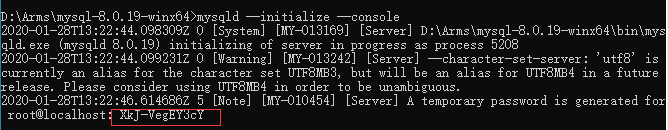

# MySQL运维部署

1. 安装与配置
2. 导出与导入


## 安装与配置

### windows环境

**1. 设置环境变量**  

配置 `MYSQL_HOME` 为MySQL的解压路径，并设置path：`;%MYSQL_HOME%\bin`

**2. 在MySQL解压路径下，新建 `my.ini` 配置初始化参数：**

```ini
[mysql]
# 设置mysql客户端默认字符集
default-character-set=utf8
[mysqld]
#设置3306端口
port = 3306
# 设置mysql的安装目录
basedir=D:\Arms\mysql-8.0.19-winx64
# 设置mysql数据库的数据的存放目录
datadir=D:\Arms\mysql-8.0.19-winx64\data
# 允许最大连接数
max_connections=2000
# 允许连接失败的次数。这是为了防止有人从该主机试图攻击数据库系统
max_connect_errors=10
# 服务端使用的字符集默认为8比特编码的latin1字符集
character-set-server=utf8
# 创建新表时将使用的默认存储引擎
default-storage-engine=INNODB
# 默认使用 "mysql_native_password" 插件认证
default_authentication_plugin=mysql_native_password
```

>my.ini 文件格式必须是 `ANSI` 格式，否则会报错：`Found option without preceding group in config file`

**3. 初始化数据库**

以 **管理员** 的身份打开cmd命令窗口，输入 `mysqld --initialize --console` 命令初始化 mysql 的 data 数据目录，初始化完毕后，会在解压目录下生成一个data文件夹，cmd窗口中会有随机生成的密码：



生成密码：ybstblNN:9vz

**4. 安装服务** 

- 注册服务：`mysqld --install mysql-master --defaults-file="D:\Arms\mysql-master\my.ini"`
- 启动服务：`net start mysql-master`
- 登录：`mysql -u root -p`

**5. 更改密码**

```sql
set password for root@localhost='123456';
-- 或者
ALTER USER USER() IDENTIFIED BY '新密码';
```

**6. 问题解决**

6.1 **服务名无效**

原因：没有注册 mysql 到服务中。  

解决：在命令行中输入`mysqld --install`，出现 `Service successfully install` 代表安装成功

6.2 **cmd中能登录，Navicat中不能登录**

错误提示：

```sh
1251 - Client does not support authentication protocol requested by server; consider upgrading MySQL client
# 或者
Authentication plugin 'caching_sha2_password' cannot be loaded
# 或者
Access denied for user 'root'@'localhost'
```

原因：

1. 没有开启远程登录
2. mysql8 之前的版本中加密规则是 `mysql_native_password`，而在 mysql8 之后，加密规则是 `caching_sha2_password`。

解决：

1. 开启远程登录
2. 把 mysql 用户登录密码加密规则还原成 `mysql_native_password`，或者升级 Navicat 驱动。  

```sh
# 登录系统
mysql -uroot -p密码
# 切换数据库
mysql> use mysql;
# 更新，任意客户端可以使用root登录
mysql> update user set host = '%' where user = 'root';

# 修改加密规则
mysql> ALTER USER 'root'@'%' IDENTIFIED BY 'password' PASSWORD EXPIRE NEVER;
# 更新用户密码（8.0以上）
mysql> ALTER USER 'root'@'%' IDENTIFIED WITH mysql_native_password BY 'password';

# 刷新权限
mysql> flush privileges;

# 上面的命令不行，可以试试下面的（5.7）
mysql> grant all privileges on *.* to root@'%' identified by '密码';
# 如果是固定ip就这么写  
mysql> grant all privileges on *.* to 'root'@'192.168.0.49' identified by '密码' with grant option;

mysql> flush privileges;

# 退出命令行
mysql> exit;
```

主从复制：

```sql
-- 主库创建复制专用用户
CREATE USER 'copyMan'@'%' IDENTIFIED BY '123';
-- 授予复制权限
GRANT REPLICATION SLAVE ON *.* TO 'copyMan'@'%';
-- 查询主节点的BinLog坐标
SHOW MASTER STATUS;
-- 为从节点指定复制主节点
change master to master_host='X.X.X.X',master_user='copyMan',master_password='123',master_log_file='mysql-bin.000003',master_log_pos=156;
-- 启动
START SLAVE;
-- 验证
SHOW SLAVE STATUS;
```

错误：【MySQL】Got fatal error 1236，仔细看了一下。是提示**max_allowed_packet 大小。**

原因：首先max_allowed_packet控制着主从复制过程中，一个语句产生的二进制binlog event大小，它的值必须是1024的倍数 。出现此类错误的常见原因是：

1. 该参数在主备库的配置大小不一样，主库的配置值大于从库的配置值。 从主库传递到备库的binlog event大小超过了主库或者备库的max_allowed_packet大小。
2. 主库有大量数据写入时，比如在主库上执行 laod data，insert into .... select 语句，产生大事务。
   当主库向从库传递一个比从库的max_allowed_packet 大的packet ，从库接收该packet失败，并报 “log event entry exceeded max_allowed_packet“。

解决方法1：

1. `set global max_allowed_packet =1*1024*1024*1024;`
2. `stop slave;`
3. `start slave;`

如：登录mysql

```sql
stop slave; -- 必须先停止才能执行下个命令
change master to master_log_file='mysql-bin.000004', master_log_pos=215987;
start slave;
```


## 导出与导入

**导出**

1、导出全库备份到本地的目录

```sql
mysqldump -u$USER -p$PASSWD -h127.0.0.1 -P3306 --routines --default-character-set=utf8 --lock-all-tables --add-drop-database -A > db.all.sql
```

2、导出指定库到本地的目录（例如mysql库）

```sql
mysqldump -u$USER -p$PASSWD -h127.0.0.1 -P3306 --routines --default-character-set=utf8 --databases mysql> db.sql
```

3、导出某个库的表到本地的目录（例如mysql库的user表）

```sql
mysqldump -u$USER -p$PASSWD -h127.0.0.1 -P3306 --routines --default-character-set=utf8 --tables mysql user> db.table.sql
```

4、导出指定库的表（仅数据）到本地的目录（例如mysql库的user表，带过滤条件）

```sql
mysqldump -u$USER -p$PASSWD -h127.0.0.1 -P3306 --routines --default-character-set=utf8 --no-create-db --no-create-info --tables mysql user --where="host='localhost'"> db.table.sql
```

5、导出某个库的所有表结构

mysqldump -u$USER -p$PASSWD -h127.0.0.1 -P3306 --routines --default-character-set=utf8 --no-data --databases mysql> db.nodata.sql

6、导出某个查询sql的数据为txt格式文件到本地的目录（各数据值之间用“制表符”分隔）

例如sql为`select user,host,password from mysql.user;`

```sql
mysql -u$USER -p$PASSWD -h127.0.0.1 -P3306 --default-character-set=utf8 --skip-column-names -B -e 'select user,host,password from mysql.user;' > mysql_user.txt
```

7、导出某个查询sql的数据为txt格式文件到MySQL服务器.

登录MySQL,将默认的制表符换成逗号.（适应csv格式文件）

指定的路径,mysql要有写的权限.最好用tmp目录,文件用完之后,再删除!

```sql
SELECT user,host,password FROM mysql.user INTO OUTFILE '/tmp/mysql_user.csv' FIELDS TERMINATED BY ',';
```

**导入**

1、恢复全库数据到MySQL，因为包含mysql库的权限表，导入完成需要执行`FLUSH PRIVILEGES;`命令

第一种方法：

```sql
mysql -u$USER -p$PASSWD -h127.0.0.1 -P3306 --default-character-set=utf8 < db.all.sql
```

第二种方法：

登录MySQL，执行source命令，后面的文件名要用绝对路径

```sql
mysql> source /tmp/db.all.sql;
```

2、恢复某个库的数据（mysql库的user表）

第一种方法：

```sql
mysql -u$USER -p$PASSWD -h127.0.0.1 -P3306 --default-character-set=utf8 mysql < db.table.sql
```

第二种方法：

登录MySQL，执行source命令，后面的文件名要用绝对路径

```sql
mysql -u$USER -p$PASSWD -h127.0.0.1 -P3306 --default-character-set=utf8

......
mysql> use mysql;
mysql> source /tmp/db.table.sql;
```

3、恢复MySQL服务器上面的txt格式文件(需要FILE权限,各数据值之间用"制表符"分隔)

```sql
mysql -u$USER -p$PASSWD -h127.0.0.1 -P3306 --default-character-set=utf8

......
mysql> use mysql;
mysql> LOAD DATA INFILE '/tmp/mysql_user.txt' INTO TABLE user ;
```

4、恢复MySQL服务器上面的csv格式文件(需要FILE权限,各数据值之间用"逗号"分隔)

```sql
mysql -u$USER -p$PASSWD -h127.0.0.1 -P3306 --default-character-set=utf8

......
mysql> use mysql;
mysql> LOAD DATA INFILE '/tmp/mysql_user.csv' INTO TABLE user FIELDS TERMINATED BY ',';
```

5、恢复本地的txt或csv文件到MySQL

```sql
mysql -u$USER -p$PASSWD -h127.0.0.1 -P3306 --default-character-set=utf8

......
mysql> use mysql;

# txt
mysql> LOAD DATA LOCAL INFILE '/tmp/mysql_user.csv' INTO TABLE user;

# csv
mysql> LOAD DATA LOCAL INFILE '/tmp/mysql_user.csv' INTO TABLE user FIELDS TERMINATED BY ',';
```

**注意事项**

1、关于MySQL连接

- -u$USER        用户名
- -p$PASSWD    密码

- -h127.0.0.1    如果连接远程服务器,请用对应的主机名或者IP地址替换

- -P3306            端口

- --default-character-set=utf8     指定字符集

2、关于mysql参数

- --skip-column-names     不显示数据列的名字

- -B     以批处理的方式运行mysql程序。查询结果将显示为制表符间隔格式。
- -e     执行命令后,退出

3、关于mysqldump参数

- -A                     全库备份

- --routines        备份存储过程和函数

- --default-character-set=utf8     设置字符集

- --lock-all-tables     全局一致性锁

- --add-drop-database    在每次执行建表语句之前,先执行DROP TABLE IF EXIST语句

- --no-create-db             不输出CREATE DATABASE语句

- --no-create-info           不输出CREATE TABLE语句

- --databases                  将后面的参数都解析为库名

- --tables                         第一个参数为库名 后续为表名

4、关于LOAD DATA语法

如果LOAD DATA语句不带LOCAL关键字，就在MySQL的服务器上直接读取文件，且要具有FILE权限。如果带LOCAL关键字，就在客户端本地读取数据文件，通过网络传到MySQL。LOAD DATA语句，同样被记录到binlog，不过是内部的机制。
