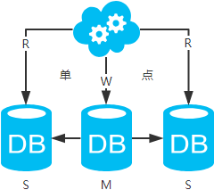
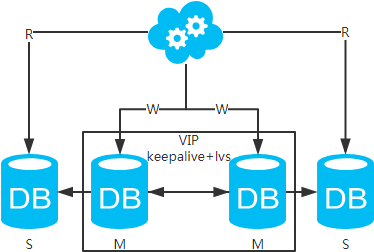
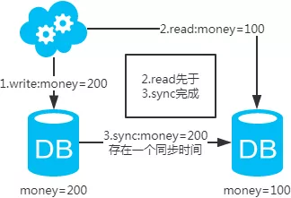
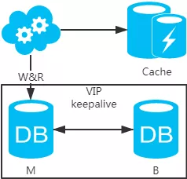
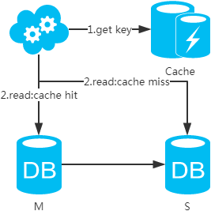
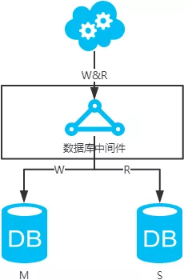
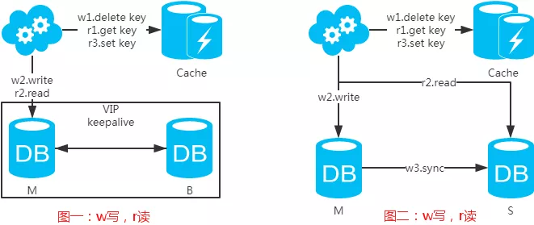
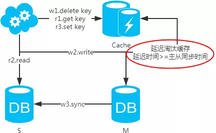

# MySQL集群搭建

一、数据库架构原则

二、常见的架构方案

- 方案一：主备架构，只有主库提供读写服务，备库冗余作故障转移用
- 方案二：双主架构，两个主库同时提供服务，负载均衡
- 方案三：主从架构，一主多从，读写分离
- 方案四：双主+主从架构，看似完美的方案

三、一致性解决方案

- 第一类：主库和从库一致性解决方案
- 第二类：DB和缓存一致性解决方案

四、个人的一些见解

- 1、架构演变
- 2、个人见解

## 一、数据库架构原则

1、高可用

2、高性能

3、一致性

4、扩展性

## 二、常见的架构方案

**方案一：主备架构，只有主库提供读写服务，备库冗余作故障转移用**

1. **高可用分析：**高可用，主库挂了，keepalive（只是一种工具）会自动切换到备库。这个过程对业务层是透明的，无需修改代码或配置。
2. **高性能分析：**读写都操作主库，很容易产生瓶颈。大部分互联网应用读多写少，读会先成为瓶颈，进而影响写性能。另外，备库只是单纯的备份，资源利用率50%，这点方案二可解决。
3. **一致性分析：**读写都操作主库，不存在数据一致性问题。
4. **扩展性分析：**无法通过加从库来扩展读性能，进而提高整体性能。
5. **可落地分析：**两点影响落地使用。第一，性能一般，这点可以通过建立高效的索引和引入缓存来增加读性能，进而提高性能。这也是通用的方案。第二，扩展性差，这点可以通过分库分表来扩展。

**方案二：双主架构，两个主库同时提供服务，负载均衡**

1. **高可用分析：**高可用，一个主库挂了，不影响另一台主库提供服务。这个过程对业务层是透明的，无需修改代码或配置。
2. **高性能分析：**读写性能相比于方案一都得到提升，提升一倍。
3. **一致性分析：**存在数据一致性问题。请看，一致性解决方案。
4. **扩展性分析：**当然可以扩展成三主循环，但笔者不建议（会多一层数据同步，这样同步的时间会更长）。如果非得在数据库架构层面扩展的话，扩展为方案四。
5. **可落地分析：**两点影响落地使用。第一，数据一致性问题，一致性解决方案可解决问题。第二，主键冲突问题，ID统一地由分布式ID生成服务来生成可解决问题。

**方案三：主从架构，一主多从，读写分离**

1. **高可用分析：**主库单点，从库高可用。一旦主库挂了，写服务也就无法提供。
2. **高性能分析：**大部分互联网应用读多写少，读会先成为瓶颈，进而影响整体性能。读的性能提高了，整体性能也提高了。另外，主库可以不用索引，线上从库和线下从库也可以建立不同的索引（线上从库如果有多个还是要建立相同的索引，不然得不偿失；线下从库是平时开发人员排查线上问题时查的库，可以建更多的索引）。
3. **一致性分析：**存在数据一致性问题。请看，一致性解决方案。
4. **扩展性分析：**可以通过加从库来扩展读性能，进而提高整体性能。（带来的问题是，从库越多需要从主库拉取binlog日志的端就越多，进而影响主库的性能，并且数据同步完成的时间也会更长）
5. **可落地分析：**两点影响落地使用。第一，数据一致性问题，一致性解决方案可解决问题。第二，主库单点问题，笔者暂时没想到很好的解决方案。

注：思考一个问题，一台从库挂了会怎样？读写分离之读的负载均衡策略怎么容错？

**方案四：双主+主从架构，看似完美的方案**

1. **高可用分析：**高可用。

2. **高性能分析：**高性能。

3. **一致性分析：**存在数据一致性问题。请看，一致性解决方案。

4. 扩展性分析：可以通过加从库来扩展读性能，进而提高整体性能。（带来的问题同方案二）

5. **可落地分析**：同方案二，但数据同步又多了一层，数据延迟更严重。

   

## 三、一致性解决方案

**第一类：主库和从库一致性解决方案**

注：图中圈出的是数据同步的地方，数据同步（从库从主库拉取binlog日志，再执行一遍）是需要时间的，这个同步时间内主库和从库的数据会存在不一致的情况。如果同步过程中有读请求，那么读到的就是从库中的老数据。如下图。

既然知道了数据不一致性产生的原因，有下面几个解决方案供参考：

1、直接忽略，如果业务允许延时存在，那么就不去管它。

2、强制读主，采用主备架构方案，读写都走主库。用缓存来扩展数据库读性能 。有一点需要知道：如果缓存挂了，可能会产生雪崩现象，不过一般分布式缓存都是高可用的。

3、选择读主，写操作时根据库+表+业务特征生成一个key放到Cache里并设置超时时间（大于等于主从数据同步时间）。读请求时，同样的方式生成key先去查Cache，再判断是否命中。若命中，则读主库，否则读从库。代价是多了一次缓存读写，基本可以忽略。

4、半同步复制，等主从同步完成，写请求才返回。就是大家常说的“半同步复制”semi-sync。这可以利用数据库原生功能，实现比较简单。代价是写请求时延增长，吞吐量降低。

5、数据库中间件，引入开源（mycat等）或自研的数据库中间层。个人理解，思路同选择读主。数据库中间件的成本比较高，并且还多引入了一层。

**第二类：DB和缓存一致性解决方案**

**先来看一下常用的缓存使用方式：**

第一步：淘汰缓存；

第二步：写入数据库；

第三步：读取缓存？返回：读取数据库；

第四步：读取数据库后写入缓存。

注：如果按照这种方式，图一，不会产生DB和缓存不一致问题；图二，会产生DB和缓存不一致问题，即4.read先于3.sync执行。如果不做处理，缓存里的数据可能一直是脏数据。解决方式如下：

注：设置缓存时，一定要加上失效时间，以防延时淘汰缓存失败的情况！

## 四、个人的一些见解

**1、架构演变**

1、架构演变一：方案一 -> 方案一+分库分表 -> 方案二+分库分表 -> 方案四+分库分表；

2、架构演变二：方案一 -> 方案一+分库分表 -> 方案三+分库分表 -> 方案四+分库分表；

3、架构演变三：方案一 -> 方案二 -> 方案四 -> 方案四+分库分表；

4、架构演变四：方案一 -> 方案三 -> 方案四 -> 方案四+分库分表；

**2、个人见解**

1、加缓存和索引是通用的提升数据库性能的方式；

2、分库分表带来的好处是巨大的，但同样也会带来一些问题，详见**MySQL数据库之互联网常用分库分表方案**https://www.cnblogs.com/littlecharacter/p/9342129.html

3、不管是主备+分库分表还是主从+读写分离+分库分表，都要考虑具体的业务场景。某8到家发展四年，绝大部分的数据库架构还是采用方案一和方案一+分库分表，只有极少部分用方案三+读写分离+分库分表。另外，阿里云提供的数据库云服务也都是主备方案，要想主从+读写分离需要二次架构。

4、记住一句话：不考虑业务场景的架构都是耍流氓。

**参考：**

- https://mp.weixin.qq.com/s/e8Acl2k_grPcjX_6Ca23ng