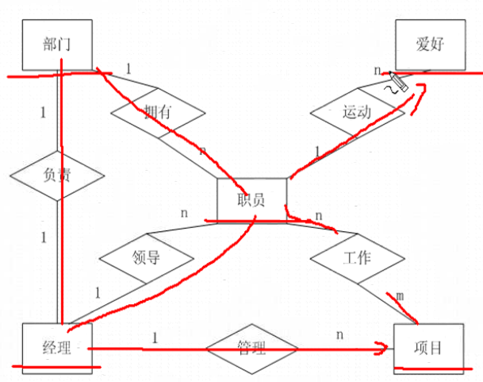

# 数据库

1. [概念](#概念)

2. [体系](#体系)

3. [范式](#范式)

4. [E-R模型](#E-R模型)

5. [关系型数据库选型](#关系型数据库选型)

## 概念

数据库就是数据存放的地方，是需要长期存放在计算机内的有组织并且可共享的数据集合。数据库中的数据按一定的数据模型组织、描述和存储，具有较小的冗余度，较高的数据独立性和易扩展性，可以为不同的用户共享使用。 

**数据库模型：**

 数据库可以使用多种类型的系统模型（模型是指数据库管理系统中数据的存储结构），其中较为常见的有三种：

- 层次模型(HierarchicalModel)

- 网状模型(NetworkModel)

- 关系模型(RelationModel)

**名词介绍：**

- DB(Database)：数据库是一组结构化信息的集合

- DBMS(Database Manager System)：数据库管理系统

- RDBMS(Relationed Database Manager System)：关系型数据库管理系统，理论由 E.F.Codd 在 60 年代提出。

- QBE(Query by Example)：实例查询语言，基于图形点击式查询，发明者：Moshe M Zloof

- SQL(Structured Query Language)：结构化查询语言，发明者：Donald D.Chamberlin, Raymond F.Boyce

**关系数据库概念：**

关系数据库是由数据表和数据表之间的关联组成。关系数据库的特点在于它将每个具有相同属性的数据独立地存在一个表中。对任何一个表而言，用户可以新增、删除和修改表中的数据，而不会影响表中的其他数据。

## 体系

**客户服务器体系：** 

常见的大型数据库系统（Oracle、Microsoft SQL Server 等）几乎都是客户/服务器系统。

**文件服务器系统：**

文件服务器系统（file-server system），如 Microsoft Access、dBase 和 FoxPro 等。文件服务器系统的最大不足是在网络上运行时会因为用户人数的增加而变得非常缺乏效率。

## 范式

关系模型原理的核心是“规范化”概念，规范化是把数据库组织成在保持存储数据完整性的同时最小化冗余数据的结构的过程。规范化的数据库是符合关系模型规则的数据库，通常把这些规则称为范式。

**第一范式：**

- 数组的每个属性只能包含一个值

- 关系中的每个数组必须包含相同数量的值

- 关系中的每个数组一定不能相同

**第二范式**

如果一个数据已经满足第一范式，而且该数据表中的任何一个非主键字段的数值都依赖于该数据表的主键字段，那么该数据表满足第二范式

**第三范式**

如果一个数据表满足第二范式，而且该数据表中的任何两个非主键字段的数据值之间不存在函数信赖关系，那么该数据表满足第三范式

## E-R模型

 E-R(Entity-Relationship)数据模型，即实体-联系数据模型，是于1976年提出的早期的语义数据模型。该数据模型的最初提出是由于数据库设计，是面向问题的概念性数据模型，它用简单的图形反映了现实世界中存在的事物或数据及它们之间的关系。

**实体：**

实体是观念世界中描述客观事物的概念，可以是具体的事物，例如一本书、一条街、一朵鲜花等，也可以是抽象的事物，例如一个容量、一个城市、一种气体或一种感受等。同一类实体的所有实例就构成该对象的实体集。

**关系：**

- 一对一

- 一对多

- 多对多

**一个人事管理系统的E-R图：**

## 关系型数据库选型

### MySQL

- 开源、免费。官网：[https://www.mysql.com/

- 不足（未验证）

  1. MyISAM 格式的数据表只有数据表锁定，没有数据行锁定，可以使用 InnoDB 格式数据表绕过这个问题
  2. MyISAM 数据表不能热备份，即无需锁定数据表就可以在对数据表进行处理时同时对其进行备份。InnoDB 可以，但是收费
  3. 不支持自定义类型
  4. 不能直接处理 XML 数据（可以处理JSON数据）
  5. 没有 OLAP 功能。支持 OLAP 的数据库系统通常称为数据仓库(data warehouse)

- MySQL版本

  1. Alpha：开发
  2. Beta：基本完成
  3. Gamma：更加稳定
  4. Production 或 Generally Available(GA)：足够成熟和稳定

- MySQL许可证：GPL(GNU Public License) 

- SQL兼容性：

  MySQL 支持 SQL，SQL 有许多种“方言”，可以通过调整 MySQL 服务器的配置开关 sql-mode 使它在行为上与 IBM DB2 和 Oracle 等多种数据库系统保持最大限度的兼容

- MySQL数据文件：

  Linux：`/var/lib/mysql`，Windows：`%MySQL%/data`

  - `data/dbname/tablename.frm`：数据表结构定义
  - `data/dbname/db.opt`：整个数据库的结构定义和设置
  - `data/dbname/tablename.MYD`：MyISAM数据表数据
  - `data/dbname/tablename.MYI`：MyISAM数据表索引
  - `innodb_file_per_table`：InnoDB存储方式（各自一个文件，统一的表空间）
  - `data/dbname/tablename.idb`：InnoDB数据表数据、索引默认存储
  - `data/ibdata1,-2,-3`：表空间和撤销日志
  - `data/ib_logfile0,-1,-2`：InnoDB日志数据
  - `data/dbname/tablename.TRG`：触发器

> 从 SQL 标准的符合性来说，MySQL 不仅无法跟成熟的商业数据库相比，在开源数据库中也远不是最好的。为什么还在开源数据库中独占鳌头？因为性能！MySQL 的开发者一直坚持性能优先的原则。被广泛地应用在 Internet 上的中小型网站中。体积小、速度快、成本低、开放源码。

- DB2：IBM的数据库产品，一个关系数据库管理系统（RDBMS），被设计成存储，分析和有效地检索数据的产品，扩展了面向对象的特性和非关系型结构以及对XML的支持。

- MariaDB：一个基于MySQL关系数据库管理系统的社区项目，开源

- PostgreSQL：加州大学伯克利分校以教学为目的开发的数据库系统，以追求功能实现的“完美”为首要目标。ANSI/ISO SQL标准的遵从上比MySQL领先（业界公认最符合标准），但是性能一直是其“短板”，很难支持大型应用。

- SQLite：嵌入式关系数据库管理系统，独立，无服务器，零配置和支持事务的数据库引擎

- ORACLE：适用于业务逻辑较复杂、数据量大的较大型项目开发。

- SQL Server：功能比较全面、效率高，适用于中型企业或单位的数据库平台。缺点是只能在Windows系统下运行。

**优缺点对比：**

1. 开放性
   - SQL Server：只能在windows上运行，没有丝毫开放性，操作系统的系统稳定对数据库是十分重要的。（windows平台的可靠性、安全性、伸缩性是非常有限的）
   - ORACLE：能在所有主流平台上运行。
   - DB2：能在所有主流平台上运行。最适用于海量数据。

2. 可伸缩性，并行性
   - SQL Server：并行实施和共存模型并不成熟。很难处理日益增多的用户数和数据卷。伸缩性有限。
   - ORACLE：平行服务器通过使一组结点共享同一簇中的工作来扩展 windownt 的能力，提供高可用性和高伸缩性的簇的解决方案。
   - DB2:具有很好的并行性。

3. 安全性
   - SQL Server：没有获得任何安全证书。
   - ORACLE：获得最高认证级别的ISO标准认证。
   - DB2：获得最高认证级别的ISO标准认证。

4. 性能
   - SQL Server：多用户时性能不佳。
   - ORACLE：性能最高，保持 windowsNT 下的 TPC-D 和 TPC-C 的世界记录。
   - DB2：适用于数据仓库和在线事务处理，性能较高。

5. 客户端支持及应用模式
   - SQL Server：C/S结构，只支持 windows 客户，可以用 ADO、DAO、OLEDB、ODBC 连接。
   - ORACLE：多层次网络计算，支持多种工业标准，可以用 ODBC、JDBC、OCI 等网路客户连接。
   - DB2：跨平台，多层结构，支持 ODBC、JDBC 等客户。

