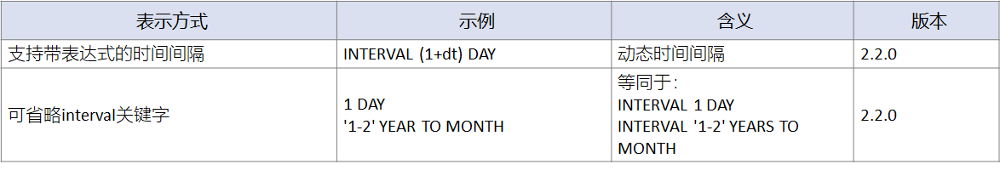

# Hive

1. 基本概念

2. [环境搭建](#环境搭建)

3. [表存储格式](#表存储格式)

4. [数据类型](#数据类型)

5. [DDL基本操作](#DDL基本操作)

6. [存储格式](#存储格式)

7. [压缩](#压缩)

8. [表的高级操作：分区](#表的高级操作：分区)

9. [表的高级操作：分桶](#表的高级操作：分桶)

10. [表的高级操作：倾斜表](#表的高级操作：倾斜表)

11. [表的高级操作：事务表](#表的高级操作：事务表)

    

## 基本概念

**诞生背景**

在传统数据分析中，最常见的还是结构化数据，这个场景有它成熟的分析工具——SQL。数据量达到某个量级之后，单机或MPP数据库无法承受其负载，势必要转向大数据平台；但数据迁移完成后，因为大数据有自己的计算引擎（如Mapreduce），所以之前所有使用SQL编写的分析任务，都需要重构为MapReduce任务，这个工作量极大，迁移成本极高。而且迁移之后，对结构化数据的分析，也不能再使用SQL这种方便的工具来进行了，需要学习MapReduce语法，学习成本也很大。

那可不可以将特定领域，已经成熟的语法和使用习惯，如结构化数据分析的SQL，也迁移到大数据平台上来？当然可以，而且在大数据产品中，都是致力于此，用于提升大数据在不同场景的易用性。在结构化数据分析，即数据仓库场景中，可以将SQL自动转化为MapReduce任务的，在Hadoop家族中，最常用的便是Hive了。

**什么是Hive？**

- 早期由Facebook开发，后来由Apache软件基金会开发，并成为其顶级项目

- 基于Hadoop的一个数据仓库工具

- 核心思想是将迁移到HDFS中的结构化的数据文件，映射为一张数据库表，并提供sql查询、分析功能，可以将sql语句转换为MapReduce任务进行运行，也支持转换为Spark任务。

  > 官方推荐底层转换为Spark进行运算。
  >
  > Hive对原生SQL的支持率并不高，大概在60%左右，它有自己特定的语法HQL（Hive SQL)。但即便如此，在结构化数据分析中，已经带来极大的便捷了。

- 标识

  

**Hive架构**


Hive架构主要由3部分构成，Client、Driver、MetaStore。其中Client客户端用于任务的提交，包含Shell客户端Beeline、Hive Cli，还有JDBC客户端；Driver会对提交的任务进行解析，将HiveSQL转换为MapReduce作业，它包含解释器（Antlr）、编译器、优化器、执行器，共同完成HQL查询语句从语法分析、编译成逻辑查询计划、优化以及转换成物理查询计划的过程；在转换过程中，因为SQL处理的是结构化数据，而Hive的数据是以文件的形式保存在HDFS中的，所以要将文件映射为二维表结构，MetaStore中存储的元数据信息（表类型、属性、字段、权限等）便可以辅助完成数据映射的功能，一般使用Mysql或Derby作为MetaStore的数据存储。

最终通过Driver转换成的MapReduce任务，会提交到底层的Hadoop平台上进行运算，返回运算结果。

**搭建模式**

Hive提供三种搭建模式：本地模式、单用户模式、多用户/远程服务器模式。

**本地模式**

本地模式最为简单，仅适用于测试环境。在启动时，直接使用Hive CLI客户端，它自带Driver，而且连接到一个内置的In-memory 的数据库Derby作为MetaStore。


**单用户模式**

单用户模式会部署MetaStore，一般使用MySQL，但Driver依然集成在Hive Cli中，因为没有权限管控功能，所以只适合单用户场景。


**多用户模式/远程服务器模式**

在生产环境中一般使用这种部署模式，在服务节点启动Thrift Server——HiveServer2，它集成了Driver和权限管控功能，单独对外提供服务；因为具有权限管控，所以适合多用户场景。MetaStore也进行单独部署，一般使用Mysql。

在这种部署模式下，Hive Cli已经不推荐使用了，而使用Beeline/JDBC客户端与HiveServer2进行连接与交互。


## 环境搭建

#### 环境规划

**操作系统及组件版本**

各组件版本如下，学习环境尽量保持一致，避免版本不一致带来的操作问题。

| **组件** | ***\**\*CentOS\*\**\*** | ***\**\*Hadoop\*\**\*** | ***\**\*Hive\*\**\*** | ***\**\*Tez\*\**\*** | ***\**\*Mysql\*\**\*** |
| :------- | :---------------------- | :---------------------- | :-------------------- | :------------------- | :--------------------- |
| **版本** | 7.2                     | 2.7.7                   | 2.3.7                 | 0.9.1                | 5.7.28                 |

**集群规划**

使用3台虚拟机来进行搭建集群，分别为Node01、Node02、Node03。集群的规划如下：

| ****       | ***\**\*Hadoop\*\**\*** | ***\**\*Hive&Tez\*\**\*** | ***\**\*Mysql\*\**\*** |
| :--------- | :---------------------- | :------------------------ | :--------------------- |
| **node01** | √                       |                           |                        |
| **node02** | √                       |                           | √                      |
| **node03** | √                       | √                         |                        |

其中Hadoop一共3个节点，主节点搭建在Node01上，从节点在Node01-Node03上分别有一个。Hive搭建在node03上，底层使用Tez引擎进行优化；Mysql作为MetaStore，安装在Node02上。

#### 虚拟机准备

**安装说明&文件下载**

下载并安装Virtual Box：https://www.virtualbox.org/wiki/Downloads

准备并安装3台CentOS7.2的虚拟机，主机名命名为node01、node02、node03。

虚拟机的安装可以使用纯系统镜像，安装后配置主机名。但过程会比较繁琐，学习环境讲求开箱即用，尽量少的在环境上花费时间，否则会打击学习的热情。所以，也可以直接导入已经配置好的虚拟机镜像文件，方便使用。

使用纯镜像安装，下附CentOS镜像下载地址：

链接：https:*//pan.baidu.com/s/1CV0C7bZ0-7tKziNf6RmdVg* 提取码：h931

推荐直接导入虚拟机镜像文件，下附虚拟机镜像下载地址：

链接：https:*//pan.baidu.com/s/1T1VhTv6EwGAr2odlAUPBtA* 提取码：pljf

**虚拟机镜像文件导入流程**

1. 下载虚拟机镜像文件
2. 打开Virtual Box，选择导入虚拟电脑
3. 选择文件位置，进行导入
4. 配置虚拟机，自定义将虚拟机文件存放到指定目录，然后点击确定，完成导入
5. 依次导入Node01、Node02、Node03
6. 开启虚拟机，使用root/123456进行登录
7. 修改虚拟机IP地址（更改ip为当前局域网IP）：`vim /etc/sysconfig/network-scripts/ifcfg-enp0s3`
8. 使用XShell，或者其它远程SSH Linux登录工具进行远程连接虚拟机

#### 自动化安装脚本准备

1. 下载并上传自动化安装脚本[automaticDeploy.zip](https://github.com/MTlpc/automaticDeploy/archive/master.zip)到虚拟机node01中。

   ```sh
   wget https://github.com/MTlpc/automaticDeploy/archive/hive.zip
   ```

2. 解压automaticDeploy.zip到/home/hadoop/目录下

   ```sh
   mkdir /home/hadoop/
   unzip hive.zip -d /home/hadoop/
   mv /home/hadoop/automaticDeploy-hive /home/hadoop/automaticDeploy
   ```

3. 更改自动化安装脚本的frames.txt文件，配置组件的安装节点信息（如无特殊要求，默认即可）

4. 编辑自动化安装脚本的configs.txt文件，配置Mysql、Keystore密码信息（如无特殊要求，默认即可，末尾加END表示结束）

5. 编辑host_ip.txt文件，将3台虚拟机节点信息添加进去（需自定义进行修改）

   ```sh
   192.168.31.41 node1 root 123456
   192.168.31.42 node2 root 123456
   192.168.31.43 node3 root 123456
   ```

6. 对/home/hadoop/automaticDeploy/下的hadoop、systems所有脚本添加执行权限

   ```sh
   chmod +x /home/hadoop/automaticDeploy/hadoop/* /home/hadoop/automaticDeploy/systems/*
   ```

#### 大数据环境一键安装

1. 下载frames.zip包，里面包含大数据组件的安装包，并上传到node01中

   链接：https:*//pan.baidu.com/s/1XxuouuogndEc6vIIiUhyTw* 提取码：i4ki 复制这段内容后打开百度网盘手机App，操作更方便哦

2. 将frames.zip压缩包，解压到/home/hadoop/automaticDeploy目录下

   ```sh
   unzip frames.zip -d /home/hadoop/automaticDeploy/
   ```

3. 进行集群环境配置，并分发安装脚本和文件

   ```sh
   /home/hadoop/automaticDeploy/systems/clusterOperate.sh
   ```

   - 为了避免脚本中与各个节点的ssh因为环境问题，执行失败，需要手动测试下与其它节点的ssh情况，如果失败，则手动添加

   - 失败后重新添加SSH

     ```sh
     ssh-copy-id node02
     ```

4. 在各个节点执行脚本，安装Hadoop集群

   ```sh
   /home/hadoop/automaticDeploy/hadoop/installHadoop.sh
   source /etc/profile
   # 在Node01节点执行，初始化NameNode
   hadoop namenode -format
   # 在Node01节点执行，启动Hadoop集群
   start-all.sh
   ```

5. 使用本地浏览器访问node01:50070，成功则说明Hadoop搭建成功

6. 在Node02节点使用脚本安装Mysql

   ```sh
   /home/hadoop/automaticDeploy/hadoop/installMysql.sh
   ```

7. 在Node03节点安装Hive

   ```sh
   /home/hadoop/automaticDeploy/hadoop/installHive.sh
   source /etc/profile
   ```

8. 在Node03节点启动Hive

   ```sh
   # 启动HiveServer2
   hive --service hiveserver2 &
   # 启动Metastore
   hive --service metastore &
   ```

9. 使用beeline访问hive，beeline可以直接Ctrl+C退出

   ```sh
   beeline -u jdbc:hive2://node03:10000 -n root
   ```

10. 试着创建一张表

    ```sql
    create table test(id string, name string);
    ```

    如果报错：Column length too big for column 'PARAM_VALUE' (max = 21845); use BLOB or TEXT instead。是因为MySQL中的metastore表编码问题，使用schematool工具恢复一下即可，或手动将hive数据库编码更改为latin1。

    ```sh
    # 更改hive数据库编码:在Node02节点(Mysql安装节点)执行（2选1）
    mysql -uroot -pDBa2020* -e "alter database hive character set latin1;"
    # 或者在hive节点执行恢复脚本（2选1）
    schematool -dbType mysql -initSchema
    # kill掉hiveserver2和metastore进行，重新启动
    jps | grep RunJar | awk '{print $1}' | xargs kill -9
    hive --service hiveserver2 &
    hive --service metastore &
    ```

#### 基本配置

虽然已经使用脚本，快速完成了集群的搭建，但关于Hive的一些基本配置，仍然需要学习和掌握。

**配置文件**

Hive的配置文件有两个：hive-env.sh、hive-site.xml，在hive安装目录下的conf目录中可以找到。使用脚本搭建的hive集群，安装目录为：/opt/app/apache-hive-1.2.1-bin。

其中hive-site.xml是Hive的全局配置文件，可以进行一些基础、调优的配置。

hive-env.sh设置了Hive集群运行所需的环境变量，因为Hive是Java语言开发，运行在JVM之上，并且依赖Hadoop集群，所以这里主要进行Java环境配置、Hadoop环境配置、JVM调优。

**hive-site.xml配置**

hive-site.xml文件使用xml标签进行配置。其中标签中包含多个配置项；每个标签中，使用和标签来设置配置的名称与所对应的值。

因为这里使用Mysql作为MetaStore，所以需要在这里配置Mysql相关的信息。配置项包含Mysql连接URL、JDBC Driver、UserName、Password。

```xml
<configuration>
<property>
<name>javax.jdo.option.ConnectionURL</name>
<value>jdbc:mysql://node02:3306/hive?createDatabaseIfNotExist=true&amp;useSSL=false</value>
<description>JDBC connect string for a JDBC metastore</description>
</property>

<property>
<name>javax.jdo.option.ConnectionDriverName</name>
<value>com.mysql.jdbc.Driver</value>
<description>Driver class name for a JDBC metastore</description>
</property>

<property>
<name>javax.jdo.option.ConnectionUserName</name>
<value>hive</value>
<description>username to use against metastore database</description>
</property>

<property>
<name>javax.jdo.option.ConnectionPassword</name>
<value>mysqlHivePasswd</value>
<description>password to use against metastore database</description>
</property>
</configuration>
```

配置完成后，需要将JDBC驱动放置到Hive安装目录下的lib目录中，这里脚本已经自动完成。

```sh
ls | grep mysql
```

除此之外，要启动ThriftServer，需要配置thrift服务的host、port，然后设置Metastore的URL。

```xml
<property>
<name>hive.server2.thrift.port</name>
<value>10000</value>
</property>
<property>
<name>hive.server2.thrift.bind.host</name>
<value>node03</value>
</property>
<property>
<name>hive.metastore.uris</name>
<value>thrift://node03:9083</value>
</property>
```

**hive-env.sh配置**

在 hive-env.sh 中需要配置 JAVA_HOME 和 HADOOP_HOME，并且设置 HIVE_CONF_DIR。

```sh
export JAVA_HOME=/usr/lib/java/jdk1.8.0_144
export HADOOP_HOME=/opt/app/hadoop-2.7.7
export HIVE_CONF_DIR=/opt/app/apache-hive-1.2.1-bin/conf
```


## 表存储格式

#### Hive表的存储格式


Hive支持的表类型，或者称为存储格式有：TextFile、SequenceFile、RCFile、ORC、Parquet、AVRO。

**TextFile**

其中TextFile是文本格式的表，它是Hive默认的表结构；在存储时使用行式存储，并且默认不进行压缩，所以TextFile默认是以明文的文本方式进行保存的，但可以手动开启Hive的压缩功能进行数据压缩。

但开启压缩后，压缩后的文件在处理时无法进行split，所以并发度并不高；

因为一个压缩文件在计算时，会运行一个Map任务进行处理，如果这个压缩文件较大，处理效率就会降低，但压缩文件支持再切分的话，在处理时可以Split成多个文件，从而启动多个Map任务进行并发处理，提升处理性能。

而且对TextFile压缩文件的解压，即反序列化为普通文件，必须逐个字符判断是不是分隔符和行结束符，因此反序列化开销会比 SequenceFile 高几十倍。

TextFile表因为采用了行式存储，所以适合字段较少或者经常需要获取全字段数据的场景，在数据仓库场景的分析计算场景中一般不会使用TextFile表；通常ETL流程导入的数据通常为文本格式，使用TextFile表可以很容易的将数据导入到Hive中来，所以它常见的适用场景是作为外部数据导入存储，或者导出到外部数据库的中转表。

**SequenceFile**

SequenceFile同样是行式存储的表，它的存储格式为Hadoop支持的二进制文件，比如在MapReduce中数据读入和写出所使用的数据，其中Key为读取数据的行偏移量，Value为SequenceFile真正存储的数据，所以它在Hadoop中处理时，会减少文件转换所需要的时间。SequenceFile支持压缩，可以选择None、Record、Block三种压缩方式，默认为Record，压缩率最高的是Block，而且支持压缩文件再拆分。所以如果在生产中，需要数据进行行式存储、原生支持压缩，且要满足一定的性能要求，那么可以使用SequenceFile这种存储方式。

**RCFile、ORC、Parquet**

RCFile、ORC、Parquet这三种格式，均为列式存储表——准确来说，应该是行、列存储相结合。在存储时，首先会按照行数进行切分，切分为不同的数据块进行存储，也就是行存储；在每一个数据块中，存储时使用的又是列式存储，将表的每一列数据存放在一起。这种列式存储在大数据技术中尤为常见，它在海量数据场景中是很好的一种优化手段，可以减少数据读取、移动所花费的时间；因为在结构化数据处理中，一般不会用到全部数据，而是选择某几列进行运算，使用行式存储会将所有数据加载后再进行过滤，而列式存储可以只读取这几列数据，减少数据读取、处理所需要的时间，这在海量数据场景中可以节约非常多的时间。

列式存储表中，RCFile现在基本很少使用了，它是ORC表的前身，支持的功能和计算性能都低于ORC表。

ORC表是Hive计算的主要表形式，是在RCFile的基础上进行了优化和改进，支持NONE、Zlib、Snappy压缩，在分析计算中的性能较好，是生产中常见的表类型。而且ORC表可以开启事务功能，以便支持数据更新、删除等操作，但事务的开启会影响表的处理性能，所以非必要情况下不需要启用事务功能。但ORC表的问题在于，它是Hive特有的存储类型，所以在其它大数据产品中兼容性并不好，有些只有在较高的版本中才会支持。

Parquet表也是Hive计算的主要表形式，它的计算性能稍弱于ORC表，但因为Parquet文件是Hadoop通用的存储格式，所以对于其它大数据组件而言，具有非常好的数据兼容度；而且Parquet表可以支持数据的多重嵌套（如JSON的属性值可以是一个对象，且支持嵌套），但ORC表在多重嵌套上的性能并不好。Parquet支持uncompressed\snappy\gzip\lzo压缩，其中lzo压缩方式压缩的文件支持切片，意味着在单个文件较大的场景中，处理的并发度会更高；而ORC表的压缩方式不支持切分，如果单个压缩文件较大的话，性能会有影响。

所以，对于ORC表和Parquet表的选择要区分使用场景，如果只在Hive中处理时使用，追求更高效的处理性能，且单个文件不是很大，或者需要有事务的支持，则选用ORC表。但如果要考虑到与其它大数据产品的兼容度，且单个文件较为庞大，数据存在多重嵌套，则选用Parquet表。

**AVRO**

最后AVRO表，它主要为 Hadoop 提供数据序列化和数据交换服务，支持二进制序列化方式，它与Thrift功能类似。一般而言，在数据传输中，不会直接将文本发送出去，而是先要经过序列化，然后再进行网络传输，AVRO就是Hadoop中通用的序列化和数据交换标准。所以，如果数据通过其他Hadoop组件使用AVRO方式传输而来，或者Hive中的数据需要便捷的传输到其他组件中，使用AVRO表是一种不错的选择。

#### 常见表类型选择

Hive在生产中，一般使用较多的是TextFile、Orc、Parquet。TextFile一般作为数据导入、导出时的中转表。ORC和Parquet表一般作为分析运算的主要表类型，如果需要支持事务，则使用ORC，如果希望与其它组件兼容性更好，则使用Parquet。

在性能上ORC要略好于Parquet。但Parquet支持压缩切分，有时候也是考虑因素。

当然除了这几种内置表，Hive还支持自定义存储格式。可通过实现 InputFormat 和 OutputFormat 来完成。

#### 压缩方式


Hive内置的压缩方式有bzip2、deflate、gzip，支持的第三方压缩方式有lzo、snappy。标准压缩方式为deflate，其算法实现是zlib。

其中bzip2、lzo支持压缩后文件再拆分。

对于这几种压缩算法，按照压缩比的排名顺序为：bzip2 > gzip > deflate > snappy > lzo。所以如果想保证高压缩率，那可以选用bzip2、gzip，但相应的压缩/解压缩的时间也会很长。相反的，按照压缩/解压缩耗时排名，顺序正好相反：lzo < snappy < deflate < gzip < bzip2，所以如果追求处理效率，则可以使用lzo、snappy进行压缩。

这里对压缩方式，仅做简单的了解即可。


## 数据类型

#### 基本数据类型

**数值型**


Hive数值型包含整数、浮点数两种。

整数类型有：tinyint、smallint、int/integer、bigint，默认为int/integer，或者使用后缀进行整数类型的标识：100Y、100S、100L（对应为 tinyint、smallint、bigint）。

浮点类型有：float、double/double precision、decimal/numeric，金融级别数据会使用decimal保证数据精度。

**decimal数据类型**使用构造函数decimal (precision, scale)进行创建，precision是数字部分（整数+小数）的整体长度， scale是小数部分的长度。如果不进行指定，数字部分默认长度为 10，小数部分如果没有指定，则默认为 0。

一般数据类型在建表时，在表字段后指定；但为了方便演示，使用了CAST函数进行了数据类型转换，将其它类型数据转换为DECIMAL类型。执行SQL前，先保证HiveServer2和MetaStore已经启动，并使用beeline客户端连接到hive。

```sql
-- 将float类型的123.5转换为decimal类型
select CAST(123.56 AS DECIMAL(4,1));
> 123.5
```

小数部分超出指定长度后，会被四舍五入截取，相当于精度截取。

```sql
select CAST(123456.5 AS DECIMAL);
> 123457
```

整数部分超出指定长度后，直接转换为NULL值，相当于数据溢出。

```sql
select CAST(12345678910.5 AS DECIMAL);
> NULL
```

可以将其它数据类型转换为decimal，数据超出部分按照规则进行截取。

```sql
select CAST('123456789.1234567' AS DECIMAL(20,5));
123456789.12346
```

**字符型**

Hive字符型包含可变长度字符串、固定长度字符串两种。可变长度字符串有：string、varchar；固定长度字符串有：char。


其中varchar需要指定最大字符数（1-65535），超过则会被自动截断，而string会自动进行扩展；但varchar和string，末尾如果存在空格，则会影响字符串的比较结果。

```sql
select CAST("ABCDEFGHIGK" AS VARCHAR(10));
> ABCDEFGHIG
select CAST("ABCDEFGHIGK" AS STRING);
> ABCDEFGHIGK
```

char需要指定最大字符串（1-255），小于指定长度的值会被空格填充，末尾存在空格，并不影响字符串的比较结果。

```sql
select CAST("ABCDEFGHIGK" AS CHAR(10));
> ABCDEFGHIG
```

**日期型**

Hive支持的日期类型有：TIMESTAMP、DATE、INTERVAL。


**TIMESTAMP**可以存储整型、浮点型、字符串类型的时间数据。

整型、浮点型支持以毫秒为单位的UNIX时间戳。

```sql
select CAST(1610493629000 AS TIMESTAMP);
> 2021-01-13 07:20:29.0
```

字符串，支持YYYY-MM-DD HH:MM:SS.fffffffff 格式，可达到小数点后9位精度（纳秒级别）。

```sql
select CAST('2021-01-13 07:20:29' AS TIMESTAMP);
> 2021-01-13 07:20:29.0
```

对于TIMESTAMP，提供用于时区转换的UDF函数：to*utc*timestamp，from*utc*timestamp。

```sql
select to_utc_timestamp(1610493629000, 'GMT');
> 2021-01-13 07:20:29.0
```

所有日期时间的UDF都能够使用TIMESTAMP数据类型。

**Date**类型在0.12.0后支持，格式为YYYY-­MM-­DD，可以表示从0000-­01-­01到9999-­12-­31的日期。Date只能从Date、Timestamp、String类型中转换而来。

```sql
select cast(CAST('2021-01-13 07:20:29' AS TIMESTAMP) as date);
select cast('2021-01-13' as date);
select cast(cast('2021-01-13' as date) as date);
```

**Intervals**是指一段以年、月、日、分钟、秒为单位的时间片段。


在2.2.0版本之前，仅支持字符串表示时间片段，但2.2.0后可以使用数字常量直接表示，或者直接省略INTERVAL关键字，使用别名进行表示。如INTERVAL '1' DAY等同于INTERVAL 1 DAY，也可以使用1 DAYS进行表示。

Intervals一般用于时间的计算。

```sql
# 在当前时间的基础上，增加1年、2个月、1天
# 2.2.0之前
select current_timestamp()  + INTERVAL '1' year + INTERVAL '2' MONTH + INTERVAL '1' DAY;
# 2.2.0之后
select current_timestamp()  + INTERVAL 1 year + INTERVAL 2 MONTH + INTERVAL 1 DAY;
select current_timestamp()  + 1 years + 2 months + 1 days;
```

Intervals支持格式化字符串，用于表示组合的时间片段，但支持有限。


```sql
--表示1年2个月
select INTERVAL '1-2' YEAR TO MONTH;
--表示1天2小时3分钟4秒5纳秒
select INTERVAL '1 2:3:4.000005' DAY TO SECOND;
```

Intervals仅支持年、月进行组合，天、小时、分钟、秒、纳秒进行组合，不支持类似月、天这样的组合，但因为组合的时间片段使用场景非常有限，一般在时间计算中会直接对多个INTERVAL片段进行运算，所以不影响实际使用。

Intervals在2.2.0版本中，支持动态时间间隔、关键字省略，方便了在特定场景中的使用。



```sql
select INTERVAL (1+2) MONTH;
select 1 DAY;
```

**其它类型（Misc Type）**

在基本数据类型中，还有BOOLEAN、BINARY。


当然，对于缺失的数据值，会被标记为NULL。

**复杂数据类型**

Hive支持复杂数据类型array、map、struct、union。


#### 数据类型比较

对于这些数据类型，仅需要在使用时进行参考即可。但Hive作为数据仓库，数据更多的时候是从其它数据库或数据仓库中导入的，所以就需要进行数据类型的转换。

其中**JDBC与Hive数据类型的对照关系**如下图所示：


接下来是**Orcale与Hive的数据类型对照**：


除此之外，DB2也是常见的数据库，**DB2与Hive的数据类型对照**如下：


对于这些数据类型，在需要使用的时候，直接进行参考对照即可。


## DDL基本操作

#### 基本概述

Hive DDL根据操作对象的不同可分为：数据库操作、表的基本操作、表的高级操作、函数操作。

- 对数据库的操作包含：对数据库的创建、删除、修改、查看元信息、切换、展示所有数据库。
- 表的基本操作：对表的创建、删除、修改、清空、查看元信息、查看所有表。
- 表的高级操作主要是分区、分桶。
- 函数的操作包含：创建、删除、查看元信息、查看所有函数。

#### 客户端启动

执行Hive SQL时，可以使用beeline，也可以使用Hive Cli，但前提是启动HiveServer2和MetaStore。

先使用jps命令查看Node03中，Hive服务是否已经启动。

```sh
jps -m
```

如果没有启动，使用以下命令启动即可。

```sh
# 启动HiveServer2
hive --service hiveserver2 &
# 启动Metastore
hive --service metastore &
```

然后使用beeline或hive cli进入到hive命令行界面。

```sh
# beeline方式（推荐）
beeline -u jdbc:hive2://node03:10000 -n root

# hive cli方式
hive
```

#### 数据库基本操作

**创建数据库**

```sql
CREATE DATABASE [IF NOT EXISTS] <database_name>
[COMMENT '<database_comment>']
[WITH DBPROPERTIES ('<property_name>'='<property_value>', ...)];

# 例如，创建数据库mydb：
create database mydb;
```

**删除数据库**

```sql
# 可以删除空数据库，如果数据库不为空，则删除失败。
DROP DATABASE [IF EXISTS] <database_name>;
# 例如，删除数据库mydb：
drop database mydb;
# 可以使用cascade指令，强制删除非空数据库：
DROP DATABASE [IF EXISTS] <database_name> cascade;
# 例如，强制删除数据库mydb：
-- 先创建mydb数据库
create database mydb;
-- 强制删除数据库mydb
drop database mydb cascade;
```

**修改数据库属性：**

可以使用 `ALTER DATABASE` 命令为某个数据库的DBPROPERTIES设置键-值对属性值，来描述这个数据库的属性信息。数据库的其他元数据信息都是不可更改的，包括数据库名和数据库所在的目录位置。

```sql
ALTER DATABASE <database_name> SET DBPROPERTIES ('<property_name>'='<property_value>', ...);

# 例如，为数据库mydb添加自定义属性edited-by，表示编辑者。
--先创建mydb数据库
create database mydb;
--添加数据库属性
alter database mydb set dbproperties('edited-by'='Joe');
```

**列出所有数据库：**

```sql
SHOW DATABASES;
```

**切换数据库：**

```sql
USE <database_name>;

# 例如，切换到mydb数据库中。
USE mydb;
```

**查看数据库详情：**

```sql
DESCRIBE database <database_name>;

# 例如，查看mydb数据库详情。
DESCRIBE DATABASE mydb;
# 可以使用describe extended查看数据库详细信息：
DESCRIBE DATABASE extended <database_name>;
```

#### 表的基本操作

**什么是内表和外表？**

Hive完整的建表语句如下：

```sql
CREATE [TEMPORARY] [EXTERNAL] TABLE [IF NOT EXISTS]
[<database_name>.]<table_name>
[(<col_name> <data_type> [COMMENT '<col_comment>'] [, <col_name> <data_type> ...])]
[COMMENT '<table_comment>']
[PARTITIONED BY (<partition_key> <data_type> [COMMENT '<partition_comment>']
[, <partition_key > <data_type>...])]
[CLUSTERED BY (<col_name> [, <col_name>...])
[SORTED BY (<col_name> [ASC|DESC] [, <col_name> [ASC|DESC]...])]
INTO <num_buckets> BUCKETS]
[
[ROW FORMAT <row_format>]
[STORED AS file_format]
| STORED BY '<storage.handler.class.name>' [WITH SERDEPROPERTIES (<...>)]
]
[LOCATION '<file_path>']
[TBLPROPERTIES ('<property_name>'='<property_value>', ...)];
```

Hive的表根据对数据拥有的权限不同，又分为内表（Managed Table）和外表（External Table）。其中内表是主要使用的表形式，而外表一般作为数据导入时的临时表使用。

如何区分内外表？Hive的表由两部分组成，一部分是存储在HDFS上的数据，一部分是存储在MetaStore中的元数据（表结构、权限、属性等信息）。内表和外表都在MetaStore中存储有元数据，但内表对HDFS上存储的数据有所有权，即它存储在Hive用于存放表的数据目录中，拥有读写的权限；而外表对HDFS上存储的数据没有所有权，仅有读权限，数据存放位置灵活，需要在建表时使用Location指定数据的存放位置。

但因为外表只有读权限，只能对表进行读操作，而不能进行写操作；所以在删除表的时候，外表只删除元数据，因为没有权限，所以无法删除数据，而内表删除后，数据和元数据都会被删除。

那为什么会使用外表呢？一般结构化数据通过ETL流程到达Hadoop平台时，因为可能会存在编码、换行符、脏数据问题，所以不会直接导入到Hive中存储为内表，而是先存储到为ETL创建的目录中。这个目录，因为不在Hive数据目录下，所以Hive并没有所有权。

于是Hive在将数据接入之前，首先创建外表，指定表的元数据信息（create table t1(col1 type, col2 type ..)），而数据则使用location指定到存放位置；因为有读权限，所以可以对外表数据进行查询，以便确认表的元数据信息是否正确（有没有缺少字段，字段类型是否合适），查看数据的编码、换行符是否存在问题。如果存在问题，则进行调整。

根据创建的外表，确定数据没有问题后，再创建内表，将外表的数据查询出来，导入到内表中。此时，数据就会存放到Hive目录下，并且拥有所有权限，可以进行增删改查操作。然后外表已经完成它的功能，可以进行删除，但删除操作仅仅会清空元数据，而不会删除数据（没有权限）。

**外表的创建**

外表使用External标识，创建语法为：

```sql
CREATE EXTERNAL TABLE <table_name>
(<col_name> <data_type> [, <col_name> <data_type> ...])
LOCATION '<file_path>';
```

比如HDFS中存放了采集到的人员信息数据psn.txt：

```sh
1,tom,18,music-game-driver,std_addr
2,jolin,21,music-movie,std_addr:beijing-work_addr:shanghai-addr:tokyo
3,tony,33,book-game-food,std_addr:beijing-work_addr:xian
4,lilei,12,scl_addr:xizhimen-home_addr:null
5,hanmeimei,12,scl_addr:xizhimen
6,baby,3,food,addr:tianjing
```

将数据上传到 HDFS 的 /tmp/hive_data/psn 目录下：

```sh
hadoop fs -mkdir -p /tmp/hive_data/psn
hadoop fs -put psn.txt /tmp/hive_data/psn/
```

现在需要对这些数据创建外表ext_psn。

```sql
use default;
CREATE EXTERNAL TABLE ext_psn(
id INT comment 'ID',
name STRING comment '姓名',
age INT comment '年龄',
likes ARRAY<STRING> comment '爱好',
address MAP<STRING,STRING> comment '地址'
)comment '人员信息表'
ROW FORMAT DELIMITED
FIELDS TERMINATED BY ','
COLLECTION ITEMS TERMINATED BY '-'
MAP KEYS TERMINATED BY ':'
LINES TERMINATED BY '\n'
LOCATION '/tmp/hive_data/psn/';
```

因为文件是外部数据，所以在创建表的时候，需要指定文件的分隔符。ROW FORMAT DELIMITED 是标志开始设置分隔符的语句。

首先每行数据的各个字段值，是由 " , " 进行分割，所以使用FIELDS TERMINATED BY ',' 进行指定。

其次数据的第4、5个字段，分别是数组和Map，属于复杂数据类型。各元素使用 “ - ” 进行分隔，例如第4个字段music-game-driver，是3个元素music、game、driver组成的数组，而第5个字段shanghai-addr，作为map类型，它的key和value分别是shanghai、addr。所以需要使用COLLECTION ITEMS TERMINATED BY '-'指定元素的分隔符。

而第5个字段，例如std*addr:beijing-work*addr:shanghai-addr:tokyo，多个map元素之间使用:进行分隔，所以使用MAP KEYS TERMINATED BY ':' 进行指定。

行分隔符在Linux下默认是\n，使用LINES TERMINATED BY '\n’指定。

最后，对于外表，需要使用LOCATION指定数据在HDFS上的存放路径，之前数据已经存放到了/tmp/hive_data/psn/目录。

外表创建完成后，可以查看外表的表结构信息，并对数据进行查询。

```sql
desc ext_psn;
select * from ext_psn;

# 查看表的详细元数据信息：
desc formatted ext_psn;
```

**内表的创建**

内表的创建和普通SQL相似，建表语法为：

```sql
CREATE TABLE <table_name>
[(<col_name> <data_type> [, <col_name> <data_type> ...])];
```

数据默认会存放到`/user/hive/warehouse/$${dbname}.db/$${tablename}`目录下。如果是 default 数据库，数据存放位置为：`/user/hive/warehouse/${table_name}`。

首先，创建一张内表inner_psn，与案例中的外表字段保持一致。

```sql
CREATE TABLE inner_psn(
id INT comment 'ID',
name STRING comment '姓名',
age INT comment '年龄',
likes ARRAY<STRING> comment '爱好',
address MAP<STRING,STRING> comment '地址'
) comment '人员信息表';
```

查看表的元数据信息：

```sql
desc formatted inner_psn;
```

当然在创建内表的时候，也可以使用 Location 自定义数据的存放位置，但与外表不同，内表必须对此目录拥有读写权限，以便对数据进行操作。

要注意区分内外表中 Location 用法的不同，在外表 Location 是必须属性，要指定数据存放位置，用于数据的读取；在内表中，Location的作用则是更改表数据文件的默认存放位置。

**临时表**

除了内外表，在Hive中还有临时表。临时表是存放在内存中的一种表，一般在数据处理中用于临时保存数据，仅在当前Session可见，Session结束后即被删除。

而内表和外表数据永久表，如果临时表和永久表重名，在当前Session中该表名指向临时表，同名的永久表无法被访问。

临时表的创建语法为：

```sql
CREATE TEMPORARY TABLE <table_name>
(<col_name> <data_type> [, <col_name> <data_type> ...]);
```

创建临时表tmp_psn;

```sql
CREATE TEMPORARY TABLE tmp_psn(
id INT comment 'ID',
name STRING comment '姓名',
age INT comment '年龄',
likes ARRAY<STRING> comment '爱好',
address MAP<STRING,STRING> comment '地址'
) comment '人员信息表';
```

临时表本质上是特殊的一种内表，只是存储的位置不同。

**表的创建方式**

除了可以直接通过建表语句对表进行创建之外，对于内表的创建，可以使用简便方式直接复制其它表或视图的Schema（元数据）和数据。

比如外表创建之后，如果经过查询，发现表的Schema、数据均没有问题，创建内表时可以直接复制外表的内容。

首先可以通过已存在的表或视图来创建内表，只复制Schema，不复制数据，语法为：

```sql
CREATE TABLE <table_name> LIKE <existing_table_or_view_name>;
```

还可以通过查询结果来创建内表，既复制Schema，又复制数据（会转换为 MapReduce 任务执行）：

```sql
CREATE TABLE <table_name> AS SELECT <select_statement>;
```

接下来创建内表 copy*psn*1，复制 ext_psn 的 Schema 信息：

```sql
create table copy_psn_1 like ext_psn;
```

查看是否创建成功：

```sql
desc copy_psn_1;
```

然后创建内表 copypsn2，既复制外表 ext_psn 的 Schema，又拷贝其全部数据。

```sql
create table copy_psn_2 as select * from ext_psn;
```

查看是否创建成功：

```sql
select * from copy_psn_2;
```

**删除表：**

对已经创建的表，可以执行删除：

```sql
DROP TABLE <table_name>;
```

对于内表，表的元数据和数据都会被删除；对于外表，只删除元数据。

**修改表：**

对于创建成功的表，可以进行修改操作，主要是表的重命名、属性的修改、列的增删改：

```sql
/* 表重命名 */
ALTER TABLE <table_name> RENAME TO <new_table_name>;
/* 修改表属性 */
ALTER TABLE <table_name> SET TBLPROPERTIES ('<property_name>' = '<property_value>' ... );
ALTER TABLE <table_name> SET SERDEPROPERTIES ('<property_name>' = '<property_value>' ... );
ALTER TABLE <table_name> SET LOCATION '<new_location>';
/* 增加、删除、修改、替换列 */
ALTER TABLE <table_name> ADD COLUMNS (<col_spec> [, <col_spec> ...])
ALTER TABLE <table_name> DROP [COLUMN] <col_name>
ALTER TABLE <table_name> CHANGE <col_name> <new_col_name> <new_col_type>
ALTER TABLE <table_name> REPLACE COLUMNS (<col_spec> [, <col_spec> ...])
```

比如，可以将外表切换为内表，只需要修改表的属性即可。

```sql
alert table ext_psn set tblproperties('EXTERNAL'='FALSE');
```

**清空表：**

清空表中的数据，但不删除元数据；该操作用于内表，不能用于外表。

```sql
TRUNCATE TABLE <table_name>;
```

**查看表详情：**

可以使用 describe 命令查看表详情，当然也可以使用 desc，desc 是 describe 的简写形式。

```sql
DESCRIBE <table_name>;
```

使用 describe formatted 可以查看更详细的表信息。

```sql
DESCRIBE formatted <table_name>;
```

show create table 命令可以查看表的 schema 信息：

```sql
SHOW CREATE TABLE <table_name>;
```

**列出当前数据库所有表：**

```sql
show tables;
```

这些命令大多与标准 SQL 相同或类似，只要掌握 Hive SQL 特定的语法即可。


## 存储格式

#### 内置存储格式

Hive创建表时默认使用的格式为TextFile，当然内置的存储格式除了TextFile，还有sequencefile、rcfile、ORC、Parquet、Avro。

可以使用stored as inputformat、outputformat为表指定不同的存储格式，首先TextFile存储格式为：

```sql
STORED AS INPUTFORMAT
'org.apache.hadoop.mapred.TextInputFormat'
OUTPUTFORMAT
'org.apache.hadoop.hive.ql.io.HiveIgnoreKeyTextOutputFormat'
```

但对于内置的存储格式，可以简写为stored as ，如TextFile可以直接指定为：

```sql
CREATE TABLE <table_name> (<col_name> <data_type> [, <col_name> <data_type> ...])
STORED AS TEXTFILE;
```

当然TextFile是Hive默认的存储格式，不使用stored as进行指定，则默认为TextFile。

对于其它存储格式的指定如下：

**SequenceFile：**

```sql
CREATE TABLE <table_name> (<col_name> <data_type> [, <col_name> <data_type> ...])
STORED AS SequenceFile;
```

**RCFile：**

```sql
CREATE TABLE <table_name> (<col_name> <data_type> [, <col_name> <data_type> ...])
STORED AS RCFILE;
```

**ORCFile：**

```sql
CREATE TABLE <table_name> (<col_name> <data_type> [, <col_name> <data_type> ...])
STORED AS ORCFILE;
```

**Parquet：**

```sql
CREATE TABLE <table_name> (<col_name> <data_type> [, <col_name> <data_type> ...])
STORED AS Parquet;
```

**Avro：**

```sql
CREATE TABLE <table_name> (<col_name> <data_type> [, <col_name> <data_type> ...])
STORED AS AVRO;
```

至于在生产环境中，在不同场景中应该选择哪种存储格式，之前已经讲过，就不再赘述。

#### 自定义存储格式

除了这些内置的存储格式，也可以通过实现 InputFormat 和 OutputFormat 来自定义存储格式，需要编程来进行实现。

其中 InputFormat 定义如何读取数据，OutputFormat 定义如何写出数据，除此之外，一般情况下，自定义存储格式还需要使用 ROW FORMAT SERDE 指定数据序列化&反序列化方式。

Hive默认的序列化方式为 org.apache.hadoop.hive.serde2.lazy.LazySimpleSerDe。

```sql
# 添加实现自定义格式的Jar包
add jar {path to jar};

# 创建表时指定自定义格式
CREATE TABLE <table_name> (<col_name> <data_type> [, <col_name> <data_type> ...])
ROW FORMAT SERDE '<SerName>'
STORED AS INPUTFORMAT
‘<InputFormatName>'
OUTPUTFORMAT
‘<OutputFormatName>';
```


## 压缩

#### 压缩算法

Hive支持的压缩方法有bzip2、gzip、deflate、snappy、lzo等。Hive依赖Hadoop的压缩方法，所以Hadoop版本越高支持的压缩方法越多，可以在 $HADOOP_HOME/conf/core-site.xml 中进行配置：

```xml
<property>
<name>io.compression.codecs</name>
<value>org.apache.hadoop.io.compress.GzipCodec,org.apache.hadoop.io.compress.DefaultCodec,com.hadoop.compression.lzo.LzoCodec,com.hadoop.compression.lzo.LzopCodec,org.apache.hadoop.io.compress.BZip2Codec
</value>
</property>
```

常见的压缩格式有：


其中压缩比bzip2 > zlib > gzip > deflate > snappy > lzo > lz4，在不同的测试场景中，会有差异，这仅仅是一个大概的排名情况。bzip2、zlib、gzip、deflate可以保证最小的压缩，但在运算中过于消耗时间。

从压缩性能上来看：lz4 > lzo > snappy > deflate > gzip > bzip2，其中lz4、lzo、snappy压缩和解压缩速度快，压缩比低。

所以一般在生产环境中，经常会采用lz4、lzo、snappy压缩，以保证运算效率。

#### Native Libraries

Hadoop由Java语言开发，所以压缩算法大多由Java实现；但有些压缩算法并不适合Java进行实现，会提供本地库Native Libraries补充支持。Native Libraries除了自带bzip2, lz4, snappy, zlib压缩方法外，还可以自定义安装需要的功能库（snappy、lzo等）进行扩展。

而且使用本地库Native Libraries提供的压缩方式，性能上会有50%左右的提升。

使用命令可以查看native libraries的加载情况：

```sh
hadoop checknative -a
```

完成对Hive表的压缩，有两种方式：配置MapReduce压缩、开启Hive表压缩功能。因为Hive会将SQL作业转换为MapReduce任务，所以直接对MapReduce进行压缩配置，可以达到压缩目的；当然为了方便起见，Hive中的特定表支持压缩属性，自动完成压缩的功能。

#### MapReduce压缩配置

MapReduce支持中间压缩和最终结果压缩，可以在$$HADOOP*HOME/conf/mapred-site.xml或$$HADOOP*HOME/conf/hive-site.xml中进行全局配置。当然也可以在beeline中直接使用set命令进行临时配置。

**中间压缩**方式在Map阶段进行，可以减少shuffle中数据的传输量。

```sql
-- 开启hive传输数据压缩功能
set hive.exec.compress.intermediate=true;
-- 开启mapreduce中map输出压缩功能
set mapreduce.map.output.compress=true;
-- 设置map输出时的压缩格式
set mapreduce.map.output.compress.codec=org.apache.hadoop.io.compress.SnappyCodec;
```

这里指定了压缩方法为Snappy，压缩性能上会有很不错的表现。

指定中间压缩后，将 extpsn 表中的数据拷贝到新表 copress1 中：

```sql
-- 为了在查看表文件内容时比较规整，规定了在存储时各字段间使用\t进行分割
create table compress_1
ROW FORMAT DELIMITED FIELDS TERMINATED BY '\t'
as select * from ext_psn;
```

在执行过程中，会提高shuffle效率，但并不影响最终结果，表文件依然以非压缩方式存储：

```sh
hadoop fs -ls /user/hive/warehouse/compress_1
hadoop fs -cat /user/hive/warehouse/compress_1/000000_0
```

**最终结果压缩**在Reduce阶段进行，将结果输出到Hive表时压缩，以减少数据存储容量：

```sql
-- 开启hive结果数据压缩功能
set hive.exec.compress.output=true;
-- 开启mapreduce中结果数据压缩功能
set mapreduce.output.fileoutputformat.compress=true;
-- 设置压缩格式
set mapreduce.output.fileoutputformat.compress.codec =org.apache.hadoop.io.compress.SnappyCodec;
-- 设置块级压缩，可选NONE\RECORD\BLOCK
set mapreduce.output.fileoutputformat.compress.type=BLOCK;
```

压缩方式有NONE、RECORD、BLCOK；默认为RECORD，会为每一行进行压缩；设置为BLOCK时，会先将数据存储到1M的缓存中，然后再对缓存中的数据进行压缩，这种压缩方式会有更高的吞吐和性能。

指定最终结果压缩后，将 extpsn 表中的数据拷贝到新表 copress2 中：

```sql
-- 为了在查看表文件内容时比较规整，规定了在存储时各字段间使用\t进行分割
create table compress_2
ROW FORMAT DELIMITED FIELDS TERMINATED BY '\t'
as select * from ext_psn;
```

可以看到，此时文件已经完成压缩了；当然，文件越大，压缩效果越明显。

查看最终表文件：

```sh
hadoop fs -ls /user/hive/warehouse/compress_2
hadoop fs -cat /user/hive/warehouse/compress_2/000000_0.snappy
```

可以发现，文件已经被压缩成以.snappy为后缀的压缩文件，数据也已经不再是明文保存。

在查询表文件时，Hive会自动对数据进行解压缩，以明文的方式显示结果：

```sql
select * from compress_2;
```

当然，除了Snappy压缩，还可以指定其它压缩方法，通过Hadoop支持的编码/解码器来完成。常见的压缩格式的编码/解码器有：

| 压缩格式 | Hadoop压缩编码/解码器                      |
| -------- | ------------------------------------------ |
| DEFLATE  | org.apache.hadoop.io.compress.DefaultCodec |
| Gzip     | org.apache.hadoop.io.compress.GzipCodec    |
| Bzip2    | org.apache.hadoop.io.compress.BZip2Codec   |
| LZO      | com.hadoop.compression.lzo.LzopCodec       |
| Snappy   | org.apache.hadoop.io.compress.SnappyCodec  |

在生产中，为了保证效率，使用LZO、Snappy压缩较多。

在数据导入时，Hive支持直接将gzip、bzip2格式的压缩文件导入到Textfile表中，会自动对压缩文件进行解析。

```sql
-- 这里只是示例参考，可以手动创建gzip文件进行尝试导入
CREATE TABLE raw (line STRING)
ROW FORMAT DELIMITED FIELDS TERMINATED BY '\t' LINES TERMINATED BY '\n';

LOAD DATA LOCAL INPATH '/tmp/weblogs/20090603-access.log.gz' INTO TABLE raw;
```

#### Hive表压缩功能

除了直接配置MapReduce压缩功能外，Hive的ORC表和Parquet表直接支持表的压缩属性。


但支持的压缩格式有限，ORC表支持None、Zlib、Snappy压缩，默认为ZLIB压缩。但这3种压缩格式不支持切分，所以适合单个文件不是特别大的场景。使用Zlib压缩率高，但效率差一些；使用Snappy效率高，但压缩率低。

Parquet表支持Uncompress、Snappy、Gzip、Lzo压缩，默认不压缩Uncompressed。其中Lzo压缩是支持切分的，所以在表的单个文件较大的场景会选择Lzo格式。Gzip方式压缩率高，效率低；而Snappy、Lzo效率高，压缩率低。

**ORC表压缩**

ORC表的压缩，需要通过表属性orc.compress来指定。orc.compress的值可以为NONE、ZLIB、SNAPPY，默认为ZLIB。

首先创建一个非压缩的ORC表：

```sql
create table compress_orc_none
ROW FORMAT DELIMITED FIELDS TERMINATED BY '\t'
STORED AS orc
tblproperties ("orc.compress"="NONE")
as select * from ext_psn;
```

在HDFS中，查看表文件大小。

```sh
hadoop fs -ls -h /user/hive/warehouse/compress_orc_none
```

然后再创建一个使用SNAPPY压缩的ORC表：

```sql
create table compress_orc_snappy
ROW FORMAT DELIMITED FIELDS TERMINATED BY '\t'
STORED AS orc
tblproperties ("orc.compress"="SNAPPY")
as select * from ext_psn;
```

在HDFS中，查看压缩后的表文件大小。

```sh
hadoop fs -ls -h /user/hive/warehouse/compress_orc_snappy
```

这里文件大小没有变化，这是因为数据量较少，进行Snappy压缩时，反而增加了压缩头和尾的额外数据。数据量较大时，就会有明显的效果。

最后，使用默认压缩格式ZLIB的ORC表，进行对比：

```sql
create table compress_orc_zlib
ROW FORMAT DELIMITED FIELDS TERMINATED BY '\t'
STORED AS orc
as select * from ext_psn;
```

在HDFS中，查看压缩后的表文件大小。

```sh
hadoop fs -ls -h /user/hive/warehouse/compress_orc_zlib
```

Zlib格式虽然压缩效率低，但压缩率很高，可以看到相对于None、Snappy格式，文件大小都有很明显的减少。

**Parquet表压缩**

Parquet表的压缩，通过表属性parquet.compression指定。值可以是Uncompressed、Snappy、Gzip、Lzo。默认是不进行压缩的Uncompressed。

首先创建一张普通Parquet表，默认为Uncompressed压缩格式：

```sql
create table compress_parquet_none
ROW FORMAT DELIMITED FIELDS TERMINATED BY '\t'
STORED AS parquet
as select * from ext_psn;
```

在HDFS中，查看表文件大小。

```sh
hadoop fs -ls -h /user/hive/warehouse/compress_parquet_none
```

然后创建压缩率较低，但效率较高的Snappy格式的Parquet表：

```sql
create table compress_parquet_snappy
ROW FORMAT DELIMITED FIELDS TERMINATED BY '\t'
STORED AS parquet
tblproperties ("parquet.compress"="SNAPPY")
as select * from ext_psn;
```

在HDFS中，查看压缩后的表文件大小。

```sh
hadoop fs -ls -h /user/hive/warehouse/compress_parquet_snappy
```

数据量较小，大小没有发生变化。最后创建压缩率较高，但效率较低的Gzip格式的Parquet表：

```sql
create table compress_parquet_gzip
ROW FORMAT DELIMITED FIELDS TERMINATED BY '\t'
STORED AS parquet
tblproperties ("parquet.compress"="GZIP")
as select * from ext_psn;
```

在HDFS中，查看压缩后的表文件大小。

```sh
hadoop fs -ls -h /user/hive/warehouse/compress_parquet_gzip
```

在小数据量情况下，大小依然没有发生变化。虽然小数据量的参考意义不大，但基本能看出来，Parquet各压缩方式之间还是比较稳定的，而且整体要比ORC的压缩率要低。

**全局压缩配置**

除了在建表时手动指定ORC、Parquet表的压缩格式的属性之外，也可以在执行建表语句前，使用set命令进行指定。

```sql
-- 设置parquet表的压缩格式为SNAPPY
set parquet.compression=SNAPPY;
-- 设置orc表的压缩格式为SNAPPY
set orc.compress=SNAPPY
```

当然，这意味着，在生产环境中，可以将参数直接全局配置到hive-site.xml文件中，来规定表的压缩格式。

```xml
<property>
<name>parquet.compression</name>
<value>SNAPPY</value>
</property>
```


## 表的高级操作：分区

#### 创建分区表

表在存储时，可以进行分区操作，将数据按分区键的列值存储在表目录的子目录中，子目录名=“分区键=键值”。


比如创建了一张表psn，它有两个字段name、level，这里对level这列进行分区，那么level就是表的分区键。当前level字段中，存放的值有A、B、C。于是会在表的存放目录下创建level=A，level=B，level=C这3个子目录，即以“分区键=键值”的方式命名。之后，便将数据根据level值的不同，分别存放到对应的子目录中。

这样将数据切分到不同目录存储后，可以加快对分区键（这里是level）字段的查询和过滤速度。比如在SQL中，指定了过滤条件where leve=A，在使用level字段进行分区之后，便可以只对level=A目录下的数据进行扫描，避免全表扫描，从而减少处理时间。

而在企业中，通常会使用时间作为分区键，以便加快对某个时间数据查询的效率。

分区表创建语法规则为：

```sql
CREATE [TEMPORARY] [EXTERNAL] TABLE [IF NOT EXISTS] [db_name.]table_name
[(col_name data_type [COMMENT col_comment], ... [constraint_specification])]
[COMMENT table_comment]
PARTITIONED BY (col_name1 data_type, col_name2 data_type [COMMENT col_comment], ...)
[ROW FORMAT row_format]
[STORED AS file_format]
[LOCATION hdfs_path]
[TBLPROPERTIES (property_name=property_value, ...)];
```

创建分区表时，使用partitioned by指定分区键。但这里要注意的是，分区键是一个虚拟列，它只以子目录（“分区键=键值”）的形式存在，并不会持久化到表数据中。比如现在需要创建一张表tb1，它有三个字段：name、age、dt，其中dt列作为分区键，它存放的是时间数据，建表SQL为：

```sql
create table tb1(
name string,
age int
)
partitioned by (dt string)
stored as textfile;
```

注意，dt作为分区键，并没有出现在表字段中，而是指定在partitioned by之后；分区键被指定后，会自动作为表中一个字段存在。

在查看表详情时 `desc tb1;`，显示表有3个字段。而且查询表时，也会查询出3个字段的数据：`select * from tb1;`

但其实分区键这个虚拟列，它存储的数据是不会持久化到表文件中的，以子目录（“分区键=键值”）的方式进行数据存储。从向分区表插入数据的语法也能看出一些倪端：

```sql
-- 在hive中不推荐单条插入，会生成大量小文件，这里只用于演示说明
insert into tb1
partition (dt='2020-11-08')
values('zs', 18);
```

当然可以直接查看hdfs目录中存放的数据：

```sh
hadoop fs -ls /user/hive/warehouse/tb1/dt=2020-11-08
hadoop fs -cat /user/hive/warehouse/tb1/dt=2020-11-08/000000_0
```

此时，插入分区键dt的数据，会被保存到子目录'dt=2020-11-08'中进行存储，存放的数据是('zs', 18)。

当然分区可以嵌套，即指定多个分区键即可，多个分区之间以子目录嵌套的形式存在；但分区嵌套越多，性能越差，而且也越容易出现数据倾斜的现象。

因为分区越多，数据的粒度就越细，比如只按照日期进行分区，每天的数据存放到一个分区中，假设每天的数据量差不多，那么每个分区的数据量比较均衡；但如果在时间分区下，再创建level分区，每天产生的level数据可能就会存在差异，分区越多，随机性也就越大，数据的粒度就越不好控制。

#### 分区类型

分区表创建成功后，便可以向分区表中插入数据了。根据插入数据时，是手动指定数据存放的分区，还是系统动态判断；将分区分为静态分区和动态分区。

**静态分区**

静态分区方式，在数据导入时，需要必须手动指定目标分区；例如：

```sql
-- 在hive中不推荐单条插入，会生成大量小文件，这里只用于演示说明
insert into tb1
partition (dt='2020-11-08')
values('ls', 25);
```

在向静态分区批量导入数据时，可以使用insert select语法，也可以使用load语法。

使用insert select语法，可以将其它表的数据导入到目标分区中，一般会从外表中导入数据。

```sql
INSERT OVERWRITE | INTO TABLE tablename1
PARTITION (partcol1=val1, partcol2=val2 ...)
[IF NOT EXISTS] select_statement1 FROM from_statement;
```

这里方便起见，创建tb2表，将tb1的数据插入到tb2中：

```sql
-- 创建tb2表
create table tb2(
name string,
age int
)
partitioned by (dt string)
stored as textfile;

-- 将数据插入到tb2中
insert into table tb2
partition (dt='2020-11-08')
select name,age from tb1;
```

使用load命令时，则是将数据文件直接物理拷贝到分区目录下；这种方式不进行数据稽查，但在保证数据正确的情况下，是一种高效的导入手段。

```sql
LOAD DATA  [LOCAL]  INPATH  'filepath'  [OVERWRITE]  INTO TABLE  tablename
PARTITION (partcol1=val1, partcol2=val2 ...)
```

load命令在之后的数据导入、导出部分会专门进行讲解，这里保留一个印象即可。

整体而言，使用静态分区，需要用户自己来确保数据写入正确的分区，没有任何机制保证分区键的正确性。如果将数据错误的放到其它分区中，则之后这部分数据便无法被查询到。

为什么？假设将level=A的数据存放到level=B分区下，之后在查询的时候，只会在level=A分区中寻找level值为A的数据，而不会落到level=B的分区下。

**动态分区**

如果是为了保证数据在插入分区时，减少人为因素的影响，可以在数据导入时，系统自动帮助判断数据属于哪一个分区，然后进行动态导入。这种动态导入分区数据的方式，称为动态分区。

使用动态分区前，需要先开启对动态分区的支持：

```sql
-- 默认：false
set hive.exec.dynamic.partition=true;
-- 默认：strict（至少有一个分区列是静态分区）
set hive.exec.dynamic.partition.mode=nostrict;
-- 其它参数设置，可选
set hive.exec.max.dynamic.partitions.pernode; -- 每一个执行mr节点上，允许创建的动态分区的最大数量(100)
set hive.exec.max.dynamic.partitions;  -- 所有执行mr节点上，允许创建的所有动态分区的最大数量(1000)
set hive.exec.max.created.files;  -- 所有的mr job允许创建的文件的最大数量(100000)
hive.error.on.empty.partition; -- 当有空分区生成时,是否抛出异常(false)
```

然后，便可以直接使用insert..select语法对数据进行批量插入：

```sql
INSERT (OVERWRITE | INTO) TABLE <table_name>
PARTITION ([<spk>=<value>, ..., ] <dpk>, [..., <dpk>])
SELECT  <select_expression>, <select_expression>, ...  FROM <table_name>;
```

如：

```sql
-- 开启动态分区配置
set hive.exec.dynamic.partition=true;
set hive.exec.dynamic.partition.mode=nostrict;

-- 进行动态分区数据插入
insert into table tb1
partition (dt)
select * from tb2;
```

这里partition标识符后只需要指定分区键即可，系统会自动判断value值，并存放到不同的分区中。

但动态分区，不支持load语法，因为load只是简单的将文件物理拷贝到对应分区目录下，在这个过程中无法进行动态分区的判断。

在对分区进行数据插入时，如果是多层分区（即嵌套分区），语法上规定，必须先将数据静态分区后，再进行动态分区，即：

```sql
-- 这里只做语法演示，可以自行实现
INSERT OVERWRITE TABLE tb4 PARTITION(dt='2020-11-08', country)
SELECT * from tb3;
```

所以在创建分区表时，要注意动态分区键必须出现在所有静态分区键之后。

#### 分区操作

分区创建完成后，可以对分区进行查看、添加、重命名、移动、删除操作。

**查看分区：**

```sql
SHOW  PARTITIONS  <table_name>;
```

比如，查看tb1的分区：

```sql
show partitions tb1;
```

**添加分区：**

```sql
ALTER TABLE table_name ADD [IF NOT EXISTS]
PARTITION partition_spec [LOCATION 'location'][, PARTITION partition_spec [LOCATION 'location'], ...];

partition_spec:
: (partition_column = partition_col_value, partition_column = partition_col_value, ...)
```

比如，为tb1添加dt='2020-11-09'的分区：

```sql
alter table tb1 add partition (dt='2020-11-09');
```

**重命名分区：**

```sql
ALTER TABLE table_name PARTITION partition_spec RENAME TO PARTITION partition_spec;
```

比如，将表tb1中的分区dt='2020-11-09'重命名为dt='2020-11-10'

```sql
alter table tb1 partition (dt='2020-11-09') rename to partition (dt='2020-11-10');
```

**移动分区：**

```sql
-- Move partition from table_name_1 to table_name_2
ALTER TABLE table_name_2 EXCHANGE PARTITION (partition_spec)
WITH TABLE table_name_1;

-- multiple partitions
ALTER TABLE table_name_2 EXCHANGE PARTITION (partition_spec, partition_spec2, ...)
WITH TABLE table_name_1;
```

比如，将tb1的分区dt='2020-11-10'移动到tb2中：

```sql
alter table tb2 exchange partition (dt='2020-11-10')
with table tb1;
```

**删除分区：**

```sql
ALTER TABLE table_name DROP [IF EXISTS] PARTITION partition_spec[, PARTITION partition_spec, ...]
```

比如，删除tb2的分区dt='2020-11-10'：

```sql
alter table tb2 drop partition (dt='2020-11-10');
```


## 表的高级操作：分桶

**什么是分桶？**

和分区一样，分桶也是一种通过改变表的存储模式，从而完成对表优化的一种调优方式。

但和分区不同的是，分区是将表拆分到不同的子目录中进行存储，而分桶是将表拆分到不同文件中进行存储。

那什么是分桶呢？它按分桶键哈希取模的方式，将表中数据随机、均匀地分发到若干桶文件中。


比如，对表的ID字段进行分桶，那ID字段被称为分桶键。ID字段存储的数据假设是1-10，执行分桶操作时，需要确定要分几个桶，这里定为3个；那么便会对分桶键中的值，按照桶的数量进行哈希取模，这里即对桶数3进行取余。那么，ID为3、6、9的数据会存放到第一个桶中，ID为1、4、7、10的会存放到第二个桶中，ID为2、5、8的则存放到第三个桶中。而每个桶在进行存储的时候，会存储为一个桶文件。

那分桶操作的目的是什么呢？它通过改变数据的存储分布，提升查询、取样、Join等特定任务的执行效率。

因为分桶之后，在数据查询中，根据分桶键的过滤条件，就可以直接通过哈希取模来确定数据存放的桶文件，从而减少需要处理的数据量；在海量数据场景中，能极大提升数据处理效率。而在数据取样过程中，可以直接对某几个桶文件进行取样，缩短取样时间。

其次，如果在Hive中，两张表需要进行join操作，转换为MapReduce或Spark作业之后，必定要经过Shuffle，而Shuffle过程会耗费大量时间，从而拉低了处理效率。但两张表，假设使用ID进行Join，而且都使用ID作为分桶键进行了分桶操作，分桶数也相同，均为3；那么便可以直接对两张表的对应桶文件直接进行join处理，提升处理效率。因为ID相同的数据，按照相同的方式进行哈希取模，必定会存放到相同的桶文件中。

所以当两张表的桶数相同或成倍数时，会带来join效率的提升。

分区和分桶是两种不同的优化手段，当然也可以同时进行，即先分区后分桶；最终的存储效果便是在子目录下的数据，被存储为多个桶文件。

#### 分桶表的操作

**分桶表的创建**

```sql
CREATE [EXTERNAL] TABLE <table_name>
(<col_name> <data_type> [, <col_name> <data_type> ...])]
[PARTITIONED BY ...]
CLUSTERED BY (<col_name>)
[SORTED BY (<col_name> [ASC|DESC] [, <col_name> [ASC|DESC]...])]
INTO <num_buckets> BUCKETS
[ROW FORMAT <row_format>]
[LOCATION '<file_path>']
[TBLPROPERTIES ('<property_name>'='<property_value>', ...)];
```

例如，现创建一张分桶表tb_buckets，包含字段id、name、age，将id作为分桶键，分桶数为3：

```sql
create table tb_buckets(
id int,
name string,
age int
)
clustered by (id) into 3 buckets
stored as textfile;
```

分桶后，数据存放时默认按分桶键升序。如果需要为桶文件进行自定义排序，则可以使用SORTED BY进行设定。

例如，创建分桶表tb*buckets*desc，包含字段id、name、age，将id作为分桶键，分桶数为3，在桶中按ID降序排列：

```sql
create table tb_buckets_desc(
id int,
name string,
age int
)
clustered by (id)
sorted by (id desc)
into 3 buckets
stored as textfile;
```

**分桶表数据插入**

分桶表创建完成后，可以插入数据：

```sql
-- 再次强调，Hive不建议单条插入，会生成小文件，这里只是方便演示
insert into table tb_buckets values(1, 'zs', 18);
insert into table tb_buckets values(2, 'ls', 18);
insert into table tb_buckets values(3, 'ls', 18);
insert into table tb_buckets values(4, 'ls', 18);
```

但是，在数据插入之后，在HDFS中查看数据文件，却发现是4个文件，而且没有桶文件的区分（在2.x的Hive版本中，已经自动开启分桶，而且脚本安装的Hive也配置了自动分桶，所以无法得到下面的结果）：

```sh
hadoop fs -ls /user/hive/warehouse/tb_buckets
```

那么说明，在数据插入时，不会自动分桶。而必须要开启配置：

```sql
set hive.enforce.bucketing=true;
```

参数默认值为false；设置为true之后，mr运行时会根据bucket桶的个数自动分配reduce task个数。一次作业产生的桶（文件数量）和reduce task个数 一致。这个参数在2.x版本之前，不需要进行设置。

当然用户也可以通过mapred.reduce.tasks自己设置reduce任务个数，但分桶时不推荐使用。

为了对比，设置分桶的配置参数后，向 tb_buckets_desc 表插入相同的数据：

```sql
-- 开启配置
set hive.enforce.bucketing=true;
-- 插入数据
insert into table tb_buckets_desc values(1, 'zs', 18);
insert into table tb_buckets_desc values(2, 'ls', 18);
insert into table tb_buckets_desc values(3, 'ls', 18);
insert into table tb_buckets_desc values(4, 'ls', 18);
```

数据插入后，再进入到HDFS中进行查看，可以看到虽然文件数较多，因为TextFile仅支持追加，每插入一次数据便会生成一个文件，但桶已经可以区分出来了。

```sh
hadoop fs -ls /user/hive/warehouse/tb_buckets_desc
```

当然，如果不开启自动分桶配置的话，可以手动指定mapred.reduce.tasks，并在数据插入时，在SQL中使用DISTRIBUTE BY或CLUSTER BY语句来指定分桶键；这种方法也可以完成分桶数据的写入。

但值得注意的是DISTRIBUTE BY语句执行后，数据在桶中是乱序存放的，可以使用SORT BY语句来自定义排序；而CLUSTER BY语句执行后，数据在桶中是按照分桶键升序排列的，不可以自定义排序。

```sql
-- 设置reduce个数为分桶数
set mapred.reduce.tasks=3;
-- 插入数据时，指定分桶键
INSERT (OVERWRITE | INTO) TABLE <table_name>
SELECT <select_expression>, <select_expression>, ...  FROM <table_name>
DISTRIBUTE BY <col_name> SORT BY <col_name> [ASC|DESC] [, col_name [ASC|DESC], ...]
[CLUSTER BY <col_list> ]
```

例如，将 tb_buckets 表数据插入到分桶表 tb_buckets_desc 中，并且要求在桶文件中，数据按照 ID 降序排列。

```sql
-- 设置reduce个数为分桶数
set mapred.reduce.tasks=3;
-- 插入数据时，使用DISTRIBUTE BY .. SORT BY指定分桶键和排序
INSERT INTO TABLE tb_buckets_desc
SELECT * FROM tb_buckets
DISTRIBUTE BY id SORT BY id desc;
```

接下来，依然要求将 tb_buckets 表数据插入到分桶表 tb_buckets_desc 中，但数据在桶文件中按照 ID 升序排列。

```sql
-- 设置reduce个数为分桶数
set mapred.reduce.tasks=3;
-- 方法一：插入数据时，使用DISTRIBUTE BY .. SORT BY指定分桶键和排序
INSERT INTO TABLE tb_buckets_desc
SELECT * FROM tb_buckets
DISTRIBUTE BY id SORT BY id asc;
-- 方法二：插入数据时，使用CLUSTER BY，默认按照分桶键升序排列
INSERT INTO TABLE tb_buckets_desc
SELECT * FROM tb_buckets
CLUSTER BY id;
```

最后，还是要求将 tb_buckets 表数据插入到分桶表 tb_buckets_desc 中，但数据在桶文件中存放时不要求排序。

```sql
-- 设置reduce个数为分桶数
set mapred.reduce.tasks=3;
-- 方法一：插入数据时，使用DISTRIBUTE BY指定分桶键，默认不会进行排序
INSERT INTO TABLE tb_buckets_desc
SELECT * FROM tb_buckets
DISTRIBUTE BY id;
```

但一般在使用分桶表时，开启自动分桶参数，然后正常写入数据即可，不会使用手动分桶的方法。

#### 分桶表注意事项

分桶表在使用时，通常使用 insert..select 进行数据导入，在开启自动分桶的情况下，也可以支持单条数据插入（insert..values）。

在3.x版本之前，不支持load方式导入，但在3.x版本之后，会转换为 insert..select 方式导入数据。所以为了规范起见，建议使用 insert..select 方式，而单条数据插入会造成小文件生成，在生产环境中不推荐使用。

而且要注意的是，在写入分桶文件时，如果定义了数据排序，不管使用哪种方式，只能保证在写入到当前桶文件时的数据顺序。而非全局排序。

比如，先向表添加了数据1,4,7，默认降序，则数据写入到一个桶文件中，会存放为7,4,1。但再次追加数据10,13,16，数据又会进入到一个新的桶文件中，按照排序规则，存储为16,13,10。而Hive在读取表数据时，是按照文件顺序读取的，所以读取出的数据顺序为7,4,1,10,13,16。这个细节一定要注意。

如果需要拿到排序的数据，只需要在SQL中添加排序语句Order By即可，但会增加额外的处理。

分桶数的规划，需要根据表的数据规模来进行，每个桶文件的数据不要过大，大概100-200M（仅为建议值，根据生产环境自行测试调整），以保证处理性能。

而之前的tb_buckets因为没有设置自动分桶，就插入了数据，这会产生什么影响？

于是，在开启分桶的配置参数后，再向tb_buckets进行数据插入：

```sql
-- 开启配置
set hive.enforce.bucketing=true;
-- 插入数据
insert into table tb_buckets values(5, 'zs', 18);
insert into table tb_buckets values(6, 'zs', 18);
```

再到HDFS中进行查看：

```sh
hadoop fs -ls /user/hive/warehouse/tb_buckets
```

此时可以看到，桶已经分开了，而且查询一下全量数据，也没有出现丢失：

全表数据扫描肯定没有问题，那单独进行查询呢？因为按照正常的逻辑，前4条数据都在桶1中。但真正应该在桶1的数据是ID为1和4的数据，其余的2、3这两条数据，单独进行查询时，应该就搜索不到了。

```sql
select * from tb_buckets where id=1;
select * from tb_buckets where id=2;
select * from tb_buckets where id=3;
select * from tb_buckets where id=4;
```

但实际上是可以查询到的，而且再对两张分桶表进行join操作：

```sql
select a.id,a.name,b.age from tb_buckets a inner join tb_buckets_desc b on a.id=b.id;
select a.id,a.name,b.age from tb_buckets_desc a inner join tb_buckets b on a.id=b.id;
```

产生3个map，且没有reduce，说明没有影响。为了再次印证，使用桶抽样，抽取单个桶文件中的数据，也可以得到正确数据。

```sql
select * from tb_buckets table TABLESAMPLE(bucket 1 out of 3 on id);
```

所以Hive会在分桶时，自动对之前历史的数据进行调整，然后逻辑划分桶文件（之前历史数据所在的桶文件，不会发生变化）。

可以得到最终的结论就是：分桶机制一部分依赖于存储在HDFS上的桶文件，但并不是完全依赖，也会有其它机制去保证分桶的正确运行。


## 表的高级操作：倾斜表

**什么是倾斜表？**

对于一列或多列中出现倾斜值的表，可以创建倾斜表（Skewed Tables）来提升性能。比如，表中的key字段所包含的数据中，有50%为字符串”1“，那么这种就属于明显的倾斜现象；于是在对key字段进行处理时，倾斜数据会消耗较多的时间。

此时可以创建Skewed Tables，对倾斜数据在元数据中进行标注，从而优化查询和join性能。

例如，创建倾斜表skewed_single，包含两个字段key、value；其中key字段包含的数据中，1、5、6出现了倾斜；创建SQL如下：

```sql
CREATE TABLE skewed_single (key STRING, value STRING)
SKEWED BY (key) ON ('1','5','6')
ROW FORMAT DELIMITED FIELDS TERMINATED BY '\t';

-- 向表中插入数据
insert OVERWRITE table skewed_single values('1','1'),('2','2'),('3','3'),('4','4'),('5','5'),('6','6'),('1','1'),('5','5'),('6','6'),('1','1'),('5','5'),('6','6'),('1','1'),('5','5'),('6','6'),('1','1'),('5','5'),('6','6');
```

除了单个字段之外，也可以对多个字段的倾斜值进行标注：

```sql
CREATE TABLE skewed_multiple (key STRING, value STRING)
SKEWED BY (key, value) ON (('1','One'), ('3','Three'), ('5','Five'))
ROW FORMAT DELIMITED FIELDS TERMINATED BY '\t';

-- 插入数据
insert OVERWRITE table skewed_multiple values('1','One'),('2','One'),('3','One'),('4','One'),('5','One'),('6','One'),('1','Two'),('5','Two'),('6','Two'),('1','Three'),('2','Three'),('3','Three'),('4','Three'),('5','Three'),('6','Three'),('1','Four'),('5','Four'),('6','Four'),('5','Five'),('6','Four');
```

**Optimizing Skewed Joins**

倾斜表创建后，会产生Optimizing Skewed Joins（倾斜连接优化）效果。假设表A id字段有值1，2，3，4，并且表B也含有id列，含有值1，2，3。我们使用如下语句来进行连接。

```sql
-- 这里只做讲解说明，并没有创建A、B两表
select A.id from A join B on A.id = B.id
```

此时将会有一组mappers读这两个表并基于连接键id发送到reducers，假设id=1的行分发到Reducer R1，id=2的分发到R2等等，这些reducer对A和B进行交叉连接，R4从A得到id=4的所有行，但是不会产生任何结果。

现在我们假定A在id=1上倾斜，这样R2和R3将会很快完成但是R1会执行很长时间，因此成为job的瓶颈。若是提前知道这些倾斜信息，这种瓶颈可以使用如下方法人工避免：

```sql
-- 首先进行Join，排除倾斜数据A.id=1
select A.id from A join B on A.id = B.id where A.id <> 1;
-- 单独对倾斜数据进行Join
select A.id from A join B on A.id = B.id where A.id = 1 and B.id = 1;
```

但这种方式需要人为干预，提前知道倾斜值，且要执行两次Join操作。但如果表A是Skewed Tables，A.id=1被设置为倾斜值，那么在执行表A与表B的Join操作时，会自动进行以下优化：

1. 将B表中id=1的数据加载到内存哈希表中，分发到A表的所有Mapper任务中，直接与A.id=1的数据进行Join。
2. 其余非倾斜数据，执行普通Reduce操作，进行Join。

这样会提高在倾斜数据中的Join执行效率。

**List Bucketing**

List Bucketing是一种特殊的Skewed Tables，它会将倾斜数据保存到独立目录中，更有效的提高查询、Join效率。List Bucketing创建过程较为简单，只需要在Skewed Tables创建语法中指定STORED AS DIRECTORIES即可。

经过测试，在Hive版本（1.2.1）中List Bucketing还存在很多无解的BUG问题，无法被拆分为独立目录进行存储，但在较新的版本（2.3.7）中可以正常运行。如果你当前的版本，存在一些支持上的问题，那么对于以下代码不需要去执行，只做了解即可。

例如，创建List Bucketing表：list_bucket_single，它包含两个字段key、value；其中key字段包含的数据中，1、5、6出现了倾斜；创建SQL如下。

```sql
-- 这里对表进行了分区处理，当然在2.3.7版本中不分区也可以，在较早的一些版本中会有问题
CREATE TABLE list_bucket_single (key STRING, value STRING)
partitioned by (dt string)
SKEWED BY (key) ON (1,5,6) STORED AS DIRECTORIES
STORED AS ORCFile;

-- 向表中插入数据
insert OVERWRITE table list_bucket_single
partition (dt='2020-11-19')
select * from skewed_single;
```

此时，它会创建4个目录（3个目录对应key的3个倾斜值，另外一个目录是其余值）。这个表的数据被分成了4个部分：1，5，6，others

```sh
hadoop fs -ls /user/hive/warehouse/list_bucket_single/dt=2020-11-19
```

这样的话，对于倾斜较高的key值的查询，便会有很好的效率提升。

当然，List Bucketing表也支持对多个字段的倾斜值进行标注：

```sql
CREATE TABLE list_bucket_multiple (key STRING, value STRING)
partitioned by (dt string)
SKEWED BY (key, value) ON (('1','One'), ('3','Three'), ('5','Five')) STORED AS DIRECTORIES
STORED AS RCFile;

-- 向表中插入数据
insert OVERWRITE table list_bucket_multiple
partition (dt='2020-11-19')
select * from skewed_multiple;
```

此时，它会创建4个目录（3个目录对应('1','One'), ('3','Three'), ('5','Five')3个组合倾斜值，另外一个目录是其余值）。但目前Hive对多字段倾斜值的实现还存在些问题，不管是1.2.1还是2.3.7版本都只有HIVE*DEFAULT*LIST*BUCKETING*DIR_NAME单个目录。

**倾斜表的DDL操作**

对于以创建的倾斜表Skewed Tables，可以使用alert table语句来修改倾斜信息，也可以将普通表转化为Skewed Tables：

```sql
ALTER TABLE <T> (SCHEMA) SKEWED BY  (keys) ON ('c1', 'c2') [STORED AS DIRECTORIES];
```

当然也可以将Skewed Tables修改为普通表：

```sql
ALTER TABLE <T> (SCHEMA) NOT SKEWED;
```

或者将List Bucketing表转换为普通Skewed Tables：

```sql
ALTER TABLE <T> (SCHEMA) NOT STORED AS DIRECTORIES;
```

支持对倾斜值的存放目录进行修改：

```sql
-- 语法格式
ALTER TABLE <T> (SCHEMA) SET SKEWED LOCATION (key1="loc1", key2="loc2");
-- 将list_bucket_multiple表的组合倾斜值('1','One')、('3','Three')存放目录进行更改
ALTER TABLE list_bucket_multiple SET SKEWED LOCATION (('1','One')="hdfs://node01:9000/file/one_data" ,('3','Three')="hdfs://node01:9000/file/one_data");
```

当然这些修改，不会对之前的数据产生影响，仅对修改之后的表数据生效。


## 表的高级操作：事务表

Hive在0.13之后，支持行级别的ACID语义，即Atomicity(原子性)、Consistency（一致性）、Isolation（隔离性）、Durability（持久性）。行级别的ACID意味着，在有其它程序在读取一个分区数据的同时，可以往这个分区插入新的数据。支持的操作包括 INSERT/UPDATE/DELETE/MERGE 语句、增量数据抽取等。

在3.0版本之后，又对该特性进行了优化，包括改进了底层的文件组织方式，减少了对表结构的限制，以及支持条件下推和向量化查询等。

但事务功能仅支持ORC表，而且事务功能依赖分桶的存储格式，所以事务表必须进行分桶操作。

**Hive开启事务配置**

默认情况下事务是非开启状态的。在开启事务前，需要集群进行一些配置（使用脚本安装Hive后，已经自动完成配置）。

对于Hive服务端（MetaStore），需要在hive-site.xml中添加以下配置：

```xml
<property>
<name>hive.compactor.initiator.on</name>
<value>true</value>
<description>
开启事务必要配置：是否在Metastore上启动初始化和清理线程
</description>
</property>

<property>
<name>hive.compactor.worker.threads</name>
<value>3</value>
<description>
开启事务必要配置：压缩时，启动的worker线程数
</description>
</property>
```

服务端配置好后，此时就可以创建事务表了。但Hive不允许非ACID的会话对事务表进行操作。那么就需要开启客户端的ACID功能，这里即对hiveserver2进行事务配置。配置项可以直接添加到hive-site.xml中，也可以在执行SQL时使用set命令进行临时设置。这里为了方便起见，直接添加到hive-site.xml中。

```xml
<property>
<name>hive.support.concurrency</name>
<value>true</value>
<description>
开启事务必要配置：HiveServer2 Client配置，是否允许并发
</description>
</property>

<property>
<name>hive.txn.manager</name>
<value>org.apache.hadoop.hive.ql.lockmgr.DbTxnManager</value>
<description>
开启事务必要配置：HiveServer2 Client配置，提供事务行为
</description>
</property>

<property>
<name>hive.enforce.bucketing</name>
<value>true</value>
<description>
开启事务必要配置：HiveServer2 Client配置，开启自动分桶
在2.x之后不需要进行配置，为了兼容之前版本添加此参数
</description>
</property>
```

配置完成后，在Hive安装节点（Node03），重启Hive：

```sh
# 停止hiveserver2和metastore服务
jps | grep RunJar | awk '{print $1}' | xargs kill -9
# 重新启动hiveserver2和metastore服务
hive --service hiveserver2 &
hive --service metastore &
```

启动beeline客户端：

```sh
beeline -u jdbc:hive2://node03:10000 -n root
```

官方建议开启非严格模式，严格模式会禁止一些比较危险的SQL执行。

```sh
set hive.exec.dynamic.partition.mode=nonstrict;
```

**事务表的创建**

首先对事务表进行创建，首先需要是ORC表，然后进行分桶，并在表中添加属性'transactional' = 'true'。

```sql
CREATE TABLE employee (id int, name string, salary int)
CLUSTERED BY (id) INTO 2 BUCKETS
STORED AS ORC
TBLPROPERTIES ('transactional' = 'true');
```

事务表创建完成后，插入部分数据：

```sql
INSERT INTO employee VALUES
(1, 'Jerry', 5000),
(2, 'Tom',   8000),
(3, 'Kate',  6000);
```

插入数据后，可以查看事务表在HDFS上的存放情况：

```sh
hadoop fs -ls -R /user/hive/warehouse/employee
```

在HDFS上的事务表，其实包含两种类型的文件：base文件、delta文件。

其中delta文件，用来存储新增、更新、删除的数据。每一个事务处理数据的结果都会单独新建一个delta目录用来存储数据，目录下存储的数据按照桶进行划分。而base文件，则用来存放平常的数据。Hive会定期执行任务，将delta文件合并到base文件中。

现在可以看到HDFS中只包含delta文件，是因为delta文件还没有合并到base中。

假设有一张表名为t，分桶数量只有2的表，那它的文件结构应该是下面这种形式。

```sh
hive> dfs -ls -R /user/hive/warehouse/t;
drwxr-xr-x   - ekoifman staff          0 2016-06-09 17:03 /user/hive/warehouse/t/base_0000022
-rw-r--r--   1 ekoifman staff        602 2016-06-09 17:03 /user/hive/warehouse/t/base_0000022/bucket_00000
-rw-r--r--   1 ekoifman staff        602 2016-06-09 17:03 /user/hive/warehouse/t/base_0000022/bucket_00001
drwxr-xr-x   - ekoifman staff          0 2016-06-09 17:06 /user/hive/warehouse/t/delta_0000023_0000023_0000
-rw-r--r--   1 ekoifman staff        611 2016-06-09 17:06 /user/hive/warehouse/t/delta_0000023_0000023_0000/bucket_00000
-rw-r--r--   1 ekoifman staff        611 2016-06-09 17:06 /user/hive/warehouse/t/delta_0000023_0000023_0000/bucket_00001
drwxr-xr-x   - ekoifman staff          0 2016-06-09 17:07 /user/hive/warehouse/t/delta_0000024_0000024_0000
-rw-r--r--   1 ekoifman staff        610 2016-06-09 17:07 /user/hive/warehouse/t/delta_0000024_0000024_0000/bucket_00000
-rw-r--r--   1 ekoifman staff        610 2016-06-09 17:07 /user/hive/warehouse/t/delta_0000024_0000024_0000/bucket_00001
```

在用户进行数据读取时，会将base文件和delta文件读取到内存中，判断哪些数据进行了修改和更新，然后合并成最新的数据。

事务表创建完成后，可以进行行级别的数据更新操作。

```sql
UPDATE employee SET salary = 7000 WHERE id = 2;
```

也可以进行行级别的数据删除：

```sql
delete from employee where id=1;
```

但每次追加、更新、删除，都会生成新的delta目录，用于存放delta文件。所以性能上并不出色。

对于事务表，可以查看所有正在进行的事务操作：

```sql
SHOW TRANSACTIONS;
```

**事务表的压缩**

随着对事务表的操作累积，delta文件会越来越多，事务表的读取会遍历合并所有文件，过多的文件数会影响效率。而且小文件数量也会对HDFS造成影响。因此Hive支持文件压缩（Compaction）操作，分为Minor和Major两种。

**Minor Compaction**会将所有的delta文件合并到一个delta目录中并进行分桶存储，会定期在MetaStore中执行。当然也可以手动触发：

```sql
ALTER TABLE employee COMPACT 'minor';
```

Minor Compaction只是单纯的文件合并，不会删除任何数据，能够减少文件数量。

而**Major Compaction**则会将所有文件合并为base文件，以base*N命名。base*N中只会保留最新的数据。Major Compaction也会定期执行，不支持手动触发。Major Compaction会消耗较多的集群资源。

对于执行过程中的压缩任务，可以使用命令查看：

```sql
SHOW COMPACTIONS;
```


**参考：**

- https://gitbook.cn/gitchat/column/601d0baf1f136f458cf183a3