# Hive

1. [DQL：数据查询](#DQL：数据查询)
2. [用户自定义函数UDF](#用户自定义函数UDF)
3. [用户自定义函数UDAF](#用户自定义函数UDAF)
4. [用户自定义函数UDTF](#用户自定义函数UDTF)
5. [常见内置函数](#常见内置函数)
6. [窗口函数](#窗口函数)


## DQL：数据查询

**Select操作类型**

使用Select进行查询时，根据查询需求不同，可以分为过滤、排序、分桶与聚合、连接，这4类型查询操作。

过滤操作包含：Where、Case When Then、Having关键词；排序是Order By、Sort By；分桶与聚合为：Distribute By、Cluster By、Group By；连接操作：Join。

Select语句的详细语法为：

```sql
SELECT [ALL | DISTINCT] <select_expression>, <select_expression>, ...
FROM [<database_name>.]<table_name>
[WHERE <where_condition>]
[GROUP BY <col_list>]
[HAVING <having_condition>]
[ORDER BY <col_name> [ASC|DESC] [, col_name [ASC|DESC], ...] ]
[CLUSTER BY <col_list> |
[DISTRIBUTE BY <col_list>] [SORT BY <col_name> [ASC|DESC] [, col_name [ASC|DESC], ...] ] ]
[LIMIT (M,)N | [OFFSET M ROWS FETCH NEXT | FIRST] N ROWS ONLY];
```

#### 过滤操作

**select数据列过滤**

一般而言，在select后指定列名，便可以完成简单的数据列的过滤。

```sql
-- 遍历所有数据，在生产中谨慎使用
select * from <table_name>;
-- 查询某几列数据
select id,name,create_time from <table_name>;
-- 查询数据时，为表指定别名
select t.id from <table_name> t;
```

这种过滤方式，在表的存储类型为列式存储时，如ORCFile、ParquetFile、RCFile等，能够减少数据处理时间。

对数据列进行筛选时，可以使用函数，对某列或某几列数据进行处理：

```sql
select id,upper(name) from <table_name>;
```

函数支持Hive内置函数和用户自定义函数（UDF），对于函数的使用，后面会单独进行讲解。

对于数字类型的列，支持使用算数运算符，进行算数运算：

```sql
select id,company_name,user_name, (company_name + user_name) as sumint from <table_name>;
```

支持的算数运算符有：


对于字符类型String，支持字符串拼接运算符：


对于复杂数据类型，可以使用操作符进行数据访问：


当然，支持将筛选后的数据，使用构造方法，构造为复杂数据类型。


**Where条件过滤**

在查询过程中，一般会指定Where、Having关键词进行条件过滤。

其中Where对全表数据进行过滤，即在查询结果分组之前，将不符合条件的数据过滤掉，且条件中不能包含聚合函数。

```sql
/* Where全表过滤 */SELECT * FROM <table_name> WHERE reg_date < 20120000 AND level = 'A' OR level = 'B';SELECT * FROM <table_name> WHERE reg_date BETWEEN 20100000 AND 20120000;SELECT name FROM <table_name> WHERE level IN ('A', 'B', 'C'', ‘D');SELECT name FROM <table_name> WHERE level NOT IN ('A', 'B', 'C'', ‘D');
```

Where后可以使用关系运算符、逻辑运算符进行条件判断。

Hive支持的**关系运算符**有：

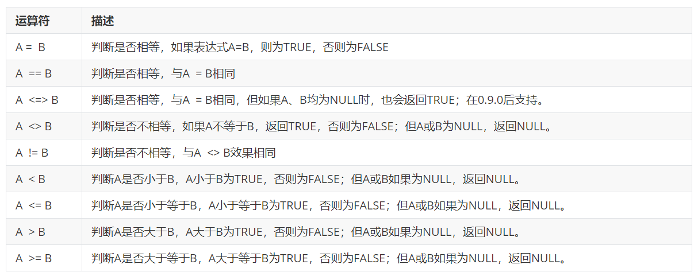


支持的**逻辑运算符**有：


**Having分组过滤**

使用having，可以对Group By产生的分组进行过滤，即在查询结果分组之后，将不符合条件的组过滤掉，且条件中常包含聚合函数。

在SQL中的执行次序为：Where -> Group By -> Having。

```sql
/* Having分组过滤 */SELECT name, avg(age)  FROM <table_name>WHERE reg_date < 20100000GROUP BY level  HAVING BY avg(age) < 30
```

在Having后，和Where一样，支持关系运算符和逻辑运算符的使用。

#### 排序操作

**全局排序Order By**

全局排序，使用Order By来进行，具体语法为：

```sql
SELECT <select_expression>, <select_expression>, ...FROM <table_name>ORDER BY <col_name> [ASC|DESC] [,col_name [ASC|DESC], ...]
```

但在Hive中使用全局排序时，需要注意，Hive会将所有数据交给一个Reduce任务计算，实现查询结果的全局排序。所以如果数据量很大，只有一个Reduce会耗费大量时间。

Hive的适用场景为离线批处理，在执行全量数据计算任务时，一般是不会用到全局排序的。但在数据查询中，全局排序会经常被用到，而Hive不擅长快速的数据查询，所以需要将Hive处理后的数据存放到支持快速查询的产品中，如Presto、Impala、ClickHouse等。术业有专攻，一个产品一定有自己的适用领域，如果用在不合适的场景，会造成资源浪费。

如果在数据处理过程中必须要用到全局排序，则最好使用UDF转换为局部排序。实现思路为：先预估数据范围，假设这里数据范围是0-100，然后在每个Map作业中，使用Partitioner对数据进行自定义分发，0-10的数据分发到一个Reduce中，10-20的到一个Reduce中，依次类推，然后在每个Reduce作业中进行局部排序即可。

但一般而言，对全量数据进行全局排序的场景很少，一般只需要保证查询结果最终有序即可，这时可以先使用子查询得到一个小的结果集，然后再进行排序。

```sql
select * from(select id,count(1) cnt from <table_name> where id!='0' group by user_id) torder by t.cnt;
```

如果是取TOP N的情况，则可以使用子查询，在每个Reduce中进行排序后，各自取得前N个数据，然后再对结果集进行全局排序，最终取得结果。

```sql
-- 从表中获取name长度为TOP10的数据select t.id,t.name from(select id,name  from <table_name>distribute by length(name)  sort by length(name) desc limit 10) torder by length(t.user_name) desc limit 10;
```

这里如果对distribute by不熟悉，在下面的聚合操作中，会有讲到。

**局部排序Sort By**

局部排序，适用Sort By来进行，具体语法为：

```sql
SELECT <select_expression>, <select_expression>, ...FROM <table_name>SORT BY <col_name> [ASC|DESC] [,col_name [ASC|DESC], ...]
```

局部排序的操作，Hive会在每个Reduce任务中对数据进行排序。当启动多个Reduce任务时，Order By输出一个文件且全局有序，Sort By输出多个文件且局部有序。

#### 聚合操作

除了Group By之外，Hive还支持的聚合语法有Distribute By和Cluster By。

Group By是将属于同一组的数据聚合在一起，在底层MapReduce执行过程中，同一组的数据会发送到一个Reduce中；那意味着每个Reduce会包含多组数据，同一组的数据会单独进行聚合运算。

与Group By不同，Distribute By和Cluster By聚合粒度没有Group By那么细，它们仅仅是保证相同的数据分发到一个Reduce中，所以一般在分桶时使用。

**Distribute By**

Distribute By通过哈希取模的方式，将列值相同的数据发送给同一个Reducer任务，实现数据的聚合。通常与Sort By合并使用，实现先聚合后排序，可以指定升序ASC还是降序DESC。但Distribute By必须在Sort By之前。

Distribute By通过哈希取模的方式，将列值相同的数据发送给同一个Reducer任务，实现数据的聚合。通常与Sort By合并使用，实现先聚合后排序，可以指定升序ASC还是降序DESC。但Distribute By必须在Sort By之前。

```sql
SELECT <select_expression>, <select_expression>, ...FROM <table_name>DISTRIBUTE BY <col_list>[SORT BY <col_name> [ASC|DESC] [, col_name [ASC|DESC], ...] ]
```

因为Distribute By可以配合Sort By使用，所以在每个Reduce任务中的数据可以实现更加灵活的局部排序。既可以DISTRIBUTE BY字段进行排序，也可以使用其它字段进行排序。

**Cluster By**

如果Distribute By列和Sort By列完全相同，且按升序排列，那么Cluster By = Distribute By … Sort By。所以Cluster By相对没有Distribute By那么灵活，而且不能自定义排序。

```sql
SELECT <select_expression>, <select_expression>, ...FROM <table_name>CLUSTER BY <col_list>
```

#### JOIN连接

**Join方式**

Hive支持的Join方式有Inner Join和Outer Join，这和标准SQL一致。除此之外，还支持一种特殊的Join：Left Semi-Join。

**Inner Join**

其中，Inner Join是求两张表的交集数据，只有两张表同时拥有的数据，才会被筛选出来。

```sql
SELECT a.* FROM a JOIN b ON (a.id = b.id)
```

**Outer Join**

Outer Join则包含Left Outer join（左外连接）、Right Outer join（右外连接）、Full Outer join（全外连接）。

左外连接会保留左表的全部数据，如果右表中有对应数据，则进行补全，如果没有则填充为NULL。

```sql
SELECT * FROM a Left Outer JOIN b ON (a.id = b.id)
```

右外连接会保留右表的全部数据，如果左表中有对应数据，则进行补全，如果没有则填充为NULL。

```sql
SELECT * FROM a Right Outer JOIN b ON (a.id = b.id)
```

全外连接则会保留两张表的全部数据，两张表中有相同数据，则补全，如果没有则填充为NULL。

```sql
SELECT * FROM a Full Outer JOIN b ON (a.id = b.id)
```

**Left Semi-Join**

Hive中，可以使用左半开连接实现 in / exists 语法，在0.13版本推出IN/NOT IN/EXISTS/NOT EXISTS 语法后，已经不经常使用。

```sql
SELECT a.key, a.valFROM a LEFT SEMI JOIN b ON (a.key = b.key)
```

它的作用是，当a表的key值，存在于（IN 、Exists）b的key值中时，返回a表的数据。效果等同于以下SQL：

```sql
SELECT a.key, a.valueFROM a WHERE a.key in (SELECT b.key FROM B);
```

#### Join优化

**StreamTable**

Hive在执行Join时，默认会将前面的表直接加载到缓存，后面一张表进行stream处理，即shuffle操作。这样可以减少shuffle过程，因为直接加载到缓存中的表，只需要等待后面stream过来的表数据，而不需要进行shuffle，相当于整体减少了一次shuffle过程。

所以在SQL语句中，大表放在join后面，会有很好的优化效果，或者可以直接标注为StreamTable，来指定进行stream的表。

```sql
SELECT&nbsp;/*+ STREAMTABLE(a) */&nbsp;a.val, b.val, c.val FROM a JOIN b ON (a.key = b.key1) JOIN c ON (c.key = b.key1)
```

**MapJoin**

Hive在执行Join时，可以使用MapJoin，将小表直接加载到Map作业中，以减少Shuffle开销。其实效果与stream table一致。都是缓存小表数据的一种方式。

```sql
SELECT&nbsp;/*+ MAPJOIN(b) */&nbsp;a.key, a.valueFROM a JOIN b ON a.key = b.key
```


## 用户自定义函数UDF

**什么是UDF？**

Hive支持的函数除了内置函数，允许编写用户自定义函数（User Define Function）来扩充函数的功能。

用户自定义函数需要使用Java语言进行编写，完成的UDF可以打包成Jar加载到Hive中使用。

UDF根据功能不同，可以分为UDF、UDAF、UDTF。

UDF对每一行数据进行处理，输出相同行数的结果，是一对一的处理方式，比如将每一行字符串转换为大写形式。

UDAF（用户自定义聚合函数），对多行进行处理，输出单个结果，是一对多的处理方式。一般UDAF会配合group by来使用，比如先按照city进行group by操作，然后统计每个city的总人数。

UDTF（用户自定义表生成函数），对一行数据进行处理，输出多个结果，多对一处理方式。比如将每一行字符串按照空格进行拆分，拆分成多行进行存储。使用了UDTF后，表的行数会增多。

#### 用户自定义函数操作

将代码打成Jar包，上传到集群中。可以通过Jar包在Hive中创建临时函数、永久函数。其中临时函数在Hive的生命周期有效，重启Hive后函数失效，而永久函数则永久生效。

临时函数的创建命令：

```sql
ADD JAR[S] <local_or_hdfs_path>;CREATE TEMPORARY FUNCTION <function_name> AS <class_name>;DROP TEMPORARY FUNCTION [IF EXISTS] <function_name>;
```

永久函数的创建命令：

```sql
CREATE PERMANENT FUNCTION <function_name> AS <class_name>[USING JAR|FILE|ARCHIVE '<file_uri>' [, JAR|FILE|ARCHIVE '<file_uri>'] ];DROP PERMANENT FUNCTION [IF EXISTS] <function_name>;
```

函数创建后，可以查看所有函数：`SHOW FUNCTIONS;`

也可以单独查看某个函数的详细情况：`DESCRIBE FUNCTION <function_name>;`

#### UDF编写

创建UDF可以继承org.apache.hadoop.hive.ql.exec.UDF或者org.apache.hadoop.hive.ql.udf.generic. GenericUDF类。其中直接继承UDF类，功能实现较为简单，但在运行时使用Hive反射机制，导致性能有损失，而且不支持复杂类型。GenericUDF则更加灵活，性能也更出色，支持复杂数据类型（List，Struct），但实现较为复杂。

在较新的Hive版本中，org.apache.hadoop.hive.ql.exec.UDF类已经废弃，推荐使用GenericUDF来完成UDF的实现。但org.apache.hadoop.hive.ql.exec.UDF方式实现起来方便，在很多开发者中，依然很受欢迎。

**UDF实现方式一：继承UDF类**

**UDF开发流程**

继承UDF类进行UDF的开发流程是：

1. 继承org.apache.hadoop.hive.ql.exec.UDF类
2. 实现evaluate()方法，在方法中实现一对一的单行转换

**案例描述**

现在来编写3个实际案例的开发，需要实现以下功能：

功能一：将每行数据，转换为小写形式

功能二：传入yyyy-MM-dd hh:mm:ss.SSS形式的时间字符串，返回时间戳（单位毫秒）

功能三：为每一行数据生成一个指定长度的随机字符串作为UUID

**UDF开发：功能一**

功能一的开发相对简单，创建Java类，继承org.apache.hadoop.hive.ql.exec.UDF，然后实现evaluate()方法，因为要将每行数据转换为小写，所以evaluate()方法参数为Text类型，首先进行空值判断，如果不为空，则转换为小写形式并返回。

这些为什么使用Text类型，而不使用String类型呢？其实都可以。只不过Text类型是Hadoop的Writable包装类，进行了序列化实现，可以在Hadoop集群中更方便的进行数据传输，而且Writable对象是可重用的，效率会更高一些。

常见的Hadoop包装类有：

```java
BooleanWritable:标准布尔型数值
ByteWritable:单字节数值
DoubleWritable:双字节数值
FloatWritable:浮点数
IntWritable:整型数
LongWritable:长整型数
Text:使用UTF8格式存储的文本
NullWritable:当<key, value>中的key或value为空时使用
```

在UDF方法前，可以使用注解Description对方法添加描述信息。

功能一的具体实现如下：

```java
import org.apache.hadoop.hive.ql.exec.UDF;
import org.apache.hadoop.hive.ql.exec.Description;
import org.apache.hadoop.io.Text;

@org.apache.hadoop.hive.ql.exec.Description(name = "Lower",
extended = "示例：select Lower(name) from src;",
value = "_FUNC_(col)-将col字段中的每一行字符串数据都转换为小写形式")
public final class Lower extends UDF {
public Text evaluate(final Text s) {
if (s == null) { return null; }
return new Text(s.toString().toLowerCase());
}
}
```

在Test.java中进行测试：

```java
import org.apache.hadoop.io.Text;public class Test {public static void testLower(String in){Lower lower = new Lower();Text res = lower.evaluate(new Text(in));System.out.println(res);}public static void main(String[] args) {testLower("UDF");}}
```

测试通过后，需要先将代码打成Jar包。因为集群中已经有hadoop、hive依赖了，所以需要将代码中的依赖去除。进行源码编译，生成jar包。找到编译好的jar包，并上传到Node03节点的/root目录下。

在beeline中，使用SQL将jar包添加到hive中。

```sql
add jars file:///root/UDFS.jar;
```

通过jar包中的Lower类，创建临时函数udf_lower，当然也可以创建永久函数。在教程中，为了方便起见，之后的函数都会创建为临时函数使用。

```sql
-- 创建临时函数create temporary function udf_lower as "Lower";-- 创建永久函数create permanent function udf_lower as "Lower";
```

函数创建好之后，便可以在SQL中进行调用：

```sql
select udf_lower("UDF");
```

**UDF开发：功能二**

功能二的开发，也相对比较简单，同样创建java类TimeCover，继承org.apache.hadoop.hive.ql.exec.UDF，然后实现evaluate()方法。

在方法中，传入yyyy-MM-dd hh:mm:ss.SSS形式的时间字符串，将返回时间戳（单位毫秒）。具体实现如下：

```java
import org.apache.hadoop.hive.ql.exec.UDF;import org.apache.hadoop.io.Text;import org.apache.hadoop.io.LongWritable;import java.time.LocalDate;import java.time.ZoneId;import java.time.format.DateTimeFormatter;@org.apache.hadoop.hive.ql.exec.Description(name = "TimeCover",extended = "示例：select TimeCover(create_time) from src;",value = "_FUNC_(col)-将col字段中每一行形式为yyyy-MM-dd hh:mm:ss.SSS的时间字符串转换为时间戳")public class TimeCover extends UDF {public LongWritable evaluate(Text time){String dt1 = time.toString().substring(0,time.toString().indexOf("."));String dt2 = time.toString().substring(time.toString().indexOf(".")+1);DateTimeFormatter dtf=DateTimeFormatter.ofPattern("yyyy-MM-dd hh:mm:ss");long millisec;LocalDate date = LocalDate.parse(dt1, dtf);millisec = date.atStartOfDay(ZoneId.systemDefault()).toInstant().toEpochMilli() + Long.parseLong(dt2);LongWritable result = new LongWritable(millisec);return result;}}
```

编写测试方法进行测试：

```java
import org.apache.hadoop.io.LongWritable;import org.apache.hadoop.io.Text;public class Test {private static void testTimeCover(String in){TimeCover timeCover = new TimeCover();LongWritable res = timeCover.evaluate(new Text(in));System.out.println(res.get());}public static void main(String[] args) {testTimeCover("2021-01-17 05:25:30.001");}}
```

打成Jar包，在hive中创建临时函数进行测试。这里需要注意的是，重复添加同名的jar包时需要重启hive。

```sql
add jars file:///root/UDFS.jar;
create temporary function time_cover as "TimeCover";
select time_cover("2021-01-17 05:25:30.001");
```

这里对时间的处理，使用的是DateTimeFormatter类，如果对Java开发比较熟悉的同学应该知道，它是线程安全的。在Hive的UDF开发过程中，一定要避免线程非安全类的使用，如SimpleDateFormat。线程非安全类的使用，在分布式环境中运行时会带来很多问题，产生错误的运行结果，而且不会产生报错，因为不是程序本身的问题；这种情况非常不好进行排查，在本地测试时正常，在集群中会出问题，所以在开发时一定要有这个意识。

**UDF开发：功能三**

功能三的需求是：为每一行数据生成一个指定长度的随机字符串作为UUID，这和前面两个UDF有所区别。前两个UDF是将某一个字段作为参数，将这一列的每一行数据进行了转换；而功能三则是传入一个指定数值，新生成一列数据。如select UUID(32) from src，传入参数32，为每一行数据新生成了一个32位长度的随机字符串。

代码实现起来相对简单，具体实现如下：

```sql
import org.apache.hadoop.hive.ql.exec.UDF;
import org.apache.hadoop.hive.ql.udf.UDFType;
import org.apache.hadoop.io.IntWritable;
import org.apache.hadoop.io.Text;

/*
生成一个指定长度的随机字符串(最长为36位)
*/
@org.apache.hadoop.hive.ql.exec.Description(name = "UUID",
extended = "示例：select UUID(32) from src;",
value = "_FUNC_(leng)-生成一个指定长度的随机字符串(最长为36位)")
@UDFType(deterministic = false)
public class UUID extends UDF {
public Text evaluate(IntWritable leng) {
String uuid = java.util.UUID.randomUUID().toString();
int le = leng.get();
le = le > uuid.length() ? uuid.length() : le;
return new Text(uuid.substring(0, le));
}
}
```

编写测试方法进行测试：

```java
import org.apache.hadoop.io.IntWritable;
import org.apache.hadoop.io.LongWritable;
import org.apache.hadoop.io.Text;

public class Test {
private static void testUUID(int in){
UUID uuid = new UUID();
Text res = uuid.evaluate(new IntWritable(in));
System.out.println(res);
}

public static void main(String[] args) {
testUUID(10);
}
}
```

打成Jar包，在hive中创建临时函数进行测试。

```sql
add jars file:///root/UDFS.jar;create temporary function uuid as "UUID";select uuid(10);
```

**UDF开发注意事项**

继承UDF类进行开发时，默认调用evaluate()方法；当然也可以继承UDFMethodResolver类，更改默认的入口方法。

现在已经实现的三个UDF功能都进行了数据的返回，如果需要evaluate()不返回数据的，可以返回null，比如数据清洗的时候会用到这种场景。对于UDF的返回类型可以是Java类型或者Writable类，当然推荐Writable包装类。

**UDF实现方式二：继承GenericUDF类**

继承org.apache.hadoop.hive.ql.udf.generic. GenericUDF类进行UDF的开发，是社区推荐的写法。它能处理复杂类型数据，而且相对于UDF类来说，更加灵活。但实现起来会稍微复杂一些。

**开发流程**

使用GenericUDF进行UDF开发的具体流程为：

1. 继承org.apache.hadoop.hive.ql.udf.generic. GenericUDF类
2. 实现initialize、 evaluate、 getDisplayString方法

重写的这三个方法，它们各自完成的功能如下：


**GenericUDF实际案例**

现在，完成一个UDF的开发案例来进行实践。这个案例中，将会对复杂数据类型Map进行处理。

在表中，学生的成绩字段数据以Map类型进行保存：

```sql
{"computer":68, "chinese": 95, "math": 86, "english": 78}
```

现在，需要开发UDF，对每个学生的成绩进行平均值的计算。即对每一行保存的Map数据进行提取，获取到成绩后（68、95、86、78），完成平均值的计算( ( 68+95+86+78 ) / 4 )，返回结果。精度要求为：保留两位小数。

首先导入相关包，继承GenericUDF，并重写它的三个方法：

```java
import org.apache.hadoop.hive.ql.exec.UDFArgumentException;import org.apache.hadoop.hive.ql.exec.UDFArgumentTypeException;import org.apache.hadoop.hive.ql.metadata.HiveException;import org.apache.hadoop.hive.ql.udf.generic.GenericUDF;import org.apache.hadoop.hive.serde2.objectinspector.MapObjectInspector;import org.apache.hadoop.hive.serde2.objectinspector.ObjectInspector;import org.apache.hadoop.hive.serde2.objectinspector.primitive.PrimitiveObjectInspectorFactory;import java.text.DecimalFormat;@org.apache.hadoop.hive.ql.exec.Description(name = "AvgScore",extended = "示例：select AvgScore(score) from src;",value = "_FUNC_(col)-对Map类型保存的学生成绩进行平均值计算")public class AvgScore extends GenericUDF {@Overridepublic ObjectInspector initialize(ObjectInspector[] objectInspectors) throws UDFArgumentException {…}@Overridepublic Object evaluate(DeferredObject[] deferredObjects) throws HiveException {…}@Overridepublic String getDisplayString(String[] strings) {…}}
```

在AvgScore类中，需要定义类属性，用于保存基本信息。这里定义的UDF的名称和返回值精度，还包含一个参数解析类MapObjectInspector的对象。因为GenericUDF通过参数解析对象来对传入数据进行解析、转换，所以它比直接继承UDF类有更好的灵活性，支持对各种复杂类型数据的处理。

```java
@org.apache.hadoop.hive.ql.exec.Description(name = "AvgScore",extended = "示例：select AvgScore(score) from src;",value = "_FUNC_(col)-对Map类型保存的学生成绩进行平均值计算")public class AvgScore extends GenericUDF {// UDF名称private static final String FUNC_NAME="AVG_SCORE";// 参数解析对象private transient MapObjectInspector mapOi;// 返回值精度DecimalFormat df = new DecimalFormat("#.##");@Overridepublic ObjectInspector initialize(ObjectInspector[] objectInspectors) throws UDFArgumentException {…}@Overridepublic Object evaluate(DeferredObject[] deferredObjects) throws HiveException {…}@Overridepublic String getDisplayString(String[] strings) {…}}
```

然后重写initialize方法，进行参数个数、类型检测，并初始化数据解析对象，定义UDF最终的返回值类型。

initialize方法中的形参ObjectInspector[] []列表长度为1，其中ObjectInspector对象包含了成绩字段的数据以及它的参数个数、类型等属性。

在方法中，需要对参数进行数据类型检测。GenericUDF支持的数据类型在ObjectInspector.Category中进行了定义。包含基础数据类型：PRIMITIVE，复杂数据类型： LIST, MAP, STRUCT, UNION。

除此之外，还需要初始化用于数据解析的ObjectInspector对象，指定解析的数据类型。提供的数据解析类有PrimitiveObjectInspector、ListObjectInspector、MapObjectInsector、StructObjectInsector等。

initialize函数需要在return时返回UDF最终输出的数据类型，这里因为是对成绩的平均值计算，所以最终结果为Double类型，返回javaDoubleObjectInspector。

initialize函数其实完成的就是定义了数据的输入和输出，并完成了数据类型、个数的稽查。

```java
@Overridepublic ObjectInspector initialize(ObjectInspector[] objectInspectors) throws UDFArgumentException {// 检测函数参数个数if (objectInspectors.length != 1) {throw new UDFArgumentException("The function AVG_SCORE accepts only 1 arguments.");}// 检测函数参数类型，提供的类型有PRIMITIVE, LIST, MAP, STRUCT, UNIONif (!(objectInspectors[0].getCategory().equals(ObjectInspector.Category.MAP))) {throw new UDFArgumentTypeException(0, "\"map\" expected at function AVG_SCORE, but \""+ objectInspectors[0].getTypeName() + "\" " + "is found");}// 初始化用于数据解析的ObjectInspector对象// 提供的类有PrimitiveObjectInspector、ListObjectInspector、MapObjectInsector、StructObjectInsector等mapOi = (MapObjectInspector) objectInspectors[0];// 定义UDF函数输出结果的数据类型return PrimitiveObjectInspectorFactory.javaDoubleObjectInspector;}
```

接着，需要重写evaluate方法，使用数据解析对象进行数据解析，并求取平均值。

```java
@Overridepublic Object evaluate(DeferredObject[] deferredObjects) throws HiveException {// 获取输入数据Object o = deferredObjects[0].get();// 数据交由ObjectInspector对象进行解析，并进行处理double v = mapOi.getMap(o).values().stream().mapToDouble(a -> Double.parseDouble(a.toString())).average().orElse(0.0);// 返回运算结果,结果数据类型在initialize中已经定义return Double.parseDouble(df.format(v));}
```

最后，重写getDisplayString方法，完成字符串信息的输出。

```java
@Overridepublic String getDisplayString(String[] strings) {// 函数在进行HQL explain解析时,展示的字符串内容return "func(map)";}
```

打包成jar，在hive中创建临时函数。

```sql
add jars file:///root/UDFS.jar;create temporary function avg_score as "AvgScore";
```

创建测试数据score.txt，并上传到HDFS的/tmp/hive*data*score目录下：

```sh
# 数据文件内容1,zs,computer:68-chinese:95-math:86-english:782,ls,computer:80-chinese:91-math:56-english:873,ww,computer:58-chinese:68-math:35-english:184,zl,computer:97-chinese:95-math:98-english:945,gg,computer:60-chinese:60-math:60-english:60# 上传到HDFS中hadoop fs -mkdir -p /tmp/hive_data/scorehadoop fs -put score.txt /tmp/hive_data/score/
```

在Hive中创建测试需要的数据表：

```sql
create external table score(id int, name string, score map<string, double>)ROW FORMAT DELIMITEDFIELDS TERMINATED BY ','COLLECTION ITEMS TERMINATED BY '-'MAP KEYS TERMINATED BY ':'LINES TERMINATED BY '\n'LOCATION '/tmp/hive_data/score/';
```

使用UDF函数统计平均成绩：

```sql
select name, avg_score(score) from score;
```


## 用户自定义函数UDAF

#### UDAF的创建与实现

Hive UDAF有两种实现方式，可以继承UDAF或者AbstractGenericUDAFResolver类，也可以实现GenericUDAFResolver2接口。

其中直接继承UDAF类，功能实现较为简单，但在运行时使用Hive反射机制，导致性能有损失。

在较新版本中org.apache.hadoop.hive.ql.exec.UDAF类已经废弃，但因为其实现方便，在很多开发者中较为流行。

通过AbstractGenericUDAFResolver和GenericUDAFResolver2实现UDAF，更加灵活，性能也更出色，是社区推荐的写法。

而AbstractGenericUDAFResolver是GenericUDAFResolver2接口的实现类，所以一般建议直接继承AbstractGenericUDAFResolver类进行UDAF的编写。

#### UDAF实现方式一：继承UDAF类

**UDAF开发流程**

继承UDAF类进行UDAF的开发流程是：

1. 继承org.apache.hadoop.hive.ql.exec.UDAF类
2. 以静态内部类方式实现org.apache.hadoop.hive.ql.exec.UDAFEvaluator接口
3. 实现接口中的init、iterate、terminatePartial、merge、terminate方法

其中UDAFEvaluator接口中的方法具体描述为：


这些方法会在Map、Reduce的不同阶段进行调用执行，首先会执行init方法进行全局初始化，然后Map节点调用iterate方法对数据进行处理，处理结果由terminatePartial 方法返回；如果Map阶段设置了Combiner部分聚合功能，则返回的数据继续交由iterate进行处理，处理结果再由terminatePartial 方法返回。

Reduce节点获取到数据后，执行merge方法对结果进行汇总计算，计算的最终结果会由terminate 方法进行返回。

**案例描述**

现在通过一个案例，来进行UDAF开发实践。

具体要求为：对传入的数字列表，按照数字大小进行排序后，找出最大的并返回。其实就是在实现内置函数max的功能。

**UDAF开发**

案例内容相对简单，首先创建Java类MaxInt，继承org.apache.hadoop.hive.ql.exec.UDAF，以静态内部类方式实现org.apache.hadoop.hive.ql.exec.UDAFEvaluator接口，重写接口方法。

首先，在静态内部类MaxiNumberIntUDAFEvaluator中定义成员变量result用于结果的保存。然后在init方法中，对result变量进行初始化，这里直接赋值为null。

然后在iterate方法中，对传入的每一行数据与result变量进行比较，取最大值进行保存。terminatePartial方法直接返回result结果即可。

merge方法在这里不需要进行额外逻辑的编写，直接调用iterate方法在reduce端完成最大值的寻找即可。最后terminate返回result，即最终结果。

代码的具体实现如下：

```java
import org.apache.hadoop.hive.ql.exec.UDAF;import org.apache.hadoop.hive.ql.exec.UDAFEvaluator;import org.apache.hadoop.io.IntWritable;@org.apache.hadoop.hive.ql.exec.Description(name = "MaxInt",extended = "示例：select MaxInt(col) from src;",value = "_FUNC_(col)-将col字段中寻找最大值，并返回")public class MaxInt extends UDAF {public  static  class MaxiNumberIntUDAFEvaluator implements UDAFEvaluator{private IntWritable result;public void init() {result = null;}public boolean iterate(IntWritable value){if (value == null){return false;}if (result == null){result = new IntWritable(value.get());}else {result.set(Math.max(result.get(),value.get()));}return true;}public IntWritable terminatePartial(){return result;}public boolean merge(IntWritable other){return iterate(other);}public IntWritable terminate(){return result;}}}
```

打成Jar包，在hive中创建临时函数进行测试。

```sh
add jars file:///root/UDFS.jar;create temporary function max_int as "MaxInt";
```

创建测试表city_score，并写入测试数据。

```sql
create table city_score(id int, province string, city string, score int);insert into city_score values (1, "GuangDong", "GuangZhou", 95),(2, "GuangDong", "ShenZhen", 90),(3, "GuangDong", "DongGuan", 85);
```

使用udaf函数统计最大值：`select max_int(score) from city_score;`

#### UDAF实现方式二：继承AbstractGenericUDAFResolver类

继承org.apache.hadoop.hive.ql.udf.generic.GenericUDAFEvaluator.AbstractGenericUDAFResolver类进行UDAF的开发，是社区推荐的写法。相对于直接继承UDAF，实现方式更加灵活，性能更优，支持处理复杂数据。但实现起来会稍微复杂一些。

**开发流程**

使用AbstractGenericUDAFResolver进行UDAF开发的具体流程为：

1. 继承AbstractAggregationBuffer类，用于保存中间结果
2. 新建类，继承GenericUDAFEvaluator，实现UDAF处理流程
3. 新建类，继承AbstractGenericUDAFResolver，注册UDAF

这里用到的多个类，在用户自定义函数开发中，UDAF的实现最为复杂。其实也比较好理解，AbstractGenericUDAFResolver继承类用于注册UDAF；而UDAF的处理流程实现，使用GenericUDAFEvaluator的继承类完成；在处理流程中使用AbstractAggregationBuffer类的集成类进行中间结果的保存。

首先，对于AbstractGenericUDAFResolver类，需要重写getEvaluator方法，根据根据SQL传入的参数类型，返回正确的GenericUDAFEvaluator对象。而GenericUDAFEvaluator对象，则是UDAF的逻辑实现。


GenericUDAFEvaluator的继承类，需要重写6个方法，这些方法的具体说明如下：


其实除了getNewAggregationBuffer，用于获取存放中间结果的AggregationBuffer对象之外，其它方法与UDAF类是一致的。

但init方法承担了更多的职责，和GenericUDF一样，它需要完成解析器的初始化，并定义返回值类型。 而且因为在mapreduce处理的不同阶段，UDAF传入的数据会有不同的区分，比如Map阶段传入的数据可能为String类型，而Reduce聚合时仅需要的是Double类型，所以init方法要区分不同的阶段，从而生成不同的解析器。

如何区分不同的阶段呢？GenericUDAFEvaluator.Model类中定义了这些阶段：


在init方法中，根据不同的阶段，生成不同的解析器即可。其余方法的实现，基本与UDAF方式一致；只是中间结果的保存，使用了AggregationBuffer对象，需要使用getNewAggregationBuffer方法进行返回。

AggregationBuffer类随着需要保存的中间结果的不同，需要自行继承实现。在继承类中定义变量，用于保存中间结果，可以自行添加get、set、add方法，也可以重写estimate方法，用于缓冲区大小。


缓冲区的大小，可以使用org.apache.hadoop.hive.ql.util.JavaDataModel中定义的常量来进行设置。


#### GenericUDF实际案例

现在，完成一个UDAF的开发案例来进行实践。这个案例中，需要计算每个省份下的城市名字符串总长度。

在表中，包含两个字段：Province省份、City城市。


对Province省份进行Group By操作后，统计每个省份下所有City城市名字符串的 总长度，结果如下：


首先定义AbstractAggregationBuffer继承类，用于保存计算结果。

```java
import org.apache.hadoop.hive.ql.udf.generic.GenericUDAFEvaluator;import org.apache.hadoop.hive.ql.util.JavaDataModel;public class FieldLengthAggregationBuffer extends GenericUDAFEvaluator.AbstractAggregationBuffer {private Integer value = 0;public Integer getValue() {return value;}public void setValue(Integer value) {this.value = value;}public void add(int addValue) {synchronized (value) {value += addValue;}}@Overridepublic int estimate() {return JavaDataModel.PRIMITIVES1;}}
```

这里主要定义了Integer类型的成员变量value用于结果的保存，然后设置了get、set、add方法，重写了estimate设置缓冲区的大小。因为Integer类型，所以，只需要4byte大小的JavaDataModel.PRIMITIVES1即可。

然后定义GenericUDAFEvaluator的继承类FieldLengthUDAFEvaluator，用于实现UDAF计算逻辑：

```java
import org.apache.hadoop.hive.ql.metadata.HiveException;import org.apache.hadoop.hive.ql.udf.generic.GenericUDAFEvaluator;import org.apache.hadoop.hive.serde2.objectinspector.ObjectInspector;import org.apache.hadoop.hive.serde2.objectinspector.ObjectInspectorFactory;import org.apache.hadoop.hive.serde2.objectinspector.PrimitiveObjectInspector;public class FieldLengthUDAFEvaluator extends GenericUDAFEvaluator {@Overridepublic ObjectInspector init(Mode m, ObjectInspector[] parameters) throws HiveException {…}@Overridepublic AggregationBuffer getNewAggregationBuffer() throws HiveException {…}@Overridepublic void reset(AggregationBuffer agg) throws HiveException {…}@Overridepublic void iterate(AggregationBuffer agg, Object[] parameters) throws HiveException {…}@Overridepublic Object terminatePartial(AggregationBuffer agg) throws HiveException {…}@Overridepublic void merge(AggregationBuffer agg, Object partial) throws HiveException {…}@Overridepublic Object terminate(AggregationBuffer agg) throws HiveException {…}}
```

在GenericUDAFEvaluator继承类中首先需要定义成员变量，确定数据的输入、输出类型。

```java
public class FieldLengthUDAFEvaluator extends GenericUDAFEvaluator {PrimitiveObjectInspector inputOI;ObjectInspector outputOI;PrimitiveObjectInspector integerOI;}
```

在类中，首先重写init方法，初始化输入、输出的数据类型。这里因为UDAF的不同，需要根据Mode m的不同，来初始化不同的输入、输出解析器。

```java
@Overridepublic ObjectInspector init(Mode m, ObjectInspector[] parameters) throws HiveException {super.init(m, parameters);// COMPLETE或者PARTIAL1，输入的都是数据库的原始数据if(Mode.PARTIAL1.equals(m) || Mode.COMPLETE.equals(m)) {inputOI = (PrimitiveObjectInspector) parameters[0];} else {// PARTIAL2和FINAL阶段，都是基于前一个阶段init返回值作为parameters入参integerOI = (PrimitiveObjectInspector) parameters[0];}outputOI = ObjectInspectorFactory.getReflectionObjectInspector(Integer.class,ObjectInspectorFactory.ObjectInspectorOptions.JAVA);// 给下一个阶段用的，即告诉下一个阶段，自己输出数据的类型return outputOI;}
```

然后，重写getNewAggregationBuffer方法，获取存放中间结果的对象，直接返回FieldLengthAggregationBuffer对象即可。

```java
public AggregationBuffer getNewAggregationBuffer() throws HiveException {return new FieldLengthAggregationBuffer();}
```

重写reset方法，用于UDAF重置，这里只需要将中间结果设置为0即可：

```java
public void reset(AggregationBuffer agg) throws HiveException {((FieldLengthAggregationBuffer)agg).setValue(0);}
```

重写iterate，在map端对数据进行聚合运算：

```java
public void iterate(AggregationBuffer agg, Object[] parameters) throws HiveException {if(null==parameters || parameters.length<1) {return;}Object javaObj = inputOI.getPrimitiveJavaObject(parameters[0]);((FieldLengthAggregationBuffer)agg).add(String.valueOf(javaObj).length());}
```

重写terminatePartial，返回map、combiner部分聚合结果：

```java
public Object terminatePartial(AggregationBuffer agg) throws HiveException {return terminate(agg);}
```

重写merge方法，在combiner、reduce阶段对部分结果进行汇总：

```java
public void merge(AggregationBuffer agg, Object partial) throws HiveException {((FieldLengthAggregationBuffer) agg).add((Integer)integerOI.getPrimitiveJavaObject(partial));}
```

重写terminate，将最终运算结果返回：

```java
public Object terminate(AggregationBuffer agg) throws HiveException {return ((FieldLengthAggregationBuffer)agg).getValue();}
```

GenericUDAFEvaluator继承类实现UDAF计算逻辑后，就需要编写AbstractGenericUDAFResolver实现类，实例化Evaluator实现类，注册成UDAF进行使用：

```java
import org.apache.hadoop.hive.ql.parse.SemanticException;import org.apache.hadoop.hive.ql.udf.generic.AbstractGenericUDAFResolver;import org.apache.hadoop.hive.ql.udf.generic.GenericUDAFEvaluator;import org.apache.hadoop.hive.ql.udf.generic.GenericUDAFParameterInfo;import org.apache.hadoop.hive.serde2.typeinfo.TypeInfo;@org.apache.hadoop.hive.ql.exec.Description(name = "FieldLength",extended = "示例：select FieldLength(city) from src group by province;",value = "_FUNC_(col)-将统计当前组中数据的总字符串长度，并返回")public class FieldLength extends AbstractGenericUDAFResolver {@Overridepublic GenericUDAFEvaluator getEvaluator(GenericUDAFParameterInfo info) throws SemanticException {return new FieldLengthUDAFEvaluator();}@Overridepublic GenericUDAFEvaluator getEvaluator(TypeInfo[] info) throws SemanticException {return new FieldLengthUDAFEvaluator();}}
```

打成Jar包，在hive中创建临时函数进行测试。

```java
add jars file:///root/UDFS.jar;create temporary function field_length as "FieldLength";
```

使用udaf函数统计最大值：

```sql
select field_length(city) from city_score group by province;
```


## 用户自定义函数UDTF

#### UDTF开发要点

Hive UDTF只有一种实现方式，需要继承org.apache.hadoop.hive.ql.udf.generic.GenericUDTF类，并重写initialize, process, close三个方法。

这三个方法的具体描述为：


因为UDTF是将一行数据拆分为多行，所以在处理过程中按照一定规则拆分出的每一行数据，在遍历过程中，会交由forward方法传递给收集器，从而完成多行数据的生成。

#### UDTF开发案例

**字符串拆分**

案例描述：

现在通过一个案例，来进行UDTF开发实践。

具体要求为：实现个人信息的字符串拆分，拆分为多行，并解析成name、age字段。

案例数据为：


其中每行输入数据包含多条个人信息，由#进行分隔，个人信息中name、age使用:分隔。

最终的计算结果为：


**UDTF开发**

案例内容相对简单，首先创建Java类StringSpilt，继承org.apache.hadoop.hive.ql.udf.generic.GenericUDTF，重写initialize, process, close三个方法。

```java
import org.apache.hadoop.hive.ql.exec.UDFArgumentException;
import org.apache.hadoop.hive.ql.metadata.HiveException;
import org.apache.hadoop.hive.ql.udf.generic.GenericUDTF;
import org.apache.hadoop.hive.serde2.objectinspector.ObjectInspector;
import org.apache.hadoop.hive.serde2.objectinspector.ObjectInspectorFactory;
import org.apache.hadoop.hive.serde2.objectinspector.PrimitiveObjectInspector;
import org.apache.hadoop.hive.serde2.objectinspector.StructObjectInspector;
import org.apache.hadoop.hive.serde2.objectinspector.primitive.PrimitiveObjectInspectorFactory;
import java.util.ArrayList;

@org.apache.hadoop.hive.ql.exec.Description(name = "StringSpilt",
extended = "示例：select StringSpilt(info) from src;",
value = "_FUNC_(col)-将col字段值先按照#进行拆分，然后再使用:将每个子串拆分为name、age两个字段值")
public class StringSpilt extends GenericUDTF {
@Override
public StructObjectInspector initialize(ObjectInspector[] objectInspectors) throws UDFArgumentException {...}
@Override
public void process(Object[] record) throws HiveException {...}
@Override
public void close() {...}
}
```

类创建好之后，先将解析器设置为类属性。

```java
private PrimitiveObjectInspector stringOI = null;
```

然后，重写initiable方法，进行参数检查，解析器初始化，并定义UDTF的返回值类型。

```java
@Override
public StructObjectInspector initialize(ObjectInspector[] objectInspectors) throws UDFArgumentException {
if (objectInspectors.length != 1)
{
throw new UDFArgumentException("SplitString only takes one argument");
}
if (objectInspectors[0].getCategory() != ObjectInspector.Category.PRIMITIVE)
{
throw new UDFArgumentException("SplitString only takes String as a parameter");
}
stringOI = (PrimitiveObjectInspector) objectInspectors[0];
ArrayList<String> fieldNames = new ArrayList<String>();
ArrayList<ObjectInspector> fieldOIs = new ArrayList<ObjectInspector>();
fieldNames.add("name");
fieldNames.add("age");
fieldOIs.add(PrimitiveObjectInspectorFactory.javaStringObjectInspector);
fieldOIs.add(PrimitiveObjectInspectorFactory.javaStringObjectInspector);

return ObjectInspectorFactory.getStandardStructObjectInspector(fieldNames,fieldOIs);
}
```

在initiable方法中，定义返回值时需要注意；因为案例要求返回两列，所以返回值使用getStandardStructObjectInspector方法返回结构体类型。方法需要传入两个参数，均为List类型，第一个List中定义每一列的列名，这里即为name、age，第二个List中则对应每一列的数据类型，案例中两列均为String类型，但这里需要封装为javaStringObjectInspector。

接下来重写process方法，进行具体的数据处理过程：

```java
@Override
public void process(Object[] record) throws HiveException {
final String input = stringOI.getPrimitiveJavaObject(record[0]).toString();
String[] inputSplits = input.split("#");
for (int i = 0; i < inputSplits.length; i++) {
try{
String[] result = inputSplits[i].split(":");
forward(result);
}catch (Exception e){
continue;
}
}
}
```

这里处理过程比较简单，直接按照#对数据进行切分，遍历切分后的数据，再继续对数据按照:切分，解析为name、age。输出类型因为在initiable方法中已经定义，拆分为2列进行存储，所以需要将解析后的数据保存为String数组，使用forward方法进行返回。

于是String数组中的第一个值会保存到name字段中，第二个值则保存到age字段中。

最后重写close方法，进行清理工作，因为本身案例比较简单，没有使用额外资源，所以这部分代码留空。

```java
@Override
public void close() {
}
```

打成Jar包，上传到/root/目录下，在hive中创建临时函数进行测试。

```sql
add jars file:///root/UDFS.jar;create temporary function str_split as "StringSpilt";
```

创建测试表log_info，并写入测试数据。

```sql
create table log_info(id int, log string);insert into log_info values (1, "ZhangSan:18#LiSi:20#WangWu:30"),(2, "LiBai:18#DuFu:20");
```

使用udtf函数对字符串进行拆分：

```sql
select str_split(log) from log_info;
```

#### JSON解析

案例描述：

在第一个案例的字符串解析基础上，增加一些难度，进行JSON的解析开发。

具体要求为：将JSON字符串中的多个(key，value)对拆分成多行进行存储，每行的(key，value)数据解析成name、value两个字段进行保存。

案例数据为：


将每行的JSON最终的计算结果为：


当然，现在这个案例没有实用价值，只是对JSON字符串做了简单解析、拆分，在理解代码的基础上，体会UDTF的开发流程。

**UDTF开发**

有了第一个案例的基础，实现起来其实也比较简单，主要是JSON解析这里，需要单独封装一个方法来进行。首先创建Java类JsonParse，继承org.apache.hadoop.hive.ql.udf.generic.GenericUDTF，重写initialize, process, close三个方法。

```java
import org.apache.hadoop.hive.ql.exec.UDFArgumentException;import org.apache.hadoop.hive.ql.metadata.HiveException;import org.apache.hadoop.hive.ql.udf.generic.GenericUDTF;import org.apache.hadoop.hive.serde2.objectinspector.ObjectInspector;import org.apache.hadoop.hive.serde2.objectinspector.ObjectInspectorFactory;import org.apache.hadoop.hive.serde2.objectinspector.PrimitiveObjectInspector;import org.apache.hadoop.hive.serde2.objectinspector.StructObjectInspector;import org.apache.hadoop.hive.serde2.objectinspector.primitive.PrimitiveObjectInspectorFactory;import org.json.JSONObject;import org.mortbay.util.ajax.JSON;import java.util.ArrayList;import java.util.Iterator;import java.util.List;public class JsonParse extends GenericUDTF {@Overridepublic StructObjectInspector initialize(ObjectInspector[] objectInspectors) throws UDFArgumentException {...}@Overridepublic void process(Object[] record) throws HiveException {...}@Overridepublic void close() {...}}
```

类创建好之后，先将解析器设置为类属性。

```java
private PrimitiveObjectInspector stringOI = null;
```

然后，重写initiable方法，进行参数检查，解析器初始化，并定义UDTF的返回值类型。

```java
@Overridepublic StructObjectInspector initialize(ObjectInspector[] objectInspectors) throws UDFArgumentException {if (objectInspectors.length != 1) {throw new UDFArgumentException("NameParserGenericUDTF() takes exactly one argument");}if (objectInspectors[0].getCategory() != ObjectInspector.Category.PRIMITIVE &&((PrimitiveObjectInspector) objectInspectors[0]).getPrimitiveCategory() != PrimitiveObjectInspector.PrimitiveCategory.STRING) {throw new UDFArgumentException("NameParserGenericUDTF() takes a string as a parameter");}//初始化输入解析器stringOI = (PrimitiveObjectInspector) objectInspectors[0];//初始化输出解析器List<String> fieldNames = new ArrayList<String>(2);List<ObjectInspector> fieldOIs = new ArrayList<ObjectInspector>(2);// 输出列名fieldNames.add("name");fieldNames.add("value");fieldOIs.add(PrimitiveObjectInspectorFactory.javaStringObjectInspector);fieldOIs.add(PrimitiveObjectInspectorFactory.javaStringObjectInspector);return ObjectInspectorFactory.getStandardStructObjectInspector(fieldNames, fieldOIs);}
```

接下来就需要新增JSON解析方法，完成JSON的解析：

```java
private ArrayList<Object[]> parseInputRecord(String feature) {ArrayList<Object[]> resultList = null;if (feature != null && feature.startsWith("\ufeff")) {feature = feature.substring(1);}try {JSONObject json = new JSONObject(feature);resultList = new ArrayList<Object[]>();for (String key : json.keySet()) {Object[] item = new Object[2];item[0] = key;item[1] = json.get(key);resultList.add(item);}} catch (Exception e) {e.printStackTrace();}return resultList;}
```

这里将JSON解析成一个List集合，List中的每个元素都是一个数组item，其中item[0] [1]存储value值。

然后重写process方法，完成Json数据的处理过程：

```java
@Overridepublic void process(Object[] record) throws HiveException {final String feature = stringOI.getPrimitiveJavaObject(record[0]).toString();ArrayList<Object[]> results = parseInputRecord(feature);Iterator<Object[]> it = results.iterator();while (it.hasNext()) {Object[] r = it.next();forward(r);}}
```

这里处理过程比较简单，直接调用parseInputRecord方法，解析完成JSON后，得到存储所有（Key，Value）对的List集合。

然后遍历List集合，将每个Key，Value取出，然后使用forward进行返回。

每次遍历，会新生成一行数据，其中key值会保存到name字段中，value值则保存到value字段中。

最后重写close方法，进行清理工作，因为本身案例比较简单，没有使用额外资源，所以这部分代码留空。

```java
@Overridepublic void close() throws HiveException {}
```

打成Jar包，上传到/root/目录下，在hive中创建临时函数进行测试。

```sql
add jars file:///root/UDFS.jar;create temporary function json_parse as "JsonParse";
```

创建测试表json_info，并写入测试数据。

```sql
create table json_info(id int, json string);insert into json_info values (1, '{"name":"LiBai","age":30,"hobby":"drink"}'),(2, '{"name":"DuFu","age":28,"hobby":"play"}');
```

使用udtf函数对字符串进行拆分：

```sql
select json_parse(json) from json_info;
```


## 常见内置函数

Hive支持的函数有：普通内置函数、内置聚合函数（UDAF）、内置表生成函数（UDTF）。接下来，会对这些函数进行讲解。

可以使用SQL命令查看支持的所有函数：`SHOW FUNCTIONS;`。

使用DESC命令可以查看函数的具体描述信息：`DESC FUNCTION EXTENDED concat;`。

#### 普通内置函数

普通内置函数，在对数据处理时，进行一对一的数据转换。对每一行数据处理后，生成新的一行数据。

普通内置函数包含：数学运算函数、集合函数、类型转换函数、日期函数、条件函数、字符串函数、数据屏蔽函数、其它混合函数。

**数学运算函数**

Hive支持对数字类型的列（Int、Double、DECIMAL ）使用数学运算函数进行运算。

```sql
-- 对salary列进行四舍五入运算select round(salary) as costs from <table_name>;-- 对salary列求绝对值select abs(salary) as costs from <table_name>;-- 将salary列转换为二进制类型select bin(salary) as costs from <table_name>;
```

Hive官网目前支持的数学运算函数（2020年12月10日，参考最新的官方文档，进行翻译和简化）有：


这里需要注意的是，Hive在0.13.0版本后才增加Decimal类型，所以在此之后，很多函数也对Decimal类型进行了支持。对于数字类型的列，除了使用函数之外，一般也会使用算数运算符进行操作。支持的算数运算符请见上一节数据查询。

函数列表仅作为参考使用，大家一次性不可能记住所有函数的用法，大致浏览一下留个印象即可，之后使用时进行速查即可。官方支持的函数翻译工作进行了大概一周时间，[hive文档链接](https://cwiki.apache.org/confluence/display/Hive/LanguageManual+UDF#LanguageManualUDF-Built-inFunctions)，因为文档对很多函数的作用描述不清，查阅了很多资料。翻译后的文档，大家翻阅起来会更友好一些。

**集合函数**

Hive支持对集合数据类型进行函数操作，但整体来说功能比较少，主要是对集合类型的元素查询操作。


**类型转换函数**

目前Hive仅支持两个类型转换函数，binary和cast。其中cast函数较为通用，可以将符合要求的数据转换为任意类型。


```sql
select
cast("123" as double),
cast("456.78" as int),
cast("1.99" as int),
cast("abc" as int)
;
-- 运行结果
123.0,    456,    1,    NULL
```

**日期函数**

对于日期的转换，Hive提供的函数比较多。可以对时间字符串数据进行操作。Hive时间字符串标准为‘yyyy-MM-dd' 或 'yyyy-MM-dd HH:mm:ss'。当然在2.1.0版本增加Date数据类型后，相应的一些函数也逐渐开始支持Date类型。


**条件函数**

Hive支持对数据进行条件判断，以便支持数据清洗、去重等场景的应用。支持的条件函数有：


条件函数在数据处理过程中会经常使用。

其中if函数，可以根据条件改变数据的返回值。条件语句中可以使用比较运算符、逻辑运算符，也可以使用isnull、isnotnull等条件函数。

```sql
select if(case companyid=0, '未登录’ , companyid) from <table_name>;
```

当然case when也可以实现与if相同的功能，但它能嵌套的条件判断更多。

case when有两种使用方法：

```sql
-- 写法一，当a=b时返回c，a=d时返回e，否则返回f
CASE a WHEN b THEN c [WHEN d THEN e]* [ELSE f] END
-- 写法二，当a=true返回b，当c=true返回d，否则返回e
CASE WHEN a THEN b [WHEN c THEN d]* [ELSE e] END
```

实际使用时，根据使用习惯选择一种即可：

```sql
select case companyid when 0 then '未登录' else companyid end from <table_name>;
select case  when companyid=0 then '未登录' else companyid end from <table_name>;
```

**字符串函数**

Hive内置的字符串处理函数非常之多。一般而言，在进行数据处理时，字符串类型的数据会占大多数。


常用的字符串处理函数有：

```sql
-- length：求字符串长度
select length('abcd');  -- result: 4
-- reverse：字符串反转函数
select reverse('abcd');  -- result: "dcba"
-- concat：字符串连接函数
select concat('aa','bb','cc');  -- result: "aabbcc"
-- concat_ws：带分隔符字符串连接函数
select concat_ws(',','aaa','bbb','ccc');  -- result: "aaa,bbb,ccc"
-- substr、substring：字符串截取函数
select substr('abcde',3);  -- 从第3个字符开始截取 result: "cde"
select substr('abcde',-1);  -- 截取最后1个字符串 result: "e"
select substr('abcde',-2,2);  -- 从倒数第2个字符开始截取2个字符 result: "de"
select substr('abcde',3,2);  -- 从第3个字符开始截取，截取2个字符 result: "cd"
-- upper,ucase：字符串转大写
select upper('Hive');  -- result: "HIVE"
-- lower,lcase：字符串转小写
select lower('Hive');  -- result: "hive"
-- trim、ltrim、rtrim：去空格函数
select trim(' Hive ');  -- result: "Hive"
select ltrim(' Hive ');  -- result: "Hive "
select rtrim(' Hive ');  -- result: " Hive"
```

对于字符串正则表达式处理的函数有：

```sql
-- regexp_replace：正则表达式替换
select regexp_replace('foobar','oo|ar','');  -- result: fb

-- regexp_extract：正则表达式解析
-- 语法：regexp_extract(string subject, string pattern, int index)
-- index=0，返回全部表达式结果，index>0，返回对应()中的结果
select regexp_extract('foothebar', 'foo(.*?)(bar)', 1);  -- result:the
select regexp_extract('foothebar', 'foo(.*?)(bar)', 2);  -- result:bar
select regexp_extract('foothebar', 'foo(.*?)(bar)', 0);  -- result:foothebar
```

JSON解析函数get*json*objec，可以将JSON中的某个字段解析出来：

```sql
-- 待解析的数据
+----+
json=
{
"store":
{"fruit":[{"weight":8,"type":"apple"},{"weight":9,"type":"pear"}],
"bicycle":{"price":19.95,"color":"red"}
},
"email":"someone@udf.org",
"owner":"someone"
}
+----+
-- 创建临时表，插入数据
create temporary table src_json(id int, json string);
insert into src_json values(1, '{"store":{"fruit":[{"weight":8,"type":"apple"},{"weight":9,"type":"pear"}],"bicycle":{"price":19.95,"color":"red"}},"email":"someone@udf.org","owner":"someone"}');
-- JSON解析函数：get_json_object(string json_string, string path)
-- path参数中，$指代json对象，.name指定json中某个字段，[num]指定数组
SELECT get_json_object(json, '$.owner') FROM src_json;
SELECT get_json_object(json, '$.store.fruit[0]') FROM src_json;
SELECT get_json_object(json, '$.non_exist_key') FROM src_json;
-- 结果分别为：
someone
{"weight":8,"type":"apple"}
NULL
```

get*json*objec只能对一个字段解析，而使用json*tuple函数可以对多个字段进行解析，但json*tuple属于后面要讲到的UDTF函数，这里先提及一下。

```sql
-- JSON解析函数：json_tuple，使用lateral view 关键字对多字段解析
select src.id, f.* from src_json src lateral view json_tuple(src.json, 'email', 'owner') f as f1, f2;
```

URL解析函数parse_url，可以返回URL中的特定部分：

```sql
-- 创建临时表
create temporary table url_store(id int, url string);
insert into url_store values(1, 'http://facebook.com/path1/p.php?k1=v1&k2=v2#Ref1');

-- parse_url(string urlString, string partToExtract [, stringkeyToExtract])
-- partToExtract 的有效值为：HOST, PATH, QUERY, REF, PROTOCOL, AUTHORITY, FILE, and USERINFO
-- 函数调用
select parse_url(url, 'HOST') from url_store;
select parse_url(url, 'QUERY','k1') from url_store;
-- 结果为
facebook.com
v1
```

使用UDTF函数中的parse*url*tuple，可以对URL的多个部分进行解析。

```sql
-- 函数调用
select t.* from url_store LATERAL VIEW parse_url_tuple(url, 'HOST', 'PATH', 'QUERY', 'QUERY:k1') t as host, path, query, query_id;
```

**数据屏蔽函数（Data Masking Functions）**

Hive在2.1.0版本后，支持数据屏蔽函数（Data Masking Functions），可以用于数据的快速掩码处理（脱敏）。

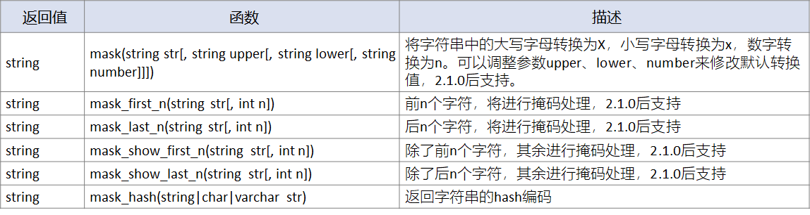

比如mask函数，默认会将查询回的数据，大写字母转换为X，小写字母转换为x，数字转换为n。当然也可以添加参数自定义转换的字母`mask(string str[, string upper[, string lower[, string number]]])`，upper定义大写字母转换，lower定义小写字母转换，number定义数字转换。

```sql
-- 函数调用
select mask("abcd-EFGH-8765-4321");
-- 结果为：
xxxx-XXXX-nnnn-nnnn
```

其余函数`mask_first_n(string str[, int n])`可对前n个字符进行掩码处理，`mask_last_n(string str[, int n])`可对后n个字符进行掩码处理。

而`mask_show_first_n(string str[, int n])`则是除了前n个字符，其余进行掩码处理，`mask_show_last_n(string str[, int n])`是除了后n个字符，其余进行掩码处理。

当然，最后`mask_hash(string|char|varchar str)`会返回字符串的hash编码。

使用这些函数，可以方便的对一些数据进行脱敏，从而在保证数据安全的情况下，交由教学使用。

**混合函数（Misc. Functions）**

Hive内置的混合函数如下：

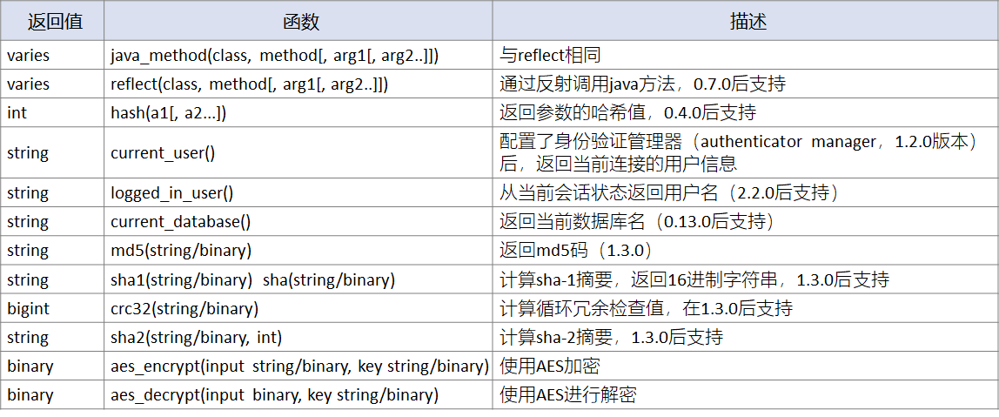

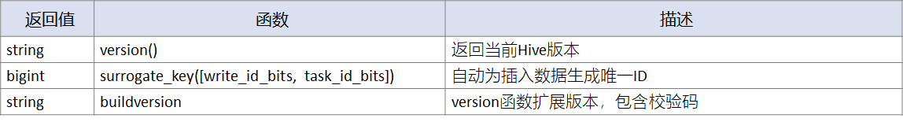

这些混合函数中，大多是与加密相关的。还有就是返回Hive的一些信息，如用户身份、集群版本等、

#### 内置聚合函数（UDAF）

与普通内置函数不同，UDAF主要提供数据的聚合操作，进行多对一的数据转换。

Hive最新版本提供的函数如下：

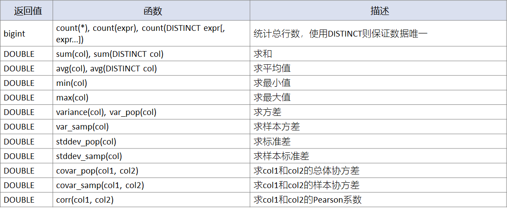

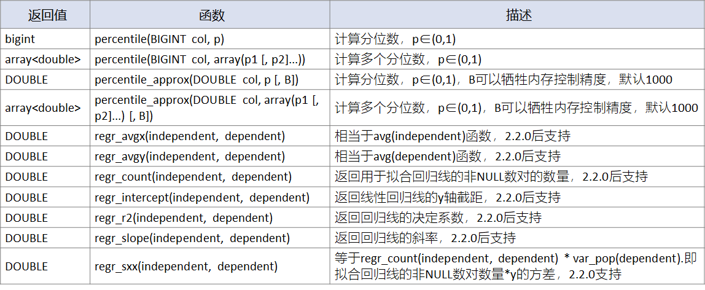

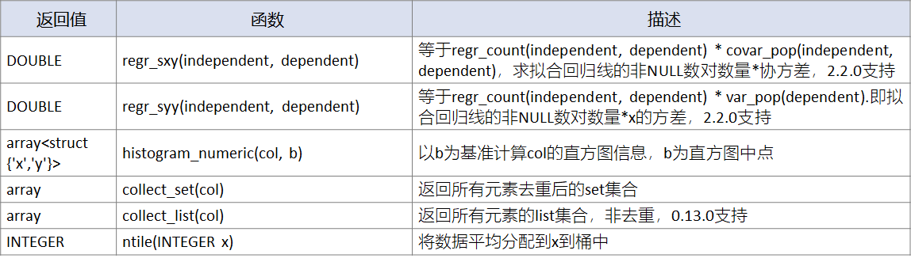

对于UDAF，大多数是一些数学计算，常用的涉及的不会很多。

基本上常用的聚合函数有：

```sql
-- sum()：求和
select sum(salary) salaries as  from <table_name>;
-- count()：求数据总数
select count(*) from <table_name>;
-- avg()：求平均值
select avg(salary) from <table_name>;
-- min：求最小值
select min(salary) from <table_name>;
-- max：求最大值
select max(salary) from <table_name>;
```

使用聚合函数时，可以配合distinct关键字，对数据进行去重处理。

```sql
-- count()：求不重复的数据总数
select count(distinct id) from <table_name>;
-- sum()：对不重复的数据求和
select sum(distinct salary) salaries as  from <table_name>;
```

#### 内置表生成函数UDTF

内置的UDTF表生成函数提供数据一对多的转换。Hive内置的表生成函数有：

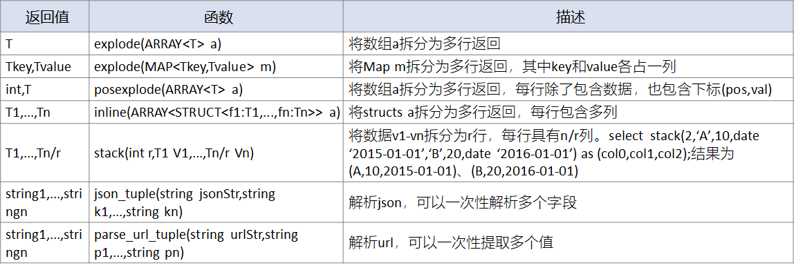

其中常用的除了在前面字符串函数中提到的json*tuple、parse*url_tuple之外，使用最多的还是explode函数，它有两个重载形式，可以将数组、Map数据拆分为多行返回。

首先是对于explode (array)的使用。

```sql
select explode(array('A','B','C'));
select explode(array('A','B','C')) as col;
select tf.* from (select 0) t lateral view explode(array('A','B','C')) tf;
select tf.* from (select 0) t lateral view explode(array('A','B','C')) tf as col;
-- 以上SQL返回相同结果
+---------+
| col     |
+---------+
| A       |
| B       |
| C       |
+---------+
```

然后是explode (map)。

```sql
select explode(map('A',10,'B',20,'C',30));
select explode(map('A',10,'B',20,'C',30)) as (key,value);
select tf.* from (select 0) t lateral view explode(map('A',10,'B',20,'C',30)) tf;
select tf.* from (select 0) t lateral view explode(map('A',10,'B',20,'C',30)) tf as key,value;
-- 以上SQL返回相同结果
+------+--------+
| key  | value  |
+------+--------+
| A    | 10     |
| B    | 20     |
| C    | 30     |
+------+--------+
```

可以使用posexplode (array)函数，将数组array拆分为多行的同时，标记每一行的下标值。

```sql
select posexplode(array('A','B','C'));
select posexplode(array('A','B','C')) as (pos,val);
select tf.* from (select 0) t lateral view posexplode(array('A','B','C')) tf;
select tf.* from (select 0) t lateral view posexplode(array('A','B','C')) tf as pos,val;
-- 以上SQL返回相同结果
+------+------+
| pos  | val  |
+------+------+
| 0    | A    |
| 1    | B    |
| 2    | C    |
+------+------+
```

使用inline (array of structs)函数进行结构体拆分。

```sql
select inline(array(struct('A',10,date '2015-01-01'),struct('B',20,date '2016-02-02')));
select inline(array(struct('A',10,date '2015-01-01'),struct('B',20,date '2016-02-02'))) as (col1,col2,col3);
select tf.* from (select 0) t lateral view inline(array(struct('A',10,date '2015-01-01'),struct('B',20,date '2016-02-02'))) tf;
select tf.* from (select 0) t lateral view inline(array(struct('A',10,date '2015-01-01'),struct('B',20,date '2016-02-02'))) tf as col1,col2,col3;

-- 以上SQL返回相同结果
+-------+-------+-------------+
| col1  | col2  |    col3     |
+-------+-------+-------------+
| A     | 10    | 2015-01-01  |
| B     | 20    | 2016-02-02  |
+-------+-------+-------------+
```

使用stack (num, values)函数，则可以将一行数据value拆分为num行：

```sql
select stack(2,'A',10,date '2015-01-01','B',20,date '2016-01-01');
select stack(2,'A',10,date '2015-01-01','B',20,date '2016-01-01') as (col0,col1,col2);
select tf.* from (select 0) t lateral view stack(2,'A',10,date '2015-01-01','B',20,date '2016-01-01') tf;
select tf.* from (select 0) t lateral view stack(2,'A',10,date '2015-01-01','B',20,date '2016-01-01') tf as col0,col1,col2;
-- 以上SQL返回相同结果
+-------+-------+-------------+
| col0  | col1  |    col2     |
+-------+-------+-------------+
| A     | 10    | 2015-01-01  |
| B     | 20    | 2016-01-01  |
+-------+-------+-------------+
```


## 窗口函数

**什么是窗口函数？**

Hive的窗口函数over( )，可以更加灵活的对一定范围内的数据进行操作和分析。

它和Group By不同，Group By对分组范围内的数据进行聚合统计，得到当前分组的一条结果，而窗口函数则是对每条数据进行处理时，都会展开一个窗口范围，分析后（聚合、筛选）得到一条对应结果。

所以Group By结果数等于分组数，而窗口函数结果数等于数据总数。

如图所示，对省份进行Group By操作，每个省份下会有多条记录，然后对当前省份分组下的薪水做求和操作，得到的是3条结果。

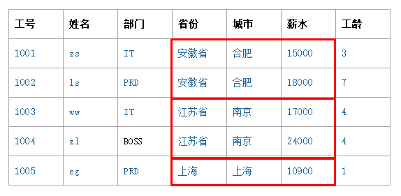

而对相同的数据做窗口操作，则是在对每一条数据进行处理时，展开一个窗口，窗口中除了当前要处理的数据，还包含其它数据部分。这个窗口默认是全部数据，也可以规定窗口长度，如设定窗口与Group By一样，圈定当前省份下的数据。因为对当前数据处理时，可以参考窗口范围内的更多数据，所以在分析上更为灵活。既可以为每条数据增加一列，存放当前省份的薪水总和，也可以计算这条数据在当前省份中的薪水排名。

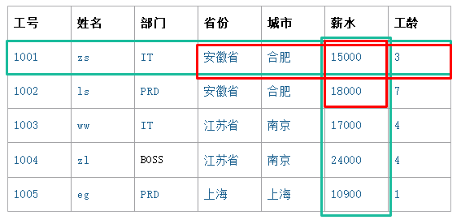

窗口函数over可以使用partition by、rows between .. and ..、range between .. and ..子句进行数据范围划分，默认范围是全部数据，并且支持使用order by进行排序。窗口的划分，在静态窗口和动态窗口中会进行讲解。

```sql
over (partition by <cols> order by <cols> rows|range between … and … )
```

窗口划分之后，在对当前窗口范围数据进行处理时，可以搭配聚合函数、排名函数、自定义函数使用。

窗口函数的最终目的是，参考窗口内的数据，为当前处理的数据行，输出一条合适的记录。

#### 静态窗口（Partition By）

可以使用Partition By实现与Group By相同的分组划分，且使用聚合函数。这种窗口的大小，在每条数据进行处理时，已经等于数据的分组结果了，所以窗口是静态的。

与Group By不同的是，窗口函数为每条数据展开一个窗口，即当前的分组范围。对窗口内的数据，可以使用不同的函数进行聚合、筛选处理，从而为当前数据获取一个结果。

如果使用聚合函数，则Partition By与Group By的处理结果相同，只是结果条数不同。

例如，为图中的每一条数据增加salaries列，用于存放员工所在省份的薪水总和。这里使用partition by关键字，指定了按照province进行窗口划分。

```sql
-- 创建临时表psn_tmp
create table psn_tmp(id int, name string, dep string, province string, city string, salary int, years int);
insert into psn_tmp values(1001, 'zs', 'it', 'AnHui', 'HeFei', 15000, 3),(1002, 'ls', 'prd', 'AnHui', 'HeFei', 18000, 7),(1003, 'ww', 'it', 'JiangSu', 'NanJing', 17000, 4),(1004, 'zl', 'boss', 'JiangSu', 'NanJing', 24000, 4),(1005, 'eg', 'prd', 'ShangHai', 'ShangHai', 10900, 1);

-- 使用over进行窗口计算
select province ,sum(salary ) over( partition by province )  as salaries from psn_tmp;

-- 计算结果
+-----------+-----------+
| province  | salaries  |
+-----------+-----------+
| AnHui     | 33000     |
| AnHui     | 33000     |
| JiangSu   | 41000     |
| JiangSu   | 41000     |
| ShangHai  | 10900     |
+-----------+-----------+
```

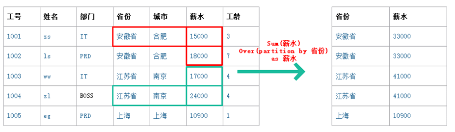

但如果使用的是Group By，结果相似，但则输出的是3条记录。

```sql
-- 使用group by进行聚合
select province ,sum(salary) as salary from psn_tmp group by province;

-- 计算结果
+-----------+---------+
| province  | salary  |
+-----------+---------+
| AnHui     | 33000   |
| JiangSu   | 41000   |
| ShangHai  | 10900   |
+-----------+---------+
```

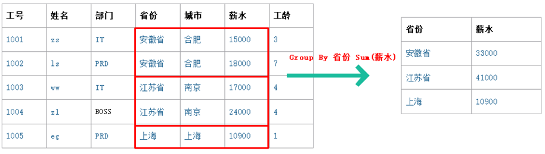

在窗口函数计算时，可以使用order by子句对窗口内的数据进行排序。

```sql
order by {cols} [asc|desc] [nulls first|nulls last]
-- asc|desc：指定了排列顺序
-- nulls first|nulls last：指定了包含空值的返回行应出现在有序序列中的第一个或最后一个位置
```

除了可以使用聚合函数之外，配合排名函数，可以获得每条数据的当前排名。

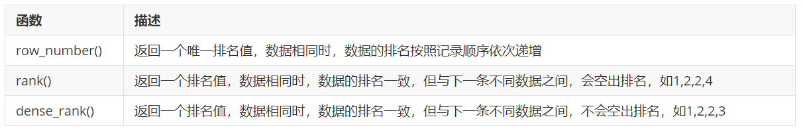

例如，计算每个员工的工资，在所属省份的排名。

```sql
select id, province, city, salary
,row_number() over(partition by province order by salary)  as rk_1
,rank()       over(partition by province order by salary)  as rk_2
,dense_rank() over(partition by province order by salary)  as rk_3
from psn_tmp;

-- 执行结果
+-------+-----------+-----------+---------+-------+-------+-------+
|  id   | province  |   city    | salary  | rk_1  | rk_2  | rk_3  |
+-------+-----------+-----------+---------+-------+-------+-------+
| 1001  | AnHui     | HeFei     | 15000   | 1     | 1     | 1     |
| 1002  | AnHui     | HeFei     | 18000   | 2     | 2     | 2     |
| 1003  | JiangSu   | NanJing   | 17000   | 1     | 1     | 1     |
| 1004  | JiangSu   | NanJing   | 24000   | 2     | 2     | 2     |
| 1005  | ShangHai  | ShangHai  | 10900   | 1     | 1     | 1     |
+-------+-----------+-----------+---------+-------+-------+-------+
```

如果窗口的函数不指定范围，则每条数据在运算时，默认是对全部数据范围进行计算，得到一条结果。

例如，对当前数据使用三种排名函数进行排名计算，并增加3列用于记录不同方法的排名结果。

```sql
select id ,province ,city ,salary
,row_number() over(order by salary)  as row_number
,rank()       over(order by salary)  as rank
,dense_rank() over(order by salary)  as dense_rank
from psn_tmp;

-- 执行结果
+-------+-----------+-----------+---------+-------------+-------+-------------+
|  id   | province  |   city    | salary  | row_number  | rank  | dense_rank  |
+-------+-----------+-----------+---------+-------------+-------+-------------+
| 1005  | ShangHai  | ShangHai  | 10900   | 1           | 1     | 1           |
| 1001  | AnHui     | HeFei     | 15000   | 2           | 2     | 2           |
| 1003  | JiangSu   | NanJing   | 17000   | 3           | 3     | 3           |
| 1002  | AnHui     | HeFei     | 18000   | 4           | 4     | 4           |
| 1004  | JiangSu   | NanJing   | 24000   | 5           | 5     | 5           |
+-------+-----------+-----------+---------+-------------+-------+-------------+
```

#### 动态窗口（Rows、Range）

除了可以使用Partition By对数据进行分组，还可以使用between .. and ..对窗口范围进行动态指定。

可以使用rows和range关键字，但它们的粒度不同，rows直接对行数进行指定，而range则是对处理值的范围进行指定。

指定范围时，n preceding表示向前n个粒度（rows、range），n following表示向后n个粒度，当n为unbounded时表示边界值，current row表示当前行。

```sql
-- 当前行，+前后各3行，一共7行
rows between 3 preceding and 3 following
-- 当前value值为中心，前后各浮动3个数，范围是(value-3, value+3)
range between 3 preceding and 3 following
-- 从数据第一行（边界）到当前行
rows between unbounded preceding and current rows
-- 当前行到最后一行
rows between current rows and unbounded following
-- 所有行，不做限定
rows between unbounded preceding and unbounded following
-- 所有范围，不做限定
range between unbounded preceding and unbounded following
```

例如，对每条数据处理时，使用rows between，计算到当前数据为止的累加工资。

```sql
-- 先插入一条数据，方便对比
insert into psn_tmp values(1000, 'll', 'it', 'ShangHai', 'ShangHai', 10900, 3);

-- 查看当前数据，按照工资升序
select id, province, city, salary from psn_tmp order by salary;

+-------+-----------+-----------+---------+
|  id   | province  |   city    | salary  |
+-------+-----------+-----------+---------+
| 1005  | ShangHai  | ShangHai  | 10900   |
| 1000  | ShangHai  | ShangHai  | 10900   |
| 1001  | AnHui     | HeFei     | 15000   |
| 1003  | JiangSu   | NanJing   | 17000   |
| 1002  | AnHui     | HeFei     | 18000   |
| 1004  | JiangSu   | NanJing   | 24000   |
+-------+-----------+-----------+---------+

-- 使用rows between，计算到当前数据为止的累加工资
select id, province, city, salary, sum (salary) over( order by salary rows between unbounded preceding and current row)  as sum
from psn_tmp;

-- 计算结果
+-------+-----------+-----------+---------+--------+
|  id   | province  |   city    | salary  |  sum   |
+-------+-----------+-----------+---------+--------+
| 1005  | ShangHai  | ShangHai  | 10900   | 10900  |
| 1000  | ShangHai  | ShangHai  | 10900   | 21800  |
| 1001  | AnHui     | HeFei     | 15000   | 36800  |
| 1003  | JiangSu   | NanJing   | 17000   | 53800  |
| 1002  | AnHui     | HeFei     | 18000   | 71800  |
| 1004  | JiangSu   | NanJing   | 24000   | 95800  |
+-------+-----------+-----------+---------+--------+
```

但对每条数据处理时，使用range between，计算到当前数据为止的累加工资时会有不同。

```sql
select id, province, city, salary, sum (salary ) over( order by salary range between unbounded preceding and current row )  as sum
from psn_tmp;

-- 计算结果
+-------+-----------+-----------+---------+--------+
|  id   | province  |   city    | salary  |  sum   |
+-------+-----------+-----------+---------+--------+
| 1005  | ShangHai  | ShangHai  | 10900   | 21800  |
| 1000  | ShangHai  | ShangHai  | 10900   | 21800  |
| 1001  | AnHui     | HeFei     | 15000   | 36800  |
| 1003  | JiangSu   | NanJing   | 17000   | 53800  |
| 1002  | AnHui     | HeFei     | 18000   | 71800  |
| 1004  | JiangSu   | NanJing   | 24000   | 95800  |
+-------+-----------+-----------+---------+--------+
```

此时，会将边界值unbounded preceding定为10900，所以第一行的结果是 10900+10900=21800，第二行也是 10900+10900=21800。

但如果没有重复数据，则range between和rows between处理结果相同。


