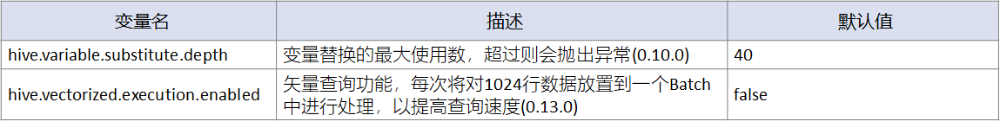

# Hive

1. [DML：数据导入&导出](#DML：数据导入&导出)
2. [运维与监控](#运维与监控)
3. [权限管控](#权限管控)
4. [性能优化](#性能优化)


## DML：数据导入&导出

#### 数据导入

**数据预处理**

将文件导入到Hive中，需要文件编码格式为UTF-8，\n为换行符，否则就需要进行预处理。处理过程分为两部分：编码格式、换行符。

**编码格式处理**

对于中文字符，如果是ASCii码，或者其它编码，则在Hive表中无法正确显示。

首先可以使用file命令提前查看文件编码类型和换行符情况。

```sql
file $filename
```

如果编码不是UTF-8，则需要进行编码转换。转换方式可以在建表前，提前对文件进行转码处理；也可以不对文件进行处理，在表中指定文件编码格式。

对文件提前进行转码处理，可以使用iconv工具进行：

```sql
# iconv是转码工具，-f源编码格式，-t目标编码格式
iconv -f gbk -t utf-8 $sourceFile > $targetFile
```

如果不对文件进行提前的转码处理，可以在表中指定文件的编码格式：

```sql
ALTER TABLE <tableName> SET SERDEPROPERTIES('serialization'='GBK');
```

**换行符处理**

在不同操作系统中，文件默认的换行符会有所不同。Windows文件用\r\n换行，而Unix和Linux文件用\n换行。Windows文件直接导入到Hive表中时，最后一列数据因为多了'\r'，会存在问题；如果最后一列是数值类型，直接显示为NULL。所以必须处理Windows换行符，将\r\n转换为\n。

转换方式同样是两种，可以事前对文件进行换行符的转换，也可以不对文件进行转换，而在表中指定换行符类型。

事前对文件换行符转换，可以使用dos2unix工具：

```sql
dos2unix $fileName
```

也可以不对文件进行处理，直接在建表时使用LINES TERMINATED BY指定换行符类型：

```sql
ALTER TABLE <tableName> SET SERDEPROPERTIES('serialization'='GBK');

CREATE EXTERNAL TABLE psn_win(
id INT comment 'ID',
name STRING comment '姓名',
age INT comment '年龄',
likes ARRAY<STRING> comment '爱好',
address MAP<STRING,STRING> comment '地址'
)comment '人员信息表'
ROW FORMAT DELIMITED
LINES TERMINATED BY '\r\n'
LOCATION '/tmp/hive_data/psn/';
```

**将文件导入表或分区（Load）**

可以使用Load命令，直接将文件中的数据导入已存在的表或分区。要注意的是，Load仅仅是将数据文件移动到表或分区的目录中，不会对数据进行任何处理，如分桶、排序，也不支持动态分区。

但Load命令在较新的版本中，如3.x之后，对于有些不支持的使用方式，如自动分区、分桶，会在解析时自动转换为insert..select运行，而不会报错。为了规范起见，不建议随意使用Load命令，Load命令只作为将文件快速移动到Hive表的存储位置上时使用。

使用Load导入文件时，命令格式如下：

```sql
LOAD DATA [LOCAL] INPATH '<path>’  [OVERWRITE] INTO
TABLE <tablename>
[PARTITION (<partition_key>=<partition_value>, ...)];
```

其中是文件存储路径，如果标注LOCAL，指向本地磁盘路径，不标则指向HDFS路径。既可指向文件也可指向目录，系统会将指定文件或目录下所有的文件移入表内。如果是HDFS路径时，执行操作的用户必须是的Owner，同时Hive用户必须有读写权限。

例如，创建一张内表，并将数据文件Load到表中。

```sql
-- 创建人员信息表psn_load
CREATE TABLE psn_load(
id INT comment 'ID',
name STRING comment '姓名',
age INT comment '年龄',
likes ARRAY<STRING> comment '爱好',
address MAP<STRING,STRING> comment '地址'
)comment '人员信息表'
ROW FORMAT DELIMITED
FIELDS TERMINATED BY ','
COLLECTION ITEMS TERMINATED BY '-'
MAP KEYS TERMINATED BY ':'
LINES TERMINATED BY '\n';

-- 将数据导入到表中
load data inpath '/tmp/hive_data/psn/' into table psn_load;
```

一般而言，在生产环境中不推荐使用Load方式进行数据导入，如果Hive集群设置了安全模式，在进行Load方式导入时权限设置步骤较多。推荐的方式是创建外表，并将外表Location设置为数据文件所在目录。

**将查询结果导入表或分区（Insert..Select导入)**

在进行数据导入时，推荐先对数据创建外表，然后检查数据格式、换行符的问题，如果不存在异常，则使用Insert..Select直接将数据导入到内表中。

```sql
INSERT (OVERWRITE | INTO)  TABLE  <table_name>
SELECT <select_statement>;
```

Insert..Select方式比较灵活，支持分区、分桶。

可以在导入时，指定数据要插入的分区：

```sql
INSERT (OVERWRITE | INTO)  TABLE  <table_name>
PARTITION (<partition_key>=<partition_value>[, <partition_key>=<partition_value>, ...])
SELECT <select_statement>;
```

也可以进行动态分区导入，系统自动判断分区：

```sql
/* 开启动态分区支持，并设置最大分区数*/
set hive.exec.dynamic.partition=true;
set hive.exec.max.dynamic.partitions=2000;
/* <dpk>为动态分区键， <spk>为静态分区键 */
INSERT (OVERWRITE | INTO) TABLE <table_name>
PARTITION ([<spk>=<value>, ..., ] <dpk>, [..., <dpk>])
SELECT <select_statement>;
```

当然也支持在数据导入时自动分桶：

```sql
-- 开启配置
set hive.enforce.bucketing=true;
-- 插入数据
INSERT (OVERWRITE | INTO)  TABLE  <table_name>
SELECT <select_statement>;
```

#### 数据导出

Hive支持将数据导出到本地目录，可能生成多个文件（与Map任务数对应）。

数据导出命令为：

```sql
INSERT OVERWRITE [LOCAL] DIRECTORY <directory>
[ROW FORMAT DELIMITED
[FIELDS TERMINATED BY char [ESCAPED BY char] ]
[COLLECTION ITEMS TERMINATED BY char]
[MAP KEYS TERMINATED BY char]
[LINES TERMINATED BY char]
[NULL DEFINED AS char] ]
[STORED AS TEXTFILE|ORC|CSVFILE]
SELECT <select_statement>;
```

与导入数据不一样，不能用Insert Into导出数据，只能用Insert Overwrite。在导出时，可以使用ROW FORMAT DELIMITED指定数据在最终导出文件中的分隔符，也可以使用STORED AS指定文件类型，默认为TEXTFILE。

命令中标注LOCAL代表导出到本地磁盘，不标代表导出到HDFS；DIRECTORY指定数据导出的文件目录。

表数据在导出文件中的分隔符，需要在ROW FORMAT DELIMITED声明后进行设置；FIELDS TERMINATED BY设置每行数据中各字段的分隔符；LINES TERMINATED BY设置每行数据之间的分隔符，默认为\n；COLLECTION ITEMS TERMINATED BY设置集合中各个成员间的分隔符，如Map集合有["name":"zhang", "age":18]两个成员，则它们在存储时会按照指定的分隔符进行隔开；MAP KEYS TERMINATED BY设置每个Map元素，即、之间的分隔符；NULL DEFINED AS设置空数据的替换字符。

例如，将表psn_load导出到本地/root/psn目录下。

```sql
insert overwrite local directory '/root/psn'
ROW FORMAT DELIMITED
FIELDS TERMINATED BY ','
COLLECTION ITEMS TERMINATED BY '-'
MAP KEYS TERMINATED BY ':'
LINES TERMINATED BY '\n'
STORED AS TEXTFILE
SELECT * FROM psn_load;
```

当然，也可以将数据导出到多个路径中：

```sql
FROM <from_statement>
INSERT OVERWRITE [LOCAL] DIRECTORY <directory1> SELECT <select_statement1>
[INSERT OVERWRITE [LOCAL] DIRECTORY <directory1> SELECT <select_statement1>] ...
```

例如，将表psn_load导出到本地/tmp/psn_n1和/tmp/psn_n2目录中：

```sql
from psn_load
insert overwrite local directory '/tmp/psn_n1' select *
insert overwrite local directory '/tmp/psn_n2' select *;
```

#### 表的备份&还原

为了对Hive表数据进行备份，可以将表的元数据和数据都导出到HDFS中：

```sql
export table <table_name> PARTITION (<spk>=<value>) to '<PATH>';
```

对备份的数据，可以使用import语法进行还原：

```sql
import from '<PATH>';
```

例如，对数据表psn_load进行备份，然后将表删除后再进行恢复：

```sql
-- 备份数据表
export table psn_load to '/tmp/psn_load';
-- 删除表
drop table psn_load;
-- 恢复数据表
import from '/tmp/psn_load';
```

当然， 如果在还原时指定了表名，则会对备份表进行改名操作：

```sql
import table <table_name> from '<PATH>';
```

支持将表数据还原到分区中：

```sql
export table <table_name> PARTITION (<spk>=<value>) to '<PATH>';
import table <table_name> partition (<spk>=<value>) from '<PATH>';
```

也支持将表数据导入成外表：

```sql
export table <table_name> to '<PATH>';
import external table <table_name> from '<PATH>';
```


## 运维与监控

#### Hive配置

**配置方式**

Hive可以通过三种方式进行参数配置，但它们的作用范围不同。

1. set命令配置方式，可以在CLI或beeline客户端中直接使用set命令进行配置，仅在当前Session有效。

   ```sql
   -- 配置Hive临时缓存目录
   set hive.exec.scratchdir=/tmp/mydir;
   -- 查看某个配置项
   set hive.exec.scratchdir;
   -- 查看所有配置项
   set;
   ```

2. hiveconf配置方式，在CLI或hiveserver2启动时使用--hiveconf指定配置项，在整个服务运行周期中有效。

   ```sh
   hive --hiveconf hive.exec.scratchdir=/tmp/mydir
   hive --service hiveserver2 --hiveconf hive.exec.scratchdir=/tmp/mydir &
   ```

3. 更改配置文件方式，在Hive服务启动前进入$HIVE_HOME/conf/中对特定的配置文件进行配置，全局有效。

   ```xml
   <property>
   <name>hive.exec.scratchdir</name>
   <value>/tmp/mydir</value>
   <description>Scratch space for Hive jobs</description>
   </property>
   ```

   配置文件包含hive配置文件hive-site.xml和其它服务配置，其中Metastore配置文件为hivemetastore-site.xml，HiveServer2服务配置文件为hiveserver2-site.xml。

#### 配置参数一览

Hive的配置分为对Hive集群的配置、MetaStore配置、Hadoop交互配置、运行时信息传递配置。以下是官网提供的最新配置参数。已全部亲自翻译。

**Hive集群的配置**




可以按照需要，对集群进行相应的配置和优化。

**MetaStore配置**

对于MetaStore，又分为基础配置和额外配置。

基础配置主要是用于MetaStore的正常启动，额外配置用于调优。

**基础配置参数**有：


**额外配置参数**有：


**Hadoop的交互配置**

Hive需要依赖Hadoop，所以需要进行与Hadoop相关的配置。


**运行时信息传递配置**

运行时信息传递配置，主要用于自定义设置与Hive交互时的一些数据信息，一般很少手动配置。


#### MetaStore

在Hive中，对于MetaStore的配置和运维是很重要的一环。接下来对MetaStore进行专门的讲解。

**MetaStore数据库配置**

对于MetaStore，可以设置在本地内置的Derby数据库中，也可以使用第三方远程数据库。

但本地内置的Derby数据库，只允许单用户连接，配置参数较为简单：


一般在生产集群中，需要配置远程第三方数据库，支持多用户连接：


MetaStore支持的第三方数据库有：


**MetaStore动态发现**

在Hive 4.0 版本之前，可以使用Zookeeper实现MetaStore动态服务发现。配置参数如下：


#### MetaStore基本运维

**启动端口更改**

MetaStore配置成功之后，需要启动MetaStore服务，在此时可以更改MetaStore的启动端口。

```sh
hive --service metastore -p <port_num>
```

**秘钥连接**

MetaStore启动之后，会使用配置文件中的用户名、密码去连接对应的数据库。但此时，密码是明文方式，容易造成一定的风险。所以在生产中，可以配置秘钥连接，从而避免将MetaStore密码明文配置到site.xml中。

首先，使用命令生成秘钥：

```sql
-- 生成秘钥
hadoop credential create javax.jdo.option.ConnectionPassword -provider jceks://file/usr/lib/hive/conf/hive.jceks
```

然后在配置文件hive-site.xml或hivemetastore-site.xml中配置秘钥位置：

```xml
<!-- 配置秘钥存放位置 -->
<!-- Configure credential store for passwords-->
<property>
<name>hadoop.security.credential.provider.path</name>
<value>jceks://file/usr/lib/hive/conf/hive.jceks</value>
</property>
```

**Hive Schema Tool**

Hive提供Hive Schema Tool用于MetaSore的运维修复、升级。

```sh
schematool -help
```

首先，可以使用Hive Schema Tool进行元数据的初始化工作，下面的命令会在数据库mysql中生成Shema数据。当然支持更改数据库类型，Hive Schema Tool支持derby|mysql|postgres|oracle|mssql这几种dbtype类型。

```sh
schematool -dbType mysql -initSchema
```

一般元数据初始化工作在Hive安装时进行，会在DB中创建hive数据库，并生成必要的元数据表。

可以使用命令获取当前的MetaStore信息：

```sh
schematool -dbType mysql -info
```

在Hive升级后，需要将MetaStore进行升级，因为之前老版本的Hive MetaStore中不会记录版本号，导致与新版本不兼容的情况。

使用Hive Schema Tool可以方便的进行升级操作：

```sql
-- upgradeSchemaFrom参数指定当前hive版本
schematool -dbType mysql -upgradeSchemaFrom 0.10.0
```

除了升级，也可以添加参数-dryRun，查看升级过程中使用的脚本信息：

```sh
schematool -dbType mysql -upgradeSchemaFrom 0.7.0 -dryRun
```

Hive Schema Tool强大的是，支持将hive元数据信息迁移到spark目录中，但这个功能需要高版本的Hive才支持。

```sh
schematool -moveDatabase db1 -fromCatalog hive -toCatalog spark
```

于是，可以使用以下命令，将Hive元数据和表文件全部迁移到Spark中。

```sh
# 在spark中创建对应数据库newdb，用于接收hive迁移来的数据库
beeline ... -e "create database if not exists newdb";
#进行数据库迁移
schematool -moveDatabase newdb -fromCatalog hive -toCatalog spark
# 进行表数据迁移
schematool -moveTable table1 -fromCatalog hive -toCatalog spark  -fromDatabase db1 -toDatabase newdb
```

#### Web监控

在Hive中可以使用WEB UI进行作业监控和集群监控。

**作业监控**

Hive支持的，可用于作业监控的WEB UI有：

1. Yarn WebUI、Spark WebUI
2. HiveServer2 WebUI
3. HWI（Hive Web Interface）
4. WebHCat

**Yarn WebUI & Spark WebUI**

其中Yarn WebUI、Spark WebUI是底层分布式计算引擎自带的作业监控页面。Hive默认会将作业提交到Yarn中运行，可以通过Yarn WebUI进行作业查看。如果使用Spark作为计算引擎，即Hive On Spark，则可以使用Spark WEB UI查看作业详情。

Yarn Web UI默认端口为8088，而Spark WEB UI默认端口为8080。

**HiveServer2 WebUI**

在2.0.0版本后，提供HiveServer2 WebUI用于日志查看、配置管理、集群指标导出功能。默认访问端口为10002。

需要在hive-site.xml中可以进行配置修改，以开启HiveServer2 WebUI。

```xml
<property>
<name>hive.server2.webui.host</name>
<value>0.0.0.0</value>
</property>
<property>
<name>hive.server2.webui.port</name>
<value>10002</value>
</property>
<property>
<name>hive.server2.webui.max.threads</name>
<value>3</value>
</property>
```

**HWI（Hive Web Interface）**

HWI提供在Web界面中使用Hive命令的功能，之前一直内置在Hive中，但在2.2.0版本后，不再进行维护，从Hive中被移除。

而HWI也不建议在生产中使用HWI，因为它在安全性方面存在一些问题。

如果需要使用Web界面对Hive进行操作，则可以使用Apache Hue来完成。

**WebHCat**

WebHCat用于为HCatLog提供HTTP Rest API功能，它并不提供直接的WEB界面。

HCatLog是一个公共的表存储层，可以提供Hadoop组件间的表数据共享。


在HCatLog基础上使用WebHCat可以让开发人员通过HTTP进行数据访问、作业管理与提交。

#### 集群监控

大数据集群监控，常用的组件有Zabbix、OpenFalcon、Prometheus。

其中Zabbix是基于Web界面提供分布式系统监控及网络监视功能的企业级开源解决方案，OpenFalcon则是小米开源的面向互联网企业的监控产品，Prometheus是开源的监控&报警&时间序列数据库的组合。


它们都是通用的集群监控组件，可以对不同的大数据组件进行自定义监控和告警功能。


## 权限管控

**基本概述**

Hive可以通过四种方式配置用户权限。

1. 在元数据服务中基于存储的授权：这种方式直接对存储在HDFS上的文件、MetaStore中的元数据进行权限控制，但粒度较粗。
2. HiveServer2中基于标准SQL的授权：这种授权方式，兼容标准SQL，授权粒度较细，在SQL执行时可以对权限有一个精准的把控。
3. 基于Apache Ranger & Sentry的组件授权：需要依赖第三方组件实现。
4. 基于旧版模式的授权：与SQL授权相似，但并不完善，访问控制不完整，有漏洞尚未解决。

一般而言，会推荐使用基于存储的授权和基本标准SQL的授权，来对Hive进行权限管控。

#### 基于存储的授权（Storage Based Authorization）

基于存储的授权在Hive 0.10版本后引入，在Metastore Server中，安全性配置为使用 Storage Based Authorization 时，会根据在文件系统中的权限来认证对元数据的操作。

所以基于存储的授权，除了要对Hive进行配置之外，还要使用HDFS命令为相应用户和用户组在表文件上设置相应的操作权限，以达到鉴权的目的。

**开启基于存储的授权**

首先在hive-site.xml中开启配置Metastore的安全特性。

```xml
<property>
<name>hive.metastore.pre.event.listeners</name>
<value>org.apache.hadoop.hive.ql.security.authorization.AuthorizationPreEventListener</value>
</property>
```

然后开启配置Metastore的授权管理器、认证管理器，以开启基于存储的授权模式。

```xml
<property>
<name>hive.security.metastore.authorization.manager</name>
<value>org.apache.hadoop.hive.ql.security.authorization.StorageBasedAuthorizationProvider</value>
</property>
<property>
<name>hive.security.metastore.authenticator.manager</name>
<value>org.apache.hadoop.hive.ql.security.HadoopDefaultMetastoreAuthenticator</value>
</property>
```

在0.14版本后，可以开启对数据库、表读权限的控制。

```xml
<property>
<name>hive.security.metastore.authorization.auth.reads</name>
<value>true</value>
</property>
```

接下来，就要为用户和用户组设置对表数据的ACL操作权限，以进行权限管控，但HDFS要提前开启ACL功能，即在hdfs-site.xml中配置dfs.namenode.acls.enabled=true。

**基于存储的授权操作**

在Hive操作中，有这样的一个场景，当安装了HUE组件后，希望通过HUE来直接向Hive发送SQL执行。但HUE使用的是自己的用户，假设为hue，希望将Hive数据目录为hue用户开放权限，以便进行数据操作。

首先，需要查看一下目录的acls权限：

```sh
hadoop fs -getfacl /user/hive/warehouse
```

这里需要注意的是，acl权限中的mask权限，它限制了acl user、acl group，以及group的最高权限，但它不影响owner的权限。

假设mask权限为r--，则除了owner，为当前目录添加的acl用户、acl用户组、group，最高的权限只能是r--。

所以为了新用户的赋权，最好先修改一下mask值，这里开放了rwx所有权限。

```sh
hadoop fs -setfacl -R -m mask::rwx /user/hive/warehouse
```

然后授权hue用户和hue用户组对warehouse目录的rwx操作权限。

```sh
#授予hue用户对warehouse文件夹rwx权限
hadoop fs -setfacl -m user:hue:rwx /user/hive/warehouse
#授予hue用户组对warehouse文件夹rwx权限
hadoop fs -setfacl -m group:hue:rwx /user/hive/warehouse
# 查看权限设置
hadoop fs -getfacl /user/hive/warehouse
```

最后，需要注意default acl的设置，在warehouse目录下新创建的目录或文件，默认会继承default acl所设置的权限。

```sh
#设置默认的ACL Mask权限为rwx
hadoop fs -setfacl -R -m default:mask::rwx /user/hive/warehouse
#设置hue用户在当前文件夹下创建的新文件，默认的ACL权限为rwx
hadoop fs -setfacl -R -m default:user:hue:rwx /user/hive/warehouse
#设置hue用户组在当前文件夹下创建的新文件，默认的ACL权限为rwx
hadoop fs -setfacl -R -m default:group:hue:rwx /user/hive/warehouse
```

这样的话，使用hue用户、hue用户组创建的表文件，自动会拥有rwx的权限。当然，你也可以一次性设置所有用户、用户组的default acl权限，而不是单独为每个用户进行设置，这样可以避免default acl设置过多的情况。

```sh
#设置所有用户在当前文件夹下创建新文件时，默认的ACL权限为rwx
hadoop fs -setfacl -R -m default:user::rwx /user/hive/warehouse
#设置所有用户组在当前文件夹下创建新文件时，默认的ACL权限为rwx
hadoop fs -setfacl -R -m default:group::rwx /user/hive/warehouse
```

之后hue用户便可以对hive数据库进行读写操作。而切换到用户hue1后，则只有默认的查看权限，无法对表进行写入操作。

为了保证集群的安全性，可以提升或限制其它用户的权限：

```sh
# 将其它用户的权限设置为4,即只读
hadoop fs -chmod -R 754 /user/hive/warehouse
```

#### 在HiveServer2中基于SQL的授权

**基本概述**

Hive 0.13.0版本后引入，基于标准SQL的授权模式。但对于Hive Cli无法进行权限管控，因为Cli可以直接访问HDFS，绕过甚至禁用管控方式。可以配合基于存储的授权使用，以加强对权限的控制。

**授权模型**

除了支持对于用户的授权认证，还支持角色Role的授权认证。Role是一组权限的集合，一个用户可以具有一个或多个角色Role权限，默认包含public、admin两种角色。

**使用限制**

启用当前认证方式之后，dfs, add, delete, compile, and reset 等命令被禁用。

通过 set 命令配置参数的方式被限制为特定用户使用，需要修改白名单进行配置。

```sh
hive.security.authorization.sqlstd.confwhitelist
```

添加、删除函数以及宏（批量规模）的操作、用户自定义函数的创建，仅为具有 admin 角色的用户开放。

会禁用Transform子句（Transform语法可以调用自定义脚本对数据进行处理）。

**开启SQL授权**

hive 0.14版本之后，在hive-site.xml中使用以下配置开启SQL授权。

```xml
<property>
<name>hive.server2.enable.doAs</name>
<value>false</value>
</property>
<property>
<name>hive.security.metastore.authorization.manager</name>
<value>org.apache.hadoop.hive.ql.security.authorization.MetaStoreAuthzAPIAuthorizerEmbedOnly</value>
<description>
设置授权方式，支持以列表方式设置多种授权，使用逗号分隔，
之前在存储授权中设置的是：
org.apache.hadoop.hive.ql.security.authorization.StorageBasedAuthorizationProvider
</description>
</property>
<property>
<name>hive.security.authenticator.manager</name>
<value>
org.apache.hadoop.hive.ql.security.authorization.plugin.sqlstd.SQLStdConfOnlyAuthorizerFactory
</value>
<description>
保证使用hive-cli创建的表和视图，它们的所有者拥有相应的权限
</description>
</property>
```

在hive-site.xml中提前配置拥有管理员身份的用户。

```xml
<property>
<name>hive.users.in.admin.role</name>
<value>hive</value>
</property>
```

被设置为管理员角色的用户，需要运行命令获取角色权限。

```sql
set role admin;
```

在hive-site.xml中为表的创建者赋予所有权限。

```xml
<property>
<name>hive.security.authorization.createtable.owner.grants</name>
<value>ALL</value>
</property>
```

客户端配置文件hiveserver2-site.xml，也需要进行修改（也可以直接配置到hive-site.xml中）。

```xml
<configuration>
<property>
<name>hive.security.authorization.enabled</name>
<value>true</value>
</property>
<property>
<name>hive.security.authorization.manager</name>
<value>
org.apache.hadoop.hive.ql.security.authorization.plugin.sqlstd.SQLStdHiveAuthorizerFactory
</value>
</property>
<property>
<name>hive.security.authenticator.manager</name>
<value>org.apache.hadoop.hive.ql.security.SessionStateUserAuthenticator</value>
</property>
</configuration>
```

**Role管理命令**

首先需要创建角色Role，但只有管理员角色拥有权限，角色名不能是ALL、DEFAULT、NONE，它们是保留关键字。

```sql
-- 获取管理员角色权限
set role admin;
-- 创建角色Role
CREATE ROLE <role_name>;
```

然后，**可以查看所有的角色ROLES**，默认已经存在admin、public两个角色。

```sql
show roles;
```

也可以**查看当前用户所有的ROLES**。

```sql
SHOW CURRENT ROLES;
```

对已经创建的ROLE，进行赋权的语法是：

```sql
GRANT role_name [, role_name] ...
TO principal_specification [, principal_specification] ...
[ WITH ADMIN OPTION ];

principal_specification
: USER user
| ROLE role
```

现在，**为Role进行赋权**：

```sql
-- 支持的权限有：INSERT | SELECT | UPDATE | DELETE | ALL
-- 将default数据库的所有权限赋予角色<role_name>
GRANT ALL ON DATABASE default TO ROLE <role_name>；
-- 将default.test表的SELECT权限赋予角色<role_name>
GRANT SELECT ON TABLE default.test TO ROLE <role_name>；
```

然后，可以**将Role赋予给某个用户**：

```sql
GRANT ROLE <role_name> TO USER <user_name>；
```

也可以**将Role赋予给其它Role**：

```sql
GRANT ROLE <role_name> TO ROLE <other_role_name>；
```

当前用户，可以**切换为某个Role角色**，以获取对应权限。

```sql
SET ROLE (role_name|ALL|NONE);
```

可以使用命令查看拥有当前Role的所有角色和用户，需要管理员权限。

```sql
SHOW PRINCIPALS <role_name>;
```

除了权限的授予，也可以使用以下语法撤销角色的权限：

```sql
REVOKE [ADMIN OPTION FOR] role_name [, role_name] ...
FROM principal_specification [, principal_specification] ... ;

principal_specification
: USER user
| ROLE role
```

例如，可以**从其它Role中移除特定Role权限**：

```sql
REVOKE ROLE <role_name> FROM ROLE <other_role_name>;
```

也可以**从某个用户中移除特定Role权限**：

```sql
REVOKE ROLE <role_name> FROM USER <user_name>;
```

当然，同样支持**移除Role的部分权限**：

```sql
REVOKE ALL ON DATABASE default FROM ROLE <role_name>;
```

对于**已经创建的Role，可以进行删除**：

```sql
DROP ROLE role_name;
```

**Object权限管理**

在基于SQL的授权中，Role角色、User用户，都属于Object对象。可以单独对Object对象进行权限管控。

为对象进行赋权的语法是：

```sql
GRANT
priv_type [, priv_type ] ...
ON table_or_view_name
TO principal_specification [, principal_specification] ...
[WITH GRANT OPTION];

principal_specification
: USER user
| ROLE role

priv_type
: INSERT | SELECT | UPDATE | DELETE | ALL
```

首先，**为Role进行赋权**，前面在Role管理命令中已经提到：

```sql
-- 为role赋权
grant select on <table_name> secured_table to role <role_name>;
```

除此之外，可以直接**对某个用户进行赋权**：

```sql
grant select on <table_name> secured_table to user <user_name>;
```

当然， 可以为对象进行权限撤销：

```sql
REVOKE [GRANT OPTION FOR]
priv_type [, priv_type ] ...
ON table_or_view_name
FROM principal_specification [, principal_specification] ... ;

principal_specification
: USER user
| ROLE role

priv_type
: INSERT | SELECT | UPDATE | DELETE | ALL
```

首先，**为role撤销权限**：

```sql
revoke update, select on table <table_name> from role <role_name>;
```

然后，**为user撤销对应权限**：

```sql
revoke update, select on table <table_name> from user <user_name>;
```

可以**对Object的权限进行查询**：

```sql
SHOW GRANT [principal_specification] ON (ALL | [TABLE] table_or_view_name);

principal_specification
: USER user
| ROLE role
```

在进行权限查询时，先**查看当前用户**：

```sql
set system:user.name;
```

**查看某个用户的所有权限**：

```sql
show grant user <user_name> on all;
```

**查询某个用户在某张表中的所有权限**：

```sql
show grant user <user_name> on table <table_name>;
```

**查询在某表中的所有用户及其权限**：

```sql
show grant on table <table_name>;
```

#### Hive操作所需要的权限

对于不同的操作，所需要的权限是不一样的，Hive中提供了以下的对照表，进行赋权时参考。


#### 权限管理框架

除了直接使用Hive的权限管控命令，还可以使用第三方权限管理框架，如Apache Ranger、Apache Sentry，来方便的进行权限的控制。

Apache Ranger是一个跨Hadoop平台的，对数据进行全面管理、监控，保证数据安全性的开源框架。它支持可视化界面操作，能够添加不同Hadoop组件，并支持审计和告警功能。

Apache Sentry是一个用于对Hadoop集群上的数据和元数据进行授权管控的开源框架。

它们都可以运用于对Hive进行权限控制，在企业中运用较为广泛。这里就不进行过多的介绍。

#### 旧版授权模式（Legacy Mode）

**基本概述**

在2.0.0版本前，它是Hive默认授权模式，2.0.0中替换为SQL授权模式。但因为它存在安全性问题，所以不再推荐使用。

旧版授权模式需要在hive-site.xml中使用以下配置开启：

```xml
<property>
<name>hive.security.authorization.enabled</name>
<value>true</value>
</property>

<property>
<name>hive.security.authorization.createtable.owner.grants</name>
<value>ALL</value>
</property>
```

**授权模型**

旧版授权模式支持用户、组、角色的授权。允许授予的权限有：

```sh
ALL – 所有权限
ALTER -修改元数据权限
UPDATE – 修改数据权限
CREATE - 创建权限
DROP - 删除权限
INDEX – 索引创建 (Note: 功能暂未实现)
LOCK – 锁、解锁权限
SELECT – 查询权限
SHOW_DATABASE – 数据库查看权限
```

**授权操作**

角色管理：

首先可以**对角色进行创建&删除**。当然，需要提前获取管理员权限。

```sql
-- 获取管理员权限(需要hive用户)
set role admin;
CREATE ROLE <role_name>;
DROP ROLE <role_name>;
```

对于创建的Role角色，进行权限授予、解除：

```sql
GRANT ROLE role_name [, role_name] ...
TO principal_specification [, principal_specification] ...
[WITH ADMIN OPTION]

REVOKE [ADMIN OPTION FOR] ROLE role_name [, role_name] ...
FROM principal_specification [, principal_specification] ...

principal_specification:
USER user
| GROUP group
| ROLE role
```

例如，**对某个Role角色授予权限**：

```sql
-- 授予Role角色对数据库的所有权限
GRANT ALL ON DATABASE <database_name> TO ROLE <role_name>;
-- 授予Role角色对表的查询权限
GRANT SELECT ON TABLE <table_name>  TO ROLE <role_name>;
```

之后，可以查询角色权限：

```sql
SHOW ROLE GRANT principal_specification

principal_specification:
USER user
| GROUP group
| ROLE role
```

例如**查询Role角色的所有权限**：

```sql
SHOW GRANT ROLE <role_name>;
```

因为Role角色的权限可以赋值给其它Role，此时便可以**查询当前Role包含哪些Role的权限**，对于Role的赋权，接下来会进行讲解：

```sql
SHOW ROLE GRANT ROLE <role_name>;
```

**权限管理**

可以使用命令，对权限进行设置：

```sql
GRANT
priv_type [(column_list)]
[, priv_type [(column_list)]] ...
[ON object_specification]
TO principal_specification [, principal_specification] ...
[WITH GRANT OPTION]

REVOKE [GRANT OPTION FOR]
priv_type [(column_list)]
[, priv_type [(column_list)]] ...
[ON object_specification]
FROM principal_specification [, principal_specification] ...

REVOKE ALL PRIVILEGES, GRANT OPTION
FROM user [, user] ...

priv_type:
ALL | ALTER | UPDATE | CREATE | DROP
| INDEX | LOCK | SELECT | SHOW_DATABASE

object_specification:
TABLE tbl_name
| DATABASE db_name

principal_specification:
USER user
| GROUP group
| ROLE role
```

可以**对用户、用户组、Role设置权限**：

```sql
-- 为root用户设置default数据库的所有权限
GRANT ALL ON DATABASE default TO USER root;
-- 为root用户组设置对表t1的数据查询权限
GRANT SELECT on table default.t1 to group root;
-- 为stu角色设置查询权限
GRANT SELECT ON TABLE default.t1 TO ROLE stu;
```

可以**用Role角色完成对用户或其它Role角色的赋权**：

```sql
-- 将Role角色stu的权限赋予root用户
GRANT ROLE stu TO USER root;
-- 将Role角色stu的权限赋予root用户组
GRANT ROLE stu TO GROUP root;
-- 将Role角色stu的权限赋予teacher角色
create Role teacher;
GRANT ROLE stu TO ROLE teacher;
```

对已经授权的用户、组、Role，可以**进行权限回收**：

```sql
-- 回收用户root的select授权
revoke select on database default from user root;
-- 回收组root的select授权
revoke select on database default from group root;
-- 回收Role stu的select授权
revoke select on database default from Role stu;
```

可以使用命令查看所有权限：

```sql
SHOW GRANT principal_specification
[ON object_specification [(column_list)]]

principal_specification:
USER user
| GROUP group
| ROLE role

object_specification:
TABLE tbl_name
| DATABASE db_name
```

例如，**查看当前授予的所有权限**：`SHOW GRANT;`

**查看某个用户、用户组、Role的所有权限**

```sql
-- 查看root用户在default数据库下的所有权限
SHOW GRANT USER root;
-- 查看root用户组在default数据库下的所有权限
SHOW GRANT GROUP root;
-- 查看stu ROLE在default数据库下的所有权限
SHOW GRANT ROLE stu;
```

**查看某个用户、用户组、Role在某个数据库或表中的所有权限**

```sql
-- 查看root用户在default数据库下的所有权限
SHOW GRANT USER root ON DATABASE default;
-- 查看root用户组在default数据库下的所有权限
SHOW GRANT GROUP root ON DATABASE default;
-- 查看stu ROLE在default数据库下的所有权限
SHOW GRANT ROLE stu ON DATABASE default;
-- 查看root用户在default.t1表中的所有权限
SHOW GRANT USER root ON TABLE default.t1;
```

**Hive操作所需要的权限**

对于不同的操作，所需要的权限是不一样的，对于旧版授权，Hive中提供了以下的对照表，进行赋权时参考。


#### 其它权限配置

**新建文件默认权限**

可以在配置文件中**配置新建文件的默认权限**，授权掩码0002，即664权限。

```xml
<property>
<name>hive.files.umask.value</name>
<value>0002</value>
<description>The dfs.umask value for the hive created folders</description>
</property>
```

授权掩码的计算分为文件、目录两种情况。

文件的掩码基数为666，即rw- rw- rw-，减去真实权限，如rw- r-- r--（ 644 ），计算得到掩码022。

目录的掩码基数为777，即rwx rwx rwx，减去真实权限，如rwxr-xr-x（ 755 ），计算得到掩码022。

**授权检查**

配置授权检查，可以阻止没有权限的用户进行表删除操作。

```xml
<property>
<name>hive.metastore.authorization.storage.checks</name>
<value>true</value>
</property>
```

**自动授权**

配置自动授权，可以指定建表用户的默认权限。

```xml
<property>
<name>hive.security.authorization.createtable.owner.grants</name>
<value>select,drop</value>
</property>
```

也可以在每张表创建时，为特定的用户赋予对表的权限。

```xml
<property>
<name>hive.security.authorization.createtable.user.grants</name>
<value>irwin,hadoop:select;tom:create</value>
</property>
```

同样可以设置对组、角色的授权。

```xml
<property>
<name>hive.security.authorization.createtable.group.grants </name>
<value>root,hue:select;hive:create</value>
</property>
<property>
<name>hive.security.authorization.createtable.role.grants </name>
<value>root,hue:select;hive:create</value>
</property>
```


## 性能优化

#### 作业调优

**严格模式**

Hive在执行SQL命令时，可以设置严格模式，防止用户执行一些对性能影响很大的查询。

```sql
set hive.mapred.mode=strict;
```

在Hive 2.x之前默认为nonstrict，之后默认是strict。

严格模式禁止对分区表进行全表扫描，查询时在where语句中必须包含分区字段限制范围。对使用了Order By的查询，必须使用limit语句限制数据量，防止单任务运行时间过长。

严格模式下，会限制笛卡尔积的查询。

在企业，可以进行灵活设置，但严格模式的开启，可能会导致某些SQL语句无法执行。

**基本属性**

为作业**配置作业名**，便于查找：

```sql
set mapred.job.name=my_job_{DATE};
```

对于紧急作业，可以**提高作业优先级**，以增加处理时的响应速度：

```sql
-- 5个优先级可选：VERY_HIGH，HIGH，NORMAL，LOW，VERY_LOW
set mapred.job.priority=VERY_HIGH;
```

**并发控制**

为作业**设置并行处理**，对于非严格依赖的任务，进行并发运算。并行处理开启后，并不会增加Map数、Reduce数，而是将没有严格先后依赖的任务，同时进行运算处理。假设作业有2个Map，且互不影响，则并发开启后，会同时进行处理。

```sql
set hive.exec.parallel=true; -- 设置并行，0.5.0版本支持
set hive.exec.parallel.thread.number=15; -- 最大并行个数
```

处理过程多的任务，可以**开启JVM重用**，一般设置为10-20。这样，在任务结束后，不会立即释放JVM空间，从而减少了JVM销毁和新建所用的时间。

```sql
set mapred.job.reuse.jvm.num.tasks=10;
```

对于Hive作业，可以**动态调节Map数量**，但对于不可切分的压缩文件，Map数只能减少不能增加。

```sql
-- 决定每个map处理的最大的文件大小，单位为B
set mapred.max.split.size=256000000
-- 决定每个map处理的最小的文件大小，单位为B
set mapred.min.split.size=10000000
-- 节点中可以处理的最小的文件大小
set mapred.min.split.size.per.node=8000000;
-- 机架中可以处理的最小的文件大小
set mapred.min.split.size.per.rack=8000000;
```

除了可以动态调整Map数量外，也可以**动态调节Reduce数量**，决定输出文件数，但一般不做调整。

```sql
-- 设置每个reducer默认处理300M数据，0.14.0之前默认1G，1000作为进位
set hive.exec.reducers.bytes.per.reducer =300000000;
-- reducer数量 N=min(hive.exec.reducers.max ，总输入数据量/ hive.exec.reducers.bytes.per.reducer )
-- hive.exec.reducers.max可自定义设置，0.14前默认为999，之后改为1099
set hive.exec.reducers.max=1099
-- 如果处理时，出现了OOM，则可以手动增大Reduce个数进行处理，默认为-1，自动推算
set mapred.reduce.tasks=100;
```

**性能优化**

可以**调整Map Spill在环形缓存区溢写的数据量**，能够减少最终溢写生成的文件数。

```sql
-- 调整内存缓存区大小
set mapreduce.task.io.sort.mb=100
-- 调整缓存区溢写阈值
mapreduce.map.sort.spill.percent=0.8
-- 使用combiner减少map输出的数据大小
-- 适当进行数据压缩
```

**调整Reduce启动时机**，可以不必等待Map完全处理完，提前启动Reduce进行数据运算。

```sql
-- Reduce运行进度，0-33％ 表示进行 shuffle，34-66％ 表示 sort，67％-100％ 表示 reduce
-- Reducer 启动时机， 1.0将等待所有 mapper 完成； 0.0 立即启动 reducers； 0.5则是一半的 map 完成时启动
set mapred.reduce.slowstart.completed.maps = 0.5
```

**启动Fetch抓取**，Hive对某些情况的查询可以不必使用MapReduce进行计算，如select*、limit。

```sql
set hive.fetch.task.conversion=more;
```

**开启推测执行**：如果某个Task因为配置等情况导致进度远落后于整体进度，则重新启动一个Task进行运算，当其中一个Task运算完成后，另外一个Task被直接kill掉。

```sql
-- map开启推测执行
set mapred.map.tasks.speculative.execution=true
-- reduce开启推测执行
set mapred.reduce.tasks.speculative.execution=true
```

**开启本地化启动**，查询处理的数据量较小时，可以提高性能。

```sql
set hive.exec.mode.local.auto=true;
-- task数不超过配置，则启动本地模式，
set hive.exec.mode.local.auto.input.files.max=4;
-- 输入文件大小不超过配置，启动本地模式
set hive.exec.mode.local.auto.inputbytes.max=134217728
```

#### 代码调优

**表类型&压缩**

选择适当的表格式进行数据存储，可以建立临时表用于中间结果的暂存。

```sql
create temporary table <tmp_table> as select * from <table_name> ;
-- 设置临时表存储介质，可以是memory、 ssd、default，默认default为磁盘存储
set hive.exec.temporary.table.storage=memory;
```

进行合适的分区、分桶优化。进行数据查询、处理时，筛选条件总包含某个字段，设置为分区字段，可以加快数据扫描效率。设置桶表，可以提升数据查询、Join性能。

适当开启压缩，减轻传输、存储压力。

```sql
-- 对MR运行过程中的数据进行压缩，减轻数据传输压力
set hive.exec.compress.intermediate=true;
set mapred.map.output.compression.codec=org.apache.hadoop.io.compress.SnappyCodec;
-- 根据表类型，对最终结果进行压缩，减轻存储压力
set hive.exec.compress.output=true;
set mapred.output.compression.type=BLOCK;
set mapred.output.compression.codec=org.apache.hadoop.io.compress.SnappyCodec;
set mapreduce.output.fileoutputformat.compress=true;
```

**Join调优**

优先数据where过滤后再join，减少参与运算的数据量。

在多个join on连接条件中，尽量包含同一个join key，如果多个join on中包含同一个join key，那么它们会合并为一个MapReduce Job。

```sql
-- Join Key中包含同一个b.key1，所以在运行时作为MapReduce作业运行
SELECT a.val, b.val, c.val FROM a JOIN b ON (a.key = b.key1) JOIN c ON (c.key = b.key1)
```

大表要放置在join语句之后。因为Hive在执行Join时，默认会将前面的表直接加载到缓存，后面一张表进行stream处理，即shuffle操作。这样可以减少shuffle过程，因为直接加载到缓存中的表，只需要等待后面stream过来的表数据，而不需要进行shuffle，相当于整体减少了一次shuffle过程。

```sql
-- a、b加载到内存中，c进行shuffle
SELECT a.val, b.val, c.val FROM a JOIN b ON (a.key = b.key1) JOIN c ON (c.key = b.key1)
```

**Stream Table & Map Join**

所以在SQL语句中，大表放在join后面，会有很好的优化效果，或者可以直接标注为StreamTable，来指定进行stream的表。

```sql
SELECT /*+ STREAMTABLE(a) */ a.val, b.val, c.val FROM a JOIN b ON (a.key = b.key1) JOIN c ON (c.key = b.key1)
```

也可以将小表手动指定为map表，Hive在执行时会自动缓存到Map作业中。

```sql
SELECT /*+ MAPJOIN(b) */ a.key, a.value FROM a JOIN b ON a.key = b.key
```

当然，Hive支持开启MapJoin，自动识别小表，并进行优化。

```sql
-- 开启map join，Hive自动识别小表
set hive.auto.convert.join=true;
-- 小表的阈值，默认25mb，小于阈值则在map阶段写入内存。
set hive.mapjoin.smalltable.filesize=25000000;
-- 内连接中，除了第一个表之外的其他表都是小表时，将多个mapjoin合并为一个
set hive.auto.convert.join.noconditionaltask=true;
-- 多个小表的总大小需小于设定值时，进行mapjoin合并，Hive1.2.1默认为10MB
set hive.auto.convert.join.noconditionaltask.size=60000000;
```

**Bucket Join & SMB Map Join**

如果两张表均分桶表，且join key为分桶键，分桶数成倍数关系，可以使用Bucket Join提升性能。此时，直接从两张表的对应桶中读取数据进行Join操作，减少了Shuffle开销。

```sql
-- 开启bucket map join,只有在分桶表才会有效
set hive.optimize.bucketmapjoin = true;
```

在Bucket Join的基础上，如果分桶键有序存储，使用SMB（Sort Merge Bucket） Map Join可以显著提升性能。因为分桶键有序，可以每次将表一部分数据提取，再与大表进行匹配；所以没有内存限制，可以执行全外连接。

```sql
set hive.optimize.bucketmapjoin = true;
set hive.auto.convert.sortmerge.join=true;
set hive.optimize.bucketmapjoin.sortedmerge =true;
set hive.input.format=org.apache.hadoop.hive.ql.io.bucketizedHiveInputFormat;
```

**编码习惯**

在SQL编写时，**一个Job能完成的任务，尽量不要拆分为多个Job**。所以尽量减少嵌套层次、group by数量，从而减少Job数，提高性能。

```sql
-- 创建2张表tb1、tb2
create table eg_tb(id int, category_a string, category_b string);
insert into table eg_tb values(1,"a", "0");
insert into table eg_tb values(1,"b", "1");
insert into table eg_tb values(1,"b", "0");

-- SQL中有2个Group By操作，会启动3个Job进行处理
select category_a as category, '1' as type, count(1) as num
from eg_tb
group by category_a
union all
select category_b as category, '2' as type, count(1) as num
from eg_tb
group by category_b;
-- 减少为1个Group By，只启动1个job，性能提升2倍以上
-- 这里先将eg_tb表的分类字段category_a、category_b进行字符串合并
-- 合并时标记字段类型：'category_a'_1-'category_b'_2
-- 然后对合并后的字符串直接split拆分，并使用lateral view explode分为多行
-- 然后对合并后的数据进行聚合统计，整个Job只用了一次Group By
select category, type, count(1) as num from
(select split(part, '_')[0] as category, split(part, '_')[1] as type, id
from eg_tb
lateral view explode(split(concat(category_a, '_1','-', category_b, '_2'), '-')) tem_col as part
)t group by category, type;
```

**尽量避免单个Reduce任务的写法**。

```sql
-- 统计去重ID，单个Reduce执行
select count(distinct id) from eg_tb;
-- 改写，使用group by，增加Reduce
select count(1) from (select id from eg_tb group by id) t;
-- 全局排序，取TOP N数据，单Reduce执行
select * from eg_tb order by id limit 10;
-- 改写，先使用局部排序限制数量，然后再用全局排序取TOP N
select * from
(select * from eg_tb distribute by id sort by id desc limit 10) t
order by id desc limit 10;
-- 笛卡尔积，单Reduce执行
select t1.*, t2.* from t1 join t2;
-- 改写，添加on条件提前限制数据量
select t1.*, t2.* from t1 join t2 on t1.id=t2.id;
```

Hive内置了大量的函数，在SQL处理时，**尽量使用内置函数来完成**，性能会有所保证。

在企业中使用Hive SQL需要一定的规范。一般**在SQL编写之前，需要进行规范的注释添加**，并设定特定的配置。

在SQL文件开始，常见的注释有：

```sql
-- @Name:所属数据库.结果表
-- @Description:描述
-- @Type:表类型，如每日汇总表
-- @Target:结果表
-- @source:数据源表1    别名1
-- @source:数据源表2    别名2
-- @Author:工号 作者
-- @CreateDate:创建日期
-- @ModifyBy:修改人
-- @ModifyDate:修改日期
-- @ModifyDesc:修改描述
-- @Copyright  版权
```

良好的注释，便于代码的阅读和版本的控制。

在注释之后，会添加公用的调优参数：

```sql
-- 设置作业名，方便出错后作业查询
set mapred.job.name = TASK_NAME (${hivevar:statis_date});
-- 每个Map最大输入大小,可以适当调整。
set mapred.max.split.size = 300000000;
-- 每个Map最小输入大小,可以适当调整。
set mapred.min.split.size = 100000000;
-- 执行Map前进行小文件合并
set hive.input.format = org.apache.hadoop.hive.ql.io.CombineHiveInputFormat;
-- hive自动根据sql，选择使用common join或者map join（关闭）
set hive.auto.convert.join = false;
-- 在Map-only的任务结束时合并小文件
set hive.merge.mapfiles = true;
-- 在Map-Reduce的任务结束时不合并小文件
set hive.merge.mapredfiles = false;
-- 合并文件的大小,可以适当调整。
set hive.merge.size.per.task = 300000000;
```

这些参数中，首先进行了作业名的设置，然后对Map数量进行了设置，便于并发的提高；Map阶段前进行小文件合并，一定程度上缓解了小文件带来的影响。

接着可以设置Join的自动判断，如果存在小表，则直接使用map join将表加载到内存中，而避免shuffle，这里设置了关闭，可以根据需求来定。

最后设置任务结束时，小文件的合并。

在此之后，便可以进行SQL的编写。良好的开发规范，可以避免很多问题。当然在SQL文件中，一般仅涉及作业调优，对集群的公共调优部分会持久化到配置文件中。

#### 常见问题

**小文件问题**

因为Hive的数据存储在HDFS中，而小文件会给HDFS带来很多问题。首先是过多小文件会占用NameNode大量的内存，为NameNode带来压力；其次每个小文件在处理时，会分发一个Map任务，大量的小文件会生成众多Map任务，从而增加Map任务生成、调度的时间，直接影响整体处理效率。

如果目标表已经存在小文件问题，可以在数据输入时，设置参数，自动进行小文件的合并。这种属于已经存在问题，所进行的事后处理。

```sql
-- 每个Map最大输入大小设置为2GB（单位：字节）
set mapred.max.split.size=2048000000
-- 0.5.0版本后，已经是系统默认值
set hive.input.format=org.apache.hadoop.hive.ql.io.CombineHiveInputFormat;
```

为了避免小文件的生成，在数据输出时，可以进行数据合并。这种是事前处理，避免产生小文件问题。

```sql
set hive.merge.mapfiles = true # 在Map-only的任务结束时合并小文件
set hive.merge.mapredfiles= true # 在Map-Reduce的任务结束时合并小文件
set hive.merge.size.per.task = 1024000000 # 合并后文件的大小为1GB左右
set hive.merge.smallfiles.avgsize=1024000000 # 当输出文件的平均大小小于1GB时，启动一个独立的map-reduce任务进行文件merge
```

**数据倾斜问题**

在生产过程中，数据可能会发生倾斜，数据倾斜会直接影响数据处理的效率。

发生倾斜的原因首先是空值，在MapReduce处理时，会被分发到Task 0中进行处理，导致Task 0数据量过多，处理缓慢。对于这种情况，应该在处理时过滤空值或赋予空值其它值。

```sql
-- 过滤空值
select * from log a join user b on a.user_id is not null and a.user_id = b.user_id;
-- 将空值转换为其它无意义的值
select * from log a left outer join user b on
case when a.user_id is null then concat('hive',rand()) else a.user_id end = b.user_id
```

其次，不同类型数据的关联，在Join时也可能会导致数据倾斜问题。假设Join条件是a.id=b.id，但a表的id为bigint类型，而b表id为string类型，这时会自动进行类型转换。但在自动转换时，就可能存在精度丢失，或者超过数据范围的情况发生，不同版本的Hive对于这种情况的处理方式不同，有的会按照最大值截断，有的会转换为NULL值处理。

不管是使用哪种方式进行处理，会导致NULL值或最大值变多，直接造成数据倾斜。

所以对于不同类型的数据，进行Join关联时，提前进行数据转换是必要的。

```sql
-- 将数据进行类型转换
select * from user a left outer join log b on b.user_id = cast(a.user_id as string)
```

SQL的聚合运算（Group By），是比较容易产生数据倾斜的一种操作。此时，可以提前在Map端进行数据聚合，从而减少Shuffle时传输的数据量，以减少数据倾斜程度。

```sql
set hive.map.aggr = true;  -- Map端聚合
set hive.groupby.mapaggr.checkinterval=100000;    -- Map端聚合的条数
set hive.map.aggr.hash.min.reduction=0.5;  -- 预先取100000条数据聚合,如果聚合后的条数/100000>0.5，则不再聚合
```

当然，对于聚合运算产生的数据倾斜现象，可以在SQL中提前对倾斜列提前进行标记，会使用两个MR任务进行处理。第一个MR任务不会理会数据的具体内容，而是将全部数据均匀分布到Reduce节点中进行运算，此时相当于Combiner部分结果聚合，不会产生数据倾斜。而第二个MR任务，才会将Key值相同的数据发送到同一个节点中进行聚合运算，得到最终结果。因为有两个MR，所以能够极大的减轻倾斜列带来的倾斜问题。

```sql
set hive.groupby.skewindata=true; -- 如果是group by过程出现数据倾斜 应该设置为true
set hive.groupby.mapaggr.checkinterval=100000;-- 设置group的键对应记录数超过该值会进行优化
```

最后对于复杂Join，因为两张表数据分布不一致，也会导致数据倾斜现象。此时，如果某一列的数据出现倾斜，而且有一张小表，可以使用MapJoin避免Shuffle情况。

```sql
select /*+mapjoin(x)*/* from log a left outer join user b on a.user_id = b.user_id;
```

如果在复杂Join中，出现数据倾斜现象，而且没有小表无法使用MapJoin，则可以使用skewjoin。SkewJoin的原理是，发现列数据中明显倾斜的数据值，则不会进行Shuffle运算，而是将要Join的表对象直接加载到内存中直接进行MapJoin，而其他没有发生倾斜的数据会正常进行Shuffle运算。

```sql
set hive.optimize.skewjoin = true; -- 如果是join过程出现倾斜 应该设置为true
set hive.skewjoin.key = 100000;
```

#### 内存不足问题

在Hive计算过程中，内存不足时，会提示以下错误。

```sql
ERROR: java.lang.OutOfMemoryError: GC overhead limit exceeded
```

此时可以适当调整Container内存大小，其中Xms：启动内存，Xmx：运行时内存，Xss：线程堆栈大小。

```sql
-- 设置Container内存上限
set mapreduce.map.memory.mb=-Xmx20480m
set mapreduce.reduce.memory.mb=-Xmx20480m
-- Container中启动的Map任务，可以使用的内存上限
set mapreduce.map.java.opts=-Xmx16384m
-- Container中启动的Reduce任务，可以使用的内存上限
set mapreduce.reduce.java.opts=-Xmx16384m
```

#### 虚拟内存超标

虚拟内存占用过多时，会提示以下错误。

```sh
container_e93_1537448956025_1531565_01_000033] is running beyond physical memory limits. Current usage: 5.1 GB of 4 GB physical memory used; 18.6 GB of 8.4 GB virtual memory used.
```

虚拟内存大小=yarn.nodemanager.vmem-pmem-ratio（虚拟内存比例） * mapreduce.{map or reduce}.memory.mb（任务内存大小）。所以可以适当增大内存大小，或者虚拟内存的比率。

```sql
set mapreduce.map.memory.mb=-Xmx20480m
set mapreduce.reduce.memory.mb=-Xmx20480m
-- 虚拟内存比率默认为2.3，即使用1M内存，则可以使用2.3M虚拟内存
set yarn.nodemanager.vmem-pmem-ratio=2.3
```

当然也可以在yarn-site.xml中取消虚拟内存、内存检测，但这样可能会导致程序内存泄漏，从而致使集群奔溃。

```sql
set yarn.nodemanager.vmem-check-enabled=false
set yarn.nodemanager.pmem-check-enabled=false
```

对于出现虚拟内存占用过多的情况，首先应该考虑程序是否存在数据倾斜、内存泄漏等问题，如果一切正常，然后再调整内存或者虚拟内存比率大小。


