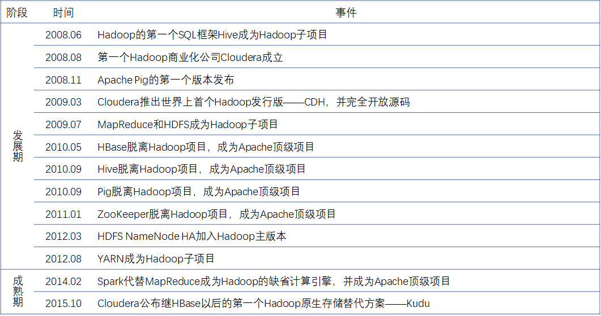

# 大数据简介

1. 概述

## 概述

**什么是大数据？**

大数据是一种在海量数据规模下，满足数据存储与运算的一种技术。

权威定义：大数据是指超出传统数据库工具收集、存储、管理和分析能力的数据集。与此同时，及时采集、存储、聚合、管理数据，以及对数据深度分析的新技术和新能力，正在快速增长，就像预测计算芯片增长速度的摩尔定律一样。

**大数据的特征**

第一个特征：数据规模巨大（Volume）

第二个特征：生成和处理速度极快（Velocity）

第三个特征：数据类型多样（Variety）

第四个特征：价值巨大但密度较低（Value）：价值密度 = 价值 / 总数据量

**大数据应用场景**

1、离线处理

离线处理场景包括数据仓库、搜索与检索

2、实时处理

实时处理场景包含实时流处理

**大数据编年史**

**什么是 HDFS？**

HDFS 全称 Hadoop Distributed File System，Hadoop 分布式文件系统。它是 2003 年 10 月 Google 发表的 GFS（Google File System）论文的开源实现，之后成为 Apache Hadoop 的核心子项目，用于解决海量数据存储问题。它在开源大数据技术体系中，地位无可替代，到现在为止，依然是主流的大数据存储选型。

**设计目标**

HDFS 的设计目标有：

- 可以运行在大量廉价商用机器上；因此硬件错误是常态，所以 HDFS 提供容错机制，来保证集群的安全性与数据的可靠性。
- 简单一致性模型：一次写入多次读取，支持追加，不允许修改，保证数据一致性。因为 HDFS 在数据存储时，会使用多副本机制保证数据的安全性；如果开放修改功能，首先会导致随机修改的出现，这在海量数据的分布式场景下无异是灾难，其次因为多副本的原因，数据修改后，其它副本的数据也一定要进行修改，从而保证数据一致性，这更加重了集群的负担。
- 流式数据访问：批量读而非随机读，关注吞吐量而非时间；HDFS 在设计时就是为了海量数据的存储而生，并且用于支持海量数据的离线批处理，而在离线批处理场景中，数据都是全部被读取后，进行批量处理，所以 HDFS 在设计上更注重数据的批量读而非随机读，保证数据处理时的吞吐效率。
- 存储大规模数据集：典型文件大小 GB~TB，关注横向线性扩展；这是 HDFS 设计的初衷，保证海量数据的存储。

**HDFS 的优缺点**

**优点：**

HDFS 最大的优点在于它支持**海量数据存储**（典型文件大小 GB~TB，百万以上文件数量，PB 以上数据规模），是大数据存储的经典选型。

其次，它有**高容错**（多副本策略）、**高可用**（HA，安全模式）、**高扩展**（10K 节点规模）的特性，作为大数据存储解决方案已经非常成熟。

它**构建成本低、安全可靠**（构建在廉价商用机器上，提供容错机制），**适合大规模离线批处理**（流式数据访问，数据位置暴露给计算框架），为大数据计算提供了支持。

**缺点：**

HDFS 的缺点也很明显，首先它**不适合低延迟数据访问**，因为数据存储到 HDFS 上时，首先要切分成固定大小的块，然后每块数据进行存储时还要进行多副本的备份，所以数据读取时，先要从各个节点将每块数据读取出来，然后再合并成原文件返回，所以访问文件时延迟会比较大；但在数据处理时，其实数据时不需要移动的，计算任务会直接分发到数据节点，这才是 HDFS 的适用场景。

HDFS **不适合大量小文件存储**，因为 HDFS 设计时是主从架构，从节点是数据节点，负责存储数据，而主节点保存元数据（记录数据被存储到那个从节点中），所以小文件越多，主节点保存的元数据也就越多，而元数据大小是固定的，所以会占用 NameNode 大量空间。再一个，在进行计算处理时，一个数据文件上会启动一个计算任务，小文件数量越多，那生成的任务数量也就越多；但单个任务在处理时因为数据量小，运算速度很快，大量的时间被消耗在任务的生成、分发、调度中，造成计算时间大幅度增加。

HDFS **不支持并发写入**，因为在分布式集群中要保证数据的一致性，而并发写入有可能会造成数据不一致的风险。且**不支持文件随机修改**（仅支持追加写入），其实之前已经讲过，在集群中进行文件的随机修改，而且是多副本情况下，会造成很大的负载。

对于 HDFS 这些不适用场景，一定要留意。每个产品设计出来，便会有它的适用场景，在它的适用场景中才会发挥它最大的威力，如果错误适用它，会造成很大的浪费。

**HDFS 系统架构**

HDFS 是主从架构（Master/Slave），当然这也是大数据产品最常见的架构。主节点为 NameNode，从节点为 DataNode。其中 DataNode 用于存储数据，存储的数据会被拆分成 Block 块（默认按照 128M 进行切分），然后均匀的存放到各个 DataNode 节点中，为了保证数据安全性，这些 Block 块会进行多副本的存储，备份到不同的节点。而 NameNode 则负责管理整个集群，并且存储数据的元数据信息（记录数据被拆分为哪几块，分别存储到了哪个 DataNode 中）。DataNode 会通过心跳机制，与 NameNode 进行通信（默认 3 秒），汇报健康状况和存储的 Block 数据信息，如果 NameNode 超过一定时间没有收到 DataNode 发送的心跳信息，则认为 DataNode 宕机，会启动容灾机制。

HDFS Client 是客户端，客户端通过与 NameNode 进行交互，从而实现文件的读写等操作。

NameNode 在没有实现高可用的时候，会存在两个角色，NameNode 和 Secondary NameNode，其中 Secondary NameNode 并不是 NameNode 的热备节点，它只用于辅助 NameNode 的工作（元数据合并），之后会详细讲到。

NameNode 如果实现了高可用，则 NameNode（Active）和 NameNode（Standby）互为热备节点，其中备用节点 Standby NameNode 至少存在一个，除了保证 Active NameNode 宕机后能接替集群管理工作，还用于辅助 NameNode 的工作。但大多数时间，Standby NameNode 处于空闲状态。

接下来按照文件的大致存储过程对 HDFS 中的各个组件进行详细的讲解。当一个 10G 的文件要存储到 HDFS 中的时候，首先在 HDFS Client 客户端会将文件拆分为 Block 块（默认按照 128M 进行拆分），注意文件拆分过程是在客户端进行，这样在大数据场景下可以减轻主节点 NameNode 的压力，拆分后的 Block 块会被存储到 DataNode 中，并且以多副本的形式保存到不同节点。数据存储完成后，NameNode 节点会记录一份元数据，包含存储的文件名，文件被拆分成了哪些 Block 块，每个 Block 块又被存储到了哪些 DataNode 节点。

之后客户端在访问文件的时候，便可以通过 NameNode 的元数据文件，迅速找到 Block 块的存储位置，并读取到客户端，在客户端本地将 Block 块按照顺序进行合并，合并成原文件后返回。这也是 HDFS 不适合低延时数据访问的原因。

**HDFS 存储机制**

**Block 文件存储**

**1. Block 存储**

在 HDFS 中 Block 是 HDFS 的最小存储单元，它和元数据分开存储：Block 存储于 DataNode，元数据存储于 NameNode。

Block 默认大小为 128M，但在早期 HDFS 1.x 中默认是 64M，它作为文件拆分的依据。那假设一个文件大小正好为 129M，它在 HDFS Client 拆分的时候，会被拆分为 2 个 Block 块，一个 128M，剩下一个 1M，但是在 HDFS 中，因为 Block 是最小存储单元，它并不关心每个 Block 块中存储的数据究竟有多大，它只认 Block 块数；所以它在数据计算时，会粗狂的认为这个文件的大小为 128M*2=256M，这也是为什么 HDFS 不适合小文件存储，因为 Block 块是 1M 还是 128M，对于 HDFS 来说是一样的处理过程；所以一个 128M 的文件被拆分为 128 个 1M 的 Block，和被拆分为 1 个 128M 的 Block 进行存储，那它带来的压力显然是不一样的，后者在处理时花费的时间是前者的 128 倍。

Block 的默认大小是可以设置的，但不推荐去更改。Block 大小的设置是有规范的，它的目标是为了最小化寻址开销，降到 1% 以下，以前服务器配置大多为 5400 转磁盘，60~90MB/s，所以设置为 64M 可以一次将 Block 块读取出来；而现在常用 7200 转磁盘，读写大致在 130~190MB/s，所以 128M 也非常适用。

Block 块在存储时，会进行多副本备份，它默认的副本数为 3（1 原数据 + 2 副本），HDFS 在存储副本时，会进行自动机架感知，将副本存放到不同机架的 DataNode 上，实现数据的高容错。并且会在所有 DataNode 中实现副本的均匀分布，减少数据倾斜的出现。

**2. Block 文件**

Block 文件最终会存储到每台 DataNode 节点的磁盘中，是 DataNode 本地磁盘中以“blk_”为前缀的 Linux 文件。DataNode 在启动时自动创建存储 Block 文件的存储目录，无需格式化。

Block 数据在存磁盘的时候，除了数据文件，还有一个元信息文件（*.meta），它包含文件的基本属性（文件大小、类型、权限等）和一系列校验值组成。

**3. Block 副本放置策略**

为了保证 Block 数据的安全性，在第一个副本放置时，会随机选择 DataNode 节点进行存放，优先选择空闲的 DataNode 节点。对于 Client 在 DataNode 节点的（登录到 DataNode 节点，调用客户端进行文件上传），直接存放在当前节点。

如果存在多个机架，副本 2 会放在不同的机架节点上，副本 3 放在与第二个副本同一机架的不同节点上。为什么第 3 个副本不存放到其他机架上呢？因为其实前两个副本放置在不同机架上已经足够保证数据的一致性了，副本跨机架存储是需要一定时间的，第 3 个副本放置在第 2 个副本的同机架上，就是为了保证存储速度。

如果只有单机架，会随机选择空闲节点进行存储。

超过 3 个副本，也会随机选择空闲节点进行存储。

**元数据存储**

**1. 元数据**

元数据（Metadata）存放在 NameNode 内存中，包含 HDFS 中文件及目录的基本属性信息（如拥有者、权限信息创建时间等）、文件有哪些 Block 构成、以及 Block 的位置存放信息。

**2. 元数据的持久化**

为了保证元数据的安全性，需要将元数据持久化到磁盘中。

元数据在持久化存储时，只存储文件基本属性信息、文件有哪些 Block 块构成，至于 Block 的位置信息并不会做持久化。因为在大规模集群中，DataNode 宕机是很常见的事情，所以 Block 的位置信息也会随时变动，而如果在磁盘中保存了 Block 的位置信息，势必会在磁盘中产生大量的随机修改，对 NameNode 是很大的负担。而 Block 位置信息实际上并没有存储的必要，它会随着 DataNode 的心跳（每 3 秒一次）进行上报，DataNode 会汇报当前节点所存储的所有 Block 块，根据这些信息，NameNode 可以动态在内存中将 Block 的位置信息补全。

元数据信息持久化到磁盘，会生成文件 fsimage（元数据镜像检查点文件），但如果只有这一个文件的话，在海量数据规模场景中会出现一些问题。在内存中的元数据文件随着用户的操作，势必会发生变动（对文件进行删除、追加），那对应到磁盘的 fsimage 也会进行频繁的随机修改，这样对于 NameNode 会造成不小的负载。

所以 HDFS 在设计时，还存在一个 edits 文件（编辑日志文件），用于应对这种情况，fsimage 保存的是某个时间点的元数据，之后对元数据的所有修改，都以日志的方式记录到 edits 文件中。因为记录日志的方式，就是将操作记录顺序追加，而对于磁盘，顺序读写效率要远高于随机读写，这样就避免了随机读写造成的主节点负载。

每次 HDFS 集群启动时，NameNode 会将 fsimage 直接加载到内存中，映射成元数据，此时元数据还是较老的版本；之后再加载 edits 文件，按照日志内容依次对元数据进行操作，从而还原最新的元数据。这样的话，edits 文件不能特别大，因为 edits 越大，意味着还原元数据的时间越长，产生 NameNode 假死的情况（实际上是在还原元数据）。所以要定期将 edits 的内容合并到 fsimage 文件中，从而保证 edits 文件的大小不超过某个量级。

**3. 元数据合并**

元数据合并的操作，与 HDFS 集群是否做了高可用有关。如果集群没有做高可用，那么就由 Secondary NameNode 来完成元数据的合并（edits + fsimage）；如果集群做了高可用，就由 Standby NameNode 来完成。

在集群没有做高可用的情况下，Secondary NameNode 会定期将 NameNode 节点的 edits 和 fsimage 文件，通过网络拉取到内存中，将其合并成最新的 fsimage 文件。而主节点 NameNode 的 edits 文件被拉取的时候，会生成一个 edits.new 文件用于保存在合并期间对元数据的所有操作记录。

Secondary NameNode 将合并之后的 fsimage 推送到 NameNode 节点后，会替换掉原有的 fsimage；此时 edits.new 文件也会成为新的 edits 文件。

集群做了高可用（QJM 方式）之后，元数据文件 edits 除了本地会保存之外，也会被远程存储到第三方集群 JournalNode 中，以便于进行主备切换时，元数据信息不丢失。所以 Standby NameNode 在进行元数据合并时，只需要从 JournalNode 中取到 edits 文件，进行合并即可。而 Active NameNode 和 Standby NameNode 中在初始化启动时，fsimage 是保持一致的（都为空），Standby NameNode 在合并完元数据后，将 fsimage 保存一份在本地，并直接推送到 Active NameNode 中即可。

**读写机制**

**1. 写操作**

在向 NameNode 写文件时，首先由客户端向 NameNode 发起文件上传请求，NameNode 检查文件要上传的目录，并鉴权。

如果上传用户对此目录有权限，则允许客户端进行上传操作。客户端接收到允许指令后，将要上传的文件切分为 Block，之后按照顺序依次上传 block1、block2……block N，这也是为什么说 HDFS 无法进行并发写的原因。

首先上传 block1，向 NameNode 发起请求，NameNode 会按照 block 副本放置策略，为 block1 选择合适的 DataNode 节点，并按照与客户端的路由由近到远的顺序进行排序，之后将 DataNode 列表返回给客户端。

客户端接收到 DataNode 列表后，便按照列表顺序（由近到远），依次与 DataNode 建立管道连接，首先将 block1 发送到最近的 DataNode 中，当数据写入到 DataNode 内存时，当前 DataNode 会将数据通过管道分发到第二个 DataNode 节点，以此类推。

当最后一个 DataNode 接收到数据之后，便通过管道依次向上返回成功信息。客户端接收到成功信息后，便向 NameNode 报告 block1 写入成功，然后按照此步骤，依次存储剩余的 block。

所有的 block 存储完成后，NameNode 会在内存中生成文件所对应的元数据，提供数据查询功能。

**1. 读操作**

读取操作相对较为简单，客户端首先向 NameNode 发起读取文件的请求，NameNode 鉴定用户权限。如果用户对文件有读取权限，则查询文件的元数据信息，将文件块的组成和存储位置按照与客户端的路由距离由近到远排序后返回给客户端。

客户端接收到 NameNode 的返回后，依次与最近的 DataNode 进行连接，读取 block 数据，此时可以并发读取。所有的 block 读取完成后，便在客户端中，将 block 组装成文件，返回给用户。

**安全模式**

**什么是安全模式？**

安全模式是 HDFS 的一种特殊状态，在这种状态下，HDFS 只接收读数据请求，而不接收写入、删除、修改等变更请求。它是 HDFS 确保集群安全的一种保护机制， NameNode 如果检测到任何异常，便会进入到安全模式，直到问题解决。

**触发安全模式的原因**

**1. DataNode 主动向 NameNode 汇报可用 Block 列表等信息**，当 Block 上报率 <= 阈值时（默认阈值为 0.999），会处于安全模式。

假设 HDFS 中存储有 1000 个 Block 块，现在所有的 DataNode 只汇报给 NameNode 90 个 Block 的位置信息，那么 HDFS 会认为系统处于异常状态，为了保证系统的安全性，此时 HDFS 只允许读取，而不允许写入。

默认情况下，当 Block 的上报率（DataNode 上报的可用 Block 个数/NameNode 元数据记录的 Block 个数）小于 0.999 时，便会进入安全模式，这个阈值允许按照不同的生产情况进行修改。

造成上报率缺失的常见情况有：NameNode 重启、DataNode 无法正常启动。当 NameNode 重启后，因为 Block 位置信息不会持久化到磁盘，被清空，在等待 DataNode 逐渐上报的过程中，且达到阈值之前会一直处于安全模式。而 DataNode 无法正常启动，也会造成当前节点的 Block 信息丢失。

当 Block 上报率 >= 阈值时，HDFS 才能离开安全模式，默认阈值为 0.999。也可以使用命令强制退出安全模式，但不推荐，数据已经缺失，此操作可能造成文件丢失的风险。

**2. 元数据出现不一致情况**

当元数据文件被用户手动修改，数据回滚导致元数据替换，用户强制关机导致元数据丢失，或者 NameNode 磁盘空间不足导致元数据无法持久化保存，都会导致 HDFS 进入安全模式。

**3. 日志中出现严重异常**

**4. 管理员手动进入安全模式**

**如何正常离开安全模式？**

排查集群进入安全模式的原因，对症下药。

因为上报率的缺失，则排查 Block 信息缺失原因，等待集群 Block 信息上报、手动恢复宕机的 DataNode，当 Block 上报率 >= 阈值时，HDFS 会自动退出安全模式。

元数据出现损坏，则恢复元数据后，自动或手动退出安全模式。如果是 NameNode 磁盘空间不足，清理 NameNode 磁盘后，会自动退出安全模式。

其它集群报错问题，解决集群报错后，自动退出。

但如果是管理员手动进入安全模式后，只能手动通过命令退出安全模式。

**HDFS 集群高可用**

单节点架构存在的问题

HDFS 单点架构存在一些问题，首先是 NameNode 内存受限，因为数据的元数据信息全部保存在 NameNode 内存中。如果数据量足够庞大，可能会将 NameNode 内存占满，这种情况下会导致 HDFS 的扩展性上限。

其次就是单点故障问题，主从架构的 HDFS 是依靠主节点 NameNode 来运转的，一旦主节点挂掉就会导致整个集群不可用。

**Federation（联邦）机制**

联邦机制是 Hadoop 2.x 中提出的解决 NameNode 内存瓶颈问题的水平横向扩展方案。

它将多台 NameNode 组成联邦，每一台 NameNode 负责存储一部分元数据信息，共同负责 HDFS 的正常运行。

联邦机制解决了 NameNode 单点的内存限制，提升了 HDFS 的扩展性能。

**NameNode High Availability（高可用）机制**

NameNode High Availability 高可用机制是 Hadoop 2.x 中提出的，用于解决 NameNode 单节点故障问题的方案。实现高可用，至少提供两台 NameNode 做热备：Active、Standby，其中 Active 作为主节点，而 Standby 为备份主节点。当一台 NameNode 宕机，另外一台需要保持元数据一致（fsimage、edits），并且完成状态切换。

QJM 和 NFS 机制是 NameNode HA 的两种实现方式，主流的方案为 QJM。

**使用 QJM 实现元数据 edits 文件高可用**

当主节点挂掉后，备份节点为了保证与主节点的元数据一致，需要获取主节点上的 edits 文件，从而恢复最新的元数据。而 fsimage 因为最初集群初始化的时候，在 Active 和 Standby 中是一致的（均为空），而且 Standby 在合并完元数据之后，会在本地保存一份最新的 fsimage。

但主节点挂掉后，磁盘中的 edtis 文件便无法进行获取，稳妥的方案是将 edits 文件存储到第三方集群中，这样主节点的宕机对第三方集群并不产生影响。

QJM 方案中，使用的三方集群为 JournalNode，它负责存储 edits 编辑日志；一般部署奇数（2N+1），因为它的算法模式基于 Paxos 算法实现，超过半数的 JournalNode 返回成功，就代表写入成功。JournalNode 集群最多可容忍 N 个 JournalNode 宕机。

**QJM 高可用方案**

在 QJM 高可用方案中，最重要的是角色是 JournalNode 集群，用于存储 edits 文件，实现主备间的元数据同步。除此之外，高可用集群还需要完成主备状态的切换操作，这个过程由 ZooKeeper 来完成。在搭建单点 NameNode 的 HDFS 集群时，ZooKeeper 是非必须的，但在 HA 集群搭建中，必须依赖 ZooKeeper 集群。

集群启动后，ZooKeeper 会启动 FailoverController 用于监控 NameNode 的存活情况，并定期通过心跳向 ZooKeeper 汇报。如果 Acitve NameNode 的状态超过一定时间没有汇报给 ZooKeeper，则 ZooKeeper 会移除它的 Active 状态，从所有的 Standby 节点中选举新的 Active。

在 ZooKeeper 中是怎么实现这种主从切换的？简单来说就是锁。ZooKeeper 为 HDFS 创建一个选举用的目录（当然在 ZooKeeper 中，目录和文件是一回事），这个目录下只能创建一个文件，这个文件就是锁；所有的 NameNode 都来竞争创建这个文件，谁第一个创建完成，则成为 Active 节点，其余的节点为 Standby。当然在分布式环境中，实现起来会比较复杂，如果有兴趣，大家可以去深入了解一下这里的原理。

HDFS 高可用的推出，也意味着大数据技术成熟的标志，HDFS 能够真正投入生产环境进行使用。