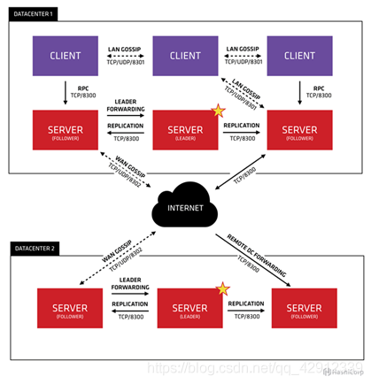

# Consul命令

Consul 和 Eureka 一样，是用于分布式系统中服务注册和发现。与其它方案相比，Consul更加“一站式”：内置服务注册与发现框架、分布一致性协议实现、健康检查、Key/Value存储、多数据中心方案，不再需要依赖其他工具（比如ZooKeeper等），与docker容器配合。

Consul 是一个支持多数据中心分布式高可用的服务发现和配置共享的服务软件。

官方URL：https://www.consul.io/

Consul各版本更新细节介绍：https://github.com/hashicorp/consul/blob/v1.4.0/CHANGELOG.md

关于raft算法和gossip协议介绍：https://www.backendcloud.cn/2017/11/12/raft-gossip/

**集中配置管理：**

将程序的配置参数以KEY/VALUE的方式配置在界面上，配置后的KEY/VALUE将存储在consul内部的"kv store"中，程序从"kv store"拉取属于自己的配置写入配置文件。

以此方式管理配置文件，只需要在界面上修改某行参数，再重启相应的程序即可获取最新的配置参数。

**数据中心与Gossip池：**



每个数据中心可以视为一个地区，每个数据中心内存在一个LAN Gossip池，它包含数据中心的所有成员——client和server。

LAN池用于以下几个目的：

1. 成员关系运行，client自动发现server，减少配置量
2. 分布式的故障检测，允许故障检测的工作由整个集群承担，而不是集中在少数server上
3. Gossip池允许可靠和快速的事件广播，比如leader选举。

多个数据中心根据consul keygen构成一个集群，一个集群存在唯一一个WAN Gossip池，所有的server都加入 WAN Gossip池，不论是哪个数据中心的。WAN池提供的成员关系，允许server执行跨数据中心请求。

**命令说明：**

- `--net=host`：采用主机网络配置，若采用默认的 bridge 模式，则会存在容器跨主机间通信失败的问题  

- `-v /data/consul_data/data:/consul/data`：主机的数据目录挂载到容器的 `/consul/data` 下，因为该容器默认的数据写入位置即是 `/consul/data`  

- `-v /data/consul_data/conf:/consul/config`：主机的配置目录挂载到容器的 /consul/conf 下，因为该容器默认的数据写入位置即是 `/consul/conf`  

- `consul agent -server`：consul 的 server 启动模式 。概念：

  - `Agent`：Consul集群中长时间运行的守护进程，以`consul agent` 命令开始启动. 在客户端和服务端模式下都可以运行，可以运行DNS或者HTTP接口， 它的主要作用是运行时检查和保持服务同步。
  - `Client`：客户端，无状态，以一个极小的消耗将接口请求转发给局域网内的服务端集群。
  - `Server`：服务端，保存配置信息，高可用集群，在局域网内与本地客户端通讯，通过广域网与其他数据中心通讯。每个数据中心的 server 数量推荐为 3 个或是 5 个。
  - `Datacenter`：数据中心，多数据中心联合工作保证数据存储安全快捷
  - `Consensus`：一致性协议使用的是Raft Protocol
  - `RPC`：远程程序通信
  - `Gossip`：基于 Serf 实现的 gossip 协议，负责成员、失败探测、事件广播等。通过 UDP 实现各个节点之间的消息。分为 LAN 上的和 WAN 上的两种情形。

- - `Client`： 客户端,，无状态，以一个极小的消耗将接口请求转发给局域网内的服务端集群
  - 

- `consul agent -bind=10.30.100.103`：consul 绑定到主机的 ip 上，执行结果为`Successfully joined cluster by contacting 1 nodes.`表示添加成功。在任意一台机器上执行`consul members`都能查看到集群列表。

- `consul agent -bootstrap-expect=2`：server 要想启动，需要至少 2 个server  

- `consul agent -data-dir /consul/data`：consul 的数据目录  

- `consul agent -config-dir /consul/config`：consul 的配置目录 

  > 指定加载置文件的目录，我们只需要填写配置文件的目录就可以帮助我们把该目录下所有的以.json结尾配置文件加载进去，它的加载顺序是根据26个字母的顺序加进行加载配置文件的。文件内容都是json格式的数据。默认后面文件定义配置会覆盖前面文件定义的配置。

- `consul agent -join 10.30.100.104`：对于主机二来说，需要加入到这个集群里

- `node`：节点id，集群中的每个 node 必须有一个唯一的名称。默认情况下， Consul 使用机器的 hostname

- `bind`：监听的 ip 地址。默认绑定 0.0.0.0，可以不指定。表示 Consul 监听的地址，而且它必须能够被集群中的其他节点访问。Consul 默认会监听第一个 private IP，但最好还是提供一个。生产设备上的服务器通常有好几个网卡，所以指定一个不会出错

- `client`：客户端的ip地址，0.0.0.0是指谁都可以访问（不加这个，下面的ui :8500无法访问）

- `ui`: 可以访问UI界面

consul为我们提供其它的配置文件属性：

- acl_token：agent会使用这个token和consul server进行请求
- acl_ttl：控制TTL的cache，默认是30s
- addresses：一个嵌套对象，可以设置以下key：dns、http、rpc
- advertise_addr：等同于-advertise
- bootstrap：等同于-bootstrap
- bootstrap_expect：等同于-bootstrap-expect
- bind_addr：等同于-bind
- ca_file：提供CA文件路径，用来检查客户端或者服务端的链接
- cert_file：必须和key_file一起
- check_update_interval：
- client_addr：等同于-client
- datacenter：等同于-dc
- data_dir：等同于-data-dir
- disable_anonymous_signature：在进行更新检查时禁止匿名签名
- enable_debug：开启debug模式
- enable_syslog：等同于-syslog
- encrypt：等同于-encrypt
- info：consul运行状态信息
- keygen：生成consul集群的key
- key_file：提供私钥的路径
- leave_on_terminate：默认是false，如果为true，当agent收到一个TERM信号的时候，它会发送leave信息到集群中的其他节点上。
- log_level：等同于-log-level node_name:等同于-node
- monitor：查看consul运行日志
- members：查看 consul lan gossip 中的IP（同一DC中的server和client）；`-wan` 查看 consul wan
  gossip 中的IP（不同DC中的server）
- `consul join -wan x.x.x.x` 在Server节点执行，将该节点所在数据中心加入其他数据中心
- ports：这是一个嵌套对象，可以设置以下key：dns(dns地址：8600)、http(http api地址：8500)、rpc(rpc:8400)、serf_lan(lan port:8301)、serf_wan(wan port:8302)、server(server rpc:8300) 
- protocol：等同于-protocol
- rejoin_after_leave：等同于-rejoin
- retry_join：等同于-retry-join
- retry_interval：等同于-retry-interval 
- server：等同于-server
- syslog_facility：当enable_syslog被提供后，该参数控制哪个级别的信息被发送，默认Local0
- `consul snapshot save kv_bak.snap` 备份KV
- `consul snapshot restore kv_bak.snap` 导入备份的KV数据
- ui_dir：等同于-ui-dir

更多命令及参数请参考：[Consul参数大全](https://blog.csdn.net/sssosssjdgjiff/article/details/88753583)

**常见问题：**

1、Multiple private IPv4 addresses found. Please configure one with ‘bind’ and/or ‘advertise’.

出现这个问题的原因是，有多张网卡，所以就有了多个ip4的地址，解决方案，就是绑定ip地址到局域网卡，
加上 -bind 192.168.xxx.xxx 参数即可

2、data_dir cannot be empty

consul agent -server运行的时候需要指定 data_dir

格式如下：

```sh
consul agent -server -bind 192.168.153.130 -client 0.0.0.0 -ui -data-dir=/usr/bin/data
```

3、consul ui界面只能在本机访问，不能在其他电脑访问的解决办法，启动方法如下

```sh
consul agent -dev -client 0.0.0.0 -ui
```

4、删除无效的实例节点

```sh
# paas-portal-sit-9003 （服务名称id）
curl http://server_ip:8500/v1/agent/service/deregister/paas-portal-sit-9003 -X PUT
# 节点删除：4b36b27317a0（节点ID）
http://server_ip:8500/v1/agent/force-leave/4b36b27317a0
```

**运行一个Consul Server**

```sh
docker run -d -p 8300-8302:8300-8302 -p 8500:8500 -p 8600:8600 \
--restart=always \
-h node1 \
--name consul  \
consul agent \
-server \
-bootstrap-expect=1 \
-node=node1 \
-rejoin \
-client 0.0.0.0 \
-advertise 192.168.99.100 \
-ui
```

为了consul server能稳定提供服务,一般都建议有3-5个consul server组成集群。如果有很多台机器,在启动足够的consul server后,其它主机可以都作为client运行.

**运行一个Consul Client**

```sh
docker run -d -p 8500:8500 -p 8300-8302:8300-8302 -p 8600:8600 \
--restart=always \
-h node2 \
--name consul  \
consul agent \
-node=node2 \
-rejoin \
-client 0.0.0.0 \
-join 192.168.99.100 \
-advertise 192.168.99.101
```

注意 `-join`到consul server即可

**服务发现**

consul提供了很多方式来注册，如通过json配置服务放到相关目录让agent注册，服务调用相关API注册，Docker容器发现。

如果我们服务都是运行在Docker之中，用Docker容器发现相关技术会方便点，所以优先考虑了这个.

1. 可以在不改动代码的同时实现服务发现注册

2. 可以和eureka发现同时存在，可以平缓过度.

相关实现的开源可选工具官方推荐了两个`ContainerPilot`和`Registrator`.

由于ContainerPilot使用更为复杂点，registrator比较简单，文档多，所以优先考虑了它.

**[Docker Registrator](https://github.com/gliderlabs/registrator)主要特点：**

- 通过docker socket直接监听容器event，根据容器启动/停止等event来注册/注销服务
- 每个容器的每个exposed端口对应不同的服务
- 支持可插拔的registry backend，默认支持Consul, etcd and SkyDNS
- 自身也是docker化的，可以容器方式启动
- 用户可自定义配置，如服务TTL（time-to-live）、服务名称、服务tag等

**运行registrator**

```sh
docker run -d \
    --name=registrator \
    --net=host \
    --volume=/var/run/docker.sock:/tmp/docker.sock \
    gliderlabs/registrator:latest \
    -internal \
    -ip 192.168.99.101 \
      consul://192.168.99.101:8500
```

> 每台机都要运行一个Registrator，consul地址填同机的consul agent

这时候，你只要在机子上运行任意一个docker容器，只要它暴露端口，就会被当成一个服务注册过去，如果没有指定服务名字之类的，默认取得服务名字作为服务名，服务id则为[hostname+端口]。

**Registrator服务对象**

```json
type Service struct {
    ID    string               // unique service instance ID
    Name  string               // service name
    IP    string               // IP address service is located at
    Port  int                  // port service is listening on
    Tags  []string             // extra tags to classify service
    Attrs map[string]string    // extra attribute metadata
}
```

可以通过运行docker服务的时候，传入环境变量`SERVICE_<属性>=值`，Registrator会读取得到它的相关的环境变量。如：

```sh
docker run -d --name redis.0 -p 10000:6379 \
    -e "SERVICE_NAME=db" \
    -e "SERVICE_TAGS=master,backups" \
    -e "SERVICE_REGION=us2" progrium/redis
```

**参考资料**

- [现有系统如何集成Consul服务发现](https://www.jianshu.com/p/28c6bd590ca0)
- [Registrator Quickstart]([http://gliderlabs.github.io](http://gliderlabs.github.io/) /registrator/latest/user/quickstart)
- [Registrator Service Object](http://gliderlabs.github.io/registrator/latest/user/services/)
- [Consul Docker](https://hub.docker.com/_/consul/)
- [Consul Documentation](https://www.consul.io/docs/index.html)
- [Consul API](https://www.consul.io/api/index.html)
- [Consul Documentation Translation](http://www.liangxiansen.cn/2017/04/06/consul/)

- https://uublog.com/article/20180802/consul-cluster/