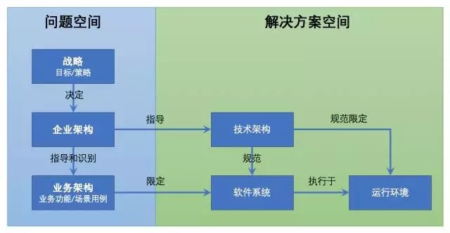
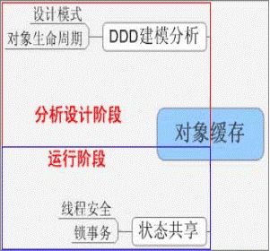

# 领域驱动设计

**什么是领域驱动设计？**

领域驱动设计，英文：Domain Driven Design，简称：DDD，是一套综合了软件系统分析和设计的面向对象建模方法。

过去系统分析和系统设计是分离的，这样割裂的结果导致，需求分析的结果无法直接进行设计编程。DDD打破了这种隔阂，提出了领域模型概念，统一了分析和设计编程，使得软件能够更灵活快速跟随需求变化。

我们引入比较抽象的两个概念：问题空间(Problem Space)和解决方案空间(Solution Space)

1. 所谓问题空间，简单理解就是当前环境下业务所面临的一系列问题和背后的需求。它属于产品规划阶段，通常是业务或产品领域专家主导，进行问题和需求的收集、描述及分析；
2. 而解决方案空间则是针对问题空间的解决方案，它思考的是如何设计实现软件系统以解决这些问题，它属于工程设计实施阶段，通常是技术专家主导的解决方案设计和实现。

因此，本质上，软件开发过程可以看做是问题空间到解决方案空间的一个映射转化。如下图所示：

上图还可以进一步细分成如下图所示的互联网软件从业人员容易理解的一个映射转化过程：

**领域**相对于软件系统来说，就是系统要解决的现实问题。因此也可以简单理解**一个领域就对应一个问题空间**，是一个特定范围边界内的业务需求的总和。

**领域模型**则是针对特定领域里的关键事物及其关系的可视化表现。它属于解决方案空间，是为了准确定义需要解决的问题而构造的抽象模型，是业务功能场景在软件系统里的映射转化。

**为什么需要领域驱动设计？**

从遇到问题开始：

在信息化时代，人们在碰到问题的时候，经常会希望通过构建一套软件系统来解决问题。每个软件系统本质上都解决了特定的问题，都属于某一个特定领域，都实现了自己的核心业务功能来解决该领域里最核心的业务需求。

所以才有这样的说法：

领域来自于需求，但它却高于需求，相对于善变的需求而言，**领域知识**和**领域模型**本身是**静止**的，是**不变**的。

领域建模分为**战略建模**和**战术建模**两个层面，要对领域进行建模得到优秀的领域模型，必须先要对行业领域的业务有比较深入的理解，才能从复杂环境中找出**领域核心问题**，然后对它展开梳理。

通常来说，一个领域有且只有一个核心问题，我们通常称之为该领域的**核心子域**。领域的战略建模通常就是从找出**核心子域**开始的。其次，在核心子域及通用子域和支撑子域梳理的同时，会定义出子域中的**Bounded Context（限界上下文）**及其关系，用它来阐述子域之间的关系。最后，就是找出每个子域中的关键**领域实体**进行抽象提炼，并根据业务本质找出它们之间的联系。

**为什么要建模？**

因为建模是帮我们提炼出事物的本质，以便能更好的指导应用系统规划建设。

在进行DDD实践的过程中，我们完全可以将系统所有的对象都建模为一个模型，这个模型中包含了系统中所有的对象，这样做可以，但是这样一来就会使得领域模型变得非常大，同时也增加了领域模型维护和改进的难度，因此需要一种机制来使得领域模型能划分的更细一点，这就是所谓的**Bounded Context（限界上下文）**。

**限界上下文**可以简单理解成一个子系统或组件模块，它放在哪个子域里更为合理是受到场景制约的。有时候，同样一个业务甚至同一个**实体**，会出现在不同的子域里，结合该子域的上下文来进行不同的描述。领域和界限上下文的划分并没有标准，它是依据每个人对特定业务不同程度的理解和抽象程度而不同的。评判一个领域模型是否合理，只能放到特定的业务背景和场景下才会相对客观。

在大的领域模型中划分小的子领域，在扩展维护或者对领域模型进行重构的时候，影响就会小很多。拿大家熟悉的电子商务领域来说，整个领域模型是很庞大的，因此很有必要将其划分为小的子领域。比如在购物的时候，我们有个 Shopping 的概念，在下订单的时候有Order 的概念，这些其实就是不同子边界的上下文：Shopping Context 和 Order Context。当需求变化时，我们只需要在对应的子领域中修改，而不需要大动干戈！

最后根据战略建模的结果，进行领域模型上的战术建模：**领域模型图**

根据核心子域里的界限上下文及核心场景，抽象出领域实体及其关系，并用**概念类图**的方式呈现出来。

领域模型图有很多的画法，但最重要的是要让业务和技术等各方干系人都能理解这张图表达的涵义，以此形成统一的共识。怎么画并不是关键，最关键的是明白领域模型要解决什么问题，然后才能把这个问题毫无歧义的表述成一张图来凝结各方共识。

领域建模不是面向技术的一种纯软件设计方法，它是一种思维方式，我们采用它来搭建领域模型，以此弥补业务和代码之间的隔阂，促进团队合理的分工协作，同时也真实的反映我们所要解决的问题，让我们构建的系统富有价值和生命力。

所以，领域模型的价值不在于它的设计优美﹐而在于它体现了系统的核心价值！那么什么是系统的核心价值？简单来讲，就是系统提供的服务及其服务质量，也就是它能解决的问题及解决的程度。

软件的目标是快速地响应客户的需求变更，传统的软件开发方式割裂了软件的功能性需求和非功能性需求，首先业务人员分析好需求以后，拿给开发人员进行开发，这样就使得软件的功能性需求依赖于某一种技术，甚至有时候还会造成软件系统离开一两个开发人员就不能维护了，这其实都是将功能性需求和非功能性需求分离造成的后果。

采用领域驱动的开发方式，最终系统形成通用的**领域模型**。这个模型是完全面向业务的，这个模型是业务人员和开发人员都能容易理解的，同时这个模型也如实的反映了领域实质，这样一来软件不是依赖于某种技术，同一个模型可以用不同的技术来实现。

**为什么领域模型容易理解？** 因为大家说的是同一种语言

领域驱动设计引入了 Ubiquitous Language 的概念，UL 是业务专家或者领域专家和开发者采用的**通用语言**，在讨论中，开发者和领域专家都通过 UL 进行讨论，这样就避免了领域专家和开发者用不同的术语描述同样的概念，引起混淆。

**Ubiquitous Language** 更加侧重于业务和领域方面的术语，而不是技术术语。作为开发人员，讨论中经常会引入一些技术方面的术语，这应该是所有开发者的通病，在领域驱动设计中，所有参与项目的人共用统一的通用语言。无论是 BA、PL、PM、SE 还是开发人员，在讨论的过程中统一使用通用语言。

与此同时，采用领域模型以后，领域模型是一个对象模型，而这个对象模型容易理解，容易维护，容易复用，同时加入分布式缓存系统以后，对象模型是具有伸缩性的，因此领域模型在分析之初就将功能性需求和非功能性需求统一在了一起。采用领域驱动设计以后，软件系统的功能性需求和非功能性需求完美的统一了。

这里也科普一下一般系统中都有哪些非功能性需求：

1. Extendability（扩展性）  

   任何事物都处于发展变化当中，软件也不例外，因此一个软件系统必须要有良好的可扩展性，当需求发生变化时，软件如何跟上变化，如何更快的加入新功能，是一个设计良好的软件系统应该具有的性质。

2. Maintainability（维护性）  

   从哲学的角度来说，任何一种事物都是有生命的，软件也不例外，在软件的生命周期当中，难免会出现要对软件进行维护，而一些软件系统由于文档，代码，注释等等的原因，造成了软件的维护性很差，维护成本很高，因此一个好的软件系统必须要要具有良好的维护性。

3. Reuseability（复用性）  

   复用的概念可以说已经充斥在我们每个人的日常的生活当中，同样的软件系统也应该有复用性，一个设计良好的软件系统，它的内部各种组件都是良好复用的，在需要一些功能的时候，可以通过已经存在的组件来构造，而不是每个功能都重头来做一遍，这样不仅增大了开发成本，减低了开发的效率，同时这个软件系统的复用性就降得很低。

4. Scalability（伸缩性）：垂直、水平

   软件的可伸缩性是指在软件系统负载变大的时候，只需要增加更多的资源就可以应对更大的负载，响应更多用户的请求。

   软件的伸缩通常有横向和纵向：

   - 横向就是指水平伸缩性，在负载增多的时候，我们增加更多的逻辑单元，让这些逻辑单元就像是同一个单元一样
   - 纵向就是指垂直伸缩性，指对同一个逻辑单元进行增强，比如增加CPU，增加内存，增加更快速的磁盘等等  

   在软件的的伸缩性中，垂直伸缩往往是受限制比较大的，并且成本也比较高，一个普通的服务器，不可能无限的增加CPU，增加内存等，因此总是有个限制。而水平伸缩，限制就会小很多，但是如何设计我们的软件系统使其更加具有伸缩性，这也是一个大的挑战。采用领域驱动设计和缓存的方式，就可以提高软件的的水平伸缩性。

5. Performance（性能）：多快、多大

   软件系统快不快，能支持多少用户，在支持大用户量的时候是否还能保持某一个响应速度，这就是性能考量的方面。

**为什么要引入领域驱动设计？**

回归主题，要回答这个问题，我们还需要先谈谈目前项目中存在的问题：

1. 不注重软件的生命周期

   漠视非功能需求中的性能和可伸缩性，当进入用户数量快速增长阶段时，系统问题频发，扩展代价大

2. 过分依赖数据库编程

   数据库最容易成为性能瓶颈，过分依赖必然增加宕机概率

3. 面向过程思维

   大量业务逻辑都在服务层(Service)实现，对象都是贫血的，没有行为，只是数据容器。"action -> service -> dao" 这种方式适用于中小型项目，大型项目中 service 就会变得非常复杂，而且很难理解它所要表达的业务思想。对象应该有自己的行为，应该是充血的，这样更符合现实场景，也更容易理解！

4. 不能快速响应需求变化

5. 需求分析和设计不匹配

6. 不重视对象的生命周期

综上所述，我们可以知道：

1. DDD通过领域建模提供了一种更好更合理的软件设计方法

   依靠**领域模型**这个中间产物能够：

   1. 准确定义待解决的问题（业务需求）
   2. 弥补业务和代码之间的隔阂（通用语言，容易理解）
   3. 很好地应对“需求是不断变化的”这个怪兽（静止不变、易维护）
   4. 技术无关、可伸缩、可复用

服务器后端发展三个阶段：

1. UI + DataBase 的两层架构，这种面向数据库的架构没有灵活性。
2. UI + Service + DataBase 的多层SOA架构，这种服务+表模型的架构易使服务变得臃肿，难于维护拓展，伸缩性能差，见这里讨论或Spring Web应用的最大败笔。
3. DDD + SOA 的事件驱动的CQRS读写分离架构，应付复杂业务逻辑，以聚合模型替代数据表模型，以并发的事件驱动替代串联的消息驱动。真正实现以业务实体为核心的灵活拓展。

DDD 革命性在于：领域模型准确反映了业务语言，而传统 J2EE 或 Spring + Hibernate 等事务性编程模型只关心数据，这些数据对象除了简单 setter/getter 方法外，没有任何业务方法，被比喻成失血模型，那么领域模型这种带有业务方法的充血模型到底好在哪里？

以比赛Match为案例，比赛有“开始”和“结束”等业务行为，但是传统经典的方式是将“开始”和“结束”行为放在比赛的服务Service中，而不是放在比赛对象本身之中。我们不能因为用了计算机，用了数据库，用了框架，业务模型反而被技术框架给绑架，就像人虽然是由母亲生的，但是人的吃喝拉撒母亲不能替代，更不能以母爱名义肢解人的正常职责行为，如果是这样，这个人就是被母爱绑架了。

提倡充血模型，实际就是让过去被肢解被黑(crack)的业务模型回归正常，当然这也会被一些先入为主或被洗过脑的程序员看成反而不正常，这更是极大可悲之处。看到领域模型代码，就看到业务需求，没有翻译没有转换，保证软件真正实现“拷贝不走样”。

DDD 最大的好处是：接触到需求第一步就是考虑领域模型，而不是将其切割成数据和行为，然后数据用数据库实现，行为使用服务实现，最后造成需求的首肢分离。DDD 让你首先考虑的是业务语言，而不是数据。重点不同导致编程世界观不同。

DDD 是解决复杂中大型软件的一套行之有效方式，在国外已经成为主流。DDD 认为很多原因造成软件的复杂性，我们不可能避免这些复杂性，能做的是对复杂的问题进行控制。而一个好的领域模型是控制复杂问题的关键。领域模型的价值在于提供一种通用的语言，使得领域专家和软件技术人员联系在一起，沟通无歧义。

DDD 在软件生产流程中定位如下图，DDD 落地实现离不开 in-memory 缓存、CQRS、DCI、EDA 或 Event Source 几大相关领域。

总之：

1. 我们做任何一个软件系统，都是有原因的，都是要解决特定的问题的，否则就没必要做这个系统。
2. 所以通过问题，我们就知道了我们需要一个什么样的系统，这个系统解决了什么样的问题。而问题可以理解成是现状与预期的落差，这个落差就是真正需求的来源。

3. 于是最后我们就很自然的得出了一个目标，即知道了自己的需求是什么，通过做哪些事情来让未来达到预期。

**参考：**

- 《领域驱动设计》，作者：Eric Evans
- [解道](https://www.jdon.com/ddd.html)网站

## DDD和微服务杂谈

领域驱动设计是由 Eric Evans 在一本《领域驱动设计》书中提出的，它是针对复杂系统设计的一套软件工程方法；而微服务是一种架构风格，一个大型复杂软件应用是由一个或多个微服务组成的，系统中的各个微服务可被独立部署，各个微服务之间是松耦合的，每个微服务仅关注于完成一件任务并很好地完成该任务。

两者之间更深入的关系，主要体现在：领域驱动设计中限界上下文与微服务之间的映射关系。假如限界上下文之间需要跨进程通信，并形成一种零共享架构，则每个限界上下文就成为了一个微服务。在微服务架构大行其道的当今，我们面临的一个棘手问题是：如何识别和设计微服务？领域驱动的战略设计恰好可以在一定程度上解决此问题。

领域驱动设计从未真正“辉煌”过，所以也谈不上再续辉煌，但确实是因为微服务引起了社区对它的重燃热情。推行领域驱动设计确实有许多阻力，一方面要做到纯粹的领域驱动设计，许多团队成员的技能达不到；另一方面，似乎领域驱动设计带来的价值不经过时间的推移无法彰显，这就缺乏足够的说服力让一家公司不遗余力地去推广领域驱动设计。微服务似乎给了我们一个推动领域驱动设计的理由！因为软件系统的微服务化已经成为了一种潮流，领域驱动设计又能够为微服务化保驾护航，还有什么理由不推行呢？

未来 DDD 的发展可能会出现以下趋势：

- 以函数式编程思想为基础的领域建模理念与事件驱动架构和响应式编程的结合，可能在低延迟高并发的项目中发挥作用。这种领域驱动设计思想已经比较成熟，但目前还没有看到太多成功的运用。

- 以 DDD 设计方法为基础的框架的出现，让微服务设计与领域建模变得更加容易，降低领域驱动设计的门槛。

在《实现领域驱动设计》一书中，Vernon 不仅对整个领域驱动设计过程作了一番有益的梳理，还结合社区发展在书中引入了 **六边形架构** 和 **领域事件** 等概念。原来领域驱动设计并不是一套死板的方法，而是一种设计思想、一种开放的设计方法体系，只要有利于领域驱动设计的实践，都可以引入其中。于是，可以大胆地引入用例、敏捷实践、整洁架构，以期为领域驱动设计提供补充。

Eric Evans 的《领域驱动设计》是以面向对象设计作为模型驱动设计的基础，但时下被频繁运用的函数式编程思想也给模型驱动设计带来了另一种视角。从开放的设计方法体系的角度讲，我们完全可以把更多的编程范式引入到领域驱动设计中。因为有了更多的选择，针对不同的业务场景就可以选择更适合的 DDD 实践，而不仅仅限于 Eric Evans 最初提出的范畴。

笔者在 ThoughtWorks 的时候，公司邀请《实现领域驱动设计》作者 Vaughn Vernon 到北京 Office 做了一次 DDD 培训。借着这次亲炙大师教诲的机会，笔者向他请教了一个一直缠绕在心中困惑不解的问题：“如何正确地识别限界上下文？”结果他思考了一会儿，严肃地回答了笔者：“By experience！” 

笔者之前在 ThoughtWorks 的同事郑晔（校长）提过一个建议，就是**打造自己的技术标签**。例如，现在 DDD 就成为了笔者其中的一个技术标签。这个说法的内在含义：

1. **目标：**寻找和定位自己的技术发展方向，然后往更深的方向钻研，最终成为这个方向的技术专家。
2. **方法：**结合自己的能力特长、兴趣点以及技术发展趋势去规划自己的技术发展方向，才是技术人员最应该思考并践行的。

领域驱动设计的目的是应对软件复杂度。

领域驱动设计的核心是“领域”，也是进行软件设计的根本驱动力。因此，团队在进行领域驱动设计时，尤其需要重视团队内外成员之间的协作与沟通。

限界上下文是领域驱动设计最重要的设计要素，我们需要充分理解限界上下文的本质与价值，突出限界上下文对业务、团队与技术的“控制”能力。

> 从业务边界、工作边界到应用边界分阶段分步骤迭代地识别限界上下文的过程方法

作为一个开放的设计方法体系，引入分层架构、整洁架构、六边形架构与微服务架构等模式，全面剖析领域驱动设计的架构思想与原则。

领域驱动设计可能会给你带来的收获：

- 领域驱动设计是一套完整而系统的设计方法，它能带给你从战略设计到战术设计的规范过程，使得你的设计思路能够更加清晰，设计过程更加规范。

- 领域驱动设计尤其善于处理与领域相关的高复杂度业务的产品研发，通过它可以为你的产品建立一个核心而稳定的领域模型内核，有利于领域知识的传递与传承。

- 领域驱动设计强调团队与领域专家的合作，能够帮助团队建立一个沟通良好的团队组织，构建一致的架构体系。

- 领域驱动设计强调对架构与模型的精心打磨，尤其善于处理系统架构的演进设计。

- 领域驱动设计的思想、原则与模式有助于提高团队成员的面向对象设计能力与架构设计能力。

- 领域驱动设计与微服务架构天生匹配，无论是在新项目中设计微服务架构，还是将系统从单体架构演进到微服务设计，都可以遵循领域驱动设计的架构原则。

不同的场景对架构质量的要求并不一样，我们要学会对架构的关注点做优先级排列，从而得出不同的架构决策。

