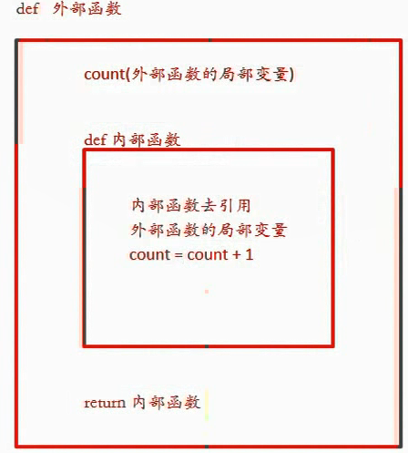

Python

1. 简介
   - [Python历史](#Python历史)
   - [Python优缺点](#Python优缺点)
   - [蟒之禅（Python哲学）](#蟒之禅（Python哲学）)
   - [闭包（装饰器函数）](#闭包)
   - [面向对象](#面向对象)
   - [字符串和正则](#字符串和正则)
   - [数据结构](#数据结构)
   - [文件和异常](#文件和异常)
   - [图形用户界面](#图形用户界面)
   - [进程和线程](#进程和线程)
   - [网络编程](#网络编程)
   - [图像和文档处理](#图像和文档处理)
   - [并发编程](#并发编程)
   - [定时任务](#定时任务)
2. 实战
   - [搭建编程环境](#搭建编程环境)
   - [Python开发工具](#Python开发工具)
   - [BS](#BS)
     - [Django框架](#Django框架)
     - [Flask框架](#Flask框架)
3. 问题
4. 总结


**参考**

- [100天从新手到大师](https://github.com/jackfrued/Python-100-Days)
- [Django框架全面讲解](https://www.cnblogs.com/LiCheng-/p/6920900.html)
- [用VScode代码调试Python](https://www.cnblogs.com/it-tsz/p/9022456.html)


pip常用国内镜像源：

- 阿里云 http://mirrors.aliyun.com/pypi/simple/
- 中国科技大学 https://pypi.mirrors.ustc.edu.cn/simple/
- 豆瓣 http://pypi.douban.com/simple
- 中国科学院 http://pypi.mirrors.opencas.cn/simple/
- 清华大学 https://pypi.tuna.tsinghua.edu.cn/simple/

```sh
pip install -i https://pypi.tuna.tsinghua.edu.cn/simple pip -U
pip config set global.index-url https://pypi.tuna.tsinghua.edu.cn/simple

conda config --add channels https://mirrors.tuna.tsinghua.edu.cn/anaconda/pkgs/free/
conda config --add channels https://mirrors.tuna.tsinghua.edu.cn/anaconda/cloud/conda-forge 
conda config --add channels https://mirrors.tuna.tsinghua.edu.cn/anaconda/cloud/msys2/
# 安装pytorch还需要再添加如下channels：
conda config --add channels https://mirrors.tuna.tsinghua.edu.cn/anaconda/pkgs/main/
conda config --add channels https://mirrors.tuna.tsinghua.edu.cn/anaconda/cloud/pytorch/

# 设置搜索时显示通道地址
conda config --set show_channel_urls yes
```


## Python历史

- 1989年圣诞节：Guido von Rossum 开始写 Python 语言的编译器。

- 1991年2月：第一个 Python 编译器（同时也是解释器）诞生。

- 1994年1月：Python 1.0 正式发布。

- 2000年10月16日：Python 2.0 发布。

- 2008年12月3日：Python 3.0发布。

- 目前使用的 Python 3.7.x 的版本是在2018年发布的

Python的版本号分为三段，形如A.B.C。其中A表示大版本号，一般当整体重写，或出现不向后兼容的改变时，增加A；B表示功能更新，出现新功能时增加B；C表示小的改动（例如：修复了某个Bug），只要有修改就增加C。

如果对Python的历史感兴趣，可以阅读名为[《Python简史》](http://www.cnblogs.com/vamei/archive/2013/02/06/2892628.html)的博文。

 

## Python优缺点

优点：

1. 简单和明确，做一件事只有一种方法。

2. 学习曲线低，跟其他很多语言相比，Python更容易上手。

3. 开放源代码，拥有强大的社区和生态圈。

4. 解释型语言，天生具有平台可移植性。

5. 对两种主流的编程范式（面向对象编程和函数式编程）都提供了支持。

6. 可扩展性和可嵌入性，例如在 Python 中可以调用 C/C++ 代码。

7. 代码规范程度高，可读性强，适合有代码洁癖和强迫症的人群。

缺点： 

1. 执行效率稍低，因此计算密集型任务可以由C/C++编写。

2. 代码无法加密，但是现在很多公司都不销售软件而是销售服务，这个问题会被弱化。

3. 在开发时可以选择的框架太多（如Web框架就有100多个），有选择的地方就有错误。

 

## 蟒之禅（Python哲学）

> 优美胜过丑陋，明确胜过含蓄 ，简单胜过复杂 ，复杂胜过难懂 ，扁平胜过嵌套 ，稀疏胜过密集。 
>
> 以动手实践为荣 , 以只看不练为耻; 以打印日志为荣 , 以单步跟踪为耻; 
>
> 以空格缩进为荣 , 以制表缩进为耻; 以单元测试为荣 , 以人工测试为耻; 
>
> 以模块复用为荣 , 以复制粘贴为耻; 以多态应用为荣 , 以分支判断为耻; 
>
> 以Pythonic为荣 , 以冗余拖沓为耻; 以总结分享为荣 , 以跪求其解为耻;


## 闭包




## 面向对象

正式说法：

"把一组数据结构和处理它们的方法组成对象（object），把相同行为的对象归纳为类（class），通过类的封装（encapsulation）隐藏内部细节，通过继承（inheritance）实现类的特化（specialization）和泛化（generalization），通过多态（polymorphism）实现基于对象类型的动态分派。"

通俗说法：


### 类和对象

简单的说：

- 类是对象的蓝图和模板，而对象是类的实例。

  类是抽象的概念，而对象是具体的东西。

- 一切皆为对象，对象都有属性和行为，每个对象都是独一无二的，而且一定属于某个类（型）。

```python
'''
定义类
'''
class Student(object):

    # __init__是一个特殊方法用于在创建对象时进行初始化操作
    # 通过这个方法我们可以为学生对象绑定name和age两个属性
    def __init__(self, name, age):
        self.name = name
        self.age = age

    def study(self, course_name):
        print('%s正在学习%s.' % (self.name, course_name))

    # PEP 8要求标识符的名字用全小写多个单词用下划线连接
    # 但是部分程序员和公司更倾向于使用驼峰命名法(驼峰标识)
    def watch_movie(self):
        if self.age < 18:
            print('%s只能观看《熊出没》.' % self.name)
        else:
            print('%s正在观看岛国爱情大电影.' % self.name)
    
# 创建和使用对象        
def main():
    # 创建学生对象并指定姓名和年龄
    stu1 = Student('骆昊', 38)
    # 给对象发study消息
    stu1.study('Python程序设计')
    # 给对象发watch_av消息
    stu1.watch_movie()
    stu2 = Student('王大锤', 15)
    stu2.study('思想品德')
    stu2.watch_movie()

if __name__ == '__main__':
    main()
```

### 访问可见性问题

在Python中，属性和方法的访问权限只有两种：公开的和私有的。如果希望属性是私有的，在给属性命名时可以用两个下划线作为开头。

```python
class Test:

    def __init__(self, foo):
        self.__foo = foo

    def __bar(self):
        print(self.__foo)
        print('__bar')

def main():
    test = Test('hello')
    # AttributeError: 'Test' object has no attribute '__bar'
    test.__bar()
    # AttributeError: 'Test' object has no attribute '__foo'
    print(test.__foo)

if __name__ == "__main__":
    main()
```

但是，Python并没有从语法上严格保证私有属性或方法的私密性，它只是给私有的属性和方法换了一个名字来妨碍对它们的访问，事实上如果你知道更换名字的规则仍然可以访问到它们。

之所以这样设定，可以用这样一句名言加以解释，就是"**We are all consenting adults here**"。因为绝大多数程序员都认为开放比封闭要好，而且程序员要自己为自己的行为负责。

```python
class Test:

    def __init__(self, foo):
        self.__foo = foo

    def __bar(self):
        print(self.__foo)
        print('__bar')


def main():
    test = Test('hello')
    test._Test__bar()
    print(test._Test__foo)


if __name__ == "__main__":
    main()
```

实际开发中，不建议将属性设置为私有的，因为这会导致子类无法访问。所以大多数Python程序员会遵循一种命名惯例就是让属性名以单下划线开头来表示属性是受保护的，本类之外的代码在访问这样的属性时应该要保持慎重。

这种做法并不是语法上的规则，单下划线开头的属性和方法外界仍然是可以访问的，所以更多的时候它是一种暗示或隐喻，关于这一点可以看看[《Python - 那些年我们踩过的那些坑》](http://blog.csdn.net/jackfrued/article/details/79521404)中的讲解。

### 同一性

英文单词"same"的意思是同一的、相同的，这似乎没有异议，如果我们再深入探讨一下，可能期望与所想并不一致。

例如，你说，"Chris and I have the same car"，你的意思是Chris和我的车为同一个厂家，同一个型号，但却是两辆不同车。如果你说，"Chris and I have the same mother"，这里意思是Chris和我的妈妈是同
一个人，可不是两个不同的妈妈。由此可见，"Sameness"的真正意思要根据上下文来判断。

当我们讨论对象时，也同样存在这样的模糊性。例如，我们说两个相同的点，可能这两个点的数据（横、纵坐标）相同，也可能他们就是同一个对象。我们可以利用"=="操作符判断两个点是否为同一对象。

### 拷贝

别名增加了程序阅读的困难，因为在一个地方改变了对象的值，但在另一个地方可能是不希望的。并且追踪对象所有的别名，又是很困难的。

解决的方法是拷贝对象，生成一个新的对象实例。copy模块的方法copy能够复制任何对象。

```python
>>> p1 = Point()
>>> p1.x = 2.0
>>> p1.y = 4.0
>>> p2 = p1
>>> print p1,p2
<__main__.Point instance at 0x00D76878>
<__main__.Point instance at 0x00D76878>
>>> p2 = copy.copy(p1)
>>> print p1, p2
<__main__.Point instance at 0x00D76878>
<__main__.Point instance at 0x00D009A0>
>>> print p1.x,p1.y
2.0 4.0
>>> print p2.x,p2.y
2.0 4.0
```

一些简单的对象，如点，没有包含任何嵌入的对象，copy方法已经足够了。这种复制叫做浅拷贝。

对于象长方形类的对象，它的属性中包含点对象，再用copy方法进行复制，虽然生成了新的长方形对象，但这两个对象的点对象是同一个对象：

```python
>>> r1 = Rectangle()
>>> r1.width = 1.0
>>> r1.height = 2.0
>>> r1.corner = Point()
>>> r1.corner.x = 0
>>> r1.corner.y = 0
>>> r2 = copy.copy(r1)
>>> print r1.corner, r2.corner
<__main__.Point instance at 0x00D44BA8>
<__main__.Point instance at 0x00D44BA8>
```

显然这也不是我们希望的结果。

幸运的是，copy模块包含了一个名为deepcopy的方法，它可以拷贝任何嵌入的对象。这种拷贝我们称之为深拷贝。

```python
>>> r2 = copy.deepcopy(r1)
>>> id(r1)
13831952
>>> id(r2)
14043608
>>> id(r1.corner)
13913000
>>> id(r2.corner)
14003528
```

b1和b2已经是完全不同的对象了。

### 面向对象的支柱

面向对象有三大支柱：封装、继承和多态。

封装："**隐藏一切可以隐藏的实现细节，只向外界暴露（提供）简单的编程接口**"。

在类中定义的方法其实就是把数据和对数据的操作封装起来了，创建对象之后，只需要给对象发送一个消息（调用方法）就可以执行方法中的代码，也就是说我们只需要知道方法的名字和传入的参数（方法的外部视图），而不需要知道方法内部的实现细节（方法的内部视图）。

### @property装饰器

之前我们讨论过Python中属性和方法访问权限的问题，虽然我们不建议将属性设置为私有的，但是如果直接将属性暴露给外界也是有问题的，比如我们没有办法检查赋给属性的值是否有效。

我们之前的建议是将属性命名以单下划线开头，通过这种方式来暗示属性是受保护的，不建议外界直接访问，那么如果想访问属性可以通过属性的getter（访问器）和setter（修改器）方法进行对应的操作。如果要做到这点，就可以考虑使用@property包装器来包装getter和setter方法，使得对属性的访问既安全又方便，代码如下所示：

```python
class Person(object):

    def __init__(self, name, age):
        self._name = name
        self._age = age

    # 访问器 - getter方法
    @property
    def name(self):
        return self._name

    # 访问器 - getter方法
    @property
    def age(self):
        return self._age

    # 修改器 - setter方法
    @age.setter
    def age(self, age):
        self._age = age

    def play(self):
        if self._age <= 16:
            print('%s正在玩飞行棋.' % self._name)
        else:
            print('%s正在玩斗地主.' % self._name)


def main():
    person = Person('王大锤', 12)
    person.play()
    person.age = 22
    person.play()
    # person.name = '白元芳'  # AttributeError: can't set attribute


if __name__ == '__main__':
    main()
```

### `__slots__`魔法

Python是一门[动态语言](https://zh.wikipedia.org/wiki/%E5%8A%A8%E6%80%81%E8%AF%AD%E8%A8%80)。通常，动态语言允许我们在程序运行时给对象绑定新的属性或方法，当然也可以对已经绑定的属性和方法进行解绑定。

但是如果我们需要限定自定义类型的对象只能绑定某些属性，可以通过在类中定义`__slots__`变量来进行限定。需要注意的是`__slots__`的限定只对当前类的对象生效，对子类并不起任何作用。

```python
class Person(object):

    # 限定Person对象只能绑定_name, _age和_gender属性
    __slots__ = ('_name', '_age', '_gender')

    def __init__(self, name, age):
        self._name = name
        self._age = age

    @property
    def name(self):
        return self._name

    @property
    def age(self):
        return self._age

    @age.setter
    def age(self, age):
        self._age = age

    def play(self):
        if self._age <= 16:
            print('%s正在玩飞行棋.' % self._name)
        else:
            print('%s正在玩斗地主.' % self._name)

def main():
    person = Person('王大锤', 22)
    person.play()
    person._gender = '男'
    # AttributeError: 'Person' object has no attribute '_is_gay'
    # person._is_gay = True
```

### 静态方法和类方法

```python
from math import sqrt

class Triangle(object):

    def __init__(self, a, b, c):
        self._a = a
        self._b = b
        self._c = c

    @staticmethod
    def is_valid(a, b, c):
        return a + b > c and b + c > a and a + c > b

    def perimeter(self):
        return self._a + self._b + self._c

    def area(self):
        half = self.perimeter() / 2
        return sqrt(half * (half - self._a) *
                    (half - self._b) * (half - self._c))

def main():
    a, b, c = 3, 4, 5
    # 静态方法和类方法都是通过给类发消息来调用的
    if Triangle.is_valid(a, b, c):
        t = Triangle(a, b, c)
        print(t.perimeter())
        # 也可以通过给类发消息来调用对象方法但是要传入接收消息的对象作为参数
        # print(Triangle.perimeter(t))
        print(t.area())
        # print(Triangle.area(t))
    else:
        print('无法构成三角形.')

if __name__ == '__main__':
    main()
```

和静态方法类似，Python还可以在类中定义类方法，类方法的第一个参数约定名为cls，它代表的是当前类相关的信息的对象（类本身也是一个对象，也称之为类的元数据对象），通过这个参数我们可以获取和类相关的信息并且可以创建出类的对象，代码如下所示：

```python
from time import time, localtime, sleep

class Clock(object):
    """数字时钟"""
    def __init__(self, hour=0, minute=0, second=0):
        self._hour = hour
        self._minute = minute
        self._second = second

    @classmethod
    def now(cls):
        ctime = localtime(time())
        return cls(ctime.tm_hour, ctime.tm_min, ctime.tm_sec)

    def run(self):
        """走字"""
        self._second += 1
        if self._second == 60:
            self._second = 0
            self._minute += 1
            if self._minute == 60:
                self._minute = 0
                self._hour += 1
                if self._hour == 24:
                    self._hour = 0

    def show(self):
        """显示时间"""
        return '%02d:%02d:%02d' % \
               (self._hour, self._minute, self._second)


def main():
    # 通过类方法创建对象并获取系统时间
    clock = Clock.now()
    while True:
        print(clock.show())
        sleep(1)
        clock.run()


if __name__ == '__main__':
    main()
```

### 方法

通常，方法的第一个参数是调用它自己：self。

```python
def increment(self, seconds):
  self.seconds = seconds + self.seconds
  
  while self.seconds>=60:
    self.seconds = self.seconds - 60
    self.minutes = self.minutes + 1

  while self.minutes>=60:
    self.minutes = self.minutes - 60
    self.hours = self.hours + 1
```

这个函数有两个参数，一个它自己，一个seconds。函数的意思是，在当前的时间上加上一定的秒数，就得到一个新的时间。例如：

```python
now.nicrement(100)
```

函数调用时，第一参数是默认的，不必写出来。

### 可选择的参数

```python
def total(head, tail, step):
  temp = 0
  while head<=tail:
    temp = temp + head
    head = head + step
  return temp
```

它有三个参数，调用函数时，三个参数都不能省略。有的参数之所以可以省略，是因为函数中已经给出了缺省的参数。我们把上面的函数作一下改造，定义step的缺省参数为1：

```python
total(head, tail, step=1)
```

现在调用total函数时，step参数就可以省略，但不表示step不存在，它的值是默认的1。当然你也可以根据需要取其他值。

缺省参数的定义要符合以下规则：缺省参数全部位于参数表的后部，而且缺省参数之间不能在有非缺省参数。

### 构造函数

构造函数是任何类都有的特殊方法。当要创建一个类时，就调用构造函数。它的名字是：`__init__`。init的前后分别是两个下划线字符。时间类Time的构造函数如下：

```python
class Time:
  def __init__(self, hours=0, minutes=0, seconds=0):
    self.hours = hours
    self.minutes = minutes
    self.seconds = seconds
```

当我们调用Time的构造函数时，参数依次传递给`__init__`

注：可以传递参数子集，这种情况下，并不强调参数一定要符合定义时的顺序。

```python
>>> now = Time(seconds = 35, hours = 19)
>>> now.printTime()
>>> 19:0:35
```

### 操作符重定义

为了使类的实例也可以进行数学操作，我们需要在类的内部重新定义数学操作符，使之支持用户定义的数据类型。

**加法重定义**

```python
>>> class RMB:
  def __init__(self, sum = 0.0):
    self.sum = sum
  def __str__(self):
    return str(self.sum)
  def __add__(self, other): # 重定义加法操作
    return RMB(self.sum + other.sum)
  def __sub__(self, other): # 重定义减法操作
    return RMB(self.sum - other.sum)
```

测试：

```python
>>> a = RMB(20000)
>>> b = RMB(234.987)
>>> print a + b
20234.987
>>>print a - b
19765.013
```

表达式 a + b 和 `p1.__add__(p2)` 是等同的：

```python
>>> a = RMB(34.5)
>>> b = RMB(345.98)
>>> print a.__add__(b), a + b
380.48 380.48
>>> print a.__sub__(b), a - b
-311.48 -311.48
```

**乘法重定义**

```python
class Line:
  def __init__(self, length = 0.0):
    self.length = length

  def __str__(self):
    return str(self.length)

  def __mul__(self, other): # 乘法重定义
    return Rect(self.length, other.length)

  def __rmul__(self, other): # 乘法重定义
    return Line(self.length * other)

class Rect:
  def __init__(self, width = 0.0, length = 0.0):
    self.width = width
    self.length = length

  def __str__(self):
    return '(' + str(self.length) + ',' + str(self.width) + ')'

  def area(self): # 计算长方形的面积
    return self.width * self.length
```

测试：

```python
>>> aline = Line(5.87)
>>> bline = 2.9 * Line(8.34)
>>> print 'aline = ' , aline, 'bline = ',bline
aline = 5.87 bline = 24.186
>>> rect = aline * bline
>>> print rect
(24.186,5.87)
>>> print rect.area()
141.97182
```

乘法重定义的第二种形式，必须严格按照"2.9 * Line(8.34)"的书写顺序，要是调换一下顺序，解释器将给出错误信息。

```python
>>> bline = Line(8.34) * 2.9
AttributeError: 'float' object has no attribute 'length'
```

### 类之间的关系

简单的说，类和类之间的关系有三种：is-a、has-a和use-a关系。

- is-a关系也叫继承或泛化，比如学生和人的关系、手机和电子产品的关系都属于继承关系。
- has-a关系通常称之为关联，比如部门和员工的关系，汽车和引擎的关系都属于关联关系；关联关系如果是整体和部分的关联，那么我们称之为聚合关系；如果整体进一步负责了部分的生命周期（整体和部分是不可分割的，同时同在也同时消亡），那么这种就是最强的关联关系，我们称之为合成关系。
- use-a关系通常称之为依赖，比如司机有一个驾驶的行为（方法），其中（的参数）使用到了汽车，那么司机和汽车的关系就是依赖关系。

我们可以使用[UML](https://zh.wikipedia.org/wiki/%E7%BB%9F%E4%B8%80%E5%BB%BA%E6%A8%A1%E8%AF%AD%E8%A8%80)（统一建模语言）进行面向对象建模，有兴趣的读者可以阅读[《UML面向对象设计基础》](https://e.jd.com/30392949.html)一书。


### 继承和多态

在实际开发中，我们经常会用子类对象去替换掉一个父类对象，这是面向对象编程中一个常见的行为，对应的原则称之为[里氏替换原则](https://zh.wikipedia.org/wiki/%E9%87%8C%E6%B0%8F%E6%9B%BF%E6%8D%A2%E5%8E%9F%E5%88%99)。

子类在继承了父类的方法后，可以对父类已有的方法给出新的实现版本，这个动作称之为方法重写（override）。

通过方法重写我们可以让父类的同一个行为在子类中拥有不同的实现版本，当我们调用这个经过子类重写的方法时，不同的子类对象会表现出不同的行为，这个就是多态（poly-morphism）。

继承示例：

```python
from abc import ABCMeta, abstractmethod


class Pet(object, metaclass=ABCMeta):
    """宠物"""

    def __init__(self, nickname):
        self._nickname = nickname

    @abstractmethod
    def make_voice(self):
        """发出声音"""
        pass


class Dog(Pet):
    """狗"""

    def make_voice(self):
        print('%s: 汪汪汪...' % self._nickname)


class Cat(Pet):
    """猫"""

    def make_voice(self):
        print('%s: 喵...喵...' % self._nickname)


def main():
    pets = [Dog('旺财'), Cat('凯蒂'), Dog('大黄')]
    for pet in pets:
        pet.make_voice()


if __name__ == '__main__':
    main()
```

在上面的代码中，我们将Pet类处理成了一个抽象类，所谓抽象类就是不能够创建对象的类，这种类的存在就是专门为了让其他类去继承它。

Python从语法层面并没有像Java或C#那样提供对抽象类的支持，但是我们可以通过abc模块的ABCMeta元类和abstractmethod包装器来达到抽象类的效果，如果一个类中存在抽象方法那么这个类就不能够实例化（创建对象）。

上面的代码中，Dog和Cat两个子类分别对Pet类中的make_voice抽象方法进行了重写并给出了不同的实现版本，当我们在main函数中调用该方法时，这个方法就表现出了多态行为（同样的方法做了不同的事情）。


## 字符串和正则

**格式化：**

| 文本 | 说明                               |
| ---- | ---------------------------------- |
| %d   | 整数类型，decimal                  |
| %f   | 浮点数，默认的小数点后面有六位小数 |
| %s   | 字符串                             |

对于要格式化的数字，我们还能够指定它所占的位数。"%"后面的数字表明数字的位数，如果位数多于数字的实际位数，且该数为正，则在要格式化的数字的前面添加空格；如果该数为负，空格添加在数字的后面。示例如下：

```python
>>> "%5d" % 1
'     1'
>>> "%-5d" % 1
'1     '
>>> "%4f" % 9.1
'9.100000'
>>> "%3f" % 1234
'1234.000000'
>>> "%3d" % 1234
'1234'
```

对于浮点数，我们还可以指定小数的位数：

```python
>>> "%4.3f" % 1137.98
'1137.980'
```

**Python对正则表达式的支持**

Python提供了re模块来支持正则表达式相关操作，下面是re模块中的核心函数。

| 函数                                         | 说明                                                         |
| -------------------------------------------- | ------------------------------------------------------------ |
| compile(pattern, flags=0)                    | 0编译正则表达式返回正则表达式对象                            |
| match(pattern, string, flags=0)              | 用正则表达式匹配字符串 成功返回匹配对象 否则返回None         |
| search(pattern, string, flags=0)             | 搜索字符串中第一次出现正则表达式的模式 成功返回匹配对象 否则返回None |
| split(pattern, string, maxsplit=0, flags=0)  | 用正则表达式指定的模式分隔符拆分字符串 返回列表              |
| sub(pattern, repl, string, count=0, flags=0) | 用指定的字符串替换原字符串中与正则表达式匹配的模式 可以用count指定替换的次数 |
| fullmatch(pattern, string, flags=0)          | match函数的完全匹配（从字符串开头到结尾）版本                |
| findall(pattern, string, flags=0)            | 查找字符串所有与正则表达式匹配的模式 返回字符串的列表        |
| finditer(pattern, string, flags=0)           | 查找字符串所有与正则表达式匹配的模式 返回一个迭代器          |
| purge()                                      | 清除隐式编译的正则表达式的缓存                               |
| re.I / re.IGNORECASE                         | 忽略大小写匹配标记                                           |
| re.M / re.MULTILINE                          | 多行匹配标记                                                 |

说明：上面提到的re模块中的这些函数，实际开发中也可以用正则表达式对象的方法替代对这些函数的使用，如果一个正则表达式需要重复的使用，那么先通过compile函数编译正则表达式并创建出正则表达式对象无疑是更为明智的选择。

如果要从事爬虫类应用的开发，那么正则表达式一定是一个非常好的助手，当然对于初学者来收，要编写一个正确的适当的正则表达式可能并不是一件容易的事情，所以实际开发爬虫应用的时候，有很多人会选择[Beautiful Soup](https://www.crummy.com/software/BeautifulSoup/)或[Lxml](http://lxml.de/)来进行匹配和信息的提取，前者简单方便但是性能较差，后者既好用性能也好，但是安装稍嫌麻烦。


## 数据结构

使用生成式（推导式）语法

  ```python
prices = {
    'AAPL': 191.88,
    'GOOG': 1186.96,
    'IBM': 149.24,
    'ORCL': 48.44,
    'ACN': 166.89,
    'FB': 208.09,
    'SYMC': 21.29
}
# 用股票价格大于100元的股票构造一个新的字典
prices2 = {key: value for key, value in prices.items() if value > 100}
print(prices2)
  ```

  >说明：生成式（推导式）可以用来生成列表、集合和字典。

嵌套的列表

```python
names = ['关羽', '张飞', '赵云', '马超', '黄忠']
courses = ['语文', '数学', '英语']
# 录入五个学生三门课程的成绩
# 错误 - 参考http://pythontutor.com/visualize.html#mode=edit
# scores = [[None] * len(courses)] * len(names)
scores = [[None] * len(courses) for _ in range(len(names))]
for row, name in enumerate(names):
    for col, course in enumerate(courses):
        scores[row][col] = float(input(f'请输入{name}的{course}成绩: '))
        print(scores)
```

[Python Tutor](http://pythontutor.com/) - VISUALIZE CODE AND GET LIVE HELP

如果我们测试的范围较大，还算方便。但是范围越小，就越麻烦。例如：

```python
bucket1 = inBucket(a, 0.0, 0.25)
bucket2 = inBucket(a, 0.25, 0.5)
bucket3 = inBucket(a, 0.5, 0.75)
bucket4 = inBucket(a, 0.75, 1.0)
```

有两个问题要解决：一个是要保存每次输入的结果；另一个是计算分割的范围。我们用循环计算分割的范围。

```python
bucketWidth = 1.0 / numBuckets
for i in range(numBuckets):
  low = i * bucketWidth
  high = low + bucketWidth
  print low, "to", high
```

当numBuckets = 8时，输出是：

```sh
0.0 to 0.125
0.125 to 0.25
0.25 to 0.375
0.375 to 0.5
0.5 to 0.625
0.625 to 0.75
0.75 to 0.875
0.875 to 1.0
```

现在回到第一个问题，用一个列表存储这八个整数结果。

```python
numBuckets = 8
buckets = [0] * numBuckets
bucketWidth = 1.0 / numBuckets
for i in range(numBuckets):
  low = i * bucketWidth
  high = low + bucketWidth
  buckets[i] = inBucket(list, low, high)
print buckets
```

通过把一个大问题分解成几个小问题，再逐个解决这些小问题，最后就把大问题解决了。这种方法我称之为“个个击破”。

### 集合

Python中的集合跟数学上的集合是一致的，不允许有重复元素，而且可以进行交集、并集、差集等运算。


```python
set1 = {1, 2, 3, 3, 3, 2}
print(set1)
print('Length =', len(set1))
set2 = set(range(1, 10))
print(set2)
set1.add(4)
set1.add(5)
set2.update([11, 12])
print(set1)
print(set2)
set2.discard(5)
# remove的元素如果不存在会引发KeyError
if 4 in set2:
    set2.remove(4)
print(set2)
# 遍历集合容器
for elem in set2:
    print(elem ** 2, end=' ')
print()
# 将元组转换成集合
set3 = set((1, 2, 3, 3, 2, 1))
print(set3.pop())
print(set3)
# 集合的交集、并集、差集、对称差运算
print(set1 & set2)
# print(set1.intersection(set2))
print(set1 | set2)
# print(set1.union(set2))
print(set1 - set2)
# print(set1.difference(set2))
print(set1 ^ set2)
# print(set1.symmetric_difference(set2))
# 判断子集和超集
print(set2 <= set1)
# print(set2.issubset(set1))
print(set3 <= set1)
# print(set3.issubset(set1))
print(set1 >= set2)
# print(set1.issuperset(set2))
print(set1 >= set3)
# print(set1.issuperset(set3))
```

>**说明**：Python中允许通过一些特殊的方法来为某种类型或数据结构自定义运算符（后面的章节中会讲到），上面的代码中我们对集合进行运算的时候可以调用集合对象的方法，也可以直接使用对应的运算符，例如&运算符跟intersection方法的作用就是一样的，但是使用运算符让代码更加直观。

### 字典

字典是另一种可变容器模型，类似于我们生活中使用的字典，它可以存储任意类型对象，与列表、集合不同的是，字典的每个元素都是由一个键和一个值组成的“键值对”，键和值通过冒号分开。

字典的索引可以是字符串，除了这一点，它与其它组合类型非常相似。当然，字典的索引也可以是整数。

我们可以创造一个空字典，然后再添加元素。字典的元素以逗号为分隔符，每个元素包含键和键值，它俩用冒号分隔。

键值的顺序与创建时的顺序不同。其实，不必太在意键值顺序。因为我们是利用键浏览与之对应的值。

下面的代码演示了如何定义和使用字典。

```python
scores = {'骆昊': 95, '白元芳': 78, '狄仁杰': 82}
# 通过键可以获取字典中对应的值
print(scores['骆昊'])
print(scores['狄仁杰'])
# 对字典进行遍历(遍历的其实是键再通过键取对应的值)
for elem in scores:
    print('%s\t--->\t%d' % (elem, scores[elem]))
# 更新字典中的元素
scores['白元芳'] = 65
scores['诸葛王朗'] = 71
scores.update(冷面=67, 方启鹤=85)
print(scores)
if '武则天' in scores:
    print(scores['武则天'])
print(scores.get('武则天'))
# get方法也是通过键获取对应的值但是可以设置默认值
print(scores.get('武则天', 60))
# 删除字典中的元素
print(scores.popitem())
print(scores.popitem())
print(scores.pop('骆昊', 100))
# 清空字典
scores.clear()
print(scores)
```

**字典操作**

函数del删除字典中的元素。

```python
>>> inventory = {'apples': 430, 'bananas': 312,\
'oranges': 525, 'pears': 217}
>>> print inventory
{'oranges': 525, 'apples': 430, 'pears': 217, 'bananas': 312}
>>> del inventory['pears']
>>> print inventory
{'oranges': 525, 'apples': 430, 'bananas': 312}
>>> inventory['pears'] = 0
>>> print inventory
{'oranges': 525, 'apples': 430, 'pears': 0, 'bananas': 312}
>>> inventory.clear()
{}

>>> os = {1: 'Linux', 2: 'Uinx', 3: 'FreeBSD'}
>>> len(os)
3
```

**别名和拷贝**

字典是可变的。如果你想修改字典，并且保留原来的备份，就要用到字典的copy方法。看下面的例子：

```python
>>> opposites = {'up': 'down', 'right': 'wrong', \
'true': 'false'}
>>> alias = opposites
>>> copy = opposites.copy()
```

alias和opposites指向同一个值。而copy则指向全新的拷贝。如果修改alias，opposites也发生变化。

```python
>>> alias['right'] = 'left'
>>> opposites['right']
'left'
```

但是如果修改copy，opposites不变。

```python
>>> copy['right'] = 'privilege'
>>> opposites['right']
'left'
```

### 稀疏矩阵

如图表示的是稀疏矩阵，用列表表示如下：

```python
matrix = [ [0,0,0,1,0],
           [0,0,0,0,0],
           [0,2,0,0,0],
           [0,0,0,0,0],
           [0,0,0,3,0] ]
```

也可以用字典表示矩阵。该矩阵的非零元素的键用含有两个整数元素的序列表示，分别代表行和列。

```python
matrix = {(0,3): 1, (2, 1): 2, (4, 3): 3}
```

仅仅需要三个键值对表示矩阵的非零值。每个键的类型是数组，键值是整数。用这种方法，我们不能得到值为零的元素，因为这个矩阵中，没有非零值的键。

```python
>>> matrix = {(0,3): 1, (2, 1): 2, (4, 3): 3}
>>> matrix[2, 1]
2
>>> matrix[2, 2]
KeyError: (2, 2)
```

get方法解决了这个问题。

```python
>>> matrix.get((1, 3), 0)
0
```

第一个参数是键；第二个参数表示：如果该键没有出现在字典中，那么这个键的值就是第二个参数。

请看下面的函数：

```python
def fibonacci (n):
  if n == 0 or n == 1:
    return 1
  else:
    return fibonacci(n-1) + fibonacci(n-2)
```

你可能注意到：n的值约大，程序运行的时间就越长。当n等于32时，大约运行25秒。为什么会这样呢？看一下函数的调用图：函数出现了重复的调用。

比如 n=2 就出现了两次。所以这是没有效率的解决方法。当n变大时，情况变得更糟。一个好的解决办法是将已经运算完的结果保存在字典中，以备以后所需。

```python
previous = {0:1, 1:1}
def fibonacci(n):
  if previous.has_key(n):
    return previous[n]
  else:
    newValue = fibonacci(n-1) + fibonacci(n-2)
    previous[n] = newValue
    return newValue
```

字典首先定义了当n=0,1时的值。当函数fibonacci被调用，先检查字典中是否包含要计算的结果。如果有就立刻返回结果，不再做递归调用。若没有，就得计算新值，并且新值在函数返回前加入到字典中。

用这个版本的fibonacci函数，我们的计算机能够瞬间计算n=40的值。要使用老版本的fibonacci函数，你必须耐心等待。当我们计算n=50时，会得到一个错误：

```python
>>> fibonacci(50)
OverflowError: integer addition
```

python用一种叫做长整数的类型处理任意大小的整数。通常，我们用整数后面加一个大写的 L 表示长整数。

```python
>>> type(3L)
<type 'long'>
```

另一种方法是用函数long把任意的数字类型，即使是数字字符窜，转换成长整数。

```python
>>> long(34)
34L
>>> long(3.4)
3L
>>> long('34')
34L
```

所有的数学操作符都适用于长整数。因此，对于上面的函数fibonacci不必做太多的更改，就能正常运行了。

```python
>>> previous = {0:1L, 1:1L}
>>> fibonacci(50)
20365011074
```


## 文件和异常

实际开发中常常会遇到对数据进行[持久化](https://baike.baidu.com/item/%E6%95%B0%E6%8D%AE%E6%8C%81%E4%B9%85%E5%8C%96)操作的场景，而实现数据持久化最直接简单的方式就是将数据保存到文件中。说到“文件”这个词，可能需要先科普一下关于[文件系统](https://zh.wikipedia.org/wiki/%E6%96%87%E4%BB%B6%E7%B3%BB%E7%BB%9F)的知识，请大家自行通过维基百科进行了解。

在Python中实现文件的读写操作其实非常简单，通过Python内置的open函数，我们可以指定文件名、操作模式、编码信息等来获得操作文件的对象，接下来就可以对文件进行读写操作了。这里所说的操作模式是指要打开什么样的文件（字符文件还是二进制文件）以及做什么样的操作（读、写还是追加），具体的如下表所示。

| 操作模式 | 具体含义                         |
| -------- | -------------------------------- |
| 'r'      | 读取 （默认）                    |
| 'w'      | 写入（会先截断之前的内容）       |
| 'x'      | 写入，如果文件已经存在会产生异常 |
| 'a'      | 追加，将内容写入到已有文件的末尾 |
| 'b'      | 二进制模式                       |
| 't'      | 文本模式（默认）                 |
| '+'      | 更新（既可以读又可以写）         |

下面这张图来自于[菜鸟教程](http://www.runoob.com/)网站，它展示了如果根据应用程序的需要来设置操作模式。


读写文本文件：

```python
def main():
    f = None
    try:
        f = open('致橡树.txt', 'r', encoding='utf-8')
        print(f.read())
    except FileNotFoundError:
        print('无法打开指定的文件!')
    except LookupError:
        print('指定了未知的编码!')
    except UnicodeDecodeError:
        print('读取文件时解码错误!')
    finally:
        if f:
            f.close()


if __name__ == '__main__':
    main()
```

如果不在finally代码块中关闭文件对象释放资源，也可以使用上下文语法，通过with关键字指定文件对象的上下文环境并在离开上下文环境时自动释放文件资源。

```python
def main():
    try:
        with open('致橡树.txt', 'r', encoding='utf-8') as f:
            print(f.read())
    except FileNotFoundError:
        print('无法打开指定的文件!')
    except LookupError:
        print('指定了未知的编码!')
    except UnicodeDecodeError:
        print('读取文件时解码错误!')


if __name__ == '__main__':
    main()
```

除了使用文件对象的read方法读取文件之外，还可以使用for-in循环逐行读取或者用readlines方法将文件按行读取到一个列表容器中。

```python
import time


def main():
    # 一次性读取整个文件内容
    with open('致橡树.txt', 'r', encoding='utf-8') as f:
        print(f.read())

    # 通过for-in循环逐行读取
    with open('致橡树.txt', mode='r') as f:
        for line in f:
            print(line, end='')
            time.sleep(0.5)
    print()

    # 读取文件按行读取到列表中
    with open('致橡树.txt') as f:
        lines = f.readlines()
    print(lines)


if __name__ == '__main__':
    main()
```

写入文本文件：

```python
from math import sqrt


def is_prime(n):
    """判断素数的函数"""
    assert n > 0
    for factor in range(2, int(sqrt(n)) + 1):
        if n % factor == 0:
            return False
    return True if n != 1 else False


def main():
    filenames = ('a.txt', 'b.txt', 'c.txt')
    fs_list = []
    try:
        for filename in filenames:
            fs_list.append(open(filename, 'w', encoding='utf-8'))
        for number in range(1, 10000):
            if is_prime(number):
                if number < 100:
                    fs_list[0].write(str(number) + '\n')
                elif number < 1000:
                    fs_list[1].write(str(number) + '\n')
                else:
                    fs_list[2].write(str(number) + '\n')
    except IOError as ex:
        print(ex)
        print('写文件时发生错误!')
    finally:
        for fs in fs_list:
            fs.close()
    print('操作完成!')


if __name__ == '__main__':
    main()
```

读写二进制文件：

```python
def main():
    try:
        with open('guido.jpg', 'rb') as fs1:
            data = fs1.read()
            print(type(data))  # <class 'bytes'>
        with open('吉多.jpg', 'wb') as fs2:
            fs2.write(data)
    except FileNotFoundError as e:
        print('指定的文件无法打开.')
    except IOError as e:
        print('读写文件时出现错误.')
    print('程序执行结束.')


if __name__ == '__main__':
    main()
```

读写JSON文件：

关于JSON的知识，可以参考[JSON的官方网站](http://json.org/)，从这个网站也可以了解到每种语言处理JSON数据格式可以使用的工具或三方库，下面是一个简单例子。

```json
{
    "name": "骆昊",
    "age": 38,
    "qq": 957658,
    "friends": ["王大锤", "白元芳"],
    "cars": [
        {"brand": "BYD", "max_speed": 180},
        {"brand": "Audi", "max_speed": 280},
        {"brand": "Benz", "max_speed": 320}
    ]
}
```

JSON的数据类型和Python的数据类型的对应关系：

| JSON                | Python       |
| ------------------- | ------------ |
| object              | dict         |
| array               | list         |
| string              | str          |
| number (int / real) | int / float  |
| true / false        | True / False |
| null                | None         |

| Python                                 | JSON         |
| -------------------------------------- | ------------ |
| dict                                   | object       |
| list, tuple                            | array        |
| str                                    | string       |
| int, float, int- & float-derived Enums | number       |
| True / False                           | true / false |
| None                                   | null         |

代码示例：

```python
import json


def main():
    mydict = {
        'name': '骆昊',
        'age': 38,
        'qq': 957658,
        'friends': ['王大锤', '白元芳'],
        'cars': [
            {'brand': 'BYD', 'max_speed': 180},
            {'brand': 'Audi', 'max_speed': 280},
            {'brand': 'Benz', 'max_speed': 320}
        ]
    }
    try:
        with open('data.json', 'w', encoding='utf-8') as fs:
            json.dump(mydict, fs)
    except IOError as e:
        print(e)
    print('保存数据完成!')


if __name__ == '__main__':
    main()
```

### 序列化和反序列化

json模块主要有四个比较重要的函数，分别是：

- dump - 将Python对象按照JSON格式序列化到文件中
- dumps - 将Python对象处理成JSON格式的字符串
- load - 将文件中的JSON数据反序列化成对象
- loads - 将字符串的内容反序列化成Python对象

这里出现了两个概念，一个叫序列化，一个叫反序列化。自由的百科全书[维基百科](https://zh.wikipedia.org/)上对这两个概念是这样解释的：“序列化（serialization）在计算机科学的数据处理中，是指将数据结构或对象状态转换为可以存储或传输的形式，这样在需要的时候能够恢复到原先的状态，而且通过序列化的数据重新获取字节时，可以利用这些字节来产生原始对象的副本（拷贝）。与这个过程相反的动作，即从一系列字节中提取数据结构的操作，就是反序列化（deserialization）”。

目前绝大多数网络数据服务（或称之为网络API）都是基于[HTTP协议](https://zh.wikipedia.org/wiki/%E8%B6%85%E6%96%87%E6%9C%AC%E4%BC%A0%E8%BE%93%E5%8D%8F%E8%AE%AE)提供JSON格式的数据，关于HTTP协议的相关知识，可以看看阮一峰老师的[《HTTP协议入门》](http://www.ruanyifeng.com/blog/2016/08/http.html)，如果想了解国内的网络数据服务，可以看看[聚合数据](https://www.juhe.cn/)和[阿凡达数据](http://www.avatardata.cn/)等网站，国外的可以看看[{API}Search](http://apis.io/)网站。下面的例子演示了如何使用[requests](http://docs.python-requests.org/zh_CN/latest/)模块（封装得足够好的第三方网络访问模块）访问网络API获取国内新闻，如何通过json模块解析JSON数据并显示新闻标题，这个例子使用了[天行数据](https://www.tianapi.com/)提供的国内新闻数据接口，其中的APIKey需要自己到该网站申请。

```python
import requests
import json


def main():
    resp = requests.get('http://api.tianapi.com/guonei/?key=APIKey&num=10')
    data_model = json.loads(resp.text)
    for news in data_model['newslist']:
        print(news['title'])


if __name__ == '__main__':
    main()
```

在Python中要实现序列化和反序列化除了使用json模块之外，还可以使用pickle和shelve模块，但是这两个模块是使用特有的序列化协议来序列化数据，因此序列化后的数据只能被Python识别。关于这两个模块的相关知识可以自己看看网络上的资料。

另外，如果要了解更多的关于Python异常机制的知识，可以看看segmentfault上面的文章[《总结：Python中的异常处理》](https://segmentfault.com/a/1190000007736783)，这篇文章不仅介绍了Python中异常机制的使用，还总结了一系列的最佳实践，很值得一读。

### 错误信息

```python
filename = ''
while 1:
  filename = raw_input("Input a file name: ")
  if filename == 'q':
    break
  try:
    f = open(filename, "r")
    print 'Opened a file.'
  except:
    print 'There is no file named', filename
```

try块的语句要求打开一个文件，如果没有异常发生，就忽略except块的内容；如果产生异常，就执行except块内的语句，之后是再一次的循环。

**自定义异常信息**

如果程序检测到错误，我们也可以用raise定义异常。

```python
def inputAge():
  age = input("Input your age:")
  if (age>100 or age<18):
    raise 'BadNumberError', 'out of range'
  return age
```

raise有两个参数，第一个是由我们自己定义的异常类型，第二个是关于此异常的少量说明信息。如果调用inputAge的函数有处理异常的程序，即使inputAge出错，整个程序也能正常运行；否则，程序退出，显示错误信息。

```python
>>> inputAge()
Input your age:31
31
>>> inputAge()
Input your age:109
BadNumberError: out of range #异常信息
```

**一个复杂的例子**

```python
while 1:
  try:
    x = int(raw_input("Input a number:"))
    y = int(raw_input("Input a number:"))
    z = x / y
  except ValueError, ev:
    print "That is no valid number.", ev
  except ZeroDivisionError, ez:
    print "divisor is zero:", ez
  except:
    print "Unexpected error."
    raise
  else:
    print "There is no error."
print x , "/" , y , "=" , x/y
```

在这个例子中有三个except语句。一个try语句可以和多个except配合使用，但只可能是其中的一个被执行。

- 前两个except语句，接受两个参数。第一个参数是异常的类型，第二个参数用于接收异常发生时生成的值，异常是否有这个参数及参数的类型如何，由异常的类型决定。
- 异常"ValueError"在这里表示：如果你输入的字符串包含非数字类型的字符，这个异常将被引发。
- 异常"ZeroDivisionError"表示除数为0引发的异常。
- 最后一个except语句表示当有异常发生，但不是前面定义的两种类型，就执行这条语句。用这样的 except 语句要小心，理由是你很可能把一个应该注意的的程序错误隐藏了。为了防止这种情况的发生，我们用了 raise 语句，将异常抛出。

当没有任何异常发生时，else语句的内容被执行。else语句一定放在所有except语句的后面。


## 图形用户界面

### 基于tkinter模块的GUI

GUI是图形用户界面的缩写。Python默认的GUI开发模块是tkinter（在Python 3以前的版本中名为Tkinter），从这个名字就可以看出它是基于Tk的，Tk是一个工具包，最初是为Tcl设计的，后来被移植到很多其他的脚本语言中，它提供了跨平台的GUI控件。

当然Tk并不是最新和最好的选择，也没有功能特别强大的GUI控件，事实上，开发GUI应用并不是Python最擅长的工作，如果真的需要使用Python开发GUI应用，wxPython、PyQt、PyGTK等模块都是不错的选择。

基本上使用tkinter来开发GUI应用需要以下5个步骤：

- 导入tkinter模块中我们需要的东西。
- 创建一个顶层窗口对象并用它来承载整个GUI应用。
- 在顶层窗口对象上添加GUI组件。
- 通过代码将这些GUI组件的功能组织起来。
- 进入主事件循环(main loop)。

下面的代码演示了如何使用tkinter做一个简单的GUI应用。

```python
import tkinter
import tkinter.messagebox


def main():
    flag = True

    # 修改标签上的文字
    def change_label_text():
        nonlocal flag
        flag = not flag
        color, msg = ('red', 'Hello, world!')\
            if flag else ('blue', 'Goodbye, world!')
        label.config(text=msg, fg=color)

    # 确认退出
    def confirm_to_quit():
        if tkinter.messagebox.askokcancel('温馨提示', '确定要退出吗?'):
            top.quit()

    # 创建顶层窗口
    top = tkinter.Tk()
    # 设置窗口大小
    top.geometry('240x160')
    # 设置窗口标题
    top.title('小游戏')
    # 创建标签对象并添加到顶层窗口
    label = tkinter.Label(top, text='Hello, world!', font='Arial -32', fg='red')
    label.pack(expand=1)
    # 创建一个装按钮的容器
    panel = tkinter.Frame(top)
    # 创建按钮对象 指定添加到哪个容器中 通过command参数绑定事件回调函数
    button1 = tkinter.Button(panel, text='修改', command=change_label_text)
    button1.pack(side='left')
    button2 = tkinter.Button(panel, text='退出', command=confirm_to_quit)
    button2.pack(side='right')
    panel.pack(side='bottom')
    # 开启主事件循环
    tkinter.mainloop()


if __name__ == '__main__':
    main()
```

需要说明的是，GUI应用通常是事件驱动式的，之所以要进入主事件循环就是要监听鼠标、键盘等各种事件的发生并执行对应的代码对事件进行处理，因为事件会持续的发生，所以需要这样的一个循环一直运行着等待下一个事件的发生。

另一方面，Tk为控件的摆放提供了三种布局管理器，通过布局管理器可以对控件进行定位，这三种布局管理器分别是：Placer（开发者提供控件的大小和摆放位置）、Packer（自动将控件填充到合适的位置）和Grid（基于网格坐标来摆放控件），此处不进行赘述。

参考：使用Pygame进行游戏开发

Pygame是一个开源的Python模块，专门用于多媒体应用（如电子游戏）的开发，其中包含对图像、声音、视频、事件、碰撞等的支持。Pygame建立在[SDL](https://zh.wikipedia.org/wiki/SDL)的基础上，SDL是一套跨平台的多媒体开发库，用C语言实现，被广泛的应用于游戏、模拟器、播放器等的开发。而Pygame让游戏开发者不再被底层语言束缚，可以更多的关注游戏的功能和逻辑。

下面我们来完成一个简单的小游戏，游戏的名字叫“大球吃小球”，当然完成这个游戏并不是重点，学会使用Pygame也不是重点，最重要的我们要在这个过程中体会如何使用前面讲解的面向对象程序设计，学会用这种编程思想去解决现实中的问题。

**制作游戏窗口：**

```python
import pygame

def main():
    # 初始化导入的pygame中的模块
    pygame.init()
    # 初始化用于显示的窗口并设置窗口尺寸
    screen = pygame.display.set_mode((800, 600))
    # 设置当前窗口的标题
    pygame.display.set_caption('大球吃小球')
    running = True
    # 开启一个事件循环处理发生的事件
    while running:
        # 从消息队列中获取事件并对事件进行处理
        for event in pygame.event.get():
            if event.type == pygame.QUIT:
                running = False

if __name__ == '__main__':
    main()
```

**在窗口中绘图：**

可以通过pygame中draw模块的函数在窗口上绘图，可以绘制的图形包括：线条、矩形、多边形、圆、椭圆、圆弧等。

需要说明的是，屏幕坐标系是将屏幕左上角设置为坐标原点(0, 0)，向右是x轴的正向，向下是y轴的正向，在表示位置或者设置尺寸的时候，我们默认的单位都是[像素](https://zh.wikipedia.org/wiki/%E5%83%8F%E7%B4%A0)。

所谓像素就是屏幕上的一个点，你可以用浏览图片的软件试着将一张图片放大若干倍，就可以看到这些点。

pygame中表示颜色用的是色光[三原色](https://zh.wikipedia.org/wiki/%E5%8E%9F%E8%89%B2)表示法，即通过一个元组或列表来指定颜色的RGB值，每个值都在0~255之间，因为是每种原色都用一个8位（bit）的值来表示，三种颜色相当于一共由24位构成，这也就是常说的“24位颜色表示法”。

```python
import pygame

def main():
    # 初始化导入的pygame中的模块
    pygame.init()
    # 初始化用于显示的窗口并设置窗口尺寸
    screen = pygame.display.set_mode((800, 600))
    # 设置当前窗口的标题
    pygame.display.set_caption('大球吃小球')
    # 设置窗口的背景色(颜色是由红绿蓝三原色构成的元组)
    screen.fill((242, 242, 242))
    # 绘制一个圆(参数分别是: 屏幕, 颜色, 圆心位置, 半径, 0表示填充圆)
    pygame.draw.circle(screen, (255, 0, 0,), (100, 100), 30, 0)
    # 刷新当前窗口(渲染窗口将绘制的图像呈现出来)
    pygame.display.flip()
    running = True
    # 开启一个事件循环处理发生的事件
    while running:
        # 从消息队列中获取事件并对事件进行处理
        for event in pygame.event.get():
            if event.type == pygame.QUIT:
                running = False

if __name__ == '__main__':
    main()
```

**加载图像：**

如果需要直接加载图像到窗口上，可以使用pygame中image模块的函数来加载图像，再通过之前获得的窗口对象的blit方法渲染图像，代码如下所示。

```python
import pygame

def main():
    # 初始化导入的pygame中的模块
    pygame.init()
    # 初始化用于显示的窗口并设置窗口尺寸
    screen = pygame.display.set_mode((800, 600))
    # 设置当前窗口的标题
    pygame.display.set_caption('大球吃小球')
    # 设置窗口的背景色(颜色是由红绿蓝三原色构成的元组)
    screen.fill((255, 255, 255))
    # 通过指定的文件名加载图像
    ball_image = pygame.image.load('./res/ball.png')
    # 在窗口上渲染图像
    screen.blit(ball_image, (50, 50))
    # 刷新当前窗口(渲染窗口将绘制的图像呈现出来)
    pygame.display.flip()
    running = True
    # 开启一个事件循环处理发生的事件
    while running:
        # 从消息队列中获取事件并对事件进行处理
        for event in pygame.event.get():
            if event.type == pygame.QUIT:
                running = False

if __name__ == '__main__':
    main()
```

**实现动画效果：**

说到[动画](https://zh.wikipedia.org/wiki/%E5%8A%A8%E7%94%BB)这个词大家都不会陌生，事实上要实现动画效果，本身的原理也非常简单，就是将不连续的图片连续的播放，只要每秒钟达到了一定的帧数，那么就可以做出比较流畅的动画效果。如果要让上面代码中的小球动起来，可以将小球的位置用变量来表示，并在循环中修改小球的位置再刷新整个窗口即可。

```python
import pygame

def main():
    # 初始化导入的pygame中的模块
    pygame.init()
    # 初始化用于显示的窗口并设置窗口尺寸
    screen = pygame.display.set_mode((800, 600))
    # 设置当前窗口的标题
    pygame.display.set_caption('大球吃小球')
    # 定义变量来表示小球在屏幕上的位置
    x, y = 50, 50
    running = True
    # 开启一个事件循环处理发生的事件
    while running:
        # 从消息队列中获取事件并对事件进行处理
        for event in pygame.event.get():
            if event.type == pygame.QUIT:
                running = False
        screen.fill((255, 255, 255))
        pygame.draw.circle(screen, (255, 0, 0,), (x, y), 30, 0)
        pygame.display.flip()
        # 每隔50毫秒就改变小球的位置再刷新窗口
        pygame.time.delay(50)
        x, y = x + 5, y + 5

if __name__ == '__main__':
    main()
```

**碰撞检测：**

通常一个游戏中会有很多对象出现，而这些对象之间的“碰撞”在所难免，比如炮弹击中了飞机、箱子撞到了地面等。

碰撞检测在绝大多数的游戏中都是一个必须得处理的至关重要的问题，pygame的sprite（动画精灵）模块就提供了对碰撞检测的支持，这里我们暂时不介绍sprite模块提供的功能，因为要检测两个小球有没有碰撞其实非常简单，只需要检查球心的距离有没有小于两个球的半径之和。

为了制造出更多的小球，我们可以通过对鼠标事件的处理，在点击鼠标的位置创建颜色、大小和移动速度都随机的小球，当然要做到这一点，我们可以把之前学习到的面向对象的知识应用起来。

```python
from enum import Enum, unique
from math import sqrt
from random import randint

import pygame


@unique
class Color(Enum):
    """颜色"""

    RED = (255, 0, 0)
    GREEN = (0, 255, 0)
    BLUE = (0, 0, 255)
    BLACK = (0, 0, 0)
    WHITE = (255, 255, 255)
    GRAY = (242, 242, 242)

    @staticmethod
    def random_color():
        """获得随机颜色"""
        r = randint(0, 255)
        g = randint(0, 255)
        b = randint(0, 255)
        return (r, g, b)


class Ball(object):
    """球"""

    def __init__(self, x, y, radius, sx, sy, color=Color.RED):
        """初始化方法"""
        self.x = x
        self.y = y
        self.radius = radius
        self.sx = sx
        self.sy = sy
        self.color = color
        self.alive = True

    def move(self, screen):
        """移动"""
        self.x += self.sx
        self.y += self.sy
        if self.x - self.radius <= 0 or \
                self.x + self.radius >= screen.get_width():
            self.sx = -self.sx
        if self.y - self.radius <= 0 or \
                self.y + self.radius >= screen.get_height():
            self.sy = -self.sy

    def eat(self, other):
        """吃其他球"""
        if self.alive and other.alive and self != other:
            dx, dy = self.x - other.x, self.y - other.y
            distance = sqrt(dx ** 2 + dy ** 2)
            if distance < self.radius + other.radius \
                    and self.radius > other.radius:
                other.alive = False
                self.radius = self.radius + int(other.radius * 0.146)

    def draw(self, screen):
        """在窗口上绘制球"""
        pygame.draw.circle(screen, self.color,
                           (self.x, self.y), self.radius, 0)
```

**事件处理:**

可以在事件循环中对鼠标事件进行处理，通过事件对象的type属性可以判定事件类型，再通过pos属性就可以获得鼠标点击的位置。如果要处理键盘事件也是在这个地方，做法与处理鼠标事件类似。

```python
def main():
    # 定义用来装所有球的容器
    balls = []
    # 初始化导入的pygame中的模块
    pygame.init()
    # 初始化用于显示的窗口并设置窗口尺寸
    screen = pygame.display.set_mode((800, 600))
    # 设置当前窗口的标题
    pygame.display.set_caption('大球吃小球')
    running = True
    # 开启一个事件循环处理发生的事件
    while running:
        # 从消息队列中获取事件并对事件进行处理
        for event in pygame.event.get():
            if event.type == pygame.QUIT:
                running = False
            # 处理鼠标事件的代码
            if event.type == pygame.MOUSEBUTTONDOWN and event.button == 1:
                # 获得点击鼠标的位置
                x, y = event.pos
                radius = randint(10, 100)
                sx, sy = randint(-10, 10), randint(-10, 10)
                color = Color.random_color()
                # 在点击鼠标的位置创建一个球(大小、速度和颜色随机)
                ball = Ball(x, y, radius, sx, sy, color)
                # 将球添加到列表容器中
                balls.append(ball)
        screen.fill((255, 255, 255))
        # 取出容器中的球 如果没被吃掉就绘制 被吃掉了就移除
        for ball in balls:
            if ball.alive:
                ball.draw(screen)
            else:
                balls.remove(ball)
        pygame.display.flip()
        # 每隔50毫秒就改变球的位置再刷新窗口
        pygame.time.delay(50)
        for ball in balls:
            ball.move(screen)
            # 检查球有没有吃到其他的球
            for other in balls:
                ball.eat(other)


if __name__ == '__main__':
    main()
```

上面的两段代码合在一起，我们就完成了“大球吃小球”的游戏，准确的说它算不上一个游戏，但是做一个小游戏的基本知识我们已经通过这个例子告诉大家了，有了这些知识已经可以开始你的小游戏开发之旅了。

其实上面的代码中还有很多值得改进的地方，比如刷新窗口以及让球移动起来的代码并不应该放在事件循环中，等学习了多线程的知识后，用一个后台线程来处理这些事可能是更好的选择。

如果希望获得更好的用户体验，我们还可以在游戏中加入背景音乐以及在球与球发生碰撞时播放音效，利用pygame的mixer和music模块，我们可以很容易的做到这一点，大家可以自行了解这方面的知识。

事实上，想了解更多的关于pygame的知识，最好的教程是pygame的[官方网站](https://www.pygame.org/news)，如果英语没毛病就可以赶紧去看看啦。如果想开发[3D游戏](https://zh.wikipedia.org/wiki/3D%E6%B8%B8%E6%88%8F)，pygame就显得力不从心了，对3D游戏开发如果有兴趣的读者不妨看看[Panda3D](https://www.panda3d.org/)。


## 进程和线程

**进程**就是操作系统中执行的一个程序，操作系统以进程为单位分配存储空间，每个进程都有自己的地址空间、数据栈以及其他用于跟踪进程执行的辅助数据，操作系统管理所有进程的执行，为它们合理的分配资源。进程可以通过fork或spawn的方式来创建新的进程来执行其他的任务，不过新的进程也有自己独立的内存空间，因此必须通过进程间通信机制（IPC，Inter-Process Communication）来实现数据共享，具体的方式包括管道、信号、套接字、共享内存区等。

一个进程还可以拥有多个并发的执行线索，简单的说就是拥有多个可以获得CPU调度的执行单元，这就是所谓的线程。由于线程在同一个进程下，它们可以共享相同的上下文，因此相对于进程而言，线程间的信息共享和通信更加容易。当然在单核CPU系统中，真正的并发是不可能的，因为在某个时刻能够获得CPU的只有唯一的一个线程，多个线程共享了CPU的执行时间。使用多线程实现并发编程为程序带来的好处是不言而喻的，最主要的体现在提升程序的性能和改善用户体验，今天我们使用的软件几乎都用到了多线程技术，这一点可以利用系统自带的进程监控工具（如macOS中的“活动监视器”、Windows中的“任务管理器”）来证实，如下图所示。


当然多线程也并不是没有坏处，站在其他进程的角度，多线程的程序对其他程序并不友好，因为它占用了更多的CPU执行时间，导致其他程序无法获得足够的CPU执行时间；另一方面，站在开发者的角度，编写和调试多线程的程序都对开发者有较高的要求，对于初学者来说更加困难。

Python既支持多进程又支持多线程，因此使用Python实现并发编程主要有3种方式：多进程、多线程、多进程+多线程。

## 多进程

Unix和Linux操作系统上提供了`fork()`系统调用来创建进程，调用fork()函数的是父进程，创建出的是子进程，子进程是父进程的一个拷贝，但是子进程拥有自己的PID。fork()函数非常特殊它会返回两次，父进程中可以通过fork()函数的返回值得到子进程的PID，而子进程中的返回值永远都是0。Python的os模块提供了fork()函数。由于Windows系统没有fork()调用，因此要实现跨平台的多进程编程，可以使用`multiprocessing`模块的Process类来创建子进程，而且该模块还提供了更高级的封装，例如批量启动进程的进程池（Pool）、用于进程间通信的队列（Queue）和管道（Pipe）等。

下面用一个下载文件的例子来说明使用多进程和不使用多进程到底有什么差别，先看看下面的代码。


从上面的例子可以看出，如果程序中的代码只能按顺序一点点的往下执行，那么即使执行两个毫不相关的下载任务，也需要先等待一个文件下载完成后才能开始下一个下载任务，很显然这并不合理也没有效率。接下来我们使用多进程的方式将两个下载任务放到不同的进程中，代码如下所示。


在上面的代码中，我们通过`Process`类创建了进程对象，通过`target`参数我们传入一个函数来表示进程启动后要执行的代码，后面的`args`是一个元组，它代表了传递给函数的参数。`Process`对象的`start`方法用来启动进程，而`join`方法表示等待进程执行结束。运行上面的代码可以明显发现两个下载任务“同时”启动了，而且程序的执行时间将大大缩短，不再是两个任务的时间总和。

我们也可以使用`subprocess`模块中的类和函数来创建和启动子进程，然后通过管道来和子进程通信，这些内容我们不在此进行讲解，有兴趣的读者可以自己了解这些知识。

接下来我们将重点放在如何实现两个进程间的通信。我们启动两个进程，一个输出Ping，一个输出Pong，两个进程输出的Ping和Pong加起来一共10个。听起来很简单吧，但是如果[这样](./Codes/1.8.3_communication.py)写可是错的哦。

看起来没毛病，但是最后的结果是Ping和Pong各输出了10个，Why？当我们在程序中创建进程的时候，子进程复制了父进程及其所有的数据结构，每个子进程有自己独立的内存空间，这也就意味着两个子进程中各有一个counter变量，所以结果也就可想而知了。要解决这个问题比较简单的办法是使用`multiprocessing`模块中的`Queue`类，它是可以被多个进程共享的队列，底层是通过管道和[信号量(semaphore)](https://github.com/jackfrued/Python-100-Days/blob/master/Day01-15)机制来实现的，有兴趣的读者可以自己尝试一下。

## 多线程

在Python早期的版本中就引入了`thread`模块（现在名为_thread）来实现多线程编程，然而该模块过于底层，而且很多功能都没有提供，因此目前的多线程开发我们推荐使用`threading`模块，该模块对多线程编程提供了更好的面向对象的封装。我们把刚才下载文件的例子用[多线程](./Codes/1.8.4_threading.py)的方式来实现一遍。

我们可以直接使用`threading`模块的`Thread`类来创建线程，但是我们之前讲过一个非常重要的概念叫“继承”，我们可以从已有的类创建新类，因此也可以通过继承Thread类的方式来创建自定义的线程类，然后再创建线程对象并启动线程。查看[代码](./Codes/1.8.5_customthread.py)。

因为多个线程可以共享进程的内存空间，因此要实现多个线程间的通信相对简单，大家能想到的最直接的办法就是设置一个全局变量，多个线程共享这个全局变量即可。但是当多个线程共享同一个变量（我们通常称之为“资源”）的时候，很有可能产生不可控的结果从而导致程序失效甚至崩溃。如果一个资源被多个线程竞争使用，那么我们通常称之为“临界资源”，对“临界资源”的访问需要加上保护，否则资源会处于“混乱”的状态。

这个[例子](./Codes/1.8.6_resource.py)演示了100个线程向同一个银行账户转账（转入1元钱）的场景，在这个例子中，银行账户就是一个临界资源，在没有保护的情况下我们很有可能会得到错误的结果。

运行程序，结果让人大跌眼镜，100个线程分别向账户中转入1元钱，结果居然远远小于100元。之所以出现这种情况是因为我们没有对银行账户这个“临界资源”加以保护，多个线程同时向账户中存钱时，会一起执行到`new_balance = self._balance + money`这行代码，多个线程得到的账户余额都是初始状态下的0，所以都是0上面做了+1的操作，因此得到了错误的结果。

在这种情况下，“锁”就可以派上用场了。我们可以通过“锁”来保护“临界资源”，只有获得“锁”的线程才能访问“临界资源”，而其他没有得到“锁”的线程只能被阻塞起来，直到获得“锁”的线程释放了“锁”，其他线程才有机会获得“锁”，进而访问被保护的“临界资源”。这里的[代码](./Codes/1.8.7_lock.py)演示了如何使用“锁”来保护对银行账户的操作，从而获得正确的结果。

比较遗憾的一件事情是Python的多线程并不能发挥CPU的多核特性，这一点只要启动几个执行死循环的线程就可以得到证实了。之所以如此，是因为Python的解释器有一个“全局解释器锁”(GIL)的东西，任何线程执行前必须先获得GIL锁，然后每执行100条字节码，解释器就自动释放GIL锁，让别的线程有机会执行，这是一个历史遗留问题，但是即便如此，就如我们之前举的例子，使用多线程在提升执行效率和改善用户体验方面仍然是有积极意义的。

## 多进程还是多线程

无论是多进程还是多线程，只要数量一多，效率肯定上不去，为什么呢？我们打个比方，假设你不幸正在准备中考，每天晚上需要做语文、数学、英语、物理、化学这5科的作业，每项作业耗时1小时。如果你先花1小时做语文作业，做完了，再花1小时做数学作业，这样，依次全部做完，一共花5小时，这种方式称为单任务模型。如果你打算切换到多任务模型，可以先做1分钟语文，再切换到数学作业，做1分钟，再切换到英语，以此类推，只要切换速度足够快，这种方式就和单核CPU执行多任务是一样的了，以旁观者的角度来看，你就正在同时写5科作业。

但是，切换作业是有代价的，比如从语文切到数学，要先收拾桌子上的语文书本、钢笔（这叫保存现场），然后，打开数学课本、找出圆规直尺（这叫准备新环境），才能开始做数学作业。操作系统在切换进程或者线程时也是一样的，它需要先保存当前执行的现场环境（CPU寄存器状态、内存页等），然后，把新任务的执行环境准备好（恢复上次的寄存器状态，切换内存页等），才能开始执行。这个切换过程虽然很快，但是也需要耗费时间。如果有几千个任务同时进行，操作系统可能就主要忙着切换任务，根本没有多少时间去执行任务了，这种情况最常见的就是硬盘狂响，点窗口无反应，系统处于假死状态。所以，多任务一旦多到一个限度，反而会使得系统性能急剧下降，最终导致所有任务都做不好。

是否采用多任务的第二个考虑是任务的类型，可以把任务分为计算密集型和I/O密集型。计算密集型任务的特点是要进行大量的计算，消耗CPU资源，比如对视频进行编码解码或者格式转换等等，这种任务全靠CPU的运算能力，虽然也可以用多任务完成，但是任务越多，花在任务切换的时间就越多，CPU执行任务的效率就越低。计算密集型任务由于主要消耗CPU资源，这类任务用Python这样的脚本语言去执行效率通常很低，最能胜任这类任务的是C语言，我们之前提到了Python中有嵌入C/C++代码的机制。

除了计算密集型任务，其他的涉及到网络、存储介质I/O的任务都可以视为I/O密集型任务，这类任务的特点是CPU消耗很少，任务的大部分时间都在等待I/O操作完成（因为I/O的速度远远低于CPU和内存的速度）。对于I/O密集型任务，如果启动多任务，就可以减少I/O等待时间从而让CPU高效率的运转。有一大类的任务都属于I/O密集型任务，这其中包括了我们很快会涉及到的网络应用和Web应用。

>说明：上面的内容和例子来自于廖雪峰官方网站的[《Python教程》](https://www.liaoxuefeng.com/wiki/0014316089557264a6b348958f449949df42a6d3a2e542c000)，因为对作者文中的某些观点持有不同的看法，对原文的文字描述做了适当的调整。

## 协程

协程(coroutine)，又称微线程，纤程，是一种用户级的轻量级线程。协程拥有自己的寄存器上下文和栈。协程调度切换时，将寄存器上下文和栈保存到其他地方，在切回来的时候，恢复先前保存的寄存器上下文和栈。因此协程能保留上一次调用时的状态，每次过程重入时，就相当于进入上一次调用的状态。在并发编程中，协程与线程类似，每个协程表示一个执行单元，有自己的本地数据，与其他协程共享全局数据和其他资源。

协程需要用户自己来编写调度逻辑。对于CPU 来说，协程其实是单线程，所以CPU 不用去考虑怎么调度、切换上下文，这就省去了CPU的切换开销，所以协程在一定程度上又好于多线程。看一个[例子](./Codes/1.8.8_coroutine.py)

## 单线程+异步I/O

现代操作系统对I/O操作的改进中最为重要的就是支持异步I/O。如果充分利用操作系统提供的异步I/O支持，就可以用单进程单线程模型来执行多任务，这种全新的模型称为事件驱动模型。Nginx就是支持异步I/O的Web服务器，它在单核CPU上采用单进程模型就可以高效地支持多任务。在多核CPU上，可以运行多个进程（数量与CPU核心数相同），充分利用多核CPU。用Node.js开发的服务器端程序也使用了这种工作模式，这也是当下实现多任务编程的一种趋势。

在Python语言中，单线程+异步I/O的编程模型称为协程，有了协程的支持，就可以基于事件驱动编写高效的多任务程序。协程最大的优势就是极高的执行效率，因为子程序切换不是线程切换，而是由程序自身控制，因此，没有线程切换的开销。协程的第二个优势就是不需要多线程的锁机制，因为只有一个线程，也不存在同时写变量冲突，在协程中控制共享资源不用加锁，只需要判断状态就好了，所以执行效率比多线程高很多。如果想要充分利用CPU的多核特性，最简单的方法是多进程+协程，既充分利用多核，又充分发挥协程的高效率，可获得极高的性能。关于这方面的内容，我稍后会做一个专题来进行讲解。

## 应用案例

### 例子1：将耗时间的任务放到线程中以获得更好的用户体验

如下所示的界面中，有“下载”和“关于”两个按钮，用休眠的方式模拟点击“下载”按钮会联网下载文件需要耗费10秒的时间，如果不使用“多线程”，我们会发现，当点击“下载”按钮后整个程序的其他部分都被这个耗时间的任务阻塞而无法执行了，这显然是非常糟糕的用户体验，代码如下所示。

```python
import time
import tkinter
import tkinter.messagebox


def download():
    # 模拟下载任务需要花费10秒钟时间
    time.sleep(10)
    tkinter.messagebox.showinfo('提示', '下载完成!')


def show_about():
    tkinter.messagebox.showinfo('关于', '作者: 骆昊(v1.0)')


def main():
    top = tkinter.Tk()
    top.title('单线程')
    top.geometry('200x150')
    top.wm_attributes('-topmost', True)

    panel = tkinter.Frame(top)
    button1 = tkinter.Button(panel, text='下载', command=download)
    button1.pack(side='left')
    button2 = tkinter.Button(panel, text='关于', command=show_about)
    button2.pack(side='right')
    panel.pack(side='bottom')

    tkinter.mainloop()


if __name__ == '__main__':
    main()
```

如果使用多线程将耗时间的任务放到一个独立的线程中执行，这样就不会因为执行耗时间的任务而阻塞了主线程，修改后的代码如下所示。

```python
import time
import tkinter
import tkinter.messagebox
from threading import Thread


def main():

    class DownloadTaskHandler(Thread):

        def run(self):
            time.sleep(10)
            tkinter.messagebox.showinfo('提示', '下载完成!')
            # 启用下载按钮
            button1.config(state=tkinter.NORMAL)

    def download():
        # 禁用下载按钮
        button1.config(state=tkinter.DISABLED)
        # 通过daemon参数将线程设置为守护线程(主程序退出就不再保留执行)
        # 在线程中处理耗时间的下载任务
        DownloadTaskHandler(daemon=True).start()

    def show_about():
        tkinter.messagebox.showinfo('关于', '作者: 骆昊(v1.0)')

    top = tkinter.Tk()
    top.title('单线程')
    top.geometry('200x150')
    top.wm_attributes('-topmost', 1)

    panel = tkinter.Frame(top)
    button1 = tkinter.Button(panel, text='下载', command=download)
    button1.pack(side='left')
    button2 = tkinter.Button(panel, text='关于', command=show_about)
    button2.pack(side='right')
    panel.pack(side='bottom')

    tkinter.mainloop()


if __name__ == '__main__':
    main()
```

### 例子2：使用多进程对复杂任务进行“分而治之”

我们来完成1~100000000求和的计算密集型任务，这个问题本身非常简单，有点循环的知识就能解决，代码如下所示。

```python
from time import time


def main():
    total = 0
    number_list = [x for x in range(1, 100000001)]
    start = time()
    for number in number_list:
        total += number
    print(total)
    end = time()
    print('Execution time: %.3fs' % (end - start))


if __name__ == '__main__':
    main()
```

在上面的代码中，我故意先去创建了一个列表容器然后填入了100000000个数，这一步其实是比较耗时间的，所以为了公平起见，当我们将这个任务分解到8个进程中去执行的时候，我们暂时也不考虑列表切片操作花费的时间，只是把做运算和合并运算结果的时间统计出来，代码如下所示。

```python
from multiprocessing import Process, Queue
from random import randint
from time import time


def task_handler(curr_list, result_queue):
    total = 0
    for number in curr_list:
        total += number
    result_queue.put(total)


def main():
    processes = []
    number_list = [x for x in range(1, 100000001)]
    result_queue = Queue()
    index = 0
    # 启动8个进程将数据切片后进行运算
    for _ in range(8):
        p = Process(target=task_handler,
                    args=(number_list[index:index + 12500000], result_queue))
        index += 12500000
        processes.append(p)
        p.start()
    # 开始记录所有进程执行完成花费的时间
    start = time()
    for p in processes:
        p.join()
    # 合并执行结果
    total = 0
    while not result_queue.empty():
        total += result_queue.get()
    print(total)
    end = time()
    print('Execution time: ', (end - start), 's', sep='')


if __name__ == '__main__':
    main()
```

比较两段代码的执行结果（在我目前使用的MacBook上，上面的代码需要大概6秒左右的时间，而下面的代码只需要不到1秒的时间，再强调一次我们只是比较了运算的时间，不考虑列表创建及切片操作花费的时间），使用多进程后由于获得了更多的CPU执行时间以及更好的利用了CPU的多核特性，明显的减少了程序的执行时间，而且计算量越大效果越明显。当然，如果愿意还可以将多个进程部署在不同的计算机上，做成分布式进程，具体的做法就是通过multiprocessing.managers模块中提供的管理器将Queue对象通过网络共享出来（注册到网络上让其他计算机可以访问），这部分内容也留到爬虫的专题再进行讲解。


## 网络编程

### 计算机网络基础

计算机网络是独立自主的计算机互联而成的系统的总称，组建计算机网络最主要的目的是实现多台计算机之间的通信和资源共享。今天计算机网络中的设备和计算机网络的用户已经多得不可计数，而计算机网络也可以称得上是一个“复杂巨系统”，对于这样的系统，我们不可能用一两篇文章把它讲清楚，有兴趣的读者可以自行阅读Andrew S.Tanenbaum老师的经典之作《计算机网络》或Kurose和Ross老师合著的《计算机网络:自顶向下方法》来了解计算机网络的相关知识。

#### 计算机网络发展史

1. 1960s - 美国国防部ARPANET项目问世，奠定了分组交换网络的基础。

   

2. 1980s - 国际标准化组织（ISO）发布OSI/RM，奠定了网络技术标准化的基础。

   

3. 1990s - 英国人[蒂姆·伯纳斯-李](https://zh.wikipedia.org/wiki/%E6%8F%90%E5%A7%86%C2%B7%E6%9F%8F%E5%85%A7%E8%8C%B2-%E6%9D%8E)发明了图形化的浏览器，浏览器的简单易用性使得计算机网络迅速被普及。

   在没有浏览器的年代，上网是这样的。

   

   有了浏览器以后，上网是这样的。

   

#### TCP/IP模型

实现网络通信的基础是网络通信协议，这些协议通常是由[互联网工程任务组(IETF)](https://zh.wikipedia.org/wiki/%E4%BA%92%E8%81%94%E7%BD%91%E5%B7%A5%E7%A8%8B%E4%BB%BB%E5%8A%A1%E7%BB%84)制定的。所谓“协议”就是通信计算机双方必须共同遵从的一组约定，例如怎样建立连接、怎样互相识别等，网络协议的三要素是：语法、语义和时序。构成我们今天使用的Internet的基础的是TCP/IP协议族，所谓协议族就是一系列的协议及其构成的通信模型，我们通常也把这套东西称为TCP/IP模型。与国际标准化组织发布的OSI/RM这个七层模型不同，TCP/IP是一个四层模型，也就是说，该模型将我们使用的网络从逻辑上分解为四个层次，自底向上依次是：网络接口层、网络层、传输层和应用层，如下图所示。


IP通常被翻译为网际协议，它服务于网络层，主要实现了寻址和路由的功能。接入网络的每一台主机都需要有自己的IP地址，IP地址就是主机在计算机网络上的身份标识。当然由于IPv4地址的匮乏，我们平常在家里、办公室以及其他可以接入网络的公共区域上网时获得的IP地址并不是全球唯一的IP地址，而是一个[局域网（LAN）](https://zh.wikipedia.org/zh-hans/%E5%B1%80%E5%9F%9F%E7%BD%91)中的内部IP地址，通过[网络地址转换（NAT）服务](https://zh.wikipedia.org/wiki/%E7%BD%91%E7%BB%9C%E5%9C%B0%E5%9D%80%E8%BD%AC%E6%8D%A2)我们也可以实现对网络的访问。计算机网络上有大量的被我们称为“[路由器](https://zh.wikipedia.org/wiki/%E8%B7%AF%E7%94%B1%E5%99%A8)”的网络中继设备，它们会存储转发我们发送到网络上的数据分组，让从源头发出的数据最终能够找到传送到目的地通路，这项功能就是所谓的路由。

TCP全称传输控制协议，它是基于IP提供的寻址和路由服务而建立起来的负责实现端到端可靠传输的协议，之所以将TCP称为可靠的传输协议是因为TCP向调用者承诺了三件事情：

1. 数据不传丢不传错（利用握手、校验和重传机制可以实现）。
2. 流量控制（通过滑动窗口匹配数据发送者和接收者之间的传输速度）。
3. 拥塞控制（通过RTT时间以及对滑动窗口的控制缓解网络拥堵）。

#### 网络应用模式

1. C/S模式和B/S模式。这里的C指的是Client（客户端），通常是一个需要安装到某个宿主操作系统上的应用程序；而B指的是Browser（浏览器），它几乎是所有图形化操作系统都默认安装了的一个应用软件；通过C或B都可以实现对S（服务器）的访问。关于二者的比较和讨论在网络上有一大堆的文章，在此我们就不再浪费笔墨了。
2. 去中心化的网络应用模式。不管是B/S还是C/S都需要服务器的存在，服务器就是整个应用模式的中心，而去中心化的网络应用通常没有固定的服务器或者固定的客户端，所有应用的使用者既可以作为资源的提供者也可以作为资源的访问者。

### 基于HTTP协议的网络资源访问

#### HTTP（超文本传输协议）

HTTP是超文本传输协议（Hyper-Text Transfer Proctol）的简称，维基百科上对HTTP的解释是：超文本传输协议是一种用于分布式、协作式和超媒体信息系统的应用层协议，它是[万维网](https://zh.wikipedia.org/wiki/%E5%85%A8%E7%90%83%E8%B3%87%E8%A8%8A%E7%B6%B2)数据通信的基础，设计HTTP最初的目的是为了提供一种发布和接收[HTML](https://zh.wikipedia.org/wiki/HTML)页面的方法，通过HTTP或者[HTTPS](https://zh.wikipedia.org/wiki/%E8%B6%85%E6%96%87%E6%9C%AC%E4%BC%A0%E8%BE%93%E5%AE%89%E5%85%A8%E5%8D%8F%E8%AE%AE)（超文本传输安全协议）请求的资源由[URI（统一资源标识符）](https://zh.wikipedia.org/wiki/%E7%B5%B1%E4%B8%80%E8%B3%87%E6%BA%90%E6%A8%99%E8%AD%98%E7%AC%A6)来标识。关于HTTP的更多内容，我们推荐阅读阮一峰老师的[《HTTP 协议入门》](http://www.ruanyifeng.com/blog/2016/08/http.html)，简单的说，通过HTTP我们可以获取网络上的（基于字符的）资源，开发中经常会用到的网络API（有的地方也称之为网络数据接口）就是基于HTTP来实现数据传输的。

#### JSON格式

JSON（JavaScript Object Notation）是一种轻量级的数据交换语言，该语言以易于让人阅读的文字（纯文本）为基础，用来传输由属性值或者序列性的值组成的数据对象。尽管JSON是最初只是Javascript中一种创建对象的字面量语法，但它在当下更是一种独立于语言的数据格式，很多编程语言都支持JSON格式数据的生成和解析，Python内置的json模块也提供了这方面的功能。由于JSON是纯文本，它和[XML](https://zh.wikipedia.org/wiki/XML)一样都适用于异构系统之间的数据交换，而相较于XML，JSON显得更加的轻便和优雅。下面是表达同样信息的XML和JSON，而JSON的优势是相当直观的。

XML的例子：

```xml
<?xml version="1.0" encoding="UTF-8"?>
<message>
	<from>Alice</from>
	<to>Bob</to>
	<content>Will you marry me?</content>
</message>
```

JSON的例子：

```json
{
    "from": "Alice",
    "to": "Bob",
    "content": "Will you marry me?"
}
```

#### requests库

requests是一个基于HTTP协议来使用网络的第三库，其[官方网站](http://cn.python-requests.org/zh_CN/latest/)有这样的一句介绍它的话：“Requests是唯一的一个**非转基因**的Python HTTP库，人类可以安全享用。”简单的说，使用requests库可以非常方便的使用HTTP，避免安全缺陷、冗余代码以及“重复发明轮子”（行业黑话，通常用在软件工程领域表示重新创造一个已有的或是早已被优化過的基本方法）。前面的文章中我们已经使用过这个库，下面我们还是通过requests来实现一个访问网络数据接口并从中获取美女图片下载链接然后下载美女图片到本地的例子程序，程序中使用了[天行数据](https://www.tianapi.com/)提供的网络API。

我们可以先通过pip安装requests及其依赖库。

```sh
pip install requests
```

如果使用PyCharm作为开发工具，可以直接在代码中书写import requests，然后通过代码修复功能来自动下载安装requests。

```py
from time import time
from threading import Thread

import requests


# 继承Thread类创建自定义的线程类
class DownloadHanlder(Thread):

    def __init__(self, url):
        super().__init__()
        self.url = url

    def run(self):
        filename = self.url[self.url.rfind('/') + 1:]
        resp = requests.get(self.url)
        with open('/Users/Hao/' + filename, 'wb') as f:
            f.write(resp.content)


def main():
    # 通过requests模块的get函数获取网络资源
    # 下面的代码中使用了天行数据接口提供的网络API
    # 要使用该数据接口需要在天行数据的网站上注册
    # 然后用自己的Key替换掉下面代码的中APIKey即可
    resp = requests.get(
        'http://api.tianapi.com/meinv/?key=APIKey&num=10')
    # 将服务器返回的JSON格式的数据解析为字典
    data_model = resp.json()
    for mm_dict in data_model['newslist']:
        url = mm_dict['picUrl']
        # 通过多线程的方式实现图片下载
        DownloadHanlder(url).start()


if __name__ == '__main__':
    main()
```

### 基于传输层协议的套接字编程

套接字这个词对很多不了解网络编程的人来说显得非常晦涩和陌生，其实说得通俗点，套接字就是一套用[C语言](https://zh.wikipedia.org/wiki/C%E8%AF%AD%E8%A8%80)写成的应用程序开发库，主要用于实现进程间通信和网络编程，在网络应用开发中被广泛使用。在Python中也可以基于套接字来使用传输层提供的传输服务，并基于此开发自己的网络应用。实际开发中使用的套接字可以分为三类：流套接字（TCP套接字）、数据报套接字和原始套接字。

#### TCP套接字

所谓TCP套接字就是使用TCP协议提供的传输服务来实现网络通信的编程接口。在Python中可以通过创建socket对象并指定type属性为SOCK_STREAM来使用TCP套接字。由于一台主机可能拥有多个IP地址，而且很有可能会配置多个不同的服务，所以作为服务器端的程序，需要在创建套接字对象后将其绑定到指定的IP地址和端口上。这里的端口并不是物理设备而是对IP地址的扩展，用于区分不同的服务，例如我们通常将HTTP服务跟80端口绑定，而MySQL数据库服务默认绑定在3306端口，这样当服务器收到用户请求时就可以根据端口号来确定到底用户请求的是HTTP服务器还是数据库服务器提供的服务。端口的取值范围是0~65535，而1024以下的端口我们通常称之为“著名端口”（留给像FTP、HTTP、SMTP等“著名服务”使用的端口，有的地方也称之为“周知端口”），自定义的服务通常不使用这些端口，除非自定义的是HTTP或FTP这样的著名服务。

下面的代码实现了一个提供时间日期的服务器。

```py
from socket import socket, SOCK_STREAM, AF_INET
from datetime import datetime


def main():
    # 1.创建套接字对象并指定使用哪种传输服务
    # family=AF_INET - IPv4地址
    # family=AF_INET6 - IPv6地址
    # type=SOCK_STREAM - TCP套接字
    # type=SOCK_DGRAM - UDP套接字
    # type=SOCK_RAW - 原始套接字
    server = socket(family=AF_INET, type=SOCK_STREAM)
    # 2.绑定IP地址和端口(端口用于区分不同的服务)
    # 同一时间在同一个端口上只能绑定一个服务否则报错
    server.bind(('192.168.1.2', 6789))
    # 3.开启监听 - 监听客户端连接到服务器
    # 参数512可以理解为连接队列的大小
    server.listen(512)
    print('服务器启动开始监听...')
    while True:
        # 4.通过循环接收客户端的连接并作出相应的处理(提供服务)
        # accept方法是一个阻塞方法如果没有客户端连接到服务器代码不会向下执行
        # accept方法返回一个元组其中的第一个元素是客户端对象
        # 第二个元素是连接到服务器的客户端的地址(由IP和端口两部分构成)
        client, addr = server.accept()
        print(str(addr) + '连接到了服务器.')
        # 5.发送数据
        client.send(str(datetime.now()).encode('utf-8'))
        # 6.断开连接
        client.close()


if __name__ == '__main__':
    main()
```

运行服务器程序后我们可以通过Windows系统的telnet来访问该服务器，结果如下图所示。

```bat
telnet 192.168.1.2 6789
```


当然我们也可以通过Python的程序来实现TCP客户端的功能，相较于实现服务器程序，实现客户端程序就简单多了，代码如下所示。

```py
from socket import socket


def main():
    # 1.创建套接字对象默认使用IPv4和TCP协议
    client = socket()
    # 2.连接到服务器(需要指定IP地址和端口)
    client.connect(('192.168.1.2', 6789))
    # 3.从服务器接收数据
    print(client.recv(1024).decode('utf-8'))
    client.close()


if __name__ == '__main__':
    main()
```

需要注意的是，上面的服务器并没有使用多线程或者异步I/O的处理方式，这也就意味着当服务器与一个客户端处于通信状态时，其他的客户端只能排队等待。很显然，这样的服务器并不能满足我们的需求，我们需要的服务器是能够同时接纳和处理多个用户请求的。下面我们来设计一个使用多线程技术处理多个用户请求的服务器，该服务器会向连接到服务器的客户端发送一张图片。

服务器端代码：

```python
from socket import socket, SOCK_STREAM, AF_INET
from base64 import b64encode
from json import dumps
from threading import Thread


def main():
    
    # 自定义线程类
    class FileTransferHandler(Thread):

        def __init__(self, cclient):
            super().__init__()
            self.cclient = cclient

        def run(self):
            my_dict = {}
            my_dict['filename'] = 'guido.jpg'
            # JSON是纯文本不能携带二进制数据
            # 所以图片的二进制数据要处理成base64编码
            my_dict['filedata'] = data
            # 通过dumps函数将字典处理成JSON字符串
            json_str = dumps(my_dict)
            # 发送JSON字符串
            self.cclient.send(json_str.encode('utf-8'))
            self.cclient.close()

    # 1.创建套接字对象并指定使用哪种传输服务
    server = socket()
    # 2.绑定IP地址和端口(区分不同的服务)
    server.bind(('192.168.1.2', 5566))
    # 3.开启监听 - 监听客户端连接到服务器
    server.listen(512)
    print('服务器启动开始监听...')
    with open('guido.jpg', 'rb') as f:
        # 将二进制数据处理成base64再解码成字符串
        data = b64encode(f.read()).decode('utf-8')
    while True:
        client, addr = server.accept()
        # 启动一个线程来处理客户端的请求
        FileTransferHandler(client).start()


if __name__ == '__main__':
    main()
```

客户端代码：

```py
from socket import socket
from json import loads
from base64 import b64decode


def main():
    client = socket()
    client.connect(('192.168.1.2', 5566))
    # 定义一个保存二进制数据的对象
    in_data = bytes()
    # 由于不知道服务器发送的数据有多大每次接收1024字节
    data = client.recv(1024)
    while data:
        # 将收到的数据拼接起来
        in_data += data
        data = client.recv(1024)
    # 将收到的二进制数据解码成JSON字符串并转换成字典
    # loads函数的作用就是将JSON字符串转成字典对象
    my_dict = loads(in_data.decode('utf-8'))
    filename = my_dict['filename']
    filedata = my_dict['filedata'].encode('utf-8')
    with open('/Users/Hao/' + filename, 'wb') as f:
        # 将base64格式的数据解码成二进制数据并写入文件
        f.write(b64decode(filedata))
    print('图片已保存.')


if __name__ == '__main__':
    main()
```

在这个案例中，我们使用了JSON作为数据传输的格式（通过JSON格式对传输的数据进行了序列化和反序列化的操作），但是JSON并不能携带二进制数据，因此对图片的二进制数据进行了Base64编码的处理。Base64是一种用64个字符表示所有二进制数据的编码方式，通过将二进制数据每6位一组的方式重新组织，刚好可以使用0~9的数字、大小写字母以及“+”和“/”总共64个字符表示从000000到111111的64种状态。[维基百科](https://zh.wikipedia.org/wiki/Base64)上有关于Base64编码的详细讲解，不熟悉Base64的读者可以自行阅读。

>说明： 上面的代码主要为了讲解网络编程的相关内容因此并没有对异常状况进行处理，请读者自行添加异常处理代码来增强程序的健壮性。

#### UDP套接字

传输层除了有可靠的传输协议TCP之外，还有一种非常轻便的传输协议叫做用户数据报协议，简称UDP。TCP和UDP都是提供端到端传输服务的协议，二者的差别就如同打电话和发短信的区别，后者不对传输的可靠性和可达性做出任何承诺从而避免了TCP中握手和重传的开销，所以在强调性能和而不是数据完整性的场景中（例如传输网络音视频数据），UDP可能是更好的选择。可能大家会注意到一个现象，就是在观看网络视频时，有时会出现卡顿，有时会出现花屏，这无非就是部分数据传丢或传错造成的。在Python中也可以使用UDP套接字来创建网络应用，对此我们不进行赘述，有兴趣的读者可以自行研究。

### 网络应用开发

#### 发送电子邮件

在即时通信软件如此发达的今天，电子邮件仍然是互联网上使用最为广泛的应用之一，公司向应聘者发出录用通知、网站向用户发送一个激活账号的链接、银行向客户推广它们的理财产品等几乎都是通过电子邮件来完成的，而这些任务应该都是由程序自动完成的。

就像我们可以用HTTP（超文本传输协议）来访问一个网站一样，发送邮件要使用SMTP（简单邮件传输协议），SMTP也是一个建立在TCP（传输控制协议）提供的可靠数据传输服务的基础上的应用级协议，它规定了邮件的发送者如何跟发送邮件的服务器进行通信的细节，而Python中的smtplib模块将这些操作简化成了几个简单的函数。

下面的代码演示了如何在Python发送邮件。

```python
from smtplib import SMTP
from email.header import Header
from email.mime.text import MIMEText


def main():
    # 请自行修改下面的邮件发送者和接收者
    sender = 'abcdefg@126.com'
    receivers = ['uvwxyz@qq.com', 'uvwxyz@126.com']
    message = MIMEText('用Python发送邮件的示例代码.', 'plain', 'utf-8')
    message['From'] = Header('王大锤', 'utf-8')
    message['To'] = Header('骆昊', 'utf-8')
    message['Subject'] = Header('示例代码实验邮件', 'utf-8')
    smtper = SMTP('smtp.126.com')
    # 请自行修改下面的登录口令
    smtper.login(sender, 'secretpass')
    smtper.sendmail(sender, receivers, message.as_string())
    print('邮件发送完成!')


if __name__ == '__main__':
    main()
```

如果要发送带有附件的邮件，那么可以按照下面的方式进行操作。

```python
from smtplib import SMTP
from email.header import Header
from email.mime.text import MIMEText
from email.mime.image import MIMEImage
from email.mime.multipart import MIMEMultipart

import urllib


def main():
    # 创建一个带附件的邮件消息对象
    message = MIMEMultipart()
    
    # 创建文本内容
    text_content = MIMEText('附件中有本月数据请查收', 'plain', 'utf-8')
    message['Subject'] = Header('本月数据', 'utf-8')
    # 将文本内容添加到邮件消息对象中
    message.attach(text_content)

    # 读取文件并将文件作为附件添加到邮件消息对象中
    with open('/Users/Hao/Desktop/hello.txt', 'rb') as f:
        txt = MIMEText(f.read(), 'base64', 'utf-8')
        txt['Content-Type'] = 'text/plain'
        txt['Content-Disposition'] = 'attachment; filename=hello.txt'
        message.attach(txt)
    # 读取文件并将文件作为附件添加到邮件消息对象中
    with open('/Users/Hao/Desktop/汇总数据.xlsx', 'rb') as f:
        xls = MIMEText(f.read(), 'base64', 'utf-8')
        xls['Content-Type'] = 'application/vnd.ms-excel'
        xls['Content-Disposition'] = 'attachment; filename=month-data.xlsx'
        message.attach(xls)
    
    # 创建SMTP对象
    smtper = SMTP('smtp.126.com')
    # 开启安全连接
    # smtper.starttls()
    sender = 'abcdefg@126.com'
    receivers = ['uvwxyz@qq.com']
    # 登录到SMTP服务器
    # 请注意此处不是使用密码而是邮件客户端授权码进行登录
    # 对此有疑问的读者可以联系自己使用的邮件服务器客服
    smtper.login(sender, 'secretpass')
    # 发送邮件
    smtper.sendmail(sender, receivers, message.as_string())
    # 与邮件服务器断开连接
    smtper.quit()
    print('发送完成!')


if __name__ == '__main__':
    main()
```

#### 发送短信

发送短信也是项目中常见的功能，网站的注册码、验证码、营销信息基本上都是通过短信来发送给用户的。在下面的代码中我们使用了[互亿无线](http://www.ihuyi.com/)短信平台（该平台为注册用户提供了50条免费短信以及常用开发语言发送短信的demo，可以登录该网站并在用户自服务页面中对短信进行配置）提供的API接口实现了发送短信的服务，当然国内的短信平台很多，读者可以根据自己的需要进行选择（通常会考虑费用预算、短信达到率、使用的难易程度等指标），如果需要在商业项目中使用短信服务建议购买短信平台提供的套餐服务。

```python
import urllib.parse
import http.client
import json


def main():
    host  = "106.ihuyi.com"
    sms_send_uri = "/webservice/sms.php?method=Submit"
    # 下面的参数需要填入自己注册的账号和对应的密码
    params = urllib.parse.urlencode({'account': '你自己的账号', 'password' : '你自己的密码', 'content': '您的验证码是：147258。请不要把验证码泄露给其他人。', 'mobile': '接收者的手机号', 'format':'json' })
    print(params)
    headers = {'Content-type': 'application/x-www-form-urlencoded', 'Accept': 'text/plain'}
    conn = http.client.HTTPConnection(host, port=80, timeout=30)
    conn.request('POST', sms_send_uri, params, headers)
    response = conn.getresponse()
    response_str = response.read()
    jsonstr = response_str.decode('utf-8')
    print(json.loads(jsonstr))
    conn.close()


if __name__ == '__main__':
    main()
```


## 图像和文档处理

# 

用程序来处理图像和办公文档经常出现在实际开发中，Python的标准库中虽然没有直接支持这些操作的模块，但我们可以通过Python生态圈中的第三方模块来完成这些操作。

### 计算机图像相关知识

1. 颜色。如果你有使用颜料画画的经历，那么一定知道混合红、黄、蓝三种颜料可以得到其他的颜色，事实上这三种颜色就是被我们称为美术三原色的东西，它们是不能再分解的基本颜色。在计算机中，我们可以将红、绿、蓝三种色光以不同的比例叠加来组合成其他的颜色，因此这三种颜色就是色光三原色，所以我们通常会将一个颜色表示为一个RGB值或RGBA值（其中的A表示Alpha通道，它决定了透过这个图像的像素，也就是透明度）。

   | 名称  | RGBA值               | 名称   | RGBA值             |
   | ----- | -------------------- | ------ | ------------------ |
   | White | (255, 255, 255, 255) | Red    | (255, 0, 0, 255)   |
   | Green | (0, 255, 0, 255)     | Blue   | (0, 0, 255, 255)   |
   | Gray  | (128, 128, 128, 255) | Yellow | (255, 255, 0, 255) |
   | Black | (0, 0, 0, 255)       | Purple | (128, 0, 128, 255) |

2. 像素。对于一个由数字序列表示的图像来说，最小的单位就是图像上单一颜色的小方格，这些小方块都有一个明确的位置和被分配的色彩数值，而这些一小方格的颜色和位置决定了该图像最终呈现出来的样子，它们是不可分割的单位，我们通常称之为像素（pixel）。每一个图像都包含了一定量的像素，这些像素决定图像在屏幕上所呈现的大小。

### 用Pillow操作图像

Pillow是由从著名的Python图像处理库PIL发展出来的一个分支，通过Pillow可以实现图像压缩和图像处理等各种操作。可以使用下面的命令来安装Pillow。

```sh
pip install pillow
```

Pillow中最为重要的是Image类，读取和处理图像都要通过这个类来完成。

```py
>>> from PIL import Image
>>>
>>> image = Image.open('./res/guido.jpg')
>>> image.format, image.size, image.mode
('JPEG', (500, 750), 'RGB')
>>> image.show()
```


1. 剪裁图像

   ```py
   >>> image = Image.open('./res/guido.jpg')
   >>> rect = 80, 20, 310, 360
   >>> image.crop(rect).show()
   ```

   

2. 生成缩略图

   ```py
   >>> image = Image.open('./res/guido.jpg')
   >>> size = 128, 128
   >>> image.thumbnail(size)
   >>> image.show()
   ```

   

3. 缩放和黏贴图像

   ```py
   >>> image1 = Image.open('./res/luohao.png')
   >>> image2 = Image.open('./res/guido.jpg')
   >>> rect = 80, 20, 310, 360
   >>> guido_head = image2.crop(rect)
   >>> width, height = guido_head.size
   >>> image1.paste(guido_head.resize((int(width / 1.5), int(height / 1.5))), (172, 40))
   ```

   

4. 旋转和翻转

   ```py
   >>> image = Image.open('./res/guido.png')
   >>> image.rotate(180).show()
   >>> image.transpose(Image.FLIP_LEFT_RIGHT).show()
   ```

   

   

5. 操作像素

   ```py
   >>> image = Image.open('./res/guido.jpg')
   >>> for x in range(80, 310):
   ...     for y in range(20, 360):
   ...         image.putpixel((x, y), (128, 128, 128))
   ... 
   >>> image.show()
   ```

   

6. 滤镜效果

   ```py
   >>> from PIL import Image, ImageFilter
   >>>
   >>> image = Image.open('./res/guido.jpg')
   >>> image.filter(ImageFilter.CONTOUR).show()
   ```

   

### 处理Excel电子表格

Python的openpyxl模块让我们可以在Python程序中读取和修改Excel电子表格，当然实际工作中，我们可能会用LibreOffice Calc和OpenOffice Calc来处理Excel的电子表格文件，这就意味着openpyxl模块也能处理来自这些软件生成的电子表格。关于openpyxl的使用手册和使用文档可以查看它的[官方文档](https://openpyxl.readthedocs.io/en/stable/#)。

### 处理Word文档

利用python-docx模块，Pytho 可以创建和修改Word文档，当然这里的Word文档不仅仅是指通过微软的Office软件创建的扩展名为docx的文档，LibreOffice Writer和OpenOffice Writer都是免费的字处理软件。

### 处理PDF文档

PDF是Portable Document Format的缩写，使用.pdf作为文件扩展名。接下来我们就研究一下如何通过Python实现从PDF读取文本内容和从已有的文档生成新的PDF文件。


## 并发编程


## 定时任务


## 搭建编程环境

想要开始 Python 编程之旅，首先得在自己使用的计算机上安装 Python 解释器环境，下面将以安装官方的 Python 解释器为例，讲解如何在不同的操作系统上安装 Python 环境。

官方的 Python 解释器是用C语言实现的，也是使用最为广泛的 Python 解释器，通常称之为 CPython。除此之外，Python 解释器还有 Java 语言实现的 Jython、C# 语言实现的 IronPython 以及 PyPy、Brython、Pyston 等版本，我们暂时不对这些内容进行介绍，有兴趣的读者可以自行了解。

 

**Windows环境**

可以在 [Python官方网站](https://www.python.org/) 下载到 Python 的 Windows 安装程序（exe文件）

> 需要注意的是如果在 Windows 7 环境下安装 Python 3.x，需要先安装 Service Pack 1 补丁包（可以通过一些工具软件自动安装系统补丁的功能来安装）。

安装过程建议勾选 "Add Python 3.x to PATH"（将 Python 3.x 添加到 PATH 环境变量）并选择自定义安装，在设置 "Optional Features" 界面最好将 "pip"、"tcl/tk"、"Python test suite" 等项全部勾选上。强烈建议选择自定义的安装路径并保证路径中没有中文。安装完成会看到 "Setup was successful" 的提示。

如果稍后运行 Python 程序时，出现因为缺失一些动态链接库文件而导致 Python 解释器无法工作的问题，可以按照下面的方法加以解决。

如果系统显示 api-ms-win-crt#.dll 文件缺失，可以参照[《api-ms-win-crt*.dll缺失原因分析和解决方法》](https://zhuanlan.zhihu.com/p/32087135)一文讲解的方法进行处理或者直接在 [微软官网](https://www.microsoft.com/zh-cn/download/details.aspx?id=48145) 下载 Visual C++ Redistributable for Visual Studio 2015 文件进行修复；如果是因为更新 Windows 的 DirectX 之后导致某些动态链接库文件缺失问题，可以下载一个[DirectX修复工具](https://dl.pconline.com.cn/download/360074-1.html)进行修复。 

> 注：可以安装 Anaconda 发行版，该版本打包了许多 python 框架，会和 python 程序一同安装！

 

**Linux环境**

Linux环境自带了 Python 2.x 版本，但是如果要更新到 3.x 的版本，可以在 [Python的官方网站](https://www.python.org/) 下载 Python 的源代码并通过源代码构建安装的方式进行安装，具体的步骤如下所示（以 CentOS 为例）。

1. 安装依赖库（因为没有这些依赖库可能在源代码构件安装时因为缺失底层依赖库而失败）。

   ```sh
   yum -y install wget gcc zlib-devel bzip2-devel openssl-devel ncurses-devel sqlite-devel readline-devel tk-devel gdbm-devel db4-devel libpcap-devel xz-devel libffi-devel
   ```

2. 下载 Python 源代码并解压缩到指定目录。

   ```sh
   wget https://www.python.org/ftp/python/3.7.3/Python-3.7.3.tgz
   xz -d Python-3.7.3.tar.xz
   tar -xvf Python-3.7.3.tar
   ```

3. 切换至 Python 源代码目录并执行下面的命令进行配置和安装。

   ```sh
   cd Python-3.7.3
   ./configure --prefix=/usr/local/python37 --enable-optimizations
   make && make install
   ```

4. 修改用户主目录下名为 .bash_profile 的文件，配置 PATH 环境变量并使其生效。

 ```sh
cd ~
vim .bash_profile
# ------------------------------------------------
# ... 此处省略上面的代码 ...
export PATH=$PATH:/usr/local/python37/bin
# ... 此处省略下面的代码 ...
 ```

5. 激活环境变量。

 ```sh
source .bash_profile
 ```


**macOS环境**

macOS 也自带了 Python 2.x 版本，可以通过 [Python的官方网站](https://www.python.org/) 提供的安装文件（pkg文件）安装 Python 3.x 的版本。默认安装完成后，可以通过在终端执行 python 命令来启动 2.x 版本的 Python 解释器，启动 3.x 版本的 Python 解释器需要执行 python3 命令。

 

**常用命令：** 

```sh
# 查看版本
python --version

# 进入交互式环境
python
# ------------------------------------------------
import sys

print(sys.version_info)
print(sys.version)
# ------------------------------------------------

# 运行程序
python hello.py
```

 

## Python开发工具

 

**IDLE - 自带的集成开发工具**

IDLE 是安装 Python 环境时自带的集成开发工具，如下图所示。但是由于 IDLE 的用户体验并不是那么好所以很少在实际开发中被采用。


 

**IPython - 更好的交互式编程工具**

IPython 是一种基于 Python 的交互式解释器。相较于原生的 Python 交互式环境，IPython 提供了更为强大的编辑和交互功能。可以通过 Python 的包管理工具 pip 安装 IPython 和 Jupyter，具体的操作如下所示：

```sh
pip install ipython
# or
pip3 install ipython
```

安装成功后，可以通过下面的 ipython 命令启动 IPython，如下图所示。


 

**Sublime Text - 高级文本编辑器**


- 首先可以通过[官方网站](https://www.sublimetext.com/)下载安装程序安装 Sublime Text 3 或 Sublime Text 2。

- 安装包管理工具。

- 通过快捷键 Ctrl+` 或者在View菜单中选择 Show Console 打开控制台，输入下面的代码：

  Sublime 3：

  ```python
  import urllib.request,os;
  pf='Package Control.sublime-package';
  ipp=sublime.installed_packages_path();
  urllib.request.install_opener(urllib.request.build_opener(urllib.request.ProxyHandler()));
  open(os.path.join(ipp,pf),'wb').write(urllib.request.urlopen('http://sublime.wbond.net/'+pf.replace(' ','%20')).read())
  ```

  Sublime 2：

  ```python
  import urllib2,os;
  pf='Package Control.sublime-package';
  ipp=sublime.installed_packages_path();
  os.makedirs(ipp)ifnotos.path.exists(ipp)elseNone;urllib2.install_opener(urllib2.build_opener(urllib2.ProxyHandler()));
  open(os.path.join(ipp,pf),'wb').write(urllib2.urlopen('http://sublime.wbond.net/'+pf.replace(' ','%20')).read());
  print('Please restart Sublime Text to finish installation')
  ```

- 在浏览器中输入 [https://sublime.wbond.net/Package%20Control.sublime-package](https://sublime.wbond.net/Package%20Control.sublime-package) 下载包管理工具的安装包，并找到安装Sublime目录下名为"Installed Packages"的目录，把刚才下载的文件放到这个文件加下，然后重启Sublime Text就搞定了。

- 安装插件。通过Preference菜单的Package Control或快捷键Ctrl+Shift+P打开命令面板，在面板中输入Install Package就可以找到安装插件的工具，然后再查找需要的插件。我们推荐大家安装以下几个插件：

  - SublimeCodeIntel - 代码自动补全工具插件。
  - Emmet - 前端开发代码模板插件。
  - Git - 版本控制工具插件。
  - Python PEP8 Autoformat - PEP8规范自动格式化插件。
  - ConvertToUTF8 - 将本地编码转换为UTF-8。

> 说明：事实上 [Visual Studio Code](https://code.visualstudio.com/) 可能是更好的选择，它不用花钱并提供了更为完整和强大的功能，有兴趣的读者可以自行研究。

 

**PyCharm - Python开发神器**

PyCharm 的安装、配置和使用在[《玩转PyCharm》](https://github.com/jackfrued/Python-100-Days/blob/master/%E7%8E%A9%E8%BD%ACPyCharm.md)进行了介绍，有兴趣的读者可以选择阅读。


 

### 练习

**1、在Python交互式环境中输入下面的代码并查看结果，请尝试将看到的内容翻译成中文。**

    ```python

import this
    ```

> 说明：输入上面的代码，在 Python 的交互式环境中可以看到 Tim Peter 撰写的 "Python之禅"，里面讲述的道理不仅仅适用于Python，也适用于其他编程语言。


**2、学习使用 turtle 在屏幕上绘制图形。**

> 说明：turtle 是 Python 内置的一个非常有趣的模块，特别适合对计算机程序设计进行初体验的小伙伴，它最早是 Logo 语言的一部分，Logo 语言是 Wally Feurzig 和 Seymour Papert 在1966发明的编程语言。

 ```python
import turtle

turtle.pensize(4)
turtle.pencolor('red')

turtle.forward(100)
turtle.right(90)
turtle.forward(100)
turtle.right(90)
turtle.forward(100)
turtle.right(90)
turtle.forward(100)

turtle.mainloop()
 ```

> 提示：本章提供的代码中还有画国旗和画小猪佩奇的代码，有兴趣的读者请自行研究。


## BS

Python 的 Web 框架有上百个，比它的关键字还要多。所谓 Web 框架，就是用于开发 Web 服务器端应用的基础设施（通常指封装好的模块和一系列的工具）。事实上，即便没有 Web 框架，我们仍然可以通过 socket 或 [CGI](https://zh.wikipedia.org/wiki/%E9%80%9A%E7%94%A8%E7%BD%91%E5%85%B3%E6%8E%A5%E5%8F%A3) 来开发 Web 服务器端应用，但是这样做的成本和代价在实际开发中通常是不能接受的。

通过 Web 框架，我们可以化繁为简，同时降低创建、更新、扩展应用程序的工作量。Python 的 Web 框架中比较有名的有：Flask、Django、Tornado、Sanic、Pyramid、Bottle、Web2py、web.py 等。


### Django框架

在基于 Python 的 Web 框架中，Django 是所有重量级选手中最有代表性的一位，开发者可以基于 Django 快速的开发可靠的 Web 应用程序，因为它减少了 Web 开发中不必要的开销，对常用的设计和开发模式进行了封装，并对 MVC 架构提供了支持（MTV）。

许多成功的网站和 App 都是基于 Django 框架构建的，国内比较有代表性的网站包括：知乎、豆瓣网、果壳网、搜狐闪电邮箱、101围棋网、海报时尚网、背书吧、堆糖、手机搜狐网、咕咚、爱福窝、果库等。

Django 诞生于2003年，它是一个在真正的应用中成长起来的项目，由劳伦斯出版集团旗下在线新闻网站的内容管理系统(CMS)研发团队编写（主要是Adrian Holovaty 和 Simon Willison），以比利时的吉普赛爵士吉他手 Django Reinhardt 来命名，在2005年夏天作为开源框架发布。

使用 Django 能用很短的时间构建出功能完备的网站，因为它代替程序员完成了所有乏味和重复的劳动，剩下真正有意义的核心业务给程序员，这一点就是对 **DRY（Don't Repeat Yourself）** 理念的最好践行。


### Flask框架


## 参考

1. [《Python编程快速上手：让繁琐工作自动化》](https://item.jd.com/11943853.html)

   > 这本书对有编程基础想迅速使用Python将日常工作自动化的人来说还是不错的选择）

2. [《面向对象分析与设计》](https://item.jd.com/20476561918.html)

3. [练习：Python数据结构](./Codes/1.3_python数据结构.py)