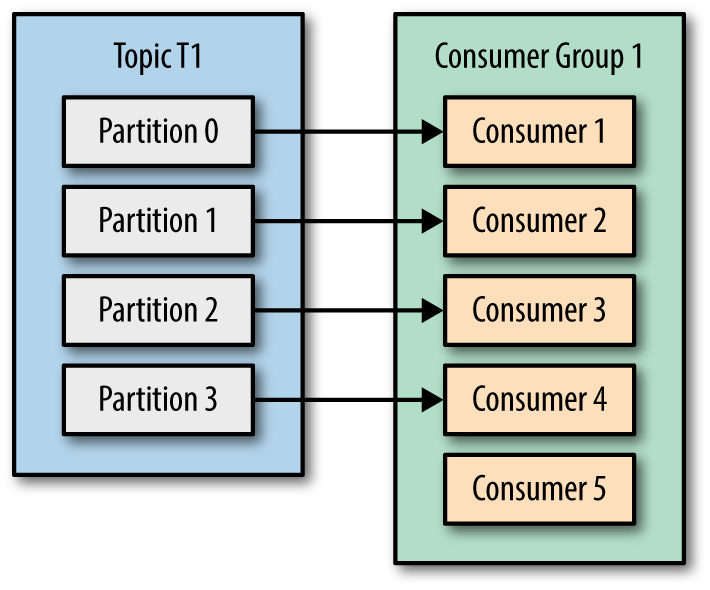

# kafka代码

1. 概念
2. 特征
3. 代码

## 概念

- **Producer**：消息的生产者

  > 生产者将消息发布到 Topic 中，Kafka 根据自己的机制将消息发布到对应的 Partition 中。生产者也可以指定消息存发布的 Partition。

- **Consumer**：消息的消费者

  > 消费者从 Topic 或者 Topic 指定的 Partition 中获取消息进行消费。

- **ConsumerGroup**：消费者组，实现单播和广播的手段

  > 每个 Consumer 可以指定一个 Group Name，相同 Group Name 的 Consumer 视为一个 Group。在开发过程中，**同一 Group Name 的 Consumer 应该实现相同功能！**如果 Consumer 不指定 Group Name，那么它属于默认的那个 Group。
  >
  > Consumer 以 Group 的形式从 Topic 中获取消息进行消费，准确说是从某个 Partition 中获取消息进行消费。一个 Group 下会有一个或者多个 Consumer，而 Partition 中的每个消息只会被同一 Group（中的某一个 Consumer）消费一次，因此如果想要多个 Consumer 都可以对同一个消息进行消费，需要设置它们的 GroupName 不一样就可以了。　　

- **Broker**：kafak服务集群节点，Kafka集群中的一台或多台服务器统称broker。一般的，我们搭建的kafka节点数不会少于3台，具体需要多少依据业务量而定。

- **Topic**：Kafka处理资源的消息源（feeds of messages）的不同分类。

  > Topic 是主题的意思，Kafka 规定每个消息都应该有个主题，Topic 可以理解为对消息的一个分类，比如用户注册使用一个 Topic，用户下单应该使用另外一个 Topic。
  >
  > Broker 和 Topic 没有包含的含义，一个 Broker 下面可以存在多个 Topic 的消息，而一个 Topic 的消息可以保存在一个或者多个 Broker 中。

- **Partition**：Topic 物理上的分组，一个topic可以分为多个partion，每个partion是一个有序的队列。partion中每条消息都会被分配一个有序的Id（offset）。

  > Partition 是分区，其实这就是 Kafka 的队列，Partition 中的数据是具有顺序的，数据按照顺序进行消费，但是不同 Partition 中数据丢失了顺序性。
  >
  > 创建 Topic 时，可以指定 Partition 数，一个 Topic 至少有一个 Partition，kafka 在接收到生产者发送的消息之后，会根据会根据 Paritition 机制将消息**并行的**存储到不同的 Partition 中，这样就提高了吞吐量。
  >
  > 如果我们需要严格控制消息的顺序，那么可以创建只包含一个 Partition 的 Topic，或者在发布消息和消费消息时，指定发布或者消费的 Partition。

- **Replication**：Topic 的副本，一个 Topic 可以有多个副本，一个 Topic 下有多个 Partition，每个 Partition 在每个副本中有对应的 Partition 副本，因为 Topic 副本之间需要保持数据的一致性，因此这些 Partition 之间也就形成和 Zookeeper 一样的 Leader-Follower 集群结构，与 Zookeeper 不同的是，对于数据的读写操作都在 Leader 中，Follower 副本只是当 Leader 副本挂了后才重新选取 Leader，Follower 并不向外提供服务。

  > 为了保证高可用（HA），Kafka 会将 Partition 和它的副本均匀的保存在集群的 Broker 中，因此一般设置副本数不超过集群 Broker 节点数，最好是副本数等于集群节点数，使得集群中每个 Broker 都保存有 Partition，这也是 Kafka 默认的做法。

- **Message**：消息，是通信的基本单位，每个producer可以向一个topic（主题）发布 一些消息

- **Offset**

  Offset 即偏移，偏移是 Partition 对 Consumer Group 而言的，当某个 Consumer 成功消费消息之后，Kafka 会标记该 Consumer 对应的 Group 对于此 Partition 的 Offset 加1，也就是偏移一个单位，因此该 Group 下的其他 Consumer 就消费不到这个消息了。

- **ISR（in-sync replicas）**

  上面有提到，Partition 可能会有多个 Partition 副本，然后这些 Partition 之间也就形成和 Zookeeper 一样的 Leader-Follower 集群结构，只不过 Leader 负责读写，Follower 只是同步数据备用。既然是集群，那就涉及数据同步问题。

  每个 Partition 的 Leader 会记录和维护一个与它保持数据同步的 Replication 集合（Follower），这个集合称为 ISR，每个 Partition 都会有一个与它对应的 ISR。当 Leader 接收到消息后，会等待 Follower 同步数据，当 ISR 中的所有 Replication 都确认已同步数据完成后，Leader 就会认为消息已提交。

  当 Leader 挂掉了，Replication 集合对应的 Follower 就会重新选举生成新的 Leader，因为新 Leader 与原 Leader 保持数据同步，因此这样就避免了数据丢失。如果 Replication 集合为空，Leader 挂了就等于数据丢失了，因此 Replication 是很有必要的。

  ISR 由 Leader 维护，而判断一个 Replication 是否有效，主要看它是否通过 Zookeeper 连接并能及时的从 Leader 中同步数据（超时时间由 server.properties 中 replica.lag.time.max.ms 配置），而且还要同步的数据不能与 Leader 相差太多（消息个数由 server.properties 中 replica.lag.max.messages 配置）。

- **ACK**

  Kafka 的 ACK 机制，指的是 Producer 的消息发送确认机制，这直接影响到 Kafka 集群的吞吐量和消息可靠性。这个可靠性级别由 request.required.acks 来申明，它有3个可选值：0，1，-1

  - `0`：当 Producer 将消息发布到 Leader 之后，无需等待 Leader 确认，可以继续发送下一条消息，这样就提高了发送效率，但是消息可靠性最低。
  - `1`：当 Producer 将消息发布到 Leader 之后，只需等待 Leader 确认，而不管 ISR 中是否已经完成数据同步，这也是 Kafka 默认的 Ack 机制。但是不保证消息一定发送成功，比如 Leader 收到消息并确认后还未进行同步数据就挂了。
  - `-1`：当 Producer 将消息发布到 Leader 之后，需要等到 ISR 中所有的 Replication 全部完成数据同步确认才算消息发送成功，这样做消息可靠性最高。

  当 `Ack = -1`时，往往需要结合 `min.insync.replicas`（默认值为1）一起使用，这是因为 ISR 中的 Replication 由 Leader 维护，个数可能会减少到0，这时 ISR 是一个空集合，此时 `Ack = -1` 和 `Ack = 1` 是同一种情况，而 `min.insync.replicas` 表示 ISR 中的 Replication 副本个数，当 ISR 中的 Replication 个数少于此配置时，就表示消息发布失败。

- **key**：Key 是 Kafka 消息的路由，Producer 在发布消息时可以指定一个路由 Key，当 Kafka 收到消息时，会按照一定的规则选择消息的 Partition：
  1. 如果发布时制定了 Partition，则直接使用
  2. 如果未指定 Partition，但是指定了 Key 值，那么根据 Key 值通过一些规则算法计算消息发布的 Partition
- **Producers**：消息和数据生成者，向Kafka的一个topic发布消息的过程叫做producers
- **Consumers**：消息和数据的消费者，订阅topic并处理其发布的消费过程叫做consumers

Kafka 是基于**发布-订阅**模式的分布式消息服务系统，将上面的概念连接起来就是：

**发布**

当我们的应用连接到 Kafka 集群的一个或者多个 Broker 节点往某个 Topic（或者某个 Topic 的 Partition）发布消息时，Kafka 收到消息后会根据它的路由 Key 等信息得到 Partition，然后将消息转发到该 Partition 的 Leader，然后 Leader 会根据 ISR 机制记录消息，根据 Ack 机制对 Producer 做出响应。

**消费**

当我们的应用连接到 Kafka 集群的一个或者多个 Broker 节点，从多个 Topic（或者 Topic 的 Partition）中订阅消息时，可以指定当前消费者所属的群组（Group Name），多个群组（Group）可以订阅同一个 Topic，每个群组都会收到消息，但是一个消息只会被同一 Group 中的某个 Consumer 消费掉，当消息被成功消费掉之后，Kafka 就会标记与当前 Consumer 对应的 Group 和消息所属的 Partition 对应的 Offset 加1。

 

## 特征

- 重播场景

- 高吞吐

  kafak高吞吐原因分析：

  1. 借助操作系统的文件处理，底层使用page cache 加快读写，所以kafka 服务器要加大page cache 设置提高吞吐
  2. 本身顺序读写，降低复杂度，提高吞吐
  3. 二进制格式而不是json避免序列化反序列化
  4. 对消息的批处理和压缩

- 拉数据模式，可高自定义的消费逻辑

- 适用于所有发布订阅的场景

###### Kafka 使用场景

- Time travel/durable/commit log
- Many consumers for the same message
- High throughput (millions of messages per second)
- Stream processing
- Replicability
- High availability
- Message order

###### RabbitMQ场景

- flexible routing
- Priority Queue
- A standard protocol message queue

**生产者：**

生产者生产消息不仅必须指定Topic，还可按照需求指定发往特定的分区

**消费者：**

- Kafak消费消息后不会删除消息
- 消费者是通过offset偏移量来控制消费消息，offset持久化在消费者一方
- 一个Topic可被一个或多个消费者消费
- 一个消费者可消费不同的多个topic
- 消费者不仅可以指定要消费的Topic，还可指定消费的分区
- 同一个Group可以定义一个或多个消费者
- 同一个Group中的多个消费者只会有一个收到消息
- 不同Group相同Topic的消费者都会收到消息(fanout)

Kafka 只保证分区内的记录是有序的，而不保证主题中不同分区的顺序

- Kafka作为一个集群，运行在一台或者多台服务器上.
- Kafka 通过 topic 对存储的流数据进行分类。
- 每条记录中包含一个key，一个value和一个timestamp（时间戳）。

Kafak争抢模式实现：多个消费者，同一个Topic同一个Group

Kafak广播模式实现：多个消费者，同一个Topic不同Group

## 代码

##### 注意

重新分配分区后，新增分区要等几分钟后才可被触发使用。

多分区场景下，kafka 服务端 lag 有负数情况，目前官方修复为最多-1，此bug并不影响数据的准确性，客户端消费依然正常。生成的消息指定相同的key，此消息将发往同一个分区。消费者数量一定要小于分区数，否则：多出来的消费者永远无法消费到消息！

**为什么Kafka使用的是磁盘反而最终强于依靠内存的rabbitmq？**

1. 顺序写入

   因为硬盘是机械结构，每次读写都会寻址->写入，其中寻址是一个“机械动作”，它是最耗时的。所以硬盘最“讨厌”随机I/O，最喜欢顺序I/O。为了提高读写硬盘的速度，Kafka就是使用顺序I/O。如果一个topic建立多个分区，那么每个parathion都是一个文文件，收到消息后Kafka会把数据插入到文件末尾。

2. Memory Mapped Files（内存映射文件）

   64位操作系统中一般可以表示20G的数据文件，它的工作原理是直接利用操作系统的Page来实现文件到物理内存的直接映射。完成映射之后你对物理内存的操作会被同步到硬盘上

   Kafka高效文件存储设计特点：Kafka把topic中一个parition大文件分成多个小文件段，通过多个小文件段，就容易定期清除或删除已经消费完的文件，减少磁盘占用。通过索引信息可以快速定位message和确定response的最大大小。通过index元数据全部映射到memory（内存映射文件），可以避免segment file的IO磁盘操作。通过索引文件稀疏存储，可以大幅降低index文件元数据占用空间大小。

**Kafka数据存储**

- 数据文件的分段

  Kafka解决查询效率的手段之一是将数据文件分段，比如有100条Message，它们的offset是从0到99。假设将数据文件分成5段，第一段为0-19，第二段为20-39，以此类推，每段放在一个单独的数据文件里面，数据文件以该段中最小的offset命名。这样在查找指定offset的Message的时候，用二分查找就可以定位到该Message在哪个段中。

- 为数据文件建索引

  数据文件分段使得可以在一个较小的数据文件中查找对应offset的Message了，但是这依然需要顺序扫描才能找到对应offset的Message。为了进一步提高查找的效率，Kafka为每个分段后的数据文件建立了索引文件，文件名与数据文件的名字是一样的，只是文件扩展名为.index。

  索引文件中包含若干个索引条目，每个条目表示数据文件中一条Message的索引。索引包含两个部分（均为4个字节的数字），分别为相对offset和position。

  相对offset：因为数据文件分段以后，每个数据文件的起始offset不为0，相对offset表示这条Message相对于其所属数据文件中最小的offset的大小。举例，分段后的一个数据文件的offset是从20开始，那么offset为25的Message在index文件中的相对offset就是25-20 = 5。存储相对offset可以减小索引文件占用的空间。

  position：表示该条Message在数据文件中的绝对位置。只要打开文件并移动文件指针到这个position就可以读取对应的Message了。

  index文件中并没有为数据文件中的每条Message建立索引，而是采用了稀疏存储的方式，每隔一定字节的数据建立一条索引。这样避免了索引文件占用过多的空间，从而可以将索引文件保留在内存中。但缺点是没有建立索引的Message也不能一次定位到其在数据文件的位置，从而需要做一次顺序扫描，但是这次顺序扫描的范围就很小了。

**参考：**

- [官方文档](http://kafka.apachecn.org/documentation.html#producerapi)
- [C#客户端使用](https://docs.confluent.io/current/clients/dotnet.html)
- [Apache kafka 工作原理介绍](https://www.ibm.com/developerworks/cn/opensource/os-cn-kafka/index.html)
- [从Kafka读取数据](https://www.oreilly.com/library/view/kafka-the-definitive/9781491936153/ch04.html)
- [Kafka为什么这么快](https://www.freecodecamp.org/news/what-makes-apache-kafka-so-fast-a8d4f94ab145/)
- [没有星星的夏季](https://www.cnblogs.com/shanfeng1000/default.html)
- [客户端源码](#https://github.com/confluentinc/confluent-kafka-dotnet)

