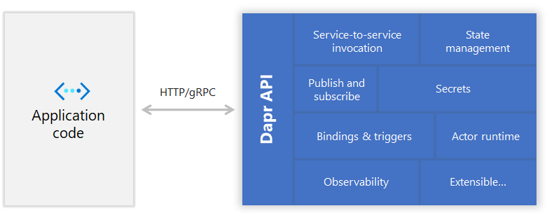
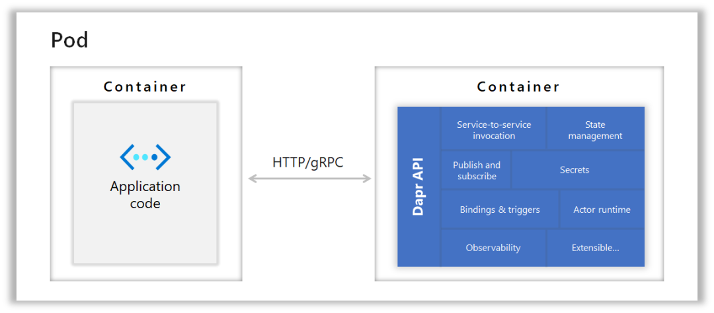

从历史上看，锁的问题如鬼魂一直伴随着我们：

1. 用数据表一个字段来表示状态，比如1表示已付款未发货，2表示已付款已发货，然后用户来一个请求用SQL或存储过程修改，这时使用的数据库锁。

2. 用ORM实现，比如Hibernate JPA来修改状态，虽然不用SQL了，但是Hibernate的悲观锁和乐观锁也让人抓狂。

3. 彻底抛弃数据库，直接在内存缓存中进行修改，使用Java的同步锁，性能还是不够，吞吐量上不去。如上图提示，只能一个厕所蹲位一个人用，其他人必须排队。

4. Actor模型。

**Actor模型原理**

Actor模型 = 数据 + 行为 + 消息。

Actor模型内部的状态由自己的行为维护，外部线程不能直接调用对象的行为，必须通过消息才能激发行为，这样就保证Actor内部数据只有被自己修改。

**Actor模型如何实现？**

Scala 或 ErLang 的进程信箱都是一种 Actor 模型，也有 Java 的专门的 Actor 模型，这里是[几种Actor模型比较](http://www.jdon.com/45380)

明白了 Actor 模型原理，使用 Disruptor 这样无锁队列也可以自己实现 Actor 模型，让一个普通对象与外界的交互调用通过 Disruptor 消息队列实现，比如 LMAX 架构就是这样实现高频交易，从2009年成功运行至今，被Martin Fowler推崇。

回到最初问题，**如何使用Actor模型解决高并发事务呢？**

转账是典型的符合该问题的案例，转账是将A帐号到B帐号转账，使用Actor模型解决如下：

发出是否可转出消息--->消息队列--->A

A作为一个对象，注意不是数据表，对象是有行为的，检查自己余额是否可转账，如果可以，冻结这部分金额，比如转账100元，冻结100元，从余额中扣除。因为外部命令是通过消息顺序进来的，所以下一个消息如果也是扣除，再次检查余额是否足够......

具体详细流程可见：[REST和](http://www.jdon.com/45622/5#23143081)[**DDD**](https://www.jdon.com/tags/272)

那么，既然Actor模型如此巧妙，而解决方向与我们习惯的数据喂机器的方式如此不同，那么如何在实战中能明显发现某个数据修改应该用Actor模型解决呢？因为我们习惯将数据喂机器的思路啊？

使用DDD领域驱动设计或[**CQRS**](https://www.jdon.com/tags/9958)架构就能明显发现这些特殊情况，CQRS是读写分离，其中写操作是应领域专家要求编写的功能，在这类方向，我们都有必要使用Actor模型实现，因为在这个方向上，领域专家的要求都表达为聚合根实体，聚合根就是用Actor模型实现最合适不过了。而读方向，比如大数据处理，报表查询，OLTP等等都是数据喂机器的方式。

有的道友会疑问，我们经常使用SSH，也就是Spring + Hibernate架构，这个默认是哪种方向呢？很显然，默认是数据喂机器的方向，所以在实现写操作时，特别警惕高并发发生死锁等影响性能问题，当然也包括EJB架构。

有一种 togaf 架构，将企业软件[**架构**](https://www.jdon.com/tags/249)分为数据架构和应用架构等，实际是EJB或SSH的变相描述，这种架构的问题我们已经一目了然了，特别这样的系统如果从面向内部管理转向到SaaS模型时，这类高并发死锁问题就特别容易发生，几乎不具备可用性。前期12306火车票系统是这类问题的典型体现。





无论 `Dapr` 是不是能成功，`Dapr`这种新的微服务的部署模式是未来的方向，值得关注。

`Dapr`区别于传统微服务框架最大的优点就是**SideCar**。因为以前的微服务框架都需要代码项目引用微服务相关的一些类库，无论是服务注册发现、熔断、配置等都是要调用对应类库实现，这些类库是运行在微服务的进程中的，因此这些类库都需要使用和业务代码一样（或者兼容）的语言来开发，因此是比较重的。

而**SideCar**这种模式，把“注册发现、熔断、配置”等这些微服务的功能都剥离到一个和业务代码的进程相伴而行的独立进程中，业务代码通过 http 或者 gRPC 等方式和这个 **SideCar** 进程通讯来完成微服务的相关服务的调用。

显而易见，在 **SideCar** 这种模式中，业务代码中只有极少数和 **SideCar** 进程通讯的代码，因此非常轻量级。这样 **SideCar** 进程中的服务可以独立升级，模块可以自由组合，不会干扰业务代码。同时由于 **SideCar** 的进程是独立的进程，业务代码和 **SideCar** 进程通讯是采用 http、gRPC 这样语言无关的协议，因此业务代码可以采用任何语言来进行开发。


**微服务优势：**

- 应用按业务拆分成服务

- 各个服务均可独立部署

- 服务可被多个应用共享

- 服务之间可以通信

- 架构上系统更加清晰

- 核心模块稳定，以服务组件为单位进行升级，避免了频繁发布带来的风险

- 开发管理方便

- 单独团队维护、工作分明，职责清晰

- 业务复用、代码复用

- 可拓展性强

**微服务挑战：**

- 依赖关系复杂
- 网络开销变大
- 服务拆分难点（边界确定）

**php挑战：**

fpm 开发模式下，因为无法常驻内存，每一次请求都要从零开始加载到退出进程，增加很多无用的开销，数据库连接无法复用也得不到保护。

fpm是以进程为单位的，因此fpm的进程数也决定了并发数。

这就是fpm开发简单的同时，给我们带来的问题。

**php解决方案：Swoft**

Swoft是一个带有服务治理功能的RPC框架。

Swoft是首个PHP常驻内存协程全栈框架，基于高性能协程swoole打造的一个PHP界的Spring Boot。

Swoft提供了类似 Dubbo 的更为优雅地使用 RPC 服务的方式，Swoft 性能非常棒，近似Golang。

#### 优雅的服务治理

**服务注册与发现**

微服务治理过程中，经常会涉及注册启动的服务到第三方集群，比如 consul / etcd 等等，以 Swoft 框架中使用 swoft-consul 组件，实现服务注册与发现为例。

实现逻辑

```php
<?php declare(strict_types=1);

namespace App\Common;

use ReflectionException;
use Swoft\Bean\Annotation\Mapping\Bean;
use Swoft\Bean\Annotation\Mapping\Inject;
use Swoft\Bean\Exception\ContainerException;
use Swoft\Consul\Agent;
use Swoft\Consul\Exception\ClientException;
use Swoft\Consul\Exception\ServerException;
use Swoft\Rpc\Client\Client;
use Swoft\Rpc\Client\Contract\ProviderInterface;

/**
 * Class RpcProvider
 * @since 2.0
 * @Bean()
 */
class RpcProvider implements ProviderInterface
{
    /**
     * @Inject()
     * @var Agent
     */
    private $agent;

    /**
     * @param Client $client
     * @return array
     * @throws ReflectionException
     * @throws ContainerException
     * @throws ClientException
     * @throws ServerException
     * @example
     * [
     *     'host:port',
     *     'host:port',
     *     'host:port',
     * ]
     */
    public function getList(Client $client): array
    {
        // Get health service from consul
        $services = $this->agent->services();
        $services = [];
        return $services;
    }
}
```

**服务熔断**

在分布式环境下，特别是微服务结构的分布式系统中， 一个软件系统调用另外一个远程系统是非常普遍的。这种远程调用的被调用方可能是另外一个进程，或者是跨网路的另外一台主机，这种远程的调用和进程的内部调用最大的区别是，远程调用可能会失败，或者挂起而没有任何回应，直到超时。更坏的情况是， 如果有多个调用者对同一个挂起的服务进行调用，那么就很有可能的是一个服务的超时等待迅速蔓延到整个分布式系统，引起连锁反应，从而消耗掉整个分布式系统大量资源。最终可能导致系统瘫痪。

断路器（Circuit Breaker）模式就是为了防止在分布式系统中出现这种瀑布似的连锁反应导致的灾难。

基本的断路器模式下，保证了断路器在open状态时，保护supplier不会被调用， 但我们还需要额外的措施可以在supplier恢复服务后，可以重置断路器。一种可行的办法是断路器定期探测supplier的服务是否恢复， 一但恢复， 就将状态设置成close。断路器进行重试时的状态为半开（half-open）状态。

熔断器的使用想到简单且功能强大，使用一个 @Breaker 注解即可，Swoft 的熔断器可以用于任何场景，例如服务调用的时候使用，请求第三方的时候都可以对它进行熔断降级。

```php
<?php declare(strict_types=1);

namespace App\Model\Logic;

use Exception;
use Swoft\Bean\Annotation\Mapping\Bean;
use Swoft\Breaker\Annotation\Mapping\Breaker;

/**
 * Class BreakerLogic
 * @since 2.0
 * @Bean()
 */
class BreakerLogic
{
    /**
     * @Breaker(fallback="loopFallback")
     * @return string
     * @throws Exception
     */
    public function loop(): string
    {
        // Do something
        throw new Exception('Breaker exception');
    }

    /**
     * @return string
     * @throws Exception
     */
    public function loopFallback(): string
    {
        // Do something
    }
}
```

**[服务限流](https://link.zhihu.com/?target=https%3A//shimo.im/docs/KcrgrdtVcJWVGG6D/read)**

限流、熔断、降级都很重要。服务不行的时候一定要熔断。限流是一个保护自己的利器，如果没有自我保护机制，那么不管有多少连接都会被接收，一旦后端处理不过来，前端流量又很大的时候服务就挂了。

限流是对稀缺资源访问时，比如秒杀，抢购的商品时，限制并发和请求的数量，从而有效的进行削峰并使得流量曲线平滑。限流的目的是对并发访问和并发请求进行限速，或者一个时间窗口内请求进行限速从而来保护系统，一旦达到或超过限制速率就可以拒绝服务或者进行排队等待等。

Swoft 限流器底层采用的是令牌桶算法，底层依赖于 Redis 实现分布式限流。

Swoft 限速器不仅可以限流控制器，也可以限制任何 bean 里面的方法，可以控制方法的访问速率。这里以下面使用示例详解：

```php
<?php declare(strict_types=1);

namespace App\Model\Logic;

use Swoft\Bean\Annotation\Mapping\Bean;
use Swoft\Limiter\Annotation\Mapping\RateLimiter;

/**
 * Class LimiterLogic
 * @since 2.0
 * @Bean()
 */
class LimiterLogic
{
    /**
     * @RequestMapping()
     * @RateLimiter(rate=20, fallback="limiterFallback")
     * @param Request $request
     * @return array
     */
    public function requestLimiter2(Request $request): array
    {
        $uri = $request->getUriPath();
        return ['requestLimiter2', $uri];
    }
    
    /**
     * @param Request $request
     * @return array
     */
    public function limiterFallback(Request $request): array
    {
        $uri = $request->getUriPath();
        return ['limiterFallback', $uri];
    }
}
```

key 这里支持 `symfony/expression-language` 表达式， 如果被限速会调用 `fallback`中定义的`limiterFallback` 方法

[**配置中心**](https://link.zhihu.com/?target=https%3A//shimo.im/docs/KcrgrdtVcJWVGG6D/read)

说起配置中心前我们先说说配置文件，我们并不陌生，它提供我们可以动态修改程序运行能力。引用别人的一句话就是：

> 系统运行时(runtime)飞行姿态的动态调整！

我可以把我们的工作称之为在快速飞行的飞机上修理零件。我们人类总是无法掌控和预知一切。对于我们系统来说，我们总是需要预留一些控制线条，以便在我们需要的时候做出调整，控制系统方向（如灰度控制、限流调整），这对于拥抱变化的互联网行业尤为重要。

对于单机版，我们称之为配置（文件）；对于分布式集群系统，我们称之为配置中心（系统）;

到底什么是分布式配置中心？

随着业务的发展、微服务架构的升级，服务的数量、程序的配置日益增多（各种微服务、各种服务器地址、各种参数），传统的配置文件方式和数据库的方式已无法满足开发人员对配置管理的要求：

- 安全性：配置跟随源代码保存在代码库中，容易造成配置泄漏；

- 时效性：修改配置，需要重启服务才能生效；

- 局限性：无法支持动态调整：例如日志开关、功能开关；

因此，我们需要配置中心来统一管理配置！把业务开发者从复杂以及繁琐的配置中解脱出来，只需专注于业务代码本身，从而能够显著提升开发以及运维效率。同时将配置和发布包解藕也进一步提升发布的成功率，并为运维的细力度管控、应急处理等提供强有力的支持。

关于分布式配置中心，网上已经有很多开源的解决方案，例如：

Apollo是携程框架部门研发的分布式配置中心，能够集中化管理应用不同环境、不同集群的配置，配置修改后能够实时推送到应用端，并且具备规范的权限、流程治理等特性，适用于微服务配置管理场景。

以 Apollo 为例，从远端配置中心拉取配置以及安全重启服务。如果对 Apollo 不熟悉，可以先看 Swoft 扩展 Apollo 组件以及阅读 Apollo 官方文档。

以 Swoft 中使用 Apollo 为例，当 Apollo 配置变更后，重启服务(http-server / rpc-server/ ws-server)。如下是一个 agent 例子：

```php
<?php declare(strict_types=1);

namespace App\Model\Logic;

use Swoft\Apollo\Config;
use Swoft\Apollo\Exception\ApolloException;
use Swoft\Bean\Annotation\Mapping\Bean;
use Swoft\Bean\Annotation\Mapping\Inject;

/**
 * Class ApolloLogic
 * @since 2.0
 * @Bean()
 */
class ApolloLogic
{
    /**
     * @Inject()
     * @var Config
     */
    private $config;

    /**
     * @throws ApolloException
     */
    public function pull(): void
    {
        $data = $this->config->pull('application');    
        // Print data
        var_dump($data);
    }
}
```

以上就是一个简单的 Apollo 配置拉取，`Swoft-Apollo`除此方法外，还提供了更多的使用方法。

很多coder在进阶的时候都会遇到一些问题和瓶颈，业务代码写多了没有方向感，不知道该从那里入手去提升，对此我们需要自己总结并整理多个知识点的高级进阶干货（读书百遍，其意自现），包括但不限于：分布式架构、高可扩展、高性能、高并发、服务器性能调优、TP6，laravel，YII2，Redis，Swoole、Swoft、Kafka、Mysql优化、shell脚本、Docker、微服务、Nginx等。

**参考：**

- https://www.swoft.org/#referral
- https://shimo.im/docs/KcrgrdtVcJWVGG6D/read