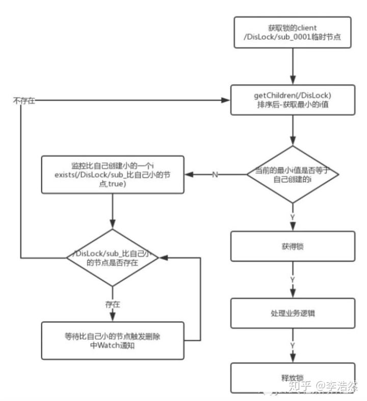
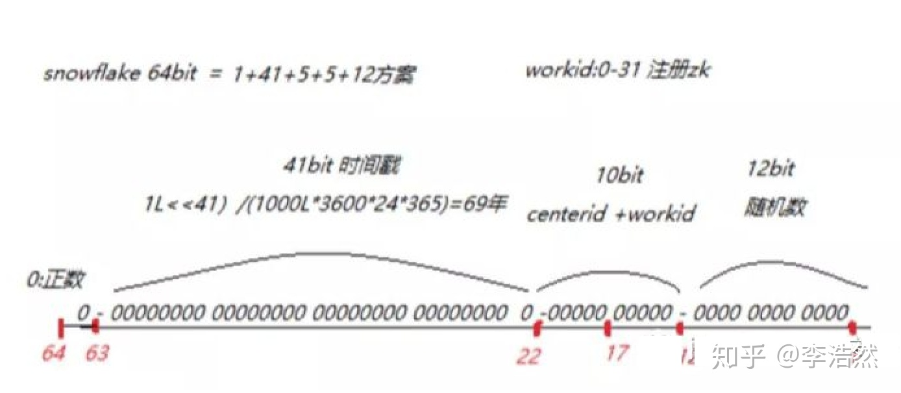
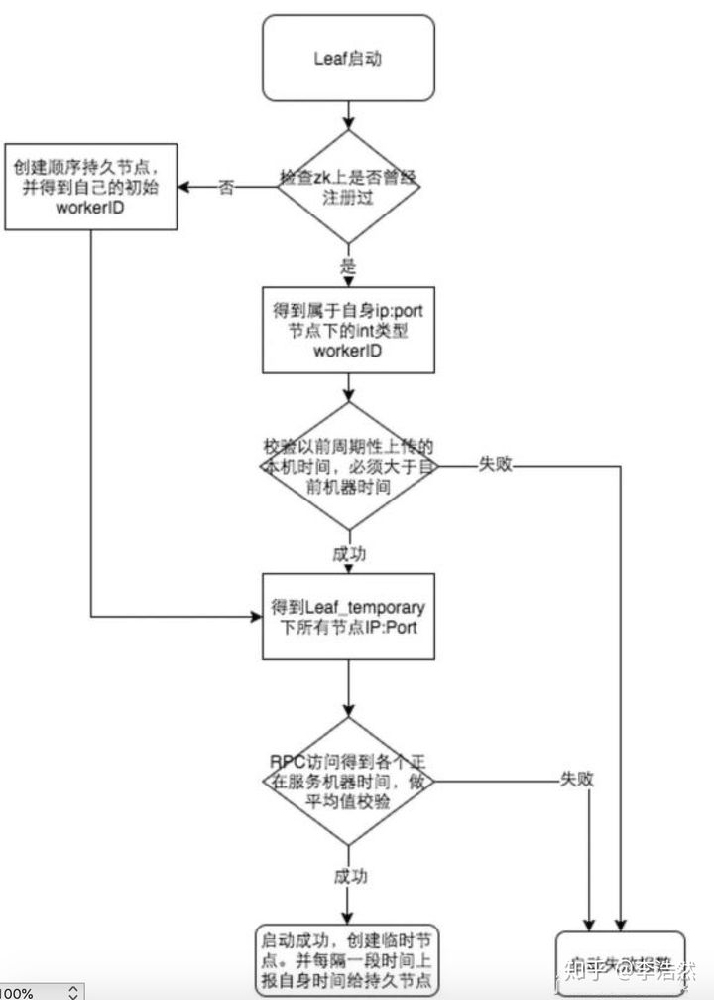
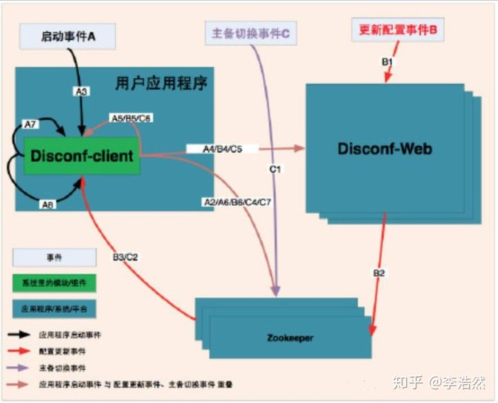

# Zookeeper

## 简介

**Zookeeper分布式锁**

- 我们将锁抽象成目录，多个线程在此目录下创建瞬时的序列节点，因为Zk会为我们保证节点的序列性，所以可以利用节点的序列进行锁的判断。
- 首先创建序列节点进行升序排序，然后获取当前目录下最小的节点，判断最小节点是不是当前节点，如果是那么获取锁成功，如果不是那么获取锁失败。
- 获取锁失败的节点获取当前节点上一个顺序节点，对此节点注册监听，当节点删除的时候通知当前节点。
- 当unlock的时候删除节点之后会通知下一个节点。

**ZK命名服务-ID生成器**

zk特性：顺序节点的特性 + **snowflake方案**

41-bit的时间可以表示（1L<<41）/(1000L*3600*24*365)=69年的时间，10-bit机器可以分别表示1024台机器。如果我们对IDC划分有需求，还可以将10-bit分5-bit给IDC，分5-bit给工作机器。这样就可以表示32个IDC，每个IDC下可以有32台机器，可以根据自身需求定义。12个自增序列号可以表示2^12个ID，理论上snowflake方案的QPS约为409.6w/s，这种分配方式可以保证在任何一个IDC的任何一台机器在任意毫秒内生成的ID都是不同的。

到家采用：1+41+5+5+12 方案 即：时间+ center_id +worker_id+随机数

Id:案例：995961692951035904 =18位

优点：

1. 毫秒数在高位，自增序列在低位，整个ID都是趋势递增的。
2. 不依赖数据库等第三方系统，以服务的方式部署，稳定性更高，生成ID的性能也是非常高的。
3. 可以根据自身业务特性分配bit位，非常灵活。

**解决时钟问题**

因为这种方案依赖时间，如果机器的时钟发生了回拨，那么就会有可能生成重复的ID号，需要解决时钟回退的问题。

参见上图整个启动流程图，服务启动时首先检查自己是否写过ZooKeeper leaf_forever节点：

1. 若写过，则用自身系统时间与`leaf_forever/${self}`节点记录时间做比较，若小于`leaf_forever/${self}`时间则认为机器时间发生了大步长回拨，服务启动失败并报警。
2. 若未写过，证明是新服务节点，直接创建持久节点`leaf_forever/${self}`并写入自身系统时间，接下来综合对比其余Leaf节点的系统时间来判断自身系统时间是否准确，具体做法是取leaf_temporary下的所有临时节点（所有运行中的Leaf-snowflake节点）的服务IP：Port，然后通过RPC请求得到所有节点的系统时间，计算`sum(time)/nodeSize`。
3. 若 `abs(系统时间-sum(time)/nodeSize) < 阈值`，认为当前系统时间准确，正常启动服务，同时写临时节点 `leaf_temporary/${self}` 维持租约。
4. 否则认为本机系统时间发生大步长偏移，启动失败并报警。
5. 每隔一段时间（3s）上报自身系统时间写入 `leaf_forever/${self}`。

**Disconf设计方案**

Disconf 通过 disconf-web 管理配置信息，然后将配置的 key 在 Zookeeper 上建立节点，disconf-client 启动后拉取自身需要的配置信息并监听 Zookeeper 的节点。在 web 上更新配置信息会触发 zk 节点状态的变动，client 可以实时感知到变化，然后从 web 上拉取最新配置信息。

