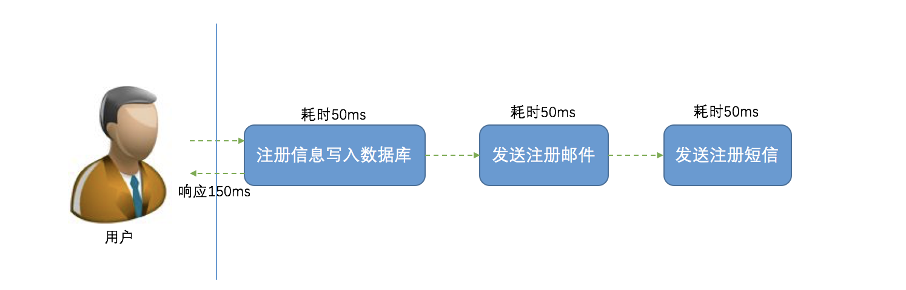
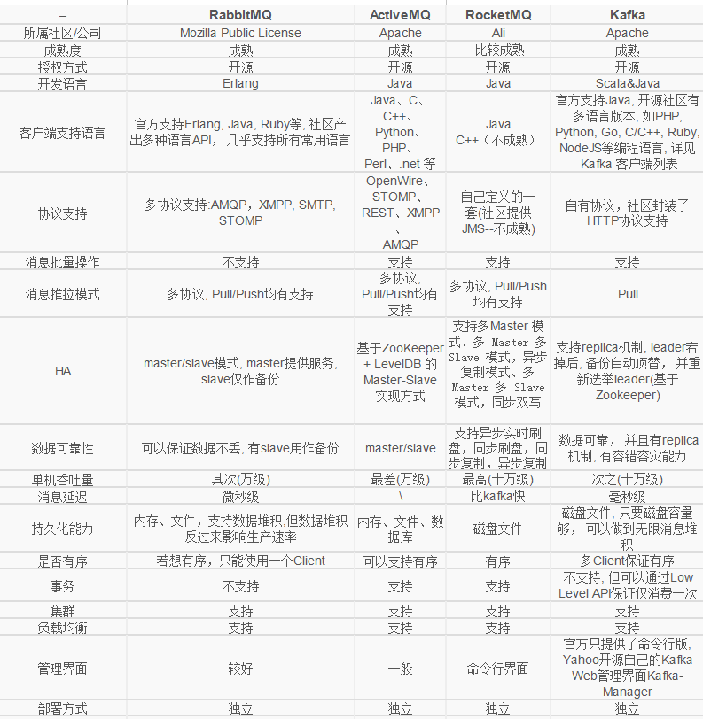
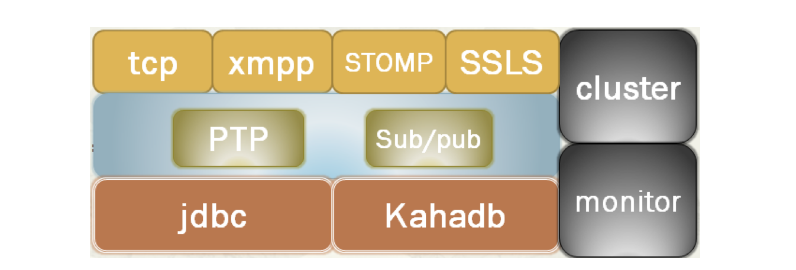
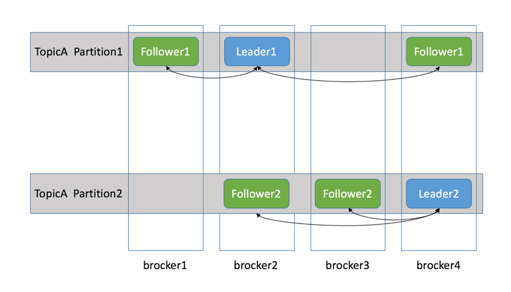

# 中间件简介

1. ServiceRegistry
2. [Zookeeper](#Zookeeper)
3. [Apollo](#Apollo)
4. [消息队列](#消息队列)

## ServiceRegistry

在现在云计算和大数据快速发展的今天，业务快速发展和变化。我们以前的单一应用难以应对这种快速的变化，因此我们需要将以前单一的大应用不断进行差分，分成若干微小的应用或者服务，这就是微服务的思想。

但是当我们对服务进行拆分之后，我们将又面临新的问题。服务之间该如何调用？直接调用？当服务很少只有几个的时候你可能感觉直接调用是最高效和便捷的，但是当服务多达上千个呢？这时我们又该怎么来管理我们的调用关系呢？

**服务注册中心解决的问题：**

主要是两个：服务注册 和 服务发现。

- **服务注册：** 服务实例将自身服务信息注册到注册中心。这部分服务信息包括服务所在主机IP和提供服务的Port，以及暴露服务自身状态以及访问协议等信息。
- **服务发现：** 服务实例请求注册中心获取所依赖服务信息。服务实例通过注册中心，获取到注册到其中的服务实例的信息，通过这些信息去请求它们提供的服务。

除了这两个核心功能之外，一般服务注册中心还需要监控服务实例的运行状态，负载均衡等问题。

- **监控：** 服务实例一直处于动态的变化中，因此我们需要监控服务实例的健康状况，从注册中心剔除无用的服务。一般实现心跳连接等。
- **负载均衡：** 在一个服务有多个实例的情况下，我们需要根据负载均衡策略正确处理请求。

**CAP原则：**

这里不得不提一下，我们知道分布式里一个重要的理论，那就是 **CAP** 原则。指的是在一个分布式系统中，Consistency（一致性）、Availability（可用性）、Partition Tolerance（分区容错性），不能同时成立。

- **一致性：** 它要求在同一时刻点，分布式系统中的所有数据备份都处于同一状态。
- **可用性：** 在系统集群的一部分节点宕机后，系统依然能够响应用户的请求。
- **分区容错性：** 在网络区间通信出现失败，系统能够容忍。

一般来讲，基于网络的不稳定性，分布容错是不可避免的，所以我们默认CAP中的P总是成立的。

一致性强制数据统一的要求，必然会导致在更新数据时部分节点处于被锁定状态，此时不可对外提供服务，影响了服务的可用性，反之亦然。因此一致性和可用性不能同时满足。

在注册中心的发展上面，一直有两个分支：一个就是 CP 系统，追求数据的强一致性。还有一个是 AP 系统，追求高可用与最终一致。我们介绍的服务注册和发现组件中，Eureka满足了其中的AP，Consul 和 Zookeeper 满足了其中的CP。

## Eureka

Eureka是在Java语言上，基于Restful Api开发的服务注册与发现组件，由Netflix开源。

遗憾的是，目前Eureka仅开源到1.X版本，2.X版本已经停止开发。

Eureka由两个组件组成：Eureka服务器和Eureka客户端。

- Eureka 服务器用作服务注册服务器。

- Eureka 客户端是一个 java 客户端，用来简化与服务器的交互、作为轮询负载均衡器，并提供服务的故障切换支持。

  >Netflix在其生产环境中使用的是另外的客户端，它提供基于流量、资源利用率以及出错状态的加权负载均衡。

Spring Cloud 封装了 Netflix 公司开发的 Eureka 模块来实现服务注册和发现。

Eureka 采用了 C-S 的设计架构：

- Eureka Server 作为服务注册功能的服务器，它是服务注册中心。

- 而系统中的其他微服务，使用 Eureka 的客户端连接到 Eureka Server，并维持心跳连接。

  >这样系统的维护人员就可以通过 Eureka Server 来监控系统中各个微服务是否正常运行。Spring Cloud 的一些其他模块（比如Zuul）就可以通过 Eureka Server 来发现系统中的其他微服务，并执行相关的逻辑。

上图来自 Eureka 官方的架构图，大致描述了 Eureka 集群的工作过程。图中包含的组件非常多，可能比较难以理解，我们用通俗易懂的语言解释一下：

- Application Service：作为Eureka Client，扮演了服务的提供者，提供业务服务，向Eureka Server注册和更新自己的信息，同时能从Eureka Server的注册表中获取到其他服务的信息。
- Eureka Server：扮演服务注册中心的角色，提供服务注册和发现的功能，每个Eureka Cient向Eureka Server注册自己的信息，也可以通过Eureka Server获取到其他服务的信息达到发现和调用其他服务的目的。
- Application Client：作为Eureka Client，扮演了服务消费者，通过Eureka Server获取到注册到上面的其他服务的信息，从而根据信息找到所需的服务发起远程调用。
- Replicate：Eureka Server中的注册表信息的同步拷贝，保持不同的Eureka Server集群中的注册表中的服务实例信息的一致性。提供了数据的最终一致性。
- Make Remote Call：服务之间的远程调用。
- Register：注册服务实例，Client端向Server端注册自身的元数据以进行服务发现。
- Renew：续约，通过发送心跳到Server维持和更新注册表中的服务实例元数据的有效性（默认周期为30秒）。当在一定时长内Server没有收到Client的心跳信息（默认90秒），将默认服务下线，将服务实例的信息从注册表中删除。
- Cancel：服务下线，Client在关闭时主动向Server注销服务实例元数据，这时Client的的服务实例数据将从Server的注册表中删除。

最后我们需要注意的Eureka的缓存机制。Eureka Client会缓存Eureka Server中的信息。即使所有的Eureka Server节点都宕掉，服务消费者依然可以使用缓存中的信息找到服务提供者。

Ereka Client客户端默认每30秒发送一次请求来更新缓存的注册信息。如果你并不是在Spring Cloud环境下使用这些组件(Eureka, Ribbon)，你的服务启动后并不会马上向Eureka注册，而是需要等到第一次发送心跳请求时才会注册。心跳请求的发送间隔也是30s。（Spring Cloud对此做了修改，服务启动后会马上注册）

## Zookeeper

**为什么需要Zookeeper？**

很多中间件，比如Kafka、Hadoop、HBase，都用到了 Zookeeper，于是很多人就会去了解这个 Zookeeper 到底是什么，为什么它在分布式系统里有着如此无可替代的地位。

在踩了很多坑之后，我决定来回答下这个问题。

**其实学任何一项技术，首先都要弄明白，为什么需要这项技术。**

**正经点来回答，就是我们需要一个用起来像单机但是又比单机更可靠的东西。**

下面开始不正经的回答。

一个团队里面，需要一个leader，leader是干嘛用的？管理什么的咱不说，就说如果外面的人，想问关于这个团队的一切事情，首先就会去找这个leader，因为他知道的最多，而且他的回答最靠谱。

比如产品经理小饼过来要人，作为leader，老吕发现小耀最近没有项目安排，于是把小耀安排给了小饼的项目；

过了一会，另一个产品小西也过来要人，老吕发现刚刚把小耀安排走了，已经没人，于是就跟小西说，人都被你们产品要走了，你们产品自己去协调去。

如果老吕这时候忘了小耀已经被安排走了，把小耀也分配给小西，那到时两个产品就要打架了。

这就是leader在团队里的**协调作用**。

同样的，在分布式系统中，也需要这样的协调者，来回答系统下各个节点的提问。

比如我们搭建了一个数据库集群，里面有一个Master，多个Slave，Master负责写，Slave只读，我们需要一个系统，来告诉客户端，哪个是Master。

有人说，很简单，我们把这个信息写到一个Java服务器的内存就好了，用一个map，key:master，value:master机器对应的ip

但是别忘了，这是个单机，一旦这个机器挂了，就完蛋了，客户端将无法知道到底哪个是Master。

于是开始进行拓展，拓展成三台服务器的集群。

这下问题来了，如果我在其中一台机器修改了Master的ip，数据还没同步到其他两台，这时候客户端过来查询，如果查询走的是另外两台还没有同步到的机器，就会拿到旧的数据，往已经不是master的机器写数据。

所以我们需要这个存储master信息的服务器集群，做到当信息还没同步完成时，不对外提供服务，阻塞住查询请求，等待信息同步完成，再给查询请求返回信息。

这样一来，请求就会变慢，变慢的时间取决于什么时候这个集群认为数据同步完成了。

假设这个数据同步时间无限短，比如是1微妙，可以忽略不计，那么其实这个分布式系统，就和我们之前单机的系统一样，既可以保证数据的一致，又让外界感知不到请求阻塞，同时，又不会有SPOF（Single Point of Failure）的风险，即不会因为一台机器的宕机，导致整个系统不可用。

**这样的系统，就叫分布式协调系统。谁能把这个数据同步的时间压缩的更短，谁的请求响应就更快，谁就更出色，Zookeeper就是其中的佼佼者。**

**它用起来像单机一样，能够提供数据强一致性，但是其实背后是多台机器构成的集群，不会有SPOF。**

其实就是CAP理论中，满足CP，不满足A的那类分布式系统。

如果把各个节点比作各种小动物，那协调者，就是动物园管理员，这也就是Zookeeper名称的由来了，从名字就可以看出来它的雄心勃勃。

讲完了上面这些，现在再来看官网这句话，就很能理解了：

>ZooKeeper: A Distributed Coordination Service for Distributed Applications

当然还有这句：

>ZooKeeper: Because Coordinating Distributed Systems ia a Zoo

而以往的很多ZK教程，上来就是 **Zookeeper是开源的分布式应用协调系统**，很多小年轻看到就会很费解，到底什么是分布式协调，为什么分布式就需要协调 …

上面只是回答了“为什么需要Zookeeper”，或者说，“为什么需要分布式协调系统”，如果想进一步学习 ZK，你还需要了解下 Zookeeper 的内部实现原理。

比如 ZK 的宏观结构：

到 ZK 的微观：

再到 ZK 是如何实现高性能的强一致的，即ZAB协议的原理，很多教程上来就开始介绍ZAB协议，很容易让人一头雾水，不知道为什么需要这样一个分布式一致性协议，有了上述介绍的背景，就好懂许多。

当然你还可以比较一下最近几年很火的 etcd 跟 ZK 的差别。

最后推荐两份 ZK 的学习资源：

- [ZK官网](https://link.zhihu.com/?target=https%3A//zookeeper.apache.org/doc/r3.5.5/zookeeperOver.html)
- 《从 Paxos 到 Zookeeper》

当然，想做分布式协调服务，不一定需要ZK这种CP的中间件，用AP也可以。而到底是用AP还是CP，是由业务决定的。

比如你是一个文件上传的服务器，用户可能上传几个g的文件，那么如果用一个AP的系统，拿到的可能是不可用的节点，这样返回给客户端重试，客户端肯定得疯掉，这时候就需要用CP。

而像 rpc 调用，调用失败了重试就好，成本代价都不大，这时候，用AP可能会更合适。

**Zookeeper是什么？**

官方文档上这么解释zookeeper，它是一个分布式服务框架，是Apache Hadoop 的一个子项目，它主要是用来解决分布式应用中经常遇到的一些数据管理问题，如：统一命名服务、状态同步服务、集群管理、分布式应用配置项的管理等。

上面的解释有点抽象，简单来说 **zookeeper=文件系统+监听通知机制**。

**1、文件系统**

Zookeeper维护一个类似文件系统的数据结构：

每个子目录项如 NameService 都被称作为 znode（目录节点），和文件系统一样，我们能够自由的增加、删除znode，在一个znode下增加、删除子znode，唯一的不同在于znode是可以存储数据的。

有四种类型的znode：

1. PERSISTENT：持久化目录节点

   客户端与zookeeper断开连接后，该节点依旧存在

2. PERSISTENT_SEQUENTIAL：持久化顺序编号目录节点

   客户端与zookeeper断开连接后，该节点依旧存在，只是Zookeeper给该节点名称进行顺序编号

3. EPHEMERAL：临时目录节点

   客户端与zookeeper断开连接后，该节点被删除

4. EPHEMERAL_SEQUENTIAL：临时顺序编号目录节点

   客户端与zookeeper断开连接后，该节点被删除，只是Zookeeper给该节点名称进行顺序编号

**2、监听通知机制**

客户端注册监听它关心的目录节点，当目录节点发生变化（数据改变、被删除、子目录节点增加删除）时，zookeeper会通知客户端。

就这么简单，下面我们看看Zookeeper能做点什么呢？

**Zookeeper能做什么**？

zookeeper功能非常强大，可以实现诸如分布式应用配置管理、统一命名服务、状态同步服务、集群管理等功能。

**ZK VS Redis 锁对比**

**Zookeeper注册发现**

dubbo注册中心：

节点角色说明：

- `Provider`暴露服务的服务提供方
- `Consumer`调用远程服务的服务消费方
- `Registry`服务注册与发现的注册中心
- `Monitor`统计服务的调用次数和
- 调用时间的监控中心`Container`服务运行容器

调用关系说明

1. 服务容器负责启动，加载，运行服务提供者。
2. 服务提供者在启动时，向注册中心注册自己提供的服务。
3. 服务消费者在启动时，向注册中心订阅自己所需的服务。
4. 注册中心返回服务提供者地址列表给消费者，如果有变更，注册中心将基于长连接推送变更数据给消费者。
5. 服务消费者，从提供者地址列表中，基于软负载均衡算法，选一台提供者进行调用，如果调用失败，再选另一台调用。
6. 服务消费者和提供者，在内存中累计调用次数和调用时间，定时每分钟发送一次统计数据到监控中心。

**Eureka VS ZK**

Eureka的哲学是：同时保留”好数据“与”坏数据“总比丢掉任何”好数据“要更好。从注册发现的角度上来看 Eureka 优于 ZK

**Zookeeper在Haddoop应用**

zk在Haddoop生态中主要起到了服务协调作用，具体应用在Hadoop专栏中详细介绍。

## Apollo

**基础模型：**

Apollo客户端的实现原理：

1. 客户端和服务端保持了一个长连接，从而能第一时间获得配置更新的推送。（通过Http Long Polling实现）
2. 客户端还会定时从Apollo配置中心服务端拉取应用的最新配置。
   - 这是一个fallback机制，为了防止推送机制失效导致配置不更新
   - 客户端定时拉取会上报本地版本，所以一般情况下，对于定时拉取的操作，服务端都会返回304 - Not Modified
   - 定时频率默认为每5分钟拉取一次，客户端也可以通过在运行时指定System Property: `apollo.refreshInterval`来覆盖，单位为分钟。
   - 客户端从Apollo配置中心服务端获取到应用的最新配置后，会保存在内存中
   - 客户端会把从服务端获取到的配置在本地文件系统缓存一份
   - 在遇到服务不可用，或网络不通的时候，依然能从本地恢复配置
   - 应用程序可以从Apollo客户端获取最新的配置、订阅配置更新通知

**软件架构图：**

**配置中心对比如下：**

参考：

- [官方文档](https://ctripcorp.github.io/apollo/#/zh/README)

## 消息队列

### 1. 什么是消息队列？

在企业应用系统领域，会面对不同系统之间的通信集成与整合，尤其当面临 **异构系统** 时，这种分布式的调用与通信变得越发重要。其次，系统中一般会有很多对实时性要求不高的但是执行起来比较较耗时的地方，比如发送短信，邮件提醒，更新文章阅读计数，记录用户操作日志等等，如果实时处理的话，在用户访问量比较大的情况下，对系统压力比较大。

面对这些问题，我们一般会将这些请求，放在 **消息队列MQ** 中处理；异构系统之间使用消息进行通讯。

MQ全称为Message Queue，消息队列（MQ）是一种应用程序对应用程序的通信方法。应用程序通过读写出入队列的消息（针对应用程序的数据）来通信，而无需专用连接来链接它们。

**消息传递** 指的是程序之间通过在消息中发送数据进行通信，而不是通过直接调用彼此来通信，直接调用通常是用于诸如 **远程过程调用** 的技术。排队指的是应用程序通过队列来通信。队列的使用除去了接收和发送应用程序同时执行的要求。

MQ 是 **消费-生产者模型** 的一个典型的代表，一端往消息队列中不断写入消息，而另一端则可以读取或者订阅队列中的消息。

**消息传递** 相较 **文件传递** 与 **远程过程调用(RPC)** 而言，似乎更胜一筹，因为它具有更好的平台无关性，并能够很好地支持并发与异步调用。

总之，**消息队列** 在 “构建分布式系统” 和 “提高系统的可扩展性和响应性” 方面有着很重要的作用。

### 2. 消息队列使用场景

**异步处理**

支持异步通信协议，消息的发送者将消息发送到消息队列后可以立即返回，不用等待接收者的响应。消息会被保存在队列中，直到被接收者取出。消息的发送与处理是完全异步的。

以用户注册为例：

**应用解耦**

以电商 IT 架构为例，在传统紧耦合订单场景里，客户在电商网站下订单，订单系统接收到请求后，立即调用库存系统接口，库存减一，如下图所示：

上述模式存在巨大风险：

1. 假如库存系统无法访问（升级、业务变更、故障等），则订单减库存将失败，从而导致订单失败；
2. 短时间内大量的请求，频繁查询库存，修改库存，库存系统负载极大。

我们引入消息队列，解除强耦合性，处理流程又会怎样呢？

订单系统中，用户下单后，订单系统完成持久化处理，将消息写入消息队列，返回用户订单下单成功，此时客户可以认为下单成功。消息队列提供异步的通信协议，消息的发送者将消息发送到消息队列后可以立即返回，不用等待接收者的响应。消息会被保存在队列中，直到被接收者取出。

库存系统中，从消息队列中获取下单信息，库存系统根据下单信息进行库存操作。

**流量削锋**

像双11秒杀、预约抢购等活动，通常会出现流量暴增，当外部请求超过系统处理能力时，如果系统没有做相应保护，可能因不堪重负而挂掉。

这时，我们可以引入消息队列，缓解短时间内高流量压力：

1. 用户的秒杀请求，服务器接收后，首先写入消息队列，然后返回成功。假如消息队列长度超过最大数量，则直接抛弃用户请求或跳转到失败页面；
2. 秒杀业务根据消息队列中的请求信息，再做后续处理（根据数据库实际的select、insert、update 能力处理注册、预约申请）。

**消息通讯**

消息通讯很好理解，以微信群聊为例：

1. A 通过客户端发送消息到群里，服务端将消息写入消息队列；
2. 消息队列，负责消息数据的接收，存储和转发；
3. B 通过客户端查看群消息，订阅并消费消息队列中的信息。

### 3. 消息队列基本流程

示意图中所示，消息由 “生产者”（producer / publisher）通过 “消息代理”（broker）传递到 “消费者”（consumer），具体而言：

- 消息由 “生产者” 发布到 “交换器”（exchange）；
- “交换器” 根据 “绑定”（binding），将消息路由（分发）到队列（queue）；
- “消费者” 获取 “队列” 中的消息。

AMQP 中，“队列”、“交换器”、“绑定”，被称为 “实体”（entity）。

AMQP 构建了 “消息确认” 机制：允许 “消费者” 收到消息时，通知 “消息代理”，此时，消息将被 “消息代理” 从 “队列” 中移除。

#### 消息

AMQP 消息由 “载荷”（payload）以及属性构成。“载荷” 即为消息传递的数据，其数据结构由应用决定，AMQP 保持透明，仅将其作为字节数组。

消息的关键属性包括：

- 路由键：交换器路由消息的 “依据”；
- 投递模式：消息是否 “持久化”（消息代理重启后，交换器是否仍然 “存在”）；
- Content-Type / Content-Encoding：通常作为 “载荷” 数据结构的标识；
- 消息头（headers）：消息的附加属性，K-V 结构。

需要说明，为了达成消息的 “持久化”，消息、交换器、队列，必须全部 “持久化”。

#### 生产者 / 消费者

生产者 “生产” 消息，消费者 “消费” 消息。

#### 交换器 & 绑定

交换器负责接收来自生产者的消息，将消息路由到 0 到多个队列。交换器的关键属性，主要包括：

- 名称；
- 类型：消息路由的规则，即由 “交换器类型” 和绑定规则，共同决定；
- 持久化：消息代理重启后，交换器是否仍然 “存在”；
- 自动删除：交换器没有 “绑定” 的队列时，是否自动删除。

#### 绑定

队列允许 “绑定” 到交换器，针对部分 “交换器类型”，绑定需要提供 “绑定键”（亦称为 “路由键”，区分于消息的 “路由键” 属性，下面将其称为 “绑定键”）。

#### 交换器类型

AMQP 支持的交换器类型，主要包括：direct、fanout、topic、header。

**direct**

direct 交换器的工作机制：

- 队列以绑定键 B 绑定到 direct 交换器；
- 消息（路由键 R）发送到 direct 交换器，若 `B == R`，消息即进入队列。

需要说明，AMQP 提供了 “默认交换器”：类型为 direct，名称为空字符串。任何的队列被创建时，即以队列名称作为绑定键，绑定到 “默认交换器”。

**fanout**

fanout 交换器将消息路由到所有绑定的队列。类似于 “广播”。

**topic**

topic 交换器与 direct 交换器类似，基于消息路由键与队列绑定键进行匹配。区别在于，topic 交换器支持 “通配符” 形式的 “绑定键”：

- “键” 以 `.` 划分成多个词
- `*` 匹配任意 1 个词
- `#` 匹配 0 到多个词

例如：`gitchat.rmq.example_1` 与 `*.rmq.example_1` 和 `gitchat.#` 匹配。

**header**

header交换器与 direct 交换器类似，区别在于，header不依赖于消息路由键与队列绑定键的匹配，而是依赖于消息和绑定的 “headers” 匹配。

具体的匹配规则，依赖绑定的 “headers” 支持 `x-match` 属性：

- `all`：默认值，当且仅当，消息 “headers” 与绑定 “headers”，全部 K-V 匹配
- `any`：消息 “headers” 中任意 K-V，都能够与绑定 “headers” 匹配

需要说明，“headers” 中，若以 `x-` 作为前缀，则不参与匹配计算。

#### 队列

队列接收来自交换器分发的消息，供消费者读取。队列的关键属性，包括：

- 队列名称；
- 持久化：消息代理重启后，队列是否仍然 “存在”；
- 自动删除：队列没有 “订阅” 的消费者时，是否自动删除。

#### 虚拟主机（Virtual Host）

AMQP 以 “虚拟主机”（virtual host）形式，于消息代理中提供 “隔离” 的运行环境。默认 “虚拟主机”：`/`。

#### 连接（Connection）/ 信道（Channel）

“连接”（Connection），主要表示生产者/消费者与消息代理建立的 TCP 连接，AMQP 支持鉴权和 TLS，以确保 “连接” 的数据安全。

AMQP 通过 “信道”（Channel）构建 “连接” 的多路复用：

- “信道” 共享 “连接”
- “信道” 相互独立

任何 AMQP 通信，都属于 “信道” 层面的通信。

### 4. 消息队列常见问题

**1. 防止消息丢失：**

- 消息发送确认
- 消息消费确认

### 5. 选型简介

目前，消息队列相关的开源软件非常多，这些消息队列各有所长，没有哪一种消息队列具备 “一统江湖” 的优势，某种程度上，增加了选型的难度。不像分布式缓存和分布式锁，Redis、Etcd 具备“绝对”优势，选型无需纠结。

**RocketMQ 官方评价：**

所谓实践是检验真理的唯一标准，实际应用中的表现比文字更具说服力。在 [RocketMQ 官方文档](http://rocketmq.apache.org/docs/motivation/)中，关于 RocketMQ 的研发背景是这样说的：在我们的研究中，随着使用 Queue 和 Topic 的增加，ActiveMQ IO 模块很快达到了瓶颈。我们试图通过节流、断路器或降级来解决这个问题，但效果不佳。所以我们开始关注当时流行的消息解决方案 Kafka。不幸的是，Kafka 不能满足我们的要求，特别是在低延迟和高可靠性方面。

简而言之，ActiveMQ 和 Kafka 的性能都不能满足阿里的超大规模应用场景。在此背景下，阿里自研了 RocketMQ，并捐赠给了开源社区，目前有超过 100 家企业在使用其开源版本。关于 ActiveMQ 、Kafka 以及 RocketMQ 的比较如下所示（取自 [RocketMQ 官网文档](http://rocketmq.apache.org/docs/motivation/)）：

**对比各大消息队列：**

消息队列利用高效可靠的消息传递机制进行平台无关的数据交流，并基于数据通信来进行分布式系统的集成。目前业界有很多的 MQ 产品，例如 RabbitMQ、RocketMQ、ActiveMQ、Kafka、ZeroMQ、MetaMq 等，也有直接使用数据库 Redis 充当消息队列的案例。而这些消息队列产品，各有侧重，在实际选型时，需要结合自身需求及 MQ 产品特征，综合考虑。

以下是四种消息队列的差异对比（[图片源地址](http://blog.51cto.com/caczjz/2141194?source=dra)）：

#### 1. RabbitMQ

RabbitMQ 是由 RabbitMQ Technologies Ltd 开发并提供技术支持的开源软件。该公司在 2010 年 4 月被 SpringSource（VMWare 的一个部门）收购。在 2013 年 5 月被并入 Pivotal。事实上 VMWare、Pivotal 和 EMC 同属一家，不同的是 VMWare 是独立上市子公司，而 Pivotal 整合了 EMC 的某些资源，现在并没有上市。

RabbitMQ 是流行的开源消息队列系统，是 AMQP（Advanced Message Queuing Protocol）的标准实现。支持多种客户端，如 Python、Ruby、.NET、Java、JMS、C、PHP、ActionScript、XMPP、STOMP 等，支持 AJAX、持久化。用于在分布式系统中存储转发消息，在易用性、扩展性、高可用性等方面表现不俗，它遵循Mozilla Public License开源协议。

> RabbitMQ 实现了 [AMQP](http://www.amqp.org/) 0-9-1 标准。作为中间件协议，AMQP（Advanced Message Queuing Protocol）完整定义了 “消息队列” 语义逻辑。
>
> 需要说明：RabbitMQ 以 AMQP 0-9-1 作为默认协议，通过插件，RabbitMQ 亦能够支持 AMQP 1.0、[STOMP](http://stomp.github.io/)（The Simple Text Oriented Messaging Protocol）以及 [MQTT](http://mqtt.org/)（Message Queuing Telemetry Transport）。

RabbitMQ 采用 Erlang 语言开发。Erlang 是一种面向并发运行环境的通用编程语言。该语言由爱立信公司在 1986 年开始开发，目的是创造一种可以应对大规模并发活动的编程语言和运行环境。Erlang 问世于 1987 年，经过十年的发展，于 1998 年发布开源版本。

Erlang 是一个结构化、动态类型编程语言，内建并行计算支持。使用 Erlang 编写出的应用运行时通常由成千上万个轻量级进程组成，并通过消息传递相互通讯。进程间上下文切换对于 Erlang 来说仅仅只是一两个环节，比起 C 程序的线程切换要高效得多。Erlang 运行时环境是一个虚拟机，有点像 Java 虚拟机，这样代码一经编译，同样可以随处运行。它的运行时系统甚至允许代码在不被中断的情况下更新。另外字节代码也可以编译成本地代码运行。

**RabbitMQ特点**

根据[官方介绍](http://www.rabbitmq.com/#features)，RabbitMQ 是部署最广泛的消息代理，有以下特点：

- **异步消息传递**：支持多种消息传递协议、消息队列、传递确认机制，灵活的路由消息到队列，多种交换类型；
- **良好的开发者体验**：可在许多操作系统及云环境中运行，并为大多数流行语言提供各种开发工具；
- **可插拔身份认证授权**：支持 TLS（Transport Layer Security）和 LDAP（Lightweight Directory Access Protocol）。轻量且容易部署到内部、私有云或公有云中；
- **分布式部署**：支持集群模式、跨区域部署，以满足高可用、高吞吐量应用场景；
- 有专门用于管理和监督的 HTTP-API、命令行工具和 UI；
- 支持连续集成、操作度量和集成到其他企业系统的各种工具和插件阵列，可以插件方式灵活地扩展 RabbitMQ 的功能。

综上所述，RabbitMQ 是一个“体系较为完善”的消息代理系统，性能好、安全、可靠、分布式，支持多种语言的客户端，且有专门的运维管理工具。

**RabbitMQ架构**

根据官方文档说明，RabbitMQ 的架构图如下所示：

RabbitMQ是一个消息代理。他从消息生产者(producers)那里接收消息，然后把消息送给消息消费者(consumer)。在发送和接受之间，他能够根据设置的规则进行路由，缓存和持久化。

一般提到RabbitMQ和消息，都用到一些专有名词。

**RabbitMQ概念**

- **Producer/Publisher**：消息生产者，主要将消息投递到对应的 Exchange 上面
- **Message**：消息体，是AMQP所操纵的基本单位，它由Producer产生，经过Broker被Consumer所消费。它的基本结构有两部分：Header和Body。Header是由Producer添加上的各种属性的集合，这些属性有控制Message是否可被缓存，接收的Queue是哪个，优先级是多少等。Body是真正需要传送的数据，它是对Broker不可见的二进制数据流，在传输过程中不应该受到影响
- **Connection**：连接，一个网络连接，比如TCP/IP套接字连接。Channel是建立在Connection之上的，一个Connection可以建立多个Channel。
- **Channel**：消息通道，也称信道，多路复用连接中的一条独立的双向数据流通道，为会话提供物理传输介质。Channel是在connection内部建立的逻辑连接，如果应用程序支持多线程，通常每个thread创建单独的channel进行通讯，AMQP method包含了channel id帮助客户端和message broker识别channel，所以channel之间是完全隔离的。Channel作为轻量级的Connection极大减少了操作系统建立TCP connection的开销。在客户端的每个连接里可以建立多个 Channel，每个 Channel 代表一个会话任务
- **Broker**：AMQP的服务端称为Broker。其实Broker就是接收和分发消息的应用，也就是说RabbitMQ Server就是Message Broker
- **Vhost**：虚拟主机，一个 Broker 可以有多个虚拟主机，用作不同用户的权限分离。一个虚拟主机持有一组 Exchange、Queue 和 Binding
- **Exchange**：消息交换机；指定消息按照什么规则路由到哪个队列 Queue
- **Queue**：消息队列，存储消息的载体
- **Binding**：Exchange 和 Queue 之间的虚拟连接；Binding 中可以包含 RoutingKey，其信息被保存到 Exchange 中的查询表中，作为 Message 的分发依据
- **RoutingKey**：路由关键字，Exchange 根据 RoutingKey 将消息投递到对应的队列中
- **Consumer**：消息消费者，消息的接收者，一般是独立的程序

**RabbitMQ使用流程**

1. 建立信息。Publisher定义需要发送消息的结构和内容。
2. 建立Conection和Channel。由Publisher和Consumer创建连接，连接到Broker的物理节点上，同时建立Channel。Channel是建立在Connection之上的，一个Connection可以建立多个Channel。Publisher连接Virtual Host 建立Channel，Consumer连接到相应的Queue上建立Channel。
3. 声明交换机和队列。声明一个消息交换机（Exchange）和队列（Queue），并设置相关属性。
4. 发送消息。由Publisher发送消息到Broker中的Exchange中。
5. 路由转发。RabbitMQ收到消息后，根据​​消息指定的Exchange（交换机）来查找Binding（绑定）然后根据规则（Routing Key）分发到不同的Queue。这里就是说使用Routing Key在消息交换机（Exchange）和消息队列（Queue）中建立好绑定关系，然后将消息发送到绑定的队列中去。
6. 消息接收。Consumer监听相应的Queue，一旦Queue中有可以消费的消息，Queue就将消息发送给Consumer端。
7. 消息确认。当Consumer完成某一条消息的处理之后，需要发送一条ACK消息给对应的Queue。

关于消息确认，需要具体来说：

如果消息确认模式不开启的话，队列会在某消息被消费者消费之后（甚至是刚指定完消费者之后）就立即从内存删除该消息，如果是持久化的消息，就从磁盘删除该消息

如果消息确认模式开启的话，有以下几种情况

1. 消费者接收了消息，并且发送了ack确认消息，队列就会删除该消息，并发送下一条消息

2. 消费者接收了消息，没有发送ack确认，并且断开了连接，那么队列将不会删除该消息，如果有其他的channel，就会发送给其他的channel，如果没有，就会等该消费者重新建立连接之后再发送一遍

3. 消费者接收了消息，但是忘记发送ack确认，但是也没有断开连接，那么队列不会删除该消息，也不会重复发送该消息，该消息怎么处理？

其实当开启了消息确认模式之后，rabbitmq服务端内部的消息分成了两个部分，第一个部分是等待投递给消费者的消息，第二部分是已经投递的消息（但是还没有收到确认的），这部分的消息只有在消费此消息的消费者断开连接之后，才会重新进入队列，等待投递给消费者，不一定是原来的那个。

**Rabbit高可用**

RabbitMQ 支持集群，将多个物理节点构成单个逻辑层面的消息代理：

- 虚拟主机、交换器，自动地镜像到全部节点；
- 队列位于单个节点（连接到集群中任意的消息代理，全部队列都是可见的）。

通过集群，能够水平扩展，提升性能。这里主要阐述 “高可用” 和 “可靠性” 的事项，关于集群，请参阅：[Clustering Guide](https://www.rabbitmq.com/clustering.html)。

一. 队列镜像，高可用

RabbitMQ 实现高可用的方式，即为：“队列镜像”，将队列被 “镜像” 到不同的节点。

所有的队列，被区分为　“主”（master）和 “镜像”（mirror）。所有队列的操作，首先作用于 “主” 队列，进而扩散到 “镜像” 队列。当出现 “主” 队列故障，“镜像” 队列，基于特定机制，将升级成为 “主” 队列。

RabbitMQ 支持配置 “镜像” 队列的数量：指定数量、镜像到集群的全部节点、镜像到配置的节点。通常的建议，“主” 队列与 “镜像” 队列，数量构成集群节点数的 “quorum”（例如：2/3、3/5……）。

若 “主” 队列所在节点（“主” 节点）故障：

- 运行时间最长的 “同步” “镜像” 队列将升级成为 “主” 队列
- 若没有 “同步” “镜像” 队列，则基于配置项 `ha-promote-on-failure`:
  - `always`，默认值，非 “同步” “镜像” 队列，允许升级成为 “主” 队列
  - `when-synced`，队列将不可用

需要说明：配置项 `ha-promote-on-failure` 的设置，需要基于 “可靠性” 和 “可用性” 权衡。

当 “镜像” 队列新加入时，即处于非 “同步” 状态，其同步的方式，由于配置项 `ha-sync-mode` 控制：

- `manual`，依赖于手动执行
- `automatic`，自动同步

需要说明，队列进行同步时，全部的队列操作将被阻塞，直到同步完成。

二. 可靠性保障

关于 “可靠性”，表示：消息不会 “丢失”，无论出现任何情况（异常、故障……）。

1. 可靠性保障 - “生产者确认”

   生产者的 “可靠性” 保障，主要依赖于 “生产者确认”（publisher confirm）模式：生产者完成消息发送，能够获得来自消息代理的确认。

   需要说明，若交换器无法路由到任何队列，消息代理立即 “确认”；否则，消息代理需要等待消息投递到全部队列（包括 “镜像队列”）。

2. 可靠性保障 - 确保消息被路由

   若交换器无法将消息路由到任何队列，默认情况，消息将被 “丢弃”，特定的场景中，生产者需要感知。

3. 可靠性保障 - “消费者确认”

   为保障可靠性：

   - 不使用 “自动” 确认
   - 当且仅当消费者完成消息的处理，进行 “消费者确认”

需要说明，由于保障 “可靠性”，消费者可能会收到 “重复” 的消息，因此，依赖于业务层面的处理，例如：幂等。

更多使用请参考[实战](../实战/RabbitMQ.md)。

#### 2. RocketMQ

RocketMQ 由阿里研发团队开发的分布式队列，侧重于消息的顺序投递，具有高吞吐量、高可靠性等特征。RocketMQ 于 2013 年开源，2016 年捐赠给 Apache 软件基金会，并于 2017 年 9 月成为 Apache 基金会的顶级项目。

**RocketMQ 简介**

RocketMQ 用 Java 语言实现，在设计时参考了 Kafka，并做出了自己的改进，在消息可靠性上比 Kafka 更好。RocketMQ 已经被业界多个大型互联网公司采用。

在阿里内部，RocketMQ 很好地服务了集团大大小小上千个应用，在每年的双十一当天，更有不可思议的万亿级消息通过 RocketMQ 流转（在 2017 年的双 11 当天，整个阿里巴巴集团通过 RocketMQ 流转的线上消息达到了万亿级，峰值 TPS 达到 5600 万），在阿里大中台策略上发挥着举足轻重的作用。

**RocketMQ 特点**

RcoketMQ 是一款低延迟、高可靠、可伸缩、易于使用的消息中间件。具有以下特性：

- 支持发布/订阅（Pub/Sub）和点对点（P2P）消息模型；
- 队列中有着可靠的先进先出（FIFO）和严格的顺序传递；
- 支持拉（Pull）和推（Push）两种消息模式；
- 单一队列百万消息的堆积能力；
- 支持多种消息协议，如 JMS、MQTT 等；
- 分布式高可用的部署架构，满足至少一次消息传递语义；
- 提供 Docker 镜像用于隔离测试和云集群部署；
- 提供配置、指标和监控等功能丰富的 Dashboard。

**RocketMQ 架构**

RocketMQ 是一个具有高性能、高可靠、低延迟、分布式的万亿级容量，且可伸缩的分布式消息和流平台。它由 Name Servers、Brokers、 Producers 和 Consumers 四个部分组成。其架构如下图所示（取自[官网](http://rocketmq.apache.org/docs/rmq-arc/)）。

**NameServer 集群：**

NameServer 是一个功能齐全的服务器，其角色类似 Kafka 中的 ZooKeeper，支持 Broker 的动态注册与发现。主要包括两个功能：

- Broker 管理。NameServer 接受 Broker 集群的注册信息并且保存下来作为路由信息的基本数据。然后提供心跳检测机制，检查 Broker 是否还存活。
- 路由信息管理。每个 NameServer 将保存关于 Broker 集群的整个路由信息和用于客户端查询的队列信息。然后 Producer 和 Conumser 通过 NameServer 就可以知道整个 Broker 集群的路由信息，从而进行消息的投递和消费。

NameServer 通常也是集群的方式部署，各实例间相互不进行信息通讯。Broker 向每一台 NameServer 注册自己的路由信息，所以每一个 NameServer 实例上面都保存一份完整的路由信息。当某个 NameServer 因某种原因下线，Broker 仍然可以向其它 NameServer 同步其路由信息，Produce、Consumer 仍然可以动态感知 Broker 的路由信息。

**Broker 集群：**

Broker 主要负责消息的存储、投递、查询以及服务高可用保证。为了实现这些功能 Broker 包含了以下几个重要子模块。

- Remoting Module：整个 Broker 的实体，负责处理来自 Clients 端的请求；
- Client Manager：负责管理客户端（Producer、Consumer）和 Consumer 的 Topic 订阅信息；
- Store Service：提供方便简单的 API 接口处理消息存储到物理硬盘和查询功能；
- HA Service：高可用服务，提供 Master Broker 和 Slave Broker 之间的数据同步功能；
- Index Service：根据特定的 Message Key 对投递到 Broker 的消息进行索引服务，以提供消息的快速查询。

**Producer 集群：**

充当消息生产者的角色，支持分布式集群方式部署。Producers 通过 MQ 的负载均衡模块选择相应的 Broker 集群队列进行消息投递。投递的过程支持快速失败并且低延迟。

**Consumer 集群：**

充当消息消费者的角色，支持分布式集群方式部署。支持以 Push、pull 两种模式对消息进行消费。同时也支持集群方式和广播形式的消费，它提供实时消息订阅机制，可以满足大多数用户的需求。

**RocketMQ 高可用实现原理**

毫无悬念，RocketMQ 实现高可用（HA）的方案仍然是基于最淳朴的“副本思想”，但与 Kafka、Redis、Etcd 采用的副本机制有所不同：RocketMQ 的 Master 和 Slave 没有 Election 机制，也没有 Failover 机制。

RocketMQ 不具备选举功能，在集群模式下，Master、Slave 角色需预先设置，是固定的；Master 与 Slave 配对是通过指定相同的 brokerName 参数来实现，Master 的 BrokerId 必须是 0，Slave 的 BrokerId 必须是大于 0 的数。一个 Master 下面可以挂载多个 Slave，同一个 Master 下的多个 Slave 通过指定不同的 BrokerId 来区分。当 Master 节点宕机后，消费者仍然可以从 Slave 消费，从而保证生产者已经 Push 的消息不丢失；由于该 Master 宕机，生产者将消息 Push 到其它 Master，不影响可用性。RocketMQ 的 Broker 有 4 种部署方式。

1. 单个 Master 模式

   除了配置简单，没什么优点。

   它的缺点是不可靠。该机器重启或宕机，将导致整个服务不可用，因此，生产环境几乎不采用这种方案。

2. 多个 Master 模式

   配置简单，性能最高，是它的优点。

   它的缺点是：可能会有少量消息丢失（异步刷盘丢失少量消息，同步刷盘不丢失），单台机器重启或宕机期间，该机器下未被消费的消息在机器恢复前不可订阅，影响消息实时性。

   >特别说明：当使用多 Master 无 Slave 的集群搭建方式时，Master 的 brokerRole 配置必须为 ASYNC_MASTER。如果配置为 SYNC_MASTER，则 producer 发送消息时，返回值的 SendStatus 会一直是 SLAVE_NOT_AVAILABLE。

3. 多 Master 多 Slave 模式：异步复制

   其优点为：即使磁盘损坏，消息丢失得非常少，消息实时性不会受影响，因为 Master 宕机后，消费者仍然可以从 Slave 消费，此过程对应用透明，不需要人工干预，性能同多 Master 模式几乎一样。

   它的缺点为：Master 宕机或磁盘损坏时会有少量消息丢失。

4. 多 Master 多 Slave 模式：同步双写

   其优点为：数据与服务都无单点，Master 宕机情况下，消息无延迟，服务可用性与数据可用性都非常高。

   其缺点为：性能比异步复制模式稍低，大约低 10% 左右，发送单个消息的 RT 会稍高，目前 Master 宕机后，备机不能自动切换为主机，后续会支持自动切换功能。

**Dledger 模式**

RocketMQ 4.5 以前的版本大多都是采用 Master-Slave 架构来部署，能在一定程度上保证数据的不丢失，也能保证一定的可用性。

但是那种方式 的缺陷很明显，**最大的问题就是当 Master Broker 挂了之后 ，没办法让 Slave Broker 自动切换为新的 Master Broker**，需要手动更改配置将 Slave Broker 设置为 Master Broker，以及重启机器，这个非常麻烦。在手式运维的期间，可能会导致系统的不可用。

使用 Dledger 技术要求至少由三个 Broker 组成 ，一个 Master 和两个 Slave，这样三个 Broker 就可以组成一个 Group ，也就是三个 Broker 可以分组来运行。一但 Master 宕机，Dledger 就可以从剩下的两个 Broker 中选举一个 Master 继续对外提供服务。

**高可用**

三个 NameServer 极端情况下，确保集群的可用性，任何两个 NameServer 挂掉也不会影响信息的整体使用。

在上图中每个 Master Broker 都有两个 Slave Broker，这样可以保证可用性，如在同一个 Dledger Group 中 Master Broker 宕机后，Dledger 会去投票将剩下的节点晋升为 Master Broker。

**高并发**

假设某个Topic的每秒十万消息的写入， 可以增加 Master Broker 然后十万消息的写入会分别分配到不同的 Master Broker ，如有5台 Master Broker 那每个 Broker 就会承载2万的消息写入。

**可伸缩**

如果消息数量增大，需要更多的存储数量和更高的并发，完全可以增加 Broker，这样可以线性扩展集群。

**海量消息**

数据都是分布式存储的，每个Topic的数据都会分布在不同的 Broker 中，如果需要存储更多的数据，只需要增加 Master Broker 就可以了。

**RocketMQ 优缺点**

优点主要包括以下几点：

- 单机支持 1 万以上持久化队列；
- RocketMQ 的所有消息都是持久化的，先写入系统 Page Cache，然后刷盘，可以保证内存与磁盘都有一份数据，访问时，直接从内存读取；
- 模型简单，接口易用（JMS 的接口很多场合并不太实用）；
- 性能非常好，可以大量堆积消息在 Broker 中；
- 支持多种消费模式，包括集群消费、广播消费等；
- 各个环节分布式扩展设计，主从 HA；
- 社区较活跃，版本更新较快。

缺点主要有：

- 支持的客户端语言不多，目前是 Java、C++ 和 Go，后两种尚不成熟；
- 没有 Web 管理界面，提供了 CLI（命令行界面）管理工具来进行查询、管理和诊断各种问题；
- 没有在 MQ 核心中实现 JMS 等接口。

**避坑指南**

**1. nameserver与broker一定要分开部署，进行隔离。**

原因：

如果broker假死，那么nameserver能在2分钟内感知broker宕机，然后客户端能成功从nameserver处获得最新的路由信息；

如果nameserver假死，出现超时错误，只要broker不宕机，则通过缓存，还是能正常工作。

但如果nanmeserver、broker一起假死，客户端尝试从该nameserver查询路由信息，但一直返回超时，由于没有关闭连接，导致客户端并不会切换到新的nameserver。直到客户端与nameserver的TCP连接断开后，切换到另外一个新的nameserver，故障才得以恢复。

#### 3. ActiveMQ

ActiveMQ 是 Apache 下的一个子项目。它官网上的说明：

>Apache ActiveMQ is the most popular and powerful open source messaging and Integration Patterns server.

**ActiveMQ 简介**

ActiveMQ 由 Apache 出品，据[官网](http://activemq.apache.org/)介绍，它是最流行和最强大的开源消息总线。ActiveMQ 是一个完全支持 JMS1.1 和 J2EE 1.4 规范的 JMS Provider 实现，非常快速，支持多种语言的客户端和协议，而且可以非常容易地嵌入到企业的应用环境中，并有许多高级功能。

ActiveMQ 基于 Java 语言开发，目前最新版本为 5.1.5.6。

**ActiveMQ 特点**

ActiveMQ 的特点，官网在 Features 一栏中做了非常详细的说明，我做了下翻译，如下：

- 支持多种语言和协议编写客户端。语言包括 Java、C、C++、C#、Ruby、Perl、Python、PHP。应用协议包括 OpenWire、Stomp REST、WS Notification、XMPP、AMQP；
- 完全支持 JMS1.1 和 J2EE 1.4 规范（持久化、XA 消息、事务)；
- 完全支持 JMS 客户端和消息代理中的企业集成模式；
- 支持许多高级特性，例如消息组、虚拟目的地、通配符和复合目的地；
- 支持 Spring，ActiveMQ 可以很容易地嵌入 Spring 应用程序中，并使用 Spring 的 XML 配置机制进行配置；
- 通过了常见 J2EE 服务器（如 Geronimo、JBoss4、GlassFish、WebLogic）的测试，其中通过 JCA 1.5 Resource Adaptors 的配置，可以让 ActiveMQ 自动部署到任何兼容 J2EE 1.4 商业服务器上；
- 支持多种传输协议，如 VM、TCP、SSL、NIO、UDP、Multicast、JGroups 以及 JXTA；
- 支持通过 JDBC 和 Journal 提供高速的消息持久化；
- 从设计上保证了高性能的集群，客户端-服务器，点对点；
- REST API 为消息提供技术无关和基于语言的 Web API；
- AJAX 允许使用纯 DHTML 实现 Web 流对 Web 浏览器的支持，允许 Web 浏览器成为消息传递结构的一部分；
- 获得 CXF 和 Axes 的支持，使得 ActiveMQ 可以很容易地嵌入 Web 服务栈中的任何一个，以提供可靠的消息传递；
- 很容易调用内嵌 JMS Provider，进行测试。

**ActiveMQ 架构**

ActiveMQ 的主体架构如下图所示：

- **传输协议**：消息之间的传递，无疑需要协议进行沟通，启动一个 ActiveMQ 便打开一个监听端口。ActiveMQ 提供了广泛的连接模式，主要包括 SSL、STOMP、XMPP。ActiveMQ 默认的使用协议为 OpenWire，端口号为 61616。
- **通信方式**：ActiveMQ 有两种通信方式，Point-to-Point Model（点对点模式），Publish/Subscribe Model（发布/订阅模式），其中在 Publich/Subscribe 模式下又有持久化订阅和非持久化订阅两种消息处理方式。
- **消息存储**：在实际应用中，重要的消息通常需要持久化到数据库或文件系统中，确保服务器崩溃时，信息不会丢失。
- **Cluster（集群）**：最常见到集群方式包括 Network of Brokers 和 Master Slave。
- **Monitor（监控）**：ActiveMQ 一般由 JMX 进行监控。

默认配置下的 ActiveMQ 只适合学习而不适用于实际生产环境，ActiveMQ 的性能需要通过配置挖掘，其性能提高包括代码级性能、规则性能、存储性能、网络性能以及多节点协同方法（集群方案），所以我们优化 ActiveMQ 的中心思路也是这样的：

1. 优化 ActiveMQ 单个节点性能，包括 NIO 模型选择和存储选择。
2. 配置 ActiveMQ 集群（ActiveMQ 的高性能和高可用需要通过集群表现出来）。

在生产环境中，ActiveMQ 集群的部署方式主要有下面两种。

- Master Slave 模式：实现高可用，当主服务器宕机时，备用服务器可以升主，以保证服务的继续。
- Broker Clusters 模式：实现负载均衡，多个 Broker 之间同步消息，以达到服务器负载的可能。

**ActiveMQ 高可用方案**

在生产环境中，高可用（High Availability，HA）可谓 “刚需”，ActiveMQ 的高可用性架构基于 Master/Slave 模型。ActiveMQ 总共提供了四种配置方案来配置 HA，其中 Shared Nothing Master/Slave 在 5.8 版本之后不再使用了，并在 ActiveMQ 5.9 版本中引入了基于 Zookeeper 的 Replicated LevelDB Store HA 方案。

关于几种 HA 方案的详细介绍，读者可查看[官网说明](http://activemq.apache.org/masterslave.html)，在此，我仅做简单介绍。

**方案一：Shared Nothing Master/Slave**

这是一种最简单最典型的 Master-Slave 模式，Master 与 Slave 有各自的存储系统，不共享任何数据。“Shared Nothing” 模式有很多局限性，存在丢失消息、“双主”等问题。目前，在要求严格的生产环境中几乎没有应用，是一种趋于淘汰的方案，因此，本文就不作介绍了。

**方案二：Shared Storage Master/Slave**

这是很常用的一种架构。“共享存储”意味着 Master 与 Slave 之间的数据是共享的。为了实现数据共享，有两种方式：

1. Shared Database Master/Slave

2. Shared File system Master/Slave

   - Shared File System Master/Slaves

     这是基于共享文件系统的 Master/Slaves 模式。此处所谓的“共享文件系统”目前只能是基于 POSIX 接口可以访问的文件系统，比如本地文件系统或者 SAN 分布式共享文件系统（如 glusterFS)。对于 Broker 而言，启动时将会首先获取存储引擎的文件锁，如果获取成功才能继续初始化 transportConnector，否则它将一直尝试获取锁（tryLock），这对于共享文件系统而言，需要严格确保任何时候只能有一个进程获取排他锁。如果你选择的 SAN 文件系统不能保证此条件，那么将不能作为 Master/Slavers 的共享存储引擎。

     “Shared File System”这种方式是最常用的模式，架构简单，可靠实用。我们只需要一个 SAN 文件系统即可。

   - JDBC Store Master/Slaves

     显而易见，数据存储引擎为 Database，ActiveMQ 通过 JDBC 方式与 Database 交互，排他锁使用 Database 的表级排他锁。JDBC Store 相对于日志文件而言，通常被认为是低效的，尽管数据的可见性较好，但是 Database 的扩容能力非常弱，无法良好地适应高并发、大数据情况（严格来说，单组 M-S 架构是无法支持大数据的），况且 ActiveMQ 的消息通常存储时间较短，频繁地写入，频繁地删除，都是性能的影响点。我们通常在研究 ActiveMQ 存储原理时使用 JDBC Store，或者在对数据一致性（可靠性、可见性）要求较高的中小型应用环境中使用，比如订单系统中交易流程支撑系统等。但由于 JDBC 架构实施简便，易于管理，我们仍然倾向于首选这种方式。

     在使用 JDBC Store 之前，必须有一个稳定的 Database，且为 AcitveMQ 中的链接用户授权“创建表”和普通 CRUD 的权限。Master 与 Slave 中的配置文件基本一样，开发者需要注意 brokerName 和 brokerId 全局不可重复。此外还需要把相应的 jdbc-connector 的 Jar 包复制到 ${acitvemq}/lib/optional 目录下。

**方案三： Replicated LevelDB Store**

基于复制的 LevelDB Store，是 ActiveMQ 最新的 HA 方案，在 5.9+ 版本中获得支持。相较于方案二中的两种“Shared Storage”模式，本方案在存储和通讯机制上，更符合“Master-Slave”模型。

“Replicated LevelDB”同样允许有多个 Slaves，而且 Slaves 的个数有了约束性的限制，这归结于其使用 ZooKeeper 选举 Master。要进行选举，则需要多数派的“参与者”。因为 Replicated LevelDB Store 中有多个 Broker，从多个 Broker 中选举出一个成为 Master，其他的则成为 Slave。只有 Master 接收 Client 的连接，Slave 负责连接到 Master，并接收（同步方式、异步方式）Master 上的数据。每个 Broker 实例将消息数据保存本地（类似于“Shared Nothing”），它们之间并不共享任何数据，因此，某种意义上把“Replicated LevelDB”归类为“Shared Storage”并不妥当。

特别说明：ActiveMQ 官网警告，LevelDB 不再作为推荐的存储方案，取而代之的是 KahaDB。

**ActiveMQ HA 方案之 Network Bridges 模式**

在上面介绍的几种 HA 方案，本质上都只有一个 Master 节点，无法满足高并发、大吞吐量的商用场景，因此，ActiveMQ 官方推出了 “网桥” 架构模式，即真正的“分布式消息队列”。该模式可应对大规模 Clients、高密度的消息增量的场景；它以集群的模式，承载较大数据量的应用。

如上图所示，集群由多个子 Groups 构成，每个 Group 为 M-S 模式、共享存储；多个 Groups 之间基于“Network Connector”建立连接（Master-Slave 协议），通常为双向连接，所有的 Groups 之间彼此相连，Groups 之间形成“订阅”关系，比如 G2 在逻辑上为 G1 的订阅者（订阅的策略是根据各个 Broker 上消费者的 Destination 列表进行分类），消息的转发原理也基于此。对于 Client 而言，仍然支持 Failover，Failover 协议中可以包含集群中“多数派”的节点地址。

Topic 订阅者的消息，将会在所有 Group 中复制存储，对于 Queue 的消息，将会在 Brokers 之间转发，并最终到达 Consumer 所在的节点。

Producers 和 Consumers 可以与任何 Group 中的 Master 建立连接并进行消息通信，当 Brokers 集群拓扑变化时，Producers 或 Consumers 的个数变化时，将会动态平衡 Clients 的连接位置。Brokers 之间通过 "Advisory" 机制来同步 Clients 的连接信息，比如新的 Consumers 加入，Broker 将会发送 Advisory 消息（内部的通道）通知其他 Brokers。

集群模式提供了较好的可用性担保能力，在某些特性上或许需要权衡，比如 Queue 消息的有序性将会打破，因为同一个 Queue 的多个 Consumer 可能位于不同的 Group 上，如果某个 Group 实现，那么保存在其上的消息只有当其恢复后才能对 Clients 可见。

“网络转发桥”集群模式，构建复杂，维护成本高，可以在生产环境中使用。

**ActiveMQ 优缺点**

优点主要有以下几点：

- 跨平台（Java 编写与平台无关，ActiveMQ 几乎可以运行在任何 JVM 上)；
- 可以使用 JDBC，将数据持久化到数据库。虽然使用 JDBC 会降低 ActiveMQ 的性能，但数据库一直都是开发人员最熟悉的存储介质。将消息存到数据库，看得见摸得着。而且公司有专门的 DBA 去对数据库进行调优，主从分离；
- 支持 JMS 的统一接口；
- 支持自动重连；
- 有安全机制：支持基于 Shiro、JAAS 等多种安全配置机制，可以对 Queue/Topic 进行认证和授权；
- 拥有完善的监控体系，包括 Web Console、JMX、Shell 命令行，以及 Jolokia 的 REST API；
- 界面友善：提供的 Web Console 可以满足大部分需求，此外，还有很多第三方组件可以使用，如 Hawtio。

其缺点主要有以下几点：

- 社区活跃度较低，更新慢，增加维护成本；
- 网络资料显示，ActiveMQ 存在一些莫名其妙的问题，会丢失消息；
- 目前，官方将重心放到 ActiveMQ 6.0 下一代产品 Apollo 上，对 5.x 的维护较少；
- 不适合用于上千个队列的应用场景。

#### 4. Kafka

在分布式消息队列的江湖里，Kafka 凭借其优秀的性能占据重要一席。它最初由 LinkedIn 公司开发，Linkedin 于 2010 年贡献给了 Apache 基金会，之后成为顶级开源项目。

[官网](http://kafka.apache.org/intro)定义：

>Apache Kafka is a distributed streaming platform.

Kafka 作为流平台具有以下三种能力：

1. 发布和订阅记录流，类似于消息队列或企业消息系统；
2. 具有容错能力，且可以持久化的方式存储记录流；
3. 当记录流产生时（发生时），可及时对其进行处理。

Kafka 适用于两类应用：

1. 建立实时流数据管道，在系统或应用之间可靠地获取数据；
2. 建立对数据流进行转换或反应的实时流应用程序。

kafka 包含四种核心 API。

1. Producer API：基于该 API，应用程序可以将记录流发布到一个或多个 Kafka 主题（Topics）；
2. Consumer API：基于该 API，应用程序可以订阅一个或多个主题，并处理主题对应的记录流；
3. Streams API：基于该 API，应用程序可以充当流处理器，从一个或多个主题消费输入流，并生成输出流输出一个或多个主题，从而有效地将输入流转换为输出流；
4. Connector API：允许构建和运行将 Kafka 主题连接到现有应用程序或数据系统的可重用生产者或消费者。例如，关系数据库的连接器可能会捕获表的每一个更改。

**Kafka 特点**

作为一种高吞吐量的分布式发布订阅消息系统，Kafka 具有如下特性：

- 快速持久化，可以在 O(1) 的系统开销下进行消息持久化；
- 高吞吐，在一台普通的服务器上可以达到 10W/s 的吞吐速率；
- 完全的分布式系统，Broker、Producer、Consumer 都原生自动支持分布式，自动实现负载均衡；
- 支持同步和异步复制两种 HA；
- 支持数据批量发送和拉取；
- Zero-Copy，减少 IO 操作步骤；
- 数据迁移、扩容对用户透明；
- 无需停机即可扩展机器；
- 其他特性还包括严格的消息顺序、丰富的消息拉取模型、高效订阅者水平扩展、实时的消息订阅、亿级的消息堆积能力、定期删除机制。

**Kafka 部署环境**

**操作系统：**

- Windows：虽然 Kafka 可以在部分 Windows 系统运行，但官方并不推荐；
- Unix：支持所有版本的 Unix 系统，以及 Linux 和 Solaris系统。

**环境要求：**

- JDK：Kafka 的最新版本为 2.0.0，JDK 版本需 1.8 及以上；
- ZooKeeper：Kafka 集群依赖 ZooKeeper，需根据 Kafka 的版本选择安装对应的 ZooKeeper 版本。

**Kafka 架构**

如上图所示，一个典型的 Kafka 体系架构包括若干 Producer（消息生产者），若干 Broker（Kafka 支持水平扩展，一般 Broker 数量越多，集群吞吐率越高），若干 Consumer（Group），以及一个 Zookeeper 集群。

Kafka 通过 Zookeeper 管理集群配置，选举 Leader，以及在 Consumer Group 发生变化时进行 Rebalance。Producer 使用 Push（推）模式将消息发布到 Broker，Consumer 使用 Pull（拉）模式从 Broker 订阅并消费消息。

**各个名词的解释请见下表：**

**Kafka 高可用方案**

Kafka 高可用性的保障来源于其健壮的 **副本**（Replication）策略。

为了提高吞吐能力，Kafka 中每一个 Topic 分为若干 Partitions；为了保证可用性，每一个 Partition 又设置若干副本（Replicas）；为了保障数据的一致性，Zookeeper 机制得以引入。基于 Zookeeper，Kafka 为每一个 Partition 找一个节点作为 Leader，其余备份作为 Follower，只有 Leader 才能处理客户端请求，而 Follower 仅作为副本同步 Leader 的数据，如下示意图：TopicA 分为两个 Partition，每个 Partition 配置两个副本。

基于上图的架构，当 Producer Push 的消息写入 Partition（分区） 时，Leader 所在的 Broker（Kafka 节点）会将消息写入自己的分区，同时还会将此消息复制到各个 Follower，实现同步。如果某个 Follower 挂掉，Leader 会再找一个替代并同步消息；如果 Leader 挂了，将会从 Follower 中选举出一个新的 Leader 替代，继续业务，这些都是由 ZooKeeper 完成的。

**Kafka 优缺点**

优点主要包括以下几点：

- 客户端语言丰富，支持 Java、.NET、PHP、Ruby、Python、Go 等多种语言；
- 性能卓越，单机写入 TPS 约在百万条/秒，消息大小 10 个字节；
- 提供完全分布式架构，并有 Replica 机制，拥有较高的可用性和可靠性，理论上支持消息无限堆积；
- 支持批量操作；
- 消费者采用 Pull 方式获取消息，消息有序，通过控制能够保证所有消息被消费且仅被消费一次；
- 有优秀的第三方 Kafka Web 管理界面 Kafka-Manager；
- 在日志领域比较成熟，被多家公司和多个开源项目使用。

缺点主要有：

- Kafka 单机超过 64 个队列/分区，Load 会发生明显的飙高现象，队列越多，Load 越高，发送消息响应时间越长；
- 使用短轮询方式，实时性取决于轮询间隔时间；
- 消费失败不支持重试；
- 支持消息顺序，但是一台代理宕机后，就会产生消息乱序；
- 社区更新较慢。

## 参考

- 大型网站架构之分布式消息队列 http://blog.csdn.net/shaobingj126/article/details/50585035
- 消息队列的使用场景 https://www.zhihu.com/question/34243607/answer/127666030
- 浅谈异步消息队列模型 http://www.cnblogs.com/sunkeydev/p/5248855.html
- 消息队列的两种模式 http://blog.csdn.net/heyutao007/article/details/50131089
- RabbitMQ主页 https://www.rabbitmq.com/
- RabbitMQ学习教程 https://www.rabbitmq.com/getstarted.html
- RabbitMQ能为你做些什么 http://rabbitmq.mr-ping.com/description.html
- ActiveMQ主页 http://activemq.apache.org/
- Apache ActiveMQ介绍 http://jfires.iteye.com/blog/1187688
- ActiveMQ的简介与安装 http://blog.csdn.net/sl1992/article/details/72824562
- ActiveMQ 和消息简介 http://www.cnblogs.com/craftsman-gao/p/7002605.html
- 主页 https://github.com/alibaba/RocketMQ
- RocketMQ 原理简介 http://alibaba.github.io/RocketMQ-docs/document/design/RocketMQ_design.pdf
- RocketMQ与kafka对比（18项差异） http://jm.taobao.org/2016/03/24/rmq-vs-kafka/
- Kafka主页： http://kafka.apache.org/
- Kafka特性 http://www.cnblogs.com/lsx1993/p/4847719.html
- Kafka客户端支持语言 https://cwiki.apache.org/confluence/display/KAFKA/Clients
- RocketMQ，队列选型 http://www.zmannotes.com/index.php/2016/01/17/rocketmq/
- RabbitMQ和Kafka http://www.dongcoder.com/detail-416804.html
- 即时通信RabbitMQ二-性能测试 http://www.jianshu.com/p/d31ae9e3bfb6
- RabbitMq、ActiveMq、ZeroMq、kafka之间的比较,资料汇总 http://blog.csdn.net/linsongbin1/article/details/47781187
- 消息队列软件产品大比拼 http://www.cnblogs.com/amityat/archive/2011/08/31/2160293.html
- [分布式消息队列浅析](https://www.cnblogs.com/firstdream/p/6587057.html)
- [Kafka 简介、基本原理、执行流程与使用场景](https://blog.csdn.net/xlgen157387/article/details/77266719)
- [JMS 学习（六）：ActiveMQ 的高可用性实现](https://www.cnblogs.com/hapjin/p/5663024.html)
- [MQ 入门总结（三）：ActiveMQ 的用法和实现](https://blog.csdn.net/echojson/article/details/79702829)
- [消息队列（MQ）原理总结](https://www.pianshen.com/article/13371053853/)

