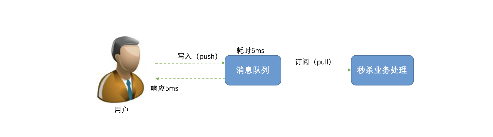
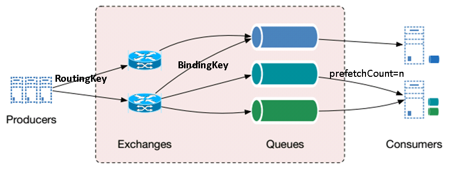

# 消息队列

- 基本介绍
  1. 什么是消息队列
  2. [应用场景](#应用场景)
  3. 消息队列基本流程
  4. [消息总线](#消息总线)
5. 消息的顺序
  
- 选型简介
  1. [RabbitMQ](#RabbitMQ)
  2. [RocketMQ](#RocketMQ)
  3. [ActiveMQ](#ActiveMQ)
  4. [Kafka](#Kafka)
  5. Redis消息推送
  6. ZeroMQ

## 基本介绍

### 1、什么是消息队列？

在企业应用系统领域，会面对不同系统之间的通信集成与整合，尤其当面临 **异构系统** 时，这种分布式的调用与通信变得越发重要。其次，系统中一般会有很多对实时性要求不高的但是执行起来比较较耗时的地方，比如发送短信，邮件提醒，更新文章阅读计数，记录用户操作日志等等，如果实时处理的话，在用户访问量比较大的情况下，对系统压力比较大。

面对这些问题，我们一般会将这些请求，放在 **消息队列MQ** 中处理；异构系统之间使用消息进行通讯。

MQ全称为Message Queue，消息队列（MQ）是一种应用程序对应用程序的通信方法。应用程序通过读写出入队列的消息（针对应用程序的数据）来通信，而无需专用连接来链接它们。

**消息传递** 指的是程序之间通过在消息中发送数据进行通信，而不是通过直接调用彼此来通信，直接调用通常是用于诸如 **远程过程调用** 的技术。排队指的是应用程序通过队列来通信。队列的使用除去了接收和发送应用程序同时执行的要求。

MQ 是 **消费-生产者模型** 的一个典型的代表，一端往消息队列中不断写入消息，而另一端则可以读取或者订阅队列中的消息。

**消息传递** 相较 **文件传递** 与 **远程过程调用(RPC)** 而言，似乎更胜一筹，因为它具有更好的平台无关性，并能够很好地支持并发与异步调用。

总之，**消息队列** 在 “构建分布式系统” 和 “提高系统的可扩展性和响应性” 方面有着很重要的作用。

### 2、消息队列使用场景

**异步处理**

支持异步通信协议，消息的发送者将消息发送到消息队列后可以立即返回，不用等待接收者的响应。消息会被保存在队列中，直到被接收者取出。消息的发送与处理是完全异步的。

以用户注册为例：

**应用解耦**

以电商 IT 架构为例，在传统紧耦合订单场景里，客户在电商网站下订单，订单系统接收到请求后，立即调用库存系统接口，库存减一，如下图所示：

上述模式存在巨大风险：

1. 假如库存系统无法访问（升级、业务变更、故障等），则订单减库存将失败，从而导致订单失败；
2. 短时间内大量的请求，频繁查询库存，修改库存，库存系统负载极大。

我们引入消息队列，解除强耦合性，处理流程又会怎样呢？

订单系统中，用户下单后，订单系统完成持久化处理，将消息写入消息队列，返回用户订单下单成功，此时客户可以认为下单成功。消息队列提供异步的通信协议，消息的发送者将消息发送到消息队列后可以立即返回，不用等待接收者的响应。消息会被保存在队列中，直到被接收者取出。

库存系统中，从消息队列中获取下单信息，库存系统根据下单信息进行库存操作。

**流量削锋**

像双11秒杀、预约抢购等活动，通常会出现流量暴增，当外部请求超过系统处理能力时，如果系统没有做相应保护，可能因不堪重负而挂掉。

这时，我们可以引入消息队列，缓解短时间内高流量压力：

1. 用户的秒杀请求，服务器接收后，首先写入消息队列，然后返回成功。假如消息队列长度超过最大数量，则直接抛弃用户请求或跳转到失败页面；
2. 秒杀业务根据消息队列中的请求信息，再做后续处理（根据数据库实际的select、insert、update 能力处理注册、预约申请）。

**消息通讯**

消息通讯很好理解，以微信群聊为例：

1. A 通过客户端发送消息到群里，服务端将消息写入消息队列；
2. 消息队列，负责消息数据的接收，存储和转发；
3. B 通过客户端查看群消息，订阅并消费消息队列中的信息。

### 3、消息队列基本流程

示意图中所示，消息由 “生产者”（producer / publisher）通过 “消息代理”（broker）传递到 “消费者”（consumer），具体而言：

- 消息由 “生产者” 发布到 “交换器”（exchange）；
- “交换器” 根据 “绑定”（binding），将消息路由（分发）到队列（queue）；
- “消费者” 获取 “队列” 中的消息。

AMQP 中，“队列”、“交换器”、“绑定”，被称为 “实体”（entity）。

AMQP 构建了 “消息确认” 机制：允许 “消费者” 收到消息时，通知 “消息代理”，此时，消息将被 “消息代理” 从 “队列” 中移除。

#### 消息

AMQP 消息由 “载荷”（payload）以及属性构成。“载荷” 即为消息传递的数据，其数据结构由应用决定，AMQP 保持透明，仅将其作为字节数组。

消息的关键属性包括：

- 路由键：交换器路由消息的 “依据”；
- 投递模式：消息是否 “持久化”（消息代理重启后，交换器是否仍然 “存在”）；
- Content-Type / Content-Encoding：通常作为 “载荷” 数据结构的标识；
- 消息头（headers）：消息的附加属性，K-V 结构。

需要说明，为了达成消息的 “持久化”，消息、交换器、队列，必须全部 “持久化”。

#### 生产者 / 消费者

生产者 “生产” 消息，消费者 “消费” 消息。

#### 交换器 & 绑定

交换器负责接收来自生产者的消息，将消息路由到 0 到多个队列。交换器的关键属性，主要包括：

- 名称；
- 类型：消息路由的规则，即由 “交换器类型” 和绑定规则，共同决定；
- 持久化：消息代理重启后，交换器是否仍然 “存在”；
- 自动删除：交换器没有 “绑定” 的队列时，是否自动删除。

#### 绑定

队列允许 “绑定” 到交换器，针对部分 “交换器类型”，绑定需要提供 “绑定键”（亦称为 “路由键”，区分于消息的 “路由键” 属性，下面将其称为 “绑定键”）。

#### 交换器类型

AMQP 支持的交换器类型，主要包括：direct、fanout、topic、header。

**direct**

direct 交换器的工作机制：

- 队列以绑定键 B 绑定到 direct 交换器；
- 消息（路由键 R）发送到 direct 交换器，若 `B == R`，消息即进入队列。

需要说明，AMQP 提供了 “默认交换器”：类型为 direct，名称为空字符串。任何的队列被创建时，即以队列名称作为绑定键，绑定到 “默认交换器”。

**fanout**

fanout 交换器将消息路由到所有绑定的队列。类似于 “广播”。

**topic**

topic 交换器与 direct 交换器类似，基于消息路由键与队列绑定键进行匹配。区别在于，topic 交换器支持 “通配符” 形式的 “绑定键”：

- “键” 以 `.` 划分成多个词
- `*` 匹配任意 1 个词
- `#` 匹配 0 到多个词

例如：`gitchat.rmq.example_1` 与 `*.rmq.example_1` 和 `gitchat.#` 匹配。

**header**

topic 交换器与 direct 交换器类似，区别在于，topic 不依赖于消息路由键与队列绑定键的匹配，而是依赖于消息和绑定的 “headers” 匹配。

具体的匹配规则，依赖绑定的 “headers” 支持 `x-match` 属性：

- `all`：默认值，当且仅当，消息 “headers” 与绑定 “headers”，全部 K-V 匹配
- `any`：消息 “headers” 中任意 K-V，都能够与绑定 “headers” 匹配

需要说明，“headers” 中，若以 `x-` 作为前缀，则不参与匹配计算。

#### 队列

队列接收来自交换器分发的消息，供消费者读取。队列的关键属性，包括：

- 队列名称；
- 持久化：消息代理重启后，队列地方是否仍然 “存在”；
- 自动删除：队列没有 “订阅” 的消费者时，是否自动删除。

#### 虚拟主机（Virtual Host）

AMQP 以 “虚拟主机”（virtual host）形式，于消息代理中提供 “隔离” 的运行环境。默认 “虚拟主机”：`/`。

#### 连接（Connection） / 信道（Channel）

“连接”（Connection），主要表示生产者/消费者与消息代理建立的 TCP 连接，AMQP 支持鉴权和 TLS，以确保 “连接” 的数据安全。

AMQP 通过 “信道”（Channel）构建 “连接” 的多路复用：

- “信道” 共享 “连接”
- “信道” 相互独立

任何 AMQP 通信，都属于 “信道” 层面的通信。

### 4、消息队列常见问题

**1. 防止消息丢失：**

- 消息发送确认
- 消息消费确认

## 选型简介

### 1. RabbitMQ

RabbitMQ 是由 RabbitMQ Technologies Ltd 开发并提供技术支持的开源软件。该公司在 2010 年 4 月被 SpringSource（VMWare 的一个部门）收购。在 2013 年 5 月被并入 Pivotal。事实上 VMWare、Pivotal 和 EMC 同属一家，不同的是 VMWare 是独立上市子公司，而 Pivotal 整合了 EMC 的某些资源，现在并没有上市。

RabbitMQ 是流行的开源消息队列系统，是 AMQP（Advanced Message Queuing Protocol）的标准实现。支持多种客户端，如 Python、Ruby、.NET、Java、JMS、C、PHP、ActionScript、XMPP、STOMP 等，支持 AJAX、持久化。用于在分布式系统中存储转发消息，在易用性、扩展性、高可用性等方面表现不俗，它遵循Mozilla Public License开源协议。

> RabbitMQ 实现了 [AMQP](http://www.amqp.org/) 0-9-1 标准。作为中间件协议，AMQP（Advanced Message Queuing Protocol）完整定义了 “消息队列” 语义逻辑。
>
> 需要说明：RabbitMQ 以 AMQP 0-9-1 作为默认协议，通过插件，RabbitMQ 亦能够支持 AMQP 1.0、[STOMP](http://stomp.github.io/)（The Simple Text Oriented Messaging Protocol）以及 [MQTT](http://mqtt.org/)（Message Queuing Telemetry Transport）。

RabbitMQ 采用 Erlang 语言开发。Erlang 是一种面向并发运行环境的通用编程语言。该语言由爱立信公司在 1986 年开始开发，目的是创造一种可以应对大规模并发活动的编程语言和运行环境。Erlang 问世于 1987 年，经过十年的发展，于 1998 年发布开源版本。

Erlang 是一个结构化、动态类型编程语言，内建并行计算支持。使用 Erlang 编写出的应用运行时通常由成千上万个轻量级进程组成，并通过消息传递相互通讯。进程间上下文切换对于 Erlang 来说仅仅只是一两个环节，比起 C 程序的线程切换要高效得多。Erlang 运行时环境是一个虚拟机，有点像 Java 虚拟机，这样代码一经编译，同样可以随处运行。它的运行时系统甚至允许代码在不被中断的情况下更新。另外字节代码也可以编译成本地代码运行。

#### RabbitMQ特点

根据[官方介绍](http://www.rabbitmq.com/#features)，RabbitMQ 是部署最广泛的消息代理，有以下特点：

- **异步消息传递**：支持多种消息传递协议、消息队列、传递确认机制，灵活的路由消息到队列，多种交换类型；
- **良好的开发者体验**：可在许多操作系统及云环境中运行，并为大多数流行语言提供各种开发工具；
- **可插拔身份认证授权**：支持 TLS（Transport Layer Security）和 LDAP（Lightweight Directory Access Protocol）。轻量且容易部署到内部、私有云或公有云中；
- **分布式部署**：支持集群模式、跨区域部署，以满足高可用、高吞吐量应用场景；
- 有专门用于管理和监督的 HTTP-API、命令行工具和 UI；
- 支持连续集成、操作度量和集成到其他企业系统的各种工具和插件阵列，可以插件方式灵活地扩展 RabbitMQ 的功能。

综上所述，RabbitMQ 是一个“体系较为完善”的消息代理系统，性能好、安全、可靠、分布式，支持多种语言的客户端，且有专门的运维管理工具。

#### RabbitMQ架构

根据官方文档说明，RabbitMQ 的架构图如下所示：

RabbitMQ是一个消息代理。他从消息生产者(producers)那里接收消息，然后把消息送给消息消费者(consumer)。在发送和接受之间，他能够根据设置的规则进行路由，缓存和持久化。

一般提到RabbitMQ和消息，都用到一些专有名词。

#### RabbitMQ概念

- **Producer/Publisher**：消息生产者，主要将消息投递到对应的 Exchange 上面
- **Message**：消息体，是AMQP所操纵的基本单位，它由Producer产生，经过Broker被Consumer所消费。它的基本结构有两部分: Header和Body。Header是由Producer添加上的各种属性的集合，这些属性有控制Message是否可被缓存，接收的Queue是哪个，优先级是多少等。Body是真正需要传送的数据，它是对Broker不可见的二进制数据流，在传输过程中不应该受到影响
- **Connection**：连接，一个网络连接，比如TCP/IP套接字连接。Channel是建立在Connection之上的，一个Connection可以建立多个Channel。
- **Channel**：消息通道，也称信道，多路复用连接中的一条独立的双向数据流通道，为会话提供物理传输介质。Channel是在connection内部建立的逻辑连接，如果应用程序支持多线程，通常每个thread创建单独的channel进行通讯，AMQP method包含了channel id帮助客户端和message broker识别channel，所以channel之间是完全隔离的。Channel作为轻量级的Connection极大减少了操作系统建立TCP connection的开销。在客户端的每个连接里可以建立多个 Channel，每个 Channel 代表一个会话任务
- **Broker**：AMQP的服务端称为Broker。其实Broker就是接收和分发消息的应用，也就是说RabbitMQ Server就是Message Broker
- **Vhost**：虚拟主机，一个 Broker 可以有多个虚拟主机，用作不同用户的权限分离。一个虚拟主机持有一组 Exchange、Queue 和 Binding
- **Exchange**：消息交换机；指定消息按照什么规则路由到哪个队列 Queue
- **Queue**：消息队列，存储消息的载体
- **Binding**：Exchange 和 Queue 之间的虚拟连接；Binding 中可以包含 RoutingKey，其信息被保存到 Exchange 中的查询表中，作为 Message 的分发依据
- **RoutingKey**：路由关键字，Exchange 根据 RoutingKey 将消息投递到对应的队列中
- **Consumer**：消息消费者，消息的接收者，一般是独立的程序

#### RabbitMQ使用流程

1. 建立信息。Publisher定义需要发送消息的结构和内容。
2. 建立Conection和Channel。由Publisher和Consumer创建连接，连接到Broker的物理节点上，同时建立Channel。Channel是建立在Connection之上的，一个Connection可以建立多个Channel。Publisher连接Virtual Host 建立Channel，Consumer连接到相应的Queue上建立Channel。
3. 声明交换机和队列。声明一个消息交换机（Exchange）和队列（Queue），并设置相关属性。
4. 发送消息。由Publisher发送消息到Broker中的Exchange中。
5. 路由转发。RabbitMQ收到消息后，根据​​消息指定的Exchange（交换机）来查找Binding（绑定）然后根据规则（Routing Key）分发到不同的Queue。这里就是说使用Routing Key在消息交换机（Exchange）和消息队列（Queue）中建立好绑定关系，然后将消息发送到绑定的队列中去。
6. 消息接收。Consumer监听相应的Queue，一旦Queue中有可以消费的消息，Queue就将消息发送给Consumer端。
7. 消息确认。当Consumer完成某一条消息的处理之后，需要发送一条ACK消息给对应的Queue。

关于消息确认，需要具体来说：

如果消息确认模式不开启的话，队列会在某消息被消费者消费之后（甚至是刚指定完消费者之后）就立即从内存删除该消息，如果是持久化的消息，就从磁盘删除该消息

如果消息确认模式开启的话，有以下几种情况

1. 消费者接收了消息，并且发送了ack确认消息，队列就会删除该消息，并发送下一条消息

2. 消费者接收了消息，没有发送ack确认，并且断开了连接，那么队列将不会删除该消息，如果有其他的channel，就会发送给其他的channel，如果没有，就会等该消费者重新建立连接之后再发送一遍

3. 消费者接收了消息，但是忘记发送ack确认，但是也没有断开连接，那么队列不会删除该消息，也不会重复发送该消息，该消息怎么处理？

其实当开启了消息确认模式之后，rabbitmq服务端内部的消息分成了两个部分，第一个部分是等待投递给消费者的消息，第二部分是已经投递的消息（但是还没有收到确认的），这部分的消息只有在消费此消息的消费者断开连接之后，才会重新进入队列，等待投递给消费者，不一定是原来的那个。

#### Rabbit高可用

RabbitMQ 支持集群，将多个物理节点构成单个逻辑层面的消息代理：

- 虚拟主机、交换器，自动地镜像到全部节点；
- 队列位于单个节点（连接到集群中任意的消息代理，全部队列都是可见的）。

通过集群，能够水平扩展，提升性能。这里主要阐述 “高可用” 和 “可靠性” 的事项，关于集群，请参阅：[Clustering Guide](https://www.rabbitmq.com/clustering.html)。

##### 队列镜像，高可用

RabbitMQ 实现高可用的方式，即为：“队列镜像”，将队列被 “镜像” 到不同的节点。

所有的队列，被区分为　“主”（master）和 “镜像”（mirror）。所有队列的操作，首先作用于 “主” 队列，进而扩散到 “镜像” 队列。当出现 “主” 队列故障，“镜像” 队列，基于特定机制，将升级成为 “主” 队列。

RabbitMQ 支持配置 “镜像” 队列的数量：指定数量、镜像到集群的全部节点、镜像到配置的节点。通常的建议，“主” 队列与 “镜像” 队列，数量构成集群节点数的 “quorum”（例如：2/3、3/5……）。

若 “主” 队列所在节点（“主” 节点）故障：

1. 运行时间最长的 “同步” “镜像” 队列将升级成为 “主” 队列
2. 若没有 “同步” “镜像” 队列，则基于配置项 `ha-promote-on-failure`:
   1. `always`，默认值，非 “同步” “镜像” 队列，允许升级成为 “主” 队列
   2. `when-synced`，队列将不可用

需要说明：配置项 `ha-promote-on-failure` 的设置，需要基于 “可靠性” 和 “可用性” 权衡。

当 “镜像” 队列新加入时，即处于非 “同步” 状态，其同步的方式，由于配置项 `ha-sync-mode` 控制：

1. `manual`，依赖于手动执行
2. `automatic`，自动同步

需要说明，队列进行同步时，全部的队列操作将被阻塞，直到同步完成。

##### 可靠性保障

关于 “可靠性”，表示：消息不会 “丢失”，无论出现任何情况（异常、故障……）。

**可靠性保障 - “生产者确认”**

生产者的 “可靠性” 保障，主要依赖于 “生产者确认”（publisher confirm）模式：生产者完成消息发送，能够获得来自消息代理的确认。

需要说明，若交换器无法路由到任何队列，消息代理立即 “确认”；否则，消息代理需要等待消息投递到全部队列（包括 “镜像队列”）。

**可靠性保障 - 确保消息被路由**

若交换器无法将消息路由到任何队列，默认情况，消息将被 “丢弃”，特定的场景中，生产者需要感知。

**可靠性保障 - “消费者确认”**

为保障可靠性：

1. 不使用 “自动” 确认
2. 当且仅当消费者完成消息的处理，进行 “消费者确认”

需要说明，由于保障 “可靠性”，消费者可能会收到 “重复” 的消息，因此，依赖于业务层面的处理，例如：幂等。