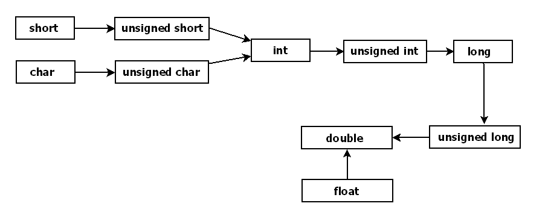

1. 学习目标
2. 设计思想
   - [迭代法](#迭代法)

1. 常用技巧
   - [哨兵位](#哨兵位)

2. 常见问题
   - [数组链表](#数组链表)
   - [用数组存储二叉树](#用数组存储二叉树)

3. 常用设计原则与策略
   - [程序设计的一致性原则](#程序设计的一致性原则)


## 学习目标

**为了解决实际问题！如何用算法解决实际问题？**

做到以下三点：

1. 对遇到的特殊问题要能够自己设计出算法实现（可能是一个智力游戏题目，也可能是工作中遇到的实际问题）
2. 对于原理公开的知名算法，要能将算法原理翻译成具体的算法代码（如二部图匹配的匈牙利算法、大整数乘法的 Karatsuba 算法）
3. 对已有具体实现的算法，要能够设计出合适的数学模型，将算法应用到实际问题中（如遗传算法、SIFT 图像识别算法）


## 设计思想

### 贪婪法

**思想基础**

这种方法模式一般将求解过程分成若干个步骤，但每个步骤都应用贪心原则，选取当前状态下最好的或最优的选择（局部最有利的选择），并以此希望最后堆叠出的结果也是最好或最优的解。

**贪婪法 vs 动态规划法 vs 分治法**

相同点：

- 都需要对问题进行分解，定义最优解的子结构

不同点：

- 贪婪法每一步选择完局部最优解之后就确定了，不再进行回溯处理

优点：

- 贪婪法简单、高效，省去了为找最优解可能需要的穷举操作

缺点：

- 因为不进行回溯处理，贪婪法只在很少的情况下可以得到真正的最优解，比如最短路径问题、图的最小生成树问题。

**贪婪法3个基本步骤：**

1. 建立对问题精确描述的数学模型，包括定义最优解的模型；
2. 将问题分解为一系列的子问题，同时定义子问题的最优解结构；
3. 应用贪心原则确定每个子问题的局部最优解，并根据最优解的模型，用子问题的局部最优解堆叠出全局最优解。

**贪婪法示例：**

**1. 找零钱**

> 题目：某国发行的货币有 25 分、10 分、5 分和 1 分四种硬币，如果你是售货员且要找给客户 41 分钱的硬币，如何安排才能找给客人的钱既正确且硬币的个数又最少？
>
> 假如，某国货币发行为 25 分、20 分、5 分和 1 分四种硬币呢？

情形1：

按照贪婪策略，第一步会选择 25 分的硬币一枚，第二步会选择 10 分的硬币一枚，第三步会选择 5 分的硬币一枚，第四步会选择 1 分的硬币一枚，总共需要 4 枚硬币。这个例子得到的确实是一个最优解，但是很多情况下贪婪法都不能得到最优解。

情形2：

这时候找 41 分钱的最优策略是 2 枚 20 分的硬币加上 1 枚 1 分硬币，一共 3 枚硬币，但是用贪婪法得到的结果却是 1 枚 25 分硬币、3 枚 5 分硬币和 1 枚 1 分硬币，一共 5 枚硬币。

**2. 0-1背包问题**

> 题目：有一个背包，最多能承载重量为 C=150 的物品，现在有 7 个物品（物品不能分割成任意大小），编号为 1~7，重量分别是 wi=[35,30,60,50,40,10,25]，价值分别是 pi=[10,40,30,50,35,40,30]，现在从这 7 个物品中选择一个或多个装入背包，要求在物品总重量不超过 C 的前提下，所装入的物品总价值最高。

常见的贪婪策略有三种：

1. 第一种策略是根据物品价值选择，每次都选价值最高的物品
2. 第二种策略是根据物品重量选择，每次都选择重量最轻的物品
3. 第三种策略是定义一个价值密度的概念，每次选择都选价值密度最高的物品

```c
typedef struct
{
    int weight;
    int price;
    int status; //0:未选中；1:已选中；2:已经不可选
}OBJECT;

typedef struct
{
    std::vector<OBJECT> objs;
    int totalC;
}KNAPSACK_PROBLEM;

void GreedyAlgo(KNAPSACK_PROBLEM *problem, SELECT_POLICY spFunc)
{
    int idx;
    int ntc = 0;

    // spFunc 每次选最符合策略的那个物品，选后再检查
    while((idx = spFunc(problem->objs, problem->totalC - ntc)) != -1)
    {
        // 所选物品是否满足背包承重要求？
        if((ntc + problem->objs[idx].weight) <= problem->totalC)
        {
            problem->objs[idx].status = 1;
            ntc += problem->objs[idx].weight;
        }
        else
        {
            // 不能选这个物品了，做个标记后重新选
            problem->objs[idx].status = 2; 
        }
    }

    PrintResult(problem->objs);
}

// 以第一种策略为例，每次总是选择 price 最大的物品
int Choosefunc1(std::vector<OBJECT>& objs, int c)
{
    int index = -1;  //-1表示背包容量已满
    int mp = 0;
    for(int i = 0; i < static_cast<int>(objs.size()); i++)
    {
        if((objs[i].status == 0) && (objs[i].price > mp))
        {
            mp = objs[i].price;
            index = i;
        }
    }

    return index;
}
```

**结论：**

对于一些能够证明贪婪策略得到的就是最优解的问题，应用贪婪法可以高效地求得结果，比如求最小生成树的 Prim 算法和 Kruskal 算法。

在大多数情况下，贪婪法受自身策略模式的限制，通常很难直接求解全局最优解问题，也很难用于多阶段决策问题。贪婪法只能得到比较接近最优解的近似最优解，但是作为一种启发式辅助方法在很多算法中都得到了广泛的应用，很多常用的算法在解决局部最优决策时，都会应用到贪婪法。比如 Dijkstra 的单源最短路径算法在从 dist 中选择当前最短距离的节点时，就是采用的贪婪法策略。事实上，在任何算法中，只要在某个阶段使用了只考虑局部最优情况的选择策略，都可以理解为使用了贪婪算法。


### 分治法

**思想基础**

将无法着手解决的大问题分解成一系列规模较小的相同问题，然后逐个解决小问题，即所谓分而治之。

分治法产生的子问题与原始问题相同，只是规模减小，反复使用分治方法，可以使得子问题的规模不断减小，直到能够被直接求解为止。

**分治法3个步骤：**

1. **分解**：将问题分解为若干个规模较小，相互独立且与原问题形式相同的子问题，确保各个子问题的解具有相同的子结构。
2. **解决**：如果上一步分解得到的子问题可以解决，则解决这些子问题，否则，对每个子问题使用和上一步相同的方法再次分解，然后求解分解后的子问题，这个过程可能是一个递归的过程。
3. **合并**：将上一步解决的各个子问题的解通过某种规则合并起来，得到原问题的解。

能使用分治法解决的问题一般都具有两个显著的特点：

1. 问题可以分解为若干个规模较小的相同问题，并且这个分解关系可以用递归或递推的方式逐级分解，直到问题的规模小到可以直接求解的程度。
2. 子问题的解可以用某种方式合并出原始问题的解。

**分治法示例：**

**1. 字符串全排列问题**

> 题目：给定一个没有重复字母的字符串，输出该字符串中字符的所有排列。假如给定的字符串是“abc”，则应该输出“abc”、“acb”、“bac”、“bca”、“cab”和“cba”六种结果。

在分解这个问题的子问题时，通常考虑的方法有两个：

1. 用字符串的开始位置和字符串的长度表示一个子字符串
2. 用字符串的位置区间（开始、结束位置）来表示一个子字符串

```c++
void Swap(std::string& chList, int pos1, int pos2)
{
    if (pos1 != pos2)
    {
        auto tmp = chList[pos1]; 
        chList[pos1] = chList[pos2];
        chList[pos2] = tmp;
    }
}

// 将字符串[begin, end]区间的子串全排列
void Permutation(std::string& chList, int begin, int end)
{
    if (begin == end) // 就剩一个字符了，不需要排列了，直接输出当前的结果
    {
        std::cout << chList << std::endl;
    }

    for (int i = begin; i <= end; i++)
    {
        // 把第 i 个字符换到 begin 位置，将 begin+1 位置看作新的子串开始
        Swap(chList, begin, i);
        // 求解子问题
        Permutation(chList, begin + 1, end);
        // 在挑选下一个固定字符之前，需要换回来
        Swap(chList, begin, i);
    }
}

// 求解问题字符串：abcd
std::string cl = "abcd";
Permutation(cl, 0, cl.length()); // 原始问题的规模是从 0 位置开始的整个字符串
```

**总结：**

分治法有很多典型的应用，比如二分查找、Karatsuba 大整数乘法、棋盘覆盖问题、快速排序、合并排序等等，大家可以找来相关的算法实现研究一下，看看各种情况下分解子问题和合并子问题的解的方法。我记得前几年有个很火的网文，说是 90% 的程序员写不出完全正确的二分查找算法，那么本节课的问题就是，用你熟悉的编程语言实现一个二分查找算法，完成这个作业，你就是那 10% 了。


### 迭代法

**需要确定三点：**

1. 确定迭代变量
2. 确定迭代递推关系
3. 确定迭代终止条件

**迭代法示例：**

**1. 计算一个数的平方根，迭代递推公式：$x_{n+1}=\frac{1}{2}(x_{n}+\frac{a}{x_{n}})$**

```c++
std::pair<bool, double> cl_root(double a, double eps)
{
    double xi = a / 2.0; // 初始值用 a 的一半，很多人的选择
    double xt;
    int count = 0;
    do
    {
        xt = xi;
        xi = (xt + (a / xt)) / 2.0;
        count++; // 用于检查是否收敛的计数器
        if (count >= LOOP_LIMIT)
        {
            return {false, 0.0}; // 不收敛，返回失败 
        }
    } while (std::fabs(xi - xt) > eps);

    return { true, xi };
}
```


### 动态规划法

**思想基础**

动态规划（Dynamic Programming）是解决多阶段决策问题常用的最优化理论，动态规划和分治法一样，也是通过定义子问题，先求解子问题，然后在由子问题的解组合出原问题的解。

但是它们之间的不同点是分治法的子问题之间是相互独立的，而动态规划的子问题之间存在堆叠关系（递推关系式确定的递推关系）。

动态规划方法的原理就是把多阶段决策过程转化为一系列的单阶段决策问题，利用各个阶段之间的递推关系，逐个确定每个阶段的最优化决策，最终堆叠出多阶段决策的最优化决策结果。

**需要满足两点**

1. **最优化原理**

   最优化原理其实就是问题的最优子结构的性质，如果一个问题的最优子结构是不论过去状态和决策如何，对前面的决策所形成的状态而言，其后的决策必须构成最优策略。

   也就是说，不管之前的决策是否是最优决策，都必须保证从现在开始的决策是在之前决策基础上的最优决策，则这样的最优子结构就符合最优化原理。

2. **无后向性（无后效性）**

   所谓“无后向性”，就是当各个阶段的子问题确定以后，对于某个特定阶段的子问题来说，它之前各个阶段的子问题的决策只影响该阶段的决策，对该阶段之后的决策不产生影响。

   > 多阶段决策过程中，随着子问题的划分会产生很多状态，对于某一个状态 S 来说，只要 S 状态确定了以后，S 以后的那些依靠 S 状态做最优选择的状态也就都确定了，S 之后的状态只受 S 状态的影响。也就是说，无论之前是经过何种决策途径来到了 S 状态，S 状态确定以后，其后续状态的演化结果都是一样的，不会因为到达 S 状态的决策路径的不同而产生不同的结果，这就是无后向性。

**动态规划 VS 分治**

相同点：先对问题进行分解，然后通过求解小规模的子问题再反推出原问题的结果

不同点：

- 分解子问题的方式

  动态规划分解子问题不是简单地按照“大事化小”的方式进行的，而是沿着决策的阶段来划分子问题

  分治法要求子问题是互相独立的，以便分别求解并最终合并出原始问题的解。

  分治法对所有的子问题都“一视同仁”地进行计算求解，如果分解的子问题中存在相同子问题，就会存在重复求解子问题的情况。

  动态规划法的子问题不是互相独立的，子问题之间通常有包含关系，甚至两个子问题可以包含相同的子子问题。

  动态规划法对相同子问题只求解一次，因为会将计算结果保存在一张表中（此表也被称为备忘录），实现复用。

**动态规划法四步骤：**

1. 定义最优子问题（最优解的子结构）
2. 定义状态（最优解的值）
3. 定义决策和状态转换方程（定义计算最优解的值的方法）
4. 确定边界条件

**动态规划法示例**

**1. 0-1 背包问题**

0-1 背包问题的决策很简单，那就是决定是否选择第 i 件物品，即判断装入第 i 件物品获得的收益最大还是不装入第 i 件物品获得的收益最大。如果不装入第 i 件物品，则背包内物品的价值仍然是 $s[i-1,j]$ 状态，如果装入第 i 件物品，则背包内物品的价值就变成了 $s[i,j-Vi] + Pi$ 状态，其中 Vi 和 Pi 分别是第 i 件物品的容积和价值，决策的状态转换方程就是：$s[i,j] = max(s[i-1,j], s[i,j-Vi]+Pi)$

0-1 背包问题的边界条件很简单，就是没有装入任何物品的状态：$s[0,Vmax] = 0$

**2. 最长公共子序列（LCS）问题**

最长公共子序列（LCS，Longest Common Subsequence）的定义是：一个序列 S，如果分别是两个或多个已知序列的子序列，且是符合此条件的子序列中最长的，则称 S 为已知序列的最长公共子序列。

关于子序列的定义通常有两种方式，一种是对子序列没有连续的要求，其子序列的定义就是原序列中删除若干元素后得到的序列；另一种是对子序列有连续的要求，其子序列的定义是原序列中连续出现的若干个元素组成的序列。

求解子序列是非连续的最长公共子序列问题，也是一个十分实用的问题，它可以描述两段文字之间的“相似度”，即它们的雷同程度，从而能够用来辨别抄袭。下面将介绍对子序列没有连续性要求的情况下应如何用动态规划法来解决最长公共子序列问题。

根据前面的分析，假如有两个字符串 str1[1..m] 和 str2[1..n]，其最长公共子序列问题在某一个决策阶段的状态 s[i,j] 定义为 str1[1…i] 与 str2[1…j] 的最长公共子序列长度（i<=m, j<=n），这个状态 s[i,j] 其实也就是子问题的定义，可以将其描述为：求字符串 str1<1..m> 中从第 1 个到第 i（i <= m）个字符组成的子串 str1<1…i> 和字符串 str2<1..n> 中从第 1 个到第 j(j <= n) 个字符组成的子串 str2<1…j> 的最长公共序列。

接下来要找出子问题的最优序列中状态 s[i,j] 的递推关系。分析 s[i,j] 的递推关系要从 str1[i] 和 str2[j] 的关系入手，根据非连续最长公共子序列问题的定义，如果 str1[i] 和 str2[j] 相同，则 s[i,j] 就是 s[i-1,j-1] 的最长公共序列 ＋1，如果 str1[i] 和 str2[j] 不相同，则 s[i,j] 就是 s[i-1,j] 的最长公共序列和 s[i,j-1] 的最长公共序列中较大的那一个。

最后是确定状态转移递推关系的边界值。很显然，当 str1 和 str2 中任何一个的长度为 0，则其最长公共子序列即为 0，当状态递推到 s[m,n] 时，s[m,n] 就是原始问题的最长公共子序列长度。完整的状态转移递推关系如下：

| 条件                              | 结果                               |
| --------------------------------- | ---------------------------------- |
| `i = 0 or j = 0`                  | $s[i,j]=0$                         |
| `i, j > 0 and str1[i] = str2[j]​`  | $s[i,j] = s[i-1,j-1] + 1$          |
| `i, j > 0 and str1[i] != str2[j]` | $s[i,j] = max(s[i,j-1], s[i-1,j])$ |

```c++
int DpLcs(const std::string& str1, const std::string& str2, int s[MAX_STRING_LEN][MAX_STRING_LEN])
{
    std::string::size_type i,j;

    for(i = 1; i <= str1.length(); i++)
        s[i][0] = 0;
    for(j = 1; j <= str2.length(); j++)
        s[0][j] = 0;

    for(i = 1; i <= str1.length(); i++)
    {
        for(j = 1; j <= str2.length(); j++)
        {
            if((str1[i - 1] == str2[j - 1]))
            {
                s[i][j] = s[i - 1][j - 1] + 1; 
            }
            else
            {
                s[i][j] = std::max(s[i - 1][j], s[i][j - 1]); 
            }
        }
    }

    return s[str1.length()][str2.length()];
}
```

这是一个经典的动态规划法应用实例，帮助大家体会动态规划的设计思想。虽然动态规划的概念很抽象，但是只要确定问题的实质，按照前面给出的四个步骤引导，逐步分析，实现动态规划法的算法就不再是一件很困难的事情了。


### 穷举法

**思想基础**

穷举法又称穷举搜索法，是一种在问题域的解空间中对所有可能的解穷举搜索，并根据条件选择最优解的方法的总称。

数学上也把穷举法称为枚举法，就是在一个由有限个元素构成的集合中，把所有元素一一枚举研究的方法。

> 比如要找一个集合中最大的数，就把这个集合中的所有数都枚举一遍，通过相互比较找出最大的那个数。

穷举法作为计算机算法使用时，就是依赖计算机不知疲倦的计算能力，对解空间内的候选解按某种顺序进行逐一枚举和检验，并根据问题给定的条件从中找出那些符合要求的候选解作为问题的解，很多暴力破解密码的程序就是这么干的。

穷举法一般用来找出符合条件的所有解，但是如果给出最优解的判断条件，穷举法也可以用于求解最优解问题。

**穷举法两步骤：**

1. 确定问题的解（或状态）的定义、解空间的范围以及正确解的判定条件；
2. 根据解空间的特点来选择搜索策略，逐个检验解空间中的候选解是否正确；

**解空间的定义**

解空间就是全部可能的候选解的一个约束范围，确定问题的解就在这个约束范围内，将搜索策略应用到这个约束范围就可以找到问题的解。

要确定解空间，首先要定义问题的解并建立解的数据模型。如果解的数据模型选择错误或不合适，则会导致解空间结构繁杂、范围难以界定，甚至无法设计穷举算法。

很多问题在设计穷举法时都不是直接根据问题的答案设计解空间的数据模型，因为那样会造成穷举算法设计困难，甚至无法实现算法。

如果将问题的解扩展为一组状态，通过状态可以简单推出问题的解，并且状态可以通过演变成另一个状态，将解空间转化成一个可以遍历的状态空间，就可以将对问题的解的穷举遍历变成对这个状态空间的的穷举遍历，从而简化算法设计的难度。

在很多情况下，候选解或状态之间不独立，存在各种关联关系并且这些状态之间也没有简单的规律，不能用一套通用的遍历算法把这些状态都事先确定好，但是可以根据状态之间的演化关系，从一种状态推出另一种或几种状态，递归地执行这种状态演化，逐步得到整个解空间。

在这种情况下，解空间通常伴随着搜索算法展开，从一个原始状态开始，逐步扩展至整个解空间。这样的解空间通常被组织成一棵状态树，最终状态就是状态树的叶子节点，从根节点到叶子节点之间的状态转换过程就是问题求解的过程。对于更复杂的情况，需要用图的一些方法组织和搜索解空间，在这种情况下，解空间就是节点和边的关系空间。

**穷举解空间的策略**

穷举解空间的策略就是搜索算法的设计策略，根据问题的类型，解空间的结构可能是线性表、集合、树或者图，对于不同类型的解空间，需要设计与之相适应的穷举搜索算法。简单的问题可以用通用的搜索算法，比如线性搜索算法用于对线性解空间的搜索，广度优先和深度优先的递归搜索算法适用于树型解空间或更复杂的图型解空间。

根据问题的需要设计搜索算法是一件困难重重的事情，没有捷径，只能在常用搜索策略的基础上多实践，多积累。如果选择一种搜索策略，不带任何假设的穷举搜索，不管行不行，眉毛胡子一把抓，把所有可能的解都检查一遍，这样的搜索通常被称为“盲目搜索”。与之对应的是利用某种策略或计算依据，由启发函数策动有目的的搜索行为，这些策略和依据通常能够加快算法的收敛速度，或者能够划定一个更小的、最有可能出现解的空间并在此空间上搜索，这样的搜索通常称为“启发性搜索”。

一般来说，为了加快算法的求解，通常会在搜索算法的执行过程中辅助一些剪枝算法，排除一些明显不可能是正确解的检验过程，来提高穷举的效率。剪枝一个很形象的比喻，如果某一个状态节点确定不可能演化出结果，就应该停止从这个状态节点开始的搜索，相当于状态树上这一分枝就被剪掉了。除了采用剪枝策略，还可以使用限制搜索深度的方法加快算法的收敛，但是限制搜索深度会导致无解，或错过最优解，通常只在特定的情况下使用，比如博弈树的搜索。

**盲目搜索和启发式搜索**

对于线性问题的盲目搜索，就是把线性表中的所有算法按照一定的顺序遍历一遍，对于复杂问题的盲目搜索，常用广度优先搜索和深度优先搜索这两种盲目搜索算法。广度优先算法因为需要额外的存储空间，因此在设计算法时要考虑此额外空间的规模，深度优先算法在搜索过程中容易陷入状态循环，导致在一个没有解的子树上“死循环”，一般需要做状态循环的判断和避免，但总的来说，两种策略并无优劣之分，很多情况下可以互换使用。

如果问题的规模比较大，盲目搜索算法的低效常常会导致无法在可接受的时间内完成搜索。如果搜索能够智能化一点，利用搜索过程中出现的额外信息直接跳过一些状态，避免盲目的、机械式的搜索，就可以加快搜索算法的收敛，这就是启发性搜索。

启发性搜索需要一些额外信息和操作来“启发”搜索算法，根据这些信息的不同，启发的方式也不同。比如，如果知道解空间的状态分布呈现正态分布的特征，则可以从分布中间值开始向两边搜索，因为在中间值附近出现最优解的概率更高，这就是启发式搜索。再比如，搜索过程中选择合适的评估函数，对每个状态节点能演化出解的可能性进行评估，搜索过程中根据这种可能性对待搜索的状态节点排序，也是一种启发式搜索。

再简单一点，如果在某一个层面的搜索能应用贪婪策略，优先选择与贪婪策略符合的状态节点进行搜索，也是一种启发式搜索。著名的A* 寻径算法，就是一种带启发的搜索算法，利用路径评估函数，每次都选择距离出发点最近的位置开始搜索最短路径的下一个位置。

**剪枝策略**

对解空间穷举搜索时，如果有一些状态节点可以根据问题提供的信息明确地被判定为不可能演化出最优解，也就是说，从此节点开始遍历得到的子树，可能存在正确的解，但是肯定不是最优解，就可以跳过此状态节点的遍历，这将极大地提高算法的执行效率，这就是剪枝策略，应用剪枝策略的难点在于如何找到一个评价方法（估值函数）对状态节点进行评估。

特定的评价方法都附着在特定的搜索算法中，比如博弈树算法中常用的极大极小值算法和“α-β”算法，都伴随着相应的剪枝算法。除了针对特定问题类型的剪枝算法之外，没有可以一统天下的通用评价方法，通常需要根据实际问题小心地分析，确定评价方法。

除了最优解问题，还有一种情况也会用到剪枝策略。对解空间内的状态节点遍历搜索的过程中，会有一些在特定搜索策略下重复出现的状态节点，对这些状态节点如果不做特殊处理，不仅会因为重复处理相同的状态节点而降低效率，还可能会导致深度优先搜索算法“陷入”到某个子树的搜索中无法退出。

举个例子，如果出现对状态 A 搜索得到子状态 B，对状态 B 搜索得到子状态 C，对状态 C 搜索又可得到子状态 A 的情况，就会使得搜索算法陷入“死循环”。在这种情况下，常用的剪枝策略就是找到一种算法对状态计算校验值，通过比较校验值判断是否是已经处理过的状态节点。

**剪枝和启发**

有些读者会把搜索过程中的剪枝策略也误认为是启发性搜索，其实剪枝不是启发性搜索。剪枝的原理是在结果已经搜索出来或部分搜索出来（比如树的根节点已经搜索出来了，但是叶子节点还没有搜索出来）的情况下，根据最优解的判断条件，确定这个方向上不可能存在最优解，从而放弃对这个方向的继续搜索。而启发性搜索通常是根据启发函数给出的评估值，在结果出来之前就朝着最可能出现最优解的方向搜索。它们的差异点在于是根据结果进行判断还是根据启发函数的评估值进行判断。

**搜索算法的评估和收敛**

穷举法虽然被称为灵活的“通用算法”，但也不是万能的，穷举法最大的敌人是问题的规模。很多问题，当规模大到一定程度时，使用穷举法就只具有理论上的可行性。对某些问题，穷举法是最后的办法，但是问题规模又大到无法对解空间进行完整搜索，这时候就需要对搜索算法进行评估，并确定一些收敛原则。

收敛原则是只要能找到一个比较好的解就返回（不求最好），根据解的评估判断是否需要继续下一次搜索。大型棋类游戏通常面临这种问题，比如国际象棋和围棋的求解算法，想要搜索整个解空间得到最优解目前是不可能的，所以此类搜索算法通常都通过一个搜索深度参数来控制搜索算法的收敛，当搜索到指定的深度时（相当于走了若干步棋）就返回当前已经找到的最好的结果，这种退而求其次的策略也是不得已而为之。

**百钱买鸡问题**

一百个钱买一百只鸡，是个典型的穷举法应用。问题描述：每只大公鸡值 5 个钱，每只母鸡值 3 个钱，每 3 只小鸡值 1 个钱，现在有 100 个钱，想买 100 只鸡，问如何买？有多少种方法？

分析这个问题，首先定义问题的解。原始问题问如何买鸡，实际是在问对于一种买法来说，买的公鸡、母鸡和小鸡分别有多少只。很显然，这个问题的解是由公鸡数量、母鸡数量和小鸡数量三个值组成的三元组：[roosters,hens,chicks]。

定义了问题的解的数据模型，接着要确定问题的解的穷举方法，对于这个问题来说，穷举的方法非常简单，就是对三元组的三个属性的数量分别穷举。首先是公鸡的数量，因为总共是 100 钱，所以公鸡的数量最多只能买 20 只，对公鸡数量枚举的范围只要限定在 0~20 就可以了；同样，母鸡的数量最多只能买 33 只，其枚举范围限制在 0~33 之间。因为三种鸡的总数是 100 只，所以小鸡的数量就不需要枚举了，根据这个关系直接计算出来即可。

根据题目的意思，要使最后的总钱数能凑够整数 100，小鸡的数量必须是 3 的整数倍，所以可以根据这个条件进行一个小小的剪枝处理，最终实现代码如 Buy() 函数所示，第一层 for 循环枚举大公鸡的数量，第二层 for 循环枚举母鸡的数量，两层循环之后再通过总数 100 只的关系计算出小鸡的数量，这样就凑出了一个候选解。枚举到一个候选解之后，就按照是否能满足 100 钱的条件进行检查，如果符合条件就输出一个正确的解，否则继续枚举下一个候选解。

```c++
void Buy()
{
    int count = 0;

    for (int roosters = 0; roosters <= 20; roosters++)   //枚举大公鸡数量
    {
        for (int hens = 0; hens <= 33; hens++) //枚举母鸡数量
        {
            int chicks = 100 - roosters - hens;  //剩下的就是小鸡数量
            if (((chicks % 3) == 0) //小鸡个数应该是 3 的整数倍，算是个小小的剪枝
                && ((5 * roosters + 3 * hens + chicks / 3) == 100)) //是否凑够 100 钱
            {
                count++;
                std::cout << "买法 " << count << "：公鸡 " << roosters
                                              << ", 母鸡 " << hens
                                              << ", 小鸡 " << chicks << std::endl;
            }
        }
    }

    std::cout << "共有 " << count << " 种买法" << std::endl;
}
```

**鸡兔同笼问题**

有鸡和兔在一个笼子中，数头共 50 个头，数脚共 120 只脚，问：鸡和兔分别有多少只？


### 递推法


### 递归法


### 回溯法


### 总结

到目前为止，我们介绍了五种常用的算法设计思想或模式，这些算法的设计思想或模式通常都不是单独使用的，一般都是几种方法结合在一起构成某个算法的实现。

比如分治法通常配合迭代法和递归法实现对问题域的层层分解，穷举法常常使用迭代法和递归法进行解空间的穷举，而回溯法通常和递归法一起结对使用。

这些算法模式之间既有相同点，也有差别，有的问题可以用多种算法模式解决，不同的算法模式对应的算法实现也各不相同。有些问题则由固定的算法模式，换一种模式可能无法设计出算法。无论如何，这些算法原理或模式都不是死方法，需要根据具体问题确定具体的算法实现


## 常用技巧

用代码实现的算法肯定会包含一些代码特有的技巧，现在我们就来介绍一些这样的技巧。

这些巧妙构思的代码技巧，有些体现了效率，有些体现了程序设计的一致性原则，有些则体现了软件架构的一些好思想；这些技巧，都可以在今后的算法设计中直接或间接使用，即使用不上，了解这些内容对于开阔思维还是很有益处的，更不用说其中一些技巧都是常见或不常见的面试题了。

### 哨兵位

设置哨兵位是程序设计中常用的技巧之一，常用在线性表的处理过程中，比如查找和移动数据操作。

哨兵位通常起到两个作用，一个是作为一个临时存储空间使用，另一个是减少不必要的越界判断，简化算法代码复杂度。

比如环形链表通常会设置一个表头节点，无论向前或向后遍历，均以这个表头节点为遍历越界（重复）的依据，这样维护链表的时候就不需要专门存储一个表头指针，这个表头节点可以理解为哨兵位。

插入排序算法中也会利用表中的 0 号位置作为哨兵位使用，这个位置不仅起到一个临时存储空间的作用，还可以简化插入后移动数据的判断条件。

注意下面的插入排序代码，内层 while 循环移动数据的时候，只需判断当前位置的数是否比 `ls[0]` 位置大即可，不需要关心 `j` 的位置是否小于 1 而越界，因为当 `j = 1` 的时候，`ls[j-1] > ls[0]` 的条件肯定不满足，`while` 循环就会终止。如果不使用哨兵位，内层移动数据的循环处理代码就需要增加 `j` 是否越界的判断。

```c++
// 带哨兵位的插入排序，ls[0]是哨兵位，数据从 ls[1]开始存放
void insert_sort(int *ls, int n)
{
    for (int i = 2; i <= n; ++i)
    {
        if (ls[i] < ls[i - 1])
        {
            ls[0] = ls[i]; // i位置的数存入哨兵位，因为 i 位置会被后面的移动数据操作覆盖
            int j = i;
            while(ls[j - 1] > ls[0]) // 不用再判断 j 是否越界，直接判断当前位置的值是否大于哨兵位
            {
                ls[j] = ls[j - 1];
                j--;
            }
            ls[j] = ls[0];
        }
    }
}
```

### 巧用数组下标

数组的下标是一个隐含的很有用的属性，巧妙地使用这个属性，对简化算法实现有很大的帮助。比如《算法的乐趣》第4章介绍的阿拉伯数字转换成中文数字的算法，就使用了这种定义中文字符数组：

```c++
const char *chnNumChar[CHN_NUM_CHAR_COUNT] = { “零”, “一”, “二”, “三”, “四”, “五”, “六”, “七”, “八”, “九” };
```

利用数组下标只需一行代码就可找到阿拉伯数字对应的中文数字，比如数字 5 对应的中文数字就是：

```c++
const char *chn_five = chnNumChar[5];
```

著名的 Base64 编码算法，输出转化后的编码时也使用了这个技巧。

在一些数字或词汇统计的算法中，有时候也可以利用数组下标巧妙地简化算法。比如这个题目：已知数列由 n 个最大值不超过 32 的正整数组成，请统计一下数列中各个数字出现的次数。既然数列中的每个数都不超过 32，不妨设置一个容量是 33 的数组，每个数组元素就是下标对应的那个数字的出现次数。利用这个关系，只需一行代码就可以完成统计，不需要两次遍历数列做比较：

```c++
int count[33] = { 0 };
for (int i = 0; i < n; i++)
{
    count[ numbers[i] ]++;
}
```

在某些情况下，问题域内的一些特殊数据元素，比如 ID、类型等标识性属性，如果能定义成从 0 开始的连续整数，也可以利用数组和数组下标的特殊关系，简化数据模型，优化代码结构。比如《算法的乐趣》第8章介绍“爱因斯坦的思考题”解法时，就将房子颜色、国籍、饮料类型、宠物和香烟牌子作为类型属性，定义成从0开始的索引值（为保证可读性，定义成有意义的常量值）：

```c++
type_house = 0,
type_nation = 1,
type_drink = 2,
type_pet = 3,
type_cigaret = 4
```

然后将这五种类型属性定义成数组：

```c++
int itemValue[GROUPS_ITEMS];
```

现在要查看一个 GROUP 绑定组中房子的颜色是否是蓝色，就可以这样编写代码：

```c++
if(group.itemValue[type_house] == COLOR_BLUE)
```

这样的例子应用得非常广泛，只要控制好数组越界问题，巧妙地设计数据结构，定义有意义的常量名称，可以在不影响代码可读性的基础上极大地简化算法实现。

### 取余的用法

取余运算最常用的方法就是判断一个数能否被另一个数整除：

```c#
if ((number % 5) == 0)
{
    // 能被5整除
}
else
{
    // 不能被5整除
}
```

由此引申出来判断一个数是奇数还是偶数的常用方法：

```c#
if ((number % 2) == 0)
{
    //偶数
}
else
{
    //奇数
}
```

**须知，取余运算基本上还是一个除法运算，如果仅仅是判断奇偶数，判断（number & 1）是否等于 0 是更好的方法**。更一般的情况，当取余运算的除数是 2 的 n 次方的时候，用 & 运算符代替取余会更高效。比如当 x=2n 的时候，a % x 的结果与 a & (x - 1) 的结果是等价的。

计算机没有环形数据存储方式，只能用线性表模拟，类似这样的模拟环形数据结构中，取余运算也常常用于下标计算。比如用数组模拟环形数组的情况，从任意位置开始遍历数组，当到达数组最后一个元素时，需要回绕的数据的第一个元素继续遍历，可以这样处理：

```c#
int elements[N];

int pos = x; //遍历起始位置
for (int i = 0; i < N; i++)
{
    if (pos < N)
    {
        //使用element[pos]
    }
    else
    {
        pos = 0;//回绕到开始
        //使用element[pos]
    }
    pos++;
}
```

如果对 pos 位置做取余操作，也可以起到同样的效果，而且循环结构内的代码可以简化：

```c#
for (int i = 0; i < N; i++)
{
    //使用element[pos]
    pos = (pos + 1) % N;
}
```

用穷举法解决“装配线和工作站问题”时，在两条装配线之间切换时我们也使用了取余的技巧，使用：line = (line + 1) % 2 得到需要遍历的另一条装配线编号（对于一共两条装配线，且编号是 0 和 1 的情况，还可以用：line = 1 - line），如果不用取余，就得用判断：

### 一重循环遍历二维数组

二维表的遍历一般需要两重循环来实现，但是两重循环的代码不如一重循环的代码清爽，很多情况下用一重循环遍历二维表也是一种不错的选择。用一重循环遍历二维表关键是对下标的处理，对于一个 M × N 的二维表，可用以下方法解出对应的二维下标：

```c#
int row = i / M
int col = i % N
```

反过来，也可以用以下公式将二维坐标还原为一维坐标：

```c#
int i = row * N + col
```

很多九宫格类型的游戏棋盘的初始化就是用的这种方法。

```c#
for(int i = 0; i < 9; i++)
{
    int row = i / 3;
    int col = i % 3;
    game->cells[row][col].fixed = false;
}
```

### 棋盘（迷宫）类算法方向遍历

棋盘或迷宫类游戏常常需要配合各种搜索算法，二维棋盘和迷宫的搜索常常是沿着与某个位置相临的 4 个或 8 个方向展开，对这些方向的遍历就是搜索算法的主要结构。我常常看到一些朋友给出的算法用了长长的 if-else 或 switch-case 语句，无非是这样的结构：

```c#
switch(direction)
{
    case UP:
    ……
    case DOWN:
    ……
    case LEFT:
    ……
    case RIGHT:
    ……
}
```


图（1） 方向数组坐标偏移关系

观察每一个 case 分支，除了数组下标计算不同，其他代码都是雷同的重复代码，其实这种情况下最常用的方法是使用方向偏移数组，用一个循环对这个方向数组遍历一遍就可完成对各个方向的搜索。以二维数组定义的棋盘为例，如果从 i 行 j 列开始向上、下、左、右四个方向搜索，则这四个方向可转换为以下行、列坐标关系：

- 向左搜索：行坐标 i 不变，列坐标 j-1
- 向上搜索：行坐标 i-1，列坐标不变
- 向右搜索：行坐标 i 不变，列坐标 j+1
- 向下搜索：行坐标 i+1，列坐标不变

根据以上关系，首先定义二维数组下标偏移量，然后定义一个偏移量数组，分别表示向四个方向的数组下标偏移量：

```c
typedef struct 
{
   int x_off;
   int y_off;
}OFFSET;

OFFSET dir_offset[] = {{0,-1},{-1,0},{0,1},{1,0}};
```

假设当前位置的二维数组下标是 x、y，则对此位置开始向四个方向搜索的代码可以如此实现：

```c
for(int i = 0; i < count_of(dir_offset); i++)
{
    int new_x = x + dir_offset[i].x_off;
    int new_y = y + dir_offset[i].y_off;
    ……
}
```

这种算法实现避免了对每个方向都进行下标计算，即便是增加两个斜线方向，从 4 个方向搜索扩展到 8 个方向搜索，只需调整`dir_offset`数组即可，摆脱了冗长的 switch-case 代码结构。《算法的乐趣》第 14 章介绍光栅填充算法时用到了方向数组，第 20 章介绍华容道游戏时再次使用了方向数组，都是类似情况下很典型的应用。

### 单链表

单链表有很多有意思的问题，比如“判断单链表是否有环”、“如何一次遍历就找到链表中间位置节点”、“单链表中倒数第 k 个节点”等问题，解决这三个问题需要使用双指针的技巧，比如第一个问题，设置一个“慢指针”和一个“快指针”，从链表头开始遍历，慢指针一次向后移动一个节点，快指针一次移动两个节点。如果链表没有环，则快指针会先到达最后一个节点（NULL），否则的话，快指针会追上慢指针（相遇）。

第二个问题同样设置一快一慢两个指针，慢指针一次移动一个节点，快指针一次移动两个节点，当快指针移动到结尾时，慢指针指向的就是中间节点。第三个问题也是双指针，其中一个先移动 k 个节点，然后两个指针以相同的速度一起移动，当先移动的指针移动到结尾的时候，后移动的指针指向的就是倒数第 k 个节点。

单链表还有一个经常被面试到的题目，就是单链表逆序。很多公司的面试题库中都有这道题，有的公司明确题目要求不能使用额外的节点存储空间，有的没有明确说明，但是如果面试者使用了额外的节点存储空间做中转，会得到一个比较低的分数。不使用额外存储节点的情况下使一个单链表的所有节点逆序可以采用递归的方法，也可以采用循环迭代的方法，这里我们只介绍递归的方式，因为这种方法比较容易理解，算法代码的实现也很简单。


图（2）单链表逆序递归状态图

递归方法的核心就是确定递归子问题，链表类的问题找递归子问题的方法基本固定，就是每次除去链表头部第一个节点，剩下的序列作为分解的子问题。主要的算法实现思路是先将当前的表头节点从链表中拆出来，然后对剩余的节点组成的子链表进行逆序，最后将当前的表头节点连接到新链表的尾部。

如图（2）所示，每一轮递归都是先对子链表逆序，然后将拆出来的 head 节点附加到新的子链表的尾部。虽然递归调用的顺序是从 a 到 c 的顺序，但是递归逆序的实际操作过程需要从 c 到 a 反着来理解。图（2-c）就是递归符合退出条件时的状态，此时子链表只剩一个节点，直接返回这个节点作为子链表的 `new_head` 节点。随后的递归操作将子链表的 head 节点附加到`new_head`节点的尾部，如代码所示：

```c
LINK_NODE *reverse_link(LINK_NODE *head)
{
    LINK_NODE *newHead;

    if ((head == nullptr) || (head->next == nullptr))
        return head;

    newHead = reverse_link(head->next); /*递归逆转子链表部分*/
    head->next->next = head; /*回朔部分*/
    head->next = nullptr;

    return newHead;
}
```

这段代码的关键点是头节点 head 的下一个节点 head→next 将是逆序后的新链表的尾节点，也就是说，被摘除的头接点 head 需要被链接到 head→next 才能完成整个链表的逆序。

### 利用英文字母的 ASCII 编码特点

ASCII 表中 26 个英文字母是连续的，小写字母 a-z 对应的 ASCII 码值是 0x61-0x7A，大写字母 A-Z 对应的 ASCII 码值是 0x41-0x5A。如果将字母'A'以整数看待，它就是 0x41，同样，将整数 0x41 当作字符看待，它就是字母'A'。判断一个 char 是大写英文字母还是小写英文字母，就可以利用这种连续的特点，直接做范围判断：

```c
if ((c >= 'a') && (c <= 'z'))
{
    //c是小写字母
}
```

对于题目中用 a、b、c、d 字母标识的事物，数据模型通常可用 0、1、2、3 这样连续的数字来对应，输出结果时，也可以利用这种连续性直接将数字编号转成字母标识：

```c++
for (int i = 0; i < 5; i++)
{
    char object = 'a' + i;
    std::cout << "object: " << object << " is good!" << std::endl; //输出object：a(/b/c/d） is good！
}
```

ASCII 码表中小写字母和对应的大写字母之间的 ASCII 码值相差 0x20，可以利用这个特点进行大小写的转换，小写字母减 0x20 可以得到对应的大写字母，大写字母加上 0x20 可以得到对应的小写字母：

```c++
char A = 'a' - 0x20;
char a = 'A' + 0x20;
```


## 常见问题

### 数组链表

数组的特点是存储空间固定，数据存取高效，但是缺点是数据插入和删除需要移动数组元素，不适合插入和删除比较频繁的场合。链表的特点恰恰是插入和删除比较高效，但是缺点是需要动态申请存储空间，在一些系统上，内存申请和释放的开销比较大，使用链表存在性能问题。如果存储的数据元素的个数是固定或总数是受限的，可以考虑用数组链表这种存储方式。数组链表的存储空间是数组，但是每个元素的指针域存放的不是指针，而是链接元素对应的数组下标，依靠数组下标形成链式关系。


图（3）数组链表

数组存储链表的结构如图（3）所示，指针域指向的是下一个节点的数组下标。节点元素的数据结构定义与指针式链表相同，只是 next 指针改成整数型的数组下标，链表的头指针 head 也相应地设置成整数类型。插入数据元素时，新节点的分配策略有两种，一种是每次遍历数组，找到第一个可用的空的节点作为新节点，另一种方法是将所有空的节点用一个 freelist 串起来，每次从这个 freelist 中取第一个节点作为新节点。

两种方法各有优缺点，第一种方法使用简单，删除元素时只需要将其 next 指针设置成一个表示未使用节点的特殊值即可，但是缺点是每次都要遍历数组，当数组规模比较大时，效率低下。第二种方法需要维护 freelist，每次插入和删除元素时都要操作 freelist，但是不需要遍历数组，效率比较高。我们用第二种方法，演示一下数组链表的使用，首先定义相关的数据模型：

```c++
typedef struct
{
    int data; //数据元素类型，自定义
    int next;
}ARR_LINK_NODE;

ARR_LINK_NODE node[NODE_COUNT]; //存储空间
int freelist = 0;
int head = -1;
```

遍历数组元素，将所有节点串联到未使用的 freelist 中：

```c++
for (int i = 0; i < (NODE_COUNT - 1); i++)
{
    node[i].next = i + 1;
}
node[NODE_COUNT - 1].next = -1; //最后一个节点
freelist = 0; 
```

向链表中插入节点，先从 freelist 取出一个空闲节点的数组下标，赋值数据后插入到 head 指向的链表中：

```c++
int new_elem = freelist;
freelist = node[freelist].next;   //从 freelist 中删除第一个节点

node[new_elem].data = data;
node[new_elem].next = -1;
if (head == -1)
{
    head = new_elem;
}
else
{
    node[new_elem].next = head; //从链表头部插入新节点
    head = new_elem;
}
```

删除节点的操作相反，首先从 head 链表中删除节点，然后将节点插入到 freelist 的头部：

```c++
//cur 是需要删除的节点
if (cur == head)
{
    head = node[cur].next;
}
else
{
    node[prev].next = node[cur].next;
}
node[cur].next = freelist;//回收到 freelist 节点中
freelist = cur;
```

《算法的乐趣》这本书在介绍黑白棋算法的时候，其空位链表使用的就是数组链表，黑白棋使用 8 × 8 的棋盘，棋盘上的空位最多就是 64 个，因此可以利用数组定义一次性分配好内存。使用这个链表就可以不用考虑内存的申请和释放，还可以通过数组访问的方式直接遍历各个节点，这也是这种数据组织方式的优点之一。

### 用数组存储二叉树


图（4）数组存储二叉树

和数组链表一样，用数组方式存储的二叉树不需动态分配节点内存，数据访问高效。当然，它的缺点就是节点数大小受限制，因此常用在问题规模比较确定的情况。用针链式存储二叉树，父子节点之间通过指针互相确定父子关系。用数组存储二叉树则是通过数组下标的关系来确定节点之间的父子关系。根据二叉树的特点，二叉树父子节点的数组下标关系有以下规律：

- 父节点 i 的左子节点是 $2∗i+1$
- 父节点 i 的右子节点是 $2∗i+2$
- 子节点 i 的父节点是 $(i−1)/2$

很多情况下，二叉树并不是满树，数组大小也不会刚好与二叉树的节点数一致，所以用特殊值来标识节点的有效性。比如图示的二叉树存放的数据元素是大写英文字母，就可用 -1 表示此节点不存在。对树的遍历过程中，当第 i 个节点计算出的左子节点数组索引 2*i+1 超过了数组大小，或者 2*i+1 位置的值是特殊值 -1，则表示左子节点是不存在的，相当于普通二叉树的左指针是 NULL 的情况。

```c++
//先序遍历数组存储的二叉树
void pre_order(char array_tree[], int root)
{
    if ((root >= MAX_TREE_NODE) || (array_tree[root] == -1))
    {
        return;
    }

    std::cout << array_tree[root];
    pre_order(array_tree, 2 * root + 1);
    pre_order(array_tree, 2 * root + 2);
}
```

用数组存储二叉树，替代用内存指针链式存储的方法，避免很多不必要的内存操作开销，也不需要考虑内存申请失败的情况，也不用总是判断指针的合法性，在很多情况下可以简化算法实现，是算法设计中常用的方法。

### topN 问题和最小堆

从大量的数据中找出符合条件的 n 个数据就是所谓的 topN 问题，常见的问题比如：从 N 个无序的数中找出最小的前 k 个数（或最大的前 k 个数）。对这种问题，如果 N 的规模不大，可以考虑先对 N 个数进行升序排序（或降序排序），然后输出前 k 个数。排序算法的时间复杂度最好就是 O(nlg(n))，这个方法基本上也是 O(nlg(n)) 的时间复杂度。

但是当 N 的规模大到一定程度时，完整的对 N 个数进行排序仍然是个很大的开销，在这种情况下，通常采用的方法是用一个小的有序数据结构维护前 k 个被选出来的最小数，依次遍历 N 个数，如果某个数比选出来的前 K 个数中最大的那个数小，则将这个数插入到这个小的有序数据结构中，同时淘汰掉最大的那个数。当 N 个数都处理完，这个有序数据结构中的 k 个数就是最小的前 k 个数。这个方法的主要处理就是维护前 k 个有序的数需要的比较操作，有序表的比较操作次数是 lg(k) 次，因此这个方法的时间复杂度是 O(nlg(k))。一般情况下，k 都是远远小于 N 的，因此这种方法大大优于直接排序的方法。

有很多种方法维护这前 k 个有序的数，比如数组，但是每次插入操作需要移动数据，k 稍微大一点开销也不少。大多数有追求的人会选择用最小堆来组织这 k 个数，堆是一棵完全二叉树，树的深度小，维护效率高。如果用前面介绍的数组方法存储树，则其子节点的数组索引可以直接用父节点的索引计算出来，还可以进一步提高数据访问的效率。

使用最大最小堆来维护有序数据，在很多情况下可以提高某些操作的效率，在很多算法的改进算法中经常可以看到它们的“身影”。比如 Dijkstra 算法中每次需要从 dist 数组中寻找最小值 dist[Vi]，并将 Vi 加入到 T 集合中。如果用一个最小堆存放当前的各个 dist[Vi] 值，则每次不需要再做查找比较操作，直接从最小堆中 extract 出最小的那个值即可（当然，需要维护最小堆）。

### 常用的 hash 算法（字符串比较）

在很多算法问题中，字符串常常作为关键字（key）属性存在，比如人名、地名和物品名称等。字符串的存储和处理也是 C 语言比较头疼的问题，字符串的直接比较更是效率不高，如果能将字符串的处理转化成整数的处理，则存储就变得简单，而且关键字的比较也更高效，排序和查找的处理算法也可以简化。将长度不一的字符串一一映射到各不相同的整数，通常需要进行 hash 计算，这一节我们就介绍几种常用的字符串 hash 算法。

Brian Kernighan 与 Dennis Ritchie 的《C 程序设计语言》一书中给出了一种快捷高效的 hash 算法，据说 Java 采用的字符串 hash 算法就是这个算法（具体选择的乘法因子不详）。算法中乘算法因子这一步，可以转化成移位算法，进一步提高算法效率，比如 31=16+8+4+2+1，中间的累加计算可以变成：hash = hash<<4 + hash<<3 + hash<<2 + hash<<1 + hash+ ch。

```c++
unsigned int bkdr_hash(const char *str)
{
    unsigned int hash = 0;
    while (*str != 0)
    {
        int ch = (int)*str++;
        hash = hash * 31 + ch;   // 乘法因子还可以是 131、1313、13131、131313... 
    }

    return hash;
}
```

大神 Knuth 在他的神作《计算机程序设计艺术（第3卷）》中也展示了一种 hash 算法，基本原理还是移位和累加，但是 hash 计算是从一个特殊的种子值开始的，根据种子值的选择和移位累加的方法不同，此算法有很多种变形算法，这里给出的是 Knuth 的原版算法。

```c++
unsigned int knuth_hash(const char *str)
{
    unsigned int hash = 1315423911;
    while (*str != 0)
    {
        int ch = (int)*str++;
        hash = ((hash << 5) ^ (hash >> 27)) ^ ch;
    }

    return hash;
}
```

这个据说是 Unix System 系统中使用的一种著名 hash 算法，Windows 系统中也曾采用这种算法，对于不同长度的字符串进行 hash 计算测试，此算法的冲突概率都是比较低的。

```c++
unsigned int fnv_hash(const char *str)
{
    unsigned int hash = 2166136261;
    while (*str != 0)
    {
        int ch = (int)*str++;
        hash *= 16777619;
        hash ^= ch;
    }
    return hash;
}
```

这几种 hash 算法都是比较经典的 hash 算法，实际应用过程中的冲突概率都非常低，几千个随机字符串测试，几乎没有发现有冲突的情况。理论上说，数据量比较大的时候，冲突还是有一定概率会发生的，如果对冲突容忍度比较严格，可以采用两种 hash 算法相结合的方法，每次用两种 hash 算法各计算一个 hash 值，比较的时候这两个值都相等才认为源字符串相同，毕竟两个算法同时产生冲突的概率是相当相当低的。

### 编程语言特有的考虑

#### 从 0 开始还是从 1 开始

很多编程语言对序列处理的逻辑开始位置是 0，比如 C/C++，声明一个数组 a[n]，实际有效的数据元素范围是从 a[0] 到 a[n-1]。也有一些编程语言逻辑开始位置是从 1 开始，在设计算法的时候要考虑这种语言相关的特性。人类的计数习惯是从 1 开始，因此很多问题的描述都是从 1 开始说明，另外，很多算法原理的解释和说明也是从 1 开始，如果你使用 C/C++ 这样的语言设计算法，就要注意从 0 开始还是从 1 开始的问题。

如果选择满足语言特性，从 0 开始，则问题中的很多边界条件描述都需要做相应地减 1 处理。当然，你也可以选择从 1 开始的处理逻辑，对于数组 0 号元素跳过不用。大部分人喜欢前一种选择，当然，也有不少人喜欢第二种方法。这两种方法各有特点，根据自己的习惯和算法的特点自由选择，但是如果你是将算法从一种编程语言翻译成另一种编程语言，那就需要特别注意语言之间的这种差异，不能简单直译，需要结合算法做些“意译”工作。

#### 浮点数相等的判定

计算机无法精确地表示浮点数，原理大家可以自行搜索相关的资料，除非你使用的编程语言支持特殊的浮点数处理包，否则像 C/C++ 这样的编程语言中不要直接用 “==” 对两个浮点数判等。不用 “= =” 怎么判断两个浮点数是否相等呢？这就需要定义一个问题域能接受的精度值，假如某问题中两种数据的差值小于百万分之一，则认为两个数据是一样的，则可定义精度值为 0.000001。

对浮点数判断的时候，计算其差值的绝对值，如果小于精度值 0.000001 则可认为两个浮点数是相等的，否则就是不相等。**记住，用 C 和 C++ 编写的算法，千万不能直接对浮点数判等，大部分情况下你都不会得到你希望的结果**。

#### C 运算符的优先级

C 语言有多少坑？涉及运算符的优先级的坑就占很大比例，其他编程语言也一样。就以 C 语言为例，很多人都认为逻辑运算符的优先级都是相等的，按照自左向右的方式结合，实际上是错的，因为逻辑与（&&）的优先级大于逻辑或（||）。

同样，按位与（&）的优先级 > 按位异或（^）> 按位或（|），很多人也认为这三个的优先级是相同的。很多情况下，当你对着你的代码望穿双眼，实在找不出错误的原因时，不妨关注一下代码中的逻辑判断语句，很多情况下都是这里出了问题。当你还是语言新手，半瓶子醋的时候，不要浪，老老实实加括号。

#### 避免有符号数与无符号数直接计算

习惯于弱类型编程语言的人是用不习惯 C/C++ 的，仅仅是简单的加法运算，就坑杀无数人。看看这段代码，会输出什么？

```c++
int i = -10;
unsigned int u = 5;

std::cout << i + u << std::endl;
```

答案不是预期的 -5，而是 4294967291，这个结果既与计算机处理负数的方法有关，也和编程语言的运算逻辑有关。C 语言（很多其他编程语言也有类似的行为）在处理不同类型的数据的运算时，会先将参与运算的数据自动转换成相同的类型，然后再进行计算。数据类型的自动转换采用就高不就低的原则，向数据长度增加的方向进行转换，保证数据精度不降低。简单来说，就是：

- char、short 与 int 类型的数之间的计算，则先将 char 和 short 类型转换成 int 类型，然后再计算；
- 浮点数运算的结果是 double，任何类型的数与 double 类型的数之间的计算，都先转换成 double 类型后再计算；
- 无符号数与有符号数之间的计算，先将有符号数转成无符号数，然后再计算；
- 赋值运算时，赋值运算符右边的类型转换成左边的类型，如果右边表达式的数据类型长度比左边长时，将丢失一部分数据。

字太多了？那就看图：



图（5）C 语言数据类型自动转换关系图

需要注意的是，有一些编译器中 int 和 long 都是 32 位，长度是相等的。

现在来解释一下为什么输出的结果是 4294967291。-10 在计算机中用补码表示就是 11111111 11111111 11111111 11110110，转成无符号数就是直接将其视作 ‭4294967286‬，正数 5 在计算机中补码与原码相同，就是 00000000 00000000 00000000 00000101，两数相加得到 11111111 11111111 11111111 11111011，这个数如果看作是负数的补码，那么对应的负数就是 -5，如果看作是无符号数（正数），则对应的就是 4294967291。

C 语言中表达式也是有值的，其值取决于类型，类型根据就高不就低的原则就是 unsigned int，所以输出的时候就是按照无符号数 4294967291 输出了。

不仅仅是算术运算，比较运算也绝对避免不同类型数据的比较，看看下面的代码：

```c++
int i = -10;
unsigned int u = 5;

if (u > i)
{
    std::cout << "Alice" << std::endl;
}
else
{
    std::cout << "Bob" << std::endl;
}
```

输出的结果不是天真的 Alice，而是油腻的 Bob 大叔，原因也是一样的，根据自动转换的原则，编译器会将 -10 当成无符号数与 5 进行比较，当然会比 5 大了。为了减少你对着代码苦思冥想（百思不得其解）的时间，**切记，对于很多强类型语言来说，应严格避免不同类型数据之间的比较和运算**，除非你明确知道你想干什么。


## 常用设计原则与策略

### 程序设计的一致性原则

经常做测试的程序员都知道，数据操作的边界是最容易出错的地方，从代码实现的角度理解这个问题，是因为边界数据的处理往往和内部数据的处理不太一样。计算机中没有环形存储结构，常常需要用线性的数据结构，比如数组来模拟逻辑的环形数据结构。环形数据结构是无界的，但是数组是有界的，这就产生一个问题，tail 指针每次向后移动时，都要判断是否移动到数组的边界，如果超过数组边界，则要将其下标调整为 0，即数组起始位置。对于这种情况，我们通常用以下方式解决了这个问题：`tail = (tail + 1) % N`

当 tail 指针超过数组的下标时，这个对 N 取余的操作会让 tail 自动调整到数组的头部，避免了 if-else 特殊处理，这是个一致性处理的简单例子。

除了边界值的处理会用到一致性原则，一些通用规则或条件处理的例外情况，也可以尽量考虑使用一致性原则来处理例外或异常情况。阿拉伯数字与中文数字转换算法中用到中文节权位的一些规则，万以上的数字节权位是“万”，亿以上的数字节权位是“亿”，但是万以下的数字没有节权位，这就是个例外，代码中可能到处需要对这个例外进行处理。现在换个思路，给节权位定义一个索引，万以下索引为 0，万以上索引为 1，超过亿索引为 2，以此类推，这样就可以定义一个节权表：

```c++
const char *chnUnitSection[] = { "", "万", "亿", "万亿" };
```

在确定节权的时候根据节权位索引查这个表，代码按照一致的方法添加节权位：

```c++
chnString += chnUnitSection[widx];
```

没有节权位时得到一个空字符串，chnString 加一个空字符串不影响结果，这样就避免了对节权位的 if-else 判断。

《算法的乐趣》这本书的第23章介绍 Tic-Tac-Toe 游戏时，还介绍了一种利用预先编制的数据表对某些操作进行一致性处理的方法。Tic-Tac-Toe 游戏需要判断是否有三点连成一线，检查的方向有横、竖和两条斜交叉线共八个方向。

如果按照一般的处理方法，可能需要分别用四种数组下标处理方法才能完成对八个方向的处理，但是 23.2.1 节介绍了一个方法，将八个方向的数组下标预先存为一张数据表，检查三点一线的时候直接从这张数据表获取每个方向对应的数组下标，使用一个循环就完成了对八个方向的检查，这也是一致性处理的例子。

除了以上几个例子，很多算法还通过设置标志位来避免算法实现过程中频繁判断边界值的状态。棋类游戏的棋盘设计，通常在棋盘边界设置标志位，就是这种一致性处理的示例，通过边界值的一些特殊设置，避免了对棋盘边界值的特殊判断，相关的原理都已经在相关章节中做了具体的说明。这些标志位在一些算法中也被称为“哨兵位”，比如插入排序算法，就在待排序的线性表的最前面放置一个比数列中最小的数还小的数作为哨兵位，在插入搜索过程中就不需要每次都判断线性表的下标是否移动到了表头。

在算法设计中巧妙地使用一致性处理，可以极大地减少算法实现的复杂度，写出短小精悍的算法实现。把算法代码写短一点的意义不仅是展示技巧，更重要的原因是冗肿的代码容易出错，越短的代码越不容易出错。在算法中使用一致性技巧，需要巧妙地设计算法，精心构造数据结构，必要时需要事先计算并构造一些数据表，没有定势的方法，只能在各种算法中体会。

#### 以空间换时间的策略

“以空间换时间”也是算法设计中常用的提高算法效率的技巧，有时也可用于一致性处理技巧简化算法实现。我们来举个简单的例子，加入我们需要对 cell_info 按照掩码进行不同的处理：

```c++
for(int i = 0; i < 8; i++)
{
    unsigned char mask = 0x01 << i;
    if(cell_info & mask)
    {
        //do something
    }
}
```

mask 掩码每次都需要通过 0x01 移位得到，如果我们换个方式，事先计算好一个掩码表：

```c++
unsigned char mask_tbl[] = {0x01, 0x02, 0x04, 0x08, 0x10, 0x20, 0x40, 0x80};
```

然后就可以将代码修改为：

```c++
for(int i = 0; i < 8; i++)
{
    if(cell_info & mask_tbl[i])
    {
        //do something
    }
}
```

这就是“以空间换时间”。当然，这是一个微不足道的例子，但是这种策略在很多地方都得到了应用，特别是这种计算比较繁琐或耗时的时候，预先准备好这些结果，避免每次都计算就是一个很好的策略。著名的 CRC 检验算法，其中移位冗余计算表有两种处理方式，一种是使用前动态生成出来，另一种是预先计算生成，然后以静态数据表的形式写入代码中，这种方式就是以空间换时间的策略，不需要使用时再计算影响效率。《算法的乐趣》第23章介绍的棋盘位置价值表就是这种“以空间换时间”策略的应用示例。

## 总结

这一课我们介绍了很多“杂七杂八”的内容，有些是技巧，有些是常识，有些是策略或原则。这个专栏主要介绍的是用程序实现算法，而这些都是程序设计中常用到的内容，所以把它们总结到这里。后面的课程在介绍具体的算法设计时，会时不时再次提到这些内容。