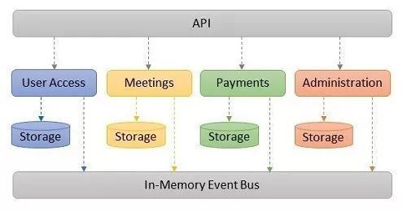

一个最近由 Kamil Grzybek 在 Github 发布的项目，给出了使用领域驱动设计（DDD，Domain-Driven Design）方法设计并实现一个单体（monolith）应用的详细介绍。该项目的目标，就是展示如何以模块化方式设计并实现一个单体应用。此外，Grzybek 还基于他在应用开发实践的收获，给出了一些有用的架构建议和设计模式。

Grzybek 是华沙 ITSG Global 的一位系统架构师，并担任团队负责人。他指出，该项目的目标并非是要创建一个极简应用，或是一个验证原型（PoC，proof of concept），而是给出一种适用于生产环境的完整实现。该项目的动机，来自于 Grzybek 对一些类似的但并未取得成功的项目的审视。在他看来，大多数示例应用过于简单，或是不够完整。他一直认为，这些应用至少在某些部分上存在着设计和实现上的问题，或是存在着相关文档缺失的问题。

Grzybek 强调指出，他的实现只是解决类似业务问题的许多方法之一。系统的软件架构需考虑多种因素，例如功能要求、质量属性和技术约束等，另一方面也会受开发人员的经验、技术约束、时间和预算等因素的影响，所有这些因素都会影响解决方案。

该应用针对的是为大多数开发人员所认可的会议组（meeting group）领域。应用实现中考虑了额外的复杂性，因此相比基于 CRUD 的常规应用更具意义。Grzybek 将主领域进一步划分为四个子域，即会议、支付、管理，以及用户访问。

为给出领域所需的功能，Grzybek 采用了一种称为“事件风暴”（ Event Storming ）的方法。该方法由 Alberto Brandolini 建立，用于探索复杂业务领域。Grzybek 使用该方法在主领域的各子域中发现行为和事件。

从更高层次上看，该架构中定义了一个 API 层、包含存储的四个模块（分别对应于所发现的四个子域），以及一个用于通信的公共事件总线（EventBus），如下图所示。

模块也相应地划分为四个子模块，并分别实现为独立的二进制文件，分别为：处理所有请求的 Application、实现领域逻辑的 Domain、实现基础架构代码的 Infrastructure，以及在 EventBus 上发布事件并且是模块间唯一共享组件的 IntegrationEvents。Grzybek 使用了 Decorator 模式，实现添加工作单元（ Unit of Work ）和日志等交叉关注点（cross-cutting）。

为分离应用内部的命令和查询，Grzybek 使用并实现了 CQRS 的一种变体。该 CQRS 变体针对命令所涉及的同一数据库表，在查询中使用了原始 SQL 和视图。虽然 CQRS 还具体其他变体，但 Grzybek 力图避免使应用过于复杂化。

模块间的集成是基于异步事件传输的。事件传输使用了“发件箱模式”/“收件箱模式”（ outbox and inbox pattern ），以及基于内存中的 EventBus 代理。为存储要发布的事件，发件箱模式在数据存储中添加了独立的表。事件的添加，实现中通过执行任务的命令，以及等同于命令的事务。此后，这些事件通过单独的流程，转发到另一个模块的收件箱中。在该项目中，事件传输是通过各模块中的后台 Worker 实现的。该实现提供了多次交付和处理。

最后，Grzybek 强调该项目仍在开发中，欢迎贡献者的加入。项目是使用 C# 编写的.NET Core 应用，使用了像 Autofac （用于 IoC ）、 Dapper (一种用于读取模型的 MicroORM ）之类的类库。项目中还包括基于 Arrang-Act-Assert 模式的测试，使用 NUnit 实现。

在与 InfoQ 的访谈中，Grzybek 进一步详细介绍了他的设计理念。

InfoQ：相比基于微服务的设计，您如何评价单体应用的模块化设计？

**Kamil Grzybek：**与微服务体系架构相比，模块化单体应用的主要差别之处在于部署方法和模块间通信。

在微服务架构中，每个模块都以独立的进程运行。模块间的通信必须使用网络实现，并且通常通过同步服务 API 调用（即 RPC，远程过程调用），或是使用代理（即消息传递）实现。微服务架构是一种分布式系统，具有分布式的所有优点和缺点。对于模块化单体应用，则无需考虑分布式系统。所有模块均以同一进程运行，无需使用网络即可相互通信。各模块可以通过方法调用直接同步引用内存中对象，或是异步地使用运行于同一进程中的某个中介者（Mediator）。

InfoQ：相比其他解决方案，例如一些消息传递平台，使用 EventBus 和发件箱 / 收件箱模式具有哪些优缺点？

**Grzybek：**模块化单体应用的主要优点，是开发人员无需使用任何消息平台，因为大多数功能都可以使用现有的设计模式在内存中实现。模块化单体应用本身可担当此类平台。当然，对于更高级的系统，使用独立的平台可能是更好的解决方案。但做出此决定时，必须谨慎。

InfoQ：您在 CQRS 模式的实现中，使用了视图和原始 SQL，而非单独的表。对此您能详细介绍一下吗？

**Grzybek：**我的方法虽然是一种最简单的 CQRS 实现，但其功能强大，通常完全够用。使用视图是应用和数据库之间的一种抽象和契约形式。开发人员可随时进入 CQRS 实现的下一层，读取应用逻辑可以保持不变。

下一层是物化视图。物化视图加快了读取的速度，但会导致写入性能略有下降。一些最先进的系统对于扩展性要求极高，它们引入了 CQRS 模式的最高层实现，并异步更新读取模型。这就是“最终一致性”。

每个实现层，都会增加解决方案的复杂性，因此，只有在真正需要时，我们才应去动更高的层。

## 项目架构

模块描述：

- API：很薄的一层REST API应用
  - 接受请求
  - 通过用户权限模块认证请求
  - 给特定模块委托工作（命令 或 查询）
  - 返回响应

- 用户认证
- 会议
- 管理员
- 付款
- 内存事件总线

优点：

1. API不包含应用逻辑
2. API通过一个简单接口和模块交互，发送查询和命令请求
3. 每个模块有自己的接口
4. 模块之间只使用事件总线异步调用，不允许直接方法调用
5. 每个模块有自己独立模式的数据，不允许公用数据
6. 每个模块只依赖集成事件，集成事件依赖其它模块
7. 每个模块有自己的聚合根，每个模块有自己的控制反转容器
8. 每个模块有自己的初始化方法，API中调用
9. 每个模块高内聚，只有必要的成员是公开的

每个模块有一个清洁的架构，包含：

- 应用
- 领域
- 基础设施
- 领域事件

API通过两种方式与模块层交互：

1. 模块初始化
2. 请求处理

模块请求通过CQRS（命令查询分离）实现

- 命令通过写对象（领域驱动设计战术模式实现）处理
- 查询通过读对象（在数据库视图上使用原生SQL）处理

优点：

- 单一职责原则
- 接口隔离原则
- 参数对象模式，易于序列化/反序列化
- 易于通过装饰器模式实现面向切口编程
- 通过中介者模式实现松耦合

领域对象理念优点：

1. 高度封装
2. 简单对象，不依赖基础设施、数据库
3. 充血模型，行为丰富
4. 基本类型偏执少（聚合在值对象中）
5. 业务语言
6. 易于测试

面向切面概念：

- 用装饰器模式实现了面向切面编程，满足单一职责原则和“不重复造轮子”概念
- 每个命令处理类都被日志、认证和工作单元装饰

